# Architettura ed Evoluzione di AstroCausal Engine

**🇮🇹 Italiano** · [🇬🇧 English](ARCHITECTURE_DEEP_DIVE.md)

> [!WARNING]
> Questo documento non spiega la macrostruttura di base del repository e dà per scontati termini di importanza vitale come il DT o il raggio di simulazione. Per una lettura più chiara si consiglia di recuperare prima almeno il [Modello Fisico](README.it.md#modello-fisico) e l'[Architettura Software](README.it.md#architettura-software) dal README.


Questo progetto nasce con una filosofia precisa. L'architettura l'ha inseguita evolvendosi più volte, alla ricerca del compromesso tra rigore fisico e velocità computazionale in tempo reale sulla sola CPU. Tutto ruota attorno a un'idea sola: una porzione di spazio 2D simulato in cui l'informazione gravitazionale viaggia e si propaga alla velocità della luce *c*. Non è un modello newtoniano con la causalità aggiunta come feature: è un modello causale che si abbassa al newtoniano dove la fisica lo consente, per efficienza.

Questo documento ripercorre i problemi reali incontrati durante lo sviluppo, i tentativi falliti e le soluzioni che hanno retto.

### Indice

1. [La scelta di Python e il paradigma DOD + JIT](#1-la-scelta-di-python-e-il-paradigma-dod--jit)
2. [Il Ring Buffer e lo storico delle posizioni](#2-il-ring-buffer-e-lo-storico-delle-posizioni)
 - 2.1 Struttura e dimensionamento dei buffer
 - 2.2 Come la fisica interagisce con i buffer
 - 2.3 Il lato visualizzato: il graphics kernel
 - 2.4 Il rebuild: come lo storico sopravvive ai cambi di parametri
3. [Il rendering delle heatmap e la gestione degli FPS](#3-il-rendering-delle-heatmap-e-la-gestione-degli-fps)
 - 3.1 Il budget di frame: i 60 FPS come target
 - 3.2 La prima heatmap: il potenziale Φ
 - 3.3 La seconda mappa: da Φ a dΦ/dt
 - 3.4 Le mappe derivate: Tidal, Roche, Lagrange e GW Strain
4. [Il PerformanceManager: auto-tuner con memoria e isteresi](#4-il-performancemanager-auto-tuner-con-memoria-e-isteresi)
5. [Collisioni, buchi neri e singolarità](#5-collisioni-buchi-neri-e-singolarità)
6. [Il garbage collector asincrono dei corpi causalmente morti](#6-il-garbage-collector-asincrono-dei-corpi-causalmente-morti)
7. [La sonda LIGO: architettura di campionamento e dump](#7-la-sonda-ligo-architettura-di-campionamento-e-dump)
8. [Le scie dei corpi](#8-le-scie-dei-corpi)
9. [L'architettura di main_gui e dell'UI](#9-larchitettura-di-main_gui-e-dellui)
 - 9.1 Dal monolite all'architettura a moduli
 - 9.2 Lo spawner interattivo e l'interceptor adapter
 - 9.3 La sequenza di bootstrap del processo principale
10. [La GameConsole: intercettore di stdout con timestamp di simulazione](#10-la-gameconsole-intercettore-di-stdout-con-timestamp-di-simulazione)
11. [La splash di caricamento: Tkinter prima di pygame con print interceptor thread-local](#11-la-splash-di-caricamento-tkinter-prima-di-pygame-con-print-interceptor-thread-local)
12. [Il launcher Tkinter](#12-il-launcher-tkinter)

---

## 1. La scelta di Python e il paradigma DOD + JIT

Python base è criticato per le pessime prestazioni su iterazioni pesanti, `for` annidati e operazioni su tensori. Si dimentica però che il suo vero valore sta nella sintassi pulita e nelle librerie esterne che riducono molto le problematiche. Come Numpy che è ottimizzato in C e Numba che permette di compilare parti di codice direttamente in LLVM, la stessa infrastruttura di compilazione su cui poggia il C++ moderno. Questo consente di usare la programmazione di basso livello dove serve e la potenza astrattiva dell'OOP per l'impalcatura esterna. Dei piccoli limiti strutturali nonostante tutto rimangono, come l'assenza di controllo assoluto sui puntatori e sul garbage collection manuale che un C++ avrebbe offerto, ma il compromesso è stato accettabile.

### Il problema concreto: liste Python e cache miss

I primi prototipi erano in Python OOP puro. La misurazione diretta dell'inefficienza strutturale ha reso chiaro il problema: le liste Python sono di fatto array contigui di puntatori a oggetti sparsi nell'heap. Ogni accesso agli elementi genera cache *miss* continui. Numpy risolve questo creando array C contigui che contengono direttamente i dati primitivi in memoria. Questo permette al prefetcher della CPU di anticipare il caricamento in background delle righe di cache successive in modo sequenziale, sfruttando al massimo la banda della memoria e riducendo drasticamente i miss di cache durante lo scorrimento del tensore.

### I tentativi: il Broadcasting NumPy

L'implementazione Numpy tramite Broadcasting è stata il primo approccio al problema. L'idea era sfruttare l'**operator overloading** di Numpy, che intercetta gli operatori nativi Python (`+`, `*`) sulla classe `ndarray`, per trattare l'intera mappa di pixel della heatmap come una variabile matrice e moltiplicarla per vettori 1D. Il broadcasting di Numpy allinea automaticamente le shape diverse in quell'operazione, così da risolverla in C puro. Il problema, però, risiede nelle allocazioni di array intermedi (temporary buffers): ogni operazione vettorizzata, come `*` o `+`, alloca un nuovo intero buffer C nell'heap per contenere il risultato. In catene di operazioni all'interno di loop esterni Python, questa continua allocazione/deallocazione di grandi blocchi di memoria satura la banda della RAM e genera pressione sul garbage collector, impedendo di sfruttare appieno la cache CPU. Serve una compilazione *just-in-time* (come Numba) che fonda queste operazioni (loop fusion) in un unico kernel C senza passare per array intermedi.

### La svolta: Numba e la scelta dei prange

Con il fallimento del Broadcasting, l'unica svolta reale è stata Numba. I cicli più critici sono stati riscritti decorandoli con `@njit(parallel=True, fastmath=True, cache=True)`:

- **`fastmath=True`**: dice al compilatore LLVM di ignorare alcune regole rigide dello standard IEEE 754 (non controlla costantemente NaN o infiniti, riorganizza le operazioni algebriche per renderle più veloci). Questo permette alla CPU di usare istruzioni matematiche vettoriali molto più aggressive. Conseguenza pratica importante: non essendo più affidabili `NaN`/`inf` come marcatori (il compilatore non li garantisce più), tutto il codice usa un valore sentinella *finito*, `VOID_VAL` (un numero enorme e negativo), per segnalare slot vuoti o corpi morti; i controlli diventano confronti finiti del tipo `valore > VOID_VAL`, sempre validi anche con fastmath (vedi §2).
- **`cache=True`**: salva il codice compilato su disco. Senza questo, ogni avvio del motore richiederebbe un freeze di compilazione. Con la cache, le esecuzioni successive partono all'istante.
- **`parallel=True`** è il parametro più delicato. Abilita il motore di parallelizzazione di Numba. Da solo, parallelizza automaticamente alcune operazioni vettoriali e riduzioni su array NumPy (es. somme, moltiplicazioni elemento per elemento). Tuttavia, per i loop scritti esplicitamente in Python che contengono logica personalizzata, è necessario marcarli con `prange()` per istruire il compilatore su quali iterazioni possono essere eseguite in parallelo. La scelta architetturale concreta è quindi decidere quali loop complessi esprimere come `prange` e quali lasciare come semplici `range`, delegando all'auto-parallelizzazione quelli più banali.

Il loop del **[Velocity Verlet (§4.1 della Guida Fisica)](PHYSICS_AND_SCENARIO_GUIDE.it.md#41-lo-schema-di-integrazione)** (lo schema d'integrazione numerica che fa avanzare le orbite passo dopo passo) per la fisica dei corpi ha fasi distinte, ciascuna con un profilo di costo e di parallelismo diverso:

| Fase | Operazione | Complessità | Parallelismo |
|:---:|---|:---:|:---:|
| **1** | Aggiornamento posizioni + primo half-kick velocità | $O(N)$ | sequenziale (barriera) |
| **2** | Forze gravitazionali causali tra tutti i corpi | $O(N^2)$ | `prange` (se $N > 35$ ) |
| **2.5** | Secondo half-kick velocità | $O(N)$ | accodata nel `prange` di Fase 2 |

All'inizio `prange` era applicato su tutte le fasi. Non era la soluzione più performante. Le fasi a complessità lineare ($O(N)$) sono talmente rapide che il tempo speso a lanciare e sincronizzare i thread supera il calcolo stesso su un singolo core. Il parallelismo ha senso solo per la Fase 2 ($O(N^2)$, il collo di bottiglia reale), con la Fase 2.5 che si accoda dentro lo stesso `prange` senza costi aggiuntivi di lancio. La Fase 1 resta sempre sequenziale: oltre a essere $O(N)$, è imperativo che le sue scritture nei buffer siano completate prima delle letture causali della Fase 2 (barriera read-after-write). Ma anche la parallelizzazione della Fase 2 non è incondizionata: sotto i ~35 corpi (soglia ricavata empiricamente e valutata sulla capacità dello scenario al momento del rebuild) l'overhead dei thread domina ancora sull'$O(N^2)$ stesso, quindi `engine.py` reindirizza l'intera fisica verso una versione interamente sequenziale.

I file con i loop caldi e pesanti del progetto, rinominati come *kernel fisici*, non lavorano con classi o oggetti. Leggono e scrivono direttamente su `data.py` che contiene principalmente array 1D contigui dove l'indice rappresenta l'identità del corpo celeste. Questo layout piatto è la condizione ideale per il compilatore LLVM: elimina l'allocazione di oggetti NumPy temporanei dentro i loop caldi.

Questo ha un rovescio della medaglia. Il cuore fisico del motore (forze causali, dead reckoning ossia l'estrapolazione della posizione dalla velocità nota, contributi di campo, collisioni) vive in **un solo file**, `kernel_helper_inline.py`, espanso via `inline='always'` dentro ogni kernel critico. Grazie all'inlining, ad essere duplicata nel codice compilato è la **fisica** (il corpo della funzione) in ogni kernel chiamante, mentre lo scaffolding (l'overhead di chiamata e il passaggio parametri) viene eliminato a tempo di compilazione. Nel sorgente la formula resta scritta una volta sola: modificarla è comodo, perché la modifica si propaga automaticamente a tutti i kernel alla compilazione successiva. Il costo in manutenzione arriva quando si cambia la **firma** (i parametri), perché bisogna aggiornare manualmente tutte le chiamate nei vari kernel in cui la funzione viene espansa inline. La campagna **[2.5PN](PHYSICS_AND_SCENARIO_GUIDE.it.md#63-come-viene-usato-il-25pn-nel-simulatore)** (reazione di radiazione in forma Damour-Deruelle) ne è stata la prova: allargare la firma di `compute_relativistic_force` ha imposto di rimettere mano a ogni variante che la richiama. 

> [!IMPORTANT]
> La duplicazione è una scelta intenzionale. Per far girare i kernel senza rallentamenti è stato necessario eliminare qualsiasi `if` o logica condizionale dentro i loop caldi dove possibile: ogni branch nel ciclo $O(N^2)$ costa cicli moltiplicati per miliardi di iterazioni. `engine.py` fa da smistatore esterno (formalmente un wrapper): la selezione del kernel (single/double/triple, parallelo/sequenziale) avviene **una volta sola**, dentro `refresh_kernel()`, che gira all'init e a ogni rebuild e assegna `self.tick` alla funzione concreta come puntatore a funzione. A runtime `self.tick(steps)` è quindi una chiamata diretta senza nessun `if` di selezione: si è scelto il kernel monolitico giusto a monte, invece di ramificare *per ogni coppia* dentro il loop. È un approccio faticoso, che sacrifica la comodità di manutenzione per spremere quanti più FPS possibili. È la filosofia tipica dell'HPC. L'autore non ha l'autorità per definire questo codice come standard industriale, ma è la direzione e l'intento ingegneristico dietro queste scelte.

L'inlining (`inline='always'`) sui kernel helper dentro tutti i loop critici sia fisici che grafici è stato vitale per lo stesso motivo. Passare firme dati enormi a funzioni esterne confonde LLVM o rallenta l'esecuzione. Con `inline='always'`, Numba espande fisicamente il corpo delle funzioni helper dentro il ciclo chiamante a tempo di compilazione: zero overhead di chiamata a funzione a runtime, senza sacrificare la leggibilità del sorgente in fase di sviluppo.

> [!NOTE]
> **Un rammarico onesto: test automatici mai scritti.** Questo progetto è stato, di fatto, un corso accelerato e pratico di programmazione e progettazione software per l'autore. Il rammarico più grande, però, non riguarda i test sulla fisica: quella viene rigorosamente testata runtime, confrontando l'output del motore con dati reali (GWOSC, relatività numerica SXS, formula di Peters, come documentato nella Guida alla Fisica). Riguarda l'assenza di test automatici sulla sola **correttezza della pipeline di formule**, indipendente dalla bontà fisica del modello. Sarebbe bastato sostituire ogni variabile di una formula con lo stesso valore fisso (es. 1,5) e verificare che il codice restituisse esattamente il numero atteso dal calcolo a mano. Un test del genere avrebbe stanato all'istante un refuso di trascrizione (una variabile scambiata, un segno, un esponente), invece di scoprirlo mesi dopo per ispezione manuale. Se fosse stato fatto fin dal principio, si sarebbero risparmiate ore di debug.

### Come l'architettura abbatte i cache miss

Il layout di `data.py` è uno **Struct of Arrays (SoA)**: invece di un unico array di oggetti `CelestialBody`, esistono array separati e contigui per ciascun attributo fisico (`POS`, `VEL`, `ACC`, `MASS`, `RAD`, `FLAGS`). Questo è il pattern naturale del Data-Oriented Design.

Il vantaggio non è "tutti i dati del corpo `i` sono contigui": non lo sono, perché vivono in array separati. Il vantaggio è che **all'interno di un singolo array, gli elementi consecutivi sono contigui in memoria**. Una cache line da 64 byte porta in cache 8 valori `float64` in un colpo solo. Quando un loop scorre l'array in sequenza, il prefetcher hardware riconosce il pattern di accesso e carica la cache line successiva *prima* che il codice la richieda, spesso azzerando la latenza. Nel caso peggiore, un cache miss avviene ogni 64 byte di stream. Ne beneficiano i punti del motore che scorrono davvero gli array in sequenza: la Fase 1 dell'integratore (che aggiorna posizioni e velocità corpo dopo corpo, in ordine), il pre-passo del modulo collisioni, i kernel delle heatmap istantanee (Roche, Tidal, Lagrange), che per ogni pixel scorrono posizioni e masse di tutti i corpi.

Con OOP puro ogni oggetto `CelestialBody` è un puntatore che può puntare ovunque nell'heap: ogni accesso a un nuovo corpo è quasi garantito un cache miss, che costa tra i 100 e i 300 cicli di clock di latenza. Moltiplicato per $N^2$ interazioni a ogni tick, la differenza in termini di throughput è un ordine di grandezza.

Va detto con onestà dove questa analisi **non** basta. Nel ciclo caldo della Fase 2 gli array di stato corrente (posizioni, velocità, masse, raggi) rappresentano un working set minuscolo (~12 KB per N ≤ 200): il corpo ricevitore `i` li legge una sola volta all'ingresso del loop esterno e li promuove a variabili locali (registri), mentre per il corpo sorgente `j` servono solo come seed per la prima stima della distanza causale. Il loro costo di accesso è trascurabile. Il traffico di memoria dominante di quel loop sono le letture causali nei **buffer storici** L0/L1/L2, le cui dimensioni sono altamente variabili (dalle centinaia di KB agli svariati MB per singolo corpo) e si leggono a offset dipendenti dalla distanza, non in sequenza. È la complessa gestione di questi buffer a determinare il reale comportamento di cache del motore, con tecniche proprie descritte in dettaglio nella [gestione della cache di §2.1](#dimensionamento-orientato-alla-cache). La contiguità SoA resta comunque la precondizione: anche le righe dei buffer sono array contigui e ne ereditano i benefici al livello del singolo slot.

> [!NOTE]
> **Dove il broadcasting NumPy è invece la scelta giusta.** Il Velocity Verlet ha bisogno dell'accelerazione $a(t_0)$ già al primo passo: senza, il primo half-kick partirebbe da accelerazioni stantie. A ogni rebuild, `_prime_initial_accelerations()` calcola in un colpo solo le accelerazioni iniziali di tutti i corpi (Newton, Paczyński-Wiita ossia lo pseudo-potenziale per buchi neri e reazione di radiazione), **proprio con il broadcasting NumPy** scartato a inizio capitolo per il loop caldo. La contraddizione è solo apparente: il broadcasting fallisce nel ciclo $O(N^2)$ perché lì verrebbe eseguito milioni di volte al secondo, creando oggetti-array temporanei a ogni iterazione del loop esterno, ma è perfetto per un calcolo *one-shot* fatto una volta sola al rebuild, dove la pulizia vettoriale del codice vale più del costo degli oggetti intermedi. Lo strumento giusto dipende dalla frequenza d'esecuzione, non dallo strumento in sé.

Lo schema approfondisce, fase per fase, la scelta appena descritta tra `prange` e `range`. È solo uno dei due criteri con cui `refresh_kernel()` sceglie il kernel concreto: l'altro, la selezione del buffer single/double/triple, richiede la struttura dei buffer L0/L1/L2 non ancora introdotta ed è ripreso nel quadro completo di [§2.1](#21-struttura-e-dimensionamento-dei-buffer).

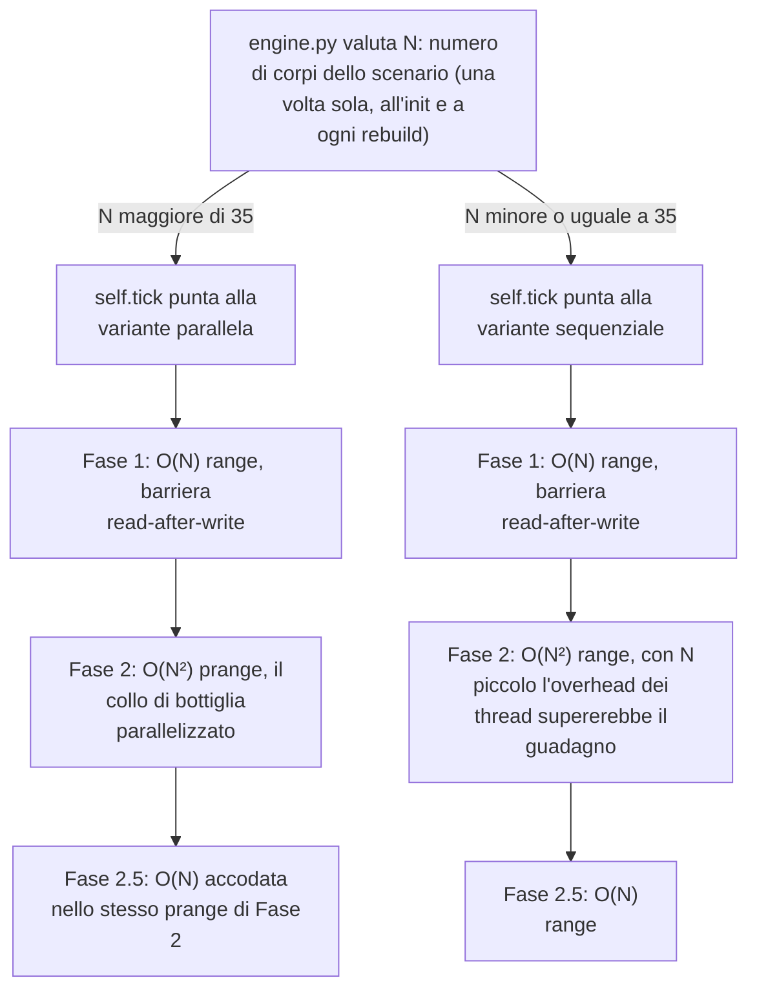

---

## 2. Il Ring Buffer e lo storico delle posizioni

> [!WARNING]
> **Avviso sulla nomenclatura: Livelli di Buffer vs Cache CPU**
> In questo e nei successivi capitoli verranno introdotte due gerarchie con nomi simili ma significati opposti. 
> 1. **L0, L1, L2** si riferiscono ai **LOD (Livelli di Dettaglio) dei buffer software** che mantengono lo storico delle posizioni.
> 2. **Cache L1, Cache L2, Cache L3** si riferiscono alla **gerarchia della memoria hardware** del processore.
> Per evitare confusione, il testo premetterà sempre la parola "Cache" quando ci si riferisce all'hardware (es. "Cache L3"), altrimenti si darà per scontato che le sigle L0/L1/L2 indichino i buffer circolari dello storico causale.

Nel primissimo prototipo il ritardo dell'informazione che viaggia a *c* era un flag booleano: diceva quando un corpo poteva "sapere" dell'esistenza di un altro, con l'ovvio limite che, una volta attivato il flag, la causalità veniva violata immediatamente. Serviva solo a mostrare l'onda di propagazione causale in scenari *what if*. Creando un corpo dal nulla, o facendo sparire il Sole, si vedeva l'onda propagarsi graficamente alla velocità della luce nella heatmap di Φ. Fisicamente lacunoso, ma graficamente già promettente. Il meccanismo fisico reale dietro questi fronti è il cono di luce, trattato nel [§2.1 della Guida Fisica](PHYSICS_AND_SCENARIO_GUIDE.it.md#21-il-cono-di-luce-e-il-diagramma-di-minkowski).

### 2.1 Struttura e dimensionamento dei buffer

#### Il problema concreto: interrogare il passato di ogni sorgente

Serviva un modo per permettere al corpo osservante di "sentire" il *passato* del corpo osservato, in proporzione alla distanza dettata dalla velocità della luce. Non un flag, ma uno storico temporale reale da cui estrarre la posizione passata di ogni sorgente gravitazionale.

#### I tentativi: il singolo buffer circolare e i due colli di bottiglia

È partito tutto con l'idea di implementare un buffer circolare Python, poi sostituito da un **singolo** buffer circolare C-like in Numba + NumPy. La versione Numba era già più veloce, ma soffriva di due gravi difetti strutturali:

1. **Il costo del modulo:** Per ricavare la testa del singolo buffer circolare veniva usato l'operatore modulo (`%`). Questo operatore richiede una divisione intera, che la CPU esegue in circa 15-30 cicli macchina. Moltiplicato per ogni accesso allo storico in ogni interazione $O(N^2)$, diventava un collo di bottiglia misurabile.
2. **La saturazione della RAM:** Essendo un singolo buffer monolitico, manteneva la stessa altissima risoluzione temporale (un campione ogni `DT`) per tutta l'estensione del raggio causale imposto dallo scenario (es. 64 AU). Con `DT` bassi (es. 1 secondo per step), il numero di slot necessari per coprire l'area alla velocità $c$ raggiungeva decine di milioni di elementi per corpo, saturando rapidamente l'intera RAM anche in scenari con un numero modesto di astri.

#### La soluzione: Matrice 3D, Masking e LOD temporale

**Il buffer come matrice 3D.** La struttura definitiva è `(numero_corpi, slot_storici_massimi, 5_parametri)`, dove la profondità temporale massima è decisa a monte dal raggio causale. Oltre tale raggio (rinominato *deep space*) il sistema è trattato come newtoniano istantaneo per troncamento. Ogni slot rappresenta un `DT` nel passato. Per estrarre i parametri fisici di un corpo distante al suo momento di emissione, non serve nessuna ricerca temporale iterativa: spazio e tempo sono fusi dalla costante $c$, quindi il ritardo temporale in tick è matematicamente calcolabile in modo diretto dalla distanza spaziale. L'accesso allo slot corretto diventa istantaneo $O(1)$.

```text
I 5 parametri memorizzati per ogni slot:
[ pos_x | pos_y | vel_x | vel_y | massa ]
```

**LOD (Level of Detail) temporale gerarchico.** Per risolvere il problema della RAM, lo storico monolitico è stato frammentato in tre buffer circolari sovrapposti con frequenze di campionamento diverse:

<div align="center">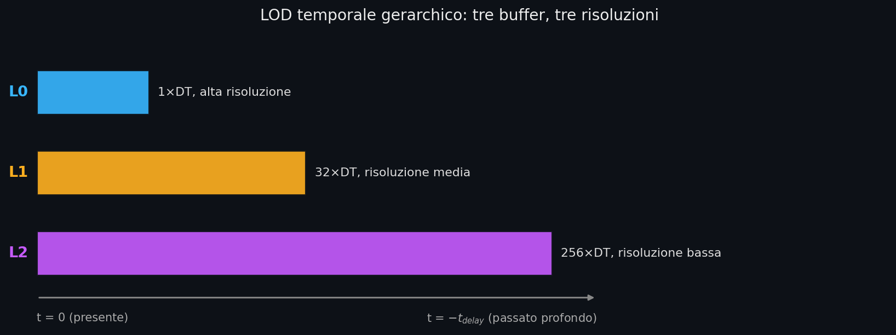</div>

- **L0**: campiona ogni tick. Massima risoluzione per interazioni ravvicinate.
- **L1**: campiona ogni 32 tick (scrittura solo quando `(head_0 & 31) == 0`). Copre le distanze intermedie.
- **L2**: campiona ogni 256 tick (scrittura solo quando `(head_0 & 255) == 0`). Conservazione causale profonda nello spazio vuoto.

È fondamentale sottolineare che, quando il sistema opera in modalità multi-buffer (DOUBLE o TRIPLE), **questi buffer coesistono simultaneamente in RAM** come array distinti. Non c'è alcun "cambio di scena" o caricamento dinamico: l'architettura mantiene allocata l'intera cronologia a risoluzione decrescente, mentre il kernel fisico vi naviga in tempo reale, saltando matematicamente da un array all'altro man mano che l'algoritmo di estrazione temporale si spinge più a fondo nel passato.

#### Dimensionamento orientato alla cache

I buffer storici sono il traffico di memoria dominante sia del loop caldo della fisica dei corpi (Fase 2, argomentata in [§1](#come-larchitettura-abbatte-i-cache-miss)) sia del loop caldo per la renderizzazione delle heatmap causali ([§2.3](#23-il-lato-visualizzato-il-graphics-kernel)). Il loro dimensionamento è quindi, prima di tutto, una strategia di cache.

`simulation_manager.py` sceglie a runtime la modalità (`SINGLE`, `DOUBLE` o `TRIPLE`) calcolando il footprint in RAM dell'**intero storico globale** (il totale degli slot necessari moltiplicato per tutti gli $N$ corpi attivi nello scenario) e confrontandolo con il 70% della cache L3 fisica rilevata sulla macchina. Questa soglia non è hardcoded: all'avvio `_get_cpu_details()` interroga il sistema operativo (WMI via PowerShell su Windows, `/sys` su Linux, `sysctl` su macOS) per leggere nome della CPU e dimensioni reali della cache L3. Così la stessa identica simulazione sceglie un'architettura di buffer diversa su PC diversi o persino su scenari diversi (se $N$ aumenta drasticamente, il numero massimo di slot del buffer `L0` si dimezza dinamicamente per garantire che l'intero blocco di tutti i corpi uniti non venga sfrattato dalla cache condivisa).

> [!NOTE]
> **Perché proprio la Cache L3 in modalità parallela? Nessun False Sharing.**
> A differenza delle cache L1 e L2 che sono tipicamente private per ogni singolo core, la cache L3 è *condivisa* (Shared Cache) tra tutti i core fisici e virtuali (SMT/Hyper-Threading) dello stesso processore. Quando Numba parallelizza la Fase 2 su più thread, l'intero pool legge dallo *stesso* storico causale globale. Poiché i buffer storici sono trattati in rigorosa **sola lettura** durante questa fase, non si verificano mai invalidazioni della cache o problemi di **false sharing** tra i core. Anzi: se il Thread A carica una riga di cache (64 byte) per leggere il passato di un dato corpo massiccio, quella riga entra nella Cache L3 condivisa e diventa un cache hit gratuito a latenza minima per il Thread B che sta computando un corpo vicino. Puntare alla Cache L3 garantisce che questo tesoretto di dati condivisi non venga continuamente sfrattato (evicted).

Il dimensionamento di partenza deriva strettamente dal raggio causale dello scenario. È affascinante notare come in queste strutture dati, esattamente come nella Relatività, misure apparentemente solo spaziali (il *raggio* causale in chilometri) diventino intrinsecamente misure di profondità *temporale* (numero di slot del passato) e viceversa, unite dalla costante matematica $c$:

```
raw_len = SIMULATION_RADIUS_KM / (c · DT)
```

La tabella sottostante schematizza la matrice logico-decisionale con cui `simulation_manager.py` risolve in frazioni di millisecondo il suo problema cardine: *"Quanti buffer circolari mi servono, e con quali limiti di slot, dato il budget della Cache L3 fisica del computer, il numero di corpi $N$ presenti e il raggio causale spaziotemporale $R$ da raggiungere?"*

| Modalità | Quando scatta | L0 | L1 | L2 |
|---|---|---|---|---|
| **SINGLE** | footprint L0 sotto soglia Cache L3 | copre tutto il raggio causale ( $2^{18}$ slot massimi con un solo corpo e 20 MB di Cache L3) | — | — |
| **DOUBLE** | footprint SINGLE supera la Cache L3 | cap dinamico ≤ 16.384 slot (fino a 1024 se popolato) | copre il resto, stride 32 | — |
| **TRIPLE** | neanche L0+L1 stanno in Cache L3 | cap dinamico | fisso a 2048 slot | copre il residuo, stride 256 (tetto $2^{28}$ celle, anti esaurimento memoria) |

Tutte le dimensioni vengono **arrotondate alla potenza di 2 immediatamente superiore**. Questo permette di sostituire l'operatore modulo con un'operazione bitwise AND:

```python
# Prima (costoso: ~20 cicli di clock)
idx = (head - ticks) % length

# Dopo (gratuito: 1 ciclo di clock)
idx = (head - ticks) & mask   # mask = length - 1
```

L'operazione `& mask` funziona solo se `length` è una potenza di 2: in quel caso, $\text{length} - 1$ ha tutti i bit bassi a 1 e l'AND tronca l'indice esattamente come farebbe il modulo, ma in un singolo ciclo macchina.

**L'allocazione: placeholder ultra-ECO.** All'importazione di `core.data` tutti gli array nascono con dimensione placeholder di un solo elemento, per azzerare il costo di caricamento del modulo. All'inizializzazione di un preset `ensure_capacity()` li espande su richiesta. È poi `rebuild_simulation()` a calcolare e allocare i buffer storici veri in base a raggio causale, DT e numero di corpi, con una protezione OOM (Out Of Memory) che intercetta l'esaurimento di memoria e lo presenta con un dialogo grafico di errore invece di un crash.

Scelta la modalità dei buffer, resta da decidere chi li attraversa. È `engine.py` ad assegnare il kernel fisico concreto per l'intera simulazione, combinando la modalità appena descritta (single/double/triple) con la variante di esecuzione già vista in [§1](#1-la-scelta-di-python-e-il-paradigma-dod--jit) (parallela/sequenziale). Il risultato finisce in `self.tick` come puntatore a funzione:

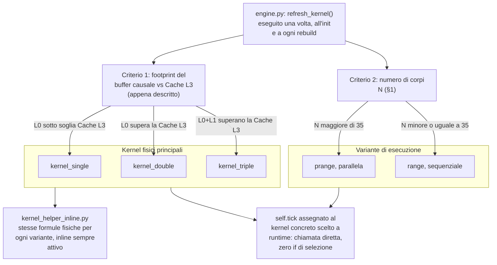

La ricerca nel buffer a cascata nei kernel helper segue questa logica: si calcola il ritardo in tick fisici, se rientra in L0 si legge da L0, altrimenti si scala su L1 o L2 riallineando logicamente l'indice. Tutto $O(1)$ .

#### Esempio pratico: ricerca a cascata nello scenario Terra-Sole (modalità TRIPLE)

- **Setup**: distanza Terra-Sole $= 499$ secondi-luce; $DT = 0.001\ \text{s}$ ; ogni slot del buffer rappresenta un $DT$ nel passato.
- **Ritardo richiesto in tick**: $499 / 0.001 = 499.000$ tick.

Il kernel tenta la lettura in cascata:

1. **L0** (cap 16.384 slot, stride $1{\times}DT$ ): copre fino al tick 16.384. Insufficiente → scala a L1.
2. **L1** (2048 slot, stride $32{\times}DT$ ): copre fino al tick $2048 \times 32 = 65.536$ . Ancora insufficiente → scala a L2.
3. **L2** (stride $256{\times}DT$ , dimensionato sul `simulation_radius` di default 64 AU): copre ampiamente. L'indice è $i = \lfloor 499.000 / 256 \rfloor = 1949$ .

Il 1949 è la **profondità in slot** rispetto alla testa di scrittura, non l'indice assoluto della cella: l'indice fisico nel ring è `(heads_L2[idx_sole] - 1949) & mask_L2`, con la bitmask vista sopra. È lì che si leggono i 5 parametri causali della sorgente.

#### Perché il buffer L2 in RAM non impatta le prestazioni

Per come è strutturata la matrice decisionale del `simulation_manager.py` discussa poco fa, il buffer `L2` viene allocato *esclusivamente* in modalità TRIPLE. Ma la modalità TRIPLE scatta proprio quando la somma di `L0+L1` ha già saturato l'intero budget della Cache L3. Di conseguenza, il gigantesco buffer `L2` è matematicamente e inequivocabilmente relegato allo spazio vitale della heap di sistema (la RAM ordinaria).

Ogni suo accesso che manca la cache è quindi un vero e proprio "Cache Miss" verso la RAM, un'operazione estremamente lenta (circa 100-300 cicli di clock di latenza, contro i 10-15 della Cache L3). Eppure, il motore non crolla. Per tre motivi:

1. **Rarità nei kernel fisici (Ammortamento del costo):** Il loop caldo della fisica scrive in `L2` solo una volta ogni 256 tick e lo legge solo per i corpi distanti. Nei sistemi compatti e caotici, dove la velocità di calcolo conta di più, il loop tocca raramente o *mai* `L2` e scorre con altissima frequenza il buffer `L0`, che invece è saldato in Cache L3. Le poche e costose letture dalla RAM si *ammortizzano* scomparendo nel mare di milioni di accessi a `L0` economici. Il singolo miss costa caro, ma è statisticamente rarissimo nella maggior parte degli scenari fisici.
2. **Economia del singolo accesso (Layout SoA):** Il graphics kernel può avere letture di `L2` molto più massive e frequenti rispetto alla fisica: ogni pixel della heatmap può interrogare corpi distanti, moltiplicando gli accessi per l'intera griglia. Ma l'implementazione Data-Oriented assicura che i 5 valori `[x, y, vx, vy, mass]` di ogni slot siano strettamente contigui in memoria (40 byte). Entrano tutti all'interno di una singola *cache line* da 64 byte: il processore paga un solo Cache Miss per slot, scaricando l'intero pacchetto gravitazionale della sorgente in un colpo solo. Anche quando le letture da RAM sono frequenti, ciascuna è la più economica possibile.
3. **Fisica (Il decadimento del raggio):** Sul piano numerico, quando `L2` viene finalmente letto, è per valutare l'attrazione di corpi tendenzialmente lontani. L'errore di campionamento indotto dallo stride ($256 \times DT$) è imponente, ma il contributo gravitazionale di quella sorgente sul corpo in esame decade drammaticamente come $1/r^2$. I due effetti si compensano a meraviglia: una risoluzione temporale grossolana è fisicamente accettabile proprio dove l'intensità della forza è flebile. È il compromesso perfetto per stivare storie temporali fino a Gigabyte in RAM senza inquinare la fisica locale.

#### La quantificazione dell'errore di campionamento

Il terzo motivo dell'elenco afferma una compensazione. Qui la si quantifica, partendo dalla natura dell'errore.

Quello dello stride è un errore di **discretizzazione**. Lo storico campiona la traiettoria continua della sorgente a passi di $s \cdot DT$: leggere lo slot più vicino quantizza il tempo di emissione. L'errore dipende quindi da quanto la sorgente si muove dentro un singolo passo ($\Delta x \le v \cdot s \cdot DT$): una sorgente ferma ha errore nullo con qualunque stride, una veloce paga il passo pieno.

Dall'errore di posizione a quello sulla forza il passaggio è una derivata. Con $F \propto 1/r^2$ , uno spostamento $\Delta x$ della sorgente perturba la forza, nel caso peggiore di spostamento tutto radiale, di:

$$\left|\frac{\Delta F}{F}\right| \approx \frac{2 \Delta x}{r} \le \frac{2 v s DT}{r}$$

Il conto esplicito, con una sorgente a 30 km/s e DT = 0,1 s, si valuta ai due confini di zona (dove lo stride è appena salito al valore nuovo mentre la distanza è ancora quella minima del livello). Al confine L0→L1 (3,3 AU, $4{,}9 \cdot 10^8$ km) lo slot può essere stantio fino a $32 \times 0{,}1 = 3{,}2$ s: la sorgente si sposta al massimo di $30 \cdot 3{,}2 = 96$ km, errore relativo $2 \cdot 96 / (4{,}9 \cdot 10^8) \approx 3{,}9 \cdot 10^{-7}$. Al confine L1→L2 (13,1 AU, $2{,}0 \cdot 10^9$ km) lo scarto massimo sale a $30 \cdot 25{,}6 = 768$ km: errore $2 \cdot 768 / (2{,}0 \cdot 10^9) \approx 7{,}8 \cdot 10^{-7}$. Meno di un milionesimo in entrambi i casi.

Il grafico estende il conto a tutte le distanze, sul raggio causale standard di 64 AU (DT = 0,1 s scelto perché tutti e tre i livelli convivano dentro il raggio). La curva è un limite superiore conservativo perché assume la geometria peggiore, con lo spostamento del campione tutto lungo la linea di vista.

<div align="center">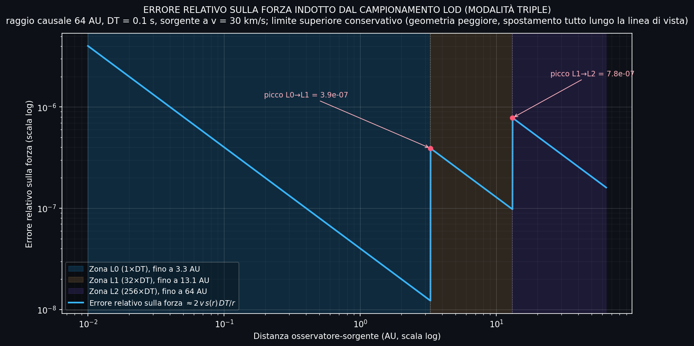</div>

### 2.2 Come la fisica interagisce con i buffer

#### Il doppio ritrovamento causale (due letture in cascata)

Il primo ritrovamento dei parametri causali trattato nel capitolo precedente nasconde una imprecisione: il ritardo in tick è stato calcolato dalla distanza **attuale** fra osservatore e sorgente, ma la posizione che conta è quella che la sorgente aveva **al momento dell'emissione**, che per corpi in moto non sempre coincide. È un'equazione implicita e la soluzione architetturale è volutamente non iterativa: **due letture O(1) in cascata**, non un solver.

1. **Prima lettura (stima).** Dalla distanza attuale si ricava un tempo di volo approssimato $r_{now}/c$ , lo si converte in tick e si legge lo slot corrispondente: ne esce una posizione ritardata *stimata*.
2. **Seconda lettura (ricalcolo).** Dalla posizione stimata si ricalcola la distanza vera da cui il tempo di volo vero, quindi un nuovo indice di slot: la seconda lettura restituisce posizione, velocità e massa all'istante di emissione effettivo. È su questi valori che procede il calcolo di forza, potenziale o quadrupolo.

Il metodo del primo ritrovamento è già stato mostrato coi numeri nell'[esempio Terra-Sole di §2.1](#esempio-pratico-ricerca-a-cascata-nello-scenario-terra-sole-modalità-triple). Lì però la coppia è così lenta che il secondo passo si limita a confermare lo slot. Per vedere il doppio ritrovamento lavorare davvero serve una sorgente veloce: un pixel della heatmap dΦ/dt che osserva una delle due stelle del preset *NS Binarie: Orbita Stabile* (due NS da 1,5 $M_\odot$ separate da 40.000 km) da 1 AU di distanza, con DT portato a 1 µs.

<div align="center">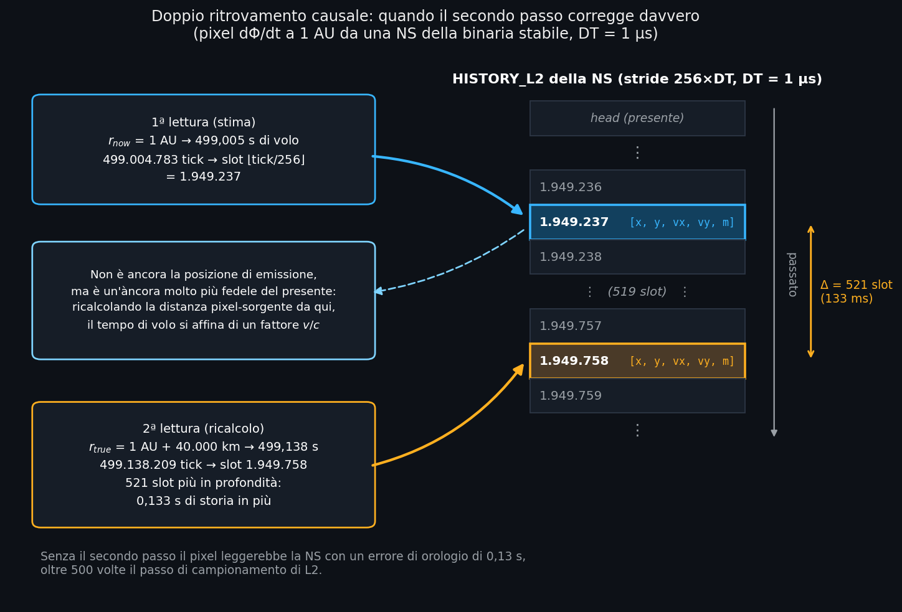</div>

Partendo dall'indice del primo ritrovamento:

1. **Stima**: $r_{now}$ = 1 AU equivale a 499,005 s di volo, cioè 499.004.783 tick. Lo slot L2 è $\lfloor 499.004.783 / 256 \rfloor$ = **1.949.237** (profondità dalla testa: head e bitmask completano l'indirizzamento, come nell'esempio di §2.1).
2. Quello slot restituisce la NS di 499 s fa. In quei 499 s la stella ha però percorso circa 6,3 orbite attorno al baricentro della coppia (periodo ~80 s): la sua posizione di emissione può trovarsi fino a 40.000 km più lontano (o più vicino) dal pixel rispetto alla posizione presente, l'intero diametro dell'orbita. Il passo seguente prende il caso più lontano.
3. **Ricalcolo**: $r_{true}$ = 1 AU + 40.000 km equivale a 499,138 s, cioè 499.138.209 tick. Il nuovo slot è $\lfloor 499.138.209 / 256 \rfloor$ = **1.949.758**.
4. La seconda lettura atterra **521 slot più in profondità**, 0,133 s di storia in più. Senza il secondo passo il pixel leggerebbe la NS con un errore di orologio di oltre un decimo di secondo, più di 500 volte il passo di campionamento di L2.

Per una coppia lenta come Terra-Sole i due indici coincidono e il secondo passo è una conferma. Qui la correzione è sostanziale ed è la ragione per cui il doppio ritrovamento esiste.

Matematicamente il doppio passo equivale a una singola iterazione di Picard sull'equazione del cono di luce, che per orbite ordinarie ( $v \ll c$ ) converge in un colpo (la trattazione fisica è nel [§3 della Guida Fisica](PHYSICS_AND_SCENARIO_GUIDE.it.md#3-aberrazione-causale-dead-reckoning-e-dinamica-relativistica)). Con la scelta di fermarsi a due passi il costo diventa **fisso e prevedibile** (due lookup bitmask per interazione, zero branch di controllo convergenza nel loop caldo). Sul lato fisico l'implementazione vive direttamente nel loop della Fase 2 dei kernel (`kernel_single/double/triple`): è il loop a eseguire le due letture e a passare lo stato ritardato già risolto a `compute_relativistic_force`, che vi applica dead reckoning, Paczyński-Wiita e 2.5PN. Sul lato grafico vive nelle funzioni `calculate_*_contribution` di `kernel_helper_inline.py`: le heatmap dΦ/dt e GW Strain eseguono il doppio ritrovamento completo esattamente come i kernel fisici, mentre le altre mappe usano approssimazioni più leggere (la gradazione completa è descritta in [§2.3](#23-il-lato-visualizzato-il-graphics-kernel)). Tutto è espanso via `inline='always'` come il resto del nucleo.

> [!NOTE]
> **Quanto guadagna la seconda lettura.** Il doppio passo è un'iterazione troncata, non un solver esatto: porta con sé un residuo. Un caso rettilineo lo misura in modo esatto, perché ammette il confronto con la soluzione analitica chiusa ([§5.1 della Guida Fisica](PHYSICS_AND_SCENARIO_GUIDE.it.md#51-il-tempo-di-volo-per-sorgenti-in-moto-rettilineo-formula-chiusa)): sorgente a 10.000 km, in allontanamento radiale a 30.000 km/s (circa $0{,}1c$ ), DT = 1 µs. Contro il tempo di emissione esatto $d_0/(c+v)$ = 30.322 tick, la sola prima lettura sbaglia di 3.034 tick; la seconda lo riporta a 304, un miglioramento di dieci volte. Ogni passo riduce l'errore di un fattore $v/c$ : dopo due letture il residuo relativo è dell'ordine di $(v/c)^2$ , qui circa l'1%. Alle velocità planetarie ( $v/c \approx 10^{-4}$ ) il residuo è $\sim 10^{-8}$ , ben sotto il singolo tick.

> [!NOTE]
> **Un'eccezione voluta: il bypass in regime GW.** La lettura della posizione di emissione descritta qui è la regola, ma c'è un caso in cui il kernel la salta deliberatamente. In campo forte (due corpi compatti vicini al merger/coalescenza) leggere la posizione di emissione introdurrebbe un'aberrazione che deforma il segnale del chirp; lì il kernel ignora il buffer e usa la posizione *presente* della sorgente, accettando di sacrificare la causalità su quella singola coppia per non sporcare la forma d'onda. Il bypass riguarda **solo il calcolo delle forze** tra i corpi: le heatmap, da osservatrici degli eventi, continuano a leggere la storia causale anche in pieno regime GW. È così che dΦ/dt disegna le spirali del merger. Fuori dal regime GW resta il dead reckoning del 2° ordine sulla posizione di emissione. Il dettaglio fisico è nel [§3.2 della Guida Fisica](PHYSICS_AND_SCENARIO_GUIDE.it.md#32-la-compensazione-dead-reckoning-ibrido).

#### La terza lettura: l'accelerazione ricostruita per il dead reckoning

Il suo scopo: in natura un corpo celeste A subisce una forza emessa da un corpo B nel suo stesso **passato**, eppure quella forza punta quasi sempre alla posizione **presente** di B, perché i termini di velocità del campo cancellano l'aberrazione ([§3.1 della Guida Fisica](PHYSICS_AND_SCENARIO_GUIDE.it.md#31-il-problema-dellaberrazione)). Una forza inchiodata alla posizione ritardata grezza perderebbe il fenomeno e inietterebbe una coppia fittizia che allarga le orbite fino a destabilizzarle. Il dead reckoning restituisce il comportamento reale: estrapola lo stato letto dal buffer in avanti sul tempo di volo, con lo sviluppo di Taylor di 2° ordine del [§3.2 della Guida](PHYSICS_AND_SCENARIO_GUIDE.it.md#32-la-compensazione-dead-reckoning-ibrido).

Lo sviluppo richiede posizione, velocità e accelerazione all'istante di emissione. Le prime due stanno nello slot da 40 byte, l'accelerazione no: il loop di ritrovamento la **ricostruisce al volo per differenza finita fra slot adiacenti**, leggendo le velocità dello slot uno stride più vicino al presente (o più profondo, se l'emissione è già in testa al livello) e dividendo per il passo che li separa. Salvarla nello slot avrebbe gonfiato ogni campione da 40 a 56 byte su tutti e tre i livelli: si è preferito pagare una terza lettura bitmask per interazione, sempre a costo fisso e senza branch. La ricostruzione appartiene ai soli kernel fisici (`kernel_single/double/triple`): il graphics kernel non applica dead reckoning, quindi la terza lettura non lo riguarda.

**Cosa se ne ricava in pratica.** Sulla sola fisica dei corpi, il prodotto finale del dead reckoning è una coppia di coordinate: il punto presente stimato a cui punterà la forza calcolata al tempo di emissione. La stima si porta dietro l'errore di campionamento già quantificato in [§2.1](#21-struttura-e-dimensionamento-dei-buffer) più quello della ricostruzione dell'accelerazione per differenze finite, entrambi trascurabili. Errori numerici a parte, ciò che il troncamento al 2° ordine lascia comunque fuori (il termine di jerk) ha una possibile lettura fisica, una dissipazione di energia orbitale affine al 2.5PN. Il tema è sviluppato nella [nota d'autore del §3.3 della Guida Fisica](PHYSICS_AND_SCENARIO_GUIDE.it.md#33-lequilibrio-tra-freno-e-spinta). Agli estremi il meccanismo degrada in silenzio: se lo slot vicino contiene `VOID_VAL` l'estrapolazione scivola al 1° ordine, con la sola velocità; se il ritrovamento fallisce del tutto si ripiega sulla posizione presente; in pieno regime GW il bypass della NOTE qui sopra scavalca l'intero meccanismo.

#### La prova visiva del doppio ritrovamento

Chiusa la parentesi sul dead reckoning, resta da mostrare il valore del doppio ritrovamento sul campo: non è un dettaglio da puristi, si vede a occhio. Le due immagini mostrano la stessa heatmap dΦ/dt sul preset GW170817 (la prima binaria di stelle di neutroni mai rivelata), prima e dopo l'introduzione del secondo passo (per approfondimenti sul fenomeno e sulla natura di questa specifica heatmap, si veda il [§7.2 della Guida Fisica](PHYSICS_AND_SCENARIO_GUIDE.it.md#72-variazione-temporale-dφdt)).

| Con la sola prima lettura | Col doppio ritrovamento |
|:---:|:---:|
| 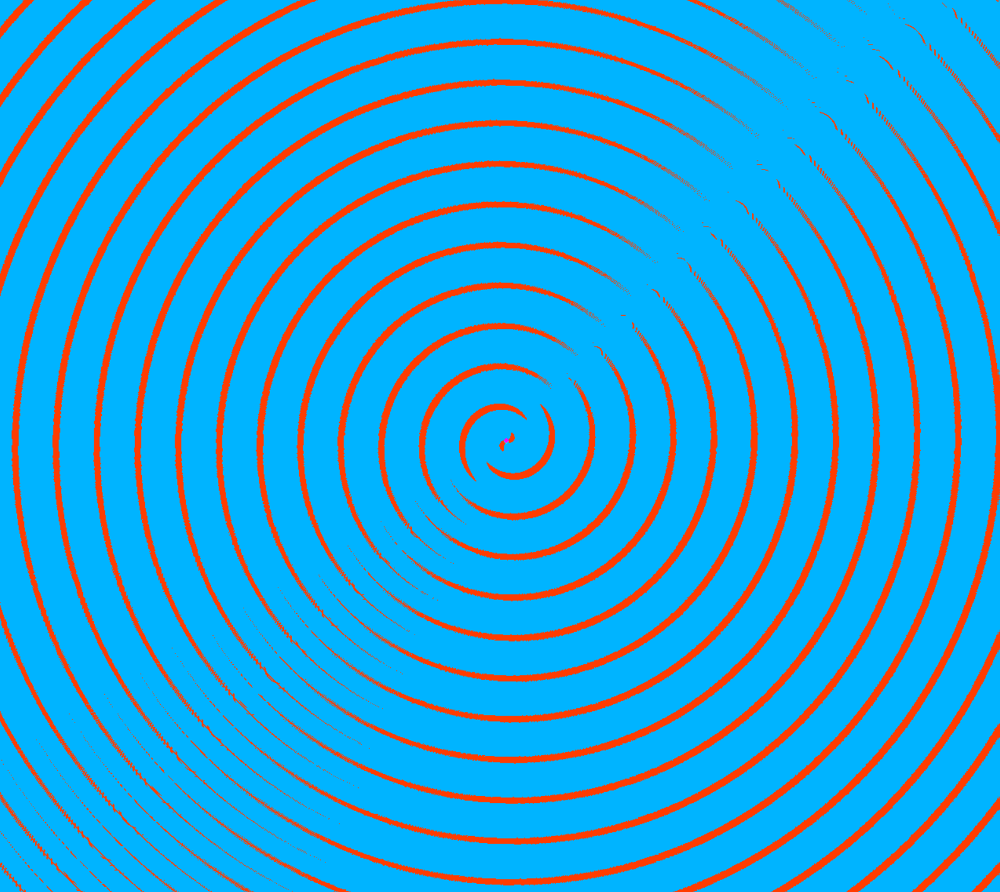 | 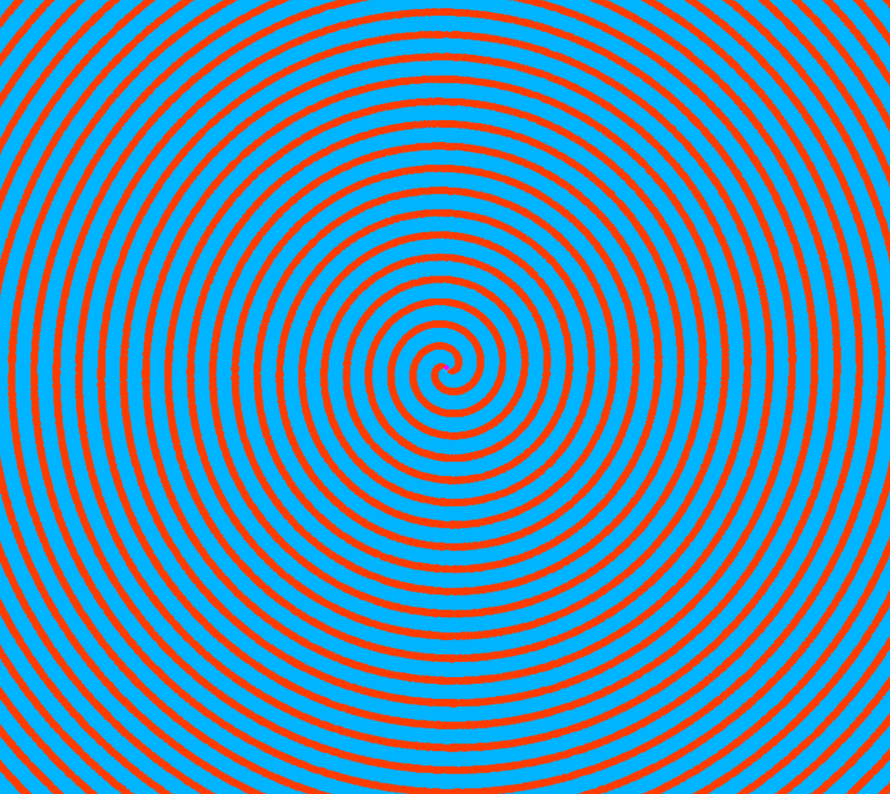 |

A sinistra l'errore di stima si organizza in un **asse nodale di discontinuità** ovvero un settore in cui i fronti si sfrangiano e saltano di fase, che a simulazione in corso ruotava rigidamente insieme all'orbita. A destra, col ricalcolo, l'asse scompare e resta la spirale di emissione pulita. Fu proprio quell'asse a rivelare il difetto. Una struttura rigida in rotazione trasporta la propria fase a velocità crescente col raggio: agli estremi supera $c$ , un'impossibilità causale intuibile a occhio nudo. È stata quella diagnosi a portare alla soluzione corrente del doppio ritrovamento. 

Questo massiccio esperimento visivo ci introduce verso il prossimo macro-tema: l'architettura del comparto grafico.

### 2.3 Il lato visualizzato: il graphics kernel

Le heatmap sono le mappe di campo sovrapposte allo spazio simulato (potenziale, marea, strain: il catalogo completo, dal lato fisico, è nel [§7 della Guida Fisica](PHYSICS_AND_SCENARIO_GUIDE.it.md#7-la-matematica-delle-heatmap)). Sono anche, di gran lunga, il carico computazionale più oneroso dell'intera parte grafica, per un motivo strutturale. Una heatmap non ricolora dati già calcolati dalla fisica: campiona il campo da zero, punto per punto, a ogni frame. Il costo è il prodotto di tre fattori:

- ogni frame valuta il campo su **ogni pixel della griglia**;
- ogni pixel somma il contributo di **ogni corpo attivo**;
- ogni contributo interroga i **buffer storici** al tempo di emissione, fino al doppio ritrovamento causale di [§2.2](#22-come-la-fisica-interagisce-con-i-buffer) per le mappe che lo richiedono.

Moltiplicando i tre fattori si arriva a decine di milioni di valutazioni di campo al secondo anche in scenari modesti. Pur girando una sola volta per frame, sul conteggio di operazioni la grafica supera così di ordini di grandezza il ciclo $O(N^2)$ della fisica. Questa sezione descrive l'impalcatura e la logica comuni a tutte le heatmap: dove leggono, come parallelizzano, quali accorgimenti ammortizzano il costo. I problemi specifici delle singole mappe (scelta delle scale, compressioni dinamiche, overlay co-rotanti) sono il tema del [§3](#3-il-rendering-delle-heatmap-e-la-gestione-degli-fps).

Il graphics kernel (`graphics_kernel.py`) legge dagli stessi buffer di [§2.1](#21-struttura-e-dimensionamento-dei-buffer), arrivando dove serve allo stesso doppio ritrovamento causale di [§2.2](#22-come-la-fisica-interagisce-con-i-buffer).

**Perché non è specializzato per modalità buffer.** A differenza dei kernel fisici (`kernel_single/double/triple`), il graphics kernel è **uno solo**: la cascata L0→L1→L2 è risolta a runtime dentro le funzioni di contributo (es. `calculate_potential_contribution`, `calculate_dphi_contribution`), con `if` sui livelli effettivamente allocati. La ragione è la **frequenza di esecuzione**. La fisica gira fino a 10.000 volte per frame dentro un ciclo $O(N^2)$ : lì ogni `if` di selezione buffer sarebbe colpito miliardi di volte al secondo, quindi va eliminato a monte specializzando tre kernel monolitici (vedi [§1](#1-la-scelta-di-python-e-il-paradigma-dod--jit)). La grafica gira invece **una volta per frame**, sui soli pixel visibili: gli stessi `if` vengono valutati ordini di grandezza meno spesso, senza il moltiplicatore degli step fisici per frame, quindi costano poco. Non giustificano di triplicare il codice grafico, che tra Φ, dΦ/dt, Roche, Tidal, Lagrange e GW Strain è grande e molteplice. Mantenerne tre varianti sincronizzate costerebbe molto per un risparmio marginale. È lo stesso principio asimmetrico di tutto il motore: si specializza dove il loop caldo lo impone, si generalizza dove il costo è trascurabile.

**La gradazione del rigore causale.** Non tutte le mappe causali pagano lo stesso prezzo per la lettura causale. dΦ/dt e GW Strain eseguono il doppio ritrovamento completo di [§2.2](#22-come-la-fisica-interagisce-con-i-buffer). La mappa Φ si ferma alla prima lettura, col ritardo stimato dalla distanza presente: un'approssimazione accettata per la mappa più statica della famiglia. Per le sorgenti oltre $0{,}5c$, dove quella stima degraderebbe, il kernel cambia strada e risolve il tempo di volo **in forma chiusa** con `solve_retarded_time`, la stessa equazione quadratica di intersezione col cono di luce che la Guida alla Fisica ricava nel [§5.1](PHYSICS_AND_SCENARIO_GUIDE.it.md#51-il-tempo-di-volo-per-sorgenti-in-moto-rettilineo-formula-chiusa). Oltre la copertura di L2 inizia il *deep space*: per Φ e dΦ/dt il contributo viene estrapolato linearmente all'indietro dalla velocità presente, mentre per GW Strain il contributo è azzerato di netto senza eccezioni (le onde gravitazionali non beneficiano di estrapolazioni inerziali). Anche in dΦ/dt c'è comunque una rete di sicurezza: sopra i 15.000 km/s di velocità recuperata il contributo deep space viene tagliato a zero, per prevenire un artefatto a spirale soprannominato "beyblade" (una trottola) nei commenti del codice.


> [!NOTE]
> **Il "fantasma del campo" dopo la morte di un corpo.**
> Quando un corpo muore (collisione, accrescimento), la fisica gli assegna il `FLAG_DYING` e ad ogni tick successivo inietta il valore sentinella `VOID_VAL` in testa al suo storico L0. Il corpo resta però nell'array `p_idx` finché il Garbage Collector asincrono non ne certifica l'estinzione completa. In questa finestra di limbo, il comportamento delle heatmap **diverge radicalmente** in base alla loro natura:
>
> - **Heatmap causali** (Φ, dΦ/dt, GW Strain): leggono i ring buffer e vedono ancora lo stato *passato* valido del corpo. Il fronte del `VOID_VAL` avanza nello storico a velocità $c$ e, man mano che raggiunge la distanza causale di ciascun pixel, il contributo si azzera. Il risultato è la manifestazione genuina del **cono di luce**: un cerchio che si espande a $c$ dall'evento distruttivo, fuori dal quale il campo persiste come se nulla fosse successo e dentro il quale il campo è già scomparso (il fenomeno è illustrato con diagrammi di Minkowski e dimostrazioni nel simulatore nel [§2.1 della Guida Fisica](PHYSICS_AND_SCENARIO_GUIDE.it.md#21-il-cono-di-luce-e-il-diagramma-di-minkowski)).
> - **Heatmap istantanee** (Tidal, Roche, Lagrange): non leggono alcun buffer storico e usano la posizione presente congelata nel punto dell'impatto. Il corpo morto resta **immobile e sommato** nel calcolo come un fantasma statico finché il GC non lo elimina da `p_idx`. È un artefatto architetturale, non fisica: il GC ritarda la rimozione perché il ciclo di vita è agganciato all'orizzonte causale a beneficio delle mappe che causali lo sono davvero. Per le mappe di coppia (Roche, Lagrange) il discorso si estende al frame co-rotante, che resta costruito su un partner ormai fermo. La trattazione completa è nel [§7.6.3 della Guida Fisica](PHYSICS_AND_SCENARIO_GUIDE.it.md#763-la-coalescenza-e-lartefatto-del-quadrupolo-nudo).

#### Riepilogo: le accortezze HPC nei loop caldi

I capitoli precedenti hanno introdotto le tecniche di ottimizzazione nel contesto in cui sono nate. Prima di lasciare i loop caldi, conviene raccoglierle in un unico prospetto, distinguendo quelle che attraversano l'intero motore da quelle che appartengono a un solo comparto.

**Tecniche condivise** tra kernel fisici (`kernel_single/double/triple`) e graphics kernel (`graphics_kernel.py`):

| Tecnica | Dove nel codice | Perché conta |
|---|---|---|
| **JIT + parallelismo Numba** `@njit(parallel=True, fastmath=True, cache=True)` | Tutti i kernel. `prange` sui corpi (fisica) o sulle colonne x (grafica) | Ogni thread scrive un blocco di memoria contiguo tutto suo, evitando il false sharing tra core ([§1](#1-la-scelta-di-python-e-il-paradigma-dod--jit)) |
| **Inlining forzato** `inline='always'` sui kernel helper | `kernel_helper_inline.py`, usato da tutti i kernel | Elimina l'overhead di chiamata a funzione nel ciclo caldo; LLVM ottimizza il codice come se fosse monolitico ([§1](#1-la-scelta-di-python-e-il-paradigma-dod--jit)) |
| **Loop senza divisioni** (reciproci precalcolati) | `inv_c`, `inv_dt`, `inv_c_dt`, `inv_cutoff_sq` passati dall'esterno | Una moltiplicazione costa 3-5 cicli di clock; una divisione 15-30. Nei loop da miliardi di iterazioni la differenza è misurabile |
| **Bitmask al posto del modulo** `& mask` | Ogni accesso ai ring buffer L0/L1/L2, sia fisici che grafici | 1 ciclo di clock invece di ~20. Possibile perché le dimensioni dei buffer sono forzate a potenze di 2 ([§2.1](#21-struttura-e-dimensionamento-dei-buffer)) |
| **Compattazione degli indici attivi** | `active_indices` (fisica), `p_idx` (grafica) | Il loop scorre solo i corpi vivi in un array denso, saltando a monte gli slot morti o vuoti |
| **Layout SoA (Struct of Arrays)** | `data.py`: array separati e contigui per ogni attributo fisico | Il prefetcher hardware riconosce l'accesso sequenziale e precarica la cache line successiva, spesso azzerando la latenza ([§1](#come-larchitettura-abbatte-i-cache-miss)) |

**Tecniche esclusive** del graphics kernel, dettate dalla natura del suo output (una texture da milioni di pixel):

| Tecnica | Dove nel codice | Perché conta |
|---|---|---|
| **Bit shift al posto della divisione intera** | `cx = width >> 1` per il centro schermo | Micro-ottimizzazione che nei kernel fisici non ha ragione di esistere (non operano su griglie di pixel) |
| **Filtro LOD sulle masse** (solo mappa Φ) | `ACTIVE_INDICES_LOD`, precalcolato al rebuild | Esclude a monte i corpi con massa sotto $10^{-6}$ volte il corpo dominante, il cui contributo al campo è impercettibile a scala di pixel. Riduce il fattore $N$ del costo per pixel |
| **Scrittura diretta `uint8` nella texture** | Tutti i kernel grafici | Niente immagine float intermedia da convertire: il colore è calcolato e scritto pixel per pixel nella matrice finale che va a Pygame |

È l'azione combinata e simultanea di tutte queste piccole accortezze a permettere a un motore di reggere milioni di calcoli gravitazionali relativistici al secondo sulla sola CPU, senza mai toccare la GPU.

### 2.4 Il rebuild: come lo storico sopravvive ai cambi di parametri

Tutto il capitolo ha guardato finora ai percorsi caldi, quelli eseguiti milioni di volte al secondo. Il rebuild è il loro opposto: un percorso freddo che gira poche volte per sessione e nel quale l'intero universo simulato viene smontato e rimontato da zero. Ogni cambiamento strutturale della simulazione passa da questo unico punto obbligato, l'orchestratore `rebuild_simulation()` di `core/simulation_manager.py`, che esegue nove fasi in sequenza rigida.

Gli inneschi sono quattro:

- **caricamento di un preset**: la prima costruzione dell'universo, eseguita nel thread della splash di avvio ([§9.3](#93-la-sequenza-di-bootstrap-del-processo-principale));
- **cambio di DT a runtime** (tasti `T`/`Y`): cambia la durata di ogni slot storico, quindi l'intera geometria temporale dei buffer;
- **spawn di un corpo nuovo** dallo spawner orbitale ([§9.1](#91-dal-monolite-allarchitettura-a-moduli)): il pool degli array deve crescere di uno;
- **rimozione definitiva di un corpo** certificata dal garbage collector ([§6](#6-il-garbage-collector-asincrono-dei-corpi-causalmente-morti)): il pool si compatta sui superstiti.

Nell'ultimo caso gli indici si spostano: dopo il rebuild `main_gui` riaggancia **per nome**, non per indice, le selezioni attive dell'interfaccia (il corpo seguito dalla camera, la coppia su cui è costruito l'overlay Lagrange), poi rigenera il kernel con `refresh_kernel()` ([§1](#1-la-scelta-di-python-e-il-paradigma-dod--jit)) e il renderer. Il `TOP_ATTRACTOR` dei corpi non ha bisogno dello stesso trattamento: la Fase 8 lo ricalcola comunque da zero per tutti. L'identità di un corpo attraverso i rebuild resta il suo nome.

La pipeline, con la Fase 5 come unico bivio:

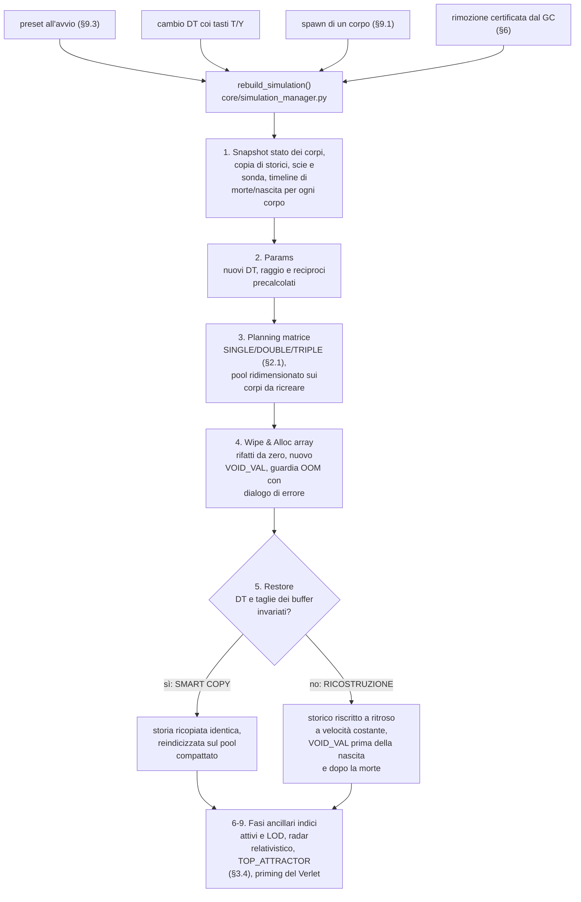

Il bivio della Fase 5 decide il destino della memoria causale. Se DT e dimensioni dei buffer non sono cambiati (il caso tipico del rebuild post-GC), la **smart copy** trasferisce ogni storico identico com'era, testa di scrittura compresa: le orbite passate sopravvivono al byte. In tutti gli altri casi la vecchia griglia temporale non esiste più (con un DT raddoppiato ogni slot vale il doppio dei secondi) e lo storico viene **ricostruito a ritroso a velocità costante** dallo stato presente di ogni corpo, `pos - vel·t` slot per slot, in NumPy vettorizzato. È la stessa routine che riempie i buffer alla primissima costruzione dell'universo, con una delicatezza da dichiarare: all'avvio ogni corpo parte con un passato rettilineo fittizio, scritto a ritroso come se avesse sempre viaggiato alla propria velocità iniziale. Per i corpi distanti decine di tick-luce le prime letture causali pescano quindi da una storia mai avvenuta. L'errore però non raggiunge le forze: su una traiettoria rettilinea l'estrapolazione del dead reckoning ([la terza lettura di §2.2](#la-terza-lettura-laccelerazione-ricostruita-per-il-dead-reckoning)) è esatta per costruzione (uno sviluppo di Taylor riproduce una retta senza residuo) e la forza punta comunque alla posizione presente corretta. La compensazione è totale e la storia vera rimpiazza quella fittizia tick dopo tick.

Alla stessa logica si piega la sonda LIGO ([§7](#7-la-sonda-ligo-architettura-di-campionamento-e-dump)): telemetria preservata intatta sotto smart copy, mentre al cambio di parametri il buffer viene salvato su disco da un thread separato (un file `.npy` in `ligo_output/data_npy/`) e poi azzerato, perché campioni presi con DT diversi non si concatenano in un segnale coerente.

**I morti attraversano il rebuild.** Il caso più delicato è il corpo con `FLAG_DYING`: distrutto, ma non ancora causalmente svanito. Nel limbo descritto dalla NOTE sul fantasma del campo ([§2.3](#23-il-lato-visualizzato-il-graphics-kernel)) la sua posizione resta congelata nel punto dell'impatto mentre il kernel inietta `VOID_VAL` in testa ai suoi storici a ogni tick: il fronte del vuoto avanza, ma la storia profonda è ancora viva e i pixel lontani vedono ancora il corpo. Se un rebuild arriva in quel momento, il corpo entra regolarmente nello snapshot (la posizione è valida) e `_detect_body_timeline` misura **da quanto tempo è morto**: percorre lo storico come un'unica linea temporale continua attraverso L0, L1 e L2 (scandendo di ogni livello solo la parte non coperta dal precedente) e conta la profondità del fronte di vuoto, `t_dead`. Alla ricostruzione quella misura viene reiniettata nella nuova griglia temporale: tutte le celle più recenti di `t_dead` tornano `VOID_VAL` anche se il DT è cambiato (nella smart copy non serve, il fronte viaggia già dentro la copia identica), il flag `FLAG_DYING` sopravvive nello snapshot e il kernel riprende a scavare il fronte esattamente da dove era rimasto. Il cerchio del fantasma continua a espandersi a velocità $c$ come se il rebuild non fosse mai avvenuto, finché il GC ([§6](#6-il-garbage-collector-asincrono-dei-corpi-causalmente-morti)) non ne certifica l'uscita dal raggio causale. La stessa meccanica, specchiata, protegge le **nascite**: un corpo spawnato da poco ha il suo `t_alive` e le celle più profonde della sua età restano `VOID_VAL`, senza regalargli un passato mai vissuto.

Smontato e rimontato l'universo, resta da disegnarlo: il [§3](#3-il-rendering-delle-heatmap-e-la-gestione-degli-fps) entra nel comparto del rendering, dove il campo calcolato dal graphics kernel diventa immagine a schermo.

---

## 3. Il rendering delle heatmap e la gestione degli FPS

Di seguito un riassunto della pipeline globale di `graphics_kernel` (il cui codice condiviso attraversa tutte le heatmap discusse di seguito):

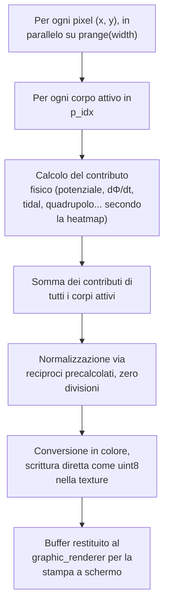

> [!IMPORTANT]
> Questo capitolo tratta le heatmap solo dal lato ingegneristico: kernel, risoluzione, FPS. Cosa *sono* fisicamente, cosa mostrano e come si leggono a schermo è il tema del [§7 della Guida Fisica](PHYSICS_AND_SCENARIO_GUIDE.it.md#7-la-matematica-delle-heatmap). A chi non le avesse mai viste si raccomanda di dare almeno uno sguardo superficiale prima di proseguire, perché tutto quello che segue dà per scontato il loro significato.

### 3.1 Il budget di frame: i 60 FPS come target

Il motore adotta un tetto di 60 FPS, modificabile o sbloccabile dal file `.ini`. Non è una scelta estetica ma un contratto sul tempo: a 60 FPS ogni fotogramma dispone di 16,6 ms, dentro i quali devono chiudere sia il motore fisico sia il rendering. Il costo teorico massimo di un frame, nel caso peggiore, è

$$\text{Costo per frame} = O(S \cdot N^2) + O(W \cdot H \cdot N)$$

dove $S$ sono i tick fisici eseguiti per frame (il moltiplicatore runtime, da 1 a 10.000), $N$ i corpi attivi, $W \times H$ la griglia in pixel della heatmap (la scomposizione del secondo termine è in [§2.3](#23-il-lato-visualizzato-il-graphics-kernel)). I due termini competono per gli stessi 16,6 ms: ogni millisecondo consumato dalla fisica è tolto al rendering e viceversa.

> [!NOTE]
> **O al posto di Θ, per convenzione.** Qui e nel resto del documento le formule descrivono il conteggio esatto di operazioni, non un limite superiore nel caso peggiore: la notazione formalmente corretta sarebbe Θ. Si mantiene comunque il simbolo O, più diffuso. Va anche detto che S, N, W e H sono manopole indipendenti impostate da utente e hardware, nessuna tendente davvero a infinito: non c'è un singolo ordine dominante da isolare, la somma dei due termini resta la forma corretta.

**L'accoppiamento TPS/FPS.** Fisica e grafica eseguono nello stesso thread, in sequenza, quindi sono strettamente vincolate. I tasti `1`-`5` non impostano i TPS ma i *tick fisici per fotogramma* ($S$): il rendering del frame parte solo dopo l'esecuzione esatta di quegli $S$ step. Per questo un collo di bottiglia nella fisica fa crollare il framerate (gli FPS aspettano), mentre una grafica troppo lenta ritarda la fisica abbassando i TPS effettivi. La relazione è $\text{TPS} = S \times \text{FPS}$ , col tetto teorico di 600.000 TPS a 60 FPS e moltiplicatore massimo.

I numeri che seguono sono misurati sull'hardware di riferimento dello sviluppo, un i5-13400F di fascia consumer.

**Quando satura la fisica.** Scontro fra Galassie Nane, 202 corpi, moltiplicatore al massimo (S = 10.000): il primo termine vale $10.000 \times 202^2 \approx 4 \cdot 10^8$ interazioni causali per frame. Sul processore di riferimento servono circa 0,33 s: il framerate crolla a 3 FPS anche con la heatmap spenta, cioè col termine grafico azzerato. Basta scendere a S = 100 perché il costo cali di cento volte: il frame rientra abbondantemente nel budget, con 60 FPS pieni e 6.000 TPS.

**Quando satura la grafica.** Il fattore $W \times H$ entra nella formula già dal launcher, con la scelta della risoluzione iniziale: una finestra QHD (2560×1440) impone 3,7 milioni di valutazioni di campo per heatmap per frame, contro il milione scarso del default 1200×800. La mitigazione principale è la **risoluzione dinamica della heatmap**: la griglia di calcolo viene divisa per un fattore `div` su entrambi gli assi, coi pixel scartati ricostruiti per interpolazione (`pygame.transform.smoothscale`, oppure `cv2.resize` per chi installa OpenCV, a preferenza dell'utente). Sulla stima del costo l'effetto è quadratico, perché `div` agisce su larghezza e altezza insieme:

$$O\!\left(\frac{W}{div} \cdot \frac{H}{div} \cdot N\right) = O\!\left(\frac{W \cdot H \cdot N}{div^2}\right)$$

In QHD la progressione è eloquente: 3,7 milioni di valutazioni a div = 1, poi 921.600 a div = 2, 230.400 a div = 4, fino alle 14.400 del fondo scala div = 16, un abbattimento di 256 volte. La scala si cicla a mano col tasto `G` oppure si delega all'auto-tuner del [§4](#4-il-performancemanager-auto-tuner-con-memoria-e-isteresi). Per la sola mappa Φ si somma il filtro LOD sulle masse di [§2.3](#23-il-lato-visualizzato-il-graphics-kernel), che aggredisce l'altro fattore del termine, $N$.

**Benchmark a carico misto: Scontro fra Galassie Nane.** DT = 150 s, S = 100, finestra 1200×800, div = 4 (la scala che l'auto-tuner sceglie da solo): 34 FPS stabili. La griglia effettiva è 300×200: 60.000 pixel per 202 corpi fanno $1{,}2 \cdot 10^7$ contributi grafici per frame, lo stesso ordine di grandezza del termine fisico ($4 \cdot 10^6$). Il carico è genuinamente misto. Tradotto in tempo: 3.400 TPS per 150 s simulati l'uno fanno 510.000 secondi simulati per ogni secondo reale, quasi sei giorni al secondo. Da questo equilibrio proposto dal motore, la leva passa all'utente:

- Serve più dettaglio grafico? Con S a 1× o 10× la fisica diventa irrisoria e la mappa può salire a risoluzione nativa (div = 1) restando nei 16,6 ms. Il prezzo è il tempo simulato, che scende all'incirca in proporzione al moltiplicatore.
- Serve recuperare velocità senza pagare in FPS? Il tasto `Y` raddoppia il DT: a parità di costo per tick, ogni raddoppio raddoppia la velocità del tempo simulato. Il prezzo qui è l'[errore di troncamento](PHYSICS_AND_SCENARIO_GUIDE.it.md#42-errore-di-troncamento) dell'integratore, che sulle scale planetarie resta trascurabile per parecchi raddoppi.

**Benchmark all'estremo grafico: GW170817.** DT = 1 µs, S = 10.000, QHD a risoluzione nativa (div = 1): 34 FPS medi, cioè 340.000 TPS che a 1 µs l'uno valgono 0,34 secondi simulati per ogni secondo reale. Qui la fisica è irrisoria (2 corpi, 40.000 interazioni per frame) e il budget lo consuma quasi tutto la griglia QHD. A 34 FPS l'auto-tuner resta fermo, perché la sua soglia di degrado è 30 FPS. Chi vuole i 60 scala a mano con `G` (div = 2) oppure riparte dal launcher in Full HD, più che sufficiente per un framerate pieno e stabile.

L'utente può agire su questo bilanciamento in ogni momento coi tasti `T`, `Y`, `G` e i numerici `1`-`5`. La guida operativa, con la tabella di recupero FPS, resta nella [sezione sulle prestazioni del README](README.it.md#limiti-del-modello-e-gestione-delle-prestazioni).

### 3.2 La prima heatmap: il potenziale Φ

La heatmap del potenziale $\Phi$ è stata la prima visualizzazione implementata, passata dall'essere estremamente lenta a girare con fluidità nel momento in cui è stata parallelizzata con Numba. La logica di base è sempre stata: stimare il $\Phi$ massimo atteso a un multiplo fisso del raggio di Schwarzschild dal corpo più massiccio presente in simulazione, usarlo come tetto della scala, normalizzare ogni pixel tra 0 e 1, infine convertire in colore per fasce. Prima si crea il range, poi si normalizza, poi si colora.

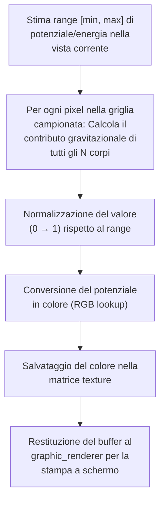

Viene renderizzato solo ciò che rientra nell'inquadratura della camera, mai a un dettaglio più fine del singolo pixel: regola valida per ogni elemento grafico del motore.

### 3.3 La seconda mappa: da Φ a dΦ/dt

#### Il problema concreto: rendere visibili le perturbazioni del campo

Con la heatmap $\Phi$ perfettamente funzionante, l'ipotesi successiva è stata che visualizzare la variazione di $\Phi$ *nel tempo* (non nello spazio: quello è il ruolo del gradiente $\nabla\Phi$ ) avrebbe reso visibili le perturbazioni del campo durante la fase di inspiral di oggetti estremamente massicci. L'obiettivo era un visualizzatore di onde gravitazionali, o quantomeno l'analogia sovrapponibile più fedele possibile in un modello scalare 2D.

#### I tentativi: confrontare due frame consecutivi

Il ragionamento iniziale era: prendere due frame di Φ consecutivi e confrontarli. Problema: confrontare due frame è costoso, dimezza il framerate, ma soprattutto dipende da `DT`. Se troppo basso il cambiamento tra frame potrebbe non essere visibile, se troppo alto si perde la definizione spaziale dell'onda. A quel punto il ragionamento da "architetto" è stato abbandonato in favore di una soluzione matematico-fisica, cercata procedendo per gradi.

#### La soluzione: la derivata parziale del campo

Qui un fisico sarebbe arrivato subito alla risposta; l'autore ci è arrivato passo passo, ragionando sull'intorno matematico di $\Phi$ diviso l'intorno del tempo, cioè la derivata parziale $\partial\Phi/\partial t$ in ogni punto dello spazio (la lettura fisica della mappa risultante è nel [§7.2 della Guida Fisica](PHYSICS_AND_SCENARIO_GUIDE.it.md#72-variazione-temporale-dφdt)). Da questo percorso a tratti empirico sono stati formulati la struttura e il metodo per tutte le altre [heatmap del campo](PHYSICS_AND_SCENARIO_GUIDE.it.md#7-la-matematica-delle-heatmap).

Concretamente: $\Phi = GM/r$ e quando la sorgente si muove la distanza $r$ cambia nel tempo. La derivata si riduce, per ogni sorgente, a $\partial\Phi/\partial t = G M v_{rad} / r^2$ , dove $v_{rad}$ è la componente della velocità lungo la linea che congiunge la sorgente al punto osservato. Il risultato è il "contributo $d\Phi$" di ciascun corpo a ciascun pixel, sommato su tutti i corpi, calcolato nei kernel helper con `inline='always'` e parallelizzato su tutta la griglia.

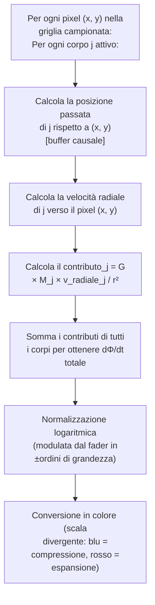

### 3.4 Le mappe derivate: Tidal, Roche, Lagrange e GW Strain

Da questa base sono poi nate le altre visualizzazioni del campo:

**Heatmap Tidal (stress di marea).** Più che una mappa tra le altre, è la base analitica su cui poggia l'intero ramo istantaneo (non causale) della famiglia. Il salto rispetto a dΦ/dt è matematico, non strutturale: lo scheletro del kernel resta identico (per ogni pixel, per ogni corpo, somma dei contributi), ma dentro il contributo la derivata prima temporale del potenziale lascia il posto alle derivate seconde spaziali, le componenti analitiche dell'Hessiana $\Phi_{xx}$, $\Phi_{yy}$, $\Phi_{xy}$ (la fisica e la lettura della mappa sono nel [§7.3 della Guida Fisica](PHYSICS_AND_SCENARIO_GUIDE.it.md#73-stress-di-marea-e-una-nota-sullhessiana)). Dal lato architetturale è anzi la più semplice della famiglia: essendo istantanea, il kernel non riceve nemmeno i buffer storici. Niente doppio ritrovamento causale, niente velocità: la firma si riduce a posizioni, masse e costante gravitazionale. Unica peculiarità, la scala cromatica non è normalizzata sul massimo in scena ma su soglie fisiche assolute di resistenza dei materiali, quindi il colore ha lo stesso significato in ogni scenario. Le due mappe di coppia che seguono ereditano proprio questa meccanica: Roche e Lagrange riusano l'Hessiana analitica sommata corpo per corpo, aggiungendovi il termine centrifugo del sistema co-rotante e la logica di coppia. L'eccezione è la GW Strain, che non discende da qui ma dal ramo causale di dΦ/dt.

**Heatmap di Roche e Lagrange.** L'Hessiana e il gradiente del potenziale efficace $\Phi_{eff}$ (gravità più termine centrifugo nel riferimento co-rotante) individuano i punti di Lagrange come zeri del gradiente e il segno del determinante dell'Hessiana li classifica (selle instabili L1, L2, L3 contro massimi stabili L4, L5). Senza scendere qui nel dettaglio del calcolo: il kernel usa uno stimatore di distanza di tipo Newton-Raphson per dimensionare i punti luminosi. Basti l'analogia dichiarata: è **come se ogni punto di equilibrio fosse illuminato da una gaussiana centrata sullo zero del gradiente**, con la cresta della campana esattamente dove la forza netta si annulla. Così i punti di Lagrange, altrimenti invisibili perché schiacciati dai valori estremi vicino ai corpi, diventano picchi luminosi. Il lobo di Roche (il volume entro cui la materia resta legata a uno dei due corpi) è l'equipotenziale di $\Phi_{eff}$ che passa per L1, il punto di sella attraverso cui la materia può trasferirsi da un corpo all'altro.

Un dettaglio che abilita tutto questo: l'overlay co-rotante ha bisogno di **due** corpi (target più attrattore), ma l'utente ne blocca uno solo. L'altro è dedotto da un array 1D, `TOP_ATTRACTOR`, precalcolato una volta sola a ogni rebuild (`_compute_top_attractors`). Per ogni corpo l'attrattore dominante non è scelto per massa o distanza pure, ma per **forza di marea $M/r^3$** (la logica della sfera di Hill): è per questo che bloccando Io si ottiene la mappa Io-Giove e non Io-Sole, perché localmente è Giove a dominare il gradiente. È lo stesso pattern del resto del motore: lavoro pesante a monte (al rebuild), lookup $O(1)$ a runtime.

**Heatmap GW Strain (quadrupolo proiettato).** L'ultima arrivata della famiglia e quella che spinge più a fondo la pipeline causale in ambito grafico. Per ogni pixel e per ogni corpo della coppia, il kernel esegue il **doppio ritrovamento causale** ([§2.2](#22-come-la-fisica-interagisce-con-i-buffer)) per ottenere posizione e velocità *al tempo ritardato di quel pixel*, sottrae il moto del centro di massa, proietta la velocità ritardata sul versore pixel-sorgente e sulla sua ortogonale e mappa la differenza quadratica $v_r^2 - v_t^2$ (la formulazione fisica completa è nel [§7.6 della Guida Fisica](PHYSICS_AND_SCENARIO_GUIDE.it.md#76-deformazione-proiettata-gw-strain-quadrupolare)). Dal lato architetturale valgono due scelte:

- La compressione dinamica usa **asinh** invece della tanh di dΦ/dt, per lasciare leggibili i segnali deboli in campo lontano senza bruciare i picchi vicino alla coppia.
- Il fader di sensibilità **riusa il canale del fader Roche** invece di introdurne un quarto, un compromesso di UI che tiene il numero di controlli costante.

---

## 4. Il PerformanceManager: auto-tuner con memoria e isteresi

L'auto-tuner della risoluzione delle heatmap è già stato introdotto brevemente nel capitolo [§3.1](#31-il-budget-di-frame-i-60-fps-come-target). Non è un semplice "se FPS bassi, riduci risoluzione": è un piccolo sistema di controllo con tre proprietà. L'**isteresi** del titolo è il principio che le governa: la risposta dipende dalla direzione da cui si arriva, con soglie di discesa e di salita volutamente diverse, come un termostato che accende sotto i 19 gradi e spegne sopra i 21 senza commutare freneticamente sui 20. Qui sotto, la soglia di downgrade a 30 FPS e quella di upgrade a 58 delimitano la zona morta che assorbe le oscillazioni.

### Il problema concreto: l'oscillazione dell'auto-tuner ingenuo

Un auto-tuner ingenuo oscilla. Vede i FPS bassi, dimezza la risoluzione, gli FPS schizzano sopra soglia, raddoppia la risoluzione, gli FPS crollano di nuovo, dimezza... il sistema vibra avanti e indietro senza stabilizzarsi mai su una configurazione utile. In realtà è ancor peggio: ogni cambio di risoluzione comporta un costo di setup (riallocazione contesto, smoothscale), quindi le oscillazioni peggiorano direttamente l'esperienza visiva.

### La soluzione: tre meccanismi combinati

**1. Doppia soglia con cooldown asimmetrico.**

| Condizione FPS | Azione |
|---|---|
| $\text{FPS} < 30$ (`FPS_LOW_LIMIT`) | **downgrade immediato** (raddoppia lo stride) |
| $30 \le \text{FPS} \le 58$ | **zona morta**: nessuna azione |
| $\text{FPS} > 58$ (`FPS_HIGH_LIMIT`) | candidato a **upgrade**, ma soggetto a streak |

La banda morta tra 30 e 58 evita la maggior parte delle oscillazioni naturali del frame rate ed è volutamente ampia: sotto i 30 FPS l'esperienza degrada davvero, sopra resta fluida, quindi si scala la risoluzione solo quando serve sul serio invece di sacrificarla a framerate ancora confortevoli. Il downgrade è immediato (la fluidità è prioritaria), l'upgrade è graduale.

**2. Stability streak.** Prima di accettare un upgrade, il sistema richiede **3 cicli consecutivi** sopra `FPS_HIGH_LIMIT`, separati da un `COOLDOWN_MS` di 5 secondi dall'ultimo downgrade. Significa che servono almeno 15 secondi di stabilità solida sopra soglia prima di tentare un raddoppio della risoluzione. Una fluttuazione transiente verso l'alto non basta a innescare il cambio.

**3. Memoria di performance.** Il manager mantiene un dizionario:

```python
self.perf_memory[(resolution_div, speed_multiplier, view_mode)] = current_fps
```

Ogni configurazione testata viene registrata con gli FPS effettivamente osservati. Prima di accettare un upgrade da `div=4` a `div=2`, il manager cerca in memoria: *"ho mai girato con div=2, questo speed_multiplier e questa view_mode?"* Se sì e gli FPS registrati erano sotto soglia, **cancella l'upgrade prima ancora di tentarlo**. Stampa un log e mantiene lo stato corrente. Questo elimina la classe di oscillazioni "upgrade → downgrade immediato": il sistema impara dalla propria storia.

Esempio concreto della cancellazione:

```
t=0s    div=4, view=dphi → 60 FPS osservati   → perf_memory[(4, mult, dphi)] = 60
t=15s   3 streak sopra 58 FPS → candidato upgrade a div=2
        lookup perf_memory[(2, mult, dphi)] → 27 FPS (registrato in passato)
        27 < 30 → UPGRADE CANCELLATO, resta a div=4
        log: "[AUTO-TUNE] CANCELED upgrade to div=2 ... Past memory recorded 27.0 fps here."
```

Senza la memoria, il sistema avrebbe tentato il div=2, sarebbe crollato a 27 FPS, avrebbe fatto downgrade immediato a div=4 e avrebbe ricominciato il ciclo all'infinito.

Il flusso decisionale che combina i tre meccanismi:

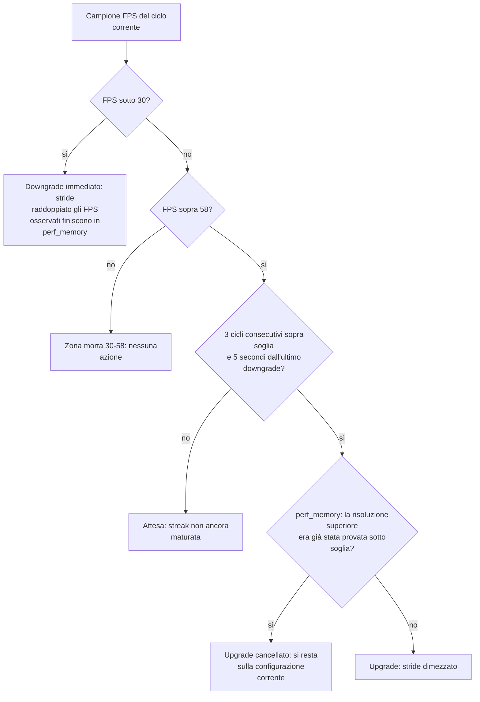

**Reset selettivo della memoria.** Quando cambia `DT` o il numero di corpi attivi (`current_body_count`), l'intero `perf_memory` viene azzerato. I dati storici diventano invalidi perché il carico computazionale è cambiato strutturalmente. Il sistema riparte con un foglio bianco e ricomincia a imparare.

**Eccezioni per view_mode.** Tre modalità (`view_mode in (0, 3, 5)`) saltano la logica di cooldown/memoria, ma per motivi diversi. Solo la modalità di visualizzazione **0 (OFF)** (nessuna heatmap) non ha davvero una griglia da scalare. le modalità **3 (Lagrange Hunter)** e **5 (Tidal)** hanno una visualizzazione a pieno titolo, ma vengono **forzati a `div=1` (risoluzione piena)**: il downscaling distruggerebbe i dettagli fini (per esempio i punti di Lagrange possono essere minuscoli). La modalità **4 (Roche)** fa storia a sé: è cappata a un massimo di `div=2`, perché il calcolo dell'Hessiana è pesante ma oltre quella soglia la visualizzazione diventa illeggibile.

Il risultato è un sistema che si stabilizza rapidamente sulla configurazione ottimale per la macchina dell'utente, si adatta quando la scena cambia complessità e non oscilla mai visibilmente.

---

## 5. Collisioni, buchi neri e singolarità

Il sistema di collisioni non è il focus del simulatore, è un sottosistema qualitativamente accettabile ma fisicamente molto approssimativo. Conserva la quantità di moto del corpo sopravvissuto e stima grossolanamente una quota di massa dispersa nell'impatto e la percentuale fusa nel vincitore. Abbastanza da essere fisicamente plausibile, approfondire oltre avrebbe avuto un impatto sulle performance non conveniente ai fini del progetto.

### Il problema concreto: il tunneling numerico

`DT` è l'elemento che rende discreta la simulazione. Più è piccolo, più precisa è la fisica, più pesante è il costo computazionale per secondo di simulazione. In "campo forte" (es. zone con gravità immensa vicino a un buco nero) può accadere che un corpo subisca un'accelerazione estrema in un singolo tick e che al tick successivo abbia già attraversato l'intera sfera del buco nero conservando una energia enorme, venendo poi espulso a velocità subluminali insensate. È il classico "quantum tunneling numerico": il corpo passa attraverso l'ostacolo invece di scontrarsi con esso.

Fissare il raggio di cattura a un multiplo *statico* del raggio di Schwarzschild $R_s$ (per esempio $3 R_s$ , l'ordine di grandezza dell'ISCO) non basta: con DT non ideale il corpo tunnelizza oltre anche quella soglia ampliata. La chiave è rendere il multiplo **dinamico**, legato al DT.

### La soluzione: hitbox adattivo e CCD

La soluzione ha due livelli.

**Livello 1: hitbox adattivo del buco nero.** Il moltiplicatore del raggio di cattura non è fisso: viene calcolato a runtime in funzione del passo temporale.

```
BH_ACCRETION_MULT = max(1.0, min(10 · DT, 100))
```

A DT grande il bersaglio si espande aggressivamente per evitare il tunneling cinematico; a DT microscopico si stringe verso il limite inferiore di 1.0×. Concretamente:

| $DT$ | $\min(10 \cdot DT, 100)$ | Moltiplicatore finale | Regime |
|:---:|:---:|:---:|---|
| $1\ \mu\text{s}$ | $10^{-5}$ | **1.0×** (clamp inferiore) | merger: orizzonti tangenti, fisica precisa |
| $1\ \text{s}$ | $10$ | **10×** | orbite ordinarie |
| $60\ \text{s}$ | $600$ | **100×** (clamp superiore) | passo lungo: bersaglio largo anti-tunneling |

Il moltiplicatore agisce sul **raggio di Schwarzschild** $R_s$ (l'orizzonte degli eventi, definizione nella [nomenclatura della Guida Fisica](PHYSICS_AND_SCENARIO_GUIDE.it.md#termini-essenziali-e-nomenclatura)), non sul raggio fisico. Non a caso si chiama *BH*_ACCRETION_MULT (BH = Black Hole): un gate a monte esclude i corpi ordinari, il cui confine di collisione resta il raggio fisico (`is_bh`, vero solo se $R_s$ supera lo 0,1% del raggio visivo). Il Sole, con $R_s \approx 3$ km contro 696.000 km di raggio, non lo attiverà mai: anche a 100× l'orizzonte espanso sarebbe 2.000 volte più piccolo della fotosfera. Il meccanismo tocca nella pratica solo buchi neri e stelle di neutroni.

Con `vis_r = R_s` e DT minuscolo due buchi neri di massa comparabile si fondono quando i loro orizzonti diventano tangenti, la condizione di contatto corretta per un merger come GW150914. Lo stesso floor, però, in una coppia a rapporto di massa estremo (un EMRI: un corpo leggero che spiraleggia attorno a un buco nero molto più massiccio) è troppo permissivo. In quei campi forti estremi, sbilanciati e con le masse molto vicine, poteva avvenire un *kick* di forza anomala che impediva la coalescenza.

La guardia EMRI (`emri_guard`) chiude questo buco, con due soglie invece di una sola per non sovra-espandere le coppie intermedie (l'espansione troppo aggressiva è essa stessa fonte di sovradissipazione, [§10.1 della Guida Fisica](PHYSICS_AND_SCENARIO_GUIDE.it.md#101-caso-di-studio-gw190814-la-sovradissipazione-in-campo-profondo)). Il rapporto di massa decide quanto espandere il raggio di cattura del corpo grande della coppia, sempre sotto la soglia $\sim1.9\times$ e solo a DT piccolo.

- $1.0\times R_s$ sotto 3:1 (coppie comparabili, nessuna espansione).
- $1.25\times R_s$ tra 3:1 e 50:1 (basta ad assorbire il corpo prima del tratto ripido del potenziale PW senza esagerare l'espansione).
- $1.9\times R_s$ oltre 50:1 (EMRI puri, dove serve il margine pieno).

Perché è stato ritenuto accettabile espandere i confini in questi scenari:

- **Fisicamente**: un corpo così in profondità è comunque destinato a cadere, quindi catturarlo un po' prima non falsifica la dinamica.
- **Numericamente**: senza scendere troppo nei dettagli, nell'estrema vicinanza non si attivano i (costosissimi) attriti della relatività numerica che permettono il contatto finale.
- **Concettualmente**: è una regolarizzazione per assorbimento. Invece di clampare la velocità *dopo* il kick anomalo, si sposta indietro il confine e si rimuove la sorgente del kick.

La guardia vive solo a DT piccolo; a DT grande il bersaglio è già abbastanza largo da non averne bisogno.

**Livello 2: Continuous Collision Detection (CCD).** Sensore aggiuntivo che vale per tutti i contesti ma nel pratico tende ad attivarsi principalmente in situazioni di campo forte. Per ogni coppia di corpi attivi nel ciclo $O(N^2)$ :

1. Si calcola il vettore di spostamento relativo nel tick corrente: $\Delta r = (\vec{v}_i - \vec{v}_j) \cdot dt$ .
2. Si lancia un **ray cast lineare** lungo questa traiettoria: se il segmento da `pos_current` a `pos_next` interseca la sfera di cattura, il tunneling è in corso.
3. Si calcola $t_{min} \in [0, 1]$ (un numero tra 0 e 1: la frazione del tick in cui avviene il minimo approccio, dove 0 è l'inizio del tick e 1 la fine) e la fusione viene gestita a quella posizione interpolata, non alla fine del tick.

**Il filtro spaziale $O(N^2)$ → quasi-$O(N)$ .** Il ciclo collisioni è nominalmente $O(N^2)$ ma nella pratica è quasi $O(N)$ grazie a un pre-passo di filtraggio. Prima del doppio loop, una scansione lineare calcola `max_v` (la velocità massima tra tutti i corpi) e ne deriva `max_move` = `max_v` · dt · 2 (il massimo spostamento relativo possibile in un tick nel caso peggiore). Nel ciclo successivo, per ogni coppia $(i, j)$ viene confrontato il gap $|\Delta x| - (r_i + r_j)$ con `max_move`: se il gap è maggiore, la coppia è geometricamente impossibilitata a collidere in questo tick e si fa early-exit prima ancora di toccare `vel_arr`. In uno scenario galattico a ~200 corpi (~20.000 coppie nominali per tick), il filtro scarta tipicamente oltre il 99% delle coppie prima del calcolo CCD vero: la complessità nominale resta $O(N^2)$ ma il costo effettivo collassa al piccolo sottoinsieme di coppie geometricamente plausibili.

A complemento lavora il **cooldown dinamico** (`COLLISION_COOLDOWN`), costruito su una domanda sola: per quanti tick *nessuna* coppia può fisicamente entrare in contatto? Per quel numero di tick l'intero modulo collisioni viene saltato in toto. La risposta è il minimo tra due stime indipendenti.

1. **La stima cinematica, adattiva.** Dati il minimo gap rilevato nel tick corrente e l'accelerazione massima in scena, la cinematica quadratica calcola i tick necessari al primo contatto possibile. È la stima aggressiva: coppie lontane e lente comprano salti lunghi.
2. **Il tetto relativistico, fisso.** Serve perché la stima cinematica assume accelerazione costante, mentre in una caduta $1/r^2$ l'accelerazione cresce strada facendo: a passo grosso il cooldown rischierebbe di saltare *oltre* l'urto. Era il tallone d'Achille dei plunge frontali a momento angolare nullo, gli unici a fare tunneling proprio perché non beneficiano dell'espansione del raggio di cattura. Il tetto impone allora un'assunzione fissa, indipendente da `max_v` e `max_a`: nessuna coppia si chiude più veloce di $0{,}75 c$ relativi, quindi il salto concesso non supera mai `min_gap / (0.75·c·DT)` tick.

Il cooldown effettivo è il minimo tra stima cinematica e tetto relativistico. Nella pratica, il minimo lo vince quasi sempre il tetto che resta conservativo perfino nelle fusioni più violente ricreabili (due NS in caduta da ferme si toccano a circa $0{,}6c$ relativi), quindi la stima cinematica resta come rete a costo trascurabile per le configurazioni non ancora verificate. Il tetto garantisce così che il prossimo controllo non arrivi mai dopo il tick in cui la coppia, chiudendo alla velocità limite di $0{,}75 c$, avrebbe esaurito l'intero gap misurato all'ultimo controllo; non oltre il primo istante in cui il contatto sarebbe fisicamente concepibile in quello scenario. Un ultimo accorgimento protegge i DT grandi, dove la distanza percorribile in un tick a $0{,}75 c$ diventerebbe enorme e il tetto, schiacciato verso zero tick, forzerebbe controlli su coppie ancora lontanissime: quella distanza per tick è perciò bloccata da un clamp in km.

**Una guardia silenziosa a monte dei due livelli.** Vive dentro il calcolo della forza, non nel modulo collisioni: se la distanza tra i centri scende sotto la somma dei raggi, il vettore di separazione viene riscalato alla distanza di contatto. Nel tick che intercorre tra la sovrapposizione geometrica e la risoluzione della collisione, il denominatore della forza non può quindi avvicinarsi a zero e nessun kick spurio viene iniettato.

Il percorso completo di un tick del modulo collisioni, in sintesi:

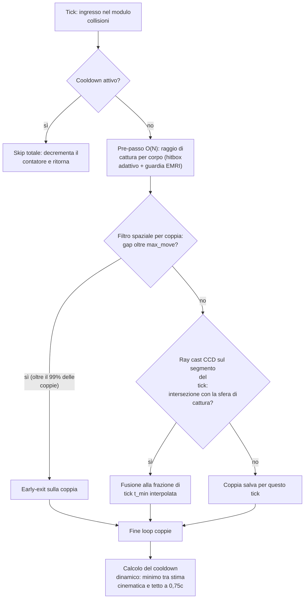

---

## 6. Il garbage collector asincrono dei corpi causalmente morti

Quando un corpo viene distrutto (collisione, comando manuale, ingestione in un buco nero), non scompare istantaneamente dall'universo simulato. Il suo passato continua a esistere nel **suo** buffer storico, da cui gli altri corpi continuano a leggerlo via cono di luce passato. Lo svuotamento è un processo attivo: a ogni tick la Fase 1 continua ad avanzare la testa del buffer del corpo morente scrivendovi **VOID_VAL** (la sentinella di "non-esistenza") al posto dello stato, così il fronte di assenza avanza alla stessa cadenza con cui prima avanzava la storia. Solo quando il VOID_VAL ha riempito il tail del buffer più profondo, nessun corpo nell'universo può più riceverne informazione gravitazionale. A quel punto il corpo è **causalmente morto** e può essere effettivamente rimosso.

### Il problema concreto: lo scan dentro il frame budget

La detection di morte causale richiede uno scan dei buffer storici: per ogni corpo in stato `FLAG_DYING`, controllare il valore alla coda del buffer più profondo disponibile (L2 se esiste, sennò L1, sennò L0). È un'operazione lineare nel numero di corpi morenti: non pesantissima, ma nemmeno gratuita. Va eseguita con regolarità per non accumulare corpi morti nello storico.

Eseguirla dentro il main loop pesa sul frame budget di 16,6 ms. Saltarla per troppi frame consecutivi gonfia inutilmente lo storico, perché i corpi morti continuano a essere referenziati nei loop $O(N^2)$ .

### La soluzione: thread daemon producer/consumer

Ogni 60 frame il main loop chiama `gc_worker.start_collection()`. Se non c'è già un thread daemon attivo, ne viene avviato uno che esegue lo scan dei buffer fuori dal frame budget. I risultati (lista di indici causalmente morti) vengono scritti in `_pending_results` sotto `threading.Lock`. Il main thread, sempre ogni 60 frame, chiama `get_and_clear_results()` che ritorna la lista pronta (o `None` se ancora in scansione).

Pattern essenziale:

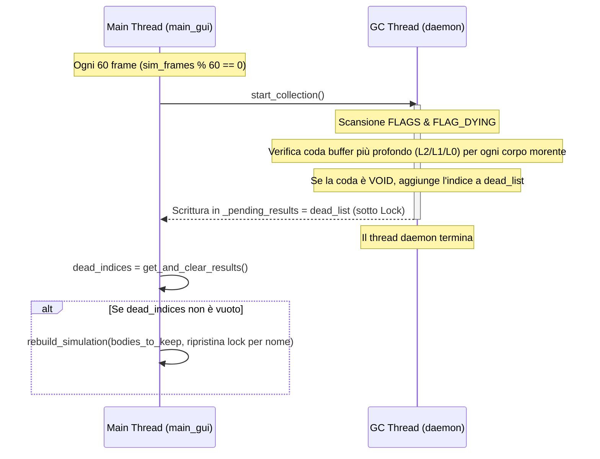

> [!TIP]
> **Perché thread daemon e non worker persistente.** Il thread daemon vive solo per la durata di uno scan e poi muore. Non c'è una coda di task, non c'è un worker che dorme in attesa. Il pattern è "fire and forget con lock sul risultato": più semplice da debuggare, zero overhead di idle e nessun rischio di thread zombie quando il processo principale termina (i daemon muoiono con lui).

**Anti-sovrapposizione.** `start_collection()` controlla `is_alive()` (il metodo standard di `threading.Thread`, non un flag di questo progetto) sul thread precedente: se uno scan è già in corso, il nuovo trigger viene ignorato. Su scenari pesanti dove lo scan dura più di 60 frame, il GC scala automaticamente la sua frequenza al ritmo che riesce a sostenere.

**Re-mapping degli indici dopo rebuild.** Quando il main thread riceve `dead_indices`, costruisce `bodies_to_keep` per esclusione e chiama `rebuild_simulation()`. Questo compatta gli indici da 0 a N-1, quindi `locked_body_idx`, `lagrange_target_idx` e `lagrange_attr_idx` puntano potenzialmente a corpi sbagliati. La soluzione: prima del rebuild si salvano i **nomi** dei corpi referenziati e dopo il rebuild si ri-cercano gli indici per nome. È più robusto che mantenere mappe di traduzione e gestisce in modo pulito il caso in cui il corpo bloccato fosse proprio uno dei morti (la ricerca per nome ritorna `None` e il lock viene sciolto).

---

## 7. La sonda LIGO: architettura di campionamento e dump

Solo dopo aver visto emergere comportamenti fisicamente credibili (in particolare la perturbazione a spirale del campo `dΦ/dt` con i buchi neri in fase di inspiral, descritta nel [§3](#3-il-rendering-delle-heatmap-e-la-gestione-degli-fps)) è stato aggiunto al sistema uno strumento "listener" virtuale. L'analogia con le onde gravitazionali misurate da LIGO/Virgo era calzante: un ascoltatore spaziale a pochi milioni di km dall'evento, che registrasse la perturbazione locale del campo.

La pipeline DSP a valle (Tukey, Butterworth, STFT, Hilbert, Peters) è documentata nella Guida alla Fisica. Qua interessa **come è costruita la sonda dentro il sistema**.

### Vincoli architetturali

La sonda è uno strumento **opzionale e manuale**: è l'utente a decidere *se* attivarla e *dove* posizionarla (tasto `P`, click sullo spazio vuoto); il sistema si limita a *suggerire*, tramite gli avvisi RADAR, quando e dove conviene piazzarla per cogliere un evento. Una volta accesa, però, deve rispettare alcuni vincoli tecnici:

1. **Vivere dentro il loop fisico** senza rallentarlo. Ogni tick di simulazione deve poter scrivere un campione, anche a `DT = 1 μs` (1.000.000 di campioni/secondo).
2. **Gestire correttamente i rebuild della simulazione**. Ogni cambio di DT, raggio causale o spawn ricostruisce tutti i buffer storici da zero. La sonda va trattata a parte: a DT invariato il suo buffer va preservato intatto, ma a DT diverso (cioè a frequenza di campionamento diversa) continuare lo stesso segnale non avrebbe senso, quindi va salvato su disco e poi riavviato da zero.
3. **Essere un singleton globale**, esiste una sola sonda nell'universo simulato.
4. **Esporre dati al renderer e al disco senza copie inutili**.

### Le scelte

**Buffer dedicato pre-allocato.** `PROBE_BUFFER` è un array NumPy 1D di `float64` con dimensione `2**21 = 2.097.152` slot (~16 MB). La dimensione è una potenza di 2 esatta per usare il solito trucco della bitmask circolare: `(head + 1) & PROBE_MASK` invece di `% PROBE_LEN`. Lo stesso pattern dei buffer storici, riapplicato qui.

**Stato vettorizzato in array minimi.** `PROBE_HEAD`, `PROBE_ACTIVE`, `PROBE_POS` sono array NumPy minuscoli (un solo elemento i primi due, la coppia di coordinate il terzo) invece di scalari Python. Questo perché Numba JIT non può scrivere su variabili Python globali da dentro un `@njit`, ma può scrivere su elementi di array NumPy passati per riferimento. È il pattern standard per stato mutabile dentro kernel JIT.

**Lettura sempre da L0, mai dai buffer LOD.** La sonda non interroga lo storico passato: legge sempre lo stato istantaneo dei corpi al tick corrente. Questa scelta è intenzionale: campionare dai buffer compressi L1 o L2 introdurrebbe un errore di campionamento che deforma la forma d'onda del chirp e rende impossibile l'analisi spettrale. Va detto chiaramente che questa è una **scorciatoia di simulazione, non realismo fisico**: un interferometro reale misura l'onda che gli è arrivata propagandosi a $c$ , non lo stato istantaneo della sorgente. Qui si legge L0 istantaneo solo per ottenere un segnale pulito, accettando consapevolmente di sacrificare la causalità della misura.

**Disaccoppiamento sonda ↔ rebuild.** Quando `rebuild_simulation()` rialloca tutti i buffer storici, il `PROBE_BUFFER` viene **preservato** se DT e dimensioni dei buffer storici non sono cambiati (`can_deep_copy` in `_restore_bodies`). Se invece il rebuild cambia i parametri, il contenuto della sonda viene **salvato automaticamente** su disco (dumped) in un thread daemon `threading.Thread(target=_dump_task, daemon=True)` prima di azzerare il buffer. L'utente non perde mai la telemetria registrata.

**Singleton via classe sottile.** `SpaceProbeController` non possiede dati: tutti i dati vivono in `data.py`. Il controller espone solo le operazioni di alto livello (`activate_at`, `deactivate`, `dump_session`, `get_current_strain`). Quando inattiva, la sonda viene parcheggiata a `VOID_VAL` (coordinate impossibili nello spazio simulato), garantendo che nessun calcolo accidentale produca strain spurio.

**Dump finale all'uscita.** Al termine del processo (`pygame.quit()`), `main_gui.py` controlla `ligo_probe.active` e forza un ultimo `dump_session()`. Un breve `time.sleep(1.0)` dà al thread daemon di salvataggio il tempo di completare la scrittura su disco prima che Python termini il processo principale.

Il segnale grezzo è un proxy cinematico dello strain reale: per ogni corpo si somma $m_j (v_{x,j}^2 - v_{y,j}^2)/R_j$ , con $R_j$ la distanza tra sorgente e sonda. Le velocità sono misurate rispetto al centro di massa del sistema, non in assoluto: conta il moto relativo dei corpi e il segnale non cambia se l'intera scena trasla a velocità costante. Il termine $1/R_j$ fa calare l'ampiezza quando la sorgente si allontana dalla sonda, come nell'onda vera. Il risultato oscilla al doppio della frequenza orbitale, la stessa firma dell'onda gravitazionale reale. È una semplificazione algebrica documentata e discussa nella Guida alla Fisica. Questo segnale grezzo non è ancora leggibile di per sé: è `ligo_analyzer.py`, una pipeline indipendente, a trasformarlo in dati e grafici noti (spettrogrammi, frequenza istantanea, stima della massa chirp), interpretando ciò che la sonda ha registrato.

**L'esportazione in `.npy` e l'Analizzatore.**
Il processo di salvataggio (il "dump" citato sopra) non usa file di testo, ma salva il `PROBE_BUFFER` e i relativi metadati temporali (come il DT) direttamente nel formato nativo binario di NumPy (`.npy`). Questo garantisce letture e scritture quasi istantanee e senza perdita di precisione per array da milioni di elementi. I file vengono salvati nella cartella `ligo_output/data_npy/` e sono pronti per essere consumati da `ligo_analyzer.py`. Quest'ultimo è un vero e proprio programma di analisi parallelo, avviabile comodamente dal launcher della simulazione. Legge il file `.npy` e utilizza la libreria `scipy.signal` per far passare il segnale grezzo attraverso una rigorosa pipeline di filtraggio (detrending, finestra di Tukey, filtri passa-alto Butterworth) fino all'estrazione della frequenza istantanea via Trasformata di Hilbert e alla stampa degli spettrogrammi. L'intera sequenza di estrapolazioni tecniche applicata dall'analizzatore è dettagliata nel [§8.8 della Guida Fisica](PHYSICS_AND_SCENARIO_GUIDE.it.md#88-la-pipeline-di-analisi-dellanalizzatore-ligo_analyzerpy).

---

## 8. Le scie dei corpi

Le scie hanno rappresentato un peso e un problema sproporzionato rispetto alla loro apparente semplicità. Il problema fondamentale: se scrivi un punto per ogni tick fisico, su simulazioni lunghe i punti diventano milioni, densissimi, e intasano sia la grafica che la RAM. Serviva una strategia che mantenesse scie visivamente soddisfacenti con un costo fisso e prevedibile.

La soluzione ha tre componenti:

**Budget totale fisso.** C'è un numero massimo assoluto di punti scia distribuito tra tutti i corpi presenti. Ogni corpo riceve una quota proporzionale. Struttura: matrice `(max_corpi, max_punti_per_corpo, 2)` pre-allocata, gestita come buffer circolare.

**Campionamento adattivo per tipo di corpo.** Un nuovo punto scia viene scritto solo se il corpo si è spostato, **in coordinate del mondo**, oltre una soglia di distanza che dipende dal *tipo* di corpo. La logica (`update_trail_logic`) è una matrice 2×2 raggio×velocità: un corpo enorme e lento (il Sole) ottiene la soglia più fine per catturare le cuspidi; un corpo veloce (pianeta o binaria) ottiene una soglia media per avere abbastanza storia visibile, mentre un corpo piccolo e lento (asteroide alla deriva) ottiene la soglia più grossolana per non sprecare buffer. Questo campionamento è puramente fisico e **non dipende in alcun modo dalla camera**.

**Rendering solo del visibile e regola dei 2px (è qui che entra la camera).** La camera non influenza *cosa* viene salvato, ma solo *cosa* viene disegnato. Solo i punti dentro il frustum (l'inquadratura) vengono processati e renderizzati; inoltre, i segmenti *intra-pixel* vengono scartati misurando la distanza a schermo tra punti consecutivi: se lo spostamento visivo è inferiore a 2 pixel, il punto viene ignorato. Quando si fa un drastico zoom all'indietro, decine di migliaia di punti storici collassano nello stesso identico pixel: la CPU scoppierebbe se dovesse sovrascriverlo 10.000 volte senza alcuna differenza visiva. Con questo culling sub-pixel, il peso grafico delle scie resta minimo.

**Le teste di scrittura.** Ogni corpo ha un proprio cursore `trail_heads[i]` che avanza solo quando un punto viene effettivamente scritto (`head = head + 1`, con reset a 0 a fine buffer). Dato che le scritture sono rare (scattano solo al superamento della soglia di spostamento, non a ogni tick), l'avanzamento delle teste è trivialmente economico e non rappresenta un collo di bottiglia.

---

## 9. L'architettura di main_gui e dell'UI

### 9.1 Dal monolite all'architettura a moduli

#### Il problema concreto: il monolite da 2.000 righe

`main_gui.py` è diventato rapidamente ingestibile: un unico file che superava le 2.000 righe di `if`/`elif` annidati che gestivano eventi, stato, fisica e rendering tutti nello stesso posto. Era impossibile da modificare senza rompere qualcosa e leggere il flusso di esecuzione richiedeva di tenere in testa troppo contesto simultaneamente.

#### La soluzione: interceptor chain, stato condiviso e layer

**Il loop principale.** Il game loop segue un ordine fisso e non derogabile:

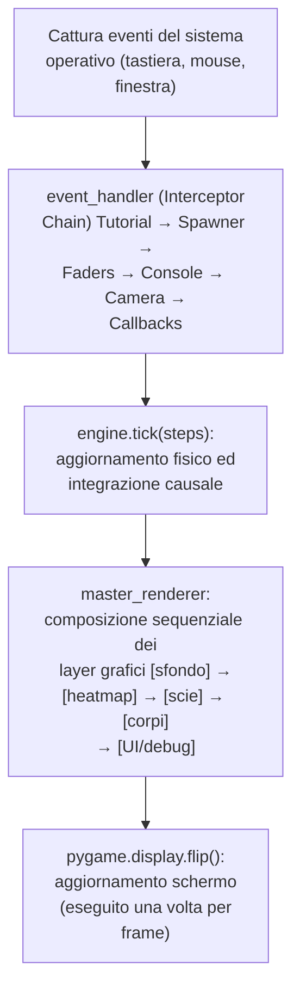

**L'Interceptor Chain degli input.** Ogni elemento della catena può consumare un evento (ritornando `True`) bloccando la propagazione ai moduli successivi. Questo impedisce comportamenti incoerenti (ad esempio muovere la camera mentre si digita un comando nella console). La struttura è copiata dall'architettura degli event handler nei videogiochi: ogni interceptor è responsabile di un dominio preciso e non sa nulla degli altri.

**Il singleton UIState.** Tutto lo stato dell'interfaccia (quale heatmap è attiva, lo zoom corrente, i flag delle overlay, il corpo selezionato) vive in un singleton `UIState` accessibile da tutti i moduli senza passare parametri in giro. Il motivo di questa scelta è prettamente pratico: l'input utente e le logiche di rendering attraversano decine di funzioni e classi annidate. Passare un gigantesco oggetto di configurazione per parametro a ogni singola funzione avrebbe inquinato il codice con boilerplate inutile. 

Il trucchetto che lo rende davvero globale e indistruttibile vive nel file `ui/ui_state.py`. Alla fine del file, la classe viene istanziata direttamente a livello di modulo: `ui_state = UIState()`. Sfruttando il fatto che Python esegue il codice di un modulo una sola volta (al primo import) e poi ne "cacha" il risultato in `sys.modules`, chiunque scriva `from ui.ui_state import ui_state` in qualsiasi parte del motore riceverà automaticamente l'esatto e unico riferimento in memoria di quell'oggetto. È una scelta discutibile dal punto di vista del "Clean Code" (dipendenza globale), ma con un unico thread principale dedicato all'UI, il compromesso tra purezza e praticità è stato sciolto a favore della seconda.

**Il master_renderer e i layer.** Ogni elemento visivo è un layer separato disegnato nell'ordine corretto su una superficie Pygame. Il `flip()` avviene una volta sola alla fine del frame: durante tutta la composizione il display non mostra nulla, eliminando il tearing visivo. Questo ha ridotto `main_gui.py` da oltre 2.000 righe a circa 300. Tra i layer figura anche il **Pannello di Telemetria Orbitale** (l'HUD con posizioni, velocità e accelerazioni assolute e relative del corpo selezionato). I suoi contenuti e la loro interpretazione fisica, insieme alla sonda di campo con cui condivide il gesto del doppio clic, sono documentati nel [§7.9 della Guida Fisica](PHYSICS_AND_SCENARIO_GUIDE.it.md#79-il-doppio-clic-in-scena-pannello-di-telemetria-e-sonda-di-campo-le-unità-di-misura).

### 9.2 Lo spawner interattivo e l'interceptor adapter

`OrbitalSpawner` è il sottosistema (una macchina a stati a cinque fasi) con cui l'utente inserisce un nuovo corpo a caldo, senza uscire dalla simulazione.

**Attenzione a non confonderlo con l'Interceptor Chain**: `OrbitalSpawner.handle_event()` è un metodo *interno* allo spawner, non è mai registrato nella catena e non ne rispetta il protocollo (può restituire `bool` **o** un dizionario con i dati del nuovo corpo).

Il vero interceptor registrato nella catena (tramite `InputController.register()`) è un metodo separato chiamato `intercept_spawner`. Questo metodo fa da vero e proprio "Adapter":
1. Riceve l'evento dalla catena e lo passa allo spawner "puro" (`spawner.handle_event(event)`).
2. Valuta il tipo di risposta (tramite `isinstance`): se lo spawner risponde con un semplice booleano (`True` o `False`), l'Adapter si limita a inoltrarlo alla catena per bloccare o meno la discesa dell'evento verso gli altri sistemi.
3. Se invece lo spawner risponde con un **dizionario** (l'utente ha premuto Invio e confermato i parametri orbitali), l'Adapter blocca la catena restituendo `True` e si prende in carico il lavoro pesante sul motore: si occupa di uccidere eventuali corpi sovrapposti, preservare la camera e i punti di Lagrange attivi, per poi richiamare il costoso `rebuild_simulation()` e `engine.refresh_kernel()`. Lo spawner in sé non sa nulla del motore fisico: si limita a disegnare schermate e calcolare orbite su carta.

Lo spawner gestisce la propria macchina a stati (`self.state`, da 0 a 4) e disegna la schermata modale corrispondente con `draw()`:

0. **Inattivo.**
1. **Scelta del corpo**: un catalogo paginato di template (da satelliti artificiali a buchi neri ultramassivi), navigabile con `0`/`5` e selezionabile con `1`-`4`.
2. **Scelta dell'orbita**: stazionaria, circolare, eccentrica o di plunge, attorno al corpo di massa maggiore in scena o al più vicino al punto di spawn (proprietà calcolate al volo, `top_body` e `closest_body`), oppure diramazione verso i punti di Lagrange (tasto `8`). Una guardia di buon senso fisico impedisce di scegliere un'orbita se la massa del nuovo corpo supererebbe quella dell'attrattore.
3. **Scelta della coppia di Lagrange**: cicla con `TAB` tra le coppie candidate, riusando l'array `TOP_ATTRACTOR` già precalcolato per l'HUD e le heatmap di Roche/Lagrange (§3), non un nuovo calcolo da zero.
4. **Scelta del punto specifico** (L1-L5): calcola posizione e velocità esatte con le stesse formule analitiche della Guida Fisica ([§9.4](PHYSICS_AND_SCENARIO_GUIDE.it.md#94-punti-di-lagrange-analitici-problema-dei-tre-corpi-circolare-ristretto) e [§9.5](PHYSICS_AND_SCENARIO_GUIDE.it.md#95-velocità-co-rotante-sui-punti-di-lagrange)); `get_ghost_markers()` espone le cinque posizioni per un'anteprima live disegnata a schermo prima della conferma.

La macchina a stati, in sintesi (da qualunque stato attivo, `ESC` annulla e riporta allo stato 0):

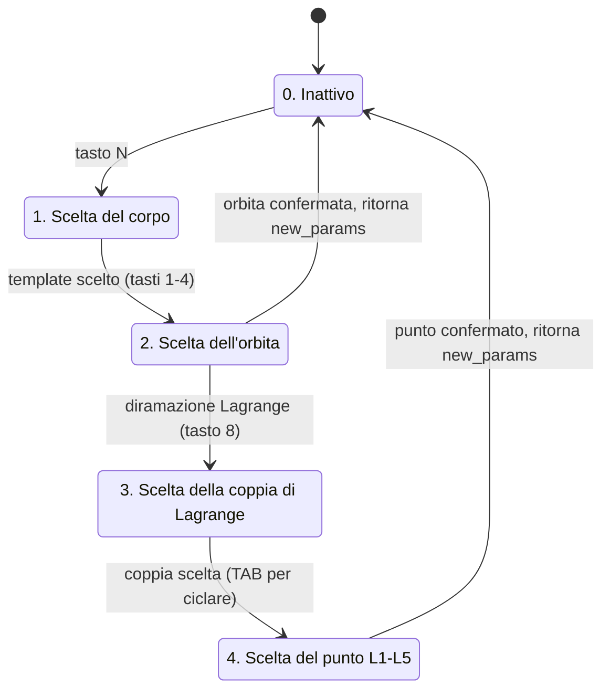

Riassumendo il confine tra i due livelli: quando lo stato 2 o 4 completa una scelta valida, `OrbitalSpawner.handle_event()` ritorna il dizionario `new_params` invece di un booleano, un protocollo di ritorno non ortodosso ma deliberato, coerente con lo stile pragmatico di tutto il resto del motore. È `intercept_spawner`, in `input_controller.py`, a riconoscere quel caso specifico e a tradurlo in un'azione concreta sulla simulazione, mantenendo la catena degli interceptor sempre e solo su `True`/`False`.

### 9.3 La sequenza di bootstrap del processo principale

L'ordine di inizializzazione non è arbitrario. Ogni fase ha precondizioni precise sulle fasi precedenti.

```
FASE A: pre-pygame (Tkinter splash ancora attivo)
  ├─ GlobalState() istanziato (UI/simulation flags)
  ├─ show_splash_and_load(preset, gstate, dt_val)
  │     ├─ presets.get_preset() → lista CelestialBody
  │     ├─ rebuild_simulation() → alloc buffer L0/L1/L2 + scie + sonda
  │     └─ Buffer di print differito raccolto (no terminal yet)
  └─ data.DT impostato

FASE B: bootstrap pygame
  ├─ pygame.display.init() + pygame.font.init() (NO audio)
  ├─ sys.stdout = GameConsole(sys.stdout)  ← stdout interceptor
  ├─ flush_deferred_prints() → log del loading nella console
  ├─ screen = pygame.display.set_mode(...) (gestisce anche fullscreen)
  ├─ clock = pygame.time.Clock()
  └─ 6 font monospace (HUD, console, tutorial, legend)

FASE C: costruzione layer rendering
  ├─ OverlayRenderer(fonts...): HUD, tutorial, legenda, info debug
  └─ MasterRenderer(fonts..., overlay_renderer): composizione finale

FASE D: costruzione layer fisico
  ├─ Camera(w, h) + auto-focus sul corpo più massiccio
  │     ├─ next((b for b if b.mass >= data.TOP_MASS * 0.999))
  │     └─ scale = top_body.radius / 10.0 (clampato a 0.001)
  ├─ Engine(bodies): compila kernel JIT al primo tick (cache=True salva su disco)
  └─ SpaceProbeController(): singleton sonda LIGO, inizia disattivata in VOID

FASE E: costruzione UI runtime
  ├─ GravityRenderer(w, h, resolution_div): renderer heatmap
  ├─ 3 VerticalFader (sensitivity DPHI, ROCHE, contrasto)
  ├─ PerformanceManager(): auto-tuner risoluzione
  ├─ TutorialPopupManager(fonts...)
  └─ OrbitalSpawner()

FASE F: stato condiviso
  └─ UIState (singleton) popolato con TUTTI i riferimenti sopra
       (bodies, engine, renderer, camera, gstate, faders, perf_manager,
        ligo_probe, screen, indici lock/lagrange, flag conferma...)
       I locali originali vengono distrutti via `del` per evitare
       desincronizzazioni accidentali tra local e ui_state.*

FASE G: worker threads e tracker
  ├─ DeathTracker(): logger eventi impatti (sync, leggero)
  └─ GCWorker(): collector asincrono dei corpi causalmente morti

FASE H: input chain
  ├─ EventHandler() istanziato
  └─ InputController().register(event_handler)
        ↑ qui vengono installati tutti gli interceptor della chain

FASE I: frame zero
  ├─ ui_state.gstate.paused = True
  ├─ push_default_tutorials() → primo popup visibile
  └─ while ui_state.running: → main loop entra
```

Punti notevoli sull'ordine:

- **Tkinter prima di pygame**: la splash deve esistere prima dell'init del display, altrimenti l'utente vede una finestra nera durante il caricamento (alloc buffer pesanti + prima compile Numba).
- **Console interceptor prima del flush**: i print differiti del thread di loading vanno catturati dalla `GameConsole`, non al terminale grezzo. Se l'ordine fosse invertito, quei log non finirebbero mai nell'interfaccia.
- **Engine prima dei worker thread**: il `GCWorker` legge `data.FLAGS` e `data.HISTORY_LX`. Se partisse prima della Fase D, leggerebbe array placeholder vuoti e scriverebbe risultati senza senso.
- **InputController dopo `UIState`**: gli interceptor leggono lo stato condiviso al momento del dispatch. Registrarli prima che `ui_state` sia popolato causerebbe `AttributeError` al primo evento.
- **`paused = True` prima del loop**: se il primo tick di fisica girasse prima del popup tutorial, la simulazione partirebbe a corpi liberi sotto al testo di benvenuto, con effetti visivi confusi.

---

## 10. La GameConsole: intercettore di stdout con timestamp di simulazione

Una semplice modifica architetturale che migliora nettamente l'esperienza di debugging e l'integrazione del log nel motore.

### Il pattern: Duck Typing e Proxy

```python
sys.stdout = GameConsole(sys.stdout)
```

Il trucco si basa su due pilastri architetturali di Python:

1. **Il Duck Typing**: Python non controlla il "tipo" o l'albero genealogico di `sys.stdout`. L'unica cosa che pretende dall'interprete (quando nel codice qualcuno chiama `print()`) è che l'oggetto a cui punta `sys.stdout` possegga un metodo chiamato rigorosamente `write(msg)`. Sostituendo il terminale di sistema con la nostra istanza di `GameConsole`, stiamo "ingannando" Python con un oggetto che finge di essere un file testuale semplicemente rispettandone la firma.
2. **Il pattern Proxy (o Decorator)**: `GameConsole` non distrugge l'accesso al vero terminale, ma vi si interpone come un vigile. Il costruttore riceve il vecchio `sys.stdout` ufficiale del sistema operativo e lo salva in una variabile privata interna (`self.original_stdout`). Da quel momento agisce da "passacarte": riceve i testi per il simulatore e, contemporaneamente, invoca in segreto `self.original_stdout.write()` per continuare a far funzionare il terminale nero esterno come se nulla fosse cambiato.

### Cosa fa write()

Ogni volta che qualcuno chiama `print(...)` da qualsiasi parte del codice:

1. **Inoltro all'originale**: scrive comunque sul terminale (il log di debug esterno resta intatto).
2. **Parsing del messaggio**: spezza per `\n`, rimuove codici ANSI di colore (`\033[93;1m` e `\033[0m`) che servono al terminale ma sporcherebbero il rendering pygame.
3. **Timestamp di simulazione**: prepende `[sim_time formattato]` a ogni riga. Cruciale: non è il tempo di sistema, è il tempo simulato corrente (`self.current_sim_time`, aggiornato da `Engine.tick()`). Quando un corpo collide all'anno 2.150.847 della simulazione, il log dice esattamente quell'anno.
4. **Buffer circolare**: massimo 1.000 messaggi mantenuti in RAM. Quando supera, tronca i più vecchi.
5. **Auto-scroll intelligente**: se l'utente sta scrollando manualmente, l'auto-scroll si disattiva. I nuovi messaggi entrano in fondo ma la vista resta sul punto che l'utente sta leggendo.

### Il vantaggio del pattern

Tutto il codice del progetto continua a usare `print()` normalmente. Nessun modulo deve conoscere l'esistenza della console in-game. Il refactoring del logging è stato **un cambio di una riga** in `main_gui.py`, senza toccare nemmeno un `print()` esistente in qualsiasi altro file del progetto.

Quando il main loop esce e pygame chiude, `sys.stdout` viene lasciato come `GameConsole` (cosa che il SO non vede: il file descriptor 1 è ancora il terminale originale, che continua a ricevere via `original_stdout.write()`). Niente ripristino necessario perché il processo termina subito dopo.

> [!NOTE]
> **Anche i kernel JIT stampano.** La telemetria del regime GW (tempo, distanza, velocità relativa, frequenza dell'onda) è emessa da dentro `compute_relativistic_force`, in pieno codice compilato nopython. Lì Numba non supporta f-string né `format`: i numeri decimali vengono formattati a mano, separando parte intera e frazionaria con la sola aritmetica intera. La console li intercetta come qualsiasi altro `print`, timestamp di simulazione compreso.

---

## 11. La splash di caricamento: Tkinter prima di pygame con print interceptor thread-local

Un problema UX comune nei simulatori pesanti: l'utente avvia il programma, pygame inizializza, mostra una finestra nera e la finestra rimane nera per 5-30 secondi mentre allocazione buffer + compile JIT girano. Windows mostra il banner "non risponde" sull'app. L'utente pensa che si sia bloccato. Soluzione: avere una finestra di progresso *prima* che pygame esista.

### Il problema concreto: la finestra nera e i due mainloop

- pygame.display.init() apre subito una finestra nera fino al primo `flip()`.
- Il caricamento (preset → alloc buffer storici → prima compile dei kernel JIT) può richiedere decine di secondi.
- Tkinter sarebbe l'ideale per una splash con progress bar, ma non può coesistere banalmente con pygame nello stesso thread e il loading del motore non può girare nello stesso thread di Tkinter, altrimenti il mainloop si blocca e la finestra resta congelata.

### La soluzione: delega e architettura a due thread

Per isolare questa complessità dal core del motore, la primissima azione di `main_gui.py` è delegare l'intero processo alla funzione `show_splash_and_load()` (situata nel file separato `utils/loading_splash.py`). 
All'interno di questo modulo indipendente, il caricamento viene sdoppiato e gestito tramite una coda dei messaggi:
```
MAIN THREAD (Tkinter mainloop)        WORKER THREAD (daemon)
──────────────────────────────        ──────────────────────
  splash = tk.Tk()                    presets.get_preset(...)
  progress_q = queue.Queue()          rebuild_simulation(...)
  Thread(_loading_worker).start() ──► print("[MEM CHECK] ...")
                                      print("[L2 BUDGET] ...")
                                      print("[SMART COPY] ...")
                                      print("Ricostruzione completata")
                                      result_holder['result'] = (...)
  while worker.is_alive():
    try:
      msg = progress_q.get_nowait()
      update_progress_bar(msg)
    except Empty: pass
    splash.update()
    time.sleep(0.05)

  splash.destroy()
  return result
```

### Il print interceptor thread-local

> [!NOTE]
> Questa è una delle poche parti del progetto che l'autore ha delegato quasi interamente a un LLM. L'idea generale (catturare i print del loading e usarli per la progress bar) è dell'autore, ma l'implementazione del meccanismo thread-local sotto è stata scritta dal modello. Il funzionamento è descritto qui senza che ogni dettaglio ne sia padroneggiato fino in fondo.

Il worker thread fa centinaia di `print(...)` durante il loading (log di allocazione, scelta modalità buffer, smart copy ecc). Quei print **non devono finire al terminale** (perché ci finiranno dopo, via `GameConsole`), **non devono inquinare Tkinter** e **devono essere parsati** per aggiornare la progress bar in base al contenuto del messaggio (es. *"L2 BUDGET" → 35% → "Allocazione buffer storici..."*).

Il monkey-patching di `builtins.print` su un singolo thread non è banale: il modulo `builtins` è il cuore di Python, quello che contiene le funzioni globali di base (come `len()`, `int()` e appunto `print()`). Essendo globale al processo, se lo si rimpiazza, **tutti i thread** lo usano. La soluzione qui è un wrapper che ispeziona l'identità del thread chiamante:

```python
my_thread_id = threading.current_thread().ident

def _thread_local_print(*args, **kwargs):
    if threading.current_thread().ident != my_thread_id:
        # Print da un altro thread (es. Tkinter, GC): comportamento originale
        original_print(*args, **kwargs)
        return
    # Print dal worker: cattura nel buffer + parsing per progress
    ...
    print_buffer.append(msg.rstrip('\n'))
    if "L2 BUDGET" in msg: progress_q.put(("status", "...", 35))
    elif "MEM CHECK" in msg: progress_q.put(("status", "...", 80))
    ...

builtins.print = _thread_local_print
```

È thread-safe per costruzione: nessun lock necessario, ogni chiamata controlla la sua identità di thread e si comporta di conseguenza. Niente race condition.

### Il deferred print buffer

I print catturati nel worker vengono accumulati in `print_buffer` e ritornati al chiamante insieme ai bodies. Quando `main_gui` finisce l'inizializzazione di pygame e installa la `GameConsole`, chiama `flush_deferred_prints(print_buffer)`: tutti i log del loading appaiono retroattivamente nella console in-game, **con il timestamp di sistema corretto**, esattamente come se la console fosse esistita durante il loading.

L'utente vede: avvio, finestra di progresso che si riempie con messaggi descrittivi, transizione a pygame senza finestra nera e nella console in-game trova già lo storico completo del caricamento. UX coerente, debugging facilitato.

---

## 12. Il launcher Tkinter

Arrivato verso la fine della parte core era il momento di togliere la scelta del preset dall'iniezione diretta nel codice e darla all'utente. Da qui la necessità di un'interfaccia pre-simulazione con Tkinter.

Il launcher è, lato codice, verboso e rigido, ma la sua funzione è elementare: l'utente sceglie il preset da un elenco, la GUI mostra caratteristiche e descrizioni, si impostano il DT di partenza (sovrascrivendo quello di default) e la risoluzione della finestra, fino allo schermo intero, la scelta che fissa il fattore $W \times H$ del budget di frame ([§3.1](#31-il-budget-di-frame-i-60-fps-come-target)). I numeri del pannello (corpi totali, raggio causale, DT ideale) non sono scritti a mano: all'avvio il launcher costruisce davvero ogni preset una volta, con i corpi deallocati subito dopo la misura. È il motivo per cui la sua apertura non è istantanea. Due bottoni: avvia il simulatore, o avvia il LIGO Analyzer. Nel primo caso parte la splash page di caricamento Tkinter descritta nel [§11](#11-la-splash-di-caricamento-tkinter-prima-di-pygame-con-print-interceptor-thread-local), che ritarda l'avvio di pygame finché tutto non è pronto, evitando la finestra non-responsive di Windows.

### Il problema concreto: l'interprete Tcl singleton

Inizialmente launcher, simulatore e LIGO Analyzer giravano nello stesso processo. Tkinter mantiene un **interprete Tcl singleton per processo**: dopo `root.destroy()` lo stato Tcl non viene completamente ripulito. Tentare di ricreare una root Tk nello stesso processo dopo aver chiuso una precedente produceva comportamenti instabili. Peggio: alla chiusura della simulazione si tentava di tornare al launcher e per lo stesso motivo si creavano conflitti che bloccavano tutto. I processi (in realtà thread/contesti) interferivano tra loro e la pulizia tra una sessione e l'altra non avveniva.

### La soluzione: processi isolati via subprocess

Il rimedio non è "riparare" l'interprete Tcl, è evitare che il problema si presenti: `subprocess` non ha nulla di specifico per Tkinter, è lo strumento generico con cui un processo Python ne avvia un altro, completamente separato e con la propria memoria. Separare in modo netto `launcher.py`, `main_gui.py` e `ligo_analyzer.py` come **processi completamente isolati**. Quando l'utente avvia qualcosa, il launcher costruisce il comando completo e personalizzato, nasconde la propria finestra (`withdraw()`) e lancia `main_gui` o `ligo_analyzer` come sottoprocesso, restando in attesa su `subprocess.run`. Alla chiusura della simulazione la finestra riappare (`deiconify()`), pronta per un nuovo avvio: è il ritorno al launcher che il tasto `BACKSPACE` promette dal simulatore. Se il processo figlio muore con un codice d'errore, `check=True` lo trasforma in un dialogo che riporta l'exit code: il launcher sopravvive al crash del simulatore e resta pronto a rilanciare. Il conflitto Tcl è risolto alla radice perché la root Tk del launcher viene creata una volta sola e mai distrutta né ricreata, mentre simulatore e analizzatore vivono ciascuno in un processo nuovo, senza memoria contaminata della sessione precedente.
