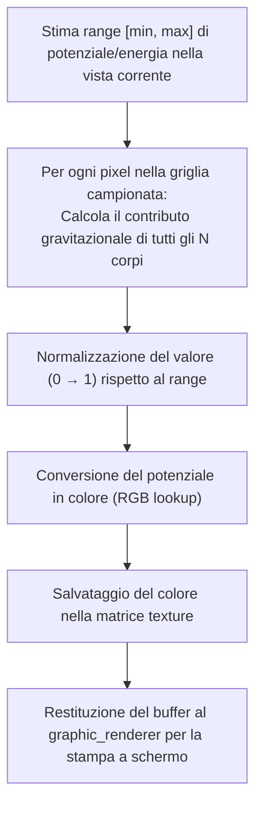
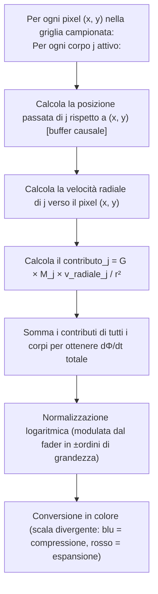
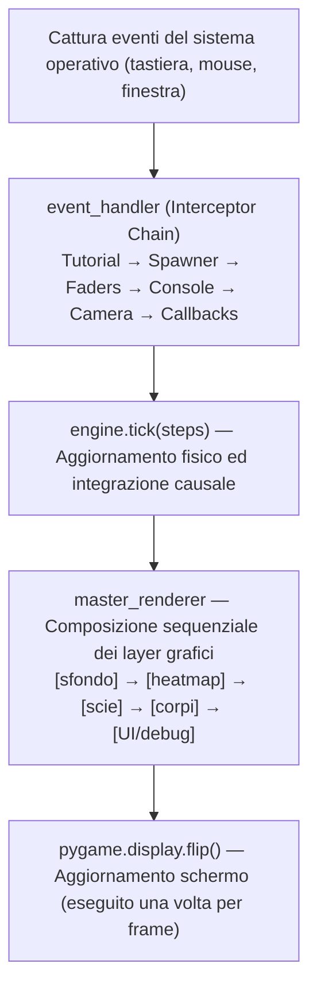
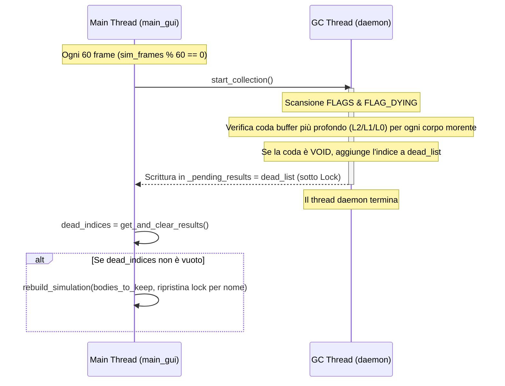

# Architettura ed Evoluzione di Astro Causal Sim

Questo progetto nasce con una filosofia precisa e un'architettura che l'ha inseguita, evolvendosi molte volte, cercando il compromesso tra rigore fisico e velocità computazionale in tempo reale sulla sola CPU. Tutto ruota attorno a un'idea sola: una porzione di spazio simulato in cui l'informazione gravitazionale viaggia e si propaga alla velocità della luce *c*. Non è un simulatore newtoniano con la causalità aggiunta come feature: è un simulatore causale che si abbassa al newtoniano dove la fisica lo consente, per efficienza.

Questo documento ripercorre i problemi reali incontrati durante lo sviluppo, i tentativi falliti e le soluzioni che hanno retto.

### Indice

1. [La scelta di Python e il paradigma DOD + JIT](#1-la-scelta-di-python-e-il-paradigma-dod--jit)
2. [Il Ring Buffer e lo storico delle posizioni](#2-il-ring-buffer-e-lo-storico-delle-posizioni)
3. [Collisioni, buchi neri e singolarità](#3-collisioni-buchi-neri-e-singolarità)
4. [Il rendering delle heatmap e la gestione degli FPS](#4-il-rendering-delle-heatmap-e-la-gestione-degli-fps)
5. [La sonda LIGO — Architettura di campionamento e dump](#5-la-sonda-ligo--architettura-di-campionamento-e-dump)
6. [Le scie dei corpi](#6-le-scie-dei-corpi)
7. [L'architettura di main_gui e dell'UI](#7-larchitettura-di-main_gui-e-dellui)
8. [Il garbage collector asincrono dei corpi causalmente morti](#8-il-garbage-collector-asincrono-dei-corpi-causalmente-morti)
9. [Il PerformanceManager — Auto-tuner con memoria e hysteresis](#9-il-performancemanager--auto-tuner-con-memoria-e-hysteresis)
10. [La GameConsole — Intercettore di stdout con timestamp di simulazione](#10-la-gameconsole--intercettore-di-stdout-con-timestamp-di-simulazione)
11. [La splash di caricamento — Tkinter prima di pygame con print interceptor thread-local](#11-la-splash-di-caricamento--tkinter-prima-di-pygame-con-print-interceptor-thread-local)
12. [Il launcher Tkinter](#12-il-launcher-tkinter)

---

## 1. La scelta di Python e il paradigma DOD + JIT

Python base è criticato per le pessime prestazioni su iterazioni pesanti, for annidati e operazioni su tensori. Si dimentica però che il suo vero valore sta nella sintassi pulita e nelle librerie esterne che ne annullano i difetti. Numpy è ottimizzato in C sotto il cofano, e Numba permette di compilare parti di codice direttamente in LLVM, lo stesso compilatore del C++. Questo consente di usare la programmazione di basso livello dove serve (nel core fisico) e la potenza astrattiva dell'OOP per l'impalcatura esterna. Dei piccoli limiti strutturali nonostante tutto rimangono: come l'assenza di controllo assoluto sui puntatori e sul garbage collection manuale che magari avrei avuto in C++, ma il compromesso è stato accettabile.

### Il problema concreto

I primi prototipi erano in Python OOP puro. Misurando con mano l'inefficienza strutturale ho capito il problema: le liste Python non sono contigue in memoria (sono di fatto liste di puntatori a punti sparsi nell'heap), e ogni accesso genera cache miss continui. Numpy risolve questo creando array C-contiguous in memoria: il prefetcher della CPU può trasferire grossi tensori in background, spesso caricando l'intero buffer nella cache L3 prima che il codice lo richieda.

### I tentativi

L'implementazione Numpy tramite Broadcasting è stata la prima scelta ovvia. L'idea era sfruttare l'overlay degli operatori nativi Python da parte di Numpy per i calcoli vettoriali: trattare l'intera mappa di pixel della heatmap come una variabile matrice e moltiplicarla per vettori 1D, così da sfruttare la capacità di Numpy di risolvere queste operazioni in C puro. Il problema è che Python converte *sempre* tutti i tipi Numpy (singole variabili o tensori) in oggetti temporanei Python prima di restituire il risultato. Questo crea heap non necessaria dentro i loop caldi e rende impossibile ottimizzare davvero.

### La scoperta / La soluzione

Con il fallimento del Broadcasting, l'unica svolta reale è stata Numba. Ho riscritto i cicli più critici decorandoli con `@njit(parallel=True, fastmath=True, cache=True)`:

- **`fastmath=True`**: dice al compilatore LLVM di ignorare alcune regole rigide dello standard IEEE 754 (non controlla costantemente NaN o infiniti, riorganizza le operazioni algebriche per renderle più veloci). Questo permette alla CPU di usare istruzioni matematiche vettoriali molto più aggressive. Conseguenza pratica importante: non potendo più fidarmi di `NaN`/`inf` come marcatori (il compilatore non li garantisce più), tutto il codice usa un valore sentinella *finito*, `VOID_VAL` (un numero enorme e negativo), per segnalare slot vuoti o corpi morti; i controlli diventano confronti finiti del tipo `valore > VOID_VAL`, sempre validi anche con fastmath (vedi §2).
- **`cache=True`**: salva il codice compilato su disco. Senza questo, ogni avvio del simulatore richiederebbe un freeze di compilazione. Con la cache, le esecuzioni successive partono all'istante.
- **`parallel=True`** è il parametro più delicato. Da solo non parallelizza nulla: abilita Numba a parallelizzare i loop esplicitamente decorati con `prange()` (oltre ad alcune auto-parallelizzazioni Numpy). La scelta architetturale concreta è quindi quale loop esprimere come `prange` e quale lasciare `range`.

Il loop del Velocity Verlet (lo schema d'integrazione numerica che fa avanzare le orbite passo dopo passo) per la fisica dei corpi ha fasi distinte, ciascuna con un profilo di costo e di parallelismo diverso:

| Fase | Operazione | Complessità | Parallelismo |
|:---:|---|:---:|:---:|
| **1** | Aggiornamento posizioni + primo half-kick velocità | $O(N)$ | sequenziale (barriera) |
| **2** | Forze gravitazionali causali tra tutti i corpi | $O(N^2)$ | `prange` (se $N > 35$) |
| **2.5** | Secondo half-kick velocità | $O(N)$ | accodata nel `prange` di Fase 2 |

All'inizio usavo `prange` su tutte le fasi. Andava più lento. Dove la complessità è lineare il calcolo è talmente rapido che il tempo speso a lanciare e sincronizzare i thread paralleli supera il tempo effettivo del calcolo su un singolo core. Il parallelismo è stato isolato **nella Fase 2** (il collo di bottiglia reale, $O(N^2)$) e **solo quando ci sono più di ~35 corpi** la fase 2.5 sfrutta il parallelismo già creato per la fase 2 e si accoda dentro lo stesso `prange`, mentre la fase 1 non può accodarsi perché è imperativo che le scritture nei buffer siano completate prima delle letture causali della fase 2 (read-after-write). Sotto questa soglia ricavata empiricamente di 35 corpi celesti i costi di overhead dei thread dominano ancora, quindi `engine.py` reindirizza la fisica verso una versione interamente sequenziale.

I kernel fisici non lavorano con classi o oggetti. Leggono e scrivono direttamente su `data.py`, che contiene principalmente array 1D contigui dove l'indice rappresenta l'identità del corpo celeste. Questo layout piatto è la condizione ideale per il compilatore LLVM: elimina l'allocazione di oggetti NumPy temporanei dentro i loop caldi.

Questo ha un risvolto della medaglia. Il cuore fisico del motore (forze causali, dead reckoning ossia l'estrapolazione della posizione dalla velocità nota, contributi di campo, collisioni) vive in **un solo file**, `kernel_helper_inline.py`, espanso via `inline='always'` dentro ogni kernel: una *formula* la cambio in un punto solo e tutti i kernel la ereditano. A essere duplicato non è la fisica ma lo **scaffolding**: l'attraversamento dei buffer (L0, L0+L1 o L0+L1+L2) e lo scheletro del loop nelle varianti parallela e sequenziale. Cambiare quella plumbing, o la firma di una funzione, costringe a toccare più kernel, ed è qui che la manutenzione si fa scomoda. La campagna 2.5PN (l'implementazione della reazione di radiazione gravitazionale nella forma reale di Damour-Deruelle) ne è stata la prova: allargare la firma di `compute_relativistic_force` (vi sono entrati posizione presente della sorgente, array delle masse, contatore di tick e `dt`) ha imposto di rimettere mano a ogni variante che la richiama. Quella stessa campagna ha avuto anche un esito fisico rilevante per l'architettura: il vecchio moltiplicatore euristico `m_chirp_mult`, che tarava a mano la dissipazione, è stato **rimosso** (oggi vale 1) e il motore gira *parameter-free*; l'intera storia, in tre fasi documentate con i grafici, è nel [§6.5 del doc fisico](PHYSICS_AND_SCENARIO_GUIDE.md#65-la-storia-da-m_chirp_mult-al-25pn-reale). La parte accoppiata è il contorno ad alte prestazioni, non il nucleo, che resta in un punto unico.

> [!IMPORTANT]
> La duplicazione è una scelta intenzionale, non un debito tecnico accidentale. Per far girare i kernel senza rallentamenti devo eliminare qualsiasi `if` o logica condizionale dentro i loop caldi: ogni branch nel ciclo $O(N^2)$ costa cicli moltiplicati per miliardi di iterazioni. `engine.py` fa da smistatore esterno (formalmente un wrapper): la selezione del kernel (single/double/triple, parallelo/sequenziale) avviene **una volta sola**, dentro `refresh_kernel()`, che gira all'init e a ogni rebuild e assegna `self.tick` alla funzione concreta come puntatore a funzione. A runtime `self.tick(steps)` è quindi una chiamata diretta senza nessun `if` di selezione: si è scelto il kernel monolitico giusto a monte, invece di ramificare *per ogni coppia* dentro il loop. È un approccio faticoso, che sacrifica la comodità di manutenzione per spremere quanti più FPS possibili. È la filosofia tipica dell'HPC: non ho l'autorità per definire questo codice come standard industriale, ma è la direzione e l'intento ingegneristico dietro queste scelte.

L'inlining (`inline='always'`) sui kernel helper dentro tutti i loop critici sia fisici che grafici è stato vitale per lo stesso motivo. Passare firme dati enormi a funzioni esterne confonde LLVM o rallenta l'esecuzione. Con `inline='always'`, Numba espande fisicamente il corpo delle funzioni helper dentro il ciclo chiamante a tempo di compilazione: zero overhead di chiamata a funzione a runtime, senza sacrificare la leggibilità del sorgente in fase di sviluppo.

### Come l'architettura abbatte i cache miss

Il layout di `data.py` è uno **Struct of Arrays (SoA)**: invece di un unico array di oggetti `CelestialBody`, esistono array separati e contigui per ciascun attributo fisico (`POS`, `VEL`, `ACC`, `MASS`, `RAD`, `FLAGS`). Questo è il pattern naturale del Data-Oriented Design.

Il vantaggio non è "tutti i dati del corpo `i` sono contigui": non lo sono, perché vivono in array separati. Il vantaggio è che **all'interno di un singolo array, gli elementi consecutivi sono contigui in memoria**. Quando il ciclo interno della Fase 2 scorre tutte le sorgenti `j` leggendo `POS[j]`, sta leggendo `POS[0], POS[1], POS[2]...` in stream sequenziale. Una cache line da 64 byte porta in cache 8 valori `float64`, ovvero le coordinate di 4 corpi consecutivi in un colpo solo. Il prefetcher hardware riconosce immediatamente il pattern di accesso sequenziale e carica la cache line successiva *prima* che il codice la richieda, spesso azzerando la latenza di accesso. Nel caso peggiore, un cache miss avviene ogni 64 byte di stream.

Con OOP puro ogni oggetto `CelestialBody` è un puntatore che può puntare ovunque nell'heap: ogni accesso a un nuovo corpo è quasi garantito un cache miss, che costa tra i 100 e i 300 cicli di clock di latenza. Moltiplicato per $N^2$ interazioni a ogni tick, la differenza in termini di throughput è un ordine di grandezza.

> [!NOTE]
> **Dove il broadcasting NumPy è invece la scelta giusta.** Il Velocity Verlet ha bisogno dell'accelerazione $a(t_0)$ già al primo passo: senza, il primo half-kick partirebbe da accelerazioni stantie. A ogni rebuild, `_prime_initial_accelerations()` calcola in un colpo solo le accelerazioni iniziali di tutti i corpi (Newton, Paczyński-Wiita ossia lo pseudo-potenziale per buchi neri, e reazione di radiazione), **proprio con il broadcasting NumPy** che a inizio capitolo ho scartato per il loop caldo. La contraddizione è solo apparente: il broadcasting fallisce nel ciclo $O(N^2)$ perché lì verrebbe eseguito milioni di volte al secondo, creando oggetti temporanei a ogni iterazione, ma è perfetto per un calcolo *one-shot* fatto una volta sola al rebuild, dove la pulizia vettoriale del codice vale più del costo degli oggetti intermedi. Lo strumento giusto dipende dalla frequenza d'esecuzione, non dallo strumento in sé.

---

## 2. Il Ring Buffer e lo storico delle posizioni

Nel primissimo prototipo il ritardo dell'informazione che viaggia a *c* era un flag booleano: diceva quando un corpo poteva "sapere" dell'esistenza di un altro, al di là del fatto che, una volta attivato il flag, la causalità veniva violata immediatamente. Era utile solo a mostrare l'onda di propagazione causale quando forzavo artificialmente un corpo a sparire all'istante; facendo sparire il Sole e vedendo l'onda propagarsi graficamente alla velocità della luce nella heatmap di Φ. Fisicamente insensato, ma graficamente già promettente.

### Il problema concreto

Serviva un modo per permettere al corpo osservante di "sentire" il *passato* del corpo osservato, in proporzione alla distanza dettata dalla velocità della luce. Non un flag, ma uno storico temporale reale da cui estrarre la posizione passata di ogni sorgente gravitazionale.

### I tentativi

È partito tutto con l'idea di implementare buffer circolari Python, poi sostituiti da buffer circolari C-like in Numba + Numpy. La versione Numba era già più veloce, ma soffriva il calcolo dei moduli `%` per ricavare le teste dei buffer circolari. L'operatore modulo richiede una divisione intera, che la CPU esegue in circa 15-30 cicli macchina. Moltiplicato per ogni accesso allo storico in ogni interazione $O(N^2)$, diventava un collo di bottiglia misurabile.

### La scoperta / La soluzione

**Il buffer come matrice 3D.** La struttura definitiva è `(numero_corpi, slot_storici_massimi, 5_parametri)`, dove la profondità temporale è decisa a monte in base al `simulation_radius` -> il raggio entro il quale la fisica è resa causale (oltre è deep space newtoniano istantaneo). Ogni slot rappresenta un `DT` nel passato. Per estrarre i parametri fisici di un corpo distante al suo momento di emissione, non serve nessuna ricerca: il ritardo temporale in tick è matematicamente calcolabile dalla distanza e da `c`, e l'accesso allo slot corretto è istantaneo `O(1)`.

```
I 5 parametri memorizzati per ogni slot:
[ pos_x | pos_y | vel_x | vel_y | massa ]
```

**Il problema della RAM.** Con `DT` piccolo (spesso sotto i 60 secondi) e `simulation_radius` di default a circa 10 miliardi di km (64 AU), il numero di slot storici necessari per coprire l'intera area alla velocità *c* raggiunge decine di milioni di elementi, saturando la RAM.

**La soluzione: LOD (Level of Detail) temporale gerarchico.** Lo storico è suddiviso in tre buffer circolari (se necessario) con frequenze di campionamento diverse:

```
Cronologia temporale reale del corpo celeste
t=0 ─────────────────────────────────────────────────── t=-t_delay

|══════ L0 (1×DT, alta risoluzione) ══════|
|═══════════════════ L1 (32×DT, media) ═══════════════════|
|═══════════════════════════════════════════════════════════════ L2 (256×DT, bassa) ═══════════════════════════════════════════════════════════════|
```

- **L0**: campiona ogni tick. Massima risoluzione per interazioni ravvicinate.
- **L1**: campiona ogni 32 tick. Copre le distanze intermedie.
- **L2**: campiona ogni 256 tick. Conservazione causale profonda nello spazio vuoto.

`simulation_manager.py` sceglie a runtime la modalità (`SINGLE`, `DOUBLE` o `TRIPLE`) confrontando la RAM stimata dei buffer con il 70% della cache L3 fisica rilevata sulla macchina. Questa soglia non è hardcoded: all'avvio `_get_cpu_details()` interroga il sistema operativo (WMI via PowerShell su Windows, `/sys` su Linux, `sysctl` su macOS) per leggere nome della CPU e dimensioni reali di L1/L2/L3. Così la stessa identica simulazione sceglie un'architettura di buffer diversa su PC diversi, adattandosi alla cache fisica effettivamente disponibile. Il dimensionamento di partenza deriva dal raggio causale:

$$\text{raw\_len} = \frac{\text{SIMULATION\_RADIUS\_KM}}{c \cdot DT}$$

| Modalità | Quando scatta | L0 | L1 | L2 |
|---|---|---|---|---|
| **SINGLE** | footprint L0 sotto soglia L3 | copre tutto il raggio causale (anche milioni di slot) | — | — |
| **DOUBLE** | footprint SINGLE supera la L3 | cap dinamico ≤ 16.384 slot (fino a 1024 se popolato) | copre il resto, stride 32 | — |
| **TRIPLE** | neanche L0+L1 stanno in L3 | cap dinamico | fisso a 2048 slot | copre il residuo, stride 256 (tetto $2^{28}$ celle, anti esaurimento memoria) |

Tutte le dimensioni vengono **arrotondate alla potenza di 2 immediatamente superiore**. Questo permette di sostituire l'operatore modulo con un'operazione bitwise AND:

```python
# Prima (costoso: ~20 cicli di clock)
idx = (head - ticks) % length

# Dopo (gratuito: 1 ciclo di clock)
idx = (head - ticks) & mask   # mask = length - 1
```

L'operazione `& mask` funziona solo se `length` è una potenza di 2: in quel caso, $\text{length} - 1$ ha tutti i bit bassi a 1, e l'AND tronca l'indice esattamente come farebbe il modulo, ma in un singolo ciclo macchina.

> [!NOTE]
> **Perché il buffer L2 in RAM non rallenta.** Il buffer L2 può essere enorme e non entra nella cache della CPU: vive in RAM. Ogni suo accesso che manca la cache è quindi una lettura dalla RAM, e *quella* è la cosa lenta (~100-300 cicli di latenza, non un generico "miss" a basso costo). Regge per due motivi. Primo, **frequenza**: il loop caldo scrive L2 solo ogni 256 tick e lo legge solo per i corpi distanti; nei sistemi compatti, dove la velocità conta di più (es. i merger), lo tocca pochissimo e scorre quasi sempre il buffer L0, che resta in cache. Le poche letture costose si **ammortizzano** così nel flusso di accessi a L0 economici: non è che il singolo miss costi poco, è che è raro rispetto agli hit in cache. Secondo, **fisica**: quando L2 viene letto è per corpi lontani, dove l'errore di campionamento a 256×DT cresce con la distanza ma il contributo gravitazionale decade come $1/r^2$; i due effetti si compensano, e la risoluzione grossolana è accettabile proprio lì. È il prezzo accettato per far stare storie temporali enormi in RAM. Infine, quando una lettura tocca L2, i 5 valori `[x, y, vx, vy, mass]` di uno slot sono contigui (40 byte, dentro una sola cache line da 64): si paga **un solo** cache miss, non cinque.

La ricerca nel buffer a cascata nei kernel helper segue questa logica: calcolo il ritardo in tick fisici, se rientra in L0 leggo da L0, altrimenti scalo su L1 o L2 riallineando logicamente l'indice. Tutto $O(1)$.

#### Esempio pratico — ricerca a cascata nello scenario Terra-Sole (modalità TRIPLE)

- **Setup**: distanza Terra-Sole $= 499$ secondi-luce; $DT = 0.001\ \text{s}$; ogni slot del buffer rappresenta un $DT$ nel passato.
- **Ritardo richiesto in tick**: $499 / 0.001 = 499.000$ tick.

Il kernel tenta la lettura in cascata:

1. **L0** (cap 16.384 slot, stride $1{\times}DT$): copre fino al tick 16.384. Insufficiente → scala a L1.
2. **L1** (2048 slot, stride $32{\times}DT$): copre fino al tick $2048 \times 32 = 65.536$. Ancora insufficiente → scala a L2.
3. **L2** (stride $256{\times}DT$, dimensionato sul `simulation_radius` di default 64 AU): copre ampiamente. L'indice è $i = \lfloor 499.000 / 256 \rfloor = 1949$.

I 5 parametri causali della sorgente si leggono in `HISTORY_L2[idx_sole, 1949]`.

#### Il doppio ritrovamento causale (due letture in cascata)

L'esempio sopra nasconde una sottigliezza: il ritardo in tick è stato calcolato dalla distanza **attuale** fra osservatore e sorgente, ma la posizione che conta è quella che la sorgente aveva **al momento dell'emissione**, che per corpi in moto non coincide. È un'equazione implicita (il tempo di volo dipende dalla posizione ritardata, che dipende dal tempo di volo), e la soluzione architetturale è volutamente non iterativa: **due letture O(1) in cascata**, non un solver.

1. **Prima lettura (stima).** Dalla distanza attuale si ricava un tempo di volo approssimato $r_{now}/c$, lo si converte in tick e si legge lo slot corrispondente: ne esce una posizione ritardata *stimata*.
2. **Seconda lettura (ricalcolo).** Dalla posizione stimata si ricalcola la distanza vera, quindi il tempo di volo vero, quindi un nuovo indice di slot: la seconda lettura restituisce posizione, velocità e massa all'istante di emissione effettivo, ed è su questi valori che procede il calcolo di forza, potenziale o quadrupolo.

Matematicamente il doppio passo equivale a una singola iterazione di Picard sull'equazione del cono di luce, che per orbite ordinarie ($v \ll c$) converge in un colpo (la trattazione fisica è nel [§3 del doc fisico-matematico](PHYSICS_AND_SCENARIO_GUIDE.md#3-aberrazione-causale-dead-reckoning-e-dinamica-relativistica)). La scelta di fermarsi a due passi invece di iterare fino a convergenza è ingegneria pura: il costo diventa **fisso e prevedibile** (due lookup bitmask per interazione, zero branch di controllo convergenza nel loop caldo), e l'errore residuo è di ordine superiore rispetto alle altre approssimazioni del passo discreto. L'implementazione vive in `kernel_helper_inline.py` (le funzioni `calculate_*_contribution` per i kernel grafici e il ramo causale di `compute_relativistic_force` per la fisica), espansa via `inline='always'` come tutto il resto del nucleo.

> [!NOTE]
> **Un'eccezione voluta: il bypass in regime GW.** La lettura della posizione di emissione descritta qui è la regola, ma c'è un caso in cui il kernel la salta deliberatamente. In campo forte (due corpi compatti vicini al merger) leggere la posizione di emissione introdurrebbe un'aberrazione che deforma il segnale del chirp; lì il kernel ignora il buffer e usa la posizione *presente* della sorgente, accettando di sacrificare la causalità su quella singola coppia per non sporcare la forma d'onda. Fuori da quel regime resta il dead reckoning del 2° ordine sulla posizione di emissione. Il dettaglio fisico è nel doc fisico-matematico.

---

## 3. Collisioni, buchi neri e singolarità

Il sistema di collisioni non è il focus del simulatore, è un sottosistema qualitativamente accettabile ma fisicamente molto approssimativo. Conserva la quantità di moto del corpo sopravvissuto e stima grossolanamente una quota di massa dispersa nell'impatto e la percentuale fusa nel vincitore. Abbastanza da essere fisicamente plausibile, non abbastanza da rallentare tutto.

### Il problema concreto

`DT` è l'elemento che rende discreta la simulazione. Più è piccolo, più precisa è la fisica, più pesante è il costo computazionale per secondo di simulazione. In "campo forte" (zone con gravità immensa vicino a un buco nero) può accadere che un corpo subisca un'accelerazione estrema in un singolo tick, e che al tick successivo abbia già attraversato l'intera sfera del buco nero conservando una energia enorme, venendo poi espulso a velocità subluminali insensate. È il classico "quantum tunneling numerico": il corpo passa attraverso l'ostacolo invece di scontrarsi con esso.

Fissare il raggio di cattura a un multiplo *statico* del raggio di Schwarzschild $R_s$ (per esempio $3\,R_s$, l'ordine di grandezza dell'ISCO) non basta: con DT non ideale il corpo tunnelizza oltre anche quella soglia ampliata. La chiave è rendere il multiplo **dinamico**, legato al DT.

### La scoperta / La soluzione

La soluzione ha due livelli.

**Livello 1: hitbox adattivo del buco nero.** Il moltiplicatore del raggio di accrezione non è fisso: viene calcolato a runtime in funzione del passo temporale.

$$\text{BH\_ACCRETION\_MULT} = \max\left(1.0,\ \min(10 \cdot DT,\ 100)\right)$$

A DT grande il bersaglio si espande aggressivamente per evitare il tunneling cinematico; a DT microscopico si stringe verso il limite inferiore di 1.0×. Concretamente:

| $DT$ | $\min(10 \cdot DT, 100)$ | Moltiplicatore finale | Regime |
|:---:|:---:|:---:|---|
| $1\ \mu\text{s}$ | $10^{-5}$ | **1.0×** (clamp inferiore) | merger: orizzonti tangenti, fisica precisa |
| $1\ \text{s}$ | $10$ | **10×** | orbite ordinarie |
| $60\ \text{s}$ | $600$ | **100×** (clamp superiore) | passo lungo: bersaglio largo anti-tunneling |

Il limite inferiore a 1.0× è una scelta fisica precisa: con `vis_r = R_s` due buchi neri di massa comparabile si fondono quando i loro orizzonti diventano tangenti, la condizione di contatto corretta per un merger come GW150914. Lo stesso floor, però, in una coppia a rapporto di massa estremo (un EMRI: un corpo leggero che spiraleggia dentro un buco nero molto più massiccio) è troppo permissivo. Lascia che il corpo leggero raggiunga la regione in cui lo pseudo-potenziale di Paczyński-Wiita, $-GM/(r - R_s)$, diverge: lì, con DT finito, un singolo passo d'integrazione gli inietta un'energia enorme, e poiché il freno d'inerzia relativistico viene valutato sulla velocità *prima* del kick, quel singolo passo fa in tempo a espellerlo a velocità innaturali prima che il freno entri in azione.

La guardia EMRI (`emri_guard`) chiude questo buco. Quando il moltiplicatore scende sotto la soglia ISCO (~1.9×, cioè a DT piccolo), per una coppia asimmetrica con un buco nero (rapporto di massa sopra 3:1, soglia che discende dalla scala del pericolo: al contatto la distanza dalla singolarità del grande è $R_{s,B}$, e l'amplificazione del denominatore PW cresce col *quadrato* del rapporto di massa) il raggio di cattura del corpo grande viene riportato alla scala dell'**ISCO** (l'*Innermost Stable Circular Orbit*, l'ultima orbita circolare stabile): sotto di essa non esiste più alcuna orbita legata e qualsiasi traiettoria precipita verso il centro. Spostare lì il confine di assorbimento è giustificato due volte. Fisicamente: un corpo oltre l'ISCO è comunque condannato a cadere, quindi catturarlo a quel raggio non falsifica la dinamica. Numericamente: catturato all'ISCO, il corpo leggero non raggiunge mai il tratto ripido del potenziale e l'iniezione spuria di energia semplicemente non avviene. È una regolarizzazione per assorbimento: invece di clampare la velocità *dopo* il kick anomalo, si sposta indietro il confine e si rimuove la sorgente del kick. La guardia vive solo a DT piccolo; a DT grande il bersaglio è già abbastanza largo da non averne bisogno.

**Livello 2: Continuous Collision Detection (CCD).** Sensore aggiuntivo che vale per tutti i contesti ma nel pratico tende ad attivarsi principalmente in situazioni di campo forte. Per ogni coppia di corpi attivi nel ciclo $O(N^2)$:

1. Si calcola il vettore di spostamento relativo nel tick corrente: $\Delta r = (\vec{v}_i - \vec{v}_j) \cdot dt$.
2. Si lancia un **ray cast lineare** lungo questa traiettoria: se il segmento da `pos_current` a `pos_next` interseca la sfera d'accrezione, il tunneling è in corso.
3. Si calcola $t_{min} \in [0, 1]$ (un numero tra 0 e 1: la frazione del tick in cui avviene il minimo approccio, dove 0 è l'inizio del tick e 1 la fine) e la fusione viene gestita a quella posizione interpolata, non alla fine del tick.

**Il filtro spaziale $O(N^2)$ → quasi-$O(N)$.** Il ciclo collisioni è nominalmente $O(N^2)$ ma nella pratica è quasi $O(N)$ grazie a un pre-passo di filtraggio. Prima del doppio loop, una scansione lineare calcola `max_v` (la velocità massima tra tutti i corpi) e ne deriva $\text{max\_move} = \text{max\_v} \cdot dt \cdot 2$ (il massimo spostamento relativo possibile in un tick nel caso peggiore). Nel ciclo successivo, per ogni coppia $(i, j)$ viene confrontato il gap $|\Delta x| - (r_i + r_j)$ con `max_move`: se il gap è maggiore, la coppia è geometricamente impossibilitata a collidere in questo tick e si fa early-exit prima ancora di toccare `vel_arr`. In uno scenario galattico a ~200 corpi (~20.000 coppie nominali per tick), il filtro scarta tipicamente oltre il 99% delle coppie prima del calcolo CCD vero: la complessità nominale resta $O(N^2)$ ma il costo effettivo collassa al piccolo sottoinsieme di coppie geometricamente plausibili.

A complemento, un sistema di **cooldown dinamico** (`COLLISION_COOLDOWN`) calcola tramite cinematica quadratica quanti tick sono fisicamente necessari perché *qualsiasi* coppia possa entrare in contatto, dato il minimo gap rilevato nel tick corrente e l'accelerazione massima in scena. Per quel numero di tick l'intero modulo collisioni viene saltato in toto. La stima cinematica però assume accelerazione costante: in una caduta $1/r^2$ l'accelerazione cresce, e a passo grosso il cooldown rischierebbe di saltare *oltre* l'urto (i plunge frontali a momento angolare nullo, che non beneficiano dell'espansione del raggio di accrezione, erano gli unici a tunnelare proprio per questo). Il salto è perciò **limitato da un cap di velocità**: due corpi non si chiudono più veloci di circa $0.75\,c$ relativi, quindi il cooldown non supera mai `min_gap / (0.75·c·DT)` tick, cioè garantisce almeno un controllo CCD ogni $0.75\,c \cdot DT$ di spazio percorribile (con un clamp in km, perché a DT grande $0.75\,c \cdot DT$ diventa enorme e forzerebbe il controllo su coppie ancora lontane).

---

## 4. Il rendering delle heatmap e la gestione degli FPS

La heatmap del potenziale $\Phi$ era la prima visualizzazione implementata, ed è passata dall'essere estremamente lenta a girare con fluidità nel momento in cui l'ho parallelizzata con Numba. La logica di base è sempre stata: stimare il $\Phi$ massimo atteso a $N \cdot R_s$ dal corpo più massiccio presente in simulazione, usarlo come tetto della scala, normalizzare ogni pixel tra 0 e 1, e convertire in colore per fasce. Prima si crea il range, poi si normalizza, poi si colora.

Per la gestione delle prestazioni grafiche rimando al §9 di questo documento e alla sezione dedicata nel README principale. In breve: disaccoppiamento TPS/FPS, auto-tuner che riduce la risoluzione spaziale del calcolo incrementando lo stride dei pixel (i vuoti vengono riempiti tramite `pygame.transform.smoothscale`), e integrazione opzionale di OpenCV (`cv2.resize`) per chi lo installa, che è più veloce dell'interpolazione di Pygame e libera cicli di calcolo. L'utente può interagire con questo bilanciamento a runtime tramite i tasti `T`, `Y`, `G` e i numerici `1`-`5`.



Solo ciò che è inquadrato dalla camera viene renderizzato: regola valida per ogni elemento grafico del simulatore.

### Il problema concreto

Con la heatmap $\Phi$ perfettamente funzionante, ho ipotizzato che visualizzare la variazione di $\Phi$ *nel tempo* (non nello spazio: quello è il gradiente $\nabla\Phi$, già diverso) avrebbe reso visibili le perturbazioni del campo durante la fase di inspiral di oggetti estremamente massicci. L'obiettivo era un visualizzatore di onde gravitazionali, o quantomeno l'analogia sovrapponibile più fedele possibile in un simulatore scalare 2D.

### I tentativi

Il ragionamento iniziale era: prendo due frame di Φ consecutivi e li confronto. Problema: confrontare due frame è costoso, dimezza il framerate, ma soprattutto dipende da `DT`. Se troppo basso il cambiamento tra frame potrebbe non essere visibile, se troppo alto si perde la definizione spaziale dell'onda. A quel punto ho abbandonato il ragionamento da "architetto" e sono andato a cercare una soluzione matematico-fisica, procedendo per gradi.

### La scoperta / La soluzione

Qui un fisico sarebbe arrivato subito alla risposta; io ci sono arrivato passo passo, ragionando sull'intorno matematico di $\Phi$ diviso l'intorno del tempo, cioè la derivata parziale $\partial\Phi/\partial t$ in ogni punto dello spazio. Non è stata una scorciatoia elegante, ma quel percorso lento mi ha dato un'intuizione che ho poi riusato per tutte le altre heatmap del campo.

Concretamente: $\Phi = GM/r$, e quando la sorgente si muove la distanza $r$ cambia nel tempo. La derivata si riduce, per ogni sorgente, a $\partial\Phi/\partial t = G M \, v_{rad} / r^2$, dove $v_{rad}$ è la componente della velocità lungo la linea che congiunge la sorgente al punto osservato. Il risultato è il "contributo $d\Phi$" di ciascun corpo a ciascun pixel, sommato su tutti i corpi, calcolato nei kernel helper con `inline='always'` e parallelizzato su tutta la griglia.



Da questa base sono poi nate le altre visualizzazioni del campo:

**Heatmap di Roche e Lagrange.** L'Hessiana e il gradiente del potenziale efficace $\Phi_{eff}$ (gravità più termine centrifugo nel riferimento co-rotante) individuano i punti di Lagrange come zeri del gradiente, e il segno del determinante dell'Hessiana li classifica (selle instabili L1, L2, L3 contro massimi stabili L4, L5). Non scendo qui nel dettaglio del calcolo: il kernel usa uno stimatore di distanza di tipo Newton-Raphson per dimensionare i punti luminosi. Basti l'analogia dichiarata: è **come se ogni punto di equilibrio fosse illuminato da una gaussiana centrata sullo zero del gradiente**, con la cresta della campana esattamente dove la forza netta si annulla. Così i punti di Lagrange, altrimenti invisibili perché schiacciati dai valori estremi vicino ai corpi, diventano picchi luminosi. Il lobo di Roche (il volume entro cui la materia resta legata a uno dei due corpi) è l'equipotenziale di $\Phi_{eff}$ che passa per L1, il punto di sella attraverso cui la materia può trasferirsi da un corpo all'altro.

Un dettaglio che abilita tutto questo: l'overlay co-rotante ha bisogno di **due** corpi (target più attrattore), ma l'utente ne blocca uno solo. L'altro è dedotto da un array 1D, `TOP_ATTRACTOR`, precalcolato una volta sola a ogni rebuild (`_compute_top_attractors`). Per ogni corpo l'attrattore dominante non è scelto per massa o distanza pure, ma per **forza di marea $M/r^3$** (la logica della sfera di Hill): è per questo che bloccando Io si ottiene la mappa Io-Giove e non Io-Sole, perché localmente è Giove a dominare il gradiente. È lo stesso pattern del resto del motore: lavoro pesante a monte (al rebuild), lookup $O(1)$ a runtime.

**Heatmap GW Strain (quadrupolo proiettato).** L'ultima arrivata della famiglia, e quella che spinge più a fondo la pipeline causale in ambito grafico. Per ogni pixel e per ogni corpo della coppia, il kernel esegue il **doppio ritrovamento causale** (§2) per ottenere posizione e velocità *al tempo ritardato di quel pixel*, sottrae il moto del centro di massa, proietta la velocità ritardata sul versore pixel-sorgente e sulla sua ortogonale, e mappa la differenza quadratica $v_r^2 - v_t^2$ (la formulazione fisica completa è nel [§7.6 del doc fisico](PHYSICS_AND_SCENARIO_GUIDE.md#76-deformazione-proiettata-gw-strain-quadrupolare)). Dal lato architetturale valgono tre scelte: primo, come le altre heatmap è **un kernel unico** con la cascata L0/L1/L2 risolta a runtime (la giustificazione è nella sottosezione seguente); secondo, la compressione dinamica usa **asinh** invece della tanh di dΦ/dt, per lasciare leggibili i segnali deboli in campo lontano senza bruciare i picchi vicino alla coppia; terzo, il fader di sensibilità **riusa il canale del fader Roche** invece di introdurne un quarto, un compromesso di UI che tiene il numero di controlli costante.

### Perché la grafica non è specializzata per modalità buffer

A differenza dei kernel fisici (`kernel_single/double/triple`), il graphics kernel è **uno solo**: la cascata L0→L1→L2 è risolta a runtime dentro le funzioni di contributo (`calculate_potential_contribution`, `calculate_dphi_contribution`), con `if` sui livelli effettivamente allocati. La ragione è la **frequenza di esecuzione**. La fisica gira fino a 10.000 volte per frame dentro un ciclo $O(N^2)$: lì ogni `if` di selezione buffer sarebbe colpito miliardi di volte al secondo, quindi va eliminato a monte specializzando tre kernel monolitici (vedi §1). La grafica gira invece **una volta per frame**, sui soli pixel visibili: gli stessi `if` vengono valutati ordini di grandezza meno spesso e non sono moltiplicati per $S$, quindi costano poco e non giustificano di triplicare il codice grafico, che tra Φ, dΦ/dt, Roche, Tidal, Lagrange e GW Strain è grande e molteplice: mantenerne tre varianti sincronizzate costerebbe molto per un risparmio marginale. È lo stesso principio asimmetrico di tutto il motore: si specializza dove il loop caldo lo impone, si generalizza dove il costo è trascurabile.

---

## 5. La sonda LIGO — Architettura di campionamento e dump

Solo dopo aver visto emergere comportamenti fisicamente credibili (in particolare la perturbazione a spirale del campo `dΦ/dt` con i buchi neri in fase di inspiral, descritta nel capitolo precedente) ho aggiunto uno strumento "listener" virtuale al sistema. L'analogia con le onde gravitazionali misurate da LIGO/Virgo era calzante: un ascoltatore spaziale a pochi milioni di km dall'evento, che registrasse la perturbazione locale del campo.

La pipeline DSP a valle (Tukey, Butterworth, STFT, Hilbert, Peters) è documentata nel doc fisico-matematico. Qua interessa **come è costruita la sonda dentro il sistema**.

### Vincoli architetturali

La sonda è uno strumento **opzionale e manuale**: è l'utente a decidere *se* attivarla e *dove* posizionarla (tasto `P`, click sullo spazio vuoto); il sistema si limita a *suggerire*, tramite gli avvisi RADAR, quando e dove conviene piazzarla per cogliere un evento. Una volta accesa, però, deve rispettare alcuni vincoli tecnici:

1. **Vivere dentro il loop fisico** senza rallentarlo. Ogni tick di simulazione deve poter scrivere un campione, anche a `DT = 1 μs` (1.000.000 di campioni/secondo).
2. **Gestire correttamente i rebuild della simulazione**. Ogni cambio di DT, raggio causale o spawn ricostruisce tutti i buffer storici da zero. La sonda va trattata a parte: a DT invariato il suo buffer va preservato intatto, ma a DT diverso (cioè a frequenza di campionamento diversa) continuare lo stesso segnale non avrebbe senso, quindi va salvato su disco e poi riavviato da zero.
3. **Essere un singleton globale**, esiste una sola sonda nell'universo simulato.
4. **Esporre dati al renderer e al disco senza copie inutili**.

### Le scelte

**Buffer dedicato pre-allocato.** `PROBE_BUFFER` è un array NumPy 1D di `float64` con dimensione `2**21 = 2.097.152` slot (~16 MB). La dimensione è una potenza di 2 esatta per usare il solito trucco della bitmask circolare: `(head + 1) & PROBE_MASK` invece di `% PROBE_LEN`. Lo stesso pattern dei buffer storici, riapplicato qui.

**Stato vettorizzato in array da 1 elemento.** `PROBE_HEAD`, `PROBE_ACTIVE`, `PROBE_POS` sono array NumPy di dimensione 1 (`np.zeros(1, dtype=np.int32)` ecc.) invece di scalari Python. Questo perché Numba JIT non può scrivere su variabili Python globali da dentro un `@njit`, ma può scrivere su elementi di array NumPy passati per riferimento. È il pattern standard per stato mutabile dentro kernel JIT.

**Lettura sempre da L0, mai dai buffer LOD.** La sonda non interroga lo storico passato: legge sempre lo stato istantaneo dei corpi al tick corrente. Questa scelta è intenzionale: campionare dai buffer compressi L1 o L2 introdurrebbe un errore di campionamento che deforma la forma d'onda del chirp e rende impossibile l'analisi spettrale. Va detto chiaramente che questa è una **scorciatoia di simulazione, non realismo fisico**: un interferometro reale misura l'onda che gli è arrivata propagandosi a $c$, non lo stato istantaneo della sorgente. Qui leggiamo L0 istantaneo solo per ottenere un segnale pulito, accettando consapevolmente di sacrificare la causalità della misura.

**Disaccoppiamento sonda ↔ rebuild.** Quando `rebuild_simulation()` rialloca tutti i buffer storici, il `PROBE_BUFFER` viene **preservato** se DT e dimensioni dei buffer storici non sono cambiati (`can_deep_copy` in `_restore_bodies`). Se invece il rebuild cambia i parametri, il contenuto della sonda viene **dumpato automaticamente** su disco in un thread daemon `threading.Thread(target=_dump_task, daemon=True)` prima di azzerare il buffer. L'utente non perde mai la telemetria registrata.

**Singleton via classe sottile.** `SpaceProbeController` non possiede dati: tutti i dati vivono in `data.py`. Il controller espone solo le operazioni di alto livello (`activate_at`, `deactivate`, `dump_session`, `get_current_strain`). Quando inattiva, la sonda viene parcheggiata a `VOID_VAL` (coordinate impossibili nello spazio simulato), garantendo che nessun calcolo accidentale produca strain spurio.

**Dump finale all'uscita.** Al termine del processo (`pygame.quit()`), `main_gui.py` controlla `ligo_probe.active` e forza un ultimo `dump_session()`. Un breve `time.sleep(1.0)` dà al thread daemon di salvataggio il tempo di completare la scrittura su disco prima che Python termini il processo principale.

Il segnale grezzo è un proxy cinematico dello strain reale: per ogni corpo si somma $m_j\,(v_{x,j}^2 - v_{y,j}^2)/R_j$, con $R_j$ la distanza tra sorgente e sonda. Le velocità sono misurate rispetto al centro di massa del sistema, non in assoluto: conta il moto relativo dei corpi, e il segnale non cambia se l'intera scena trasla a velocità costante. Il termine $1/R_j$ fa calare l'ampiezza quando la sorgente si allontana dalla sonda, come nell'onda vera, e il risultato oscilla al doppio della frequenza orbitale, la stessa firma dell'onda gravitazionale reale. È una semplificazione algebrica documentata e discussa nel doc fisico-matematico. Questo segnale grezzo non è ancora leggibile di per sé: è `ligo_analyzer.py`, una pipeline indipendente, a trasformarlo in dati e grafici noti (spettrogrammi, frequenza istantanea, stima della massa chirp), interpretando ciò che la sonda ha registrato.

---

## 6. Le scie dei corpi

Le scie hanno rappresentato un peso e un problema sproporzionato rispetto alla loro apparente semplicità. Il problema fondamentale: se scrivi un punto per ogni tick fisico, su simulazioni lunghe i punti diventano milioni, densissimi, e intasano sia la grafica che la RAM. Serviva una strategia che mantenesse scie visivamente soddisfacenti con un costo fisso e predicibile.

La soluzione ha tre componenti:

**Budget totale fisso.** C'è un numero massimo assoluto di punti scia distribuito tra tutti i corpi presenti. Ogni corpo riceve una quota proporzionale. Struttura: matrice `(max_corpi, max_punti_per_corpo, 2)` pre-allocata, gestita come buffer circolare.

**Campionamento adattivo per tipo di corpo.** Un nuovo punto scia viene scritto solo se il corpo si è spostato, **in coordinate del mondo**, oltre una soglia di distanza che dipende dal *tipo* di corpo. La logica (`update_trail_logic`) è una matrice 2×2 raggio×velocità: un corpo enorme e lento (il Sole) ottiene la soglia più fine per catturare le cuspidi; un corpo veloce (pianeta o binaria) ottiene una soglia media per avere abbastanza storia visibile; un corpo piccolo e lento (asteroide alla deriva) ottiene la soglia più grossolana per non sprecare buffer. Questo campionamento è puramente fisico: **non dipende in alcun modo dalla camera**.

**Rendering solo del visibile (è qui che entra la camera).** La camera non influenza *cosa* viene salvato, ma solo *cosa* viene disegnato. Solo i punti dentro il frustum vengono processati e renderizzati; i segmenti che attraversano l'intero schermo (frequenti dopo un cambio di zoom drastico) vengono scartati confrontando la distanza in pixel tra punti consecutivi: se troppo grande, il segmento non viene disegnato. Il peso grafico delle scie resta minimo. Per scie davvero fluide e dense a qualsiasi scala servirebbe la GPU (è uno dei limiti noti dell'architettura CPU-only).

**Le teste di scrittura.** Ogni corpo ha un proprio cursore `trail_heads[i]` che avanza solo quando un punto viene effettivamente scritto (`head = head + 1`, con reset a 0 a fine buffer). Dato che le scritture sono rare (scattano solo al superamento della soglia di spostamento, non a ogni tick), l'avanzamento delle teste è trivialmente economico e non rappresenta un collo di bottiglia.

---

## 7. L'architettura di main_gui e dell'UI

### Il problema concreto

`main_gui.py` è diventato rapidamente ingestibile: un unico file che superava le 2.000 righe di `if`/`elif` annidati che gestivano eventi, stato, fisica e rendering tutti nello stesso posto. Era impossibile da modificare senza rompere qualcosa, e leggere il flusso di esecuzione richiedeva di tenere in testa troppo contesto simultaneamente.

### La scoperta / La soluzione

**Il loop principale.** Il game loop segue un ordine fisso e non derogabile:



**L'Interceptor Chain degli input.** Ogni elemento della catena può consumare un evento (ritornando `True`) bloccando la propagazione ai moduli successivi. Questo impedisce comportamenti incoerenti (ad esempio muovere la camera mentre si digita un comando nella console). La struttura è copiata dall'architettura degli event handler nei videogiochi: ogni interceptor è responsabile di un dominio preciso e non sa nulla degli altri.

**Il singleton UIState.** Tutto lo stato dell'interfaccia (quale heatmap è attiva, lo zoom corrente, i flag delle overlay, il corpo selezionato) vive in un singleton `UIState` accessibile da tutti i moduli senza passare parametri in giro. È una scelta discutibile dal punto di vista del "Clean Code" (dipendenza globale), ma con un unico thread principale e uno stato UI letto da dozzine di punti diversi, il compromesso tra purezza e praticità è stato sciolto a favore della seconda.

**Il master_renderer e i layer.** Ogni elemento visivo è un layer separato disegnato nell'ordine corretto su una superficie Pygame. Il `flip()` avviene una volta sola alla fine del frame: durante tutta la composizione il display non mostra nulla, eliminando il tearing visivo. Questo ha ridotto `main_gui.py` da oltre 2.000 righe a circa 300. Tra i layer figura anche il **Pannello di Telemetria Orbitale** (l'HUD con posizioni, velocità e accelerazioni assolute e relative del corpo selezionato): i suoi contenuti e la loro interpretazione fisica sono documentati nel [§7.8 del doc fisico](PHYSICS_AND_SCENARIO_GUIDE.md#78-il-pannello-di-telemetria-orbitale-hud).

### Sequenza di bootstrap del processo principale

L'ordine di inizializzazione non è arbitrario. Ogni fase ha precondizioni precise sulle fasi precedenti.

```
FASE A — Pre-pygame (Tkinter splash ancora attivo)
  ├─ GlobalState() istanziato (UI/simulation flags)
  ├─ show_splash_and_load(preset, gstate, dt_val)
  │     ├─ presets.get_preset() → lista CelestialBody
  │     ├─ rebuild_simulation() → alloc buffer L0/L1/L2 + scie + sonda
  │     └─ Buffer di print differito raccolto (no terminal yet)
  └─ data.DT impostato

FASE B — Bootstrap pygame
  ├─ pygame.display.init() + pygame.font.init() (NO audio)
  ├─ sys.stdout = GameConsole(sys.stdout)  ← stdout interceptor
  ├─ flush_deferred_prints() → log del loading nella console
  ├─ screen = pygame.display.set_mode(...) (gestisce anche fullscreen)
  ├─ clock = pygame.time.Clock()
  └─ 6 font monospace (HUD, console, tutorial, legend)

FASE C — Costruzione layer rendering
  ├─ OverlayRenderer(fonts...) — HUD, tutorial, legenda, info debug
  └─ MasterRenderer(fonts..., overlay_renderer) — composizione finale

FASE D — Costruzione layer fisico
  ├─ Camera(w, h) + auto-focus sul corpo più massiccio
  │     ├─ next((b for b if b.mass >= data.TOP_MASS * 0.999))
  │     └─ scale = top_body.radius / 10.0 (clampato a 0.001)
  ├─ Engine(bodies) — compila kernel JIT al primo tick (cache=True salva su disco)
  └─ SpaceProbeController() — singleton sonda LIGO, inizia disattivata in VOID

FASE E — Costruzione UI runtime
  ├─ GravityRenderer(w, h, resolution_div) — renderer heatmap
  ├─ 3 VerticalFader (sensitivity DPHI, ROCHE, contrasto)
  ├─ PerformanceManager() — auto-tuner risoluzione
  ├─ TutorialPopupManager(fonts...)
  └─ OrbitalSpawner()

FASE F — Stato condiviso
  └─ UIState (singleton) popolato con TUTTI i riferimenti sopra
       (bodies, engine, renderer, camera, gstate, faders, perf_manager,
        ligo_probe, screen, indici lock/lagrange, flag conferma...)
       I locali originali vengono distrutti via `del` per evitare
       desincronizzazioni accidentali tra local e ui_state.*

FASE G — Worker threads e tracker
  ├─ DeathTracker() — logger eventi impatti (sync, leggero)
  └─ GCWorker() — collector asincrono dei corpi causalmente morti

FASE H — Input chain
  ├─ EventHandler() istanziato
  └─ InputController().register(event_handler)
        ↑ qui vengono installati tutti gli interceptor della chain

FASE I — Frame zero
  ├─ ui_state.gstate.paused = True
  ├─ push_default_tutorials() → primo popup visibile
  └─ while ui_state.running: → main loop entra
```

Punti notevoli sull'ordine:

- **Tkinter prima di pygame**: la splash deve esistere prima dell'init del display, altrimenti l'utente vede una finestra nera durante il caricamento (alloc buffer pesanti + prima compile Numba).
- **Console interceptor prima del flush**: i print differiti del thread di loading vanno catturati dalla `GameConsole`, non al terminale grezzo. Se l'ordine fosse invertito, quei log non finirebbero mai nell'interfaccia.
- **Engine prima dei worker thread**: il `GCWorker` legge `data.FLAGS` e `data.HISTORY_LX`. Se partisse prima della Fase D, leggerebbe array placeholder vuoti e scriverebbe risultati senza senso.
- **InputController dopo `UIState`**: gli interceptor leggono lo stato condiviso al momento del dispatch. Registrarli prima che `ui_state` sia popolato causerebbe `AttributeError` al primo evento.
- **`paused = True` prima del loop**: se il primo tick di fisica girasse prima del popup tutorial, la simulazione partirebbe a corpi liberi sotto al testo di benvenuto, con effetti visivi confusi.

---

## 8. Il garbage collector asincrono dei corpi causalmente morti

Quando un corpo viene distrutto (collisione, comando manuale, ingestione in un buco nero), non scompare istantaneamente dall'universo simulato. Il suo passato continua a esistere nei buffer storici degli altri corpi che lo "vedevano" via cono di luce passato. Solo quando il **VOID_VAL** (sentinella di "non-esistenza") ha riempito il tail del buffer più profondo, nessun corpo nell'universo può più riceverne informazione gravitazionale: a quel punto il corpo è **causalmente morto** e può essere effettivamente rimosso.

### Il problema concreto

La detection di morte causale richiede uno scan dei buffer storici: per ogni corpo in stato `FLAG_DYING`, controllare il valore alla coda del buffer più profondo disponibile (L2 se esiste, sennò L1, sennò L0). È un'operazione lineare nel numero di corpi morenti: non pesantissima, ma non gratuita, e va eseguita con regolarità per non accumulare cadaveri nello storico.

Eseguirla dentro il main loop pesa sul frame budget di 16.6 ms. Saltarla per troppi frame consecutivi gonfia inutilmente lo storico, perché i corpi morti continuano a essere referenziati nei loop $O(N^2)$.

### La soluzione

**Thread daemon producer/consumer.** Ogni 60 frame il main loop chiama `gc_worker.start_collection()`. Se non c'è già un thread daemon attivo, ne viene avviato uno che esegue lo scan dei buffer fuori dal frame budget. I risultati (lista di indici causalmente morti) vengono scritti in `_pending_results` sotto `threading.Lock`. Il main thread, sempre ogni 60 frame, chiama `get_and_clear_results()` che ritorna la lista pronta (o `None` se ancora in scansione).

Pattern essenziale:



> [!TIP]
> **Perché thread daemon e non worker persistente.** Il thread daemon vive solo per la durata di uno scan e poi muore. Non c'è una coda di task, non c'è un worker che dorme in attesa. Il pattern è "fire and forget con lock sul risultato": più semplice da debuggare, zero overhead di idle, e nessun rischio di thread zombie quando il processo principale termina (i daemon muoiono con lui).

**Anti-sovrapposizione.** `start_collection()` controlla `is_alive()` sul thread precedente: se uno scan è già in corso, il nuovo trigger viene ignorato. Su scenari pesanti dove lo scan dura più di 60 frame, il GC scala automaticamente la sua frequenza al ritmo che riesce a sostenere.

**Re-mapping degli indici dopo rebuild.** Quando il main thread riceve `dead_indices`, costruisce `bodies_to_keep` per esclusione e chiama `rebuild_simulation()`. Questo compatta gli indici da 0 a N-1, quindi `locked_body_idx`, `lagrange_target_idx` e `lagrange_attr_idx` puntano potenzialmente a corpi sbagliati. La soluzione: prima del rebuild si salvano i **nomi** dei corpi referenziati, e dopo il rebuild si ri-cercano gli indici per nome. È più robusto di mantenere mappe di traduzione, e gestisce gracefully il caso in cui il corpo lockato fosse proprio uno dei morti (la ricerca per nome ritorna `None` e il lock viene sciolto).

---

## 9. Il PerformanceManager — Auto-tuner con memoria e hysteresis

L'auto-tuner della risoluzione delle heatmap è citato in Sezione 4 ma vale un capitolo a sé per la qualità ingegneristica. Non è un semplice "se FPS basso, riduci risoluzione": è un piccolo sistema di controllo con tre proprietà non banali.

### Il problema concreto

Un auto-tuner ingenuo oscilla. Vede FPS basso, dimezza la risoluzione, gli FPS schizzano sopra soglia, raddoppia la risoluzione, FPS crolla di nuovo, dimezza... il sistema vibra avanti e indietro senza stabilizzarsi mai su una configurazione utile. Peggio: ogni cambio di risoluzione costa un costo di setup (riallocazione contesto, smoothscale), quindi le oscillazioni peggiorano direttamente l'esperienza visiva.

### La soluzione

Tre meccanismi combinati:

**1. Doppia soglia con cooldown asimmetrico.**

| Condizione FPS | Azione |
|---|---|
| $\text{FPS} < 30$ (`FPS_LOW_LIMIT`) | **downgrade immediato** (raddoppia lo stride) |
| $30 \le \text{FPS} \le 58$ | **zona morta**: nessuna azione |
| $\text{FPS} > 58$ (`FPS_HIGH_LIMIT`) | candidato a **upgrade**, ma soggetto a streak |

La banda morta tra 30 e 58 evita la maggior parte delle oscillazioni naturali del frame rate ed è volutamente ampia: sotto i 30 FPS l'esperienza degrada davvero, sopra resta fluida, quindi si scala la risoluzione solo quando serve sul serio invece di sacrificarla a framerate ancora confortevoli. Il downgrade è immediato (la fluidità è prioritaria), l'upgrade è graduale.

**2. Stability streak.** Prima di accettare un upgrade, il sistema richiede **3 cicli consecutivi** sopra `FPS_HIGH_LIMIT`, separati da un `COOLDOWN_MS` di 5 secondi dall'ultimo downgrade. Significa che servono almeno 15 secondi di stabilità solida sopra soglia prima di tentare un raddoppio della risoluzione. Una fluttuazione transiente verso l'alto non basta a innescare il cambio.

**3. Memoria di performance.** Il manager mantiene un dizionario:

```python
self.perf_memory[(resolution_div, speed_multiplier, view_mode)] = current_fps
```

Ogni configurazione testata viene registrata con gli FPS effettivamente osservati. Prima di accettare un upgrade da `div=4` a `div=2`, il manager cerca in memoria: *"ho mai girato con div=2, questo speed_multiplier e questa view_mode?"* Se sì e gli FPS registrati erano sotto soglia, **cancella l'upgrade prima ancora di tentarlo**. Stampa un log e mantiene lo stato corrente. Questo elimina la classe di oscillazioni "upgrade → downgrade immediato": il sistema impara dalla propria storia.

Esempio concreto della cancellazione:

```
t=0s    div=4, view=dphi → 60 FPS osservati   → perf_memory[(4, mult, dphi)] = 60
t=15s   3 streak sopra 58 FPS → candidato upgrade a div=2
        lookup perf_memory[(2, mult, dphi)] → 27 FPS (registrato in passato)
        27 < 30 → UPGRADE CANCELLATO, resta a div=4
        log: "[AUTO-TUNE] CANCELED upgrade to div=2 ... Past memory recorded 27.0 fps here."
```

Senza la memoria, il sistema avrebbe tentato il div=2, sarebbe crollato a 27 FPS, avrebbe fatto downgrade immediato a div=4, e avrebbe ricominciato il ciclo all'infinito.

**Reset selettivo della memoria.** Quando cambia `DT` o il numero di corpi attivi (`current_body_count`), l'intero `perf_memory` viene azzerato. I dati storici diventano invalidi perché il carico computazionale è cambiato strutturalmente. Il sistema riparte con un foglio bianco e ricomincia a imparare.

**Eccezioni per view_mode.** Tre modalità (`view_mode in (0, 3, 5)`) saltano la logica di cooldown/memoria, ma per motivi diversi. Solo il modo **0 (OFF)** non ha davvero una griglia da scalare. I modi **3 (Lagrange Hunter)** e **5 (Tidal)** hanno eccome una visualizzazione, ma vengono **forzati a `div=1` (risoluzione piena)**: il downscaling distruggerebbe i dettagli fini (i punti di Lagrange sono minuscoli, la mappa di marea ha gradienti sottili). La modalità **4 (Roche)** fa storia a sé: è cappata a un massimo di `div=2`, perché il calcolo dell'Hessiana è pesante ma oltre quella soglia la visualizzazione diventa illeggibile.

Il risultato è un sistema che si stabilizza rapidamente sulla configurazione ottimale per la macchina dell'utente, si adatta quando la scena cambia complessità, e non oscilla mai visibilmente.

---

## 10. La GameConsole — Intercettore di stdout con timestamp di simulazione

Una semplice modifica architetturale che migliora nettamente l'esperienza di debugging e l'integrazione del log nel gioco.

### Il pattern

```python
sys.stdout = GameConsole(sys.stdout)
```

`GameConsole` è una classe che implementa `write()` ed espone l'interfaccia di un file-like object. Python, per duck typing, la tratta come uno stdout valido. Il costruttore riceve il vecchio `sys.stdout` e lo mantiene come riferimento privato.

### Cosa fa write()

Ogni volta che qualcuno chiama `print(...)` da qualsiasi parte del codice:

1. **Inoltro all'originale**: scrive comunque sul terminale (il log di debug esterno resta intatto).
2. **Parsing del messaggio**: spezza per `\n`, rimuove codici ANSI di colore (`\033[93;1m` e `\033[0m`) che servono al terminale ma sporcherebbero il rendering pygame.
3. **Timestamp di simulazione**: prepende `[sim_time formattato]` a ogni riga. Cruciale: non è il tempo di sistema, è il tempo simulato corrente (`self.current_sim_time`, aggiornato da `Engine.tick()`). Quando un corpo collide all'anno 2.150.847 della simulazione, il log dice esattamente quell'anno.
4. **Buffer circolare**: massimo 1.000 messaggi mantenuti in RAM. Quando supera, tronca i più vecchi.
5. **Auto-scroll intelligente**: se l'utente sta scrollando manualmente, l'auto-scroll si disattiva: i nuovi messaggi entrano in fondo ma la vista resta sul punto che l'utente sta leggendo.

### Il vantaggio del pattern

Tutto il codice del progetto continua a usare `print()` normalmente. Nessun modulo deve conoscere l'esistenza della console in-game. Il refactoring del logging è stato **un cambio di una riga** in `main_gui.py`, senza toccare nemmeno un `print()` esistente in qualsiasi altro file del progetto.

Quando il main loop esce e pygame chiude, `sys.stdout` viene lasciato come `GameConsole` (cosa che il SO non vede: il file descriptor 1 è ancora il terminale originale, che continua a ricevere via `original_stdout.write()`). Niente ripristino necessario perché il processo termina subito dopo.

---

## 11. La splash di caricamento — Tkinter prima di pygame con print interceptor thread-local

Un problema UX comune nei simulatori pesanti: l'utente avvia il programma, pygame inizializza, mostra una finestra nera, e la finestra rimane nera per 5-30 secondi mentre allocazione buffer + compile JIT girano. Windows mostra il banner "non risponde" sull'app. L'utente pensa che si sia bloccato. Soluzione: avere una finestra di progresso *prima* che pygame esista.

### Il problema concreto

- pygame.display.init() apre subito una finestra nera fino al primo `flip()`.
- Il caricamento (preset → alloc buffer storici → prima compile dei kernel JIT) può richiedere decine di secondi.
- Tkinter sarebbe l'ideale per una splash con progress bar, ma non può coesistere banalmente con pygame nello stesso thread, e il loading del simulatore non può girare nello stesso thread di Tkinter, altrimenti il mainloop si blocca e la finestra freeza.

### La soluzione

**Architettura a due thread con coda di progresso:**

```
MAIN THREAD (Tkinter mainloop)        WORKER THREAD (daemon)
──────────────────────────────        ──────────────────────
  splash = tk.Tk()                    presets.get_preset(...)
  progress_q = queue.Queue()          rebuild_simulation(...)
  Thread(_loading_worker).start() ──► print("[MEM CHECK] ...")
                                      print("[L2 BUDGET] ...")
                                      print("[SMART COPY] ...")
                                      print("Ricostruzione completata")
                                      result_holder['result'] = (...)
  while worker.is_alive():
    try:
      msg = progress_q.get_nowait()
      update_progress_bar(msg)
    except Empty: pass
    splash.update()
    time.sleep(0.05)

  splash.destroy()
  return result
```

### Il print interceptor thread-local

> [!NOTE]
> Questa è una delle poche parti del progetto che ho delegato quasi interamente a un LLM: l'idea generale (catturare i print del loading e usarli per la progress bar) è mia, ma l'implementazione del meccanismo thread-local sotto è stata scritta dal modello, e ne descrivo il funzionamento senza padroneggiarne fino in fondo ogni dettaglio.

Il worker thread fa centinaia di `print(...)` durante il loading (log di allocazione, scelta modalità buffer, smart copy ecc). Quei print **non devono finire al terminale** (perché ci finiranno dopo, via `GameConsole`), **non devono inquinare Tkinter**, e **devono essere parsati** per aggiornare la progress bar in base al contenuto del messaggio (es. *"L2 BUDGET" → 35% → "Allocazione buffer storici..."*).

Il monkey-patching di `builtins.print` su un singolo thread non è banale: `builtins.print` è globale al processo. Se lo si rimpiazza, **tutti i thread** lo usano. La soluzione qui è un wrapper che ispeziona l'identità del thread chiamante:

```python
my_thread_id = threading.current_thread().ident

def _thread_local_print(*args, **kwargs):
    if threading.current_thread().ident != my_thread_id:
        # Print da un altro thread (es. Tkinter, GC): comportamento originale
        original_print(*args, **kwargs)
        return
    # Print dal worker: cattura nel buffer + parsing per progress
    ...
    print_buffer.append(msg.rstrip('\n'))
    if "L2 BUDGET" in msg: progress_q.put(("status", "...", 35))
    elif "MEM CHECK" in msg: progress_q.put(("status", "...", 80))
    ...

builtins.print = _thread_local_print
```

È thread-safe per costruzione: nessun lock necessario, ogni chiamata controlla la sua identità di thread e si comporta di conseguenza. Niente race condition.

### Il deferred print buffer

I print catturati nel worker vengono accumulati in `print_buffer` e ritornati al chiamante insieme ai bodies. Quando `main_gui` finisce l'inizializzazione di pygame e installa la `GameConsole`, chiama `flush_deferred_prints(print_buffer)`: tutti i log del loading appaiono retroattivamente nella console in-game, **con il timestamp di sistema corretto**, esattamente come se la console fosse esistita durante il loading.

L'utente vede: avvio, finestra di progresso che si riempie con messaggi descrittivi, transizione a pygame senza finestra nera, e nella console in-game trova già lo storico completo del caricamento. UX coerente, debugging facilitato.

---

## 12. Il launcher Tkinter

Arrivato verso la fine della parte core era il momento di togliere la scelta del preset dall'iniezione diretta nel codice e darla all'utente. Da qui la necessità di un'interfaccia pre-simulazione con Tkinter.

Il launcher è, lato codice, verboso e rigido, ma nella sua funzione elementare: l'utente sceglie il preset da un elenco, la GUI mostra caratteristiche e descrizioni, può impostare il DT di partenza sovrascrivendo quello di default. Due bottoni: avvia il simulatore, o avvia il LIGO Analyzer. Nel primo caso parte la splash page di caricamento Tkinter descritta in Sezione 11 che ritarda l'avvio di pygame finché tutto non è pronto, evitando la finestra non-responsive di Windows.

### Il problema concreto

Inizialmente launcher, simulatore e LIGO Analyzer giravano nello stesso processo. Tkinter mantiene un **interprete Tcl singleton per processo**: dopo `root.destroy()` lo stato Tcl non viene completamente ripulito, e tentare di ricreare una root Tk nello stesso processo dopo aver chiuso una precedente produceva comportamenti instabili. Peggio: alla chiusura della simulazione si tentava di tornare al launcher, e per lo stesso motivo si creavano conflitti che bloccavano tutto. I processi (in realtà thread/contesti) si parlavano male e la pulizia tra una sessione e l'altra non avveniva.

### La soluzione

Separare in modo netto `launcher.py`, `main_gui.py` e `ligo_analyzer.py` come **processi completamente isolati**. Quando l'utente avvia qualcosa, il launcher inietta via shell il comando di avvio completo e personalizzato (`subprocess`) di `main_gui` o `ligo_analyzer`, poi termina. Alla chiusura della simulazione non si torna al launcher: si ricomincia dall'esterno, puliti. Ogni transizione di stato è un avvio fresco di un processo nuovo, senza memoria contaminata della sessione precedente né residui dell'interprete Tcl.
