# Architecture and Evolution of the AstroCausal Engine

**🇬🇧 English**  ·  [🇮🇹 Italiano](ARCHITECTURE_DEEP_DIVE.it.md)

> [!WARNING]
> This document does not explain the basic macrostructure of the repository and assumes a basic understanding of critical terms such as DT or simulation radius. For a clearer understanding, we recommend first reviewing at least the [Physical Model](README.md#physical-model) and the [Software Architecture](README.md#software-architecture) in the README.


This project was conceived with a specific philosophy. The architecture has pursued this philosophy through multiple iterations, seeking a balance between physical rigor and real-time computational speed on the CPU alone. Everything revolves around a single idea: a simulated 2D region of space in which gravitational information travels and propagates at the speed of light *c*. It is not a Newtonian model with causality added as a feature: it is a causal model that falls back to the Newtonian model where physics allows it, for the sake of efficiency.

This document traces the real problems encountered during development, the failed attempts, and the solutions that held up.

### Table of Contents

1. [The Choice of Python and the DOD + JIT Paradigm](#1-the-choice-of-python-and-the-dod--jit-paradigm)
2. [The Ring Buffer and the Position History](#2-the-ring-buffer-and-the-position-history)
   - 2.1 Buffer Structure and Sizing
   - 2.2 How Physics Interacts with the Buffers
   - 2.3 The Rendering Side: The Graphics Kernel
   - 2.4 The Rebuild: How the History Survives Parameter Changes
3. [Heatmap Rendering and FPS Management](#3-heatmap-rendering-and-fps-management)
   - 3.1 The Frame Budget: 60 FPS as the Target
   - 3.2 The First Heatmap: The Potential Φ
   - 3.3 The Second Map: From Φ to dΦ/dt
   - 3.4 Derived maps: Tidal, Roche, Lagrange, and GW Strain
4. [The PerformanceManager: an auto-tuner with memory and hysteresis](#4-the-performancemanager-an-auto-tuner-with-memory-and-hysteresis)
5. [Collisions, Black Holes, and Singularities](#5-collisions-black-holes-and-singularities)
6. [The Asynchronous Garbage Collector for Causally Dead Bodies](#6-the-asynchronous-garbage-collector-for-causally-dead-bodies)
7. [The LIGO Probe: Sampling and Dump Architecture](#7-the-ligo-probe-sampling-and-dump-architecture)
8. [The Trails of Bodies](#8-body-trails)
9. [The Architecture of main_gui and the UI](#9-the-architecture-of-main_gui-and-the-ui)
   - 9.1 From the Monolith to Modular Architecture
   - 9.2 The Interactive Spawner and the Interceptor Adapter
   - 9.3 The Main Process Bootstrap Sequence
10. [The GameConsole: stdout interceptor with simulation timestamps](#10-the-gameconsole-stdout-interceptor-with-simulation-timestamps)
11. [The loading splash screen: Tkinter before pygame with a thread-local print interceptor](#11-the-loading-splash-screen-tkinter-before-pygame-with-a-thread-local-print-interceptor)
12. [The Tkinter launcher](#12-the-tkinter-launcher)

---

## 1. The Choice of Python and the DOD + JIT Paradigm

Standard Python is often criticized for its poor performance in heavy iterations, nested `for` loops, and tensor operations. However, people tend to overlook that its true value lies in its clean syntax and external libraries that greatly mitigate these issues. Examples include NumPy, which is optimized in C, and Numba, which allows parts of the code to be compiled directly into LLVM, the same compilation infrastructure that modern C++ relies on. This allows you to use low-level programming where needed and the abstractive power of OOP for the outer framework. Some minor structural limitations remain nonetheless, such as the lack of absolute control over pointers and manual garbage collection that C++ would have offered, but the trade-off has been acceptable.

### The Practical Problem: Python Lists and Cache Misses

The first prototypes were written in pure OOP Python. Direct measurement of structural inefficiency made the problem clear: Python lists are, in fact, contiguous arrays of pointers to objects scattered across the heap. Every access to the elements generates continuous cache *misses*. NumPy solves this by creating contiguous C arrays that directly store the primitive data in memory. This allows the CPU prefetcher to anticipate the background loading of subsequent cache lines sequentially, maximizing memory bandwidth and drastically reducing cache misses while iterating over the tensor.

### The Attempts: NumPy Broadcasting

The NumPy implementation using broadcasting was the first approach to the problem. The idea was to leverage NumPy’s **operator overloading**, which intercepts native Python operators (`+`, `*`) on the `ndarray` class, to treat the entire pixel map of the heatmap as a matrix variable and multiply it by 1D vectors. NumPy’s broadcasting automatically aligns the different shapes in that operation, allowing it to be resolved in pure C. The problem, however, lies in the allocation of intermediate arrays (temporary buffers): every vectorized operation, such as `*` or `+`, allocates a new C buffer on the heap to hold the result. In chains of operations within outer Python loops, this continuous allocation and deallocation of large blocks of memory saturates RAM bandwidth and puts pressure on the garbage collector, preventing full utilization of the CPU cache. A *just-in-time* compiler (such as Numba) is needed to fuse these operations (loop fusion) into a single C kernel without going through intermediate arrays.

### The Breakthrough: Numba and the Choice of Pranges

With the failure of Broadcasting, the only real breakthrough was Numba. The most critical loops were rewritten by annotating them with `@njit(parallel=True, fastmath=True, cache=True)`:

- **`fastmath=True`**: tells the LLVM compiler to ignore certain strict rules of the IEEE 754 standard (it does not constantly check for NaN or infinity, and it reorganizes algebraic operations to make them faster). This allows the CPU to use much more aggressive vector math instructions. An important practical consequence: since `NaN`/`inf` are no longer reliable as markers (the compiler no longer guarantees them), all code uses a *finite* sentinel value, `VOID_VAL` (a huge negative number), to signal empty slots or dead bodies; checks become finite comparisons of the form `value > VOID_VAL`, which are always valid even with fastmath (see §2).
- **`cache=True`**: saves the compiled code to disk. Without this, every engine startup would require a compilation freeze. With the cache, subsequent executions start instantly.
- **`parallel=True`** is the most delicate parameter. It enables Numba’s parallelization engine. On its own, it automatically parallelizes certain vector operations and reductions on NumPy arrays (e.g., sums, element-wise multiplications). However, for loops explicitly written in Python that contain custom logic, you must mark them with `prange()` to instruct the compiler which iterations can be executed in parallel. The practical architectural choice is therefore to decide which complex loops to express as `prange` and which to leave as simple `range`, delegating the more trivial ones to auto-parallelization.

The loop for the **[Velocity Verlet (§4.1 of the Physics Guide)](PHYSICS_AND_SCENARIO_GUIDE.md#41-the-integration-scheme)** (the numerical integration scheme that advances orbits step by step) for body physics has distinct phases, each with a different cost and parallelism profile:

| Phase | Operation | Complexity | Parallelism |
|:---:|---|:---:|:---:|
| **1** | Position update + first velocity half-kick | $O(N)$ | sequential (barrier) |
| **2** | Causal gravitational forces between all bodies | $O(N^2)$ | `prange` (if $N > 35$) |
| **2.5** | Second velocity half-kick | $O(N)$ | queued in the `prange` of Phase 2 |

Initially, `prange` was applied to all phases. It was not the most efficient solution. Phases with linear complexity ($O(N)$) are so fast that the time spent launching and synchronizing threads exceeds the computation itself on a single core. Parallelism only makes sense for Phase 2 ($O(N^2)$, the actual bottleneck), with Phase 2.5 queued within the same `prange` without additional launch costs. Phase 1 always remains sequential: in addition to being $O(N)$, it is imperative that its writes to the buffers be completed before the causal reads of Phase 2 (read-after-write barrier). But even the parallelization of Phase 2 is not unconditional: below ~35 bodies (a threshold derived empirically and evaluated based on the scenario’s capacity at the time of the rebuild), the thread overhead still dominates the $O(N^2)$ itself, so `engine.py` redirects the entire physics to a fully sequential version.

The files containing the project’s hot and heavy loops (renamed *physics kernels*) do not work with classes or objects. They read and write directly to `data.py`, which primarily contains contiguous 1D arrays where the index represents the celestial body’s ID. This flat layout is ideal for the LLVM compiler: it eliminates the allocation of temporary NumPy objects within the hot loops.

There is a downside to this. The physics core of the engine (causal forces, dead reckoning [position extrapolation from known velocity], field contributions, collisions) resides in **a single file**, `kernel_helper_inline.py`, which is expanded via `inline='always'` within each critical kernel. Thanks to inlining, what gets duplicated in the compiled code is the **physics** (the body of the function) in each calling kernel, while the scaffolding (the call overhead and parameter passing) is eliminated at compile time. In the source code, the formula is written only once: modifying it is convenient, because the change automatically propagates to all kernels upon the next compilation. The maintenance cost arises when the **signature** (the parameters) is changed, because all calls in the various kernels where the function is inlined must be manually updated. The **[2.5PN](PHYSICS_AND_SCENARIO_GUIDE.md#63-how-the-25pn-is-used-in-the-simulator)** campaign (Damour-Deruelle-form radiation reaction) was proof of this: expanding the signature of `compute_relativistic_force` required reworking every variant that calls it. 

> [!IMPORTANT]
> The duplication is intentional. To run the kernels without slowdowns, it was necessary to eliminate any `if` statements or conditional logic within the hot loops wherever possible: every branch in the $O(N^2)$ loop costs cycles multiplied by billions of iterations. `engine.py` acts as an external dispatcher (formally a wrapper): kernel selection (single/double/triple, parallel/sequential) occurs **only once**, inside `refresh_kernel()`, which runs at init and on every rebuild and assigns `self.tick` to the concrete function as a function pointer. At runtime, `self.tick(steps)` is therefore a direct call without any selection `if` statements: the correct monolithic kernel was chosen upstream, rather than branching *for each pair* inside the loop. It’s a labor-intensive approach that sacrifices maintainability to squeeze out as many FPS as possible. This is the typical philosophy of HPC. The author does not have the authority to define this code as an industry standard, but it reflects the engineering direction and intent behind these choices.

Inlining (`inline='always'`) of helper kernels within all critical loops (both physics and graphics) was vital for the same reason. Passing huge data signatures to external functions confuses LLVM or slows down execution. With `inline='always'`, Numba physically expands the bodies of the helper functions into the calling loop at compile time: zero function-call overhead at runtime, without sacrificing source code readability during development.

> [!NOTE]
> **An honest regret: automated tests were never written.** This project was, in fact, a crash course in practical software programming and design for the author. The biggest regret, however, does not concern the physics tests: the physics is rigorously tested at runtime by conducting comparisons of the engine’s output with real data (GWOSC, SXS numerical relativity, Peters’ formula, as documented in the Physics Guide). It concerns the absence of automated tests specifically for the **correctness of the formula pipeline**, independent of the model’s physical validity. It would have been enough to replace every variable in a formula with the same fixed value (e.g., 1.5) and verify that the code returned exactly the number expected from a manual calculation. Such a test would have immediately flushed out a transcription error (a swapped variable, a sign, an exponent), rather than discovering it months later through manual inspection. If this had been done from the start, hours of debugging would have been saved.

### How Architecture Reduces Cache Misses

The layout of `data.py` is a **Struct of Arrays (SoA)**: instead of a single array of `CelestialBody` objects, there are separate, contiguous arrays for each physical attribute (`POS`, `VEL`, `ACC`, `MASS`, `RAD`, `FLAGS`). This is the natural pattern of Data-Oriented Design.

The advantage isn’t that “all the data for body `i` is contiguous”: it isn’t, because it resides in separate arrays. The advantage is that **within a single array, consecutive elements are contiguous in memory**. A 64-byte cache line caches 8 `float64` values in a single go. When a loop iterates through the array sequentially, the hardware prefetcher recognizes the access pattern and loads the next cache line *before* the code requests it, often eliminating latency entirely. In the worst case, a cache miss occurs every 64 bytes of the stream. This benefits engine components that actually iterate through arrays sequentially: Phase 1 of the integrator (which updates positions and velocities body by body, in order), the pre-step of the collision module, and the kernels of the instantaneous heatmaps (Roche, Tidal, Lagrange), which iterate through the positions and masses of all bodies for each pixel.

With pure OOP, every `CelestialBody` object is a pointer that can point anywhere in the heap: every access to a new body is almost guaranteed to result in a cache miss, which costs between 100 and 300 clock cycles of latency. Multiplied by $N^2$ interactions per tick, the difference in throughput is an order of magnitude.

To be fair, it must be noted where this analysis **does not** suffice. In the hot loop of Phase 2, the current state arrays (positions, velocities, masses, radii) represent a tiny working set (~12 KB for N ≤ 200): the receiver body `i` reads them only once at the entrance to the outer loop and promotes them to local variables (registers), while for the source body `j` they serve only as a seed for the first causal distance estimate. Their access cost is negligible. The dominant memory traffic in that loop consists of causal reads from the **history buffers** L0/L1/L2, whose sizes vary greatly (from hundreds of KB to several MB per body) and are read at distance-dependent offsets, not sequentially. It is the complex management of these buffers that determines the engine’s actual cache behavior, using proprietary techniques described in detail in [§2.1 Cache Management](#cache-oriented-scaling). SoA contiguity remains the precondition, however: even the buffer rows are contiguous arrays and inherit the benefits of this at the individual slot level.

> [!NOTE]
> **Whereas NumPy broadcasting is the right choice here.** The Velocity Verlet method requires the acceleration $a(t_0)$ as early as the first step: without it, the first half-kick would start from stale accelerations. At each rebuild, `_prime_initial_accelerations()` calculates the initial accelerations of all bodies in a single pass (Newton, Paczyński-Wiita (i.e., the pseudo-potential for black holes) and radiation reaction), **using precisely the NumPy broadcasting** that was discarded at the beginning of the chapter for the hot loop. The contradiction is only apparent: broadcasting fails in the $O(N^2)$ loop because there it would be executed millions of times per second, creating temporary array objects at every iteration of the outer loop, but it is perfect for a *one-shot* calculation performed only once during the rebuild, where the vectorized cleanliness of the code outweighs the cost of the intermediate objects. The right tool depends on the execution frequency, not on the tool itself.

The diagram explores, step by step, the choice just described between `prange` and `range`. It is only one of the two criteria by which `refresh_kernel()` chooses the specific kernel: the other (the selection of single/double/triple buffers) requires the L0/L1/L2 buffer structure, which has not yet been introduced, and is covered in the complete framework of [§2.1](#21-structure-and-sizing-of-buffers).

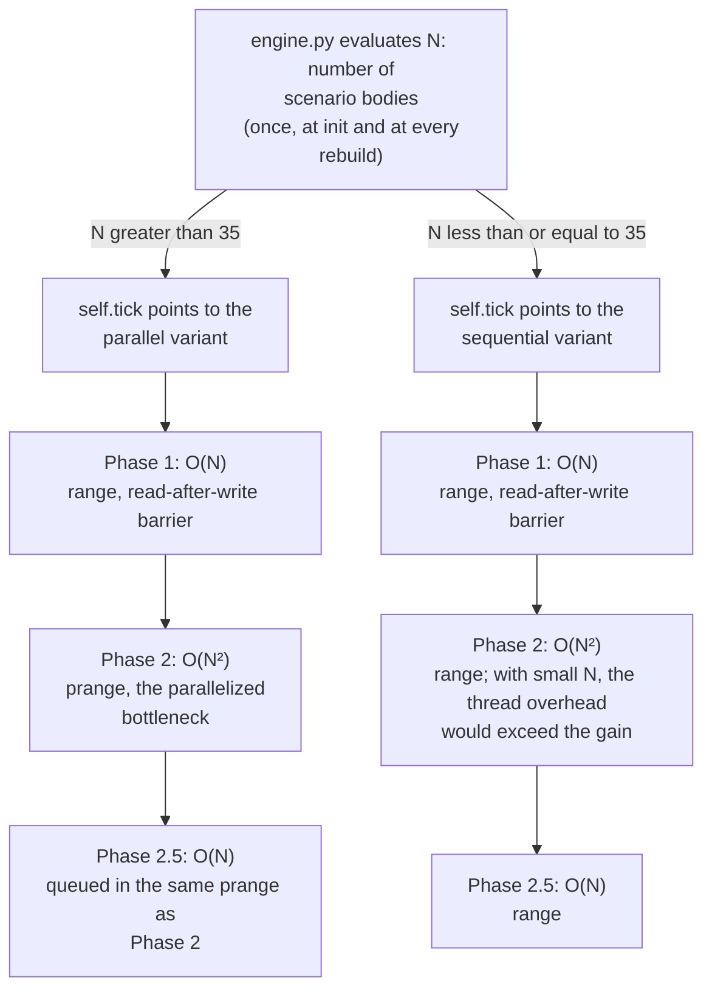

---

## 2. The Ring Buffer and the position history

> [!WARNING]
> **Note on Nomenclature: Buffer Levels vs. CPU Cache**
> In this and subsequent chapters, two hierarchies with similar names but opposite meanings will be introduced. 
> 1. **L0, L1, L2** refer to the **LODs (Levels of Detail) of the software buffers** that maintain the position history.
> 2. **L1 Cache, L2 Cache, L3 Cache** refer to the **hardware memory hierarchy** of the processor.
> To avoid confusion, the text will always prefix the word “Cache” when referring to hardware (e.g., “L3 Cache”); otherwise, it will be assumed that the abbreviations L0/L1/L2 refer to the circular history buffers.

In the very first prototype, the delay of information traveling at *c* was a Boolean flag: it indicated when one body could “know” of another’s existence, with the obvious limitation that, once the flag was set, causality was immediately violated. It served only to illustrate the causal propagation wave in *what-if* scenarios. By creating a body out of nothing, or making the Sun disappear, one could see the wave propagate graphically at the speed of light in the Φ heatmap. Physically flawed, but graphically already promising. The actual physical mechanism behind these fronts is the light cone, discussed in [§2.1 of the Physics Guide](PHYSICS_AND_SCENARIO_GUIDE.md#21-the-light-cone-and-the-minkowski-diagram).

### 2.1 Structure and Sizing of Buffers

#### The Practical Problem: Querying the Past of Each Source

We needed a way to allow the observing body to “sense” the *past* of the observed body, in proportion to the distance dictated by the speed of light. Not a flag, but a real-time history from which to extract the past position of each gravitational source.

#### The Attempts: The Single Circular Buffer and the Two Bottlenecks

It all started with the idea of implementing a Python circular buffer, which was later replaced by a **single** C-like circular buffer in Numba + NumPy. The Numba version was already faster, but it suffered from two serious structural flaws:

1. **The cost of the modulo operation:** The modulo operator (`%`) was used to determine the head of the single circular buffer. This operator requires an integer division, which the CPU performs in about 15–30 machine cycles. Multiplied by each access to the history in every $O(N^2)$ interaction, it became a measurable bottleneck.
2. **RAM saturation:** Being a single monolithic buffer, it maintained the same extremely high temporal resolution (one sample per `DT`) across the entire causal radius imposed by the scenario (e.g., 64 AU). With low `DT` values (e.g., 1 second per step), the number of slots needed to cover the area at speed $c$ reached tens of millions of elements per body, rapidly saturating the entire RAM even in scenarios with a modest number of celestial bodies.

#### The Solution: 3D Matrix, Masking, and Temporal LOD

**The buffer as a 3D matrix.** The final structure is `(number_of_bodies, maximum_historical_slots, 5_parameters)`, where the maximum temporal depth is determined in advance by the causal radius. Beyond this radius (renamed *deep space*), the system is treated as an instantaneous Newtonian system by truncation. Each slot represents a `DT` in the past. To extract the physical parameters of a distant body at the moment of its emission, no iterative temporal search is needed: space and time are fused by the constant $c$, so the temporal delay in ticks can be calculated directly from the spatial distance. Access to the correct slot becomes instantaneous $O(1)$.

```text
The 5 parameters stored for each slot:
[ pos_x | pos_y | vel_x | vel_y | mass ]
```

**Hierarchical temporal LOD (Level of Detail).** To solve the RAM problem, the monolithic history has been fragmented into three overlapping circular buffers with different sampling frequencies:

<div align="center"></div>

- **L0**: Samples every tick. Maximum resolution for close-range interactions.
- **L1**: Samples every 32 ticks (writes only when `(head_0 & 31) == 0`). Covers intermediate distances.
- **L2**: Samples every 256 ticks (writes only when `(head_0 & 255) == 0`). Deep causal preservation in empty space.

It is crucial to emphasize that, when the system operates in multi-buffer mode (DOUBLE or TRIPLE), **these buffers coexist simultaneously in RAM** as distinct arrays. There is no “scene change” or dynamic loading: the architecture keeps the entire timeline allocated at decreasing resolution, while the physics kernel navigates it in real time, mathematically jumping from one array to another as the temporal extraction algorithm delves deeper into the past.

#### Cache-Oriented Scaling

The history buffers constitute the dominant memory traffic for both the hot loop of body physics (Phase 2, discussed in [§1](#how-architecture-reduces-cache-misses)) and the hot loop for rendering causal heatmaps ([§2.3](#23-the-visualized-side-the-graphics-kernel)). Their sizing is therefore, first and foremost, a caching strategy.

`simulation_manager.py` selects the mode (`SINGLE`, `DOUBLE`, or `TRIPLE`) at runtime by calculating the RAM footprint of the **entire global history** (the total number of slots required multiplied by all $N$ active bodies in the scenario) and comparing it to 70% of the physical L3 cache detected on the machine. This threshold is not hardcoded: at startup, `_get_cpu_details()` queries the operating system (WMI via PowerShell on Windows, `/sys` on Linux, `sysctl` on macOS) to read the CPU name and the actual size of the L3 cache. Thus, the exact same simulation chooses a different buffer architecture on different PCs or even in different scenarios (if $N$ increases drastically, the maximum number of `L0` buffer slots is dynamically halved to ensure that the entire block of all bodies combined is not evicted from the shared cache).

> [!NOTE]
> **Why specifically the L3 cache in parallel mode? No false sharing.**
> Unlike the L1 and L2 caches, which are typically private to each individual core, the L3 cache is *shared* among all physical and virtual cores (SMT/Hyper-Threading) of the same processor. When Numba parallelizes Phase 2 across multiple threads, the entire pool reads from the *same* global causal history. Since the history buffers are treated as strictly **read-only** during this phase, cache invalidations or **false sharing** issues between cores never occur. In fact: if Thread A loads a cache line (64 bytes) to read the past of a given massive body, that line enters the shared L3 cache and becomes a free cache hit with minimal latency for Thread B, which is computing a nearby body. Targeting the L3 cache ensures that this treasure trove of shared data is not continuously evicted.

The initial sizing is strictly derived from the causal radius of the scenario. It is fascinating to note how, in these data structures (just as in Relativity) measurements that are seemingly only spatial (the causal *radius* in kilometers) become intrinsically measures of *temporal* depth (number of past slots) and vice versa, linked by the mathematical constant $c$:

$$\text{raw\_len} = \frac{\text{SIMULATION\_RADIUS\_KM}}{c \cdot DT}$$

The table below outlines the logical decision matrix that `simulation_manager.py` uses to solve its core problem in fractions of a millisecond: *"How many circular buffers do I need, and with what slot limits, given the computer’s physical L3 cache budget, the number of bodies $N$ present, and the spacetime causal radius $R$ to be achieved?"*

| Mode | When triggered | L0 | L1 | L2 |
|---|---|---|---|---|
| **SINGLE** | L0 footprint below L3 cache threshold | covers the entire causal radius (maximum $2^{18}$ slots with a single body and 20 MB of L3 cache) | (|) |
| **DOUBLE** | SINGLE footprint exceeds L3 cache | dynamic cap ≤ 16,384 slots (up to 1,024 if populated) | covers the remainder, stride 32 | — |
| **TRIPLE** | not even L0+L1 fit in the L3 cache | dynamic cap | fixed at 2,048 slots | covers the remainder, stride 256 (ceiling $2^{28}$ cells, to prevent memory exhaustion) |

All sizes are **rounded up to the next power of 2**. This allows the modulo operator to be replaced with a bitwise AND operation:

```python
# Before (expensive: ~20 clock cycles)
idx = (head - ticks) % length

# After (free: 1 clock cycle)
idx = (head - ticks) & mask   # mask = length - 1
```

The `& mask` operation works only if `length` is a power of 2: in that case, $\text{length} - 1$ has all its least significant bits set to 1, and the AND operation truncates the index exactly as the modulo operator would, but in a single machine cycle.

**Allocation: ultra-ECO placeholders.** When `core.data` is imported, all arrays are initialized with a placeholder size of a single element to eliminate the cost of loading the module. Upon initializing a preset, `ensure_capacity()` expands them on demand. Then, `rebuild_simulation()` calculates and allocates the actual history buffers based on causal radius, DT, and number of bodies, with OOM (Out Of Memory) protection that detects memory exhaustion and displays a graphical error dialog instead of causing a crash.

Once the buffer mode has been chosen, it remains to decide which process uses them. `engine.py` assigns the specific physics kernel for the entire simulation, combining the mode just described (single/double/triple) with the execution variant already discussed in [§1](#1-the-choice-of-python-and-the-dod--jit-paradigm) (parallel/sequential). The result is stored in `self.tick` as a function pointer:

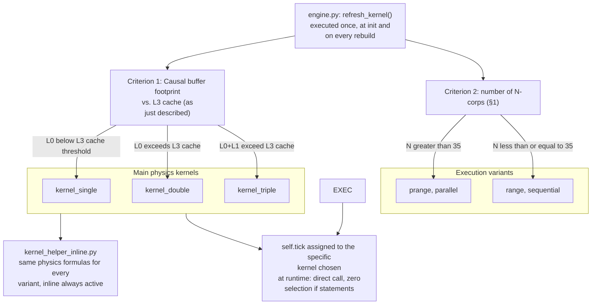

Cascading buffer lookups in the helper kernels follow this logic: the delay is calculated in physics ticks; if it falls within L0, it is read from L0; otherwise, it is scaled to L1 or L2 by logically realigning the index. All $O(1)$.

#### Practical example: cascading search in the Earth-Sun scenario (TRIPLE mode)

- **Setup**: Earth-Sun distance $= 499$ light-seconds; $DT = 0.001\ \text{s}$; each buffer slot represents one $DT$ in the past.
- **Required delay in ticks**: $499 / 0.001 = 499,000$ ticks.

The kernel attempts a cascaded read:

1. **L0** (16,384 slots, stride $1{\times}DT$): covers up to tick 16,384. Insufficient → scales up to L1.
2. **L1** (2,048 slots, stride $32{\times}DT$): covers up to tick $2,048 \times 32 = 65,536$. Still insufficient → scales to L2.
3. **L2** (stride $256{\times}DT$, sized for the default `simulation_radius` of 64 AU): covers it amply. The index is $i = \lfloor 499,000 / 256 \rfloor = 1,949$.

1949 is the **slot depth** relative to the write head, not the absolute cell index: the physical index in the ring is `(heads_L2[idx_sole] - 1949) & mask_L2`, using the bitmask shown above. That is where the 5 causal parameters of the source are read.

#### Why the L2 buffer in RAM does not impact performance

Given the structure of the decision matrix in `simulation_manager.py` discussed earlier, the `L2` buffer is allocated *exclusively* in TRIPLE mode. But TRIPLE mode kicks in precisely when the sum of `L0+L1` has already saturated the entire L3 cache budget. Consequently, the massive `L2` buffer is mathematically and unequivocally relegated to the system heap (ordinary RAM).

Every access to it that misses the cache is therefore a true “cache miss” to RAM, an extremely slow operation (about 100–300 clock cycles of latency, compared to 10–15 for the L3 cache). Yet, the engine does not crash. For three reasons:

1. **Rarity in the physics kernels (Cost amortization):** The hot physics loop writes to `L2` only once every 256 physics ticks and reads from it only for distant bodies. In compact and chaotic systems, where computational speed matters most, the loop rarely or *never* accesses `L2` and cycles through the `L0` buffer (which is hardwired into the L3 cache) at a very high frequency. The few, costly reads from RAM are *amortized* by being lost in the sea of millions of inexpensive `L0` accesses. A single miss is costly, but it is statistically extremely rare in most physics scenarios.
2. **Economics of a Single Access (SoA Layout):** The graphics kernel may have much more massive and frequent `L2` reads than the physics kernels: each pixel in the heatmap can query distant bodies, multiplying the number of accesses across the entire grid. But the data-oriented implementation ensures that the 5 values `[x, y, vx, vy, mass]` for each slot are tightly contiguous in memory (40 bytes). They all fit within a single 64-byte *cache line*: the processor incurs only one cache miss per slot, fetching the source’s entire gravitational packet in a single operation. Even when RAM reads are frequent, each one is as efficient as possible.
3. **Physics (The Decay of the Radius):** Numerically speaking, when `L2` is finally read, it is to evaluate the gravitational attraction of bodies that are generally far away. The sampling error induced by the stride ($256 \times DT$) is substantial, but the gravitational contribution of that source to the body under examination decays dramatically as $1/r^2$. The two effects balance each other out perfectly: a coarse temporal resolution is physically acceptable precisely where the force intensity is weak. It is the perfect compromise for storing temporal histories up to gigabytes in RAM without distorting the local physics.

#### Quantification of the Sampling Error

The third item on the list states a compensation. Here, we quantify it, starting from the nature of the error.

The stride error is a **discretization** error. The history function samples the continuous trajectory of the source in steps of $s \cdot DT$: reading the nearest slot quantizes the emission time. The error therefore depends on how much the source moves within a single step ($\Delta x \le v \cdot s \cdot DT$): a stationary source has zero error with any stride, while a fast-moving source incurs the full step error.

The transition from the position error to the force error is a derivative. With $F \propto 1/r^2$, a displacement $\Delta x$ of the source perturbs the force, in the worst-case scenario of a purely radial displacement, by:

$$\left|\frac{\Delta F}{F}\right| \approx \frac{2\,\Delta x}{r} \le \frac{2\,v\,s\,DT}{r}$$

The explicit calculation, with a source at 30 km/s and $DT = 0.1$ s, is evaluated at the two zone boundaries (where the stride has just risen to the new value while the distance is still the minimum for that level). At the L0→L1 boundary (3.3 AU, $4.9 \cdot 10^8$ km), the slot can be stale for up to $32 \times 0.1 = 3.2$ s: the source shifts by at most $30 \cdot 3.2 = 96$ km, with a relative error of $2 \cdot 96 / (4.9 \cdot 10^8) \approx 3.9 \cdot 10^{-7}$. At the L1→L2 boundary (13.1 AU, $2.0 \cdot 10^9$ km), the maximum deviation increases to $30 \cdot 25.6 = 768$ km: error $2 \cdot 768 / (2.0 \cdot 10^9) \approx 7.8 \cdot 10^{-7}$. Less than one millionth in both cases.

The graph extends the calculation to all distances, up to the standard causal radius of 64 AU (DT = 0.1 s, chosen so that all three levels lie within the radius). The curve is a conservative upper bound because it assumes the worst-case geometry, with the sample shifted entirely along the line of sight.

<div align="center"></div>

### 2.2 How Physics Interacts with Buffers

#### The causal double retrieval (two cascaded readings)

The first determination of causal parameters discussed in the previous chapter hides an inaccuracy: the delay in ticks was calculated from the **current** distance between the observer and the source, but the position that matters is the one the source had **at the moment of emission**, which for moving bodies does not always coincide. It is an implicit equation, and the architectural solution is deliberately non-iterative: **two O(1) readings in cascade**, not a solver.

1. **First pass (estimate).** From the current distance, an approximate time of flight $r_{now}/c$ is derived; this is converted to ticks, and the corresponding slot is read: the result is an *estimated* retarded position.
2. **Second read (recalculation).** From the estimated position, the true distance is recalculated, from which the true time of flight is derived, and thus a new slot index: the second read returns the position, velocity, and mass at the actual emission instant. It is based on these values that the calculation of force, potential, or quadrupole proceeds.

The first-detection method has already been demonstrated with numerical examples in the [Earth-Sun example in §2.1](#practical-example-cascading-search-in-the-earth-sun-scenario-triple-mode). There, however, the pair moves so slowly that the second step merely confirms the slot. To see the double retrieval actually working, you need a fast source: a pixel in the dΦ/dt heatmap observing one of the two stars in the *NS Binary: Stable Orbit* preset (two 1.5 $M_\odot$ NSs separated by 40,000 km) from a distance of 1 AU, with DT set to 1 µs.

<div align="center"></div>

Starting from the index of the first discovery:

1. **Estimate**: $r_{now}$ = 1 AU is equivalent to 499.005 seconds of flight time, or 499,004,783 ticks. The L2 slot is $\lfloor 499,004,783 / 256 \rfloor$ = **1,949,237** (depth from the head: the head and bitmask complete the addressing, as in the example in §2.1).
2. That slot returns the NS from 499 s ago. However, in those 499 s, the star has completed approximately 6.3 orbits around the pair’s center of mass (period ~80 s): its emission position may be up to 40,000 km farther (or closer) from the pixel than its current position, the entire diameter of the orbit. The next step considers the farthest case. **Recalculation**: $r_{true}$ = 1 AU + 40,000 km equals 499.138 s, or 499,138,209 ticks. The new slot is $\lfloor 499,138,209 / 256 \rfloor$ = **1,949,758**.
3. **Recalculation**: $r_{true}$ = 1 AU + 40,000 km is equivalent to 499.138 seconds, or 499,138,209 ticks. The new slot is $\lfloor 499,138,209 / 256 \rfloor$ = **1,949,758**.
4. The second reading lands **521 slots deeper**, representing an additional 0.133 s of history. Without the second step, the pixel would read the NS with a clock error of over one-tenth of a second, more than 500 times the L2 sampling step.

For a slow pair like Earth-Sun, the two indices coincide, and the second step serves as a confirmation. Here, the correction is substantial and is the reason why the double retrieval exists.

Mathematically, the double step is equivalent to a single Picard iteration on the light-cone equation, which for ordinary orbits ($v \ll c$) converges immediately (the physics discussion is in [§3 of the Physics Guide](PHYSICS_AND_SCENARIO_GUIDE.md#3-causal-aberration-dead-reckoning-and-relativistic-dynamics)). By choosing to stop after two steps, the cost becomes **fixed and predictable** (two bitmask lookups per interaction, zero convergence-check branches in the hot loop). On the physics side, the implementation resides directly within the Phase 2 loop of the kernels (`kernel_single/double/triple`): this loop performs the two readings and passes the already-resolved retarded state to `compute_relativistic_force`, which applies dead reckoning, Paczyński-Wiita, and 2.5PN. On the graphics side, it resides in the `calculate_*_contribution` functions of `kernel_helper_inline.py`: the dΦ/dt and GW Strain heatmaps perform the full double retrieval exactly like the physics kernels, while the other maps use lighter approximations (the full gradation is described in [§2.3](#23-the-visualized-side-the-graphics-kernel)). Everything is expanded via `inline='always'`, just like the rest of the kernel.

> [!NOTE]
> **How much does the second iteration gain?** The double-step is a truncated iteration, not an exact solver: it leaves a residual. A straight-line case measures it exactly, because it allows comparison with the closed-form analytical solution ([§5.1 of the Physics Guide](PHYSICS_AND_SCENARIO_GUIDE.md#51-time-of-flight-for-sources-in-rectilinear-motion-closed-form-formula)): source at 10,000 km, moving radially away at 30,000 km/s (approximately $0.1c$), DT = 1 µs. Compared to the exact emission time $d_0/(c+v)$ = 30.322 ticks, the first reading alone is off by 3,034 ticks; the second brings it to 304, a tenfold improvement. Each step reduces the error by a factor of $v/c$: after two readings, the relative residual is on the order of $(v/c)^2$, here about 1%. At planetary speeds ($v/c \approx 10^{-4}$), the residual is $\sim 10^{-8}$, well below a single tick.

> [!NOTE]
> **An intentional exception: the bypass in GW mode.** The emission position reading described here is the norm, but there is one case in which the kernel deliberately skips it. In the strong field (two compact binary bodies close to merger/coalescence), reading the emission position would introduce an aberration that distorts the chirp signal; there, the kernel ignores the buffer and uses the source’s *current* position, accepting the sacrifice of causality for that single pair in order to avoid distorting the waveform. The bypass applies **only to the calculation of forces** between the bodies: the heatmaps, as observers of the events, continue to track the causal history even in full GW regime. This is how dΦ/dt draws the spirals of the merger. Outside the GW regime, the second-order dead reckoning on the emission position remains. The physics details are in [§3.2 of the Physics Guide](PHYSICS_AND_SCENARIO_GUIDE.md#32-compensation-hybrid-dead-reckoning).

#### The third interpretation: the reconstructed acceleration for dead reckoning

Its purpose: in nature, a celestial body A experiences a force exerted by a body B in its own **past**, yet that force almost always points toward B’s **present** position, because the velocity terms of the field cancel out the aberration ([§3.1 of the Physics Guide](PHYSICS_AND_SCENARIO_GUIDE.md#31-the-problem-of-aberration)). A force fixed to the raw, retarded position would miss this phenomenon and introduce a fictitious torque that widens the orbits until they become unstable. Dead reckoning reproduces the actual behavior: it extrapolates the state read from the buffer forward in the time of flight, using the second-order Taylor expansion from [§3.2 of the Guide](PHYSICS_AND_SCENARIO_GUIDE.md#32-compensation-hybrid-dead-reckoning).

The calculation requires position, velocity, and acceleration at the moment of emission. The first two fit into the 40-byte slot, but acceleration does not: the lookup loop **reconstructs it on the fly using finite differences between adjacent slots**, reading the velocities from the slot one stride closer to the present (or deeper, if the emission is already at the head of the level) and dividing by the stride separating them. Storing it in the slot would have inflated each sample from 40 to 56 bytes across all three levels: we opted instead to incur a third bitmask read per interaction, which is still a fixed-cost operation with no branches. The reconstruction is performed only by the physics kernels (`kernel_single/double/triple`): the graphics kernel does not apply dead reckoning, so the third read does not affect it.

**What this means in practice.** For body physics alone, the final result of dead reckoning is a pair of coordinates: the estimated current position toward which the calculated force will point at the time of emission. This estimate carries the sampling error already quantified in [§2.1](#21-structure-and-sizing-of-buffers) plus the error from the finite-difference reconstruction of acceleration, both of which are negligible. Numerical errors aside, what the second-order truncation leaves out (the jerk term) has a possible physical interpretation: a dissipation of orbital energy proportional to 2.5PN. This topic is discussed in the [author’s note in §3.3 of the Physics Guide](PHYSICS_AND_SCENARIO_GUIDE.md#33-the-balance-between-braking-and-thrust). At the extremes, the mechanism silently degrades: if the adjacent slot contains `VOID_VAL`, the extrapolation reverts to first-order, using only velocity; if the search fails entirely, it falls back on the current position; under full GW operation, the NOTE bypass described above overrides the entire mechanism.

#### Visual Evidence of the Double Retrieval

Having concluded the digression on dead reckoning, it remains to demonstrate the value of the double retrieval in practice: this is not a detail for purists: it is visible to the naked eye. The two images show the same dΦ/dt heatmap for the GW170817 preset (the first neutron star binary ever detected), before and after the introduction of the second step (for further details on the phenomenon and the nature of this specific heatmap, see [§7.2 of the Physics Guide](PHYSICS_AND_SCENARIO_GUIDE.md#72-time-derivative-dφdt)).

| With the first pass only | With the double retrieval |
|:---:|:---:|
|  |  |

On the left, the estimation error forms a **nodal axis of discontinuity** (that is, a sector where the fronts fray and jump in phase) which, during the simulation, rotated rigidly along with the orbit. On the right, after recalculation, the axis disappears and the clean emission spiral remains. It was precisely that axis that revealed the flaw. A rigid rotating structure carries its own phase at a speed that increases with the radius: at the extremes, it exceeds $c$, a causal impossibility that is evident to the naked eye. It was that diagnosis that led to the current solution of the double retrieval. 

This extensive visual experiment leads us to the next major topic: the architecture of the graphics system.

### 2.3 The Visualized Side: The Graphics Kernel

Heatmaps are field maps overlaid on the simulated space (potential, tide, strain: the complete catalog, from the physics side, is in [§7 of the Physics Guide](PHYSICS_AND_SCENARIO_GUIDE.md#7-the-mathematics-of-heatmaps)). They are also, by far, the most computationally intensive part of the entire graphics component, for a structural reason. A heatmap does not simply recolor data already calculated by the physics engine: it samples the field from scratch, point by point, at every frame. The computational cost is the product of three factors:

- each frame evaluates the field at **every pixel in the grid**;
- each pixel sums the contribution of **every active body**;
- each contribution queries the **history buffers** at the time of emission, up to the double causal retrieval described in [§2.2](#22-how-physics-interacts-with-buffers) for maps that require it.

Multiplying these three factors results in tens of millions of field evaluations per second, even in modest scenarios. Even though it runs only once per frame, in terms of the number of operations, the graphics thus exceed the physics’ $O(N^2)$ cycle by orders of magnitude. This section describes the common framework and logic shared by all heatmaps: where they read data, how they parallelize, and what measures mitigate the cost. The specific issues of individual maps (choice of scales, dynamic compression, co-rotating overlays) are the subject of [§3](#3-heatmap-rendering-and-fps-management).

The graphics kernel (`graphics_kernel.py`) reads from the same buffers as in [§2.1](#21-structure-and-sizing-of-buffers), relying on the same double causal retrieval mechanism as in [§2.2](#22-how-physics-interacts-with-buffers).

**Why it isn’t specialized by buffer mode.** Unlike the physics kernels (`kernel_single/double/triple`), there is **only one** graphics kernel: the L0→L1→L2 cascade is resolved at runtime within the contribution functions (e.g., `calculate_potential_contribution`, `calculate_dphi_contribution`), using `if` statements based on the levels that are actually allocated. The reason is the **execution frequency**. The physics runs up to 10,000 times per frame within an $O(N^2)$ loop: there, every buffer-selection `if` statement would be evaluated billions of times per second, so it must be eliminated upstream by specializing three monolithic physics kernels (see [§1](#1-the-choice-of-python-and-the-dod--jit-paradigm)). Graphics, on the other hand, run **once per frame**, only on visible pixels: the same `if` statements are evaluated orders of magnitude less frequently, without the multiplier of physics steps per frame, so they are inexpensive. They do not justify tripling the graphics code, which (between Φ, dΦ/dt, Roche, Tidal, Lagrange, and GW Strain) is already large and complex. Maintaining three synchronized variants would be very costly for a marginal savings. It’s the same asymmetric principle underlying the entire engine: it specializes where the hot loop demands it, and generalizes where the cost is negligible.

**The Gradation of Causal Rigor.** Not all causal maps incur the same cost for causal reading. dΦ/dt and GW Strain perform the complete double retrieval described in [§2.2](#22-how-physics-interacts-with-buffers). The Φ map stops at the first reading, with the delay estimated from the current distance: an accepted approximation for the most static map in the family. For sources beyond $0.5c$, where that estimate would degrade, the kernel changes course and solves for the time of flight **in closed form** using `solve_retarded_time`, the same quadratic equation for intersection with the light cone that the Physics Guide derives in [§5.1](PHYSICS_AND_SCENARIO_GUIDE.md#51-time-of-flight-for-sources-in-rectilinear-motion-closed-form-formula). Beyond the L2 coverage, *deep space* begins: for Φ and dΦ/dt, the contribution is extrapolated linearly backward from the current velocity, while for GW Strain, the contribution is set to zero without exception (gravitational waves do not benefit from inertial extrapolations). However, there is also a safety net for dΦ/dt: above a recovered velocity of 15,000 km/s, the deep space contribution is set to zero to prevent a spiral artifact nicknamed “beyblade” (a spinning top) in the code comments.


> [!NOTE]
> **The “ghost of the field” after a body’s death.**
> When a body dies (collision, accretion), the physics engine assigns it the `FLAG_DYING` flag and, at every subsequent tick, injects the sentinel value `VOID_VAL` at the beginning of its L0 history. However, the body remains in the `p_idx` array until the asynchronous Garbage Collector certifies its complete extinction. During this limbo period, the behavior of the heatmaps **diverge radically** depending on their nature:
>
> - **Causal heatmaps** (Φ, dΦ/dt, GW Strain): They read the ring buffers and still see the valid *past* state of the body. The `VOID_VAL` front advances through the history at speed $c$, and as it reaches the causal distance of each pixel, the contribution drops to zero. The result is the genuine manifestation of the **cone of light**: a circle expanding at $c$ from the destructive event, outside of which the field persists as if nothing had happened and inside of which the field has already disappeared (the phenomenon is illustrated with Minkowski diagrams and demonstrations in the simulator in [§2.1 of the Physics Guide](PHYSICS_AND_SCENARIO_GUIDE.md#21-the-light-cone-and-the-minkowski-diagram)).
> - **Instantaneous heatmaps** (Tidal, Roche, Lagrange): they do not read any history buffers and use the current position frozen at the point of impact. The dead body remains **motionless and included** in the calculation as a static ghost until the GC removes it from `p_idx`. This is an architectural artifact, not a physical one: the GC delays removal because the lifecycle is tied to the causal horizon for the benefit of maps that are truly causal. For pair maps (Roche, Lagrange), this extends to the co-rotating frame, which remains constructed around a partner that is now stationary. The complete discussion is in [§7.6.3 of the Physics Guide](PHYSICS_AND_SCENARIO_GUIDE.md#763-coalescence-and-the-bare-quadrupole-artifact).

#### Summary: HPC Best Practices in Hot Loops

The previous chapters introduced optimization techniques in the context in which they originated. Before moving on from hot loops, it is worth summarizing them in a single table, distinguishing those that apply across the entire engine from those specific to a single component.

**Techniques shared** between physics kernels (`kernel_single/double/triple`) and graphics kernels (`graphics_kernel.py`):

| Technique | Where in the code | Why it matters |
|---|---|---|
| **JIT + Numba parallelism** `@njit(parallel=True, fastmath=True, cache=True)` | All kernels. `prange` on bodies (physics) or x-columns (graphics) | Each thread writes to its own contiguous memory block, avoiding false sharing between cores ([§1](#1-the-choice-of-python-and-the-dod--jit-paradigm)) |
| **Forced inlining** `inline='always'` on helper kernels | `kernel_helper_inline.py`, used by all kernels | Eliminates function call overhead in the hot loop; LLVM optimizes the code as if it were monolithic ([§1](#1-the-choice-of-python-and-the-dod--jit-paradigm)) |
| **Loops without divisions** (precalculated reciprocals) | `inv_c`, `inv_dt`, `inv_c_dt`, `inv_cutoff_sq` passed from outside | A multiplication takes 3–5 clock cycles; a division takes 15–30. In loops with billions of iterations, the difference is measurable |
| **Bitmask instead of modulo** `& mask` | Every access to the L0/L1/L2 ring buffers, both physics and graphics | 1 clock cycle instead of ~20. Possible because buffer sizes are forced to be powers of 2 ([§2.1](#21-structure-and-sizing-of-buffers)) |
| **Compaction of active indices** | `active_indices` (physical), `p_idx` (graphical) | The loop iterates only over live bodies in a dense array, skipping dead or empty slots upstream |
| **SoA (Struct of Arrays) Layout** | `data.py`: separate, contiguous arrays for each physical attribute | The hardware prefetcher recognizes sequential access and preloads the next cache line, often eliminating latency ([§1](#how-architecture-reduces-cache-misses)) |

**Techniques unique** to the graphics kernel, dictated by the nature of its output (a texture with millions of pixels):

| Technique | Where in the code | Why it matters |
|---|---|---|
| **Bit shift instead of integer division** | `cx = width >> 1` for the center of the screen | A micro-optimization that has no reason to exist in physics kernels (they do not operate on pixel grids) |
| **LOD filtering on masses** (Φ map only) | `ACTIVE_INDICES_LOD`, precalculated during rebuild | Excludes bodies with masses less than $10^{-6}$ times the dominant body (whose contribution to the field is imperceptible at the pixel scale) upstream. Reduces the per-pixel cost by a factor of $N$ |
| **Direct `uint8` writing to the texture** | All graphics kernels | No intermediate float image to convert: the color is calculated and written pixel by pixel to the final matrix sent to Pygame |

It is the combined and simultaneous effect of all these small optimizations that allows an engine to handle millions of relativistic gravitational calculations per second on the CPU alone, without ever touching the GPU.

### 2.4 The Rebuild: How the History Survives Parameter Changes

So far, this entire chapter has focused on hot paths, those executed millions of times per second. The rebuild is the opposite: a cold path that runs only a few times per session, during which the entire simulated universe is dismantled and reassembled from scratch. Every structural change to the simulation passes through this single mandatory point: the `rebuild_simulation()` orchestrator in `core/simulation_manager.py`, which executes nine phases in a strict sequence.

There are four triggers:

- **loading a preset**: the initial construction of the universe, performed in the startup splash thread ([§9.3](#93-the-main-process-bootstrap-sequence));
- **changing the DT at runtime** (`T`/`Y` keys): changes the duration of each history buffer, and thus the entire temporal geometry of the history buffers;
- **spawning a new body** from the orbital spawner ([§9.1](#91-from-the-monolith-to-a-modular-architecture)): the array pool must grow by one;
- **permanent removal of a body** certified by the garbage collector ([§6](#6-the-asynchronous-garbage-collector-for-causally-dead-bodies)): the pool is compacted to include only the survivors.

In the latter case, the indices shift: after the rebuild, `main_gui` re-links the active selections in the interface **by name**, not by index (the body followed by the camera, the pair on which the Lagrange overlay is built), then regenerates the kernel with `refresh_kernel()` ([§1](#1-the-choice-of-python-and-the-dod--jit-paradigm)) and the renderer. The `TOP_ATTRACTOR` of the bodies does not require the same treatment: Phase 8 recalculates it from scratch for all of them anyway. A body’s identity across rebuilds remains its name.

The pipeline, with Phase 5 as the only branch:

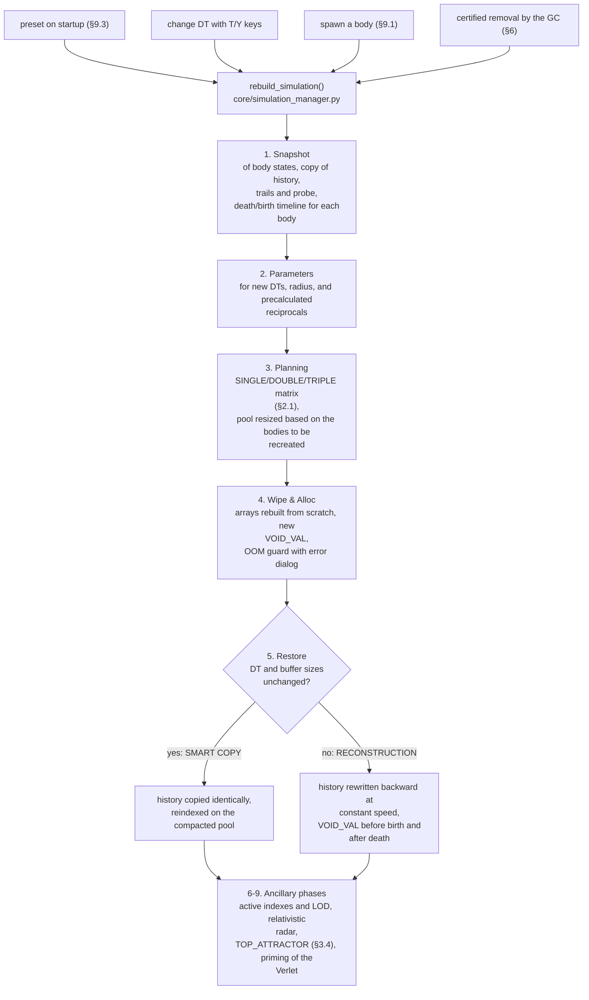

The fork in Phase 5 determines the fate of causal memory. If DT and buffer sizes have not changed (the typical case of a post-GC rebuild), the **smart copy** transfers each history exactly as it was, including the write head: past orbits survive to the byte. In all other cases, the old time grid no longer exists (with a doubled DT, each slot is worth twice as many seconds), and the history is **reconstructed backward at a constant speed** from the current state of each body, `pos - vel·t` slot by slot, using vectorized NumPy. This is the same routine that fills the buffers at the very first construction of the universe, with a subtlety worth noting: at startup, each body begins with a fictitious linear past, written backward as if it had always traveled at its initial velocity. For bodies tens of light-ticks away, the first causal readings therefore draw from a history that never occurred. The error, however, does not affect the forces: on a straight trajectory, the dead reckoning extrapolation ([the third reading in §2.2](#the-third-interpretation-the-reconstructed-acceleration-for-dead-reckoning)) is exact by construction (a Taylor series expansion reproduces a straight line without a residual), and the force still points to the correct present position. The compensation is complete, and the true history replaces the fictitious one tick by tick.

The LIGO probe follows the same logic ([§7](#7-the-ligo-probe-sampling-and-dump-architecture)): telemetry is preserved intact via smart copy, while upon a parameter change, the buffer is saved to disk by a separate thread (a `.npy` file in `ligo_output/data_npy/`) and then reset, because samples taken with different DT values do not concatenate into a coherent signal.

**Dead bodies survive the rebuild.** The most delicate case is a body with `FLAG_DYING`: destroyed, but not yet causally vanished. In the limbo described in the NOTE on the field ghost ([§2.3](#23-the-visualized-side-the-graphics-kernel)), its position remains frozen at the point of impact while the kernel injects `VOID_VAL` at the beginning of its histories at every tick: the void front advances, but the deep history is still alive and distant pixels still see the body. If a rebuild occurs at that moment, the body is normally included in the snapshot (the position is valid), and `_detect_body_timeline` measures **how long it has been dead**: it traverses the history as a single continuous timeline through L0, L1, and L2 (scanning only the portion of each level not covered by the previous one) and counts the depth of the void front, `t_dead`. Upon reconstruction, that measurement is re-injected into the new time grid: all cells more recent than `t_dead` revert to `VOID_VAL` even if the DT has changed (in a smart copy this isn’t necessary, since the front is already traveling within the identical copy), the `FLAG_DYING` flag survives in the snapshot, and the kernel resumes digging the front exactly where it left off. The ghost’s circle continues to expand at speed $c$ as if the rebuild had never occurred, until the GC ([§6](#6-the-asynchronous-garbage-collector-for-causally-dead-bodies)) certifies its exit from the causal radius. The same mechanism, in reverse, protects **births**: a newly spawned body has its `t_alive`, and the deepest cells of its age remain `VOID_VAL`, without giving it a past it never lived.

Once the universe has been disassembled and reassembled, it remains to be rendered: [§3](#3-heatmap-rendering-and-fps-management) enters the rendering phase, where the field calculated by the graphics kernel becomes an image on the screen.

---

## 3. Heatmap Rendering and FPS Management

Below is a summary of the overall `graphics_kernel` pipeline (whose shared code applies to all the heatmaps discussed below):

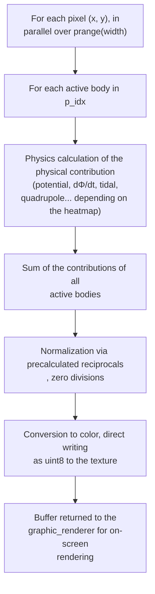

> [!IMPORTANT]
> This chapter covers heatmaps solely from an engineering perspective: kernels, resolution, FPS. What they *are* physically, what they show, and how to interpret them on screen is the subject of [§7 of the Physics Guide](PHYSICS_AND_SCENARIO_GUIDE.md#7-the-mathematics-of-heatmaps). If you’ve never seen them before, we recommend taking at least a quick look before continuing, because everything that follows assumes you understand their meaning.

### 3.1 The Frame Budget: 60 FPS as the Target

The engine uses a cap of 60 FPS, which can be modified or unlocked via the `.ini` file. This is not an aesthetic choice but a time constraint: at 60 FPS, each frame has 16.6 ms, within which both the physics engine and rendering must complete. The maximum theoretical cost of a frame, in the worst-case scenario, is

$$\text{Cost per frame} = O(S \cdot N^2) + O(W \cdot H \cdot N)$$

where $S$ is the number of physics ticks executed per frame (the runtime multiplier, ranging from 1 to 10,000), $N$ is the number of active bodies, and $W \times H$ is the pixel grid of the heatmap (the breakdown of the second term is in [§2.3](#23-the-visualized-side-the-graphics-kernel)). The two terms compete for the same 16.6 ms: every millisecond consumed by physics is taken away from rendering, and vice versa.

> [!NOTE]
> **O instead of Θ, by convention.** Here and throughout the rest of the document, the formulas describe the exact count of operations, not an upper bound in the worst case: the formally correct notation would be Θ. However, the more widely used symbol O is retained. It should also be noted that S, N, W, and H are independent parameters set by the user and hardware, none of which truly tend toward infinity: there is no single dominant order to isolate; the sum of the two terms remains the correct form.

**The TPS/FPS Coupling.** Physics and graphics run in the same thread, sequentially, so they are tightly coupled. The `1`–`5` keys do not set the TPS but rather the *physics ticks per frame* ($S$): frame rendering begins only after those $S$ steps have been exactly executed. This is why a bottleneck in physics causes the frame rate to plummet (the FPS wait), while graphics that are too slow retard physics, lowering the effective TPS. The relationship is $\text{TPS} = S \times \text{FPS}$, with a theoretical ceiling of 600,000 TPS at 60 FPS and maximum multiplier.

The following numbers were measured on the development reference hardware, a consumer-grade i5-13400F.

**When physics becomes saturated.** Dwarf Galaxy Collision, 202 bodies, multiplier at maximum (S = 10,000): the first term is $10,000 \times 202^2 \approx 4 \cdot 10^8$ causal interactions per frame. On the reference processor, this takes about 0.33 s: the frame rate drops to 3 FPS even with the heatmap turned off, that is, with the graphics term set to zero. Simply lowering S to 100 reduces the cost by a factor of 100: the frame comfortably fits within the budget, delivering a full 60 FPS and 6,000 TPS.

**When the graphics become saturated.** The $W \times H$ factor enters the formula right from the launcher, with the choice of initial resolution: a QHD window (2560×1440) requires 3.7 million field evaluations per heatmap per frame, compared to just under a million for the default 1200×800. The main mitigation is **dynamic heatmap resolution**: the calculation grid is divided by a factor of `div` on both axes, with discarded pixels reconstructed via interpolation (`pygame.transform.smoothscale`, or `cv2.resize` for those who install OpenCV, at the user’s discretion). The effect on the cost estimate is quadratic, because `div` acts on both width and height:

$$O\!\left(\frac{W}{div} \cdot \frac{H}{div} \cdot N\right) = O\!\left(\frac{W \cdot H \cdot N}{div^2}\right)$$

In QHD, the progression speaks for itself: 3.7 million evaluations at `div` = 1, then 921,600 at `div` = 2, 230,400 at `div` = 4, down to 14,400 at the full scale of `div` = 16, a 256-fold reduction. The scale can be cycled manually using the `G` key or delegated to the auto-tuner described in [§4](#4-the-performancemanager-an-auto-tuner-with-memory-and-hysteresis). For the Φ map alone, the LOD filter on the masses from [§2.3](#23-the-visualized-side-the-graphics-kernel) is applied, which affects the other factor in the term, $N$.

**Mixed-load benchmark: Dwarf Galaxy Collision.** DT = 150 s, S = 100, 1200×800 window, div = 4 (the scale chosen automatically by the auto-tuner): 34 stable FPS. The effective grid is 300×200: 60,000 pixels by 202 bodies equals $1.2 \cdot 10^7$ graphics contributions per frame, the same order of magnitude as the physics term ($4 \cdot 10^6$). The load is genuinely mixed. Translated into time: 3,400 TPS for 150 simulated seconds each amounts to 510,000 simulated seconds for every real second, nearly six days per second. From this balance proposed by the engine, the decision shifts to the user:

- Do you need more graphical detail? With S set to 1× or 10×, the physics become negligible, and the map can be rendered at native resolution (div = 1) while staying within 16.6 ms. The trade-off is simulated time, which decreases roughly in proportion to the multiplier.
- Do you need to regain speed without sacrificing FPS? The `Y` key doubles the DT: at a constant cost per tick, each doubling doubles the speed of simulated time. The trade-off here is the [truncation error](PHYSICS_AND_SCENARIO_GUIDE.md#42-truncation-error) of the integrator, which remains negligible on planetary scales for several doublings.

**Benchmark at the graphical extreme: GW170817.** DT = 1 µs, S = 10,000, QHD at native resolution (div = 1): 34 average FPS, i.e., 340,000 TPS, which at 1 µs each equate to 0.34 simulated seconds per real second. Here, the physics are negligible (2 bodies, 40,000 interactions per frame), and the QHD grid consumes almost the entire budget. At 34 FPS, the auto-tuner remains inactive, because its degradation threshold is 30 FPS. Those who want 60 FPS can scale manually with `G` (div = 2) or restart from the launcher in Full HD, which is more than enough for a full and stable frame rate.

Users can adjust this balance at any time using the `T`, `Y`, `G` keys, and the numeric keys `1`–`5`. The user guide, including the FPS recovery table, can be found in the [performance section of the README](README.md#model-limitations-and-performance-management).

### 3.2 The First Heatmap: The Potential Φ

The heatmap of the potential $\Phi$ was the first visualization implemented; it went from being extremely slow to running smoothly once it was parallelized with Numba. The basic logic has always been: estimate the maximum expected $\Phi$ at a fixed multiple of the Schwarzschild radius of the most massive body in the simulation, use it as the scale cap, normalize each pixel between 0 and 1, and finally convert to color by range. First, the range is created; then it is normalized; then it is colored.

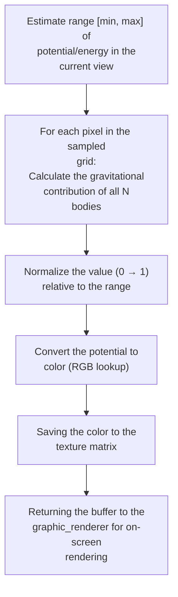

Only what falls within the camera’s field of view is rendered, never at a resolution finer than a single pixel: this rule applies to every graphical element in the engine.

### 3.3 The Second Map: From Φ to dΦ/dt

#### The Practical Problem: Visualizing Field Disturbances

With the $\Phi$ heatmap working perfectly, the next hypothesis was that visualizing the variation of $\Phi$ *over time* (not in space; that is the role of the gradient $\nabla\Phi$) would make field perturbations visible during the inspiral phase of extremely massive objects. The goal was a gravitational wave visualizer, or at least the closest possible analogy in a 2D scalar model.

#### The Attempts: Comparing Two Consecutive Frames

The initial reasoning was: take two consecutive frames of $\Phi$ and compare them. Problem: Comparing two frames is computationally expensive (it halves the frame rate) but above all, it depends on `DT`. If `DT` is too low, the change between frames might not be visible; if it’s too high, the spatial resolution of the wave is lost. At that point, the “architectural” approach was abandoned in favor of a mathematical-physical solution, sought by proceeding step by step.

#### The Solution: The Partial Derivative of the Field

Here, a physicist would have arrived at the answer immediately; the author arrived at it step by step, reasoning about the mathematical neighborhood of $\Phi$ divided by the neighborhood of time, that is, the partial derivative $\partial\Phi/\partial t$ at every point in space (the physical interpretation of the resulting map is in [§7.2 of the Physics Guide](PHYSICS_AND_SCENARIO_GUIDE.md#72-time-derivative-dφdt)). From this sometimes empirical approach, the structure and method for all other [field heatmaps](PHYSICS_AND_SCENARIO_GUIDE.md#7-the-mathematics-of-heatmaps) were formulated.

Specifically: $\Phi = GM/r$, and when the source moves, the distance $r$ changes over time. The derivative reduces, for each source, to $\partial\Phi/\partial t = G M \, v_{rad} / r^2$, where $v_{rad}$ is the component of velocity along the line connecting the source to the observation point. The result is the “$d\Phi$ contribution” of each body to each pixel, summed over all bodies, calculated in the helper kernels with `inline='always'` and parallelized across the entire grid.

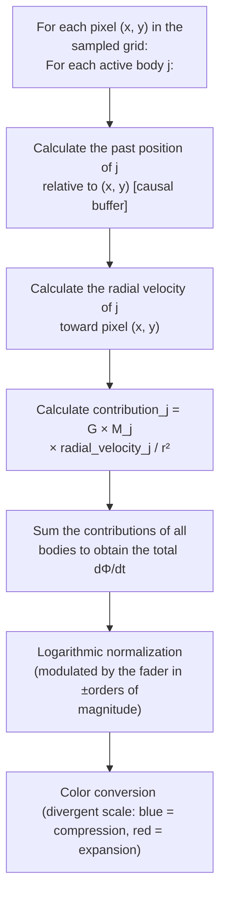

### 3.4 Derived Maps: Tidal, Roche, Lagrange, and GW Strain

From this foundation, other visualizations of the field were then developed:

**Tidal Heatmap (tidal stress).** More than just another map, it is the analytical foundation upon which the entire instantaneous (non-causal) branch of the family rests. The shift from dΦ/dt is mathematical, not structural: the kernel’s framework remains identical (for each pixel, for each body, sum of contributions), but within each contribution, the first-order time derivative of the potential gives way to the second-order spatial derivatives, the analytical components of the Hessian $\Phi_{xx}$, $\Phi_{yy}$, $\Phi_{xy}$ (the physics and interpretation of the map are covered in [§7.3 of the Physics Guide](PHYSICS_AND_SCENARIO_GUIDE.md#73-tidal-stress-and-a-note-on-the-hessian)). From an architectural standpoint, it is actually the simplest in the family: since it is instantaneous, the kernel does not even receive history buffers. No double causal retrieval, no velocity: the signature boils down to positions, masses, and the gravitational constant. The only peculiarity is that the color scale is not normalized to the maximum in the scene but to absolute physical thresholds of material strength, so the color has the same meaning in every scenario. The two pair maps that follow inherit precisely this mechanism: Roche and Lagrange reuse the analytical Hessian summed body by body, adding the centrifugal term of the co-rotating frame and the pair logic. The exception is GW Strain, which does not descend from here but from the causal branch of dΦ/dt.

**Roche and Lagrange Heatmaps.** The Hessian and the gradient of the effective potential $\Phi_{eff}$ (gravity plus the centrifugal term in the co-rotating reference frame) identify the Lagrange points as zeros of the gradient, and the sign of the Hessian determinant classifies them (unstable saddles L1, L2, L3 versus stable maxima L4, L5). Without going into the details of the calculation here: the kernel uses a Newton-Raphson-type distance estimator to scale the bright spots. The stated analogy suffices: it is **as if each equilibrium point were illuminated by a Gaussian distribution centered on the zero of the gradient**, with the peak of the bell curve exactly where the net force is zero. Thus, the Lagrange points (which would otherwise be invisible because they are overwhelmed by the extreme values near the bodies) become luminous peaks. The Roche lobe (the volume within which matter remains bound to one of the two bodies) is the equipotential surface of $\Phi_{eff}$ that passes through L1, the saddle point through which matter can transfer from one body to the other.

One detail that makes all this possible: the co-rotating overlay requires **two** bodies (target plus attractor), but the user locks only one. The other is inferred from a 1D array, `TOP_ATTRACTOR`, which is precalculated only once per rebuild (`_compute_top_attractors`). For each body, the dominant attractor is not chosen based purely on mass or distance, but on **tidal force $M/r^3$** (the logic of the Hill sphere): this is why selecting Io results in the Io-Jupiter map and not the Io-Sun map, because locally, Jupiter dominates the gradient. It’s the same pattern as the rest of the engine: heavy lifting upfront (at rebuild time), $O(1)$ lookup at runtime.

**GW Strain Heatmap (projected quadrupole).** The newest addition to the family and the one that pushes the causal pipeline deepest into the graphics domain. For each pixel and for each body in the pair, the kernel performs **double causal retrieval** ([§2.2](#22-how-physics-interacts-with-buffers)) to obtain position and velocity *at the retarded time of that pixel*, subtracts the motion of the center of mass, projects the retarded velocity onto the pixel-source unit vector and its orthogonal, and maps the quadratic difference $v_r^2 - v_t^2$ (the complete physical formulation is in [§7.6 of the Physics Guide](PHYSICS_AND_SCENARIO_GUIDE.md#76-projected-strain-gw-quadrupole-strain)). From an architectural standpoint, two choices apply:

- Dynamic compression uses **asinh** instead of tanh of dΦ/dt, to keep weak signals in the far field readable without clipping the peaks near the pair.
- The sensitivity fader **reuses the Roche fader channel** instead of introducing a fourth one, a UI compromise that keeps the number of controls constant.

---

## 4. The PerformanceManager: An Auto-Tuner with Memory and Hysteresis

The auto-tuner for heatmap resolution was already briefly introduced in chapter [§3.1](#31-the-frame-budget-60-fps-as-the-target). It’s not simply a matter of “if FPS is low, reduce resolution”; it’s a small control system with three properties. The **hysteresis** mentioned in the title is the principle that governs it: the response depends on the direction of the change, with deliberately different thresholds for decreases and increases, like a thermostat that turns on below 19 degrees and off above 21 without frantically switching back and forth at 20. Below, the threshold for downgrading to 30 FPS and the threshold for upgrading to 58 FPS define the dead zone that absorbs the fluctuations.

### The Real Problem: The Oscillation of the Naive Auto-Tuner

A naive auto-tuner oscillates. It sees low FPS, halves the resolution; FPS shoots above the threshold, it doubles the resolution; FPS plummets again, it halves it… the system oscillates back and forth without ever stabilizing on a useful configuration. In reality, it’s even worse: every resolution change incurs a setup cost (context reallocation, smoothscale), so the fluctuations directly degrade the visual experience.

### The Solution: Three Combined Mechanisms

**1. Dual threshold with asymmetric cooldown.**

| FPS Condition | Action |
|---|---|
| $\text{FPS} < 30$ (`FPS_LOW_LIMIT`) | **immediate downgrade** (double the stride) |
| $30 \le \text{FPS} \le 58$ | **dead zone**: no action |
| $\text{FPS} > 58$ (`FPS_HIGH_LIMIT`) | candidate for **upgrade**, but subject to streak |

The dead zone between 30 and 58 avoids most natural frame rate fluctuations and is intentionally wide: below 30 FPS, the experience really degrades; above that, it remains smooth, so resolution is scaled only when it’s truly necessary, rather than sacrificing it for frame rates that are still comfortable. The downgrade is immediate (smoothness is a priority); the upgrade is gradual.

**2. Stability streak.** Before accepting an upgrade, the system requires **3 consecutive cycles** above `FPS_HIGH_LIMIT`, separated by a `COOLDOWN_MS` of 5 seconds from the last downgrade. This means at least 15 seconds of solid stability above the threshold are needed before attempting to double the resolution. A transient upward fluctuation is not enough to trigger the change.

**3. Performance memory.** The manager maintains a dictionary:

```python
self.perf_memory[(resolution_div, speed_multiplier, view_mode)] = current_fps
```

Each tested configuration is recorded with the actual observed FPS. Before accepting an upgrade from `div=4` to `div=2`, the manager checks its memory: *"Have I ever run with div=2, this speed_multiplier, and this view_mode?"* If so, and the recorded FPS were below the threshold, **it cancels the upgrade before even attempting it**. It prints a log and maintains the current state. This eliminates the “upgrade → immediate downgrade” oscillation pattern: the system learns from its own history.

Concrete example of the cancellation:

```
t=0s    div=4, view=dphi → 60 observed FPS   → perf_memory[(4, mult, dphi)] = 60
t=15s   3 streaks above 58 FPS → candidate for upgrade to div=2
        lookup perf_memory[(2, mult, dphi)] → 27 FPS (recorded in the past)
        27 < 30 → UPGRADE CANCELED, remains at div=4
        log: "[AUTO-TUNE] CANCELED upgrade to div=2 ... Past memory recorded 27.0 fps here."
```

Without the memory, the system would have attempted div=2, dropped to 27 FPS, immediately downgraded to div=4, and restarted the cycle indefinitely.

The decision flow that combines the three mechanisms:

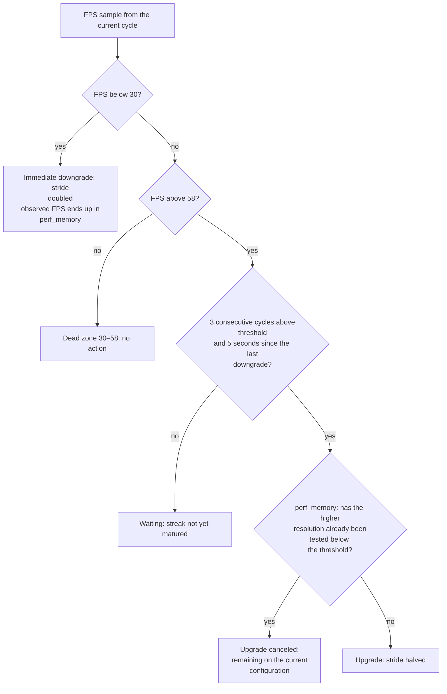

**Selective memory reset.** When `DT` or the number of active bodies (`current_body_count`) changes, the entire `perf_memory` is reset to zero. Historical data becomes invalid because the computational load has changed structurally. The system starts over with a clean slate and begins learning again.

**Exceptions for view_mode.** Three modes (`view_mode in (0, 3, 5)`) bypass the cooldown/memory logic, but for different reasons. Only view mode **0 (OFF)** (no heatmap) does not actually have a grid to scale. Modes **3 (Lagrange Hunter)** and **5 (Tidal)** have a full-fledged visualization, but are **forced to `div=1` (full resolution)**: downscaling would destroy the fine details (for example, Lagrange points can be minuscule). Mode **4 (Roche)** is a special case: it is capped at a maximum of `div=2`, because calculating the Hessian is computationally intensive, but beyond that threshold the visualization becomes unreadable.

The result is a system that quickly stabilizes on the optimal configuration for the user’s machine, adapts as the scene’s complexity changes, and never visibly fluctuates.

---

## 5. Collisions, Black Holes, and Singularities

The collision system is not the simulator’s main focus; it is a qualitatively acceptable but physically very approximate subsystem. It preserves the momentum of the surviving body and roughly estimates the portion of mass lost in the impact and the percentage absorbed by the winning body. This is sufficient to be physically plausible; going into greater detail would have had a performance impact that was not justified for the purposes of the project.

### The Practical Problem: Numerical Tunneling

`DT` is the parameter that determines the simulation's resolution. The smaller it is, the more accurate the physics, and the higher the computational cost per second of simulation. In a “strong field” (e.g., areas of immense gravity near a black hole), a body may undergo extreme acceleration in a single tick and, by the next tick, have already traversed the entire black hole’s event horizon while retaining enormous energy, only to be ejected at absurd subluminal speeds. This is the classic “numerical quantum tunneling”: the body passes through the obstacle instead of colliding with it.

Setting the capture radius to a *static* multiple of the Schwarzschild radius $R_s$ (for example, $3\,R_s$, the order of magnitude of the ISCO) is not enough: with non-ideal DT, the body tunnels past even that expanded threshold. The key is to make the multiple **dynamic**, linked to the DT.

### The Solution: Adaptive Hitbox and CCD

The solution has two levels.

**Level 1: Adaptive black hole hitbox.** The capture radius multiplier is not fixed: it is calculated at runtime as a function of the time step.

$$\text{BH\_ACCRETION\_MULT} = \max\left(1.0,\ \min(10 \cdot DT,\ 100)\right)$$

When $DT$ is large, the target expands aggressively to avoid kinematic tunneling; when $DT$ is microscopic, it shrinks toward the lower bound of 1.0×. Specifically:

| $DT$ | $\min(10 \cdot DT, 100)$ | Final multiplier | Regime |
|:---:|:---:|:---:|---|
| $1\ \mu\text{s}$ | $10^{-5}$ | **1.0×** (lower clamp) | merger: tangent horizons, precise physics |
| $1\ \text{s}$ | $10$ | **10×** | ordinary orbits |
| $60\ \text{s}$ | $600$ | **100×** (upper clamp) | long step: wide anti-tunneling target |

The multiplier acts on the **Schwarzschild radius** $R_s$ (the event horizon, as defined in the [Physics Guide nomenclature](PHYSICS_AND_SCENARIO_GUIDE.md#essential-terms-and-nomenclature)), not on the physical radius. It is no coincidence that it is called *BH*_ACCRETION_MULT (BH = Black Hole): an upstream gate excludes ordinary bodies, for which the collision boundary remains the physical radius (`is_bh`, true only if $R_s$ exceeds 0.1% of the visual radius). The Sun, with $R_s \approx 3$ km compared to a radius of 696,000 km, will never trigger it: even at 100×, the expanded horizon would be 2,000 times smaller than the photosphere. In practice, the mechanism applies only to black holes and neutron stars.

With `vis_r = R_s` and a small DT, two black holes of comparable mass merge when their horizons become tangent, the correct contact condition for a merger like GW150914. The same floor, however, is too permissive for a pair with an extreme mass ratio (an EMRI: a lightweight body spiraling around a much more massive black hole). In those extreme, unbalanced strong-field scenarios with very close masses, an anomalous force *kick* could occur that would prevent coalescence.

The EMRI guard (`emri_guard`) closes this loophole, using two thresholds instead of just one to avoid over-expanding intermediate pairs (overly aggressive expansion is itself a source of overdissipation, [§10.1 of the Physics Guide](PHYSICS_AND_SCENARIO_GUIDE.md#101-case-study-gw190814-overdissipation-in-deep-space)). The mass ratio determines how much to expand the capture radius of the larger body in the pair, always below the threshold of $\sim1.9\times$ and only at small DT.

- $1.0\times R_s$ below 3:1 (comparable pairs, no expansion).
- $1.25\times R_s$ between 3:1 and 50:1 (sufficient to absorb the body before the steep section of the PW potential without excessive expansion).
- $1.9\times R_s$ beyond 50:1 (pure EMRI, where the full margin is needed).

Why expanding the boundaries was deemed acceptable in these scenarios:

- **Physically**: a body at such a depth is bound to fall anyway, so capturing it a little earlier does not distort the dynamics.
- **Numerically**: without going into too much detail, at such close range the (extremely costly) numerical relativity friction terms that allow for final contact do not activate.
- **Conceptually**: it is a regularization by absorption. Instead of clamping the velocity *after* the anomalous kick, the boundary is shifted backward and the source of the kick is removed.

The guard is only effective at small DT; at large DT, the target is already wide enough that it isn’t needed.

**Level 2: Continuous Collision Detection (CCD).** An additional sensor that applies to all contexts but, in practice, tends to be triggered mainly in strong-field situations. For each pair of active bodies in the $O(N^2)$ cycle:

1. Calculate the relative displacement vector in the current tick: $\Delta r = (\vec{v}_i - \vec{v}_j) \cdot dt$.
2. Cast a **linear ray** along this trajectory: if the segment from `pos_current` to `pos_next` intersects the capture sphere, tunneling is in progress.
3. Calculate $t_{min} \in [0, 1]$ (a number between 0 and 1: the fraction of the tick at which the closest approach occurs, where 0 is the start of the tick and 1 is the end), and the merge is handled at that interpolated position, not at the end of the tick.

**The $O(N^2)$ spatial filter → nearly $O(N)$.** The collision loop is nominally $O(N^2)$ but in practice is nearly $O(N)$ thanks to a pre-filtering step. Before the double loop, a linear scan calculates `max_v` (the maximum velocity among all bodies) and derives $\text{max\_move} = \text{max\_v} \cdot dt \cdot 2$ (the maximum possible relative displacement in a tick in the worst case). In the next loop, for each pair $(i, j)$, the gap $|\Delta x| - (r_i + r_j)$ is compared to `max_move`: if the gap is larger, the pair is geometrically unable to collide in this tick and an early exit is performed before even checking `vel_arr`. In a galactic scenario with ~200 bodies (~20,000 nominal pairs per tick), the filter typically discards over 99% of the pairs before the actual CCD calculation: the nominal complexity remains $O(N^2)$, but the actual cost collapses to the small subset of geometrically plausible pairs.

Complementing this is the **dynamic cooldown** (`COLLISION_COOLDOWN`), based on a single question: for how many ticks can *no* pair physically come into contact? For that number of ticks, the entire collision module is skipped entirely. The answer is the minimum of two independent estimates.

1. **The adaptive kinematic estimate.** Given the minimum gap detected in the current tick and the maximum acceleration in the scene, quadratic kinematics calculates the number of ticks required until the first possible contact. This is the aggressive estimate: distant and slow pairs result in long skips.
2. **The fixed relativistic ceiling.** This is necessary because the kinematic estimate assumes constant acceleration, whereas in a $1/r^2$ fall, the acceleration increases over time: with a coarse step size, the cooldown would risk skipping *past* the collision. This was the Achilles’ heel of head-on plunges with zero angular momentum, the only ones to tunnel precisely because they do not benefit from the expansion of the capture radius. The ceiling thus imposes a fixed assumption, independent of `max_v` and `max_a`: no pair closes faster than $0.75\,c$ relative, so the allowed jump never exceeds `min_gap / (0.75·c·DT)` ticks.

The effective cooldown is the minimum between the kinematic estimate and the relativistic ceiling. In practice, the ceiling almost always wins out, as it remains conservative even in the most violent mergers that can be recreated (two NSs falling from rest collide at approximately $0.6c$ relative), so the kinematic estimate remains a network with negligible cost for configurations not yet verified. The upper bound thus ensures that the next check never occurs after the tick in which the pair, closing at the limiting speed of $0.75\,c$, would have closed the entire gap measured at the last check; no later than the first instant at which contact would be physically conceivable in that scenario. A final measure protects large DTs, where the distance traveled in a single tick at $0.75\,c$ would become enormous and the cap (squeezed toward zero ticks) would force checks on pairs that are still extremely far apart: that distance per tick is therefore limited by a clamp in km.

**A silent safeguard upstream of the two levels.** It resides within the force calculation, not in the collision module: if the distance between the centers falls below the sum of the radii, the separation vector is rescaled to the contact distance. In the tick that elapses between geometric overlap and collision resolution, the denominator of the force cannot therefore approach zero, and no spurious kick is injected.

The complete flow of a tick in the collision module, in summary:

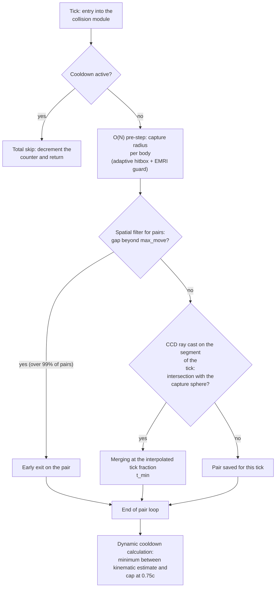

---

## 6. The Asynchronous Garbage Collector for Causally Dead Bodies

When a body is destroyed (collision, manual command, ingestion into a black hole), it does not instantly disappear from the simulated universe. Its past continues to exist in **its own** history buffer, from which other bodies continue to read it via the past light cone. Clearing the buffer is an active process: at every tick, Phase 1 continues to advance the head of the dying body’s buffer by writing **VOID_VAL** (the “non-existence” sentinel) in place of its state, so that the front of non-existence advances at the same rate at which the history previously advanced. Only when VOID_VAL has filled the tail of the deepest buffer can no body in the universe receive gravitational information from it anymore. At that point, the body is **causally dead** and can be effectively removed.

### The Practical Problem: Scanning Within the Frame Budget

Detecting causal death requires scanning the history buffers: for each body in the `FLAG_DYING` state, check the value at the tail of the deepest available buffer (L2 if it exists, otherwise L1, otherwise L0). This is a linear operation in terms of the number of dying bodies: not extremely heavy, but not free either. It must be performed regularly to prevent dead bodies from accumulating in the history.

Performing it within the main loop impacts the 16.6 ms frame budget. Skipping it for too many consecutive frames unnecessarily inflates the history, because dead bodies continue to be referenced in $O(N^2)$ loops.

### The Solution: Producer/Consumer Daemon Thread

Every 60 frames, the main loop calls `gc_worker.start_collection()`. If there isn’t already an active daemon thread, one is started to scan the buffers outside the frame budget. The results (a list of causally dead indices) are written to `_pending_results` under `threading.Lock`. The main thread, also every 60 frames, calls `get_and_clear_results()`, which returns the ready list (or `None` if scanning is still in progress).

Essential pattern:

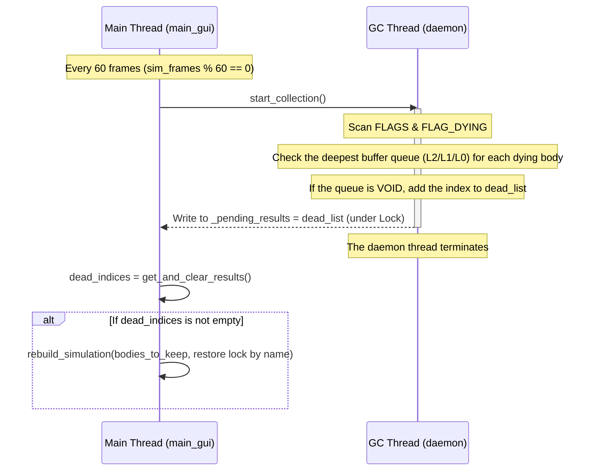

> [!TIP]
> **Why a daemon thread and not a persistent worker?** The daemon thread lives only for the duration of a scan and then dies. There is no task queue; there is no worker waiting in a sleep state. The pattern is “fire-and-forget with a lock on the result”: easier to debug, zero idle overhead, and no risk of zombie threads when the main process terminates (the daemons die with it).

**Anti-overlapping.** `start_collection()` checks `is_alive()` (the standard method of `threading.Thread`, not a flag specific to this project) on the previous thread: if a scan is already in progress, the new trigger is ignored. In heavy-load scenarios where the scan lasts more than 60 frames, the GC automatically scales its frequency to the rate it can sustain.

**Index remapping after rebuild.** When the main thread receives `dead_indices`, it constructs `bodies_to_keep` by exclusion and calls `rebuild_simulation()`. This compacts the indices from 0 to N-1, so `locked_body_idx`, `lagrange_target_idx`, and `lagrange_attr_idx` may point to the wrong bodies. The solution: before the rebuild, save the **names** of the referenced bodies, and after the rebuild, look up the indexes by name. This is more robust than maintaining translation maps and cleanly handles the case where the locked body is actually one of the dead ones (the lookup by name returns `None`, and the lock is released).

---

## 7. The LIGO Probe: Sampling and Dump Architecture

Only after observing physically plausible behavior (specifically, the spiral perturbation of the `dΦ/dt` field with black holes in the inspiral phase, described in [§3](#3-heatmap-rendering-and-fps-management)) was a virtual “listener” instrument added to the system. The analogy with the gravitational waves measured by LIGO/Virgo was apt: a spatial listener a few million km from the event, recording the local perturbation of the field.

The downstream DSP pipeline (Tukey, Butterworth, STFT, Hilbert, Peters) is documented in the Physics Guide. Here, we are interested in **how the probe is constructed within the system**.

### Architectural Constraints

The probe is an **optional, manual** tool: the user decides *whether* to activate it and *where* to position it (`P` key, click on empty space); the system merely *suggests*, via RADAR alerts, when and where it is best to place it to capture an event. Once activated, however, it must adhere to certain technical constraints:

1. **It must operate within the physics loop** without slowing it down. Each simulation tick must be able to write a sample, even at `DT = 1 μs` (1,000,000 samples/second).
2. **Handle simulation rebuilds correctly**. Every change in DT, causal radius, or spawn rebuilds all history buffers from scratch. The probe must be handled separately: when DT remains unchanged, its buffer must be preserved intact; however, when DT changes (i.e., at a different sampling frequency), continuing the same signal would make no sense, so it must be saved to disk and then restarted from scratch.
3. **Be a global singleton**; there is only one probe in the simulated universe.
4. **Expose data to the renderer and to disk without unnecessary copies**.

### The Choices

**Pre-allocated dedicated buffer.** `PROBE_BUFFER` is a 1D NumPy array of `float64` with a size of `2**21 = 2,097,152` slots (~16 MB). The size is an exact power of 2 to use the usual circular bitmask trick: `(head + 1) & PROBE_MASK` instead of `% PROBE_LEN`. The same pattern as in history buffers, reapplied here.

**State vectorized into minimal arrays.** `PROBE_HEAD`, `PROBE_ACTIVE`, and `PROBE_POS` are tiny NumPy arrays (the first two contain a single element each, and the third contains a pair of coordinates) rather than Python scalars. This is because the Numba JIT cannot write to global Python variables from within an `@njit`, but it can write to NumPy array elements passed by reference. This is the standard pattern for mutable state within a JIT kernel.

**Always read from L0, never from LOD history buffers.** The probe does not query past history: it always reads the instantaneous state of the bodies at the current tick. This choice is intentional: sampling from the compressed L1 or L2 history buffers would introduce a sampling error that distorts the chirp waveform and makes spectral analysis impossible. It must be clearly stated that this is a **simulation shortcut, not physical realism**: a real interferometer measures the wave that has arrived by propagating at $c$, not the instantaneous state of the source. Here, the instantaneous L0 is read solely to obtain a clean signal, consciously accepting the sacrifice of measurement causality.

**Probe ↔ rebuild decoupling.** When `rebuild_simulation()` reallocates all history buffers, the `PROBE_BUFFER` is **preserved** if DT and the sizes of the history buffers have not changed (`can_deep_copy` in `_restore_bodies`). If, however, the rebuild changes the parameters, the probe’s contents are **automatically saved** to disk (dumped) in a daemon thread `threading.Thread(target=_dump_task, daemon=True)` before the buffer is cleared. The user never loses the recorded telemetry.

**Singleton via a thin class.** `SpaceProbeController` does not hold any data: all data resides in `data.py`. The controller exposes only high-level operations (`activate_at`, `deactivate`, `dump_session`, `get_current_strain`). When inactive, the probe is parked at `VOID_VAL` (impossible coordinates in simulated space), ensuring that no accidental calculations produce spurious strain.

**Final dump on exit.** At the end of the process (`pygame.quit()`), `main_gui.py` checks `ligo_probe.active` and forces a final `dump_session()`. A brief `time.sleep(1.0)` gives the save daemon thread time to complete writing to disk before Python terminates the main process.

The raw signal is a kinematic proxy for the actual strain: for each body, we sum $m_j\,(v_{x,j}^2 - v_{y,j}^2)/R_j$, where $R_j$ is the distance between the source and the probe. The velocities are measured relative to the system’s center of mass, not in absolute terms: what matters is the relative motion of the bodies, and the signal remains unchanged if the entire scene translates at a constant velocity. The term $1/R_j$ causes the amplitude to decrease as the source moves away from the probe, just as in a real wave. The result oscillates at twice the orbital frequency, the same signature as a real gravitational wave. This is an algebraic simplification documented and discussed in the Physics Guide. This raw signal is not yet interpretable on its own: it is `ligo_analyzer.py`, an independent pipeline, that transforms it into familiar data and graphs (spectrograms, instantaneous frequency, chirp mass estimate), interpreting what the probe has recorded.

**Exporting to `.npy` and the Analyzer.**
The saving process (the “dump” mentioned above) does not use text files, but saves the `PROBE_BUFFER` and its associated temporal metadata (such as DT) directly in NumPy’s native binary format (`.npy`). This ensures nearly instantaneous reads and writes with no loss of precision for arrays containing millions of elements. The files are saved in the `ligo_output/data_npy/` folder and are ready to be processed by `ligo_analyzer.py`. The latter is a full-fledged parallel analysis program that can be conveniently launched from the simulation launcher. It reads the `.npy` file and uses the `scipy.signal` library to process the raw signal through a rigorous filtering pipeline (detrending, Tukey window, Butterworth high-pass filters) until the instantaneous frequency is extracted via the Hilbert transform and the spectrograms are plotted. The entire sequence of technical processing steps applied by the analyzer is detailed in [§8.8 of the Physics Guide](PHYSICS_AND_SCENARIO_GUIDE.md#88-the-analyzers-analysis-pipeline-ligo_analyzerpy).

---

## 8. Body Trails

Trails have posed a disproportionate burden and problem relative to their apparent simplicity. The fundamental problem: if you plot a point for every physics tick, on long simulations the points number in the millions, become extremely dense, and clog up both the graphics and the RAM. A strategy was needed to maintain visually satisfying trails at a fixed and predictable cost.

The solution has three components:

**Fixed total budget.** There is an absolute maximum number of trail points distributed among all bodies present. Each body receives a proportional share. Structure: a pre-allocated `(max_bodies, max_points_per_body, 2)` matrix, managed as a circular buffer.

**Adaptive sampling by body type.** A new trail point is written only if the body has moved, **in world coordinates**, beyond a distance threshold that depends on the *type* of body. The logic (`update_trail_logic`) is a 2×2 radius×velocity matrix: a huge, slow body (the Sun) gets the finest threshold to capture the cuspids; a fast body (planet or binary system) gets a medium threshold to ensure enough history is visible, while a small, slow body (drifting asteroid) gets the coarsest threshold to avoid wasting buffer space. This sampling is purely physics-driven and **does not depend on the camera in any way**.

**Rendering only what is visible and the 2px rule (this is where the camera comes in).** The camera does not influence *what* is saved, but only *what* is drawn. Only points within the frustum (the field of view) are processed and rendered; furthermore, *intra-pixel* segments are discarded by measuring the on-screen distance between consecutive points: if the visual displacement is less than 2 pixels, the point is ignored. When you zoom out drastically, tens of thousands of historical points collapse into the exact same pixel: the CPU would crash if it had to overwrite it 10,000 times without any visual difference. With this sub-pixel culling, the graphical overhead of the trails remains minimal.

**Write Heads.** Each body has its own `trail_heads[i]` counter that advances only when a point is actually written (`head = head + 1`, reset to 0 at the end of the buffer). Since writes are rare (they occur only when the displacement threshold is exceeded, not at every tick), advancing the heads is trivially efficient and does not represent a bottleneck.

---

## 9. The Architecture of `main_gui` and the UI

### 9.1 From the Monolith to a Modular Architecture

#### The Real Problem: The 2,000-Line Monolith

`main_gui.py` quickly became unmanageable: a single file exceeding 2,000 lines of nested `if`/`elif` statements that handled events, state, physics, and rendering all in the same place. It was impossible to modify without breaking something, and reading the execution flow required keeping too much context in mind at once.

#### The solution: interceptor chain, shared state, and layers

**The main loop.** The game loop follows a fixed, non-negotiable order:

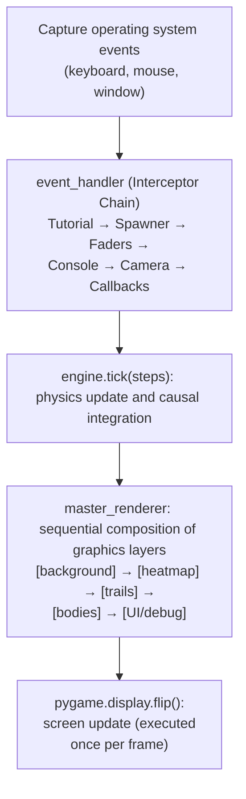

**The Input Interceptor Chain.** Each element in the chain can consume an event (returning `True`) and block its propagation to subsequent modules. This prevents inconsistent behavior (such as moving the camera while typing a command in the console). The structure is modeled after the event handler architecture in video games: each interceptor is responsible for a specific domain and knows nothing about the others.

**The `UIState` singleton.** All UI state (which heatmap is active, the current zoom level, overlay flags, the selected body) resides in a `UIState` singleton accessible to all modules without passing parameters around. The reason for this choice is purely practical: user input and rendering logic pass through dozens of nested functions and classes. Passing a massive configuration object as a parameter to every single function would have cluttered the code with unnecessary boilerplate. 

The trick that makes it truly global and indestructible is found in the `ui/ui_state.py` file. At the end of the file, the class is instantiated directly at the module level: `ui_state = UIState()`. By taking advantage of the fact that Python executes a module’s code only once (upon the first import) and then “caches” the result in `sys.modules`, anyone who writes `from ui.ui_state import ui_state` anywhere in the engine will automatically receive the exact, unique in-memory reference to that object. This is a debatable choice from a “Clean Code” perspective (global dependency), but with a single main thread dedicated to the UI, the trade-off between purity and practicality was resolved in favor of the latter.

**The master_renderer and the layers.** Each visual element is a separate layer drawn in the correct order onto a Pygame surface. The `flip()` operation occurs only once at the end of the frame: throughout the composition process, the display shows nothing, eliminating visual tearing. This has reduced `main_gui.py` from over 2,000 lines to about 300. Among the layers is also the **Orbital Telemetry Panel** (the HUD displaying the absolute and relative positions, velocities, and accelerations of the selected body). Its contents and their physical interpretation, along with the field probe with which it shares the double-click gesture, are documented in [§7.9 of the Physics Guide](PHYSICS_AND_SCENARIO_GUIDE.md#79-double-clicking-on-the-scene-telemetry-panel-and-field-probe-units-of-measurement).

### 9.2 The Interactive Spawner and the Interceptor Adapter

`OrbitalSpawner` is the subsystem (a five-state machine) that allows the user to insert a new body on the fly, without exiting the simulation.

**Be careful not to confuse it with the Interceptor Chain**: `OrbitalSpawner.handle_event()` is an *internal* method of the spawner; it is never registered in the chain and does not follow its protocol (it can return a `bool` **or** a dictionary containing the new body’s data).

The actual interceptor registered in the chain (via `InputController.register()`) is a separate method called `intercept_spawner`. This method acts as a true "Adapter":
1. It receives the event from the chain and passes it to the "pure" spawner (`spawner.handle_event(event)`).
2. It evaluates the type of response (using `isinstance`): if the spawner responds with a simple Boolean (`True` or `False`), the Adapter simply forwards it to the chain to block or allow the event to proceed to the other systems.
3. If, on the other hand, the spawner responds with a **dictionary** (the user has pressed Enter and confirmed the orbital parameters), the Adapter blocks the chain by returning `True` and takes over the heavy lifting in the engine: it handles removing any possible overlapping bodies, preserving the camera and active Lagrange points, and then calls the computationally expensive `rebuild_simulation()` and `engine.refresh_kernel()`. The spawner itself knows nothing about the physics engine: it simply draws screens and calculates orbits on paper.

The spawner manages its own state machine (`self.state`, from 0 to 4) and draws the corresponding modal screen with `draw()`:

0. **Inactive.**
1. **Body selection**: a paginated catalog of templates (ranging from artificial satellites to ultra-massive black holes), navigable with `0`/`5` and selectable with `1`–`4`.
2. **Orbit selection**: geostationary, circular, eccentric, or plunge orbit, around the most massive body in the scene or the one closest to the spawn point (properties calculated on the fly, `top_body` and `closest_body`), or branching toward the Lagrange points (`8` key). A physics-based safety check prevents you from selecting an orbit if the mass of the new body would exceed that of the attractor.
3. **Selecting the Lagrange pair**: Cycle through the candidate pairs using `TAB`, reusing the `TOP_ATTRACTOR` array already precalculated for the HUD and the Roche/Lagrange heatmaps (§3), rather than performing a new calculation from scratch.
4. **Selection of the specific point** (L1–L5): Calculate the exact position and velocity using the same analytical formulas as in the Physics Guide ([§9.4](PHYSICS_AND_SCENARIO_GUIDE.md#94-analytical-lagrange-points-restricted-circular-three-body-problem) and [§9.5](PHYSICS_AND_SCENARIO_GUIDE.md#95-co-rotating-velocity-at-lagrange-points)); `get_ghost_markers()` displays the five positions for a live preview drawn on the screen before confirmation.

The state machine, in summary (from any active state, pressing `ESC` cancels and returns to state 0):

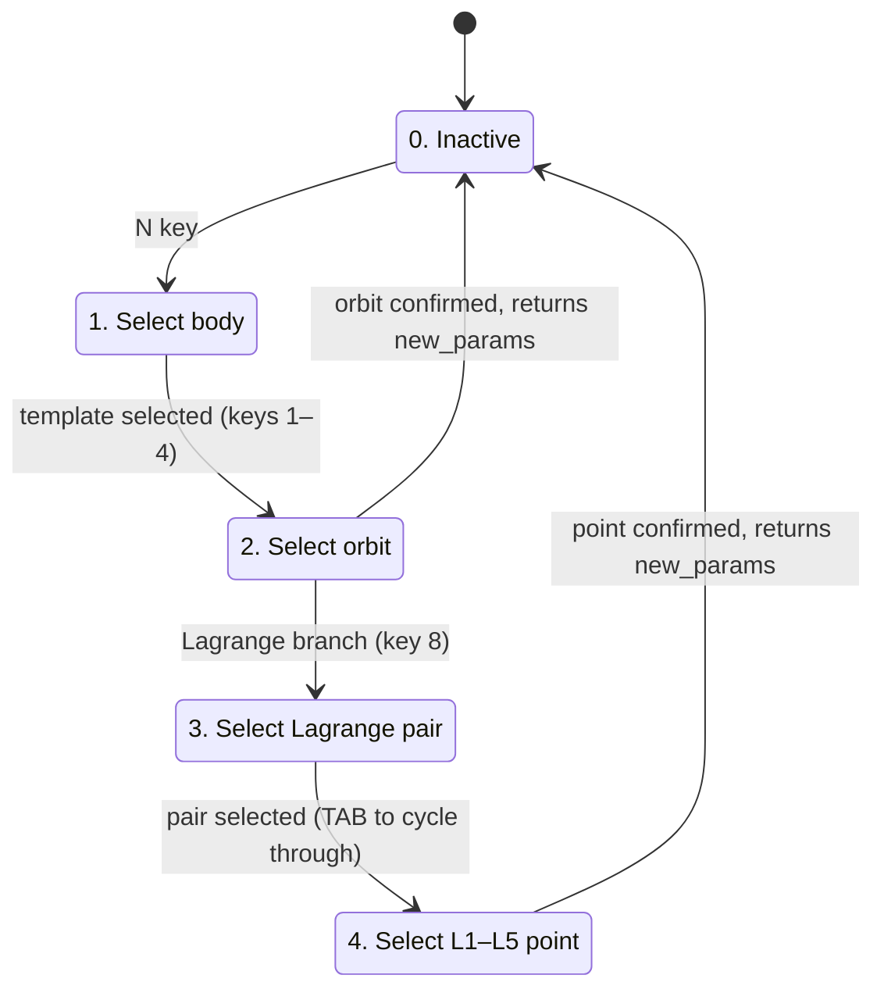

To summarize the boundary between the two levels: when state 2 or 4 completes a valid selection, `OrbitalSpawner.handle_event()` returns the `new_params` dictionary instead of a boolean, an unorthodox but deliberate return protocol, consistent with the pragmatic style of the rest of the engine. It is `intercept_spawner`, in `input_controller.py`, that recognizes that specific case and translates it into a concrete action on the simulation, keeping the chain of interceptors strictly at `True`/`False`.

### 9.3 The Main Process Bootstrap Sequence

The initialization order is not arbitrary. Each phase has precise preconditions based on the preceding phases.

```
PHASE A: pre-Pygame (Tkinter splash screen still active)
  ├─ GlobalState() instantiated (UI/simulation flags)
  ├─ show_splash_and_load(preset, gstate, dt_val)
  │     ├─ presets.get_preset() → CelestialBody list
  │     ├─ rebuild_simulation() → allocate L0/L1/L2 buffers + trails + probe
  │     └─ Deferred print buffer collected (no terminal yet)
  └─ data.DT set

PHASE B: Pygame bootstrap
  ├─ pygame.display.init() + pygame.font.init() (NO audio)
  ├─ sys.stdout = GameConsole(sys.stdout)  ← stdout interceptor
  ├─ flush_deferred_prints() → loading log in the console
  ├─ screen = pygame.display.set_mode(...) (also handles fullscreen)
  ├─ clock = pygame.time.Clock()
  └─ 6 monospace fonts (HUD, console, tutorial, legend)

PHASE C: rendering layer construction
  ├─ OverlayRenderer(fonts...): HUD, tutorial, legend, debug info
  └─ MasterRenderer(fonts..., overlay_renderer): final composition

PHASE D: building the physics layer
  ├─ Camera(w, h) + auto-focus on the most massive body
  │     ├─ next((b for b if b.mass >= data.TOP_MASS * 0.999))
  │     └─ scale = top_body.radius / 10.0 (clamped to 0.001)
  ├─ Engine(bodies): compiles JIT kernel on the first tick (cache=True saves to disk)
  └─ SpaceProbeController(): LIGO probe singleton, starts disabled in VOID

PHASE E: runtime UI construction
  ├─ GravityRenderer(w, h, resolution_div): heatmap renderer
  ├─ 3 VerticalFaders (DPHI sensitivity, ROCHE, contrast)
  ├─ PerformanceManager(): resolution auto-tuner
  ├─ TutorialPopupManager(fonts...)
  └─ OrbitalSpawner()

PHASE F: Shared state
  └─ UIState (singleton) populated with ALL of the above references
       (bodies, engine, renderer, camera, gstate, faders, perf_manager,
        ligo_probe, screen, lock/Lagrange indices, confirmation flags...)
       The original locals are destroyed via `del` to prevent
       accidental desynchronization between locals and ui_state.*

PHASE G: worker threads and tracker
  ├─ DeathTracker(): impact event logger (synchronous, lightweight)
  └─ GCWorker(): asynchronous collector of causally dead bodies

PHASE H: input chain
  ├─ EventHandler() instantiated
  └─ InputController().register(event_handler)
        ↑ all chain interceptors are installed here

PHASE I: Frame Zero
  ├─ ui_state.gstate.paused = True
  ├─ push_default_tutorials() → first popup visible
  └─ while ui_state.running: → main loop begins
```

Important points regarding the order:

- **Tkinter before pygame**: The splash screen must be in place before the display is initialized; otherwise, the user sees a black window during loading (heavy buffer allocation + initial Numba compilation).
- **Console interceptor before flush**: Deferred prints from the loading thread must be captured by `GameConsole`, not by the raw terminal. If the order were reversed, those logs would never appear in the interface.
- **Engine before worker threads**: `GCWorker` reads `data.FLAGS` and `data.HISTORY_LX`. If it started before Phase D, it would read empty placeholder arrays and write nonsensical results.
- **InputController after `UIState`**: interceptors read the shared state at the time of dispatch. Registering them before `ui_state` is populated would cause an `AttributeError` on the first event.
- **`paused = True` before the loop**: If the first physics tick ran before the tutorial popup, the simulation would start with free-falling bodies beneath the welcome text, resulting in confusing visual effects.

---

## 10. The GameConsole: stdout interceptor with simulation timestamps

A simple architectural change that significantly improves the debugging experience and the integration of logging into the engine.

### The Pattern: Duck Typing and Proxy

```python
sys.stdout = GameConsole(sys.stdout)
```

This trick relies on two architectural pillars of Python:

1. **Duck Typing**: Python does not check the “type” or the class hierarchy of `sys.stdout`. The only thing it requires from the interpreter (when someone calls `print()` in the code) is that the object pointed to by `sys.stdout` has a method named exactly `write(msg)`. By replacing the system terminal with our `GameConsole` instance, we’re “tricking” Python with an object that pretends to be a text file simply by matching its signature.
2. **The Proxy (or Decorator) Pattern**: `GameConsole` doesn’t block access to the real terminal, but acts as a gatekeeper. The constructor receives the operating system’s original `sys.stdout` and stores it in a private internal variable (`self.original_stdout`). From that point on, it acts as a “gatekeeper”: it receives text for the simulator and, at the same time, secretly calls `self.original_stdout.write()` to keep the external terminal running as if nothing had changed.

### What does `write()` do?

Every time someone calls `print(...)` from anywhere in the code:

1. **Forward to the original**: It still writes to the terminal (the external debug log remains intact).
2. **Parsing the message**: It splits by `\n` and removes ANSI color codes (`\033[93;1m` and `\033[0m`) that are needed by the terminal but would interfere with Pygame’s rendering.
3. **Simulation timestamp**: Prefixes each line with `[formatted sim_time]`. Crucial: This is not the system time; it is the current simulated time (`self.current_sim_time`, updated by `Engine.tick()`). When a body collides in simulation year 2,150,847, the log shows exactly that year.
4. **Circular buffer**: a maximum of 1,000 messages are kept in RAM. When this limit is exceeded, the oldest messages are truncated.
5. **Smart auto-scroll**: if the user is scrolling manually, auto-scroll is disabled. New messages appear at the bottom, but the view remains at the point the user is reading.

### The Advantage of the Pattern

All the project’s code continues to use `print()` as usual. No module needs to be aware of the in-game console’s existence. The logging refactoring was **a one-line change** in `main_gui.py`, without touching a single existing `print()` in any other file in the project.

When the main loop exits and Pygame closes, `sys.stdout` is left as `GameConsole` (which the OS doesn’t see: file descriptor 1 is still the original terminal, which continues to receive output via `original_stdout.write()`). No cleanup is necessary because the process terminates immediately afterward.

> [!NOTE]
> **JIT kernels also print output.** The GW regime telemetry (time, distance, relative velocity, wave frequency) is output from within `compute_relativistic_force`, entirely in compiled nopython code. There, Numba does not support f-strings or `format`: decimal numbers are formatted manually, separating the integer and fractional parts using only integer arithmetic. The console intercepts them just like any other `print`, including the simulation timestamp.

---

## 11. The loading splash screen: Tkinter before pygame with a thread-local print interceptor

A common UX issue in resource-intensive simulators: the user launches the program, Pygame initializes, displays a black window, and the window remains black for 5–30 seconds while buffer allocation and JIT compilation run. Windows displays the “not responding” banner on the app. The user thinks it has frozen. Solution: have a progress window *before* Pygame even exists.

### The core problem: the black window and the two main loops

- `pygame.display.init()` immediately opens a black window that remains until the first `flip()`.
- Loading (preset → allocation of history buffers → initial JIT kernel compilation) can take tens of seconds.
- Tkinter would be ideal for a splash screen with a progress bar, but it cannot simply coexist with PyGame in the same thread, and the engine loading cannot run in the same thread as Tkinter; otherwise, the main loop freezes and the window remains frozen.

### The Solution: Delegation and a Two-Thread Architecture

To isolate this complexity from the engine’s core, the very first action in `main_gui.py` is to delegate the entire process to the `show_splash_and_load()` function (located in the separate file `utils/loading_splash.py`). 
Within this independent module, the loading process is split into two parts and managed via a message queue:
```
MAIN THREAD (Tkinter main loop)        WORKER THREAD (daemon)
──────────────────────────────        ──────────────────────
  splash = tk.Tk()                    presets.get_preset(...)
  progress_q = queue.Queue()          rebuild_simulation(...)
  Thread(_loading_worker).start() ──► print("[MEM CHECK] ...")
                                      print("[L2 BUDGET] ...")
                                      print("[SMART COPY] ...")
                                      print("Rebuild complete")
                                      result_holder['result'] = (...)
  while worker.is_alive():
    try:
      msg = progress_q.get_nowait()
      update_progress_bar(msg)
    except Empty: pass
    splash.update()
    time.sleep(0.05)

  splash.destroy()
  return result
```

### The thread-local print interceptor

> [!NOTE]
> This is one of the few parts of the project that the author delegated almost entirely to an LLM. The general idea (capturing the loading `print` statements and using them for the progress bar) is the author’s, but the implementation of the thread-local mechanism below was written by the model. The functionality is described here without fully mastering every detail.

The worker thread performs hundreds of `print(...)` statements during loading (allocation logs, buffer mode selection, smart copy, etc.). Those `print` statements **must not appear in the terminal** (because they’ll appear there later, via `GameConsole`), **must not clutter Tkinter**, and **must be parsed** to update the progress bar based on the message’s content (e.g., *"L2 BUDGET" → 35% → "Allocating history buffers..."*).

Monkey-patching `builtins.print` on a single thread is not straightforward: the `builtins` module is the heart of Python: it contains the basic global functions (such as `len()`, `int()`, and, of course, `print()`). Since it is global to the process, if you replace it, **all threads** will use it. The solution here is a wrapper that checks the identity of the calling thread:

```python
my_thread_id = threading.current_thread().ident

def _thread_local_print(*args, **kwargs):
    if threading.current_thread().ident != my_thread_id:
        # Print from another thread (e.g., Tkinter, GC): original behavior
        original_print(*args, **kwargs)
        return
    # Print from the worker: capture in buffer + parsing for progress
    ...
    print_buffer.append(msg.rstrip('\n'))
    if "L2 BUDGET" in msg: progress_q.put(("status", "...", 35))
    elif "MEM CHECK" in msg: progress_q.put(("status", "...", 80))
    ...

builtins.print = _thread_local_print
```

It is thread-safe by design: no locks are needed; each call checks its thread identity and behaves accordingly. No race conditions.

### The deferred print buffer

Prints captured in the worker are accumulated in `print_buffer` and returned to the caller along with the bodies. When `main_gui` finishes initializing Pygame and sets up the `GameConsole`, it calls `flush_deferred_prints(print_buffer)`: all loading logs appear retroactively in the in-game console, **with the correct system timestamp**, exactly as if the console had existed during the loading process.

The user sees: startup, a progress window filling with descriptive messages, a transition to pygame without a black screen, and the complete loading history already available in the in-game console. Consistent UX, easier debugging.

---

## 12. The Tkinter Launcher

As we neared the end of the core development phase, it was time to move the preset selection away from direct code injection and give it to the user. Hence the need for a pre-simulation interface using Tkinter.

From a coding perspective, the launcher is verbose and rigid, but its function is straightforward: the user selects a preset from a list, the GUI displays features and descriptions, and the user sets the starting DT (overwriting the default) and the window resolution (up to full screen) which determines the $W \times H$ factor of the frame budget ([§3.1](#31-the-frame-budget-60-fps-as-the-target)). The numbers in the panel (total bodies, causal radius, ideal DT) are not hard-coded: upon startup, the launcher actually constructs each preset once, with the bodies deallocated immediately after the measurement. This is why it does not open instantly. Two buttons: start the simulator, or start the LIGO Analyzer. In the first case, the Tkinter loading splash page described in [§11](#11-the-loading-splash-screen-tkinter-before-pygame-with-a-thread-local-print-interceptor) loads, which delays the launch of pygame until everything is ready, avoiding the unresponsive Windows window.

### The core problem: the singleton Tcl interpreter

Initially, the launcher, simulator, and LIGO Analyzer ran in the same process. Tkinter maintains a **singleton Tcl interpreter per process**: after `root.destroy()`, the Tcl state is not completely cleaned up. Attempting to recreate a Tk root in the same process after closing a previous one resulted in unstable behavior. Worse still: when the simulation closed, an attempt was made to return to the launcher, and for the same reason, conflicts arose that caused everything to freeze. The processes (actually threads/contexts) interfered with one another, and cleanup between sessions did not occur.

### The Solution: Isolated Processes via `subprocess`

The remedy is not to “fix” the Tcl interpreter, but to prevent the problem from occurring in the first place: `subprocess` has nothing specific to Tkinter; it is the generic tool by which a Python process launches another, completely separate process with its own memory. Clearly separate `launcher.py`, `main_gui.py`, and `ligo_analyzer.py` as **completely isolated processes**. When the user launches something, the launcher constructs the complete, customized command, hides its own window (`withdraw()`), and launches `main_gui` or `ligo_analyzer` as a subprocess, waiting on `subprocess.run`. When the simulation closes, the window reappears (`deiconify()`), ready for a new startup: this is the return to the launcher that the `BACKSPACE` key triggers from within the simulator. If the child process terminates with an error code, `check=True` displays a dialog showing the exit code: the launcher survives the simulator crash and remains ready to restart. The Tcl conflict is resolved at its root because the launcher’s Tk root is created only once and is never destroyed or recreated, while the simulator and analyzer each run in a new process, with no memory tainted by the previous session.
