# AstroCausal Engine Physics and Scenarios Guide

**🇬🇧 English**  ·  [🇮🇹 Italiano](PHYSICS_AND_SCENARIO_GUIDE.it.md)

This document serves as the project’s **physics and mathematics** reference: it explains the equations behind the dynamics and heatmaps, links each theoretical concept to the scenario that illustrates it, and uses GIFs, images, and videos to show these phenomena as they actually emerge from the engine. For *engineering* decisions (buffers, JIT kernel, performance), see [ARCHITECTURE_DEEP_DIVE.md](ARCHITECTURE_DEEP_DIVE.md). For practical use, see the [README.md](README.md).

> [!WARNING]
> **Author’s Note and Call for Collaboration**
> This simulator is an independent, non-academic project: the author **is neither a physicist nor a mathematician by profession**. The physical solutions implemented are based on a numerical synthesis of standard models from the scientific literature, including retarded time gravity, the [Velocity Verlet](#41-the-integration-scheme) scheme, the [2.5PN](#62-what-are-post-newtonian-orders-and-25pn), and the [Liénard-Wiechert](#5-liénard-wiechert-deformation) and [Paczyński-Wiita](#61-the-paczyński-wiita-pseudo-potential) formulations.
> The engine is entirely **parameter-free** (free of arbitrary calibration coefficients) and has been empirically validated against real observational data and numerical relativity results.
> As this is an independent project aimed at popular science and simulation, the code and theoretical formalization would greatly benefit from comparisons and input from professionals and academics in the field (collaboration already outlined in the **roadmap** of the [README.md](README.md)).

> [!TIP]
> If an *in-line* video fails to load or appears broken, refreshing the page (F5) usually resolves the issue.

The design choice is to make everything strictly **causal**: forces travel at a finite speed $c$, and each body reacts to the past actions of the others. From this single rule, phenomena emerge (without being programmed) that in real physics belong to the relativistic regime:

- the wavefronts of the [chirp](#64-chirp-mass-and-peters-formula);
- the highly eccentric orbits that precess and converge into a **rosette** (the clearest example is the **[EMRI](#764-case-study-the-dynamic-quadrupole-in-emri-at-the-apocenter)**, *Extreme Mass Ratio Inspiral*);
- the **[cone of light](#21-the-light-cone-and-the-minkowski-diagram) visible to the naked eye**: if, using the simulator’s tools, you suddenly make a celestial body appear, its field (information, gravity) does not materialize everywhere instantly, but propagates as a spherical front traveling at $c$, because bodies beyond the front are still reacting to the past when the new body was not there.

In short, many of the effects you see are not calculated, but are consequences of the system.

### Conventions and Units

The simulator operates entirely in **km, kg, and seconds**:
- $G = 6{,}674 \times 10^{-20}\ \text{km}^3\,\text{kg}^{-1}\,\text{s}^{-2}$ (the constant in SI units scaled to km);
- $c = 299\,792{,}458\ \text{km/s}$ ;
- $1\ \text{AU} = 149\,597\,870.7\ \text{km}$ .

All physical quantities are in double precision (`float64`). Vectors are 2D in the simulation plane.

### Essential Terms and Nomenclature

To facilitate reading this document, the physical concepts and fundamental quantities used in this guide and the simulator are defined below:

- **DT (simulation step, $\Delta t$ )**: The simulated time interval between two consecutive physics updates: at each “tick,” the engine advances the universe by DT seconds. It is the most important numerical parameter of the entire simulator: the smaller it is, the more accurate the integration and the slower simulated time passes; the larger it is, the faster time flies, at the expense of precision ([§4](#4-numerical-methods-velocity-verlet-truncation-error-and-dt)). Relativistic scenarios push this down to the microsecond range.
- **Heatmap**: The “heatmap” that the simulator overlays on space. For each pixel on the screen, a real physical quantity (potential, tide, strain, etc.) is calculated at the corresponding point in simulated space, then converted to color according to a specified scale. This is not a decorative graphical effect: every hue and brightness level corresponds to a verifiable physical quantity ([§7](#7-the-mathematics-of-heatmaps)).
- **$\Phi$ (Gravitational Potential)**: Represents the “depth” of the gravitational well in space. Similar to the deformation produced by a weight on an elastic sheet, the potential $\Phi$ measures at every point the depth of the scalar well induced by the present masses, without specifying the direction of the sources that generate it.
- **$d\Phi/dt$ (Potential Change)**: Rate of change over time of the gravitational potential at a fixed point in space. The motion of a massive body **deepens** the well in the direction of motion (blue area in its heatmap) and **relaxes** it in the opposite direction (red area), generating a **dipole**-shaped topology.
- **Gravitational Waves**: Perturbations and ripples in the geometry of spacetime that propagate through a vacuum at the speed of light $c$. The asymmetric acceleration of masses (such as in a rotating binary pair) generates these oscillations, which alternately stretch and compress physical distances along their path.
- **Perihelion and Aphelion**: Respectively, the point of minimum (perihelion) and maximum (aphelion) distance of an orbiting body from the center of mass (focal point of the orbit) of the system. Depending on the attracting body, the terminology changes its suffix: **Perihelion / Aphelion** (around the Sun), **Perigee / Apogee** (around the Earth), or **Periast / Aphast** (around a generic star).
- **Eccentric orbit and *plunge***: Eccentricity measures how much a bound orbit deviates from a perfect circle ($e = 0$); as it increases, the pericenter and apocenter move farther apart. A *plunge* is a (nearly) direct fall toward the central body, with (nearly) zero angular momentum: it represents the geometric limit of bound orbits when the eccentricity approaches 1 ($e \to 1$, where the ellipse degenerates into a line segment). In this sense, a plunge is the most eccentric possible form of a bound trajectory.
- **Apsidal precession**: The slow rotation, orbit after orbit, of the major axis of an elliptical orbit (the line connecting the pericenter and apocenter). It prevents the orbit from closing in on itself; instead, the path draws a rosette that rotates over time.
- **Schwarzschild radius ($r_s$)**: The radius that defines the event horizon of a static spherical black hole. When a mass is compressed below this critical threshold, the escape velocity exceeds the speed of light $c$, preventing any matter or information from escaping outward.
- **ISCO (Innermost Stable Circular Orbit)**: The outermost stable circular orbit permitted around a black hole. Below this stability limit, centrifugal forces can no longer balance the gravitational pull, and the compact object transitions from a spiraling motion to a direct plunge toward the event horizon.
- **BBH**: Standard acronym for *Binary Black Hole* (a pair of black holes, e.g., GW150914)
- **BNS**: Standard acronym for *Binary Neutron Star* (a pair of neutron stars, e.g., GW170817).
- **Coalescence / Merger (the final stage of inspiral)**: The two bodies come into contact and merge into a single object. In the model, this coincides with the collision event in which the smaller body is absorbed by the larger one. What actually follows (the *ringdown*) is not modeled ([§8.6](#86-the-sharp-truncation-of-the-strain-the-absence-of-ringdown)).
- **Numerical Relativity (NR)**: The direct numerical solution of the full Einstein equations using supercomputers. Necessary in the strong-field regime and nonlinear dynamics where analytical approximations lose their validity, it serves as the calibration *benchmark* (“reference truth”) for verifying the model’s accuracy.

---

## Table of Contents

1. [Background: The Causal Model and the 2D Approximation](#1-background-the-causal-model-and-the-2d-approximation)
   - 1.1 What the engine actually solves
2. [Causal Propagation and the Moment of Emission](#2-causal-propagation-and-the-moment-of-emission)
   - 2.1 The Light Cone and the Minkowski Diagram
3. [Causal Aberration, Dead Reckoning, and Relativistic Dynamics](#3-causal-aberration-dead-reckoning-and-relativistic-dynamics)
   - 3.1 The Problem of Aberration
   - 3.2 Compensation: Hybrid Dead Reckoning
   - 3.3 The Balance Between Drag and Thrust
   - 3.4 Relativistic Compression of Acceleration
4. [Numerical Methods: Velocity Verlet, Truncation Error, and DT](#4-numerical-methods-velocity-verlet-truncation-error-and-dt)
   - 4.1 The integration scheme
   - 4.2 Truncation error
   - 4.3 DT, Nyquist-Shannon, and the emergence of chirp
   - 4.4 A note on buffer LOD
5. [Liénard-Wiechert deformation](#5-liénard-wiechert-deformation)
   - 5.1 Time of flight for sources in rectilinear motion, closed-form formula
   - 5.2 The Liénard-Wiechert denominator and Lorentz contraction
   - 5.3 Showcase: Approaching *c*
6. [Extreme Gravity: Paczyński-Wiita, 2.5PN, and chirp mass](#6-extreme-gravity-paczyński-wiita-25pn-and-chirp-mass)
   - 6.1 The Paczyński-Wiita pseudopotential
   - 6.2 What Are Post-Newtonian Orders and 2.5PN?
   - 6.3 How 2.5PN Is Used in the Simulator
   - 6.4 Chirp Mass and Peters’ Formula
   - 6.5 The History: From `m_chirp_mult` to the Real 2.5PN
   - 6.6 The Tests: Comparison with Real Data
     - 6.6.1 The BNS scenario (GW170817): Peters vs. SXS numerical relativity
     - 6.6.2 The BBH scenario (GW150914): Comparison with SXS numerical relativity
   - 6.7 Comparing the Two Validations
7. [The Mathematics of Heatmaps](#7-the-mathematics-of-heatmaps)
   - 7.1 Scalar potential Φ
   - 7.2 Time derivative dΦ/dt
   - 7.3 Tidal stress (and a note on the Hessian)
   - 7.4 Roche topology (the sign of the determinant)
     - 7.4.1 The effective potential in the co-rotating frames
     - 7.4.2 Color mapping (sign and intensity of D)
     - 7.4.3 Overlay [M]: Ideal circular orbit
     - 7.4.4 Combined interpretation of the three pieces of information
     - 7.4.5 Case study: The Artemis II mission
   - 7.5 Lagrange Hunter (determinant and inverse Hessian)
   - 7.6 Projected strain (GW Quadrupole Strain)
     - 7.6.1 Mathematical formulation and projection
     - 7.6.2 Per-body causality: extended source versus point-like quadrupole
     - 7.6.3 Coalescence and the Bare Quadrupole Artifact
     - 7.6.4 Case Study: The Dynamic Quadrupole in the EMRI at Apocenter
     - 7.6.5 Case Study: BNS with Extreme Double Eccentricity
   - 7.7 The Nature of Simulator Waves (levels of abstraction)
   - 7.8 Summary: How Every Heatmap Converts Physics into Color
   - 7.9 Double-Click in Action: Telemetry Panel and Field Probe (Units of Measurement)
8. [The LIGO/Virgo Analyzer: From Kinematic Proxy to Spectrum](#8-the-ligovirgo-analyzer-from-kinematic-proxy-to-spectrum)
   - 8.1 The Analogy with LIGO and Virgo on Earth
   - 8.2 What Is the Quadrupole Moment of Mass? (The Two Perspectives on the Quadrupole)
   - 8.3 The “Disguised” 3D Formula and the Orthogonal Projection onto the Plane
   - 8.4 What the Virtual Probe Records (The Velocity-Based Proxy)
   - 8.5 The numerical problem of acceleration and kinetic regularization
   - 8.6 The sharp truncation of the strain (The absence of ringdown)
   - 8.7 What is a spectrogram and how is it obtained?
   - 8.8 The analyzer’s analysis pipeline (`ligo_analyzer.py`)
9. [Scenario Initialization: Analytical Calculation of Orbits](#9-initialization-of-scenarios-analytical-calculation-of-orbits)
   - 9.1 Orbital and escape velocities in the Paczyński-Wiita potential
   - 9.2 Launch at apocenter or pericenter
   - 9.3 Launch velocities for compact binaries (close pairs)
   - 9.4 Analytical Lagrange points (restricted circular three-body problem)
   - 9.5 Co-rotating velocities at Lagrange points
   - 9.6 Why do the theoretical overlay and the dynamic heatmap coexist?
10. [Emergent phenomena](#10-emerging-phenomena)
    - 10.1 Case Study: GW190814, Overdissipation in the Deep Field
    - 10.2 Other Emerging Phenomena
    - 10.3 The Reference Body’s *Wobble*
    - 10.4 Spurious Precession in the Weak Field (Truncation Error in DT, Not Physical)

---

## 1. Background: The Causal Model and the 2D Approximation

### 1.1 What the engine actually solves
The model does not solve Einstein’s field equations. At its core, it integrates a **scalar Newtonian gravity ($GM/r^2$) made entirely causal**, operating on a flat 2D Euclidean background. 

**The nature of the simulated spacetime.** The stage is a **2+1D** spacetime: each degree of freedom resides in the two dimensions of the plane, with time as the explicit axis around which the entire architecture of the causal buffers is constructed. The laws, however, remain those of three-dimensional physics ($1/r^2$, not the $1/r$ of intrinsically two-dimensional gravity): the plane should be interpreted as a slice of a 3D universe in which all dynamics unfold (the same idealization as that of real, nearly coplanar orbital systems. Time is **absolute**: a single universal clock marks the same DT for every body, without gravitational time dilation or relativity of simultaneity. This choice, too, has a legitimate relativistic interpretation: that clock is the coordinated time of an **observer distant** from the system) the same convention used in reality to time the signals from binary pulsars and gravitational waves. Against this fixed backdrop, causality travels at speed $c$, along with the relativistic effects listed below, none of which affect the ticking of the clocks.

The distinctive and fundamental characteristic of the engine is that **information throughout space travels strictly at the speed of light $c$**: every body is affected by the gravitational influence of the others, reading their position and state at the past emission instant ([ $t_{\text{ret}} = t - r/c$ ](#2-causal-propagation-and-the-moment-of-emission)), calculated individually based on the interaction’s time of flight. This means that every mutual dynamic coupling is subject to a finite time delay and is inherently reciprocal and non-local in time. To make this complex delay-based dynamics computationally sustainable, the engine relies on an architecture based on **level-of-detail (LOD) history buffers**, which allow for lookups and temporal interpolations at a constant cost of $O(1)$, compiled on the fly into highly optimized native machine code (via **Numba / LLVM**) (the conceptual operation, including double causal recovery, is explained at the beginning of **[§3](#3-causal-aberration-dead-reckoning-and-relativistic-dynamics)**; implementation details are in **[ARCHITECTURE_DEEP_DIVE.md](ARCHITECTURE_DEEP_DIVE.md#2-the-ring-buffer-and-the-position-history)**).

Above this causal core, in specific relativistic regimes, the engine incorporates higher-order, dissipative, or phenomenological logic:

- the **[Paczyński-Wiita pseudopotential (§6.1)](#61-the-paczyński-wiita-pseudo-potential)** for black holes, which reproduces the event horizon and ISCO without solving the metric;
- the **[Liénard-Wiechert correction](#5-liénard-wiechert-deformation)**, which compresses the field of rapid sources near $c$, the same effect as the **[Lorentz contraction](#5-liénard-wiechert-deformation)** on the field of a moving charge;
- the **[2.5PN radiation reaction (§6)](#6-extreme-gravity-paczyński-wiita-25pn-and-chirp-mass)**, which causes compact orbits to decay;
- the **[relativistic inertial braking (§3.4)](#34-relativistic-compression-of-acceleration)**, which makes $c$ an unreachable asymptote.

Among the key solutions for ensuring long-term orbital stability are the **[Velocity-Verlet simpletic integrator (§4.1)](#41-the-integration-scheme)**, which by its very nature conserves total energy (preventing spurious numerical drifts), and the **[2nd-order dead reckoning (§3.2)](#32-compensation-hybrid-dead-reckoning)**, which extrapolates the source state to cancel out the spurious aberration induced by the causal delay of gravity.


---

## 2. Causal Propagation and the Moment of Emission

The core of the model is that each body does not perceive the *current* position of the sources, but rather the position they had at the **emission instant** of the signal, the *retarded time* of classical electrodynamics:

$$t_{ret} = t - \frac{r}{c}$$

where $r$ is the distance and $t_{ret}$ is the retarded time (which represents the time coordinate of the physical emission of the information, which travels at speed $c$ to reach the observer at the present time $t$ after traveling a distance of $r$). 

An everyday example illustrates just how intuitive this concept actually is: when we observe the Sun from Earth, light takes about 8 minutes and 20 seconds to reach us, which means that the time of emission $t_{ret}$ of the light we are seeing now occurred about 8 minutes and 20 seconds ago; for the Moon, which is much closer, this time delay drops to about $1.3$ seconds.
 
In the engine, the value of $t_{ret}$ is retrieved from the history buffers at virtually no computational cost.

Memory details are provided in the deep dive, while the conceptual mechanism of **double retrieval** (which the engine uses to determine $t_{ret}$ in practice) is described at the beginning of [§3](#3-causal-aberration-dead-reckoning-and-relativistic-dynamics), “Two-Step Retrieval.”

### 2.1 The Light Cone and the Minkowski Diagram

A **light cone** is the set of all points in spacetime that can be reached by a given event (or that can reach it) while traveling exactly at the speed $c$. In the classic three-axis Minkowski diagram (two spatial axes plus the vertical time axis), the set of wavefronts emitted by an event literally draws a cone that opens toward the future. This is the basic geometric construct underlying any discussion of relativistic causality, and it is precisely the formal calculation referred to at the beginning of [§5.1](#51-time-of-flight-for-sources-in-rectilinear-motion-closed-form-formula): determining the time of flight *is* finding the intersection with this cone.

In the simulation, which takes place on a 2D spatial plane, the cone is projected in a particularly simple way: **a circle that expands (or contracts) at speed $c$**, centered on the event that generated it. It is the same geometric object as in the full Minkowski diagram, only viewed with **one fewer spatial dimension** (the classic “**+1D**” trick to make a cone visualizable that would require four axes in full 3D): a 2D spatial plane plus time still produces a cone with a circular cross-section, and the same construction would hold if we moved to a full 3D plane, with the circle replaced by an expanding spherical surface.

<div align="center">
  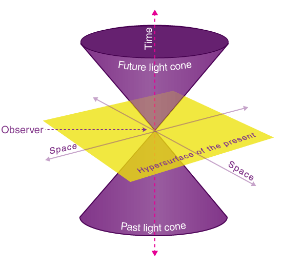
</div>

*Geometric representation of the Minkowski light cone in a three-axis diagram (two spatial axes plus the vertical time axis $t$). Each event in spacetime defines a past light cone (the region from which it can receive signals at speeds $\leq c$) and a future light cone (the region it can causally influence).*

The most direct way to see this emerge **in the simulator itself** is to observe what happens when a body suddenly appears or disappears: the information about its creation or destruction does not propagate instantaneously everywhere, but starts from the point of the event and spreads out as a spherical front (circular, in the 2D plane) that advances at $c$. Outside that front, space *does not yet know* that the event has occurred and continues to react to the past.

| Sudden causal death of a star | Sudden causal birth of a star |
|:---:|:---:|
| <BR><BR>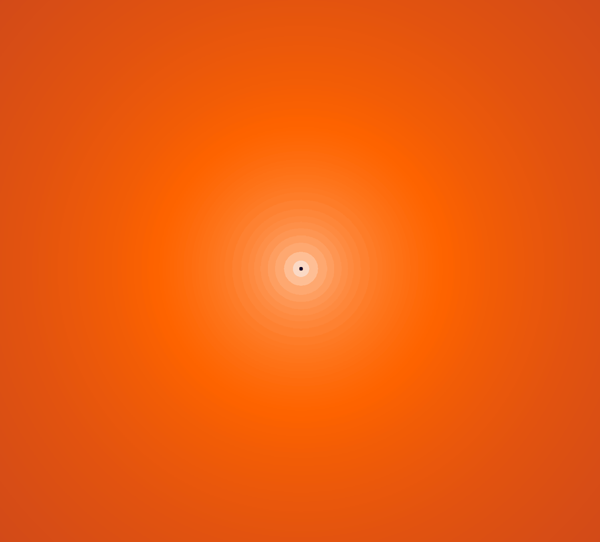 | 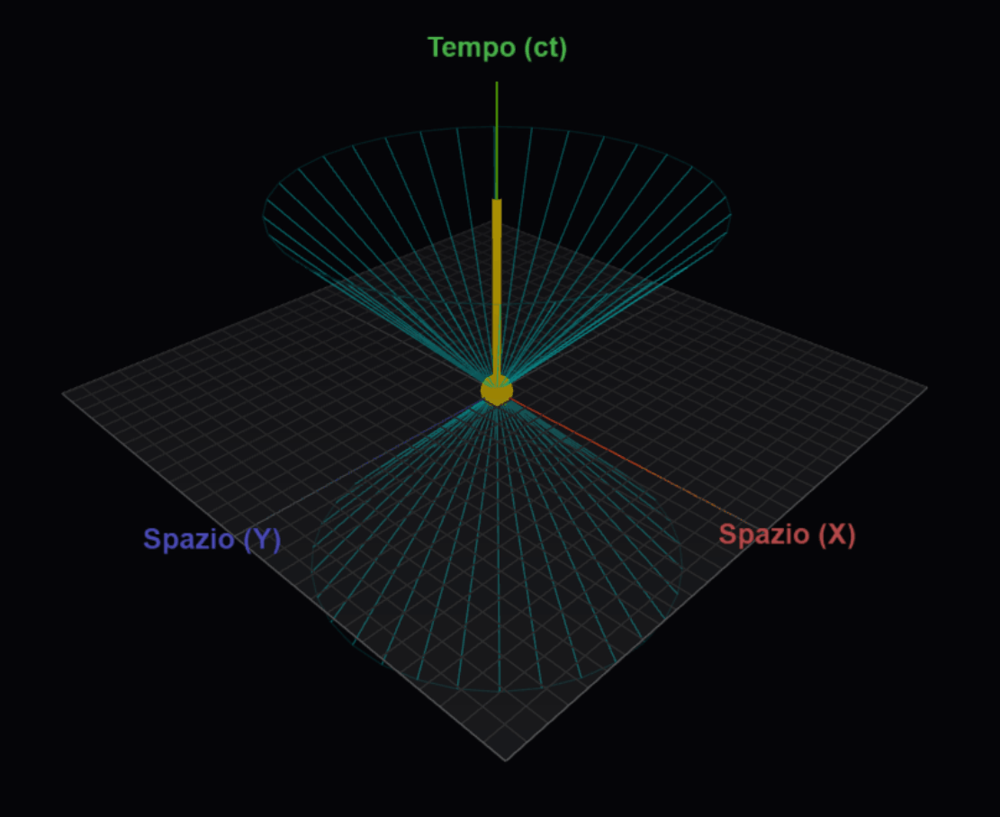<BR><BR> |
| **Above (Minkowski diagram)**: Time flows upward; when the star disappears, the future light cone is cut off at the event’s vertex.<br>**Below (2D Simulator)**: The field of the vanished star persists outside the causal front and collapses to zero only when the expansion circle of the “news” (traveling at speed $c$) reaches points in space. | **Above (Minkowski Diagram)**: The birth of a star opens the light cone toward the future starting from the event horizon.<BR>**Below (2D Simulator)**: The field of the new star is completely absent outside the causal front and turns on, propagating outward, only when the expanding circle of the birth event reaches it. |

*The scale of the two demonstrations is slightly different and is approximately 1 × 1 AU.*

*In both cases, the engine’s architecture reproduces the geometry of the light cones of a flat and regular $2+1\text{D}$ Minkowski spacetime, observed from a stationary global reference frame. A fair clarification: the engine’s time remains absolute and global, so the causal geometry coincides with that of Minkowski, but the dynamics do not possess Lorentz invariance. Each 2D screenshot from the simulator represents an **instantaneous spatial cross-section $(x,y)$ strictly orthogonal to the time axis $t$** (a slice at $t = \text{constant}$). The circular causal front visible in the heatmap of the potential $\Phi$ is precisely the intersection of the three-dimensional light cone $(x,y,t)$ with these orthogonal spatial planes, as it propagates at speed $c$.*


---

## 3. Causal Aberration, Dead Reckoning, and Relativistic Dynamics

Before delving into the details of aberration and dead reckoning, it is worth clarifying **how the engine actually recovers the retarded position** introduced in [§2](#2-causal-propagation-and-the-moment-of-emission). This is the foundation upon which the rest of the chapter rests.

**The Implicit Nature of Causal Delay.** To calculate the retarded gravitational force exerted by a source on an observer at the present time $t$, we must know the source’s position at the time of emission $t_{\text{ret}} = t - r(t_{\text{ret}})/c$. This relationship defines an implicitly coupled equation: the propagation distance $r(t_{\text{ret}}) = |\vec{x}_{\text{obs}}(t) - \vec{x}_{\text{src}}(t_{\text{ret}})|$ requires knowledge of the emission position $\vec{x}_{\text{src}}(t_{\text{ret}})$, which in turn depends on the retarded time of flight $r(t_{\text{ret}})/c$. In the general case of arbitrary trajectories (accelerated, curvilinear, or within $N$-body systems), this equation of intersection with the past light cone does not admit an analytical solution in closed form.

**The solution: store the history of each source.** Instead of solving the equation every frame, the engine **stores the past trajectory** of each body. At each simulation step, each body records its state (position, velocity, mass) in a **temporal archive stratified into three levels of detail**: the *fine* level records every step (recent past, high resolution), the *medium* level records one every 32 steps, and the *coarse* level records one every 256 steps. This stratification reproduces both the recent past in high resolution and the distant past with sparse samples. When an observer asks *“What was the state of the source at time $t_{ret}$?”*, the answer is a **single read from the history**, at a **constant** computational cost (independent of how far back in time one goes).

**Two-step retrieval.** For each causal interaction, the engine consults the history twice in sequence:

1. **Estimate.** The instantaneous distance $r_{now}$ between the observer and the source *as they currently stand* is measured, and an initial approximate time of flight $t_{est} = r_{now}/c$ is calculated. Converted into the corresponding number of simulation steps ($t_{est}/\Delta t$), this identifies a point in the history: a **first read** returns the **estimated retarded position** $\vec r_{ret,est}$.
2. **Causal recalculation.** From the estimated position, the true distance at the time of emission is calculated as $r_{true} = |\vec r_{obs} - \vec r_{ret,est}|$, and the calculation is repeated: $t_{true} = r_{true}/c$, yielding a new point in the history, the **second reading**. From this, we obtain the position, velocity, and mass at the *actual* emission instant, allowing the calculation of the force, potential, or quadrupole to proceed unambiguously.

Mathematically, this two-step process is equivalent to a single Picard iteration on the light-cone equation and, for ordinary orbits ($v \ll c$), converges immediately. For extreme regimes ( $v \to c$ ), [§5.1](#51-time-of-flight-for-sources-in-rectilinear-motion-closed-form-formula) provides the **analytic closed-form solution**, derived from a quadratic in time of flight, which the engine uses in place of the double reading in very specific cases.

**What’s covered here and what’s in the deep dive.** The above describes only the *what* and the *why*. All engineering details (internal structure of the three levels of detail, access optimizations, criteria for selecting the level based on the required temporal depth, memory sizing for extreme scenarios such as $0{,}999c$) are documented in **[ARCHITECTURE_DEEP_DIVE.md §2](ARCHITECTURE_DEEP_DIVE.md#2-the-ring-buffer-and-the-position-history)**.

**To summarize.** The retrieval returns the *retarded* position of the source. This is where the central problem arises: using that “back-in-time” position as a reference for the force introduces a **spurious aberration** that destabilizes the orbits, requiring a forward extrapolation (**dead reckoning**) to cancel it out.

### 3.1 The Problem of Aberration

If gravity points toward the **retarded** position of the source, in an orbit it systematically points “backward” relative to the true position. This introduces a small **tangential** force component that acts as a **fictitious torque**: it injects spurious angular momentum and tends to progressively widen the orbits, until they become unstable. This is a well-known artifact of discrete causal gravity taken literally.

### 3.2 Compensation: Hybrid Dead Reckoning

<TABLE width="100%">
  <TR>
    <TD valign="top" width="60%">
      <P><EM>Dead reckoning</EM> is the method by which a navigator estimates the current position of an object based on its last known position, plus its speed and the elapsed time, without seeing it directly. Here, it performs the equivalent for gravity: it estimates where the source <em>is now</em> based on where <em>it was</em> at the moment of emission. It also has a direct physical counterpart: in electrodynamics and linearized gravity, the velocity terms of the field cause the force from a source in <STRONG>uniform motion</STRONG> to point toward its <EM>current</EM> position, not toward the emission position (the aberration cancels out). The engine’s dead reckoning numerically reproduces precisely this cancellation.</P>
      <P>The engine does not use the raw emission position, but <STRONG>extrapolates it forward</STRONG> to the present instant, thereby reducing the aberration. Taylor expansion of the source position with respect to the time of flight $\Delta t_{flight}$:</P>
      <ul>
        <li><strong>2nd order (ordinary regime):</strong>
          $$\vec{x}_{eff} = \vec{x}_{ret} + \vec{v}_{ret}\,\Delta t_{flight} + \tfrac{1}{2}\vec{a}_{ret}\,\Delta t_{flight}^2$$
        </li>
        <li><strong>Bypass in the GW regime (near merger):</strong> in the extreme relativistic regime, linear extrapolation is no longer sufficient and leaves a periodic radial error that results in spurious eccentricity. The engine then <strong>completely abandons dead reckoning</strong> and uses the <strong>exact current position</strong> of the source, for both direction and distance, thereby resetting that residual aberration to zero at the origin (engineering detail in <a href="ARCHITECTURE_DEEP_DIVE.md">ARCHITECTURE_DEEP_DIVE.md</a>, [§2](#2-causal-propagation-and-the-moment-of-emission)).</li>
      </ul>
      <p>The historical acceleration $\vec{a}_{ret}$ is not stored: it is reconstructed on the fly using <strong>finite differences</strong> between consecutive velocities.</p>
    </td>
    <td valign="top" align="center" width="40%">
      
    </td>
  </tr>
</table>

**Showcase: Galactic Orbit (Sgr A\*) (in the GIF above on the right)**: Camera field of view approximately 22x10 AU, simulation speed: 35 days/second. The view on the right shows the parameters of the highlighted body, the Sun, with the neon-green velocity vector and the purple force vector pointing toward Sgr A\* light-years away, in an orbit at ≈ 230 km/s that remains stable over the long term. Without Dead Reckoning, the aberration would cause it to spiral outward.


### 3.3 The Balance Between Braking and Thrust

When the relativistic radar detects a pair in extreme conditions, the engine injects the actual 2.5PN reaction ([§6.3](#63-how-the-25pn-is-used-in-the-simulator)) as a physical brake that causes the orbit to decay. Today this happens smoothly, but getting there required a long fine-tuning process, described in full (with graphs) in [§6.5](#65-the-history-from-m_chirp_mult-to-the-real-25pn). In summary, the three factors that keep the orbit stable and low in eccentricity are:

- **second-order dead reckoning** outside the extreme relativistic regime, which cancels out the aberration in ordinary orbits;
- the **bypass at current positions** within the extreme relativistic regime ([§3.2](#32-compensation-hybrid-dead-reckoning)), which removes the residual aberration precisely where linear extrapolation left it;
- the **real 2.5PN reaction** ([§6.3](#63-how-the-25pn-is-used-in-the-simulator)), which dissipates orbital energy without any calibration coefficient.

**Author’s note. A hypothesis on why dead reckoning can slow down certain extreme orbits (and an open question regarding EMRI).** Second-order dead reckoning truncates the accelerating term: the first component it discards is the **jerk** (the third derivative of position). Two clues suggest that this residual is not merely numerical noise. First: the 2.5PN radiation reaction also enters the equations of motion at the jerk order (it is a force that depends on the time derivatives of acceleration). Second clue, this one from established physics: the aberration of a source in *uniform* motion cancels out almost exactly due to the velocity terms of the field. The term that resists this cancellation, of the order of $(v/c)^5$, is precisely the radiation reaction (S. Carlip, *Aberration and the speed of gravity*, [arXiv:gr-qc/9909087](https://arxiv.org/abs/gr-qc/9909087)). Hence the hypothesis that the dead reckoning residual, when the acceleration varies nonlinearly, *may* fall into the same category as energy loss due to radiation. This is a well-founded suspicion, not a proof.

It should be noted where the analogy becomes fragile. Numerically speaking, that residual is **also** a truncation error (whose cost is formulated in [§4.2](#42-truncation-error)), the exact magnitude of which is difficult to estimate other than that it scales with $\Delta t$. Added to this is the acceleration $\vec{a}_{ret}$ used in the extrapolation, which is not exact but reconstructed on the fly using finite differences ([§3.2](#32-compensation-hybrid-dead-reckoning)), and is therefore itself an approximation. In both cases, the magnitude of the relative error depends on the chosen time step $\Delta t$. The analogy, even if it captured some reality, would be only a raw approximation here, of the correct order (jerk) but of uncontrolled magnitude. The empirical data: at negligible $\Delta t$ values (1 microsecond) in GW contexts (scenarios where gravitational wave emission is expected), leaving the 2.5PN **turned off** and only the 2nd-order dead reckoning **turned on**, the orbit dissipates energy too quickly compared to the actual 2.5PN, but the very fact that it dissipates energy undoubtedly demonstrates that it plays a comparable role in practice. It was thus discovered that, in that regime, on its own it “slows down too much.” This is precisely why, in the GW regime, dead reckoning is turned off and replaced by the bypass using current positions ([§3.2](#32-compensation-hybrid-dead-reckoning)). It therefore remains a **hypothesis**: a plausible structural analogy, not a quantitative replacement for the 2.5PN.

**The natural test bed: the EMRI.** The scenario that brings this hypothesis into sharp focus is the **EMRI** (*Extreme Mass Ratio Inspiral*): In the preset, a 10-solar-mass black hole is launched into an extremely eccentric orbit ( $e \approx 0.98$ ) around a 1,000-solar-mass companion (ratio 100:1), with an apocenter at 0.1 AU and a pericenter around 165,000 km. The threshold analysis explains how little the explicit brake works here. The 2.5PN gate requires $v_{rel} > 0.1c$ at close range ([§6.3](#63-how-the-25pn-is-used-in-the-simulator)): on this orbit, the condition is triggered only within a window of about twenty seconds around each passage through the pericenter (where $v_{rel} \approx 0.13c$), over an orbital period of approximately three hours. For over 99% of the time, the 2.5PN is therefore off, and the pair is governed solely by second-order dead reckoning. The Paczyński-Wiita potential, for its part, cannot explain the *contraction* of the orbit: it is a conservative potential and does not dissipate energy. At pericenter (at ~55 $R_s$ from the horizon), however, its correction of a few percentage points to the force generates the striking **apsidal precession** of a few degrees per orbit. That is expected physics, the analog of relativistic perihelion advance. The slow decay of the orbit, on the other hand, can only come from the brief 2.5PN flashes at pericenter and/or from the residual dead reckoning acting on the rest of the orbit: the relative contributions of each of these two mechanisms is precisely the observation that would warrant expert verification.

| Rosetta: inspiral | Rosetta: late inspiral |
|:---:|:---:|
|  |  |
| Scale ≈ 7M × 4M km · 5 min/s · the purple BH is 100× the size of the green one · ~6 days from the first orbit, ~7 days until merge | Scale 1.2M × 825,000 km · late inspiral · 13 days and 7 hours, ~4 hours until merge |

**Showcase: EMRI / rosette orbit**: the example just described, captured in real time. The trail of the lighter body draws a **rosette**: the orbit precesses (it does not close) due to the Paczyński-Wiita apsidal precession seen above, and at the same time it tightens (slowly in the first few days (GIF on the left), then increasingly rapidly toward the merger (on the right)) as the 2.5PN flashes at the pericenter become denser and the dead reckoning residual works on an increasingly shorter orbit.

### 3.4 Relativistic Compression of Acceleration

To prevent superluminal escape, the net acceleration of a body is damped as its velocity increases. Below the threshold $v^2 = 0.5c^2$ (≈ 0.707 c), nothing changes. Above this threshold, the acceleration is multiplied by the inverse Lorentz factor $\sqrt{1 - v^2/c^2}$, which suppresses it more and more as $v \to c$: reaching $c$ becomes **gradually impossible**, exactly as with the relativistic increase in inertia (it would require an increasingly divergent amount of energy). Beyond the threshold $v^2 = 0{,}999\,c^2$ (approximately $0{,}9995c$), the acceleration is completely zero. This is a phenomenological limit, not a derivation from General Relativity, but it reproduces the correct behavior: $c$ remains an unreachable asymptote.

**Why a threshold and not a constantly active factor?** It is an emergency brake, not a general relativistic correction (which, incidentally, would require distinguishing between longitudinal and transverse mass, both of which are ignored here): it remains inactive until the risk of exceeding $c$ is real, without the need for exceptions or hardcoded limits elsewhere. ART scenarios, for example, bypass it only because their artificial thrust is added *after* this block.

> The “Approach to c” scenario in [§5.3](#53-showcase-approach-to-c) exploits precisely the bypass just described: the artificial “ART” engine deliberately ignores this brake and propels the Sun beyond $c$, a technical limit case that is explicitly impossible, not a physical result.

---

## 4. Numerical Methods: Velocity Verlet, Truncation Error, and DT

### 4.1 The integration scheme

The dynamics are integrated using the **Velocity Verlet** method, a second-order simplistic integrator chosen for its excellent long-term energy conservation. At each step:

1. half a velocity step: $\vec{v}(t+\tfrac{\Delta t}{2}) = \vec{v}(t) + \tfrac{1}{2}\vec{a}(t)\,\Delta t$
2. position drift: $\vec{x}(t+\Delta t) = \vec{x}(t) + \vec{v}(t+\tfrac{\Delta t}{2})\,\Delta t$
3. causal calculation of the new accelerations $\vec{a}(t+\Delta t)$
4. Second-half calculation: $\vec{v}(t+\Delta t) = \vec{v}(t+\tfrac{\Delta t}{2}) + \tfrac{1}{2}\vec{a}(t+\Delta t)\,\Delta t$

### 4.2 Truncation error

Expanding the position in a Taylor series:

$$\vec{x}(t+\Delta t) = \vec{x} + \vec{v}\,\Delta t + \tfrac{1}{2}\vec{a}\,\Delta t^2 + \tfrac{1}{6}\dot{\vec{a}}\,\Delta t^3 + \tfrac{1}{24}\ddot{\vec{a}}\,\\Delta t^4 + \dots$$

The Verlet scheme is **time-symmetric** (invariant for $\Delta t \to -\Delta t$). This symmetry causes **the odd-order term of $\Delta t^3$ to cancel out**, leaving a term $\propto \Delta t^4$ as the first local error in position:

$$\varepsilon_{\text{local}} \approx \frac{\Delta t^4}{12}\,\frac{d^4 \vec{x}}{dt^4}$$

The accumulated **global** error, on the other hand, is $O(\Delta t^2)$ (second-order method). The practical consequence is that the orbital energy does not drift steadily but **oscillates within a limited range**, which is why Keplerian orbits remain stable for millions of steps.

A possible future implementation could involve a detailed analysis of the calculation of orbital drift due to truncation error based on the number of steps performed in the last second and $\Delta t$.

### 4.3 DT, Nyquist-Shannon, and the Emergence of the Chirp

> [!NOTE]
> In signal processing, a **chirp** is a wave whose frequency increases (or decreases) over time. In compact binary systems, gravitational attraction causes the two bodies to spiral toward each other (*inspiral*), accelerating their orbit. This produces a signal with rapidly increasing frequency and amplitude, similar to an acoustic “chirp.”

The time step $\Delta t$ does not only govern the precision of the integration. In scenarios where two compact bodies spiral toward each other until they merge (the *inspiral* and *merger* simulations, such as GW170817, which [§6](#6-extreme-gravity-paczyński-wiita-25pn-and-chirp-mass) will discuss in detail) **also** plays a second, equally decisive role: it determines the **sampling frequency** at which the simulator’s virtual probe (the **LIGO analyzer**, discussed in detail in [§8](#8-the-ligovirgo-analyzer-from-kinematic-proxy-to-spectrum)) records the gravitational signal,

$$f_s = \frac{1}{\Delta t}$$

and it is this frequency that determines whether the chirp will *emerge* from the spectrogram or be lost in the noise. According to the **Nyquist-Shannon sampling theorem**, to reconstruct a signal with a maximum frequency $f_{max}$ without aliasing, the following condition must be met:

$$f_s > 2\,f_{max}$$

In neutron star mergers (e.g., GW170817), the frequency of the analogous wave (which is **twice** that of the orbital frequency) reaches $\sim 1\text{–}2\ \text{kHz}$ shortly before contact. To capture it clearly, $f_s > 4\ \text{kHz}$ is required, i.e., $\Delta t < 2.5 \times 10^{-4}\ \text{s}$. The simulator uses $\Delta t = 1\ \mu\text{s}$ ( $f_s = 1\ \text{MHz}$ ), which is a huge margin: **this is what allows the chirp to emerge** in the spectrogram instead of collapsing into aliasing noise. In other words, if $\Delta t$ were too large, the physical event would still occur, but it would not be **observable**: the probe would not have enough samples to reconstruct the final frequency ramp.
 

> **Methodological note.** The formal connection to the Nyquist-Shannon theorem was analyzed retrospectively, during the theoretical formalization of the spectrogram. In practice, during the simulation, the numerical integration of the orbits (governed by the local truncation error, which scales quadratically with the time step) already imposes extremely severe stability constraints, forcing a much denser sampling rate than is strictly required to avoid signal aliasing. If the user manually increases $dt$ in real time, the physical breakdown of the orbit due to numerical instability will occur long before the aliasing effects described above. The Nyquist-Shannon theorem remains, however, the theoretical tool of choice for formally validating the cleanliness of the reconstructed strain and for defining the physical limits of observability of the chirp ramp.

### 4.4 A Note on the LOD of Buffers

History buffers with decreasing resolution (L0/L1/L2; see the deep dive for details) would introduce a sampling error that increases with temporal depth. But there is a physical trade-off: the position error of an L2 sample (one every $256\,\Delta t$) is at most of the order of $v \cdot 256\,\Delta t$, a value that **does not increase with distance**; the gravitational contribution of the source, on the other hand, **decays as $1/r^2$**. The *relative* error in the force ( $\sim v \cdot 256\,\Delta t / r$ ) therefore decreases precisely where sampling is sparsest: coarse resolution is used exactly where it matters least. Furthermore, as DT increases, the distance at which the sampling scaling is applied also increases proportionally. For further details, see [ARCHITECTURE_DEEP_DIVE.md](ARCHITECTURE_DEEP_DIVE.md).

---

## 5. Liénard-Wiechert Deformation

This chapter covers the regime of sources moving at a substantial fraction of $c$: first, the formal tool that makes it possible to calculate the delay in that regime (the time of flight in closed form); second, the resulting field deformation; and finally, the dedicated showcase.

### 5.1 Time of Flight for Sources in Rectilinear Motion, Closed-Form Formula

A clarification: the complete equation in this section is useful **only** in an extreme case (the “Approach to the Speed of Light” scenarios) where artificial acceleration (ART) deliberately propels a body beyond the causal limit to make the effect visible; that is, it *deliberately breaks the laws of physics*. And it is a **formal and geometric** calculation (the intersection with the light cone from [§2.1](#21-the-light-cone-and-the-minkowski-diagram)): it determines *where* the signal originated. It is also the point where this approach differs from the general mechanism described in [§2](#2-causal-propagation-and-the-moment-of-emission): there, the time of flight is *read* from the history (the double causal retrieval); here, it is *calculated* in closed form, a luxury afforded only by rectilinear motion.

Here there is a distinction in the framework. For a body moving at a **tiny** fraction of $c$, the gravitational “signal” originates from a position practically identical to its current one: the source can be treated as **stationary**, and the delay is simply $r/c$, with a completely negligible error. This is the case for almost all ordinary dynamics (planets, stars).

When, on the other hand, the fraction of $c$ becomes **substantial**, that approximation no longer holds: the position from which the signal originated is not its current position, and we must solve for the time of flight $T$ using the equation that requires light to travel exactly the distance from the emission position. With $\vec{d} = \vec{r}_{target} - \vec{r}_{source}$ and linear extrapolation of the source backward:

$$|\vec{d} + \vec{v}\,T|^2 = c^2 T^2 \;\Longrightarrow\; (c^2 - v^2)\,T^2 - 2(\vec{d}\cdot\vec{v})\,T - d^2 = 0$$

This is a quadratic equation in $T$. The (reduced) discriminant is $\Delta = (\vec{d}\cdot\vec{v})^2 + (c^2 - v^2)\,d^2$, and the physical root is

$$T = \frac{(\vec{d}\cdot\vec{v}) + \sqrt{\Delta}}{c^2 - v^2}$$

This is the **explicit formula**, valid only for rectilinear motion with known acceleration (the ART case): this is why it can be solved analytically, rather than resorting to the historical method. In the general case, where no analytical solution exists (curvilinear motion, N bodies, variable accelerations), the engine instead resorts to the **implicit architectural solution**, the double causal retrieval from history buffers described at the beginning of [§3](#3-causal-aberration-dead-reckoning-and-relativistic-dynamics).

> [!NOTE]
> **The causal cone.** If $\Delta < 0$, no real solution exists: the source is “escaping” from its own field faster than the field can reach the target. The target is outside the reachable past light cone, and the engine yields a zero contribution. Geometrically, this is what happens when the source **“pierces” its own light cone**: it overtakes the wavefront it is itself emitting, just as a supersonic aircraft overtakes the sound wavefront it generates. It is the gravitational analogue of the supersonic Mach cone. This is a **mathematically absurd** situation from a physical standpoint (it requires a source faster than light, which is impossible) and, in fact, is **deliberately enforced** only in the “Approaching the Speed of Light” scenarios: the full version (~20 GB of RAM) at $0{,}999c$ and the two reduced versions at $0.9c$ and $0.7c$, where a constant artificial acceleration pushes the Sun beyond the causal limit to make the effect visible (the “void” that opens up behind the body).

*(The field distortion produced by these extreme regimes is the subject of the rest of this chapter.)*

### 5.2 The Liénard-Wiechert denominator and the Lorentz contraction

For rapidly moving sources (above about half the speed of light), the potential inherits the **Liénard-Wiechert denominator** from classical electrodynamics, which concentrates the field orthogonally to the direction of motion:

$$\Phi = -\frac{GM}{r\left(1 - \dfrac{\vec{v}\cdot\hat{n}}{c}\right)}$$

where $\hat{n}$ is the source→observer unit vector. When $\vec{v}\cdot\hat{n} \to c$ (the source is approaching at nearly the speed of light), the denominator tends to zero, and the field **compresses and intensifies** transversely to the motion, exactly like the electric field of a relativistic charge. This is the gravitational analogue of the contraction of the Coulomb field and is the point at which the model draws on the GEM (*gravitational electromagnetism*) analogy.

The physical mechanism is the **Lorentz contraction** of the field: the field of a moving source flattens into a disk transverse to the velocity, compressed along the direction of motion and intensified orthogonally by a factor of $\gamma = 1/\sqrt{1 - v^2/c^2}$ (the same result obtained by transforming the static Coulomb field into the moving reference frame). The denominator $(1 - \vec{v}\cdot\hat{n}/c)$ is the form in which this contraction enters the potential.

> [!NOTE]
> **Who actually sees this deformation? (Stationary Observer vs. Traveler)**
> It is crucial to emphasize an essential physical distinction: the so-called “pancake” compression of the field **is not experienced by the traveler**, but is what **the stationary observer** (the simulator grid’s reference frame) measures. In the reference frame of the moving star (the “traveler”), the star is at rest and its gravitational potential remains perfectly spherical, isotropic, and undeformed. It is only when measured from the stationary observer’s reference frame (relative to which the star is traveling at a speed $v \to c$) that the retarded amplitudes and times of flight combine via Lorentz transformations, bringing out the transverse “pancake” effect visible on the screen.


### 5.3 Showcase: Approach to *c*

The isolines of the Sun’s potential well compress along the direction of motion and expand in the transverse direction: this is the same Liénard-Wiechert and Lorentz “pancake” compression described above ([§5.2](#52-the-liénard-wiechert-denominator-and-the-lorentz-contraction)), seen here from above on the contour lines rather than on the field profile.

**How to read the heatmap of the gravitational potential Φ (“phi”).** The color maps the depth of the gravitational well point by point: deep blue/black means “minimum or absent potential,” while bright yellow means “deep well.” The scale is always calibrated to the minimum effective radius of the most massive body in the scenario, adjusted by the fictitious cinematic floor `eff_rad` to prevent the dynamics from becoming unmanageable in compact bodies. *Pure white* therefore appears just beyond this geometric saturation distance, a value of $\Phi$ close to the theoretical maximum:

$$\Phi_{\text{limit}} = -\tfrac{1}{2}c^2 \approx -4{,}49377 \times 10^{10}\ \text{km}^2/\text{s}^2$$

(the condition $v_{\text{escape}} = c$, i.e., $\sqrt{-2\Phi} = c$).

---

**Example 1: Approach to c (ART), $0.7c \to c$.**
The Sun is propelled by a constant artificial acceleration (ART) from $0.7c$ until it exceeds $c$. This is an admittedly impossible *what-if* scenario (it would require infinite energy, see section [§3.4](#34-relativistic-compression-of-acceleration)), used to *make visible* the deformation of the field at extreme speeds.

Direction of motion in the following demonstration: +x, i.e., from left to right.

<div align="center"></div>

The frame of reference is approximately **180 × 120 AU** (tens of billions of km per side). At $0.7c$ (≈ 209,855 km/s), the **Liénard-Wiechert** effect is already visible: the gravitational well begins to deform relative to spherical symmetry. As the speed approaches $c$ (299,792.458 km/s), the flattening increases nonlinearly, until (hypothetically, beyond $c$) the **causal Mach cone** described in [§5.1](#51-time-of-flight-for-sources-in-rectilinear-motion-closed-form-formula) begins to form.

<div align="center">
  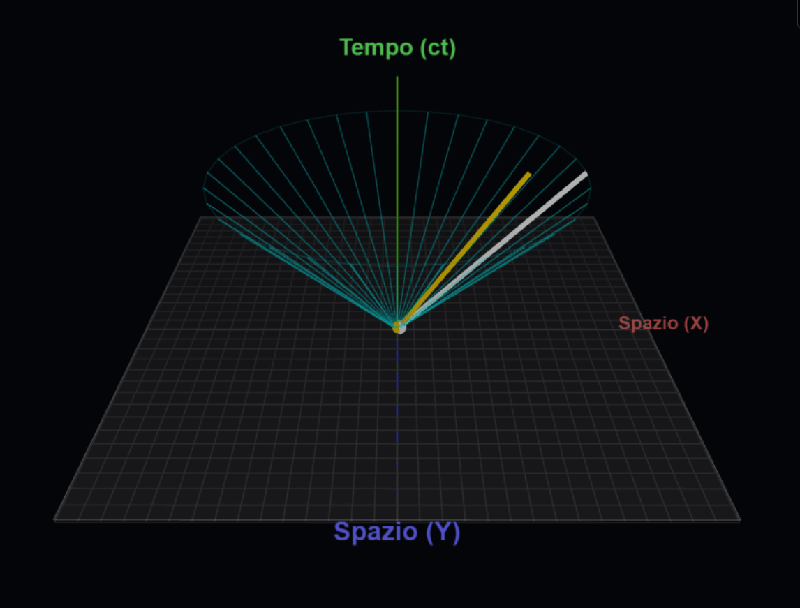
</div>

*Representation in the Minkowski diagram of motion at $0.7c$. In the stationary reference frame of the simulator/observer, the worldline of the star traveling at $0.7c$ slopes steeply toward the edge of the light cone (the $45^\circ$ diagonal traced by the photon traveling at speed $c$). This is the same observer/traveler distinction as in the note in [§5.2](#52-the-liénard-wiechert-denominator-and-the-lorentz-contraction): the tilt belongs to the external perspective, not to that of the star.*

A detail that will come up again shortly: to the right of the Sun (in the direction of motion), the field changes character asymmetrically compared to the left; at $0.98c$, this becomes qualitatively evident. It is the prelude to the phenomenon seen in full in Example 2.

---

**Example 2: Approach to c (SRT), $0{,}999c \to c$.**
The same scenario, but zoomed in and much slower, to capture the asymptotic moments before the causal limit.

<div align="center">
    <video src="https://github.com/user-attachments/assets/3108742d-2672-485b-b4bb-3fc399b40511" controls="controls" width="100%"></video>
</div>

The field of view here is **~0.8 × 0.3 AU**. At $0{,}999c$ (≈ 299,493 km/s), the Sun is literally **riding the front of the information it has itself emitted**: its position and its gravitational wavefronts travel at virtually identical speeds.

#### The phenomenon: the emission gap between “where it is” and “where it was”

This is the point where the boundary of the **light cone from [§2.1](#21-the-light-cone-and-the-minkowski-diagram)** is visible to the naked eye: the heatmap literally shows how close one is to its edge. The closer a pixel is to the front of the cone (i.e., the closer its causal distance from the Sun is to the distance the light has traveled), the more the field it displays corresponds to a Sun that is now far removed in emission time and therefore faint or absent.

The yellow dot is the Sun *now*, at its actual position. The sharp vertical cut in the center (that is, the compressed white line separating the orange well on the left from the purple void on the right) is the **Liénard-Wiechert + Lorentz disk at its maximum**: the Sun’s field is compressed into a disk *perpendicular* to its motion, exactly like a relativistic charge ([§5](#5-liénard-wiechert-deformation)).

**Because it’s “dark” on the right.** Each pixel in the heatmap does not see the Sun *where it is now*, but *where it was when it emitted the signal that is arriving right now*, the causal principle described in [§2.1](#21-the-light-cone-and-the-minkowski-diagram). For a pixel in front of the Sun (on the right), the Sun is rushing toward it at $0{,}999c$. To “reach” that pixel now, the signal must have departed from much, much farther back:

$$r_{ret} \approx \frac{d}{1 - v/c}, \qquad \text{at } v = 0{,}999c \;\Rightarrow\; r_{ret} \approx 1000\,d$$

In other words: for a pixel a few million km to the right, the emission arriving *now* was emitted when the Sun was **billions of km further to the left**, as far back as *320 light-years in the past* in this scenario. At that distance, the Sun’s gravitational well is already negligible ( $\Phi \propto 1/r$ ). The pixel appears **dark, almost black**: not because there is no gravity there, but because it is showing a Sun that, from *where it was back then*, had no gravitational effect here.

The **gap between the current position and the emission position** is the key. At $0.7c$, the gap is ~3.3 times the current distance, and the asymmetry is barely visible. At $0{,}999c$, it is 1,000 times the current distance, and the “darkness” in front is almost perfect. At $v = c$, the ratio diverges, and the simulator returns a zero contribution on the right. Then, when $v > c$, the discriminant of the time of flight equation changes sign, and we enter the fictitious regime of the **causal Mach cone** described in [§5.1](#51-time-of-flight-for-sources-in-rectilinear-motion-closed-form-formula).

In other words, what we see is not a “lack of gravity” in front of the Sun; it is *its past* on a scaled-up scale: the closer $v$ gets to $c$, the farther away the visible past is. The vertical cut is the Liénard-Wiechert and Lorentz signature at its peak, and the darkness on the right is the causal principle from [§2.1](#21-the-light-cone-and-the-minkowski-diagram) made literally visible.

The engineering details (including how it was possible to render emission buffers over 300 light-years long in real time and why the “full” scenario at $0{,}999c$ requires ~20 GB of RAM) are in [ARCHITECTURE_DEEP_DIVE.md](ARCHITECTURE_DEEP_DIVE.md).

> [!NOTE]
> **On the physical plausibility of the scenario and its engineering value.**
> The application of the Liénard-Wiechert denominator to the gravitational field is an extrapolation from the GEM (gravitational electromagnetism) analogy, not a derivation from general relativity. The analogy *might* be qualitatively consistent with reality, or it might be incorrect in ways not yet apparent: to the author’s knowledge, there is no equivalent treatment in the literature. Known visualizations of the relativistic gravitational regime concern the trajectory of photons (lensing, black hole shadows) or the geometry of spacetime, not the heatmap of the scalar potential of a source moving at near-light speeds. This scenario stems from honest scientific curiosity: *what would happen to the gravitational field if we treated it like the Coulomb field of a moving charge?* The visual response (the Liénard-Wiechert disk, the emission gap, the causal Mach cone) is what the simulator produces, without any claim to relativistic correctness.
>
> The author remains open to any counterarguments, contradictions, corrections, and suggestions from those with specific expertise in general relativity or gravitoelectromagnetism.
>
> Regardless of its physical validity, the scenario has concrete engineering value: forcing causal propagation to $0{,}999c$ represents the **extreme limit case** for the architecture of history buffers with $O(1)$ lookup and a three-level LOD system, described in [§2 of ARCHITECTURE_DEEP_DIVE.md](ARCHITECTURE_DEEP_DIVE.md).
>
> One final observation: in the specific case of constant ART acceleration and rectilinear motion, the retarded time admits a closed-form analytical solution (the retarded time equation reduces to a quadratic in $t_{ret}$), so history buffers would not be strictly necessary for *this* scenario. The engine uses them anyway because the goal is to push the general causal pipeline to its limits: depths of hundreds of light-years, LOD cascading across all three levels, ~20 GB of RAM (extreme scenario), and numerical stability as $(1 - \vec{v}\cdot\hat{n}/c) \to 0$. No other scenario in the simulator pushes these conditions to such extremes. In addition, the general buffer-based pipeline works **without modification even if a complex motion were forced in the future** (curvilinear, with variable acceleration, with N-body interaction): the analytical shortcut would cease to exist, but the buffer architecture would continue to function unchanged.


---

## 6. Extreme Gravity: Paczyński-Wiita, 2.5PN, and chirp mass

### 6.1 The Paczyński-Wiita pseudo-potential

For black holes, Newtonian gravity is replaced by the **Paczyński-Wiita pseudo-potential**, which reproduces two key characteristics of the Schwarzschild metric on a flat background:

$$V_{PW}(r) = -\frac{GM}{r - R_s}, \qquad R_s = \frac{2GM}{c^2}$$

$R_s$ is the **Schwarzschild radius**, that is, the radius of the **event horizon** (the distance from the center beyond which not even light can escape), and it is equal to $2GM/c^2$. The PW potential reproduces two distinct behaviors:
- **as $r \to R_s$, it diverges** ( $V_{PW} \to -\infty$ ): the horizon becomes an infinite barrier, and it is *there* that the formula diverges numerically. It is this divergence that, for a finite DT, injects immense spurious energy if a body approaches it too closely ([§3 of ARCHITECTURE_DEEP_DIVE.md](ARCHITECTURE_DEEP_DIVE.md#5-collisions-black-holes-and-singularities));
- **At $r = 3R_s$, the ISCO** (the last stable circular orbit) is located. This is not a divergence but a dynamic property of the effective potential, which PW sets exactly to the correct relativistic value $3R_s = 6GM/c^2$.

This is why PW is the “economical” standard for dynamics around black holes: it gives the correct event horizon and ISCO without solving for the metric.

**A note on “softening” (and how it became a stabilizer without intending to).** Softening is a small modification to the calculation of the distance used by the force: instead of $r$, the kernel uses $d = \sqrt{r^2 + S_{soft}^2}$, with $S_{soft} = 10$ km. In practice: for distant pairs, $r$ and $d$ are identical (at 1000 km, they differ by only $5\cdot10^{-5}$, or 0.05 km out of 1000), but when $r$ drops below about 10 km, the distance never falls below $S_{soft}$. That’s all there is to it.

*Why it exists.* Softening was introduced **before the collision system**, when the only way to avoid NaNs (Not a Number, which causes the engine to error out) was to prevent the denominator $(d - R_s)^2$ of the PW potential from going through zero (to prevent negative values, on the other hand, a single line of simple code was sufficient). All it took was for two bodies to end up inside their Schwarzschild radius for an instant for the force to become infinite, the energy to explode, and the entire tensor to go to `inf` in a single tick. Softening was the first safeguard and a workaround against division by zero, nothing more ambitious than that. Today, the collision system ([§3 of ARCHITECTURE_DEEP_DIVE.md](ARCHITECTURE_DEEP_DIVE.md#5-collisions-black-holes-and-singularities)) handles contact cleanly, and in principle, the softening could be removed.

*The side effect.* In stress tests on GW170817, turning it off makes the last milliseconds of the chirp noisy. Hypothesis: at 30–40 km, the force is so steep that within a single Verlet tick, it kicks from an already stale position, generating spurious eccentricity; softening flattens that slope and dampens the error. Keeping it on does not hide the true physics: the radiation reaction *circularizes* the orbits (Peters 1964, [§6.4](#64-chirp-mass-and-peters-formula)), so an eccentricity that increases toward the merger must be spurious. Originally designed as a stopgap for NaN, it ended up also serving as a stabilizer in a case that was not anticipated.

### 6.2 What Are Post-Newtonian Orders and 2.5PN

The **post-Newtonian (PN)** expansion develops relativistic dynamics as powers of $(v/c)$ around Newtonian gravity. A term of order $n$ PN is suppressed by a factor of $(v/c)^{2n}$ relative to the Newtonian term. The **integer** orders (1PN, 2PN, …) are *conservative*: they correct the shape of the orbits (for example, the precession of the perihelion) without removing energy. The **odd half-integer** orders, on the other hand, are *dissipative*, because they break time symmetry.

The **2.5PN** (suppressed by $(v/c)^5$, hence the signature $1/c^5$) is the **first dissipative term**: it describes the **radiation reaction**, that is, the energy that the pair loses by radiating gravitational waves, causing its orbit to decay. In its rigorous form (the Burke-Thorne reaction), it is an acceleration $\propto G^2/c^5$ related to the **third derivative** of the mass quadrupole moment.

The official source I drew upon is the review by **L. Blanchet**, *Gravitational Radiation from Post-Newtonian Sources and Inspiralling Compact Binaries*, [*Living Reviews in Relativity*, 2014](https://link.springer.com/article/10.12942/lrr-2014-2), in which the 2.5PN term is identified as the first **non-conservative** effect of the expansion, that is, the first appearance of the radiation reaction.

What the simulator implements is precisely this radiation reaction, in the **Damour-Deruelle** form (the specialization of the 2.5PN to the two-point-mass problem, equivalent to Burke-Thorne in that context), described below.

### 6.3 How the 2.5PN Is Used in the Simulator

The current version of the engine implements the 2.5PN radiation reaction in its **real relativistic form** (Damour-Deruelle), no longer as phenomenological friction. The relative acceleration of the pair is:

$$\vec{a}_{rel} = \frac{8}{5}\frac{G^2 M \mu}{c^5 r^3}\Big[\dot{r}\big(18v^2 + \tfrac{2}{3}\tfrac{GM}{r} - 25\dot{r}^2\big)\hat{n} - \big(6v^2 - 2\tfrac{GM}{r} - 15\dot{r}^2\big)\vec{v}\Big]$$

where $M = m_1 + m_2$ is the total mass, $\mu = m_1 m_2/M$ is the reduced mass, $\vec{v}$ is the relative velocity, and $\dot{r}$ is its radial component. The engine constructs them as follows:
- **Separation unit vector $\hat{n}$**: from the Cartesian coordinates of the pair, $\vec{r}=(x_1-x_2,\,y_1-y_2)$, modulus $r=|\vec{r}|$, normalized component by component ($n_x = \Delta x / r$, $n_y = \Delta y / r$).
- **Radial component $\dot r$**: scalar projection $\dot{r}=\vec{v}\cdot\hat{n} = v_x n_x + v_y n_y$, positive when moving away, negative when moving toward.

The formula retains the $1/c^5$ sign of the dissipative term, but compared to the old draft ([§6.5](#65-the-history-from-m_chirp_mult-to-the-real-25pn)), it uses the **real product of the two masses** inside $\mu$, so it remains correct even for extreme mass ratios and not just for nearly symmetric binaries.

The acceleration is then **distributed between the two bodies based on their mass contributions** ($m_{src}/M$): the lighter body receives the greater thrust, exactly as required by the conservation of linear momentum. It is this correct distribution that eliminated the oscillation of the center of mass that plagued the first version, where the square of the mass unbalanced the force.

This term comes into play only when the **relative velocity of the pair** exceeds 10% of $c$ and at close range (it acts as a *local* brake on the merger). The criterion is based on relative velocity, not on the velocity of a single body, for a specific reason: at the center of mass, the velocities of the two components are always antiparallel ($|\vec v_{rel}| = |\vec v_A| + |\vec v_B|$), so for equal masses, this corresponds to 5% of $c$ per body, but it remains valid even for asymmetric pairs, where the heavier component moves slowly and a per-body criterion would leave the lighter component unchecked for almost the entire inspiral. The flaw emerged precisely in this way, in the first scenario with an extreme mass ratio: the complete case study is in [§10.1](#101-case-study-gw190814-overdissipation-in-deep-space).

The engine runs **parameter-free**: the `m_chirp_mult` factor, once indispensable, is now set to 1.

Near coalescence, the system preserves the capture radii of the black holes at their respective event horizons. The floor is $1.0\ R_s$ for comparable pairs; a safeguard against numerical blow-up expands it to $1.25\ R_s$ for mass ratios between 3:1 and 50:1 and to $1.9\ R_s$ beyond 50:1 (the pure EMRI case); details are in [§3 of ARCHITECTURE_DEEP_DIVE.md](ARCHITECTURE_DEEP_DIVE.md#5-collisions-black-holes-and-singularities). The final section, once inside the ISCO region, is a nearly direct plunge.

### 6.4 Chirp Mass and Peters’ Formula

**What is a *chirp* and how does coalescence occur?** When two compact objects (black holes or neutron stars) are bound in a tight binary orbit, they lose energy through the emission of gravitational waves (the radiation reaction described in [§6.2](#62-what-are-post-newtonian-orders-and-25pn)). The orbit **gradually tightens** and the orbital frequency **increases**. This phase of spiral approach is called *inspiral*. The emitted gravitational wave follows: its frequency (equal to **twice** the orbital frequency, because the source is the quadrupole, [§7.7](#77-the-nature-of-the-simulators-waves-levels-of-abstraction)) rises faster and faster, and with it the amplitude, until it reaches thousands of Hz in the final milliseconds before the **coalescence** of the two bodies (the *merger*). The resulting signal, like a siren that accelerates to its peak and then fades away, is the *chirp* (literally “chirp”), the acoustic signature of GW150914 and GW170817 and of dozens of other detections.

The quantity that governs the chirp is the **chirp mass** $\mathcal{M}$. In practice, it is the **combination of masses that the wave signal actually measures**, neither the sum nor the average of the two:

$$\mathcal{M} = \frac{(m_1 m_2)^{3/5}}{(m_1 + m_2)^{1/5}}$$

It is this quantity that determines *how fast* the pair spirals and, consequently, how the chirp rises. For this reason, in a real spectrogram, it is the first quantity that can be estimated (often more accurately than the individual masses).

In explicit form, the wave frequency evolves as follows (dominant order):

$$f(\tau) = \frac{1}{\pi}\left(\frac{5}{256}\right)^{3/8}\left(\frac{c^3}{G\mathcal{M}}\right)^{5/8}\tau^{-3/8}$$

The analyzer inverts this relationship to estimate $\mathcal{M}$ from the data:

$$\mathcal{M} = \frac{c^3}{G}\left[\frac{5}{96\,\pi^{8/3}}\frac{\dot{f}}{f^{11/3}}\right]^{3/5}$$

where $\tau$ is the time remaining until the merger, $f$ is the instantaneous frequency of the wave, $\dot{f}=df/dt$ is its derivative, and $G$ and $c$ are constants. **In practice, in the project, the two measured quantities are obtained as follows**: $f$ is the **instantaneous frequency** of the signal recorded by the [probe](#81-the-analogy-with-ligo-and-virgo-on-earth), obtained from the derivative of the phase of the *analytic signal* (Hilbert transform, [§8.8](#88-the-analyzers-analysis-pipeline-ligo_analyzerpy)); $\dot{f}$ is **not** obtained from a raw numerical derivative, which is noisy, but by fitting the power law $f(\tau)\propto\tau^{-3/8}$ to the cleaned-up trace. The first formula gives the known expected curve $\mathcal{M}$. The second reverses this process, deriving $\mathcal{M}$ from the measured $f$ and $\dot{f}$ (this is what the analyzer does, [§8.8](#88-the-analyzers-analysis-pipeline-ligo_analyzerpy)).

### 6.5 The History: From `m_chirp_mult` to the Real 2.5PN

This section traces the path that, through trial and error and gradual refinement, led from the symbolic and heuristic implementation of the 2.5PN to the complete 2.5PN. The reference that documented this progress is a single graph, presented in three successive versions: the red points show the frequency of the simulated chirp generated instant by instant by the *relativistic radar*. This integrated monitoring system records a long list of instantaneous frequencies prior to coalescence, calculating them directly from the geometric variables of the pair using the formula:

$$f_{GW} = \frac{v_{rel}}{\pi d}$$

derived by doubling the orbital frequency of a circular trajectory:

$$f_{GW} = 2 \cdot f_{orb} = 2 \cdot \frac{v_{rel}}{2\pi d}$$

where $v_{rel}$ is the relative velocity and $d$ is the distance between the celestial bodies. Details regarding the sampling and operation of the telemetry system and the probe are discussed in depth in [§7 of ARCHITECTURE_DEEP_DIVE.md](ARCHITECTURE_DEEP_DIVE.md#7-the-ligo-probe-sampling-and-dump-architecture).

This long list of discrete frequencies is plotted as red points superimposed on the Q-transform (the time-frequency energy map of the signal) of the **real event** GW170817 (H1 detector), along with the **theoretical Peters curve**. The more the points oscillate around the smoothed curve, the more the simulated orbit is still **eccentric** rather than circular: that oscillation is the visual measure of the residual eccentricity. The following three steps show how it was progressively reduced.

> **Two techniques, in brief.** The **Hilbert transform** constructs the *analytic signal* $s_a(t) = s(t) + i\,\mathcal{H}[s](t)$, whose phase $\phi(t)$ yields the **instantaneous frequency** $f(t) = \frac{1}{2\pi}\frac{d\phi}{dt}$: this method is used by the post-processing analyzer to plot the signal recorded by the [probe](#81-the-analogy-with-ligo-and-virgo-on-earth). The **Q-transform** is a time-frequency map with a constant *quality factor* $Q$ (like a spectrogram, but with adaptive resolution: finer in frequency at low frequencies, finer in time at high frequencies). It is used to draw the background of the actual event. Details and the complete pipeline are in [§8.8](#88-the-analyzers-analysis-pipeline-ligo_analyzerpy).

**Step 1, the old logic.** Initially, the full 2.5PN was not implemented; instead, a *fragment* of the formula was used: a viscous drag $\vec{F} \propto -m_{src}^2\,\vec{v}_{rel}/(r^3 c^5)$, multiplied by a heuristic factor, `m_chirp_mult`, which was tuned by hand so that the pair would coalesce within the expected time frame. The times were plausible, but the dynamics had three flaws. The square of the mass, instead of the actual product of the two masses, unbalanced the force distribution and caused **the center of mass to oscillate**. Linear dead reckoning, under extreme conditions, left a residual aberration. The corrective factor, acting as an additional thrust, increased the eccentricity. The result is shown in the first figure, with the points oscillating markedly around the Peters curve.


**Figure: Phase 1 (old logic)**: 2.5PN fragment + `m_chirp_mult` factor + linear dead reckoning. The plotted points oscillate erratically, and the shape of the curve does not match perfectly.

**Phase 2, the actual 2.5PN.** The fragment was replaced with the **complete Damour-Deruelle formula** ([§6.3](#63-how-the-25pn-is-used-in-the-simulator)), while still retaining dead reckoning and a reduced `m_chirp_mult` for slight correction. A double-edged sword: the **average** of the chirp matches Peters much better (the curve matches), but the **centroid oscillation worsens**, even more so than in Phase 1. Better on average, worse in terms of stability.


**Figure: Phase 2 (actual 2.5PN, mild correction)**: actual 2.5PN + dead reckoning + mild `m_chirp_mult`.

**The problem with the correction factor.** Three observations, emerging one at a time, revealed the limitations of `m_chirp_mult` as an artificial remedy:

- its **linear amplification** (multiplying the 2.5PN by a scalar) could shift the chirp, but not correct its *curvature*: the deviation from the actual data was in shape, not in phase, and even when it *did not* shift the expected chirp mass (as in Phase 1), it still slightly altered the shape of the curve;
- In Phase 2, with the actual formula, it **increased the apparent chirp mass**, because it injected energy into the orbit beyond the physical amount and distorted the downstream estimate;
- The more the other elements were improved, the more the optimal value of the factor tended toward 1.

**Phase 3: Removal of the Workarounds.** At this point, the artificial corrections were eliminated, and this is where the residual eccentricity was significantly reduced:

- **removed `m_chirp_mult`** (set to 1): the engine becomes *parameter-free*;
- **removed the linear dead reckoning** in GW mode, replaced by **bypassing to current positions** ([§3.2](#32-compensation-hybrid-dead-reckoning)): this eliminates the residual aberration that was feeding the eccentricity;
- **Corrected the *first acceleration* error***: the first half-kick of the Velocity Verlet started from an uninitialized acceleration (i.e., zero), introducing a transient at the start of every *rebuild*; the correction is the *warm-start* of the initial accelerations, calculated in a single step at each rebuild by `_prime_initial_accelerations()` (details in [ARCHITECTURE_DEEP_DIVE.md](ARCHITECTURE_DEEP_DIVE.md#how-architecture-reduces-cache-misses));
- **Corrected the chirp mass estimate** on the analyzer side (from the linear regression of $\dot{f}$ to a fit of the power law $f(\tau)\propto\tau^{-3/8}$, [§8.8](#88-the-analyzers-analysis-pipeline-ligo_analyzerpy)), eliminating a non-physical method error;
- **Improved initial parameters (*boot*)**: understanding how to distinguish, in the official databases, the masses in *Source Frame* (those intrinsic to the source) from those in *Detector Frame* (those actually measured by the ground-based interferometers, which are slightly heavier due to *redshift*). Using the Source Frame directly, without converting it to the Detector Frame via the factor $(1+z)$, introduces a systematic error in the comparison with the data observed by the detector.

### 6.6 The Evidence: Comparison with Actual Data

 The reference is the public strain data for GW170817 from the Gravitational Wave Open Science Center (**H1** detector, 4096 s sampled at 16 kHz, from [gwosc.org](https://gwosc.org/eventapi/html/GWTC-1-confident/GW170817/v3/)). The comparison script loads the actual strain, extracts the chirp frequency trace (Q-transform) around the merger, superimposes the points from the **simulation** (instantaneous frequency via Hilbert transform) and the **Peters theoretical curve**, and finally calculates the error point by point.

**A note on the chirp mass in the graph.** GW170817 has a small redshift ( $z \approx 0.01$ ), so the chirp mass *observed in the detector* (detector frame, $\approx 1{,}1975\ M_\odot$ ) is slightly higher than that *inherent to the source* (source frame, $\approx 1{,}186\ M_\odot$ ).

**The final result.** With the correct parameter-free model, the chirp mass estimated from the simulation is within **0.97%** of Peters’ analytical result, an almost perfect fit achieved through the corrections described above. In contrast, the deviation from the actual observed strain (H1) is **8.45%**.


**Figure: Phase 3 (final result)**: the final model (parameter-free, correction factor removed, first acceleration bug fixed, linear dead reckoning replaced by bypass to current positions, chirp mass estimate corrected). The plotted points follow Peters’ curve: the oscillation (and with it the residual eccentricity) has virtually disappeared.

However, the comparison with the actual strain H1 has a stated methodological limitation: the data in the last 50 ms is noisy, and the robust window ends at $\tau \in [-1.0, -0.2]$ s. Therefore, a comparison between Peters and NR is presented below.

For the BBH scenario, the comparison with SXS numerical relativity is documented in [§6.6.2](#662-the-bbh-scenario-gw150914-comparison-with-sxs-numerical-relativity).

#### 6.6.1 The BNS scenario (GW170817): Peters vs. SXS numerical relativity

> [!NOTE]
> **What is SXS?** The *Simulating eXtreme Spacetimes* project ([black-holes.org](https://www.black-holes.org/)) is a multi-university collaboration (Caltech, Cornell, CITA, and others) that produces **numerical relativity** (NR) solutions to Einstein’s equations for black hole and neutron star mergers. The public catalog ([data.black-holes.org/waveforms/catalog](https://data.black-holes.org/waveforms/catalog.html)) contains hundreds of reference simulations, each identified by a code (`SXS:BBH:NNNN` for black holes, `SXS:NSNS:NNNN` for neutron stars). The following two subsections compare the model with an NR waveform for each regime.

One fact must be made clear here: **there is no simulation in the SXS catalog specifically targeting GW170817**. The public catalog contains only two NS waveforms, both of which are generic configurations. We therefore selected the closest available one, **SXS:NSNS:0001**: a BNS system with equal, non-rotating masses ($m_1 = m_2 = 1.4\ M_\odot$ in the source frame), with a chirp mass of $1{,}2188\ M_\odot$, approximately 1.8% of that in the detector frame of GW170817 ($1{,}1975\ M_\odot$). The comparison is constructed as follows: the Peters curve is calculated based on the chirp mass of **this** configuration (not the official event value) and is plotted against **its** numerical relativity. In other words, we measure how much the dominant order deviates from NR in a BNS system nearly identical to ours. The stated working hypothesis is that the result is transferable: since the chirp mass misalignment amounts to a systematic error of just 1.1% on the frequency ($f \propto \mathcal{M}^{-5/8}$), if the SXS waveform for GW170817 existed, the actual comparison would in all likelihood show a deviation very similar to the one shown below.


The result is physically significant: Peters’ formula **systematically overestimates** the chirp frequency compared to the numerical relativity solution, with a discrepancy that increases from 9.5% at $\tau = -40$ ms to over 100% in the last millisecond (NR at ~994 Hz versus Peters’ ~1,769 Hz), for an average of **18.69%** over the last 40 ms before the merger. The NR grows more slowly because it includes physical contributions that Peters, who focuses only on the dominant term, ignores: primarily **tidal effects** (the deformability of neutron star matter slows the inspiral compared to point-mass dynamics), higher-order conservative PN terms, and the non-perturbative regime near contact.

Since the model agrees with Peters within $0.97\%$ ([§6.6](#66-the-evidence-comparison-with-actual-data)), it follows that it, too, differs from the BNS NR by approximately the same amount. This is consistent with the physics of the system: the Schwarzschild radii of the two neutron stars ($r_s \approx 4.3$ and $3.8$ km for the preset masses) remain a modest fraction of the separation throughout the compared range, from the hundreds of km during inspiral to the few tens of km near contact (the visual radii are 12 km each), so the Paczyński-Wiita potential remains very close to the pure Newtonian potential and does not provide any substantial additional information compared to Peters. The **~18.7%** gap between Peters/simulator and NR in the BNS regime therefore has a different origin than that in the BBH regime ([§6.6.2](#662-the-bbh-scenario-gw150914-comparison-with-sxs-numerical-relativity)): it is not a strong gravitational field effect (capturable by PW), but rather an effect of the **internal structure of matter** and of higher PN orders, which are inaccessible to the current model. The overview of the two regimes is summarized in [§6.7](#67-comparing-the-two-validations).

#### 6.6.2 The BBH scenario (GW150914): comparison with SXS numerical relativity

The waveform used here is **SXS:BBH:0305**, the NR template that best reproduces the parameters of GW150914 ($M_{tot} \approx 70.85\ M_\odot$ in the detector frame, mass ratio $q \approx 0.82$). Unlike the BNS case above, here the comparison is made directly against the **clean frequency curve from numerical relativity**: this is the ideal reference because it is free of instrumental noise and represents the exact solution to Einstein’s equations for that configuration. The theoretical curve by **Peters** ( $\mathcal{M} \approx 30.62\ M_\odot$ , detector frame) serves as a second analytical reference, but only to the dominant order: it does not include the formal higher-order contributions of the post-Newtonian term nor the non-perturbative regime near the merger.

**The result.** The chirp trace from the simulator (kinematic radar, $f_{GW} = v_{rel}/(\pi D)$ read directly from the orbital dynamics, without any DSP processing) agrees with the NR curve with an **average error of 1.27%** throughout the entire inspiral (from $\tau \approx -1.14$ s to $\tau \approx -10$ ms), compared to an average error of **7.47%** for Peters vs. NR: the simulator is therefore *approximately six times closer to NR* than Peters’ analytical formula is at the dominant order. The simulated coalescence occurs in **52.034 s**, compared to the $\approx 55$ s expected by both Peters and NR SXS:BBH:0305 given the scenario’s initial parameters (initial separation $D_0 = 4\,000$ km, initial orbital frequency $\sim 1.93$ Hz corresponding to an initial $f_{GW}$ of $\sim 3.9$ Hz for the system with $M_{tot} = 70.85\ M_\odot$ in the detector frame). The $\sim 3$ s lead of the simulator over the reference is entirely concentrated in the final cycles, where non-perturbative contributions accelerate coalescence and where the NR itself also departs from the pure PN regime.


**Figure: Overview of the last second of inspiral.** The red points from the simulator visually overlap with the green curve from the NR (SXS:BBH:0305) for almost the entire trace. Peters’ gray dashed curve lies consistently above both, because it neglects the higher-order contributions that NR includes and that the simulator implicitly captures through the combination of 2.5PN + Paczyński-Wiita + causal bypass.


**The residual limit: the last millisecond.** The model’s agreement with NR is structurally good ( $1.27\%$ on average) throughout the entire inspiral, and the model captures not only the dominant Peters term but also, implicitly, a significant portion of the higher-order contributions. There remains an uncrossed boundary, well within the last millisecond before the merger, where the dynamics enter the non-perturbative regime: here, no classical PN combination converges, and to describe it, one needs techniques of proper numerical relativity or surrogate models calibrated to NR. This is the stated boundary of the project and the point at which the collaboration of a relativity expert would be needed to understand whether the environment has the potential to become an alternative surrogate model in specific scenarios, with comparable masses and zero spin (see Roadmap in the README).

### 6.7 Comparing the Two Validations

The comparisons in [§6.6.1](#661-the-bns-scenario-gw170817-peters-vs-sxs-numerical-relativity) and [§6.6.2](#662-the-bbh-scenario-gw150914-comparison-with-sxs-numerical-relativity) yield qualitatively different results from the same parameter-free engine:

| Scenario | NR Benchmark | Sim vs. Peters | Peters vs. NR | Sim vs. NR |
|---|---|---|---|---|
| **BNS** (GW170817) | SXS:NSNS:0001 | 0.97% | **18.69%** | **~18%** |
| **BBH** (GW150914) | SXS:BBH:0305 | 6.2% | 7.47% | **1.27%** |

In the first case, the simulator converges to Peters, but both are about 18.7% away from the NR. In the second case, the simulator *comes much closer* to the NR than Peters does. The simplest interpretation concerns the weight of the **Paczyński-Wiita potential** in the two regimes.

**What is actually active in these two simulations, besides the 2.5PN?** The engine has multiple mechanisms related to the relativistic regime that can engage independently. It is useful to mention them again and list which ones are actually active in these two validations:

| Mechanism | BNS ([§6.6.1](#661-the-bns-scenario-gw170817-peters-vs-sxs-numerical-relativity)) | BBH ([§6.6.2](#662-the-bbh-scenario-gw150914-comparison-with-sxs-numerical-relativity)) | Threshold / Condition |
|---|:---:|:---:|---|
| Paczyński-Wiita potential | Yes, but $\approx$ Newtonian ($r_s \ll r$) | **Yes, active** ($r_s/r$ not negligible) | always present, scaling effect with $r_s/r$ |
| 2.5PN radiation reaction | **Yes** | **Yes** | $v_{rel} > 0.1c$ and proximity ([§6.3](#63-how-the-25pn-is-used-in-the-simulator)) |
| 2nd-order dead reckoning | **Replaced by the present method** | **Replaced by the present method** | The residual numerical Taylor aberration would dissipate energy by mimicking the 2.5PN. The bypass enforces the exact position to avoid this spurious “double friction” ([§3.2](#32-compensation-hybrid-dead-reckoning)) |
| Causal delay in force calculation | **Yes (Causality ON)** | **Yes (Causality ON)** | The *direction* uses the present perfect shortcut to circumvent the numerical aberration, but the **intensity** of gravitational friction (2.5PN) continues to read velocities at their time of emission |
| Relativistic inertial braking ($\gamma^{-1}$ on net acceleration) | **No** (estimated absolute velocity $\sim 0.14$-$0.18c$ even at peak) | **No** (estimated absolute velocity $\sim 0.23$-$0.29c$ even at the peak) | threshold at $0{,}707c$ for the **absolute** velocity of the integrating body ([§3.4](#34-relativistic-compression-of-acceleration)) |

**In the BNS regime**, the Schwarzschild radii of the two neutron stars are small ( $r_s \approx 4.3$ and $3.8$ km for the preset masses) relative to a separation that decreases from hundreds of km during inspiral to a few tens of km at contact: in that regime, the PW potential remains very close to the pure Newtonian potential, and the simulator reproduces Peters’ results exactly. The **~18.7%** discrepancy between Peters/the simulator and the NR must therefore be sought elsewhere: in the **tidal effects** of the neutron stars’ matter and in higher-order PN terms, none of which are represented in the current model (neither in Peters nor in the PW potential, which describes the geometry of a vacuum, not the structure of matter).

**In the BBH regime**, the Schwarzschild radii are two orders of magnitude larger ($r_s \approx 106$ and $86$ km), and in the last second of inspiral, when the separation drops below $\sim 500$ km, the PW potential deviates appreciably from the Newtonian potential. Two properties of the potential are plausibly responsible for the better agreement with NR: the steeper gradient of $1/r^2$ near the center and the existence of a final stable circular orbit at $r = 3\,r_s$ (the ISCO), which leads the system to a direct plunge not predicted by Peters.

The overall picture: in the BNS regime, the model remains the dominant term, and the discrepancy with NR likely originates in the physics of matter; in the BBH regime, the PW potential introduces something more than pure Newtonian gravity, and this “something” brings the result closer to NR. Whether and to what extent this amounts to “capturing” specific higher-order post-Newtonian contributions is a question that exceeds the author’s expertise and remains open to verification by those trained in numerical relativity.

---

## 7. The Mathematics of Heatmaps

All heatmaps calculate, for each pixel, a field derived from the sources. Here are the six families.

### 7.1 Scalar potential Φ

The sum of the causal contributions of all bodies, with the Liénard-Wiechert correction from [§5](#5-liénard-wiechert-deformation) for fast sources. It visualizes the potential well and its deformations. As per the convention stated at the beginning, the physical value is $\Phi = -G\sum_k M_k/r_k$ (negative; this is what a double-click returns). The renderer maps the magnitude $\sum_k M_k/r_k$, without $G$ or the sign, because these factors are irrelevant for the color scale.

<div align="center">
  
</div>

The figure shows the classic topography of the inner planets of the solar system in $\Phi$ mode (“phi mode”). What makes this visualization special is its interaction with gravitational information traveling at finite speed $c$: in various scenarios or through in-game interactions, it is possible to observe wavefronts compressing or expanding, the 2D cross-section of the **[light cone from §2.1](#21-the-light-cone-and-the-minkowski-diagram)**, which becomes visible when a body suddenly appears or disappears. For a detailed analysis of this distortion, see Chapter [§5](#5-liénard-wiechert-deformation), dedicated to the Liénard-Wiechert deformation and Lorentz contraction.

### 7.2 Time derivative dΦ/dt

The target quantity is the partial derivative of the potential with respect to time. For a moving point source, with the physical convention $\Phi = -GM/r$, differentiating with respect to time (the distance changes at a rate of $\dot{r} = -v_{rad}$, where $v_{rad}$ is the radial component of the velocity, positive as the object approaches):

$$\frac{\partial \Phi}{\partial t} = \frac{GM}{r^2}\dot{r} = -\frac{GM\,v_{rad}}{r^2}$$

As the body approaches, the potential well deepens ($\partial\Phi/\partial t < 0$); as it moves away, the potential well flattens. The rendering kernel calculates the same quantity as a magnitude with a kinematic sign, $M\,v_{rad}/r^2$: the same information content, but with the sign reversed purely for visualization purposes. Summed over all bodies and colored with a divergent scale (blue for the approaching side, i.e., where the well deepens; red for the receding side), the heatmap highlights *the motion of the field* around each source. The base sensitivity scale is calibrated to the largest mass present in the scene (so that all bodies appear in proportion, from the Sun to a speck), and the user can compress or expand it at will using a fader.

#### Showcase: single-body dipole and spirals of the pair in inspiral

These are the two visual patterns that $d\Phi/dt$ displays most clearly, and comparing them side by side helps explain why the “waves” **visible in $d\Phi/dt$** are not true tensor gravitational waves ([§7.7](#77-the-nature-of-the-simulators-waves-levels-of-abstraction)): Here we are dealing with a causally propagated scalar field, whereas for a tensor projection of the quadrupole (which more faithfully reflects the symmetry of real waves), we have the **GW Strain** heatmap from [§7.6](#76-projected-strain-gw-quadrupole-strain). The **dipole** topography for a single body is real: the time derivative of the moving monopolar potential mathematically generates a dipole field ( $\propto \cos\theta/r^2$ ). The **spirals** of the binary pair, on the other hand, are a morphological analogy: they visually reproduce the wave propagation and chirp of real gravitational waves, but their physical nature remains that of a rotating scalar dipole field, whereas the actual spin-2 quadrupole symmetry requires the strain tensor ([§7.6](#76-projected-strain-gw-quadrupole-strain)).


| Single-body dipole in motion | Spirals of the binary pair |
|:---:|:---:|
|  |  |
| The well moves with the source: the side approaching the pixel turns blue, the side moving away turns red. It is the **dipole that moves**, not radiation. In this example, Jupiter orbits at a constant speed (≈ 13 km/s) and its dipole accompanies the motion, rotating with it; surrounding it, in order, are the moons: Amalthea, Io, Europa, Ganymede, and Callisto. The larger moons also have their own dipoles that merge with Jupiter’s, but due to the highly zoomed-out view, they are not resolvable in the demonstration GIF. The sensitivity is calibrated to the maximum mass in the scenario (the Sun in this case), and a slider allows the user to adjust this ratio as desired, proportionally increasing or decreasing the brightness and size of the dipoles. | Scenario: *Binary Neutron Stars, Stable Orbit*, orbital velocity: 1580 km/s, camera field of view $\approx$ 2 AU $\times$ 2 AU, simulation speed: 40 s/s. Two moderately massive neutron stars (1.5 solar masses) orbit at a safe distance of 40,000 km (no imminent merger). It is precisely thanks to causality (the finite speed $c$ at which information propagates) that the dipoles of the two moving bodies do not cancel each other out at a distance, but are retarded relative to each pixel on the screen, spiraling into a fully emergent spiral pattern. |


> [!NOTE]
> **A note on the causality of the rendering.** This heatmap, along with the scalar map $\Phi$ ([§7.1](#71-scalar-potential-φ)) and the GW Strain ([§7.6](#76-projected-strain-gw-quadrupole-strain)), is one of the three in the simulator that is **entirely causal**: each pixel calculates the time of flight $r/c$ for each source and reads its state at the moment of emission, not its current state. The remaining three (Tidal, Roche, and Lagrange Hunter, discussed below) are, in contrast, instantaneous: they interpret the local geometry of the field, not its propagation. It is precisely this causality that gives rise to the visually most complex phenomenon of the entire project: the spirals and wavefronts. The *how* the entire system was made causal at a cost of $O(1)$ per lookup, while maintaining 60 fps even with light-year-deep histories, is the result of the **DOD/JIT** structure and the **3-level LOD ring buffer** architecture: The complete discussion can be found in [ARCHITECTURE_DEEP_DIVE.md](ARCHITECTURE_DEEP_DIVE.md), specifically in **[§2: The Ring Buffer and the position history](ARCHITECTURE_DEEP_DIVE.md#2-the-ring-buffer-and-the-position-history)**.

### 7.3 Tidal Stress (and a Note on the Hessian)

**What is a “tide” in astrophysics?** This heatmap is called **Tidal Stress** in the UI (tidal map or tidal stress). In astrophysics, the **tidal force** is the difference in gravity experienced by two points on an extended body near an attractor. This is what causes the Earth’s oceans to rise on the side facing the Moon, and it is also what “spaghettifies” an object falling toward a black hole (stretching it in the radial direction and compressing it in the transverse direction). The heatmap quantifies this effect by measuring, point by point, the **maximum shear stress** of the gravitational field.

The two heatmaps based on the field’s curvature (this one and the Roche topology) use the **Hessian** of the potential. Intuitively, we could say that while the gradient $\nabla\Phi$ tells us *in which direction and how strongly* gravity pulls at a point, the Hessian tells us *how that pull changes* as we move slightly: it is the matrix of second derivatives

```math
H = \begin{pmatrix} \Phi_{xx} & \Phi_{xy} \\ \Phi_{xy} & \Phi_{yy} \end{pmatrix}
```

that is, the **local curvature** of the field. The diagonal terms $\Phi_{xx}, \Phi_{yy}$ indicate how **rapidly** the pull changes as we move along $x$ or along $y$; the off-diagonal term $\Phi_{xy}$ indicates how the two directions are coupled (moving in $y$ also changes the pull in $x$). From these same three numbers, the three curvature-based heatmaps extract different quantities:

| Map | Potential used | What it does to the Hessian | Result |
|---|---|---|---|
| **Tidal stress** | pure, instantaneous gravity (no rotation) | difference of its **eigenvalues** | continuous *shear* map |
| **Roche topology** ([§7.4](#74-roche-topology-the-sign-of-the-determinant)) | effective co-rotating | the **sign of the determinant** $D$ (inverted by the centrifugal force) | **continuous Roche lobes** |
| **Lagrange Hunter** ([§7.5](#75-lagrange-hunter-determinant-and-inverse-hessian)) | co-rotating effective | its **inverse** $H^{-1}\nabla\Phi$ | **5 isolated points** L1–L5 |

Let’s proceed in order of increasing complexity. We’ll start with the simplest case, the tidal potential.

For a single body, the Hessian of the potential $\Phi = -GM/r$ is given by:

$$H_{ij} = G m \left(\frac{\delta_{ij}}{r^3} - \frac{3\,x_i x_j}{r^5}\right)$$

where the indices $i, j$ run over the two coordinates of the plane ($x$ and $y$), $x_i$ is the $i$-th component of the vector from the body to the point, $r$ is the distance, and $\delta_{ij}$ is the **Kronecker delta** (a symbol that equals 1 if $i = j$ or 0 otherwise). In plain terms, the three components are:

$$\Phi_{xx} = Gm\left(\frac{1}{r^3} - \frac{3x^2}{r^5}\right),\qquad \Phi_{yy} = Gm\left(\frac{1}{r^3} - \frac{3y^2}{r^5}\right),\qquad \Phi_{xy} = -\frac{3Gm\,xy}{r^5}$$

The tidal stress shown is the **difference between the two eigenvalues** of the 2×2 Hessian:

$$\sigma = \sqrt{(\Phi_{xx} - \Phi_{yy})^2 + 4\Phi_{xy}^2}$$

proportional to the deviatoric part of the tensor and measures the maximum **shear stress**: how much a body would be stretched in one direction and compressed in the orthogonal direction. A single *scalar* second derivative (for example, the radial $\partial^2\Phi/\partial r^2$) would not suffice: the tide is **directional**, and the asymmetry between stretching and compression lies in the *difference* between the eigenvalues, not in a single number. Therefore, the complete tensor is needed, not just one of its components or its trace.

**How the heatmap interprets shear.** The $\sigma$ in the formula above has units of $\text{s}^{-2}$, and the kernel does not rescale it at all: that raw number *is already*, without any conversion, an acceleration gradient in $\text{m/s}^2$ per **meter** (the factor of 1000 between km and m simplifies out on its own, since it is present in both the numerator and the denominator). The kernel displays the **$\log_{10}$** of this value, because shear spans more than **11 orders of magnitude**, from the deep vacuum of space to the edge of a black hole. The color maps intensity ranges calibrated to real physical thresholds (Roche limits for various materials, fracturing of rock or ice crusts, spaghettification), as shown in the legend integrated into the simulator’s UI (press the `M` key to open it):

| Color | $\log_{10}$ Range | Physical Range | What It Means |
|---|:---:|---|---|
| White | $> 1.0$ | **Microscale disruption** (proximity to the singularity) | Extreme gradient. Spaghettification lethal to human life; structural failure of reinforced hulls. Above $10^4$, molecular dissociation. |
| Red | $-6.0$ to $1.0$ | **Macroscale disruption** (severe shear zone) | Critical stress for high-density dwarf planets and metallic asteroids. Metals fail; large-scale artificial macrostructures collapse under their own weight. |
| Yellow | $-7.5$ to $-6.0$ | **Planetary Roche limit** (terrestrial and rocky planets) | Exceeds the tensile strength of rock and silicates. Terrestrial bodies and moons fracture, generating permanent planetary ring systems. |
| Green | $-8.5$ to $-7.5$ | **Crustal fracture zone** (ice moons and tectonic moons) | Fracture threshold for ice crusts (e.g., Europa) and porous moons. Triggers global tectonic rifts and exposes subsurface oceans. |
| Cyan | $-10.0$ to $-8.5$ | **Fragile Roche limit** (comets and *rubble piles*) | Disruption of unbound material and comets. On solid moons, it induces extreme internal friction and tidal volcanism (e.g., Io). |
| Dark blue | $< -10.0$ | **Orbital equilibrium** (safe space / vacuum) | Spatially flat environment. Differential gravitational curvature is negligible; no perceptible tidal effects on macrostructures or celestial bodies. 

**Showcase: The Extreme White, a Pulsar**

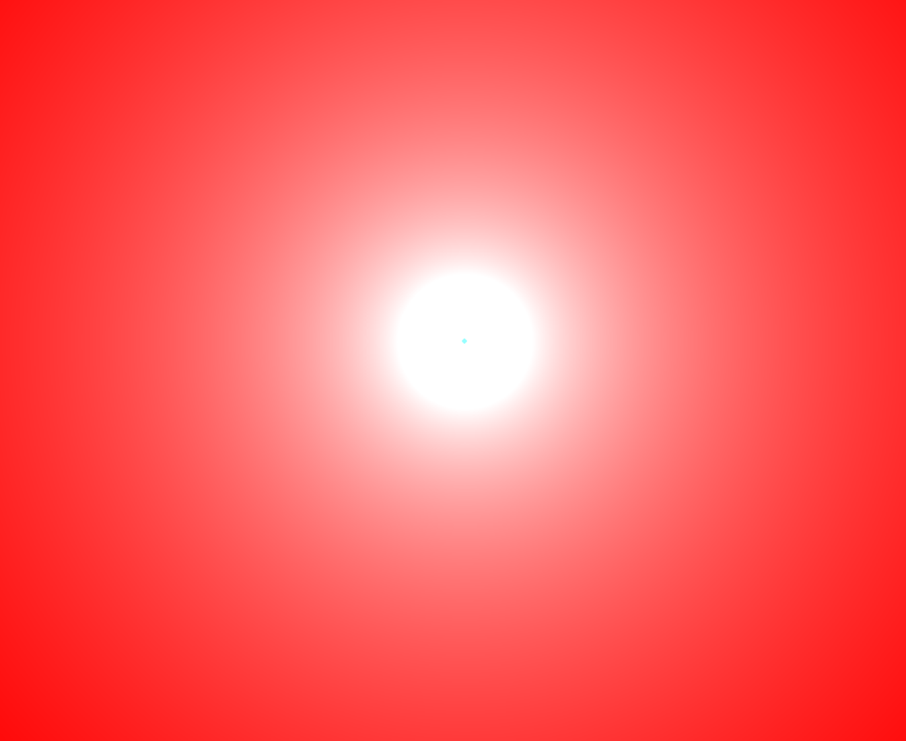

A view spanning approximately 10,000 × 10,000 km around a pulsar: the shades range from the dense red of macroscale disruption to the blinding white of the microscale disruption band close to the compact body, the cyan dot at the center.

**Showcase: Jupiter System (Europa and Io)**


In the upper left is the Jovian moon **Europa**, immersed in the blue-to-cyan hues of Jupiter’s tidal map. In the center is **Io**, in full cyan: it is this same tidal force that explains why it is the most volcanically active rocky body in the entire solar system. Note how the heatmap also accounts for the tidal stress that each moon, in turn, generates, and how the moon itself is deformed by its immersion in Jupiter’s tide.


> **Author’s Note.** The two transverse black lobes visible around each moon are points where the visualized shear $\sigma$ vanishes, but for a **very different** reason than that of the dark blue areas far from the bodies. In the distant blue regions, $\Phi_{xx}, \Phi_{yy}, \Phi_{xy}$ are all small because the field is flat. In the black lobes near the moon, on the other hand, the individual components of the Hessian are **large and substantial** and combine such that $\Phi_{xx} = \Phi_{yy}$ and $\Phi_{xy} = 0$: the sum of squares $(\Phi_{xx}-\Phi_{yy})^2 + 4\Phi_{xy}^2$ vanishes not because of the absence of a field, but because the eigenvalues of the Hessian coincide. The tide there is locally **isotropic**: it stretches equally in all directions within the plane. These two points arise from the geometric interference between the contribution from the moon itself (radial, symmetric) and the background contribution from Jupiter (anisotropic, oriented along the moon-Jupiter axis). Precisely at these two transverse positions, the two tensors combine in such a way as to balance out the principal directions.
>
> **Confirmation observed in simulations.** By varying the Moon-Jupiter distance, the lobes shift in a predictable manner: the more the Moon is immersed in the giant planet’s field (i.e., the closer it is to Jupiter), the more the lobes contract around it; the farther it moves away, the more the lobes expand. The regularity of the proportions suggests that there is a precise scaling law behind this, attributable to the structure of the difference between the components of the Hessian. The quantitative derivation is beyond the scope of this guide, and I will leave it for a subsequent analysis.
>
> I won’t speculate on what happens in the 3D equivalent: the natural hypothesis is that it corresponds to being *“cut” in all directions of the transverse plane* rather than along a preferred axis, and thus to intense isotropic stress rather than none, but this is a point that would warrant confirmation by an expert.

> [!NOTE]
> **Quantitative in-simulation readings.** Heatmaps are not just a visualization: they can be inspected by *double-clicking* on any pixel on the screen, which returns the numerical value of the field at that point in the simulated space (potential, its time derivative, eigenvalues of the tide tensor, projected strain, depending on the active mode). The simulator is also a measurement tool; there is no need to extract the data and process it externally.

### 7.4 Roche Topology (the sign of the determinant)

#### 7.4.1 The Effective Potential in the Co-Rotating Frame

This is the next step beyond the tide and introduces a new element: the **effective potential in the co-rotating frames**. To understand why it is needed, a thought experiment suffices. If a subject stands on a merry-go-round rotating at angular velocity $\omega$ and describes its physics *from the inside* (i.e., in the system rotating with them), they feel two forces: the usual gravity and a **centrifugal force** pushing outward. That force does not exist in an inertial frame (for someone observing the carousel from the outside): it is an effect of the rotating reference frame, but for the person on the carousel, it is entirely real.

The **co-rotating effective potential** is exactly the sum of these two components: the gravitational potential of the bodies plus the centrifugal potential $-\tfrac{1}{2}\omega^2 d^2$ (where $d$ is the distance from the center of mass). The angular velocity $\omega$ of the system is derived kinematically from the **locked pair** (the body the user locks onto and its dominant attractor), using the specific angular momentum:

$$h = \vec{r}\times\vec{v}_{rel}, \qquad \omega = \frac{h}{r^2}$$

**Angular momentum $h$ and angular velocity $\omega$: two different things.** It’s worth clarifying these before continuing, because the entire interpretation of the heatmap relies on this distinction.

- $h = r^2\omega$ is the **specific angular momentum** (intuitively: the body’s *rotational momentum*). In an unperturbed orbit, it is a **conserved** quantity: it never changes, whether at the pericenter or apocenter, in a plunge or circular orbit. It is an **invariance of the body**.
- $\omega = h/r^2$ is the **instantaneous angular velocity** (how fast I’m spinning *right now*). For a given $h$, $\omega$ skyrockets when $r$ is small and plummets when $r$ is large. It is a **snapshot**.

This is literally **Kepler’s second law**: $r^2 \dot\theta = h$ is constant, so $\dot\theta$ increases as $r$ decreases. Mercury spins fast at perihelion and slows down significantly at aphelion, but the product $r^2\omega$ always remains the same. The heatmap “breathes” with the current $\omega$: in eccentric orbits, the threshold visible in the heatmap **shifts in phase with the eccentricity**. In a perfectly circular orbit, $\omega$ is constant and the threshold is fixed: all the motion you see in the heatmap *is* the non-circularity of the orbit.

The frame therefore rotates like a *hard drive* at the instantaneous $\omega$, and this precisely captures the dynamics of closed orbits: in the co-rotating reference frame, a moon in a circular orbit appears to be stationary, and all you see are the perturbations from everything else.

For this potential, Roche examines the **sign of the determinant** of the Hessian, $D = \Phi_{xx}\Phi_{yy} - \Phi_{xy}^2$ (the same mathematical object as in [§7.3](#73-tidal-stress-and-a-note-on-the-hessian), but calculated on the effective potential rather than on pure gravity).

And this is where centrifugal force takes center stage. Gravity alone, near a body, always yields a **hyperbolic shape** ( $D < 0$ , a local saddle of the potential surface): it stretches radially and compresses transversely. The centrifugal term, when added to the Hessian, lowers both eigenvalues; far from the bodies, where gravity is weak, **it dominates and flips $D$ to positive**. It is precisely this sign transition that draws the lobes.

> **A clarification on terminology.** When we refer to a *saddle* or *dome* in this section, we do not mean isolated critical points (with zero gradient), but rather the **local shape** of the potential surface at *each pixel* in the region: all the red areas have **hyperbolic** curvature (saddle shape), and all the blue areas have **elliptical** curvature (dome-shaped). However, the gradient is nonzero almost everywhere, and a particle left at rest in those pixels **falls or is propelled** along the gradient. Only at the 5 Lagrange points do both properties (zero gradient **and** hyperbolic or elliptic shape) combine, and it is this characteristic that makes them true *critical points* (discussed in [§7.5](#75-lagrange-hunter-determinant-and-inverse-hessian)).

#### 7.4.2 Color Mapping (Sign and Intensity of $D$)

Each pixel carries two pieces of information. The **hue** indicates the sign of $D$, that is, the local topology. The **saturation** indicates its intensity. To make the intensity comparable across all scenarios, $D$ is divided by $\omega^4$, the natural scale of the co-rotating frame that shares its units of measurement. The mapped quantity is therefore $\log_{10}(|D|/\omega^4)$, restricted to $[-3, +3]$. The ramp starts off flat where $D \approx 0$ and saturates near the bodies, where the $1/r^3$ terms of the Hessian explode:

| $D$ | Topology (local shape) | Curvature ramp ( $t = 0 \to 1$ ) |
|---|---|---|
| $D < 0$ | hyperbolic:  local saddle (gravitational domain) | crimson $\to$ fiery red $\to$ neon yellow |
| $D > 0$ | elliptic: local dome (centrifugal domain) | indigo $\to$ electric blue $\to$ cyan |

A co-rotating particle would fall toward the attractor in the *red* region and be flung outward in the *blue* region. The shades indicate how quickly this would happen.

**Brightness.** The brightness of each pixel depends on the magnitude of the net force $|\nabla\Phi_{\text{eff}}|$ at the corresponding point, mapped on a logarithmic scale: the stronger the force, the brighter the pixel, down to black where it vanishes. It is this third piece of information, superimposed on the hue, that generates the three-dimensional relief perceived during the simulation.

**Self-gravity and the equilibria revealed by black.** Self-gravity refers to the gravitational field that a body generates on its own, distinct from that of the attractor and from the centrifugal term. In the map, the smaller body of the pair has its own red pocket of self-gravity, that is, the region where its attraction dominates the local effective potential. The dark areas appear primarily where the gravity of the two bodies and the centrifugal force cancel each other out; the net force becomes zero, resulting in zones of zero brightness. In many configurations, two specific wells located on the line connecting the attracted body and the attractor correspond to the Lagrange points L1 and L2 (presented in the note below), exactly where the self-gravity well **narrows** toward the attractor and on the opposite side, as shown in the example with the Moon in the zoom of [§7.4.4](#744-combined-interpretation-of-the-three-data-sets). L3, L4, and L5 also exist here, but they are buried in the low-force boundary between red and blue: to see them, you need the [Lagrange Hunter](#75-lagrange-hunter-determinant-and-inverse-hessian).

**How the pair is chosen.** The user selects a body, and the engine pairs it with its dominant attractor, precalculated using the tidal force $M/r^3$, following the same logic as the Hill sphere. Selecting Io therefore yields the Io-Jupiter map rather than the Io-Sun map: locally, Jupiter dominates the gradient.

> [!NOTE]
> **Lagrange points in brief.** These are the five points in the plane where, in the co-rotating frame of the pair, a test particle would remain stationary: the gravity of the two bodies and the centrifugal force exactly cancel each other out. **L1, L2, L3** lie on the axis connecting the two bodies and are *saddles* (unstable: a small perturbation causes them to drift apart). **L4 and L5** lie 60° ahead and behind the smaller body, form equilateral triangles with the two bodies, and are dynamically stable due to the Coriolis force: this is where Jupiter’s Trojans reside. Their numerical and visual identification is the specific task of the **Lagrange Hunter** ([§7.5](#75-lagrange-hunter-determinant-and-inverse-hessian)).

#### 7.4.3 Overlay [M]: Ideal Circular Orbit

Pressing `M` in Roche Topology mode overlays a **continuous lavender-colored ring** centered on the center of mass: this is the radius at which the target would orbit **circularly** if it were to complete an orbit with the $h$ it possesses at that moment. The formula is the standard one for the two-body problem:

$$D_g = \frac{h^2}{G\,M_{tot}}, \qquad r_g = D_g \cdot \frac{m_{attr}}{M_{tot}}$$

where $D_g$ is the total separation of the pair that would complete a circular orbit with that value of $h$, and $r_g$ is the distance of the target from the center of mass on that same orbit. The ring is the conceptual analogue of the analytical markers of the Lagrange points in Lagrange Hunter ([§7.5](#75-lagrange-hunter-determinant-and-inverse-hessian)): a **theoretically calculated** reference superimposed on the **emerging** field, allowing one to see at a glance how close or far the system is from equilibrium.

**What the ring indicates and how it behaves in various scenarios:**

| Configuration | Interpretation |
|---|---|
| Target **on** the ring | circular orbit, stable system |
| Target **inside** the ring ( $r < r_g$ ) | excess of $h$ relative to the current radius → the body is near its pericenter and is rising toward the apocenter |
| Target **outside** the ring ( $r > r_g$ ) | $h$ deficit → the body is near its apocenter, or in free fall |
| Ring **inside** the attractor | $h$ too small for any orbit: **guaranteed plunge**, visible even before launch |

**How it behaves in real time.** Since $h$ is conserved during an unperturbed orbit, the ring is a **fixed guide**: it does not fluctuate like the red/blue threshold. It is only affected by events that change $h$, $M_{tot}$, or the pairs:
- **GW radiation until coalescence (2.5PN reaction)**: gravitational radiation affects $h$ → the ring **spirals inward** in real time as the orbit decays.
- **Attractor change** (e.g., Earth replaced by Jupiter): $M_{tot}$ explodes → the ring **collapses** into the planet, a predicted plunge.
- **Multi-body perturbations or flybys**: slow drifts or jumps.

In a clean, isolated orbit, however, the ring remains stationary while the red/blue boundary of the Roche lobe expands and contracts around it: the **instantaneous divergence between the two** is the direct visual measure of the eccentricity.

<div align="center"></div>

Earth-Moon system: The Moon is at its apogee, more than 400,000 km from Earth, and has in fact crossed the ring of the ideal circular orbit. The other details that emerge will be discussed in the next chapter.

<div align="center"></div>

The animation shows a *what-if* experiment: replacing Earth with Jupiter and observing the Moon’s behavior as a result. The Moon, retaining its original angular momentum (calibrated for Earth), finds itself in the worst-case scenario: its new ideal orbit, with that $h$, turns out to be close to the center of Jupiter. Furthermore, it finds itself immersed in and overwhelmed almost immediately by a strong tidal field that could break it apart, all while in free fall (*plunge*) toward the center of Jupiter.

#### 7.4.4 Combined Interpretation of the Three Data Sets

This is the only heatmap in the simulator that encodes **three distinct physical quantities simultaneously**. Here’s how to interpret them together.

1. **Topology of the effective spaces** *(indicated by the red/blue shading, the sign of $D$ )*. At the pericenter of an eccentric orbit, centrifugal force dominates and the “blue sea” expands, submerging the system, a sign that the body is accelerating outward toward its apocenter. The effective space of the smaller body survives as a red “peanut”, the pocket where its self-gravity overcomes the surrounding centrifugal force. That pocket is never a circle. Its **size** is eroded by centrifugal force isotropically (equally along all axes) while its **elongated shape**, toward the companion and on the opposite side, is shaped by the companion’s own tidal forces. Be careful not to confuse topological space with matter: a body remains intact only if its physical extent is entirely contained within its own red pocket. From the yellow zone onward, self-gravity becomes the determining factor, and an object in that area, at similar angular velocities, will have its force vector pointing toward the owner of the effective space.

2. **Tidal stress and disintegration** *(from color saturation and geometric deformation)*. Two distinct regimes, with **Mercury at perihelion** as a visual comparison at the end of the section:

   * *Plunge regime, dominant gravity.* The field is red, and the saturation toward neon yellow indicates the explosion of the $1/r^3$ terms of the Hessian. An extended body plummeting here undergoes strong tidal stress and, if large enough, may fragment.
   * *Centrifugal regime, eccentric orbits.* The stress is evident from the compression of the “peanut” in point 1. When the red pocket contracts all the way into the body’s solid radius, the material ends protrude into the outer region and the centrifugal force (or the companion’s gravity) tears them away. This is disintegration via *Roche lobe Overflow*, the same mechanism that fuels accretion disks in interacting binaries, around black holes, white dwarfs, and neutron stars.

3. **Lagrange points L1 and L2** *(based on luminosity, as previously discussed in [§7.4.2](#742-color-mapping-sign-and-intensity-of-d))*. These are the only two equilibrium points that this heatmap makes visible on their own, clearly visible in the close-up of the Moon at the end of the section. Be aware, however, of a special case. A third, very massive body within the sphere of influence can prevent these points from appearing, as happens in the Earth-Moon system when the Sun is active.

In a single frame, therefore, you can intuit where the particles are going, where the tide is destroying, and where the pair’s equilibrium points lie. It is the simulator’s most information-dense map.

<div align="center"></div>

**Mercury at perihelion (High centrifugal energy regime and strong tides).** At its perihelion, Mercury is 46,001,200 km from the Sun, with an extremely high relative velocity of 58.98 km/s. Its instantaneous angular velocity $\omega$ is at its maximum, to the point that its self-gravity well appears submerged and eroded by the centrifugal “blue sea” ( $D > 0$ ). The shape of Mercury’s effective gravitational field in the co-rotating frame would be circular were it not heavily compressed and elongated by the anisotropic tidal stress generated by its proximity to the star (the regime described in point 2 above).

<div align="center"></div>

**The Moon in the Earth-Moon system (quasi-circular / quiet regime).** Zoom on the Moon-Earth context shown earlier: focus on the Moon’s self-gravity in the co-rotating frame. Unlike Mercury at perihelion, the Moon’s red self-gravity pocket is well-defined and extensive, while the dark regions corresponding to the collinear Lagrange points L1 and L2 stand out clearly.

<div align="center"></div>

Image taken from Wikipedia that clearly shows an alternative 3D view of the effective potentials and the distribution of the Lagrange points, which is also useful for the Lagrange Hunter ([§7.5](#75-lagrange-hunter-determinant-and-inverse-hessian)).

#### 7.4.5 Case Study: The Artemis II Mission

<div align="center">
    <video src="https://github.com/user-attachments/assets/b34ef8c8-b535-48ce-9ff8-8cd3820a8612" controls="controls" width="100%"></video>
</div>

**Artemis II Mission (NASA, April 2026)**: This scenario uses the mission’s actual orbital vectors during the **translunar cruise phase**, captured at **2026-04-03T12:03:39 UTC** (approximately 12 hours after completion of the *Translunar Injection* maneuver). At this moment, the **Orion** spacecraft is traveling in unpowered inertial flight (engines off) at a distance of 134,376 km from Earth (~34% of the Earth-Moon distance) and 283,833 km from the Moon, at a speed of 2.037 km/s relative to Earth. The simulation reproduces its passive ballistic trajectory up to the *flyby* on April 6. In the Roche topology visualization (associated with the co-rotating Earth-Moon system), the gravitational transition can be observed graphically: as Orion crosses the Roche lobe and enters the effective space dominated by the Moon (yellow/crimson shading), the **purple net acceleration vector** progressively shifts its orientation from the Earth’s center of mass to that of the Moon.

The simulation operates in a heliocentric inertial reference frame (not geocentrically constrained); consequently, the entire Earth-Moon system and the spacecraft itself orbit the Sun together at approximately 30 km/s. This behavior can be monitored in real time via the **Orbital Telemetry Panel** (HUD), whose parameters and operation are discussed in detail in the dedicated section **[§7.9](#79-double-clicking-on-the-scene-telemetry-panel-and-field-probe-units-of-measurement)**.

To explore the entire dynamic scenario, we invite you to use the interactive simulation. The video above illustrates the key stages before and after the lunar *flyby*, showing the transitions in effective space.

The initial conditions ($t_0$) for the entire system (Earth, Moon, Orion) were extracted programmatically and simultaneously using the **JPL Horizons** APIs. To ensure a rigorous $O(N^2)$ kernel integration, free of fictitious forces or center-of-mass drift, the Cartesian state vectors were queried in a **heliocentric inertial** reference frame (origin at the center of the Sun, `@10`), oriented in the ecliptic plane, and subsequently projected onto the $xy$ plane. Without any added artificial thrust, the trajectory crosses the Earth-Moon Roche lobe, enters the lunar gravitational lobe, and exploits its influence as a gravitational slingshot for the **free-return flyby**, the passive return journey to Earth.

### 7.5 Lagrange Hunter (determinant and inverse Hessian)

This is the final step, and the most elaborate one. It relies precisely on the same **co-rotating effective potential** $\Phi_{eff}$ introduced in [§7.4](#74-roche-topology-the-sign-of-the-determinant) (gravity plus centrifugal force, with $\omega = h/r^2$ derived from the locked pair). The **Lagrange points** are the five equilibrium points of that potential, that is, the **zeroes of the gradient** $\nabla\Phi_{eff}$: at these points, the net force experienced by a co-rotating particle is zero. The heatmap for Roche topology itself originated by mistake as a failed attempt to highlight the Lagrange points, but was retained because of the wealth of information it revealed that had not initially been considered. The solution of the so-called Lagrange Hunter (because it searches pixel by pixel) uses instead a **Newton-Raphson-type distance estimator**.

The Newton-Raphson method is the standard numerical technique for finding the zeros of a function: given a point, it uses the local slope to take a step toward the nearest zero. Here, the function for which I am seeking zeros is the gradient $\nabla\Phi_{eff}$, and the “slope of the gradient” is precisely the Hessian. Near a critical point, the gradient linearizes:

$$\nabla\Phi_{eff} \approx H \cdot \delta\vec{r} \;\Longrightarrow\; \delta\vec{r} \approx H^{-1}\,\nabla\Phi_{eff}$$

where $\delta\vec{r}$ is the (vector) step toward the nearest critical point. Its magnitude is the **estimated distance** from the Lagrange point:

$$r_{est} = \left|H^{-1}\,\nabla\Phi_{eff}\right|$$

For the 2×2 Hessian, the inverse is explicit and depends on the **determinant** $D = \Phi_{xx}\Phi_{yy} - \Phi_{xy}^2$:

```math
H^{-1} = \frac{1}{D}\begin{pmatrix} \Phi_{yy} & -\Phi_{xy} \\ -\Phi_{xy} & \Phi_{xx} \end{pmatrix}
```

Therefore, $r_{est}$ contains a factor of $1/D$ (the **inverse of the determinant**): the closer one gets to a Lagrange point, the more $r_{est} \to 0$ and the more the pixel is illuminated. It acts as a “compass” that measures how close one is to equilibrium.

**The calculation chain, pixel by pixel.** What the kernel does to each pixel of the heatmap, in five steps:

1. **Analytic gradient and Hessian.** The components $\Phi_x, \Phi_y$ of the gradient and $\Phi_{xx}, \Phi_{yy}, \Phi_{xy}$ of the Hessian are calculated in closed form by summing the gravitational contributions of the two bodies in the pair (the same formulas as in [§7.3](#73-tidal-stress-and-a-note-on-the-hessian), but evaluated at the current pixel). To these are added the **centrifugal terms**: $-\omega^2\,\vec{d}$ on the gradient and $-\omega^2$ on the diagonal of the Hessian, with $\omega$ derived from the instantaneous kinematics of the pair ([§7.4](#74-roche-topology-the-sign-of-the-determinant)). No numerical derivatives: everything is in analytical form.

2. **Newton-Raphson for estimating the distance.** With $D = \Phi_{xx}\Phi_{yy} - \Phi_{xy}^2$ and the explicit formula for $H^{-1}$ seen above, we calculate $\delta\vec{r} = H^{-1}\nabla\Phi_{eff}$ component by component, and its magnitude $r_{est} = |\delta\vec{r}|$ is the **estimated distance from the nearest critical point**.

3. **Conversion to screen distance.** $r_{est}$ is in kilometers (world); to plot it, we need the distance in pixels: $d_{px} = r_{est} / s$, where $s$ is the camera scale ($\text{km/pixel}$).

4. **Spatial filter and Gaussian.** If $d_{px}$ is below a threshold $r_{threshold}$ (calibrated by the **sensitivity fader**, ~5 px at the default value), the pixel falls within a candidate Lagrange point and is assigned an intensity $I = e^{-2\,(d_{px}/r_{threshold})^2}$: this is the **Gaussian** that makes the point visible as a luminous bell centered on the true zero of the gradient. Outside the threshold, the pixel remains black.

5. **Topological filter and coloring.** Before coloring the candidate pixel, two final checks:
   - if $D > 0$ **and** trace $> 0$ (the *trace* is the sum of the diagonal terms of the Hessian, $\text{tr}(H) = \Phi_{xx} + \Phi_{yy}$, which is equivalent to the sum of the two eigenvalues), the pixel lies above a *minimum* of the effective potential (a gravitational well of one of the two bodies): black pixel, excluded. Without this filter, each body would appear as a blue blob superimposed on its own well.
   - Otherwise, the sign of $D$ determines the color: saddle point ( $D < 0$ ) → **red** $(I,\;0.1\,I,\;0.1\,I)$ → L1, L2, L3; stable extreme ($D > 0$ with trace $< 0$) → **blue** $(0.1\,I,\;0.4\,I,\;I)$ → L4, L5. The intensity $I$ of the Gaussian modulates the brightness, so the center of the point is solid and the edges fade.

In summary: **local curvature acts as a compass** (it locates the critical point using Newton-Raphson), the **Gaussian acts as a brush** (it makes it visible), and the two filters (spatial and topological) filter out noise and false positives at the wells of the bodies.

**Why only the neighborhoods of the zeros are clearly visible.** The linearization $\nabla\Phi_{eff} \approx H\,\delta\vec{r}$ holds only *near* a critical point; farther away, the linear model is incorrect and $r_{est}$ loses its meaning (it saturates). This is why the map is sharp only in the vicinity of the Lagrange points, just as a Gaussian distribution is informative only around its peak: outside that region, it is dark.

**Overlay [M]: theoretical analytical markers.** Pressing `M` in Lagrange Hunter mode overlays the five **analytic Lagrange points** of the pair onto the heatmap, calculated in closed-form from the restricted circular three-body problem (formulas in [§9.4](#94-analytical-lagrange-points-restricted-circular-three-body-problem)). These are **fixed benchmarks** that allow you to measure at a glance the deviation of the actual points (calculated by Newton-Raphson) from the ideal positions, and it is this detail that makes visible the *breathing* of the Lagrange points in eccentric or perturbed orbits. The complete discussion of the coexistence of the two overlays (why both are used and what to interpret from each) is in [§9.6](#96-why-do-the-theoretical-overlay-and-the-dynamic-heatmap-coexist).

| Without overlay | With theoretical overlay [M] |
|:---:|:---:|
|  |  |

*The Lagrange Hunter highlighting the stable L4/L5 points (blue) and unstable L1/L2/L3 points (red), showing how the theoretical overlay guides their rapid localization.*

### 7.6 Projected Strain (GW Quadrupole Strain)

This heatmap, labeled **GW Strain (Quadrupole)** in the user interface, represents the most sophisticated visualization of the simulator’s dynamic field. Unlike classical potential or tidal heatmaps, it directly maps the projected causal gravitational *strain* associated with the emission of gravitational waves by compact binary systems.

> [!NOTE]
> **Theoretical Introduction to Strain and the Quadrupole**
> If you are not familiar with the concepts of metric strain and mass quadrupole moment, we strongly recommend that you first consult the in-depth sections of [§8](#8-the-ligovirgo-analyzer-from-kinematic-proxy-to-spectrum), in particular:
> - **[§8.2](#82-what-is-the-mass-quadrupole-moment-two-perspectives-on-the-quadrupole)** to understand the physical nature of the quadrupole;
> - **[§8.3](#83-the-disguised-3d-formula-and-the-orthogonal-projection-onto-the-plane)** for the analysis of the projected metric formula;
> - **[§8.4](#84-what-the-virtual-probe-records-the-velocity-based-proxy)** for the practical operation of the kinematic proxy in the engine.

#### 7.6.1 Mathematical Formulation and Projection
The mathematical formulation used by the engine to calculate the strain in each pixel shares the exact same physics logic and numerical simplifications as the [LIGO virtual probe](#81-the-analogy-with-ligo-and-virgo-on-earth). 

In particular, to eliminate the significant numerical noise induced by accelerations in the discrete time domain ( $dt$ ) immediately prior to the merger, a **kinetic regularization** is adopted (explained in detail in [§8.5](#85-the-numerical-problem-of-acceleration-and-kinetic-regularization)), discarding the force term in favor of the proxy based solely on relative velocities. This approach is based on the exact equivalence between the two contributions in the limiting case of circular orbits (discussed in [§8.3](#83-the-disguised-3d-formula-and-the-orthogonal-projection-onto-the-plane)).

While the virtual LIGO probe is limited to recording the strain at a single point on the screen, assuming a fixed viewing direction (equivalent to calculating only the $h_+$ component along the cardinal axes, [§8.4](#84-what-the-virtual-probe-records-the-velocity-based-proxy)): the heatmap must determine the strain at every pixel on the screen. To do so, it calculates the projection of the body’s velocity along the variable pixel-to-source direction.

For each pixel with coordinates $(x_{px}, y_{px})$, we calculate the distance along the $x$-axis and the $y$-axis relative to the body’s retarded causal position, $\vec{r}_{\text{ret}, k} = (x_{\text{ret}, k}, y_{\text{ret}, k})$:
$$d_x = x_{px} - x_{\text{ret}, k}, \qquad d_y = y_{px} - y_{\text{ret}, k}$$

The effective geometric distance $r$ (the length of the distance vector $\vec{d}$) is calculated using the classic Pythagorean theorem:
$$r = \sqrt{d_x^2 + d_y^2}$$

To determine the direction connecting the object to the pixel, we define a **unit vector** (a unit vector, usually denoted by the symbol $\hat{n}$) by dividing the partial distances by the total distance $r$:
$$n_x = \frac{d_x}{r}, \qquad n_y = \frac{d_y}{r}$$

Similarly, we define a transverse (orthogonal) direction $\hat{t} = (t_x, t_y)$ rotated by 90 degrees:
$$t_x = -n_y, \qquad t_y = n_x$$

Once the body’s velocity $k$ at the retarded time has been defined, subtracting the motion of the common center of mass (COM*) of the binary pair to isolate only the internal orbital motion, $\vec{v}_{\text{rel}} = (v_{\text{rel}, x}, v_{\text{rel}, y})$, the two projections of the velocity with respect to the pixel directions are expressed algebraically in a simple form as:
- **Radial velocity** (projected along the pixel direction): $v_r = v_{\text{rel}, x} n_x + v_{\text{rel}, y} n_y$
- **Tangential velocity** (projected along the transverse direction): $v_t = v_{\text{rel}, x} t_x + v_{\text{rel}, y} t_y = -v_{\text{rel}, x} n_y + v_{\text{rel}, y} n_x$

The strain projected onto the pixel is the quadratic difference between these two velocity components:
$$h_{\text{proj}, k} = v_r^2 - v_t^2$$

By algebraically expanding the squares of the two components, we obtain the final formula implemented in the rendering kernel:
$$h_{\text{proj}, k} = (v_{\text{rel}, x} n_x + v_{\text{rel}, y} n_y)^2 - (-v_{\text{rel}, x} n_y + v_{\text{rel}, y} n_x)^2 = (v_{\text{rel}, x}^2 - v_{\text{rel}, y}^2)(n_x^2 - n_y^2) + 4\,v_{\text{rel}, x}\,v_{\text{rel}, y}\,n_x\,n_y$$

The total magnitude displayed on the screen is the sum of the contributions from the individual bodies, weighted by their mass and attenuated by distance (the $1/r$ geometric decay typical of far-field radiation):
$$h_{\text{total}} = \sum_k \frac{M_k \cdot h_{\text{proj}, k}}{r_k}$$

This geometric decomposition projects the exact quadrupole angular symmetry ( $\ell=2$ , with a four-lobe pattern alternating between cyan and red) onto the observing pixel, preventing the heatmap from collapsing into a simple radial gradient similar to the potential map $\Phi$ . In this way, the spatial analyzer of the heatmap and the pointwise analyzer of LIGO ([§8](#8-the-ligovirgo-analyzer-from-kinematic-proxy-to-spectrum)) are made mathematically and conceptually equivalent.

#### 7.6.2 Per-body causality: extended source versus point-like quadrupole
In standard analytical representations, the strain is calculated from a **global quadrupole** referenced to the common center of mass, with a single retarded time $t_{\text{ret}} = t - R_{\text{COM}}/c$: all radiation ideally emanates from a single point. The simulator does something different: it sums the **per-body contributions**, each read at its own emission instant and projected along its own unit vector toward the pixel (the double causal retrieval of [§3](#3-causal-aberration-dead-reckoning-and-relativistic-dynamics)).

In the **far field**, the two wave functions coincide: since the contribution is quadratic in velocity, the patterns of the two bodies have the same sign and add together to form a single rotating spiral, with the nodal zeros visible as continuous transitions between the cyan and red arms. In the **near field**, however, the extended source makes itself felt: the two contributions, taken at slightly different times and with slightly different unit vectors ($t - r_A/c \neq t - r_B/c$ and $\hat{n}_A \neq \hat{n}_B$), do not align perfectly between the two masses and produce a close-in interference pattern, visually resembling a red “eye”: this is the signature of the real pair in place of the ideal point.

<video src="https://github.com/user-attachments/assets/aee7fd2d-70f0-4d1d-9767-315d6bae5d28" controls="controls" width="700"></video>

*Loop of a binary black hole merger rendered in GW Strain mode. The sequence alternates between two viewpoints: a close-up view of the region between the two bodies, where a sort of red “eye” of close-range interference forms between the two quadrupole contributions, and a zoomed-out panoramic view, in which the radiative macrospirals are seen propagating outward at speed $c$, with continuous cyan/red transitions across the entire map.*

#### 7.6.3 Coalescence and the Bare Quadrupole Artifact
The GW Strain heatmap is a proxy designed to describe a **pair of bodies** and is based on the barycenter-relative kinetic calculation. At the moment of coalescence, one of the two bodies is absorbed by the other. The universe, however, does not update instantly: the dying body persists in the history until the causal “death” wave (the time of flight signaling its disappearance) reaches the imposed boundaries of the causal simulation. 

Since the radius of this simulation is set to **3 AU**, the corresponding time of flight is approximately **24 minutes** of simulated time ( $3\text{ AU} / c \approx 1500\text{ s}$ ). When performing the calculation at a time step of $dt = 1\,\mu\text{s}$ (where the engine’s actual simulation speed is at most about $600\text{ ms}$ simulated per second), this transient actually lasts a very long time in real processing time (over 40 minutes), taking up most of the usable simulation session.

During this long transient window, the strain rendering system **breaks down**:
* By losing the center-of-mass relationship with the absorbed companion, the engine also rewrites the history of the expanding spirals.
* This breakdown halts the spiral motion and freezes the entire previous wave pattern.

The result is a **visual artifact**, which, however, has the rare benefit of laying bare the static, single, non-rotating quadrupole of the surviving body. This is a **rare** geometric signature to observe under ordinary conditions, as it requires very high relative velocities (as discussed in the case study [§7.6.4](#764-case-study-the-dynamic-quadrupole-in-emri-at-the-apocenter)).

To maintain and observe the expanding spiral even *after* coalescence, it is necessary to switch to the **$d\Phi/dt$** heatmap. Although the oscillation in this case is dipolar rather than quadrupolar, the shape of the waves remains morphologically very similar. The waves in $d\Phi/dt$ withstand the impact of coalescence without breaking because they describe a universal scalar field: they do not depend on a selected pair such as strain, but propagate autonomously through space even after the system has merged into a single object.

| GW Strain: post-merger breakage | dΦ/dt: post-merger conservation |
|:---:|:---:|
|  |  |
| The disappearance of the partner interrupts the calculation of the center of mass, freezing the historical spirals into a rigid, non-rotating cross. | Since this is a universal scalar field not bound to the pair, the spirals continue to propagate regularly backward even after the merger. |

The above also implies a practical consequence regarding the **visibility** of the pattern. The proxy is quadratic in the relative velocity, $|h_{proj}| \propto |v_{rel}|^2$, and this proportionality qualitatively coincides with the dependence of the actual GW radiative power on high powers of $v/c$. This means that the cross becomes detectable **only for compact binaries in tight orbits** (NS, BH, final spiraling cycles, where $|v_{rel}|$ is a significant fraction of $c$); for ordinary planetary systems, even with the sensitivity slider set to maximum, the amplitude remains below the rendering threshold, just as in physical reality planetary pairs are not detectable by ground-based interferometers.

> [!NOTE]
> **The field ghost artifact.** A similar persistence is also observed in Lagrange Hunter, Roche Topology, and the Tidal Map: upon the death of a body due to merger or accretion, its contribution remains visible for a time equal to the current causal limit. Here, however, it must be honestly stated that this is an architectural limitation, not a physical one. These three maps are snapshots ([§7.8](#78-summary-how-each-heatmap-converts-physics-into-color)) and do not read any retarded history. The dying body, however, remains in the buffers, frozen at the point of its disappearance, until its causal fading is complete, because the life cycle of bodies is tied to the causal horizon for the benefit of the maps that are truly causal (the asynchronous garbage collector, [§8 of ARCHITECTURE_DEEP_DIVE.md](ARCHITECTURE_DEEP_DIVE.md#6-the-asynchronous-garbage-collector-for-causally-dead-bodies)). The instantaneous maps inherit a motionless ghost of it, which they continue to sum. For pair maps, the discussion extends to the co-rotating frames, which remain built upon a partner that is now stationary. In the two purely causal maps ( $\Phi$ and $d\Phi/dt$ ), however, this persistence is genuine physics: the news of the disappearance travels at $c$, and the residual field truly exists until the front has swept through the visible volume.

#### 7.6.4 Case Study: The Dynamic Quadrupole in EMRI at the Apocenter
A particularly fascinating and emergent behavior is observed in the **EMRI** (Extreme Mass Ratio Inspiral) scenario. To facilitate the geometric visualization of this type of highly eccentric orbit, we reproduce here, on a small scale, its characteristic trajectory (already discussed earlier):


As the light compact object travels along its highly eccentric orbit around the supermassive black hole, its linear velocity varies appreciably along the trajectory:
* **At pericenter (maximum velocity):** Strain emission is intense, and the rapid rotation generates complex interference wavefronts.
  
  
  
  *Strain emission at the pericenter: the rapid acceleration releases an energy pulse that propagates as a circular wavefront, an isolated shell expanding at speed $c$.*
  
* **At the apocenter (minimum velocity):** The orbital dynamics slow down drastically. With the angular velocity nearly at a standstill, the strain weakens but clearly reveals the geometric signature of the **naked, stationary quadrupole** associated with the light body. The observer can see this four-lobed pattern light up and slowly change direction in space, reorienting its spectral axis in real time as the object slowly performs its apocenter turn before plunging back toward the center.
  
  
  
  *The static, naked quadrupole at apocenter: a very close-up (zoomed) view with increased gain reveals the characteristic four-lobed cross of the strain (alternating cyan and red) of the light body, which would otherwise be invisible due to kinetic deceleration.*
 
<video src="https://github.com/user-attachments/assets/8d30ed55-33fe-4897-b678-e1e165158f21" controls="controls" width="700"></video>

*Complete orbital cycle of the EMRI (apocenter → pericenter → apocenter) rendered in GW Strain mode. The video clearly shows the dynamic transition between the stationary, weak emission at apocenter (where the naked quadrupole of the light body oriented along the orbital axis stands out) and the violent concentric wave discharge released during the close passage at pericenter, which propagates through space.*

*(It is also available as a real-time looping GIF at `docs/gif/GWH_EMRI_LOOP.gif`.)*

| Macro view: Early Inspiral (tens of AU) | Macro view: Late Inspiral (tens of AU) |
|:---:|:---:|
| <br><br> | <br><br> |
| **Discrete-pulse emission on the light cone**: In the early stages of inspiral, emission occurs in separate pulses. At each passage through the pericenter, the body releases a disturbance that travels along the light cone at speed $c$ as an isolated shell. Since the orbital period is long, successive wavefronts remain separated by large regions of silence, propagating as well-spaced concentric rings. | **The transition to a continuous spiral**: In the final stages before capture (chirp regime), the orbital frequency increases dramatically, and the emission becomes a continuous flow. The pulses are released without pause: the individual wavefronts lose their distinctiveness and merge, weaving a dense spiral that uniformly fills the surrounding spacetime. |

#### 7.6.5 Case Study: BNS with Extreme Double Eccentricity

A hypothetical scenario, constructed using the same logic as the EMRI in [§7.6.4](#764-case-study-the-dynamic-quadrupole-in-emri-at-the-apocenter) but with one substantial difference: here **both** bodies are twin neutron stars, each in a highly eccentric orbit around the common center of mass, rather than a single light body orbiting a stationary attractor. The result is simultaneous **double apsidal precession**, not a single one.

| Double precession (in real time) | Advanced stage: the shell pattern |
|:---:|:---:|
| 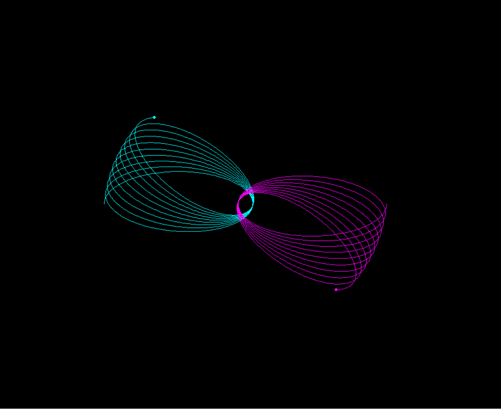 |  |

On the left, the two twin neutron stars (cyan and magenta, ~1.5 solar masses each) precess simultaneously around their common center of mass: there are only two bodies, no third attractor at the center; the “center” of the image is simply the midpoint of the system. On the right is a later stage of the same simulation: the overlap of the historical trails of the two precessions draws a shell-like pattern that is unplanned and emerged simply by allowing the history of the two orbits to accumulate on the screen.

| Wavefront Formation | Same time period, zoomed in |
|:---:|:---:|
| <video src="https://github.com/user-attachments/assets/719e9fea-ed25-4c43-80c3-796fcd6925ef" controls="controls" width="100%"></video> | <video src="https://github.com/user-attachments/assets/873bd2bb-6058-450d-a23b-013addb7fd5c" controls="controls" width="100%"></video> |

The first video shows a wavefront formation very similar to the one already seen for the EMRI. The second, covering the same interval but zoomed in, clearly reveals the two quadrupoles forming statically before and after the apocenter (the same “naked quadrupole” as in [§7.6.4](#764-case-study-the-dynamic-quadrupole-in-emri-at-the-apocenter), here doubled) and then rotating and merging in the violent emission at the pericenter.

As in the EMRI, but here more pronounced, the pair continuously alternates between **2nd-order dead reckoning** ([§3.2](#32-compensation-hybrid-dead-reckoning)) and the **2.5PN** bypass ([§6.3](#63-how-the-25pn-is-used-in-the-simulator)): the latter is activated only when $v_{rel} > 0.1c$ **and** the distance falls below $1000\ R_s$ from the source body (the exact threshold of the `is_gw` gate, [§6.3](#63-how-the-25pn-is-used-in-the-simulator)). For this pair, the second condition is almost always satisfied (even at apocenter, 4,000 km remains below $1000\ R_s\approx4.456$ km for each star), so the relative velocity is the sole determining factor: $v_{rel}\approx0{,}0103c$ at apocenter (below the threshold) versus $v_{rel}\approx0{,}2060c$ at pericenter (above the threshold). The 2.5PN therefore activates at every passage through the pericenter (not just once, as in comparable BBHs) and outside that window, only dead reckoning remains active; its truncation residue produces a braking effect *similar* to that of the 2.5PN, but not quantitatively equivalent, as discussed (with all due caution) in [§3.3](#33-the-balance-between-braking-and-thrust). As coalescence approaches, the entire orbit contracts and $v_{rel}$ increases everywhere, until the threshold remains exceeded even far from the pericenter: the jerky alternation of the first cycles thus fades into a continuous 2.5PN regime in the last second. This scenario, in addition to being rare to observe, is visually rich for this very reason: it is likely the interplay of the two mechanisms (not just one) that shapes the pattern.


### 7.7 The Nature of the Simulator’s Waves (Levels of Abstraction)

Now that we’ve covered the six families, let’s take a conceptual step back: what *are*, physically speaking, the waves seen in $d\Phi/dt$ ([§7.2](#72-time-derivative-dφdt)) and in GW Strain ([§7.6](#76-projected-strain-gw-quadrupole-strain)), and how much do they actually resemble the gravitational waves of General Relativity?

| dΦ/dt Heatmap | GW Strain Heatmap |
|:---:|:---:|
|  | <video src="https://github.com/user-attachments/assets/e61bc2a5-c188-4add-8e5d-3aed2efc135d" controls="controls" width="100%"></video> |
| **Temporal variation of the scalar potential ($d\Phi/dt$):** Maps the variation over time of the retarded causal gravitational potential: it indicates how much and where the scalar gravitational well of each body is shifting. The visible spiral fronts indicate the propagation at finite speed $c$ of these potential variations (the dipole induced by the motion of the sources). This visualization captures pure scalar radiation, which serves as a qualitative and visual analog for the chirp frequencies. | **Projected Strain (GW Quadrupole Strain):** Maps the tensor projection of the mass quadrupole’s gravitational strain. The alternating cyan and red lobes indicate the polarities of the quadrupole radiation projected along the observer’s line of sight, highlighting the actual spin-2 symmetry of the rotating binary system and eliminating spurious monopoles or gradients. |

**Where these waves are seen and what they really are.** 
The model does not solve Einstein’s field equations in spacetime to calculate the heatmaps. Instead, it offers two distinct levels of visual abstraction to represent the system’s energy radiation:

1. **The scalar analogue ($d\Phi/dt$):** It emerges spontaneously from the causal propagation of the potential alone. It does not calculate the quadrupole, but shows the phase wave generated by the rotating double dipole (that is, by the causal displacement of the pair’s individual gravitational wells) sharing with the physics of real gravitational waves only the orbital frequency and the phenomenon of spectral chirp.
2. **The projected quadrupole strain:** It explicitly calculates the projection of the quadrupole of the retarded velocities onto the observer’s plane, implementing the classical **quadrupole formula** (the standard weak-field and slow-motion approximation used to derive gravitational wave emission without solving the full field equations). This layer faithfully reproduces the quadrupole angular symmetry of real spin-2, eliminating spurious dipolar effects and providing a geometrically consistent picture of gravitational radiation.

The following table schematically summarizes the physical and geometric differences between real waves and the two simulator representations:

| Characteristic | Real Waves (General Relativity) | Scalar Analog $d\Phi/dt$ | Simulated Strain (GW Strain) |
|---|---|---|---|
| **Nature of the field** | **Spin-2** tensor field ( $h_{\mu\nu}$ ) | **Scalar** field ( $\Phi$ ) | Tensor field projected along the line of sight |
| **Polarizations** | Two independent polarizations ( $h_+$ and $h_\times$ ) out of phase by 45° | No polarization (pure scalar variation) | Single projected polarization (effective $h_+$) |
| **Physical source** | Temporal variation of the mass quadrupole ( $\ddot{Q}_{ij}$ ) | Motion and temporal variation of the monopole ( $\partial\Phi/\partial t$ ) | Kinetic projection of the quadrupole of each mass |
| **Angular symmetry** | Quadrupolar (four lobes alternating at 90°) | Dipolar around the single moving body | Pure quadrupolar ( $\ell=2$ with four alternating lobes) |
| **Propagation** | Tensor wave radiation at the speed of light $c$ | Phase waves of the retarded potential at speed $c$ | Retarded wavefront at speed $c$ |
| **Coupling** | Generated by asymmetric accelerations in the COM* | Also generated by uniform translational motion of the body | Cancels out for uniform motions of the COM* (subtracted from the code) |

\* COM (*Center of Mass*): the gravitational center of mass of the binary pair, used to subtract the overall translational velocity of the pair.

In summary, while the $d\Phi/dt$ mode serves as a simple qualitative indicator of wave motion, the quadrupolar strain projects the actual geometric imprint of the gravitational wave. This allows us to explore phase lobes and spirals in a physically consistent manner, without having to resort to complex numerical relativity simulations.

### 7.8 Summary: How Each Heatmap Converts Physics into Color

The simulator’s six heatmaps use normalization and color-mapping strategies that vary considerably, tailored to the **physical quantity** that each is designed to visualize. The following table schematically summarizes the actual calculations each kernel performs to determine the pixel color.

| Heatmap | Measured quantity | Normalization | Scale | Color mapping | User fader |
|---|---|---|---|---|---|
| **Φ** ([§7.1](#71-scalar-potential-φ)) | $\Phi = \sum_k GM_k/r_k$ (causal) | per-frame dynamics relative to $\Phi_{\max}$ (largest mass / effective radius) | **log₁₀**, 6-order-of-magnitude range | ramp with 3 sequential stops: deep blue → indigo → orange → white | none |
| **dΦ/dt** ([§7.2](#72-time-derivative-dφdt)) | $\partial\Phi/\partial t = \sum_k GM_k v_{rad,k}/r_k^2$ (causal) | gain calibrated on internal scale, modulated by the fader | $\tanh(\text{val})$ (asymptotic compression to $\pm 1$, no net saturation) | divergent: blue/cyan for approaching ( $+$ ), red for receding ( $-$ ) | yes (**GAIN**, $\pm$ , default $0$ on log₁₀ scale) |
| **Tidal Stress** ([§7.3](#73-tidal-stress-and-a-note-on-the-hessian)) | $\sigma = \sqrt{(\Phi_{xx}-\Phi_{yy})^2 + 4\Phi_{xy}^2}$ (discordant eigenvalues) | none (absolute scale in $(\text{m/s}^2)$ per meter, as described in [§7.3](#73-tidal-stress-and-a-note-on-the-hessian)) | **log₁₀** + User offset | 6 bands calibrated to real physical thresholds (material strength), linearly interpolated within each; legend can be opened with `M` | via astro_settings.ini |
| **Roche Topology** ([§7.4](#74-roche-topology-the-sign-of-the-determinant)) | two superimposed quantities: sign of $D = \Phi_{xx}\Phi_{yy} - \Phi_{xy}^2$ + modulus $\|\nabla\Phi_{\text{eff}}\|$ | $D$ dimensionless with respect to $\omega^4$ (natural scale of the co-rotating frame); normalized force on $f_{\text{norm}} = \tfrac{27}{4}q(1-q)\omega^2 r$ (characteristic scale L4/L5) | **log₁₀** clamped to $[-3,+3]$ for hue; **log₁₀** linear for brightness | hue determined by the sign of $D$: crimson → neon yellow ramp ($D<0$) or indigo → cyan ($D>0$); brightness = force, black core at stall points | yes (**sensitivity** + **contrast**) |
| **Lagrange Hunter** ([§7.5](#75-lagrange-hunter-determinant-and-inverse-hessian)) | $r_{\text{est}} = \|H^{-1}\nabla\Phi_{\text{eff}}\|$ (Newton-Raphson distance estimator) | conversion of $r_{\text{est}}/\text{camera scale}$ → distance in pixels | linear (no log: the estimate is already a distance) | Gaussian $\exp\!\big(-2(d/r_{\text{threshold}})^2\big)$ centered on the zero of the gradient; colored by the sign of $D$: red ($D<0$, L1/L2/L3) or blue ($D>0$, L4/L5) | yes (**sensitivity** → radius $r_{\text{threshold}}$ of the Gaussian) |
| **GW Strain** ([§7.6](#76-projected-strain-gw-quadrupole-strain)) | $h_{\text{total}} = \sum_k \frac{M_k \cdot h_{\text{proj}, k}}{r_k}$ (causal) | internally calibrated gain, modulated by the fader | $\text{asinh}(h \cdot \text{sensitivity})$ (compression to $\pm 1$) | divergent: cyan for positive strain ( $+$ ), red for negative strain ( $-$ ) | yes (sensitivity via Roche fader) |

> [!NOTE]
> **What about units of measurement?** There is no dedicated column because here SI quantities often lose their intuitive meaning, covering more orders of magnitude than an absolute number can convey: the visual priority is therefore the *dynamic range* (handled using logarithms) and the *topological sign*, not the unit. The exception is Tidal Stress, which is intentionally anchored to an intelligible unit, $(\text{m/s}^2)$ per meter, to compare tidal stress with the actual strength of materials. The actual units, value by value, are found in the field probe in [§7.9](#79-double-clicking-on-the-scene-telemetry-panel-and-field-probe-units-of-measurement).

> [!TIP]
> **Acoustic analogy: Dynamic compression ( $\text{asinh}$ ) vs. hard clipping ( $\tanh$ ).**
> The choice between compressing strain via $\text{asinh}$ and compressing potential via $\tanh$ corresponds exactly to the difference between two ways of processing an acoustic signal:
> - The **$\tanh$** behaves like a **hard clipper** (distortion filter): it maps values to a rigid range by asymptotically clipping the signal peaks beyond a low threshold. This is ideal in $d\Phi/dt$ for giving phase waves sharp, well-defined, and high-contrast contours, but it flattens the internal dynamics by rapidly saturating at maximum intensity.
> - The **$\text{asinh}$** behaves like a **dynamic mastering compressor**: it logarithmically attenuates monumental peaks in the near field, preventing them from burning out into a solid block of color, while leaving the weak signals in the far field linear, legible, and free to fade naturally into the blackness of cosmic space.

**Common Patterns**
- **Three heatmaps are retarded causal** (Φ, dΦ/dt, and GW Strain): they read the state of the sources from the L0/L1/L2 ring buffers at the retarded time $r/c$ and show how gravitational information (respectively: the monopolar well, its temporal variation, and the quadrupole projection) propagates through space at a finite speed. The other three (Tidal, Roche, Lagrange) are **snapshots**: they use current positions and velocities because they interpret the local geometry of the field, not its propagation.
- **The logarithm appears everywhere except in the Lagrange Hunter**: it is imposed by the physical range involved, which spans tens of orders of magnitude in all scalar maps (potential, time derivative, tidal stress, curvature of the effective potential).
- **Normalization is almost always “physical”**, not purely numerical: it is based on $\Phi_{\max}$, $\omega^4$, $f_{\text{norm}}$, or actual mechanical thresholds. The only absolute scale (without any normalization) is that of Tidal, because its ranges coincide with the strength of materials measured in the laboratory (silicates, ice, metals).

**Showcase: Alpha Centauri, the same frame in four modes**

| 1. dΦ/dt | 2. Roche topology |
|:---:|:---:|
| 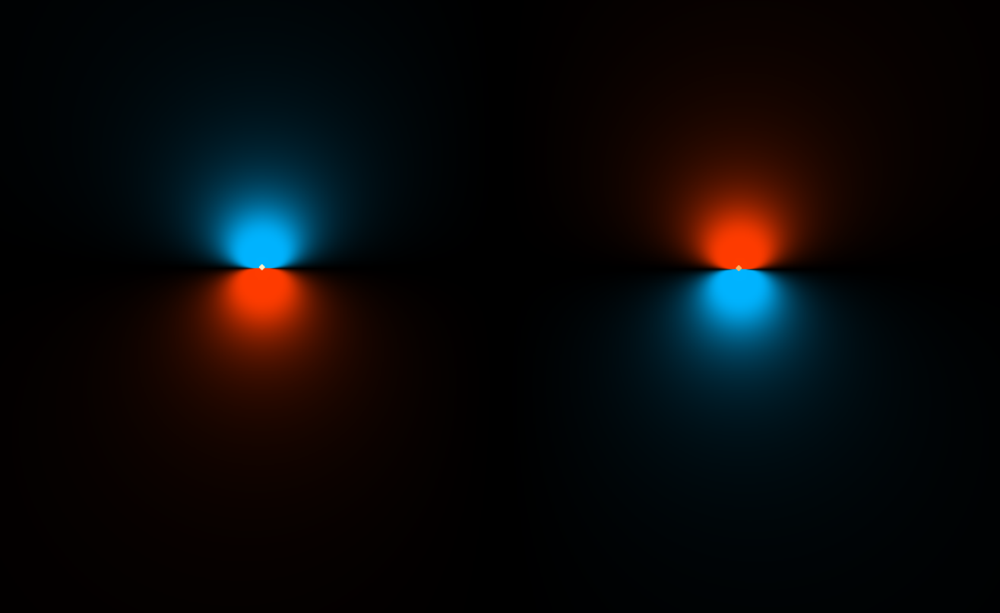 |  |

| 3. Lagrange Hunter | 4. Lagrange Hunter + overlay [M] |
|:---:|:---:|
| 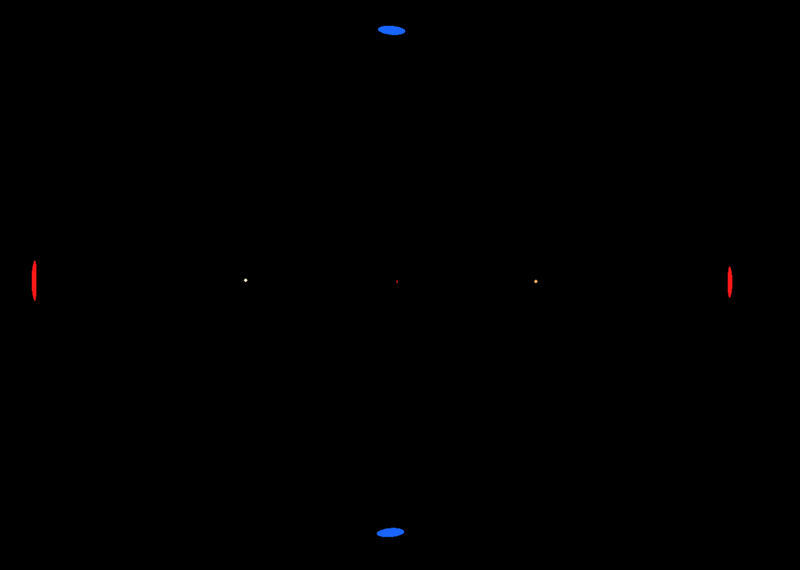 | 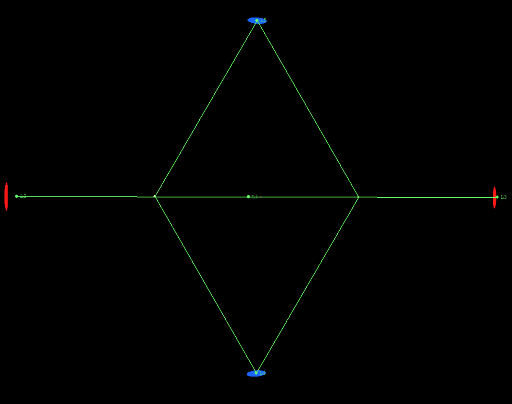 |

Alpha Centauri is the closest star system to the Sun (4.37 light-years), a triple star system in which A and B (shown here) form the close pair (respectively, a Sun-like G-type star (1.1 solar masses) and an orange K-type dwarf (0.9 solar masses)) in mutual orbit with a semi-major axis of ~23 AU and a period of ~80 years.

In the four previous examples, the exact same view of the **Alpha Centauri AB** binary system was presented, as seen in four modes selected from this chapter:

1. **dΦ/dt** ([§7.2](#72-time-derivative-dφdt)): the out-of-phase dipole; each star generates its own dipole, rotated by 180° relative to the other because they move in opposite directions around the center of mass.
2. **Roche topology** ([§7.4](#74-roche-topology-the-sign-of-the-determinant)): the classic two-lobed “hourglass,” with the narrow neck located precisely at L1.
3. **Lagrange Hunter** ([§7.5](#75-lagrange-hunter-determinant-and-inverse-hessian)): the five points that emerge, red for L1/L2/L3 and blue for L4/L5.
4. **Lagrange Hunter + overlay [M]**: the same, flanked by an overlay of analytical markers for direct comparisons.

These patterns are not unique to Alpha Centauri: they apply qualitatively to **any non-extreme binary system** (comparable masses, ordinary separation, no relativistic regime). This is therefore the “basic” case from which to start interpreting the heatmaps before tackling the compact scenarios in the following chapters.


### 7.9 Double-clicking on the Scene: Telemetry Panel and Field Probe (Units of Measurement)

The same action (the **double-click**) opens two different tools depending on the target: on a body, it displays its complete kinematic state (the Telemetry Panel shown below); the camera “locks onto” the body, tracking it, and two vectors appear (green for velocity and purple for force) while a double-click in empty space samples the field at that exact point and displays it in the console (the probe at the end of the paragraph). That’s where the units of measurement come into play again.

#### The Orbital Telemetry Panel (HUD)

The simulator does not merely display physics qualitatively via heatmaps, but shows the entire kinematic and dynamic state of any selected body in real time. This informational interface is called the **Orbital Telemetry Panel** (commonly referred to as the *flight dashboard* or *HUD*).

##### Activation and Operation
The HUD appears at the bottom of the screen and is activated by:
* **Double-clicking** on any of the bodies present in the scenario.
* Pressing the **[TAB]** key to cycle through all active bodies.

Once a body (referred to as the *target*) has been selected, the engine dynamically calculates its physical quantities both in absolute terms (referenced to the engine’s inertial origin) and in relative terms (referenced to the dominant gravitational attractor at that moment). The reference body is determined by calculating the local tidal force ($M/r^3$) to identify which mass exerts the predominant gravitational influence on the object (the same logic used to define the Hill sphere).

<div align="center"></div>

##### Parameters and Displayed Quantities
The telemetry panel is organized into columns that present the physical data calculated by the solver:

1. **Basic and Reference Data** (First column):
   * **TARGET**: Name of the selected body and its identifying color in the scenario.
   * **Mass**: Mass of the object in kilograms (expressed in scientific notation).
   * **Dist**: Identifier of the dominant reference body followed by the instantaneous distance expressed in a scaled format (kilometers or Astronomical Units) and highlighted in two ways: **CC** (*Center-Center*, i.e., the geometric distance between the centers of mass of the two bodies) and **SS** (*Surface-Surface*, i.e., the net distance between their respective physical surfaces, atmospheres, or event horizons, net of their visual radii). The conversion of this distance to screen pixels is also indicated.

2. **Absolute Position** (Second column):
   * **PX, PY**: Cartesian coordinates of the target expressed in a scaled format (kilometers or Astronomical Units) relative to the origin (relative zero) of the scenario’s coordinate system.

3. **Linear Velocity** (Third and Fourth columns):
   * **VX, VY, V (Abs)** (Absolute Velocity): Velocity vectors and magnitude of the object relative to the heliocentric/inertial simulation system. These show the object’s overall velocity within the system (e.g., the ~30 km/s of Earth’s orbit around the Sun).
   * **VX, VY, V (Rel)** (Relative Velocity): Velocity vectors and magnitude calculated relative to the main attractor (e.g., Orion’s speed of recession/approach relative to Earth, equal to ~2.04 km/s).

4. **Gravitational Acceleration** (Fifth and Sixth Columns):
   * **AX, AY, A (Abs)** (Absolute Acceleration): Vectors and magnitude of the total instantaneous acceleration experienced by the body, resulting from the sum of all gravitational attractions $O(N^2)$ (including the influence of the Sun).
   * **AX, AY, A (Rel)** (Relative Acceleration): Vectors and magnitude of the acceleration calculated net of the acceleration of the dominant attractor, highlighting differential and tidal forces.

#### The Field Probe: Double-click on empty space for true units of measurement

If the double-click does not hit any body, the engine does not open the HUD: it samples the field at that exact pixel and prints the result to the console (line `[SONDA]`). These are pointwise variants of the causal and instantaneous heatmaps in this chapter; the same rendering kernel mathematics is applied to a single point rather than the entire grid, where they actually return a color rather than a number.

| Quantity | Native unit printed | Readable equivalent |
|---|---|---|
| **Φ** ([§7.1](#71-scalar-potential-φ)) | $\text{km}^2/\text{s}^2$ | numerically identical to $\text{MJ/kg}$ (specific energy) |
| **dΦ/dt** ([§7.2](#72-time-derivative-dφdt)) | $\text{km}^2/\text{s}^3$ | the code itself already converts this to $\text{kW/kg}$ (specific power, ×1000) before printing it |
| **Tidal Stress** ([§7.3](#73-tidal-stress-and-a-note-on-the-hessian)) | $\text{s}^{-2}$ | the same number read as $(\text{m/s}^2)$ per meter, the unit in the legend of §7.3 |
| **GW Strain** ([§7.6](#76-projected-strain-gw-quadrupole-strain)) | dimensionless | already readable as is: it is a fraction of spatial deformation; no conversion necessary |

An asymmetric constraint completes the picture: the first three probes work at any point in the scenario; the GW Strain line appears in the console only if a pair is already locked (the same target/attractor as in the Roche/Lagrange overlay), because the strain of a pair is not defined until you know which pair it is.

---

## 8. The LIGO/Virgo Analyzer: From Kinematic Proxy to Spectrum

First, a necessary clarification: calling the probe “LIGO” and the pipeline the “LIGO/Virgo analyzer” is a **conceptual homage** to the real detectors that ushered in this era of astronomy, not a claim of instrumental equivalence. The probe does not simulate interferometry, orthogonal arms, or instrumental noise: it borrows their role (recording the strain at a point in space) and their terminology. That said, this section describes what LIGO and Virgo are and how they have been conceptually virtualized in the simulation probe. Next, the analysis pipeline (`ligo_analyzer.py`), built on standard functions from `scipy.signal` (SciPy: the standard Python library for scientific computing, used here for signal processing).

### 8.1 The Analogy with LIGO and Virgo on Earth

The real detectors on Earth (such as LIGO in the United States or Virgo in Italy) are gigantic “L”-shaped laser interferometers with two perpendicular arms 3 or 4 km long. When a gravitational wave passes through the detector, it compresses space along one arm and stretches it along the other.

LIGO and Virgo measure this very small relative change in the length of the arms, called **strain ( $h$ )**:

$$h = \frac{\Delta L}{L}$$

The **virtual LIGO probe** in the simulator represents the exact software analog of this process:
* It is positioned **by the user**, in real time, at any point on the screen (2D space).
* At every instant in time, it records a strain value $s(t)$ that represents the local intensity of this deformation (the stretching and compression of space) caused by the motion of the masses in the binary system.

That raw signal $s(t)$ is all the probe produces: it is then the **analysis pipeline** ([§8.8](#88-the-analyzers-analysis-pipeline-ligo_analyzerpy)) that cleans it up, processes it, and transforms it into the spectrograms and estimates that appear as graphs in this guide.

### 8.2 What Is the Mass Quadrupole Moment? (Two Perspectives on the Quadrupole)

To understand what the quadrupole is, it is helpful to look at it from two perspectives: how it is generated by the source (physics) and how it distorts space as it propagates (geometry).

**From the source’s perspective (why the masses must orbit):** In electromagnetism, radiation is produced primarily by an oscillating dipole (a positive and a negative charge moving toward and away from each other). In gravity, there is no such analogue, not only because there is no “charge” of opposite sign: the reason is more compelling. The mass dipole moment of the system is $d_i = \sum_a m_a x_{a,i}$, whose first derivative is the total momentum, $\dot d_i = P_i$. For an isolated system, $P_i$ is conserved, so $\ddot d_i = \dot P_i = 0$ **always**, regardless of the internal motion of the masses: this is not an intensity limit; it is an exact identity imposed by the conservation of momentum. The quadrupole (below) is the first moment that is not constrained by this identity. This is why the lowest possible gravitational emission requires masses in orbit, not simple oscillation.

**From the wave’s perspective (how spacetime is distorted):** An electromagnetic wave is a *vector* field (spin-1): at the point it passes through, the field oscillates along an axis, and a test charge is pushed back and forth along that direction. A gravitational wave is a *tensor* field (spin-2): it does not push points in one direction; rather, **it changes the relative distances between them**. It stretches space along a transverse axis and simultaneously compresses it along the orthogonal axis, reversing the cycle with every half-oscillation. A ring of test particles struck by the wave deforms into an ellipse that pulses by alternating the axes. It is this cross-shaped deformation (which returns to its identical state after a 180° rotation (and not a 360° rotation, as would occur for a vector field)) that constitutes the spin-2 nature mentioned in section [§7.7](#77-the-nature-of-the-simulators-waves-levels-of-abstraction).

The mass quadrupole moment (in its discrete form, $I_{ij} = \sum m_a x_{a,i} x_{a,j}$) measures precisely the geometric distribution of matter. If the system possesses perfect spherical or axial symmetry with respect to the axis of rotation (such as a single, smooth star rotating on its axis), its quadrupole moment remains constant and there is no radiation. 
For emission to occur, there must be a **deviation from spherical symmetry** (a “bulge” or a multi-body system). Even a binary system consisting of two identical twin masses in a perfect circular orbit generates waves: as they orbit, the distribution of matter shifts cyclically from the X-axis to the Y-axis and back again. This continuous geometric redistribution causes $I_{ij}$ to vary over time, rippling the surrounding spacetime and propagating the wave.

### 8.3 The “Disguised” 3D Formula and the Orthogonal Projection onto the Plane

An important premise: in General Relativity, **there are no propagating gravitational waves in 2+1 dimensions** (gravity has no local degrees of freedom in the plane), so *there is no “2D quadrupole formula”* to apply. This is a well-known fact in theoretical physics, stated by Steve Carlip as: *“there are no propagating gravitational degrees of freedom”* in his paper [*Lower dimensional gravity*](https://phys.libretexts.org/Bookshelves/Astronomy__Cosmology/Supplemental_Modules_%28Astronomy_and_Cosmology%29/Cosmology/Carlip/Lower_dimensional_gravity).

Unlike the gravity in the model ([§1.1](#11-what-the-engine-actually-solves)), where a natively two-dimensional law exists ( $1/r$ in a true 2D universe) but is deliberately discarded in favor of the true three-dimensional one ( $1/r^2$ ), here there is no 2D law to discard: Carlip demonstrates that it simply does not exist, so the only physically sensible option is to import the 3D formula and project it using a precise geometric convention.

The formula used is the **standard 3D quadrupole formula by Einstein (1918)**, adapted to 2D. This well-known technique assumes that the system orbits in the equatorial plane ($z = 0$), which identically sets all height-related terms to zero ($I_{zz} = 0$: in the discrete form used here, every term containing $z$ cancels out, and the quadrupole reduces to a 2×2 block in the plane) and posits a LIGO probe placed directly on the polar orbital axis (along the $z$-axis, oriented *perpendicular to the plane* or *axially*). In this geometric configuration, the 3D formula projects exactly onto our plane as:

$$h_+ \propto \ddot{I}_{xx} - \ddot{I}_{yy}$$

where $I_{ij} = \sum_a m_a\, x_{a,i}\, x_{a,j}$ (the same discrete form as in [§8.2](#82-what-is-the-mass-quadrupole-moment-two-perspectives-on-the-quadrupole)). By analytically expanding the second time derivative using the product rule, we obtain the complete real quadrupole formula:

$$\ddot{I}_{xx} - \ddot{I}_{yy} = 2\sum_j m_j\Big[\,\underbrace{(v_{x,j}^2 - v_{y,j}^2)}_{\text{velocity component}} + \underbrace{(x_j\,a_{x,j} - y_j\,a_{y,j})}_{\text{acceleration component}}\,\Big]$$

The complete formula therefore contains two physical contributions: one related to the velocities of the bodies and one related to their accelerations.

In the simulator, however, to calculate the strain recorded by the probe, we will use **only the component related to velocities**, completely excluding the contribution of accelerations. This choice allows us to obtain an extremely clean signal free of computational noise: the technical reasons behind the exclusion of accelerations will be discussed in detail in **[§8.5](#85-the-numerical-problem-of-acceleration-and-kinetic-regularization)**. It is worth noting in advance that this same formula, applied pixel-by-pixel and projected along the direction of observation, is at the heart of the **GW Strain** heatmap in [§7.6](#76-projected-strain-gw-quadrupole-strain): the LIGO probe is its *pointwise* version (a single number $s(t)$ for the point where it is placed), while the heatmap is its *spatial* version (a tensor projection of the quadrupole onto the observer’s plane).

### 8.4 What the Virtual Probe Records (The Velocity-Based Proxy)

At each tick, the virtual probe records, as a single scalar value for the point where it is placed, a **velocity-based proxy for the strain** derived from the quadrupole formula ([§8.3](#83-the-disguised-3d-formula-and-the-orthogonal-projection-onto-the-plane)). The same formula, applied point by point across the entire plane and projected along the $\hat n$ observer-pixel direction, generates the **GW Strain** heatmap from [§7.6](#76-projected-strain-gw-quadrupole-strain), which is its spatial equivalent at full projected tensor resolution. For the probe, the expression is:

$$s(t) = \sum_j \frac{m_j\,(v_{x,j}^2 - v_{y,j}^2)}{r_j}$$

where the velocities are referenced to the center of mass. The reason this proxy captures the correct frequency is straightforward: for a circular orbit, the velocities oscillate as $v_x = -v\sin(\omega t)$ and $v_y = v\cos(\omega t)$, so

$$v_x^2 - v_y^2 = -v^2\cos(2\omega t)$$

oscillates at $2\omega$, that is, **exactly the frequency of the gravitational wave** (twice the orbital frequency). The probe also always reads the high-resolution L0 buffer, never the compressed levels, to avoid introducing aliasing in the waveform.

> [!NOTE]
> **"Playful" geometric compromise:** Although Einstein’s formula with orthogonal projection assumes an observer positioned “above” the system (on the $z$-axis), for obvious playful and interactive reasons, the user places the LIGO probe directly on the screen (the 2D plane), which is playfully assumed to be “perfect” regardless of the actual angle. The simulator combines these two aspects by calculating the decay of the wave amplitude ($1/r$) using the simple two-dimensional distance on the screen: $r = \sqrt{dx^2 + dy^2}$.

### 8.5 The Numerical Problem of Acceleration and Kinetic Regularization

Why does the model retain only the velocity component while excluding the acceleration component?
Quite simply: **the complete formula does not work numerically.**

Although the term containing the accelerations correctly tracks the physical frequency of the wave, it introduces a serious numerical instability in the strain just before the moment of collision (*merger*). In this regime of extreme gravity ( $r \to 0$ ), even when using the true accelerations calculated directly by the physics engine (rather than estimated via finite differences), the explosion of gravitational forces diverging as $1/r^2$ at discrete time steps ( $dt$ ) produces inevitable spikes and very high-frequency fluctuations in the instantaneous acceleration. The result is a strain signal that diverges and oscillates violently (as shown in the analyzer graphs), compromising signal cleanliness.


*The strain calculated using the complete quadrupole formula (velocity + accelerations): the recorded scenario is the simulated GW170817 from [§6.6](#66-the-evidence-comparison-with-actual-data).*

However, if we try eliminating the derivative of the accelerations and keeping only the velocity component ($v_x^2 - v_y^2$), we obtain an ideal strain: smooth, clean, and stable.


*The same scenario (the simulated GW170817), using only the velocity proxy.*

This simplification is, to all intents and purposes, a **practical approximation**. From a physical standpoint, it is based on an identity that holds strictly only for perfectly circular orbits: in that limiting case, the centripetal acceleration always points toward the center of the orbit ($a \propto -r$), making the acceleration term and the velocity term identical at every instant:

$$x \cdot a_x - y \cdot a_y = v_x^2 - v_y^2$$

This halving is clearly visible when comparing the two images above: the oscillation of the “clean” strain (a proxy for velocity) has a maximum amplitude that is half that of the complete theoretical strain, but the peaks, troughs, and zero crossings occur at exactly the same instant, preserving phase coherence intact. Furthermore, from a computational standpoint, velocity is much more stable: since it is the (integral) accumulation of accelerations step by step, it acts as a sort of moving average that “smooths out” the numerical bumps and jumps resulting from the simulator’s discrete grid.

Of course, this is an approximation: for highly eccentric orbits or chaotic systems, the two terms would not be equivalent at all, but for capturing the frequency modulation typical of mergers (where orbits tend to circularize rapidly before the collision), it proves to be an effective and clean engineering compromise.

> [!NOTE]
> **Limitations of the formalism and author’s note:** As a programmer rather than a theoretical astrophysicist, the mathematical complexity of the quadrupole formalism in General Relativity exceeds my expertise to thoroughly investigate the analytical causes of this discrepancy. I therefore limit myself to documenting and presenting my practical solutions and observations.

### 8.6 The Sharp Truncation of the Strain (The Absence of Ringdown)

It is easy to see that in the time plots of the simulated strain (and in the corresponding spectrograms), the signal **abruptly and suddenly cuts off** at the moment of collision, unlike real waveforms, which exhibit a damping tail. This behavior is an intrinsic physical limitation of our N-body model.

In real gravitational waves emitted by a coalescence (CBC), the signal goes through three distinct phases:
1. **Inspiral**: The two masses spiral inward toward each other. The wave’s frequency and amplitude increase rapidly (the *chirp* phase).
2. **Merger**: The two bodies physically merge into a single, deformed final object.
3. **Ringdown**: The newly formed body (e.g., a perturbed black hole) oscillates in its quasi-normal modes (“vibrates”), radiating its geometric asymmetry in the form of exponentially damped gravitational waves, until it stabilizes into a final spherical or Kerr configuration (gravitational silence).

Why does the strain stop abruptly in the model?
* The computational engine calculates the strain based on the relative positions and velocities of the bodies, treating them as **material points** or rigid spheres.
* At the moment of geometric contact (the merger), the binary system instantly ceases to exist: the two bodies are merged by the collision algorithm into a single static object (in practice, one of the sources is removed and the other is updated and repositioned).
* Since there is no dynamic simulation of the spacetime field (which would require solving Einstein’s equations of full numerical general relativity to calculate the oscillations of a perturbed event horizon), the emission instantly drops to zero.
* Consequently, the strain is **abruptly cut off** (cut-off) at the moment of contact, completely skipping the **ringdown** phase, which represents a relativistic post-merger signature.

<div align="center">
  
</div>

### 8.7 What Is a Spectrogram and How Is It Obtained

Before diving into the details of the code, let’s understand the analyzer’s main visual tool: the **spectrogram**.

#### What It Is and the Musical Metaphor
A wave signal recorded over time (the *strain*) is like an audio track: a sequence of oscillations. 
* If we look only at the graph over time, we see the wave oscillating, but it’s hard to tell exactly what frequency is present at any given moment.
* If we perform a classic **Fourier transform** on the entire signal, we discover *which* frequencies are present in total, but we lose all information about *when* (we don’t know at which moment a certain note was played).

The **spectrogram** solves this problem by combining time and frequency. It is the equivalent of a **musical staff**:
* The horizontal axis ( $x$ ) is **time**.
* The vertical axis ( $y$ ) is **frequency** (the pitch of the note, from low to high).
* The **color** (the third dimension, expressed in decibels, dB) indicates the **intensity** or power of that specific frequency at that moment (how loudly the note is played).

* **The Strain as a WAV File**: The strain $s(t)$ recorded by the virtual probe is nothing more than a single-channel (mono) digital audio signal. Just as a `.wav` audio file records fluctuations in air pressure over time at a certain sampling rate (e.g., 44.1 kHz), the strain records the metric fluctuations of spacetime sampled in the simulator at a high frequency ( $1\text{ MHz}$ ).
* **The Spectrogram as a Visual Equalizer**: The spectrogram does exactly what a spectrum analyzer in a recording studio (or the graphic display of an equalizer) does: it shows which frequencies (high, mid, or low) are present in the signal and at what volume (dB) at any given moment.
* **The Chirp as a Glissando**: From an acoustic standpoint, a gravitational merger is, to all intents and purposes, an ascending **glissando** (similar to a whistle that rapidly rises in pitch until it stops abruptly at the moment of merger).

#### Why LIGO and the probe use it
Merger signals are **chirps**: transient signals in which both amplitude and frequency increase rapidly as the two compact objects spiral toward collision. 

In the raw time strain, this signal is often completely buried by noise (both seismic/thermal noise in real ground-based detectors and discrete grid noise in the virtual probe). The spectrogram is essential because it allows us to **visually identify the signal in a qualitative manner**: while background noise is distributed randomly across the entire time-frequency map like random noise, the coherent energy of the chirp is concentrated along a well-defined trajectory. The signal thus emerges in the form of a characteristic **bright curve rising upward** (the spectral “signature” or *track* of the merger), making it immediately recognizable to the human eye or to pattern recognition algorithms even under conditions of heavy noise.

Here is a direct comparison between the simulated and real chirps:

* **The simulated (clean) chirp**: This image shows the spectrogram of the strain recorded by the virtual probe in a neutron star binary scenario (GW170817), focused on the last **0.5 seconds** before the merger. Since this is pure simulation data, the spectral trace of the chirp is perfectly sharp and free of background noise.

  

* **The real (noisy) chirp from LIGO Hanford**: This image shows the real spectrogram obtained from public data from the LIGO Hanford (H1) detector for the same event (GW170817), focusing on the last **1.75 seconds** before the merger. Here, you can see how the real chirp (the rising frequency ramp) is embedded in the instrumental background noise but remains clearly identifiable thanks to the visual contrast of the spectrogram.

  


#### How It’s Obtained: The STFT (Short-Time Fourier Transform)
Mathematically, the spectrogram is obtained using the **STFT (Short-Time Fourier Transform)**. The process consists of three main steps:
1. **Time Windowing**: The complete signal is divided into short-duration time segments (for example, intervals of a few milliseconds), which partially overlap one another to prevent loss of information at the boundaries. Each segment is multiplied by a smoothing function (such as the *Hann window*), which gently smooths the signal to zero at the beginning and end of the interval, preventing sharp cuts from introducing spurious frequencies that do not exist (a phenomenon known as *spectral leakage*).
2. **Local Spectral Analysis (FFT)**: The *Fast Fourier Transform* (FFT) is applied to each windowed segment. This algorithm converts the signal portion from the time domain to the frequency domain, calculating the amplitude of each individual spectral component present exclusively within that specific time window.
3. **Time-frequency mapping**: The spectra calculated for each individual segment are arranged in columns, one after another, in chronological order. This two-dimensional data matrix is then visualized by coloring the intensity of each point (in decibels), generating the final spectrogram map.

> [!TIP]
> ### In-Depth: The "Sound" of Gravitational Waves
> The idea of "listening" to the Universe through gravitational waves is not a journalistic invention, but has a solid foundation in physics and electroacoustics:
> 
> * **Physical Correspondence**: The strain $h(t)$ measures a metric fluctuation of spacetime (a physical compression and expansion of space), conceptually entirely analogous to how an acoustic pressure wave compresses and expands air.
> * **Audible frequency range**: The frequency of gravitational waves emitted during the mergers of compact binary systems (stellar black holes or neutron stars) falls precisely within the **range audible to the human ear** (from about $20\text{ Hz}$ to over $1\text{–}2\text{ kHz}$). For example, the historic first detection **GW150914** spanned the $35\text{-}250\text{ Hz}$ band (see the discovery paper: B. P. Abbott et al., LIGO Scientific Collaboration and Virgo Collaboration, [Phys. Rev. Lett. 116, 061102 (2016)](https://journals.aps.org/prl/abstract/10.1103/PhysRevLett.116.061102) / free preprint [arXiv:1602.03837](https://arxiv.org/abs/1602.03837)), while the neutron star merger **GW170817** reached approximately $2\text{ kHz}$ .
> * **Direct sonification**: Since the recorded strain signal is a high-frequency time series, sending the appropriately filtered and amplified data trace to a loudspeaker (by mapping the strain to the drive voltage) causes the speaker coil to vibrate, physically reproducing the sound in the air.
> The sonification of gravitational waves is an active area of research internationally. Among the most prominent centers is the [European Gravitational Observatory (EGO)](https://www.ego-gw.it/) in Cascina (Pisa), home to the Virgo detector, which is active in developing projects and installations for the sonification of interferometric data. For an interactive library of real sonifications, see the [Sounds of Spacetime](https://www.soundsofspacetime.org/) portal. When the media run headlines such as *“Here is the sound of two black holes colliding,”* they are describing a direct, physically grounded electroacoustic translation, not an arbitrary metaphor.


---

### 8.8 The Analyzer’s Analysis Pipeline (`ligo_analyzer.py`)

The raw signal is noisy and needs to be cleaned up (it is dominated by a slow, low-frequency background drift). The complex mathematics behind the filtering techniques has been delegated to the **standard filters provided by `scipy.signal`**, in the order suggested by common practice. The pipeline cleans up and interprets the signal in successive steps:

1. **Detrend + Tukey window** (`scipy.signal.windows.tukey`). The mean offset is removed and the edges of the buffer are “smoothed” to prevent discontinuities at the edges from creating spectral artifacts.
2. **Automatic gatekeeper.** A classifier determines whether the signal is a coherent chirp (**SPECTRAL** branch) or a pulse/noise (**RADIOMETRIC** branch). In radiometric mode, it skips filtering and the spectrogram and displays the **raw strain over the entire recorded time** (absolute time axis, not zoomed in on the merger), alongside the **cumulative radiated energy** curve.
3. **Butterworth high-pass filter (5 Hz)** (`scipy.signal.butter` + `sosfiltfilt`, zero-phase). It cuts off the sub-Hz background drift, isolating the orbital oscillation.
4. **STFT spectrogram** (Short-Time Fourier Transform; `scipy.signal.spectrogram`, Hann window, 95% overlap, zero-padding). This produces a high-resolution time-frequency map: this is where the chirp appears as a rising curve.
5. **Instantaneous frequency via the Hilbert transform** (`scipy.signal.hilbert`). This constructs the analytic signal, from which the phase (and thus the **instantaneous frequency** $f(t)$) is extracted, then smoothed with a Savitzky-Golay filter (`scipy.signal.savgol_filter`).
6. **Estimation of the chirp mass.** From the frequency trace, $\mathcal{M}$ is estimated by directly fitting the **Peters power law** $f(\tau)\propto\tau^{-3/8}$ to the clean window before the merger (median of the point-by-point estimates), rather than using a linear regression of $\dot{f}$ against $f$: the latter amplified the chirp curvature into a systematic error, whereas the power law fit recovers the expected chirp mass almost exactly.

> **Note.** This is the part where I relied most heavily on external libraries and advice (drawn primarily from LLM and online material on the *practical* use of scipy): I always knew exactly *what* I was looking for (a clean chirp and its chirp mass), but fine-tuning the DSP (Digital Signal Processing) cleanup is beyond my full control.

*(All functions mentioned are in the official documentation for [`scipy.signal`](https://docs.scipy.org/doc/scipy/reference/signal.html) and [`scipy.optimize`](https://docs.scipy.org/doc/scipy/reference/optimize.html).)*


**Showcase, Spectrogram of GW150914.** STFT (Short-Time Fourier Transform) of the detector strain with the simulated chirp curve overlaid on Peters’ theoretical curve: the simulated trace follows the spectral *ridge* of the real event along the entire frequency rise, from the initial $\sim 30$ Hz up to the peak of $\sim 250$ Hz at merger.

---

## 9. Initialization of Scenarios: Analytical Calculation of Orbits

To ensure that the orbits start exactly with the desired geometry (circular, elliptical, parabolic) or at the correct gravitational equilibrium points, all initial conditions are rigorously calculated using analytical solutions, implemented directly in the `utils/orbital_math.py` module.

### 9.1 Orbital and escape velocities in the Paczyński-Wiita potential
In the PW potential ([§6.1](#61-the-paczyński-wiita-pseudo-potential)), the characteristic velocities of a test body at a distance $r$ from a source mass $M$ (with Schwarzschild radius $R_s = 2GM/c^2$) differ from the classical Keplerian velocities:

* **Relativistic circular velocity**: These are derived by equating the centripetal acceleration $v^2/r$ with the gravitational force per unit mass of the PW potential:
  $$\frac{v^2}{r} = \frac{GM}{(r - R_s)^2} \implies v_{circ} = \frac{\sqrt{G M r}}{r - R_s}$$
* **Escape velocity**: This is derived by requiring that the specific orbital energy be zero ($E = 0$), i.e., that the kinetic energy equals the potential energy PW:
  $$\frac{1}{2}v_{escape}^2 = \frac{GM}{r - R_s} \implies v_{escape} = \sqrt{\frac{2GM}{r - R_s}}$$

### 9.2 Launch at the Apocenter or Pericenter
To establish a specific elliptical orbit characterized by a pericenter $r_{peri}$ and an apocenter $r_{apo}$, the initial velocity at launch is obtained by analytically solving the system formed by the **conservation of total energy** and **angular momentum** in the PW potential:
* **Launch at the apocenter** (to cause the body to “fall” to the desired pericenter):
  $$v_{apo} = \sqrt{\frac{2 G M (r_{apo} - r_{peri})}{(r_{apo} - R_s)(r_{peri} - R_s) \left[ \left(\frac{r_{apo}}{r_{peri}}\right)^2 - 1 \right]}}$$
* **Launch from the pericenter** (to cause the body to rise to the desired apocenter):
  $$v_{peri} = \sqrt{\frac{2 G M (r_{apo} - r_{peri})}{(r_{apo} - R_s)(r_{peri} - R_s) \left[ 1 - \left(\frac{r_{peri}}{r_{apo}}\right)^2 \right]}}$$

### 9.3 Escape Velocity for Compact Binary Systems (Close Pairs)
While [§9.1](#91-orbital-and-escape-velocities-in-the-paczyński-wiita-potential) describes the circular motion of a **negligible test mass** around a single massive attractor center $M$, this section solves the **true two-body problem** with comparable masses ($m_1 \approx m_2$), such as a pair of black holes or neutron stars.

In this scenario, each body is subject to the Paczyński-Wiita potential generated by the other, calculated from the individual Schwarzschild radii $R_{s1} = 2Gm_1/c^2$ and $R_{s2} = 2Gm_2/c^2$. Furthermore, the formula takes into account the softening factor $S_{soft}$ used by the physics kernels to prevent numerical divergences at zero distance:

* Once the softened effective radius $d = \sqrt{r^2 + S_{soft}^2}$ is defined (with $S_{soft}^2 = 100\ \text{km}^2$, i.e., the 10-km softening from [§6.1](#61-the-paczyński-wiita-pseudo-potential)) is defined, the orbital angular frequency $\omega$ of the binary system is calculated by summing the contributions of the individual potentials:
  $$\omega^2 = \frac{G m_2}{d (d - R_{s2})^2} + \frac{G m_1}{d (d - R_{s1})^2}$$
* The relative orbital velocity at launch is therefore calculated as $v = r \cdot \omega$.

### 9.4 Analytical Lagrange Points (Restricted Circular Three-Body Problem)
The theoretical positions of the 5 Lagrange points for a binary pair of masses $m_1$ and $m_2$ ( $m_1 > m_2$ ) are calculated using closed-form expansions and geometric coordinates rather than a numerical search for zeros:

* **Collinear points ($L_1, L_2, L_3$)**: Given the distance between the bodies $r$, the mass fraction $\mu = m_2 / (m_1 + m_2)$, and the dimensionless Hill sphere parameter $\alpha = (\mu/3)^{1/3}$, the positions relative to the center of mass along the system’s axis are:
  * **$L_1$** (inner saddle point, between the two bodies): $x_{L1} = x_{2} - r \cdot \alpha (1 - \alpha/3)$
  * **$L_2$** (external, beyond the smaller mass $m_2$): $x_{L2} = x_{2} + r \cdot \alpha (1 + \alpha/3)$
  * **$L_3$** (opposite, beyond the larger mass $m_1$): $x_{L3} = -r (1 + \frac{5}{12}\mu)$
* **Triangular points ($L_4, L_5$)**: These are located exactly at the vertices of the two equilateral triangles with base $m_1 - m_2$ (i.e., at an angle of $\pm 60^\circ$ and a distance $r$ from $m_1$). The direction of rotation (whether to add $+60^\circ$ or $-60^\circ$ to define which is $L_4$ or $L_5$) is calculated dynamically using the sign of the cross product of the relative velocities of the two bodies.

### 9.5 Co-rotating Velocity at Lagrange Points
When a satellite is generated at a Lagrange point (or at any co-rotating point), it must have the rotational velocity of the reference frame fixed to the binary pair in order not to be immediately flung away. This drag velocity is calculated as follows:
1. Calculate the instantaneous angular velocity of the binary system:
$$\omega = \frac{(\vec{r}_2 - \vec{r}_1) \times (\vec{v}_2 - \vec{v}_1)}{|\vec{r}_2 - \vec{r}_1|^2}$$
2. The corotational velocity is obtained by adding the velocity of the system’s center of mass ( $\vec{v}_{\text{bary}}$ ) to the angular velocity applied to the radius relative to the center of mass itself ( $\vec{R} = \vec{r}_{\text{spawn}} - \vec{r}_{\text{bary}}$ ):
$$\vec{v}_{\text{corot}} = \vec{v}_{\text{bary}} + \vec{\omega} \times \vec{R}$$

### 9.6 Why do the theoretical overlay and the dynamic heatmap coexist?
In the simulator, the Lagrange points are displayed on screen in two overlapping modes: via precise geometric markers (**theoretical overlay**, derived in [§9.4](#94-analytical-lagrange-points-restricted-circular-three-body-problem)) and via a continuous spectral map (**dynamic heatmap**, based on the inverse of the Hessian described in **[§7.5](#75-lagrange-hunter-determinant-and-inverse-hessian)**). This coexistence addresses important physical and interaction requirements:

1. **Comparison between the ideal model and real physics**: The theoretical overlay assumes a perfectly circular orbit free of external perturbations. In the true simulation, orbits may be eccentric or affected by the gravitational pull of other planets. The heatmap shows where the local minima and saddle points of the instantaneous effective potential *actually* lie, while the theoretical overlay serves as a fixed ideal benchmark for measuring, at a glance, the deviation caused by perturbations.
2. **Point Identification**: The heatmap identifies force gradients but does not assign textual labels. The theoretical overlay serves as an immediate visual guide for naming and quickly locating the general position of individual regions ( $L_1 \dots L_5$ ).
3. **Visibility Limit for Extreme Mass Ratios**: When the mass ratio between the two bodies is hundreds of thousands to one (e.g., Sun-Earth: the Earth is about 330,000 times lighter than the Sun), the points **$L_3$, $L_4$, and $L_5$ almost completely disappear from the heatmap**. The gravitational influence of $m_2$ at such a great distance is so weak that the potential wells at $L_4$/$L_5$ and the saddle point at $L_3$ have gradients that are nearly zero, blending entirely into the flat background of the orbit. In contrast, $L_1$ and $L_2$ (being immersed in the Hill sphere of $m_2$ and located in its immediate vicinity) remain clearly visible as local peaks. In these extreme cases, the theoretical overlay becomes the only visual marker for quickly identifying $L_3$, $L_4$, and $L_5$ on the screen.

| Theoretical L5 vs. Emerged L5 (Moon-Earth) | L3/L4/L5 at the Limit of Visibility (Venus-Sun) |
|:---:|:---:|
|  | 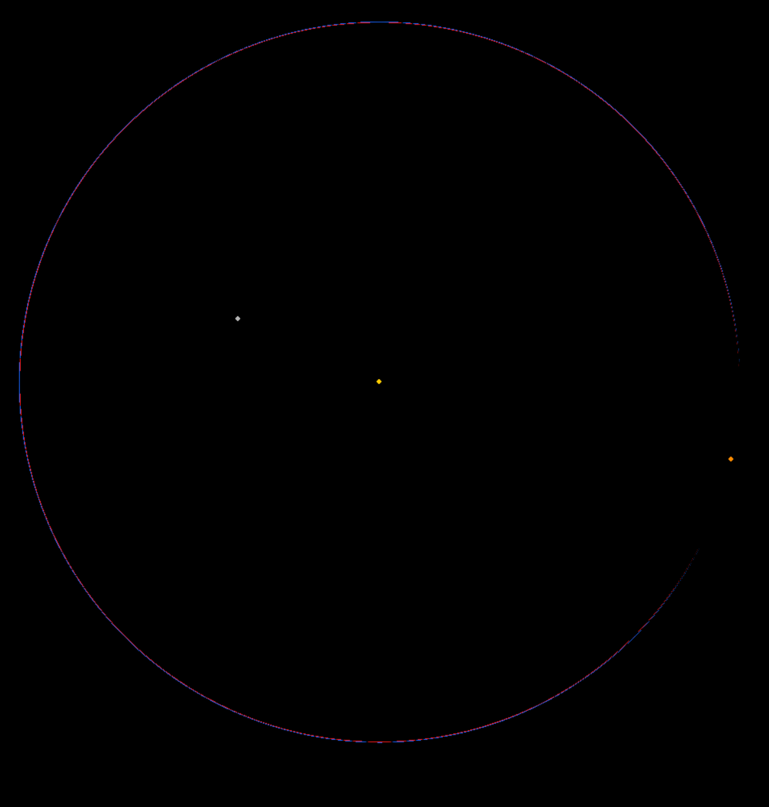 |
| A clear example of a discrepancy between the theoretical Lagrange point and the point *detected* by the Lagrange Hunter (in blue, Moon-Earth L5 point). | The example from point 3 above: in the Venus-Sun system, the signals from L3, L4, and L5 are so weak that they spread out along the thin line of low force running along the orbit (the boundary of the Roche lobe), without ever standing out from it as distinct points; only the theoretical overlay can identify them. |

> [!NOTE]
> **Physical stability of Lagrange points:**
> * **L1, L2, L3 (Intrinsically unstable)**: These are gravitational saddle points. A satellite positioned at these points is in a perpetually unstable equilibrium: any minimal perturbation (numerical or gravitational) will cause it to deviate and drift away indefinitely (in reality, they require engine firings for active orbital corrections).
> * **L4, L5 (Stable)**: If the mass ratio of the binary system is high ( $m_1/m_2 > 24.96$ ), these points behave as true potential wells. Bodies captured within them orbit stably over the very long term without requiring any corrective propulsion.

> [!TIP]
> **The optimal “boot” strategy for launch:**
> The simulator allows you to generate satellites directly at the coordinates of the **theoretical overlay**. However, in real, eccentric systems, the real physical points (visible on the heatmap) oscillate and follow trajectories around the ideal theoretical positions.
> 
> To maximize orbital stability, the optimal “boot” consists of **waiting for the true Lagrange points on the heatmap to intersect the theoretical ones** (an event that, due to orbital eccentricity, typically occurs 1 or 2 times per complete revolution). The moment of perfect overlap between the emerging physics and the theoretical geometry is the ideal time to launch the satellite, as it minimizes initial drift and maximizes the satellite’s capture time within the equilibrium point.
>
> Another method is to wait, using the Roche Topology heatmap, for the revolution to intersect the ideal circular orbit drawn on the screen (which can be activated by pressing 'M').

---

## 10. Emerging Phenomena

These behaviors **are not explicitly programmed**: they emerge from the interaction of the preceding equations.

### 10.1 Case Study: GW190814, Overdissipation in Deep Space

The GW190814 scenario ( $q = 0{,}112$ : a 24.4-solar-mass black hole in the detector frame versus a 2.7-solar-mass *mass gap* object) is the engine’s most extreme test case: an initial separation of just 16 Schwarzschild radii from the primary, with the lighter body immersed for the *entire* inspiral in the companion’s Paczyński-Wiita well, in a regime nearly equivalent to that of a test particle.

**Objective observations.** The chirp is monotonic, smooth, and subluminal until capture: the signal shape is correct and “outperforms” Peters in a manner consistent with what was already observed for GW150914, where true numerical relativity also converges faster than Peters ([§6.6.2](#662-the-bbh-scenario-gw150914-comparison-with-sxs-numerical-relativity)). The time, however, does not: the merger occurs in **~13.9 seconds versus the 20.25 seconds expected by Peters**, with an excess that increases monotonically as it approaches the merger, not simply a wrong coefficient (which would yield a constant ratio):

| T | D | Peters’ residual $\tau$ | True residual $\tau$ | Local excess |
|---|---|---|---|---|
| 11.50 s | 785 km | 4.25 s | 2.37 s | ×1.79 |
| 13.00 s | 635 km | 1.82 s | 0.87 s | ×2.09 |
| 13.50 s | 535 km | 0.92 s | 0.37 s | ×2.46 |
| 13.75 s | 432 km | 0.39 s | 0.12 s | ×3.16 |

**A primary physical limit and two secondary mechanisms of the final phase.** The excess is already present at 785 km (~10.8 $R_s$, table above), well away from the range where Wiita’s force truly diverges: there, a single time step moves the body by a negligible fraction of $R_s$ (even at $0.79c$, it takes ~300 steps to traverse just one), so it is not a problem of numerical resolution. The most likely explanation concerns how much non-perturbative physics **2.5PN + Paczyński-Wiita** actually manage to capture: for GW150914, the combination clearly outperforms Peters and approaches numerical relativity (1.27% discrepancy, [§6.6.2](#662-the-bbh-scenario-gw150914-comparison-with-sxs-numerical-relativity)), proving that some non-perturbative physics is indeed replicated, not just pure 2.5PN. However, the two scenarios differ in the distribution of $v_{rel}$ among the bodies: nearly symmetric for GW150914 (55%/45%), compared to 90%/10% for GW190814, where the lighter body carries almost all of the relative velocity. It is plausible that the physics not captured by the model was mild enough not to cause the curve to diverge in GW150914, whereas in the regime of such an unbalanced distribution in GW190814, that same missing physics becomes decisive, both for the actual collapse and for the correct dissipation.

Two more localized mechanisms come into play only in the very final stretch, just before capture, and do not explain the excess already present earlier: the **relativistic inertial braking** ([§3.4](#34-relativistic-compression-of-acceleration)), which is triggered when the light body exceeds $0.79c$ in the last millisecond; and the **virtual expansion of the capture radius** of the collision algorithm, which serves not so much to prevent a single $dt$ from crossing the singularity as to **anticipate a capture that would otherwise not occur at all**. The model lacks the non-perturbative braking elements of the last millisecond that, in reality, bring the pair into the merger phase.

**Why this is still an excellent result.** With a discrepancy of this magnitude, a direct comparison with a reference NR waveform (e.g., SXS at $q \approx 0.1$) would be of little use: the difference is already too large for the comparison to add any information. It remains, however, a very good result, which consciously pushes the limits of the model (physical, even before numerical) in a deep-field regime where no other preset goes this deep while remaining close to circularity: the EMRI scenario reaches an even more extreme mass ratio (100:1), but there, coalescence is facilitated by the extreme eccentricity of the orbit, a physically different regime that is not directly comparable to this one. For GW190814, the chirp shape is validated, while the coalescence time is explicitly not.

<div align="center">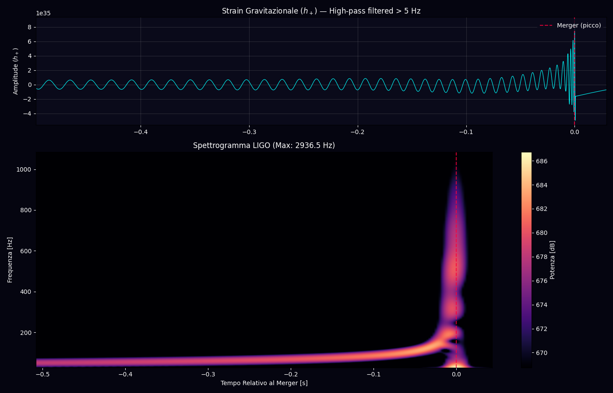</div>

Strain $h_+$ and STFT spectrogram of the scenario, during the last 0.5 seconds before the merger: the chirp increases monotonically and smoothly until the sharp cutoff ([§8.6](#86-the-sharp-truncation-of-the-strain-the-absence-of-ringdown), no ringdown), reaching a peak frequency of ~2,936.5 Hz.

### 10.2 Other Emerging Phenomena

- **The “breathing” of the Roche lobes.** If a moon has an eccentric orbit, its distance from the attractor varies along the orbit: the Roche lobe **expands at apogee and contracts at perigee**, pulsating in phase with the eccentricity. This arises spontaneously from the calculation of the instantaneous $\omega = h/r^2$.

- **The asymmetry of the Sun-Jupiter dipole.** In the dΦ/dt heatmap, Jupiter produces a gravitational dipole as visible as that of the Sun, even though it is much lighter. The reason is kinematic: the term $\partial\Phi/\partial t \propto M\,v_{rad}/r^2$ depends on the **velocity** of the source relative to the center of mass, and Jupiter, being farther from the common center of mass, moves enough to compensate for its smaller mass. The reason why the Sun itself (which should be the “stationary” body) nevertheless produces its own clearly visible dipole is discussed in detail in **[§10.3](#103-the-wobble-of-the-reference-body)**.

  | Venus and Mercury: dipoles embedded in the Sun’s dipole | Wide-angle view: Jupiter’s dipole rivals that of the Sun |
  |:---:|:---:|
  | 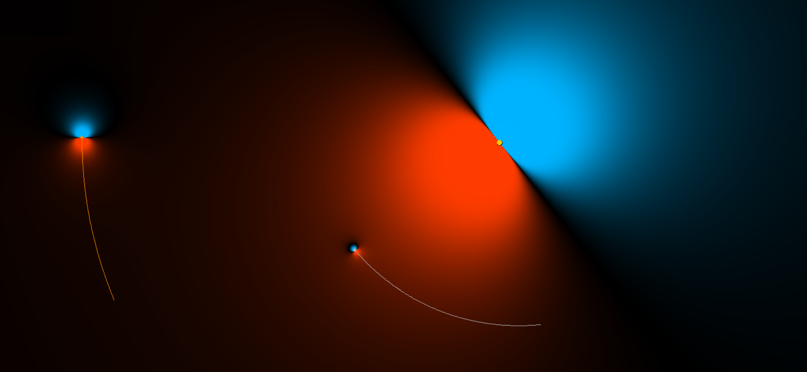 | 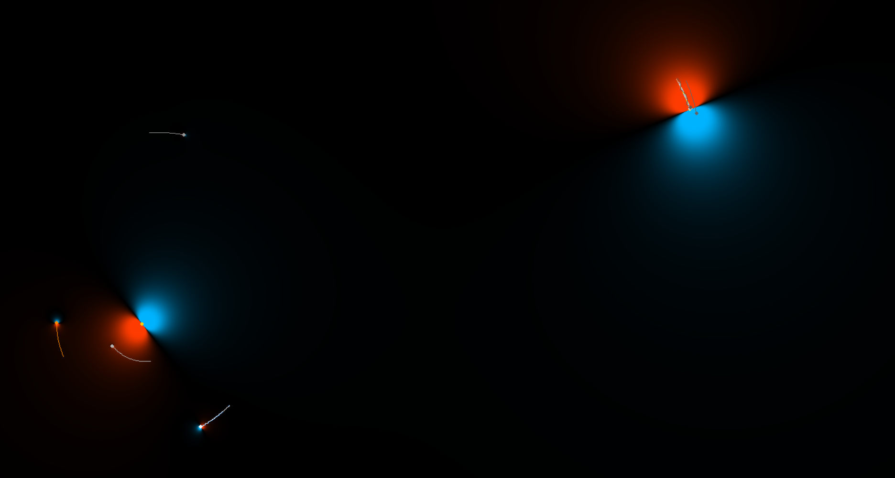 |

- **The "slingshot" effect in chaotic clusters.** In dense clusters, the interplay between finite causal horizons and Dead Reckoning generates occasional **pseudo-relativistic ejections**: a body passing through a tight configuration receives an anomalous kick. This should be interpreted as a qualitative artifact of discrete causal dynamics, not as rigorous physics, and is related to the absence of tidal disruption (bodies do not shatter, so they survive encounters that would destroy them in reality).

- **"Mobile/unstable" L1/L2 points in eccentric orbits (open question).** In the [Lagrange Hunter](#75-lagrange-hunter-determinant-and-inverse-hessian) ([§7.5](#75-lagrange-hunter-determinant-and-inverse-hessian)), for pairs with a very small mass ratio and an eccentric orbit (Mars, Mercury), L1 and L2 do not merely oscillate in amplitude in phase with each other as one would expect from eccentricity alone (previous point). The observed cycle is a relay pattern:
  1. they start out equidistant from the body;
  2. one of them abruptly moves away while the other remains stationary nearby;
  3. the first returns to its position while, at the same instant, the second shoots away;
  4. the pattern alternates in phase with aphelion and perihelion.

  This behavior cannot be attributed to a verifiable implementation error in the code. The exact cause remains unclear.

  <div align="center">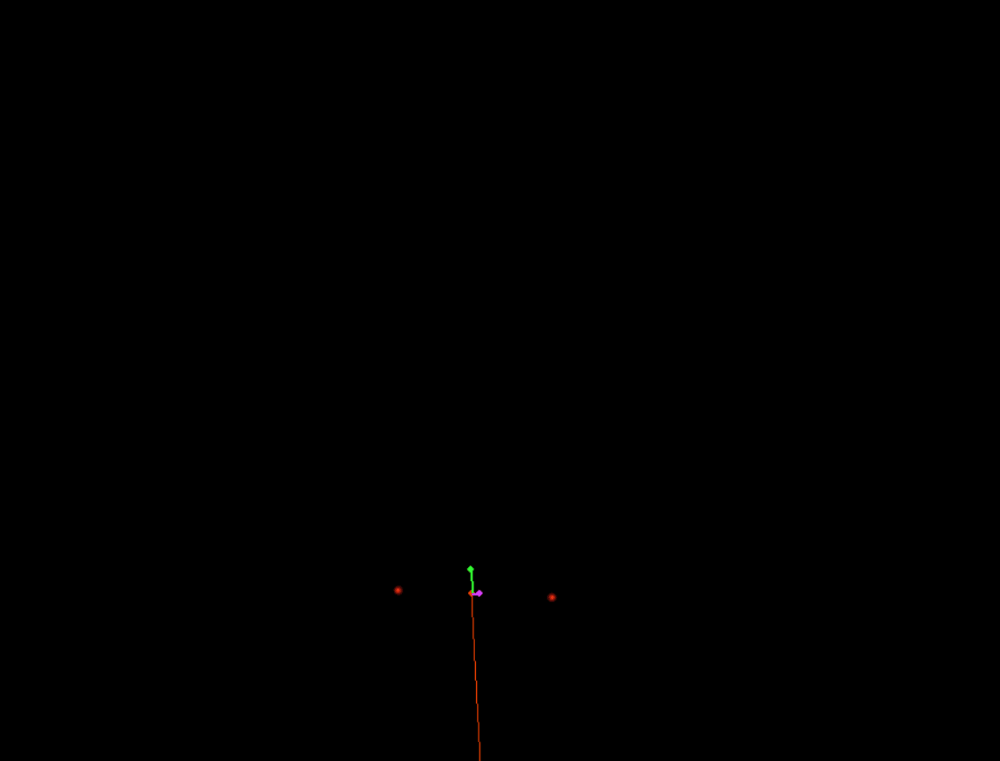</div>

- **Quasi-stable capture at L4/L5 (Earth-Sun).** When launching a satellite with a co-rotating boot guided by the simulation interface precisely to L4 or L5 in the Earth-Sun system, the body does not escape immediately: it orbits around the theoretical point for many orbital periods before gradually losing its lock.

- **Adaptability of the causal field to complex perturbations.** A fictitious chaotic scenario, constructed at runtime directly within the simulator, featuring several neutron stars scattered in orbit around Sagittarius A*, in dΦ/dt mode: it demonstrates how the causal field seamlessly adapts to complex, non-hand-tuned multi-body configurations, far beyond the scenarios covered in the other chapters.

  <div align="center"><video src="https://github.com/user-attachments/assets/03e80460-fa52-413f-8dbc-311698c9bd78" controls="controls" width="100%"></video></div>

### 10.3 The *wobble* of the reference body

Here, *wobble* refers to the oscillation of a body around its nominal “fixed center” position, induced by the gravitational pull of what orbits it: not a technical term from the engine, just the common name for this type of motion.

In heliocentric scenarios, the Sun is initially set at rest at the origin ( $\vec r = \vec v = 0$ at $t=0$ ): this is the natural choice for a reference “center.” But it is only an initial condition, not a constraint: from that moment on, the Sun is subject to the gravity of all the planets just like any other body and begins to move reflexively around the system’s true center of mass.

**Because its dipole is still clearly visible.** The sensitivity of the dΦ/dt heatmap (as discussed in [§7.2](#72-time-derivative-dφdt) and in [ARCHITECTURE_DEEP_DIVE.md](ARCHITECTURE_DEEP_DIVE.md)) is calibrated to the largest mass present in the scene, namely the Sun itself. With a mass of that magnitude, even a minuscule reflection velocity is enough to generate a $M\,v_{rad}/r^2$ term that is far from negligible: the Sun does not have to move *that much* to be clearly visible; it only has to move *the small amount dictated by physics*.

**What moves it and with what period.** Among the planets, Jupiter dominates the reflection: with a mass of $1{,}898\times10^{27}$ kg, it is more massive than all the other planets combined, and this is precisely why, in reality, the Sun-Jupiter center of mass lies outside the Sun’s surface. The resulting *wobble* inherits Jupiter’s orbital period: with the semi-major axis used by the preset (5.2044 AU), that period is **approximately 11.9 years (~4,333 days)**, not just a few hundred. It’s the same calculation Kepler used to launch Jupiter into orbit, applied on the scale of the Sun.

**The shape: arcs separated by cusps.** As seen in the screenshot below, the Sun’s path around the center of mass consists of smooth arcs separated by sharp cusps, the points where the direction of the reflection reverses abruptly. With the entire solar system active (not just Jupiter in isolation), the Sun’s reflection is the sum of multiple overlapping planetary contributions with different periods (Jupiter is dominant, but not the only one): it is this overlap (not a single periodic term) that produces the cusps. This is the same qualitative signature found in the classic diagrams of solar motion around the center of mass discussed in heliophysical literature.

**This is not exclusive to the Sun-Jupiter system.** The same reflection appears in any system with a dominant body and one or more lighter bodies in orbit: the Earth, for example, undergoes a similar *wobble* (smaller in amplitude, dominated by the Moon) around the Earth-Moon center of mass. It is a general property of the N-body system, not a special case tailored to the Sun. What makes it visible on screen is the resolution of the **trails** (the fixed circular buffer budget per body, [ARCHITECTURE_DEEP_DIVE.md §6](ARCHITECTURE_DEEP_DIVE.md#8-body-trails)): the trajectory of the reflection, however small in absolute magnitude, is plotted with the same fidelity as any other orbit.

| *Wobble* of the Sun | *Wobble* of the Earth | *Wobble* of the black hole in EMRI |
|:---:|:---:|:---:|
| 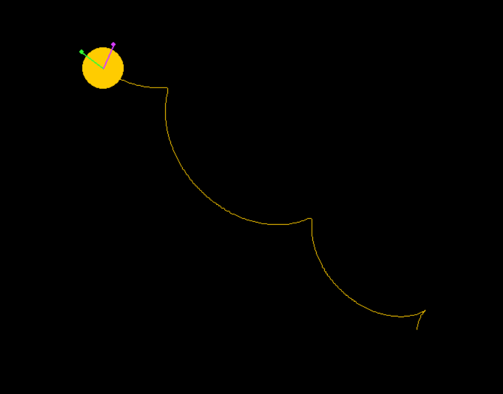 | 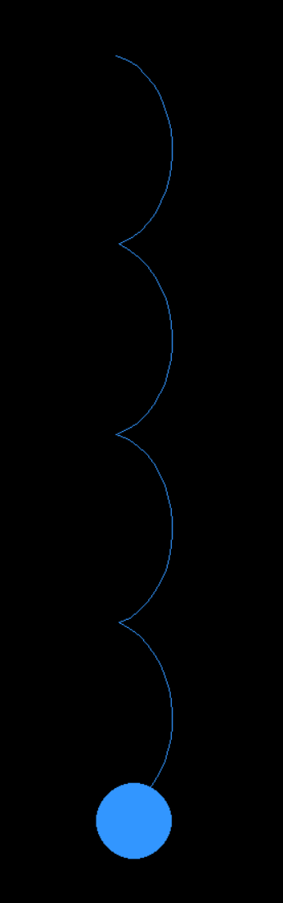 | 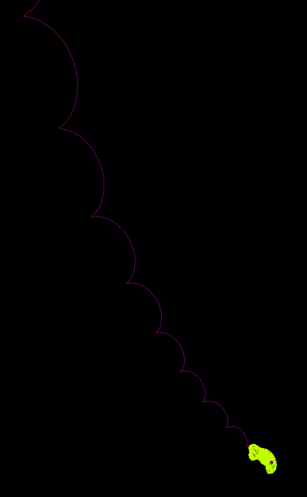 |
| Dominated by Jupiter: the two arcs separated by the cusp described above are visible. Since the Sun is the target (fixed) body, the purple vector representing the net acceleration is also visible: although it is infinitesimal at that instant, it still points toward Jupiter, which is outside the frame. | Moon-dominated: the same pattern of arcs and cusps, but repeated multiple times within the same trail window, because the Moon’s period is much shorter than Jupiter’s. | Reflection of the supermassive black hole toward the lightweight companion, in the EMRI scenario discussed in [§7.6.4](#764-case-study-the-dynamic-quadrupole-in-emri-at-the-apocenter): the cusps become denser as they approach the merger, the same chirp signature (increasing orbital frequency) already seen elsewhere. Each macro-cusp visible here is not a single orbit: it aggregates thousands of the lightly orbiting companion’s orbits, which are strongly precessing ([§7.6.4](#764-case-study-the-dynamic-quadrupole-in-emri-at-the-apocenter)), and which the finite resolution of the trail cannot resolve individually. |

### 10.4 Spurious precession in the weak field (truncation error in DT, not physical)

The previous chapters ([§6.7](#67-comparing-the-two-validations), [§7.6.5](#765-case-study-bns-with-extreme-double-eccentricity)) show perihelion precession as a plausible effect in relativistic regimes: generated by the real 2.5PN when active, or by the dead reckoning residual theorized in [§3.3](#33-the-balance-between-braking-and-thrust) when it is not active. But the exact same visual signature (the major axis of the orbit rotating slowly) also appears in entirely ordinary, non-relativistic orbits, such as that of the Moon around the Earth, where the 2.5PN never activates (speeds well below the $0.1c$ threshold of [§6.3](#63-how-the-25pn-is-used-in-the-simulator)) and no conservative 1PN/2PN terms are implemented in the engine.

There, the effect is demonstrably **a truncation error**, not a physical phenomenon: the precession is proportional to the time step $DT$. At $DT=150$, the Moon undergoes a slow precession around the Earth over the course of many simulated years; by doubling the time step to $DT=300$, the same precession occurs in half the time. With a sufficiently low $DT$, the precession disappears entirely: this is definitive proof that it is not a physical residual, but depends solely on the discretization, exactly the type of analysis of orbital drift as a function of the time step that [§4.2](#42-truncation-error) anticipated as a future development. The same regime at high $DT$ also produces a very slow, spurious (non-real) orbital decay of the same origin.

---

*For the engineering choices behind these equations (LOD buffer, JIT kernel, dispatch, performance), see [ARCHITECTURE_DEEP_DIVE.md](ARCHITECTURE_DEEP_DIVE.md). For usage and controls, see the [README.md](README.md).*
