# Guida Fisica e agli Scenari di Astro Causal Sim

Questo documento è il riferimento **fisico-matematico** del progetto: spiega le equazioni dietro la dinamica e le heatmap, e collega ciascun blocco di teoria allo scenario che lo rende visibile. Per le scelte *ingegneristiche* (buffer, kernel JIT, performance) si veda [ARCHITECTURE_DEEP_DIVE.md](ARCHITECTURE_DEEP_DIVE.md); per l'uso pratico, il [README.md](README.md).

> [!WARNING]
> **Nota dell'autore e invito alla collaborazione**
> Questo simulatore è un progetto indipendente e non accademico, e chi scrive **non è un fisico né un matematico di mestiere**. Le soluzioni fisiche implementate si appoggiano su una sintesi numerica di modelli standard della letteratura scientifica (tra cui la gravità a tempo ritardato, lo schema [Velocity Verlet](#41-lo-schema-di-integrazione), le formulazioni di [Liénard-Wiechert](#5-deformazione-di-li%C3%A9nard-wiechert) e [Paczyński-Wiita](#61-lo-pseudo-potenziale-di-paczy%C3%B9ki-wiita), e la reazione di radiazione gravitazionale [2.5PN](#62-cosa-sono-gli-ordini-post-newtoniani-e-il-25pn)).
> Il motore è interamente **parameter-free** (privo di coefficienti liberi di taratura; la precedente euristica `m_chirp_mult` è stata completamente rimossa a favore della fisica reale a partire dall'implementazione della reazione 2.5PN, come discusso in [§6.5](#65-la-storia-da-m_chirp_mult-al-25pn-reale)) ed è stato validato empiricamente rispetto ai dati osservativi reali e di relatività numerica.
> Trattandosi di un'opera autonoma di divulgazione e simulazione, il codice e la formalizzazione teorica gioverebbero enormemente del confronto e dello sguardo di professionisti e accademici del settore (collaborazione già tracciata nella **roadmap** del [README.md](README.md)).

La scelta progettuale è rendere tutto rigorosamente **causale**: le forze
viaggiano a velocità finita $c$ e ogni corpo reagisce al passato degli
altri. Da questa singola regola emergono, senza essere programmati,
fenomeni che nella fisica reale appartengono al regime relativistico:
i fronti d'onda del [chirp](#64-massa-chirp-e-formula-di-peters) visibili in $d\Phi/dt$, la forma di $f(t)$
che ricalca la curva di Peters allo 0,97% (§6.6), le orbite a rosetta
degli **[EMRI](#764-caso-di-studio-il-quadrupolo-dinamico-nellemri-allafelio)** (*Extreme Mass Ratio Inspiral*: un oggetto compatto leggero
che spirala dentro un buco nero supermassiccio percorrendo migliaia di
orbite con forte precessione apsidale), e il **cono di luce visibile a
occhio** nella mappa $\Phi$: quando un corpo appare o scompare di colpo,
il suo campo non si materializza ovunque all'istante ma si propaga come
un fronte sferico che viaggia a $c$, perché i corpi oltre il fronte
stanno ancora reagendo al passato in cui il nuovo corpo non c'era. Le
formule scritte sono quelle che ho davvero usato: molti degli effetti
che si vedono non sono calcolati, ma conseguenze del sistema.

### Convenzioni e unità

Il simulatore lavora interamente in **km, kg, secondi**:
- $G = 6{,}674 \times 10^{-20}\ \text{km}^3\,\text{kg}^{-1}\,\text{s}^{-2}$ (la costante in unità del SI riscalata ai km);
- $c = 299\,792{,}458\ \text{km/s}$;
- $1\ \text{AU} = 149\,597\,870{,}7\ \text{km}$.

Tutti gli stati fisici sono in doppia precisione (`float64`). I vettori sono 2D nel piano della simulazione.

---

## Indice

1. [Inquadramento: il modello causale e l'approssimazione 2D](#1-inquadramento-il-modello-causale-e-lapprossimazione-2d)
   - 1.1 Cosa risolve davvero il motore
   - 1.2 La natura delle onde del simulatore (livelli di astrazione)
2. [Propagazione causale e istante di emissione](#2-propagazione-causale-e-istante-di-emissione)
   - 2.1 Il tempo di volo per sorgenti in moto
3. [Aberrazione causale, Dead Reckoning e dinamica relativistica](#3-aberrazione-causale-dead-reckoning-e-dinamica-relativistica)
   - 3.1 Il problema dell'aberrazione
   - 3.2 La compensazione: Dead Reckoning ibrido
   - 3.3 L'equilibrio tra freno e spinta
   - 3.4 Compressione relativistica dell'accelerazione
4. [Metodi numerici: Velocity Verlet, errore di troncamento e DT](#4-metodi-numerici-velocity-verlet-errore-di-troncamento-e-dt)
   - 4.1 Lo schema di integrazione
   - 4.2 Errore di troncamento
   - 4.3 DT, Nyquist-Shannon e l'emergenza del chirp
   - 4.4 Una nota sul LOD dei buffer
5. [Deformazione di Liénard-Wiechert](#5-deformazione-di-liénard-wiechert)
6. [Gravità estrema: Paczyński-Wiita, 2.5PN e massa chirp](#6-gravità-estrema-paczyński-wiita-25pn-e-massa-chirp)
   - 6.1 Lo pseudo-potenziale di Paczyński-Wiita
   - 6.2 Cosa sono gli ordini post-newtoniani e il 2.5PN
   - 6.3 Come uso il 2.5PN nel simulatore
   - 6.4 Massa chirp e formula di Peters
   - 6.5 La storia: da `m_chirp_mult` al 2.5PN reale
   - 6.6 Le prove: confronto col dato reale
7. [La matematica delle heatmap](#7-la-matematica-delle-heatmap)
   - 7.1 Potenziale scalare Φ
   - 7.2 Variazione temporale dΦ/dt
   - 7.3 Stress di marea (e una nota sull'Hessiana)
   - 7.4 Topologia di Roche (il segno del determinante)
     - 7.4.1 Il potenziale efficace nel sistema co-rotante
     - 7.4.2 Mappatura cromatica (segno e intensità di D)
     - 7.4.3 Overlay [M]: Orbita circolare ideale
     - 7.4.4 Lettura combinata delle tre informazioni
     - 7.4.5 Caso di studio: La missione Artemis II
     - 7.4.6 Caso di studio: Mercurio al perielio
   - 7.5 Lagrange Hunter (determinante e Hessiana inversa)
   - 7.6 Deformazione proiettata (GW Strain Quadrupolare)
   - 7.7 Riepilogo: come ogni heatmap converte la fisica in colore
   - 7.8 Il Pannello di Telemetria Orbitale (HUD)
8. [L'analizzatore LIGO: dal proxy cinematico allo spettro](#8-lanalizzatore-ligo-dal-proxy-cinematico-allo-spettro)
   - 8.1 L'analogia con LIGO e Virgo sulla Terra
   - 8.2 Cos'è il momento di quadrupolo di massa? (Le due facce del quadrupolo)
   - 8.3 La formula 3D "camuffata" e la proiezione ortogonale al piano
   - 8.4 Cosa registra la sonda virtuale (Il proxy basato sulle velocità)
   - 8.5 Il problema numerico dell'accelerazione e la regolarizzazione cinetica
   - 8.6 Il troncamento netto dello strain (L'assenza del Ringdown)
   - 8.7 Cos'è uno spettrogramma e come si ottiene
   - 8.8 La pipeline di analisi dell'analizzatore (`ligo_analyzer.py`)
9. [Inizializzazione degli scenari: calcolo analitico delle orbite](#9-inizializzazione-degli-scenari-calcolo-analitico-delle-orbite)
   - 9.1 Velocità orbitale e di fuga nel potenziale di Paczyński-Wiita
   - 9.2 Lancio all'apocentro o al pericentro
   - 9.3 Velocità di lancio per binarie compatte (coppie strette)
   - 9.4 Punti di Lagrange analitici (Problema dei tre corpi circolare ristretto)
   - 9.5 Velocità co-rotante sui punti di Lagrange
   - 9.6 Perché coesistono l'overlay teorico e la heatmap dinamica?
10. [Fenomeni emergenti](#10-fenomeni-emergenti)

---

## 1. Inquadramento: il modello causale e l'approssimazione 2D

### 1.1 Cosa risolve davvero il motore
Il simulatore non risolve le equazioni di campo di Einstein. Al suo cuore integra una **gravità newtoniana scalare ($GM/r^2$) resa interamente causale**, operante su uno sfondo euclideo piatto 2D. 

La caratteristica distintiva e fondante del motore è che **l'informazione in tutto lo spazio viaggia rigorosamente alla velocità della luce $c$**: ogni corpo risente dell'influenza gravitazionale degli altri leggendone la posizione e lo stato all'istante di emissione passato (\([t_{ret} = t - r/c](#2-propagazione-causale-e-istante-di-emissione)\)), calcolato individualmente in base al tempo di volo dell'interazione. Questo significa che ogni mutuo accoppiamento dinamico risente di un ritardo temporale finito, ed è intrinsecamente reciproco e non-locale nel tempo. Per rendere sostenibile a livello computazionale questa complessa dinamica a ritardo, il simulatore si appoggia a un'architettura basata su **buffer storici a livelli di dettaglio (LOD)** (descritta in dettaglio in **[ARCHITECTURE_DEEP_DIVE.md](ARCHITECTURE_DEEP_DIVE.md#2-il-ring-buffer-e-lo-storico-delle-posizioni)**), che consente lookup e interpolazioni temporali a costo costante $O(1)$, compilati al volo in codice macchina nativo altamente ottimizzato (tramite **Numba / LLVM**).

Al di sopra di questo nucleo causale, in regimi relativistici specifici il motore innesta logiche di ordine superiore, dissipative o fenomenologiche: lo **[pseudo-potenziale di Paczyński-Wiita (§6.1)](#61-lo-pseudo-potenziale-di-paczy%C3%B9ki-wiita)** per i buchi neri, che riproduce orizzonte e ISCO senza risolvere la metrica; la **[correzione di Liénard-Wiechert](#5-deformazione-di-li%C3%A9nard-wiechert)** che comprime il campo delle sorgenti rapide vicino a $c$ (lo stesso effetto della **[contrazione di Lorentz](#5-deformazione-di-li%C3%A9nard-wiechert)** sul campo di una carica in moto); la **[reazione di radiazione 2.5PN (§6)](#6-gravit%C3%A0-estrema-paczy%C3%B9ki-wiita-25pn-e-massa-chirp)** che fa decadere le orbite compatte; e il **[freno d'inerzia relativistico (§3.4)](#34-compressione-relativistica-dellaccelerazione)** che rende $c$ un asintoto inavvicinabile.

Tra le soluzioni determinanti per garantire la stabilità orbitale a lungo termine vanno citati l'**[integratore simplettico Velocity Verlet (§4.1)](#41-lo-schema-di-integrazione)** che conserva per sua natura l'energia totale (impedendo derive numeriche fittizie) e il **[dead reckoning di 2° ordine (§3.2)](#32-la-compensazione-dead-reckoning-ibrido)**, che estrapola lo stato della sorgente per annullare l'aberrazione spuria indotta dal ritardo causale della gravità.

### 1.2 La natura delle onde del simulatore (livelli di astrazione)

| Heatmap dΦ/dt | Heatmap GW Strain |
|:---:|:---:|
|  | <video src="https://github.com/user-attachments/assets/e61bc2a5-c188-4add-8e5d-3aed2efc135d" controls width="100%"></video> |
| **Variazione temporale del potenziale scalare (\(d\Phi/dt\)):** Mappa la variazione nel tempo del potenziale gravitazionale causale ritardato. I fronti a spirale visibili indicano la propagazione a velocità finita \(c\) dei dipoli di accelerazione. Questa visualizzazione cattura una radiazione scalare pura, che funge da analogo qualitativo e visivo per le frequenze del chirp. | **Deformazione proiettata (GW Strain Quadrupolare):** Mappa la proiezione tensoriale dello strain gravitazionale del quadrupolo di massa. I lobi alternati ciano e rosso indicano le polarità della radiazione di quadrupolo proiettata lungo la direzione dell'osservatore, estraendo la reale simmetria di spin-2 del sistema binario in rotazione ed eliminando monopoli o gradienti spuri. |

**Dove si vedono queste onde, e cosa sono realmente.** 
Il simulatore non risolve le equazioni tensoriali complete della relatività generale nello spazio-tempo per calcolare le heatmap. Esso offre due distinti livelli di astrazione visiva per rappresentare l'irraggiamento energetico del sistema:

1. **L'analogo scalare (\(d\Phi/dt\)):** Emerge spontaneamente dalla sola propagazione causale del potenziale. Non calcola il quadrupolo, ma mostra l'onda di fase generata dallo spostamento dei singoli pozzi gravitazionali, ossia i dipoli di moto, condividendo con la fisica reale la sola frequenza orbitale e il phenomenon del chirp spettrale.
2. **Lo strain quadrupolare proiettato:** Calcola esplicitamente la proiezione del quadrupolo delle velocità ritardate sul piano dell'osservatore. Questo layer riproduce fedelmente la simmetria angolare di quadrupolo dello spin-2 reale, eliminando gli effetti dipolari spuri e offrendo un quadro geometricamente coerente della radiazione gravitazionale.

La tabella seguente riassume schematicamente le differenze fisiche e geometriche tra le onde reali e le due visualizzazioni del simulatore:

| Caratteristica | Onde reali (Relatività Generale) | Analogo scalare \(d\Phi/dt\) | Strain simulato (GW Strain) |
|---|---|---|---|
| **Natura del campo** | Campo tensoriale di **spin-2** (\(h_{\mu\nu}\)) | Campo **scalare** (\(\Phi\)) | Campo tensoriale proiettato lungo la visuale |
| **Polarizzazioni** | Due polarizzazioni indipendenti (\(h_+\) e \(h_\times\)) sfasate di 45° | Nessuna polarizzazione (variazione scalare pura) | Singola polarizzazione proiettata (\(h_+\) efficace) |
| **Sorgente fisica** | Variazione temporale del quadrupolo di massa (\(\ddot{Q}_{ij}\)) | Moto e variazione temporale del monopolo (\(\partial\Phi/\partial t\)) | Proiezione cinetica del quadrupolo di ciascuna massa |
| **Simmetria angolare** | Quadrupolare (quattro lobi alternati a 90°) | Dipolare attorno al singolo corpo in moto | Quadrupolare pura (\(\ell=2\) con quattro lobi alternati) |
| **Propagazione** | Radiazione ondulatoria tensoriale alla velocità della luce \(c\) | Onde di fase del potenziale ritardato a velocità \(c\) | Fronte d'onda causale ritardato a velocità \(c\) |
| **Accoppiamento** | Generato da accelerazioni asimmetriche nel COM* | Generato anche da moto uniforme traslatorio del corpo | Si annulla per moti uniformi di COM* (sottratto dal codice) |

\* COM (*Center of Mass* / Centro di Massa): il baricentro gravitazionale del sistema binario, utile a sottrarre la velocità di traslazione globale della coppia.

In sintesi, mentre la modalità \(d\Phi/dt\) funge da semplice indicatore qualitativo di moto ondulatorio, lo strain quadrupolare proietta la reale impronta geometrica dell'onda gravitazionale. Questo permette di esplorare i lobi e le spirali di fase in modo fisicamente coerente, senza dover ricorrere a complesse simulazioni di relatività numerica.

---

## 2. Propagazione causale e istante di emissione

Il cuore del modello: ogni corpo non sente la posizione *attuale* delle sorgenti, ma quella che avevano all'**istante di emissione** del segnale (il *tempo ritardato* dell'elettrodinamica classica):

$$t_{ret} = t - \frac{r}{c}$$

dove $r$ è la distanza. Il valore di $t_{ret}$ è recuperato dai buffer storici con costo $O(1)$ (i dettagli di memoria sono nel deep-dive).

### 2.1 Il tempo di volo per sorgenti in moto

Una precisazione: l'equazione completa di questo paragrafo serve **solo** in un caso estremo, gli scenari «Approccio alla Velocità della Luce», dove un'accelerazione artificiale (ART) spinge di proposito un corpo oltre il limite causale per renderne visibile l'effetto: cioè *rompe volutamente la fisica*. Ed è un calcolo **formale e geometrico** (l'intersezione col cono di luce), trova *da dove* è partito il segnale.

Qui c'è una distinzione di regime. Per un corpo che si muove a una frazione **minuscola** di $c$, il "segnale" gravitazionale parte da una posizione praticamente identica a quella attuale: la sorgente si può trattare come **ferma** e il ritardo è semplicemente $r/c$, con errore del tutto trascurabile. È il caso di quasi tutta la dinamica ordinaria (pianeti, stelle).

Quando invece la frazione di $c$ diventa **consistente**, quell'approssimazione non regge più: la posizione da cui è partito il segnale non è quella attuale, e bisogna risolvere per il tempo di volo $T$ l'equazione che impone alla luce di percorrere esattamente la distanza dalla posizione di emissione. Con $\vec{d} = \vec{r}_{target} - \vec{r}_{sorgente}$ ed estrapolazione lineare della sorgente all'indietro:

$$|\vec{d} + \vec{v}\,T|^2 = c^2 T^2 \;\Longrightarrow\; (c^2 - v^2)\,T^2 - 2(\vec{d}\cdot\vec{v})\,T - d^2 = 0$$

È una quadratica in $T$. Il discriminante (ridotto) è $\Delta = (\vec{d}\cdot\vec{v})^2 + (c^2 - v^2)\,d^2$, e la radice fisica è

$$T = \frac{(\vec{d}\cdot\vec{v}) + \sqrt{\Delta}}{c^2 - v^2}$$

> [!NOTE]
> **Il cono di Mach causale.** Se $\Delta < 0$ non esiste alcuna soluzione reale: la sorgente sta "scappando" dal proprio campo più velocemente di quanto questo possa raggiungere il bersaglio. Il bersaglio è fuori dal cono di luce passato raggiungibile, e il simulatore restituisce un contributo nullo. È l'analogo gravitazionale del cono di Mach supersonico. Si tratta di una situazione **matematicamente assurda** dal punto di vista fisico (richiede una sorgente più veloce della luce, impossibile), e infatti è **forzata di proposito** solo negli scenari "Approccio alla Velocità della Luce": la versione piena (~20 GB di RAM) a $0{,}999c$ e le due ridotte a $0{,}9c$ e $0{,}7c$, dove un'accelerazione artificiale costante spinge il Sole oltre il limite causale per renderne visibile l'effetto (il "vuoto" che si apre dietro al corpo).

*(Per un approfondimento di come la heatmap interpreta questi scenari estremi rimando alla sezione §5.)*

---

## 3. Aberrazione causale, Dead Reckoning e dinamica relativistica

Prima di entrare nel merito dell'aberrazione e del dead reckoning, vale la pena chiarire **come il motore recupera in pratica la posizione ritardata** introdotta in §2. È la base su cui poggia tutto il resto del capitolo: senza quel recupero non c'è $\vec r(t_{ret})$, e senza quella non c'è né aberrazione da correggere né dead reckoning da applicare.

**Il problema implicito.** Il tempo di volo $r/c$ dipende dalla posizione che la sorgente aveva *al momento di emissione*, ma è proprio quella che vogliamo trovare. È un'equazione **implicita**, e per il caso generale (moto curvilineo, accelerazioni non uniformi, sistemi N-body) non esiste una soluzione in forma chiusa.

**La risposta: conservare lo storico di ogni sorgente.** Anziché risolvere l'equazione ogni frame, il motore **memorizza la traiettoria passata** di ciascun corpo. A ogni passo di simulazione, ciascun corpo deposita il proprio stato (posizione, velocità, massa) in un **archivio temporale stratificato a tre livelli di dettaglio**: il livello *fine* registra ogni passo (passato recente, alta risoluzione), il *medio* uno ogni 32 passi, il *grossolano* uno ogni 256. Questa stratificazione riproduce la stessa logica dei *level-of-detail* usati in cartografia o nelle simulazioni N-body cosmologiche: si copre senza esplosione di memoria sia il passato recente in alta risoluzione sia quello remoto a campioni radi. Quando un osservatore chiede *"che stato aveva la sorgente al tempo $t_{ret}$?"*, la risposta è una **singola lettura nello storico**, a costo **costante** (indipendente da quanto indietro nel tempo si va).

**Il recupero in due passi.** Per ogni interazione causale il motore consulta lo storico due volte in cascata:

1. **Stima.** Si misura la distanza istantanea $r_{now}$ fra osservatore e sorgente *come si trovano ora*, e si calcola un primo tempo di volo approssimato $t_{est} = r_{now}/c$. Tradotto nel numero di passi di simulazione corrispondente ($t_{est}/\Delta t$), questo individua un punto nello storico: una **prima lettura** restituisce la **posizione ritardata stimata** $\vec r_{ret,est}$.
2. **Ricalcolo causale.** Dalla posizione stimata si calcola la distanza vera $r_{true} = |\vec r_{obs} - \vec r_{ret,est}|$, e si ripete il conto: $t_{true} = r_{true}/c$, nuovo punto nello storico, **seconda lettura**. Da qui si ottengono posizione, velocità e massa all'istante di emissione *effettivo*, con cui il calcolo della forza, del potenziale o del quadrupolo procede senza ambiguità.

Matematicamente, questo doppio passo è equivalente a una singola iterazione di Picard sull'equazione del cono di luce, e per orbite ordinarie ($v \ll c$) converge in un colpo. Per regimi estremi ($v \to c$), §2.1 fornisce la soluzione **analitica in forma chiusa**, ricavata da una quadratica nel tempo di volo, che il motore usa al posto della doppia lettura.

**Cosa c'è qui e cosa nel deep dive.** Quanto sopra descrive solo il *cosa* e il *perché*. Tutti i dettagli ingegneristici (struttura interna dei tre livelli di dettaglio, ottimizzazioni di accesso, criterio di scelta del livello in base alla profondità temporale richiesta, dimensionamento della memoria per scenari estremi come $0{,}999c$) sono documentati in **[ARCHITECTURE_DEEP_DIVE.md §2](ARCHITECTURE_DEEP_DIVE.md#2-il-ring-buffer-e-lo-storico-delle-posizioni)**.

**E ora il capitolo.** Il recupero restituisce la posizione *ritardata* della sorgente. Da qui parte il problema centrale: usare quella posizione "indietro nel tempo" come riferimento per la forza introduce un'**aberrazione spuria** che destabilizza le orbite, e serve un'estrapolazione in avanti, il **dead reckoning**, per cancellarla.

### 3.1 Il problema dell'aberrazione

Se la gravità punta verso la posizione **ritardata** della sorgente, in un'orbita punta sistematicamente "indietro" rispetto alla posizione vera. Questo introduce una piccola componente di forza **tangenziale** che agisce come una **coppia fittizia**: inietta momento angolare spurio e tende ad allargare progressivamente le orbite, fino a destabilizzarle. È un artefatto noto della gravità causale discreta presa alla lettera.

### 3.2 La compensazione: Dead Reckoning ibrido

<table width="100%">
  <tr>
    <td valign="top" width="60%">
      
Il <em>dead reckoning</em> è il metodo con cui un navigatore stima la posizione attuale di un oggetto dalla sua ultima posizione nota, più velocità e tempo trascorso, senza vederlo direttamente. Qui fa l'equivalente per la gravità: stima dove la sorgente <em>è ora</em> a partire da dove <em>era</em> all'istante di emissione. Ha anche un corrispettivo fisico diretto: in elettrodinamica e in gravità linearizzata i termini di velocità del campo fanno sì che la forza di una sorgente in <strong>moto uniforme</strong> punti alla sua posizione <em>presente</em>, non a quella di emissione (l'aberrazione si cancella). Il dead reckoning del motore riproduce numericamente proprio questa cancellazione.

      
Il motore non usa la posizione di emissione grezza, ma la <strong>estrapola in avanti</strong> verso l'istante presente, riducendo l'aberrazione. Sviluppo di Taylor della posizione della sorgente sul tempo di volo \(\Delta t_{flight}\):

      <ul>
        <li><strong>2° ordine (regime ordinario):</strong>
          \[\vec{x}_{eff} = \vec{x}_{ret} + \vec{v}_{ret}\,\Delta t_{flight} + \tfrac{1}{2}\vec{a}_{ret}\,\Delta t_{flight}^2\]
        </li>
        <li><strong>Bypass nel regime GW (vicino al merger):</strong> in regime relativistico estremo l'estrapolazione lineare non basta più e lascia un errore radiale periodico che si traduce in eccentricità spuria. Il motore allora <strong>abbandona del tutto il dead reckoning</strong> e usa la <strong>posizione presente esatta</strong> della sorgente, sia per la direzione sia per la distanza, azzerando all'origine quell'aberrazione residua (dettaglio ingegneristico in <a href="ARCHITECTURE_DEEP_DIVE.md">ARCHITECTURE_DEEP_DIVE.md</a>, §2).</li>
      </ul>
      
L'accelerazione storica \(\vec{a}_{ret}\) non è memorizzata: è ricostruita al volo per <strong>differenze finite</strong> tra velocità consecutive.

    </td>
    <td valign="top" align="center" width="40%">
      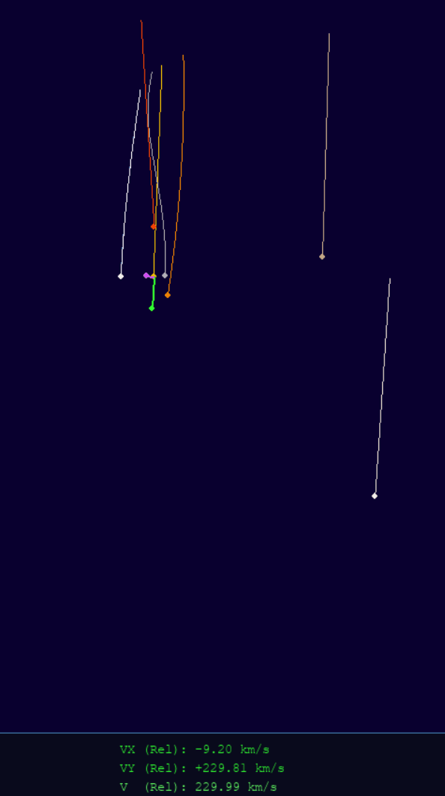
    </td>
  </tr>
</table>

**Showcase: Orbita Galattica (Sgr A\*) (nella GIF sopra a destra)**: Pan camera circa 22x10 AU, velocità simulazione: 35 giorni/secondo. L'inquadratura a destra mostra le parametrie sul corpo evidenziato, il Sole, con il vettore velocità verde neon e il vettore forza viola che punta a Sgr A\* ad anni luce di distanza, in orbita a ≈ 230 km/s che resta stabile a lungo termine; senza il Dead Reckoning l'aberrazione la farebbe spiraleggiare verso l'esterno.

### 3.3 L'equilibrio tra freno e spinta

Quando il radar relativistico rileva una coppia in regime estremo, il motore inietta la reazione 2.5PN reale (§6.3) come freno fisico che fa decadere l'orbita. Oggi questo avviene in modo pulito, ma arrivarci ha richiesto una lunga messa a punto, raccontato per intero (con i grafici) in §6.5. In sintesi, i tre ingredienti che tengono l'orbita stabile e poco eccentrica sono:

- il **dead reckoning di 2° ordine** fuori dal regime relativistico estremo, che cancella l'aberrazione nelle orbite ordinarie;
- il **bypass a posizioni presenti** dentro il regime relativistico estremo (§3.2), che toglie l'aberrazione residua proprio dove l'estrapolazione lineare la lasciava;
- la **reazione 2.5PN reale** (§6.3), che dissipa l'energia orbitale senza alcun coefficiente di taratura.

**Nota dell'autore. Un'ipotesi sul perché il dead reckoning può frenare alcune orbite estreme (e un nodo aperto sull'EMRI).** Il dead reckoning di 2° ordine tronca al termine in accelerazione: il primo pezzo che scarta è quello in **jerk** (la derivata terza della posizione). Due indizi fanno sospettare che questo residuo non sia solo rumore numerico. Primo: anche la reazione di radiazione 2.5PN entra all'ordine del jerk nelle equazioni del moto (è una forza che dipende dalle derivate temporali dell'accelerazione). Secondo, e qui c'è fisica accertata: l'aberrazione di una sorgente in moto *uniforme* si cancella quasi esattamente grazie ai termini di velocità del campo, e il termine che resiste a quella cancellazione, all'ordine $(v/c)^5$, è proprio la reazione di radiazione (S. Carlip, *Aberration and the speed of gravity*, [arXiv:gr-qc/9909087](https://arxiv.org/abs/gr-qc/9909087)). Da qui l'ipotesi: che il residuo del dead reckoning, quando l'accelerazione varia in modo non lineare, *possa* cadere nella stessa famiglia della perdita di energia per radiazione. È un sospetto motivato, non una dimostrazione.

Va detto con altrettanta onestà dove l'analogia si fa fragile. Quel residuo è **anche**, e prima di tutto sul piano numerico, un errore di troncamento, a cui si somma l'accelerazione $\vec{a}_{ret}$ usata nell'estrapolazione: non è esatta, ma ricostruita al volo per differenze finite (§3.2), quindi essa stessa approssimata. In entrambi i casi l'ampiezza dipende dal passo, non dal coefficiente fisico ($\tfrac{8}{5}G^2 M\mu/c^5 r^3$) del 2.5PN. L'analogia, anche se cogliesse qualcosa di reale, qui sarebbe solo un'approssimazione grezza, dell'ordine giusto (jerk) ma di misura non controllata. Il dato empirico: nei contesti GW (in questa simulazione si intendono scenari dove ci si aspetta la formazione di onde gravitazionali, *Gravitational Waves*), lasciando il 2.5PN **spento** e il solo dead reckoning di 2° ordine **acceso**, l'orbita dissipa energia troppo in fretta rispetto al 2.5PN reale. È il motivo per cui in quel regime "frena troppo", ed è anche perché nel regime GW quel dead reckoning è spento e sostituito dal bypass a posizioni presenti (§3.2). Resta quindi un'**ipotesi**: un'analogia strutturale plausibile, non una sostituzione quantitativa del 2.5PN. È plausibilmente anche ciò che fa decadere lentamente l'orbita EMRI nei giorni di inspiral in cui il 2.5PN esplicito è ancora spento, un'osservazione che meriterebbe una verifica esperta.

| Rosetta : inspiral | Rosetta : late inspiral |
|:---:|:---:|
| 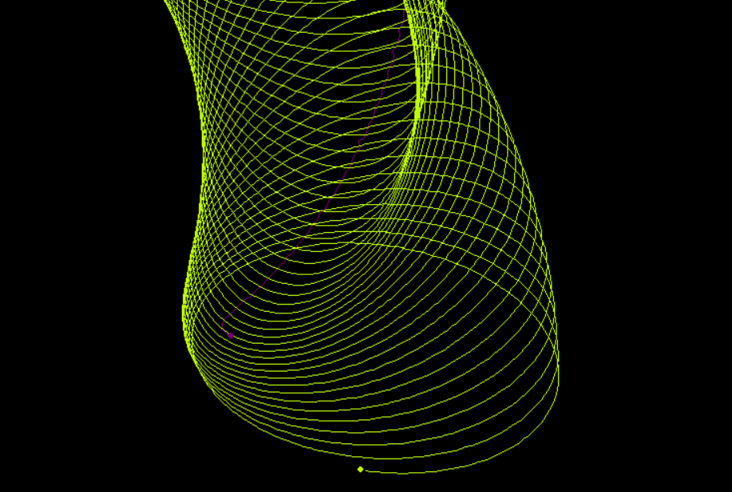 | 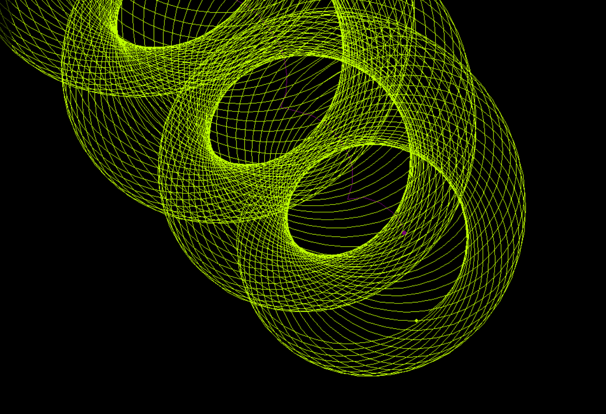 |
| Scala ≈ 7M × 4M km · 5 min/s · il BH viola è 100× quello verde · ~6 giorni dalla prima orbita, ~7 al merge | Scala 1,2M × 825.000 km · late inspiral · 13 giorni e 7 ore, ~4 ore al merge |

**Showcase: EMRI / orbita a rosetta**: la scia del corpo leggero disegna una **rosetta**, un'orbita che precessa (non si richiude) e nel contempo si stringe lentamente. Una precisazione onesta sulla causa: per gran parte dell'inspiral il periastro resta intorno ai 160.000 km, lontanissimo dall'orizzonte, dove la correzione di Paczyński-Wiita è ancora minima e non può essere il movente. Precessione e lenta contrazione vanno ricondotte piuttosto alla dinamica causale a ritardo finito (una forza non centrale, quindi non kepleriana) e al residuo del dead reckoning discussi sopra: la rosetta è, verosimilmente, la firma visiva di quell'ipotesi.

### 3.4 Compressione relativistica dell'accelerazione

Per impedire fughe superluminali, l'accelerazione netta di un corpo viene smorzata al crescere della velocità. Sotto la soglia $v^2 = 0{,}5\,c^2$ (≈ 0,707 c) non cambia nulla. Sopra, l'accelerazione è moltiplicata per il fattore di Lorentz inverso $\sqrt{1 - v^2/c^2}$, che la sopprime sempre di più man mano che $v \to c$: raggiungere $c$ diventa **gradualmente impossibile**, esattamente come con l'aumento relativistico dell'inerzia (servirebbe un'energia via via divergente). Oltre $0{,}999\,c$ l'accelerazione è azzerata del tutto. È un cap fenomenologico, non una derivazione dalla Relatività Generale, ma riproduce il comportamento giusto: $c$ resta un asintoto inavvicinabile.

> Lo scenario complementare a **0.999c** descritto nella sezione §5 è invece un *"what-if" fisicamente impossibile*: accelerare una massa a quella velocità richiederebbe energia infinita, e la compressione dell'accelerazione appena descritta lo rende per costruzione irraggiungibile. Serve a mostrare la deformazione del campo e a spingere agli estremi la causalità del motore e la scalabilità dei buffer, fino alla "compressione" visiva verso la singolarità $c$. È un caso limite tecnico più che un risultato fisico.

---

## 4. Metodi numerici: Velocity Verlet, errore di troncamento e DT

### 4.1 Lo schema di integrazione

La dinamica è integrata con il **Velocity Verlet**, un integratore simplettico del secondo ordine scelto per la sua eccellente conservazione dell'energia a lungo termine. Ogni passo:

1. mezzo calcio di velocità: $\vec{v}(t+\tfrac{\Delta t}{2}) = \vec{v}(t) + \tfrac{1}{2}\vec{a}(t)\,\Delta t$
2. drift di posizione: $\vec{x}(t+\Delta t) = \vec{x}(t) + \vec{v}(t+\tfrac{\Delta t}{2})\,\Delta t$
3. calcolo causale delle nuove accelerazioni $\vec{a}(t+\Delta t)$
4. secondo mezzo calcio: $\vec{v}(t+\Delta t) = \vec{v}(t+\tfrac{\Delta t}{2}) + \tfrac{1}{2}\vec{a}(t+\Delta t)\,\Delta t$

### 4.2 Errore di troncamento

Espandendo la posizione in serie di Taylor:

$$\vec{x}(t+\Delta t) = \vec{x} + \vec{v}\,\Delta t + \tfrac{1}{2}\vec{a}\,\Delta t^2 + \tfrac{1}{6}\dot{\vec{a}}\,\Delta t^3 + \tfrac{1}{24}\ddot{\vec{a}}\,\Delta t^4 + \dots$$

Lo schema di Verlet è **simmetrico nel tempo** (invariante per $\Delta t \to -\Delta t$). Questa simmetria fa **cancellare il termine dispari di ordine $\Delta t^3$**, lasciando come primo errore locale sulla posizione un termine $\propto \Delta t^4$:

$$\varepsilon_{\text{locale}} \approx \frac{\Delta t^4}{12}\,\frac{d^4 \vec{x}}{dt^4}$$

L'errore **globale** accumulato è invece $O(\Delta t^2)$ (metodo del secondo ordine). La conseguenza pratica è che l'energia orbitale non deriva secolarmente ma **oscilla in modo limitato**, motivo per cui orbite kepleriane restano stabili per milioni di passi.

Una possibile implementazione futura potrebbe riguardare come analisi al dettaglio il calcolo della deriva orbitale dovuto all'errore di troncamento in base al numero di passi eseguiti nell'ultimo secondo e $\Delta t$.

### 4.3 DT, Nyquist-Shannon e l'emergenza del chirp

> [!NOTE]
> In fisica dei segnali, un **chirp** definisce un'onda la cui frequenza aumenta (o diminuisce) nel tempo. Nei sistemi binari compatti, l'attrazione gravitazionale fa spiraleggiare i due corpi l'uno verso l'altro (*inspiral*) velocizzandone l'orbita: questo produce un segnale con frequenza e ampiezza rapidamente crescenti, simile a un "cinguettio" acustico.

Il passo $\Delta t$ non governa solo la precisione dell'integrazione. Nelle simulazioni di inspiral e merger ha **anche** un secondo ruolo, altrettanto decisivo: determina la **frequenza di campionamento** con cui la sonda virtuale del simulatore (l'**analizzatore LIGO**, trattato in dettaglio nel §8) registra il segnale gravitazionale,

$$f_s = \frac{1}{\Delta t}$$

ed è questa frequenza a stabilire se il chirp potrà *emergere* dallo spettrogramma o sparirà nel rumore. Per il **teorema di campionamento di Nyquist-Shannon**, per ricostruire un segnale di frequenza massima $f_{max}$ senza aliasing serve
**
$$f_s > 2\,f_{max}$$

Nei merger di stelle di neutroni (es. GW170817) la frequenza dell'onda analoga, pari al **doppio** di quella orbitale, raggiunge $\sim 1-2\ \text{kHz}$ poco prima del contatto. Per catturarla pulita serve $f_s > 4\ \text{kHz}$, cioè $\Delta t < 2{,}5 \times 10^{-4}\ \text{s}$. Il simulatore usa $\Delta t = 1\ \mu\text{s}$ ($f_s = 1\ \text{MHz}$), un margine enorme: **è questo che permette al chirp di emergere** nello spettrogramma invece di collassare in rumore di aliasing. In altre parole, con un $\Delta t$ troppo grande l'evento fisico avverrebbe lo stesso, ma non sarebbe **osservabile**: la sonda non avrebbe abbastanza campioni per ricostruire la rampa finale di frequenza.

> **Nota dell'autore.** Nyquist-Shannon non lo conoscevo per nome: ci ero arrivato per logica (per tenere stabili le orbite serve già campionare il periodo molte volte, quindi a maggior ragione per *vedere* il chirp serve campionare ben oltre la sua frequenza). Solo dopo, con l'aiuto di un LLM, ho scoperto che quel ragionamento ha un nome formale, "*il teorema di campionamento*", e da lì la giustificazione rigorosa qui sopra. pertanto faccio presente che visto che il DT è calibrato a monte a seconda dello scenario impostato ma l'utente ha la possibilità di cambiarlo in tempo reale: in tal caso, molto prima di vedere gli effetti di aliasing descritti sopra si ha un effetto per cui l'errore di trocamento distrugge le orbite. Il teorema rimane utile come regola inviolabile per la pulizia del sengale e come indizio sul corretto intervallo di impostazione della simulazione .

### 4.4 Una nota sul LOD dei buffer

I buffer storici a risoluzione decrescente (L0/L1/L2, dettaglio nel deep-dive) introdurrebbero un errore di campionamento crescente con la profondità temporale. Ma c'è una compensazione fisica: l'errore di troncamento del livello L2 (campionato ogni $256\,\Delta t$) cresce **proporzionalmente alla distanza**, mentre il contributo gravitazionale di una sorgente lontana **decade come $1/r^2$**. I due effetti si elidono: la risoluzione grossolana è usata esattamente dove conta poco. Inoltre, all'aumentare di DT, aumenta anche al distanza alla quale verrà applicato lo scaling di campionamento, proporzionalmente. Per ulteriori dettagli, rimando a [ARCHITECTURE_DEEP_DIVE.md](ARCHITECTURE_DEEP_DIVE.md).

---

## 5. Deformazione di Liénard-Wiechert

Per sorgenti in moto rapido (sopra circa metà della velocità della luce), il potenziale eredita dall'elettrodinamica classica il **denominatore di Liénard-Wiechert**, che concentra il campo ortogonalmente alla direzione di moto:

$$\Phi = \frac{GM}{r\left(1 - \dfrac{\vec{v}\cdot\hat{n}}{c}\right)}$$

dove $\hat{n}$ è il versore sorgente→osservatore. Quando $\vec{v}\cdot\hat{n} \to c$ (sorgente in avvicinamento quasi luminale) il denominatore tende a zero e il campo si **comprime e si intensifica** trasversalmente al moto, esattamente come il campo elettrico di una carica relativistica. È l'analogo gravitazionale della contrazione del campo coulombiano, ed è il punto in cui il modello attinge dall'analogia GEM (*gravitoelettromagnetismo*).

Il meccanismo fisico è la **contrazione di Lorentz** del campo: il campo di una sorgente in moto si appiattisce in un disco trasverso alla velocità, schiacciato lungo la direzione del moto e intensificato ortogonalmente di un fattore $\gamma = 1/\sqrt{1 - v^2/c^2}$ (lo stesso risultato che si ottiene trasformando il campo coulombiano statico nel riferimento in moto). Il denominatore $(1 - \vec{v}\cdot\hat{n}/c)$ è la forma in cui questa contrazione entra nel potenziale.

### 5.1 Showcase: Approccio a *c*

Le isolinee del pozzo di potenziale del Sole si contraggono e si schiacciano in direzione del moto.

**Come si legge la heatmap del potenziale gravitazionale Φ ("phi").** Il colore mappa la profondità del pozzo gravitazionale punto per punto: blu profondo/nero significa "potenziale minimo o assente", giallo intenso significa "pozzo profondo". La scala è sempre tarata sul raggio efficace minimo del corpo più massiccio dello scenario (regolato dal cinematic floor fittizio `eff_rad` per evitare che la dinamica esploda nei corpi compatti), quindi il *bianco assoluto* compare a ridosso di questa distanza di saturazione geometrica, che rappresenta un valore di $\Phi$ vicino al massimo teorico:

$$\Phi_{\text{limite}} = -\tfrac{1}{2}c^2 \approx -4{,}49377 \times 10^{10}\ \text{km}^2/\text{s}^2$$

(la condizione $v_{\text{fuga}} = c$, cioè $\sqrt{-2\Phi} = c$).

---

**Esempio 1 : Approccio a c (ART), $0{,}7c \to c$.**
Il Sole viene spinto da un'accelerazione artificiale (ART) costante da $0{,}7c$ fino a oltrepassare $c$. È un *what-if* dichiaratamente impossibile (servirebbe energia infinita, sez. §3.4), usato per *rendere visibile* la deformazione del campo a velocità estreme.

Moto della seguente dimostrazione: +x, ovvero da sinistra verso destra.

Il pan è di circa **180 × 120 AU** (decine di miliardi di km per lato). A $0{,}7c$ (≈ 209.855 km/s) è già visibile l'effetto **Liénard-Wiechert**: il pozzo gravitazionale comincia a deformarsi rispetto alla simmetria sferica. Salendo verso $c$ (299.792,458 km/s) lo schiacciamento cresce in modo non lineare, finché (fittiziamente, oltre $c$), comincia a formarsi il **cono di Mach causale** descritto in §2.1.

Un dettaglio che torna a breve: a destra del Sole (in direzione del moto) il campo cambia sfumatura in modo asimmetrico rispetto a sinistra, a $0{,}98c$ diventa qualitativamente evidente. È il preludio del fenomeno che si vede in pienezza nell'Esempio 2.

---

**Esempio 2 : Approccio a c (ART), $0{,}999c \to c$.**
Lo stesso scenario, ma ravvicinato ed estremamente più lento, per cogliere gli istanti asintotici prima del limite causale.

    <video src="https://github.com/user-attachments/assets/3108742d-2672-485b-b4bb-3fc399b40511" controls="controls" width="100%"></video>

Il pan qui è di **~0,8 × 0,3 AU**. A $0{,}999c$ (≈ 299.493 km/s) il Sole sta letteralmente **cavalcando il fronte dell'informazione che lui stesso ha emesso**: la sua posizione e i suoi fronti d'onda gravitazionali viaggiano a velocità praticamente coincidenti.

#### Il fenomeno: il gap d'emissione fra "dov'è" e "dov'era"

È il punto in cui il principio della sezione §2.1 si vede ad occhio nudo.

Il puntino giallo è il Sole *adesso*, alla sua posizione reale. Il taglio verticale netto al centro, ovvero la linea bianca compressa che separa il pozzo arancione a sinistra dal vuoto viola a destra, è il **disco di Liénard-Wiechert + Lorentz al massimo**: il campo del Sole si schiaccia in un disco *perpendicolare* al moto, esattamente come una carica relativistica (§5).

**Perché a destra è "buio".** Ogni pixel della heatmap non vede il Sole *dov'è adesso*, ma *dov'era quando ha emesso il segnale che sta arrivando proprio ora*, il principio causale del §2.1. Per un pixel davanti al Sole (a destra), il Sole gli sta correndo incontro a $0{,}999c$. Per "raggiungere" quel pixel adesso, il segnale è dovuto partire da molto, molto più indietro:

$$r_{ret} \approx \frac{d}{1 - v/c}, \qquad \text{a } v = 0{,}999c \;\Rightarrow\; r_{ret} \approx 1000\,d$$

Tradotto: per un pixel a pochi milioni di km a destra, l'emissione che arriva *adesso* è partita quando il Sole era a **miliardi di km più a sinistra**, fino a *320 anni-luce nel passato* in questo scenario. A quella distanza il pozzo gravitazionale del Sole è già trascurabile ($\Phi \propto 1/r$). Il pixel risulta **scuro fino al nero**, e non perché lì non ci sia gravità, ma perché sta mostrando un Sole che, da *dov'era allora*, non si faceva sentire qui.

Il **gap fra posizione attuale e posizione di emissione** è la chiave. A $0{,}7c$ il gap è ~3,3 volte la distanza attuale (l'asimmetria si vede appena); a $0{,}999c$ è 1000 volte (il buio davanti è quasi perfetto); a $v = c$ il rapporto diverge e il simulatore restituisce contributo nullo a destra (quando poi $v > c$ il discriminante dell'equazione del tempo di volo cambia segno, entriamo nel regime fittizio del **cono di Mach causale** di §2.1).

In altre parole: ciò che si vede non è una "mancanza di gravità" davanti al Sole, è il *suo passato* in scala: più $v$ si avvicina a $c$, più il passato visibile è lontano. Il taglio verticale è la firma di Liénard-Wiechert e Lorentz al massimo, e il buio a destra è il principio causale del §2.1 reso letteralmente visibile.

I dettagli ingegneristici, tra cui come è stato possibile renderizzare buffer di emissione lunghi oltre 300 anni-luce in tempo reale, e perché lo scenario "pieno" a $0{,}999c$ richiede ~20 GB di RAM, sono in [ARCHITECTURE_DEEP_DIVE.md](ARCHITECTURE_DEEP_DIVE.md).

> [!NOTE]
> **Sull'attendibilità fisica dello scenario e sul suo valore ingegneristico.**
> L'applicazione del denominatore di Liénard-Wiechert al campo gravitazionale è un'estrapolazione dall'analogia GEM (gravitoelettromagnetismo), non una derivazione dalla relatività generale. L'analogia *potrebbe* essere qualitativamente calzante con la realtà, oppure sbagliata in modi non ancora evidenti: non esiste, a conoscenza dell'autore, una trattazione equivalente nella letteratura. Le visualizzazioni note del regime relativistico gravitazionale riguardano la traiettoria dei fotoni (lensing, ombre di buchi neri) o la geometria dello spazio-tempo, non la heatmap del potenziale scalare di una sorgente in moto quasi-luminale. Questo scenario nasce da una onesta curiosità scientifica: *cosa succederebbe al campo gravitazionale se lo trattassimo come il campo coulombiano di una carica in moto?* La risposta visiva (il disco di Liénard-Wiechert, il gap d'emissione, il cono di Mach causale) è ciò che il simulatore restituisce, senza pretesa di correttezza relativistica.
>
> L'autore resta aperto a ogni contrappunto, contraddittorio, correzione e suggerimento da parte di chi abbia competenze specifiche in relatività generale o gravitoelettromagnetismo.
>
> A prescindere dalla validità fisica, lo scenario ha un valore ingegneristico concreto: forzare la propagazione causale a $0{,}999c$ rappresenta il **caso limite estremo** per l’architettura dei buffer storici con ricerca $O(1)$ e sistema LOD a tre livelli, descritto in [§2 di ARCHITECTURE_DEEP_DIVE.md](ARCHITECTURE_DEEP_DIVE.md).
>
> Un’ultima osservazione: nel caso specifico dell’accelerazione ART costante e del moto rettilineo, il tempo ritardato ammette una soluzione analitica in forma chiusa (l’equazione del ritardo si riduce a una quadratica in $t_{ret}$), quindi i buffer storici non sarebbero strettamente necessari per *questo* scenario. Il motore li usa comunque perché lo scopo è forzare la pipeline causale generale al suo limite: profondità di centinaia di anni-luce, cascata LOD su tutti e tre i livelli, ~20 GB di RAM (scenario estremo), stabilità numerica con $(1 - \vec{v}\cdot\hat{n}/c) \to 0$. Nessun altro scenario del simulatore esercita queste condizioni. In aggiunta, la pipeline generale basata sui buffer funziona **senza modifiche anche se in futuro si forzasse un moto complesso** (curvilineo, con accelerazione variabile, con interazione N-body): la scorciatoia analitica cesserebbe di esistere, ma l’architettura dei buffer continuerebbe a funzionare invariata.

---

## 6. Gravità estrema: Paczyński-Wiita, 2.5PN e massa chirp

### 6.1 Lo pseudo-potenziale di Paczyński-Wiita

Per i buchi neri, la gravità newtoniana è sostituita dallo **pseudo-potenziale di Paczyński-Wiita**, che riproduce due caratteristiche chiave della metrica di Schwarzschild su sfondo piatto:

$$V_{PW}(r) = -\frac{GM}{r - R_s}, \qquad R_s = \frac{2GM}{c^2}$$

$R_s$ è il **raggio di Schwarzschild**, cioè il raggio dell'**orizzonte degli eventi** (la distanza dal centro entro cui nemmeno la luce sfugge), e vale $2GM/c^2$. Il potenziale PW riproduce due cose distinte:
- **a $r \to R_s$ diverge** ($V_{PW} \to -\infty$): l'orizzonte diventa una barriera infinita, ed è *lì* che la formula esplode numericamente. È questa divergenza che, con DT finito, inietta l'immensa energia spuria se un corpo le si avvicina troppo (§3.3 e ARCHITECTURE §3);
- **a $r = 3R_s$ colloca l'ISCO** (*Innermost Stable Circular Orbit*, l'ultima orbita circolare stabile: al di sotto non esiste più alcuna orbita ogni traiettoria precipita verso il centro). Non è una divergenza ma una proprietà dinamica del potenziale efficace, e PW la mette esattamente al valore relativistico corretto $3R_s = 6GM/c^2$.

È per questo che PW è lo standard "economico" per la dinamica attorno ai buchi neri: orizzonte e ISCO giusti senza risolvere la metrica.

**Una nota sul "softening" (e come è diventato uno stabilizzatore senza volerlo).** Il softening è una piccola modifica al calcolo della distanza usata dalla forza: invece di $r$ il kernel usa $d = \sqrt{r^2 + S_{soft}^2}$, con $S_{soft} = 10$ km. In pratica: per coppie lontane $r$ e $d$ sono identici (a 1000 km cambia di $5\cdot10^{-5}$), ma quando $r$ scende sotto la decina di km la distanza non va mai sotto $S_{soft}$. Tutto qui.

*Perché esiste.*: il softening è nato **prima del sistema di collisioni**, quando l'unico modo per evitare dei NaN (Not a Number, che porta in errore il simulatore) era impedire al denominatore $(d - R_s)^2$ del potenziale PW di passare per zero (per impedire i negativi invece è bastata una riga di codice semplice). Bastava che due corpi finissero per un istante dentro il loro raggio di Schwarzschild perché la forza diventasse infinita, l'energia esplodesse e tutto il tensorone andasse a `inf` in un tick. Il softening era il primo argine: una toppa contro la divisione per zero, niente di più ambizioso. Oggi il sistema di collisioni (§3.3 e ARCHITECTURE §3) gestisce il contatto in modo pulito, e in linea di principio il softening sarebbe rimovibile.

*L'effetto collaterale.* Negli stress test su GW170817, toglierlo rende rumorosi gli ultimi millisecondi del chirp (aderenza a Peters che peggiora dallo 0,97% a ~3,8%, §6.6). Ipotesi: a 30-40 km la forza è così ripida che dentro un singolo tick Verlet calcia da una posizione già stantia, generando eccentricità spuria; il softening schiaccia quella pendenza e smorza l'errore. Tenerlo acceso non nasconde fisica vera: la reazione di radiazione *circolarizza* le orbite (Peters 1964, §6.4), quindi un'eccentricità che cresce verso il merger è per forza numerica. Nato come tappabuchi anti-NaN, finito per fare anche da stabilizzatore in un caso che non era previsto.

### 6.2 Cosa sono gli ordini post-newtoniani e il 2.5PN

L'espansione **post-newtoniana (PN)** sviluppa la dinamica relativistica in potenze di $(v/c)$ attorno alla gravità di Newton. Un termine di ordine $n$ PN è soppresso di un fattore $(v/c)^{2n}$ rispetto al termine newtoniano. Gli ordini **interi** (1PN, 2PN, …) sono *conservativi*: correggono la forma delle orbite (per esempio la precessione del perielio) senza togliere energia. Gli ordini **semi-interi dispari** sono invece *dissipativi*, perché rompono la simmetria temporale.

Il **2.5PN** (soppresso di $(v/c)^5$, da cui la firma $1/c^5$) è il **primo termine dissipativo**: descrive la **reazione di radiazione**, cioè l'energia che la coppia perde irraggiando onde gravitazionali e che ne fa decadere l'orbita. Nella sua forma rigorosa (reazione di Burke-Thorne) è un'accelerazione $\propto G^2/c^5$ legata alla **derivata terza** del momento di quadrupolo di massa.

La fonte ufficiale da cui ho attinto è la review di **L. Blanchet**, *Gravitational Radiation from Post-Newtonian Sources and Inspiralling Compact Binaries*, [*Living Reviews in Relativity*, 2014](https://link.springer.com/article/10.12942/lrr-2014-2), in cui il 2.5PN è identificato come il primo effetto **non conservativo** dello sviluppo, cioè la prima comparsa della reazione di radiazione.

Quello che il simulatore implementa è proprio questa reazione di radiazione, nella forma di **Damour-Deruelle** (la specializzazione del 2.5PN al problema dei due corpi puntiformi, equivalente a Burke-Thorne in quel contesto), descritta sotto.

### 6.3 Come uso il 2.5PN nel simulatore

La versione attuale del motore implementa la reazione di radiazione 2.5PN nella sua **forma relativistica reale** (Damour-Deruelle), non più come attrito fenomenologico. L'accelerazione relativa della coppia è:

$$\vec{a}_{rel} = \frac{8}{5}\frac{G^2 M \mu}{c^5 r^3}\Big[\dot{r}\big(18v^2 + \tfrac{2}{3}\tfrac{GM}{r} - 25\dot{r}^2\big)\hat{n} - \big(6v^2 - 2\tfrac{GM}{r} - 15\dot{r}^2\big)\vec{v}\Big]$$

dove $M = m_1 + m_2$ è la massa totale, $\mu = m_1 m_2/M$ la massa ridotta, $\vec{v}$ la velocità relativa e $\dot{r}$ la sua componente radiale. Il versore di separazione $\hat{n}$ è il vettore unitario che punta da un corpo all'altro: il motore lo costruisce direttamente dalle coordinate cartesiane della coppia, calcolando la separazione $\vec{r}=(x_1-x_2,\,y_1-y_2)$, il suo modulo $r=|\vec{r}|$ e normalizzando componente per componente ($n_x = \Delta x / r$, $n_y = \Delta y / r$). La componente radiale della velocità si ottiene poi come proiezione scalare $\dot{r}=\vec{v}\cdot\hat{n} = v_x n_x + v_y n_y$, che è positiva quando i corpi si allontanano e negativa quando si avvicinano. $M$ e $\mu$ vengono dalle due masse. La formula mantiene la firma $1/c^5$ del termine dissipativo, ma rispetto alla vecchia bozza (§6.5) usa il **prodotto reale delle due masse** dentro $\mu$, quindi resta corretta anche per rapporti di massa estremi e non solo per binarie quasi simmetriche.

L'accelerazione viene poi **ripartita tra i due corpi in base al contributo di massa** ($m_{src}/M$): il corpo più leggero riceve la spinta maggiore, esattamente come impone la conservazione del momento lineare. È questa ripartizione corretta che ha eliminato l'oscillazione del baricentro che affliggeva la prima versione, dove la massa al quadrato sbilanciava la forza.

Il termine entra in gioco solo oltre circa il 5% di $c$ e a distanza ravvicinata (è un freno *locale* al merger), e gira **parameter-free**: il fattore `m_chirp_mult`, un tempo indispensabile, oggi vale 1. Vicino alla coalescenza il sistema mantiene i raggi di cattura dei buchi neri sui rispettivi orizzonti degli eventi (floor a $1{,}0\,R_s$, più una guardia che riporta i casi EMRI alla scala dell'ISCO; dettaglio in [ARCHITECTURE_DEEP_DIVE.md](ARCHITECTURE_DEEP_DIVE.md), §3); la parte finale, entrati in zona ISCO, è un plunge quasi diretto.

### 6.4 Massa chirp e formula di Peters

**Cosa è un *chirp*, e come si arriva alla coalescenza.** Quando due oggetti compatti (buchi neri o stelle di neutroni) sono legati in un'orbita binaria stretta, perdono energia per emissione di onde gravitazionali (la reazione di radiazione di §6.2). L'orbita si **stringe progressivamente** e la frequenza orbitale **cresce**: questa fase di avvicinamento a spirale si chiama *inspiral*. L'onda gravitazionale emessa segue: la sua frequenza (pari al **doppio** di quella orbitale, perché la sorgente è il quadrupolo, §1.2) sale sempre più in fretta, e con essa l'ampiezza, fino a raggiungere migliaia di Hz nei millisecondi finali prima della **coalescenza** dei due corpi (il *merger*). Il segnale che ne risulta, come una sirena che accelera fino al picco e poi si spegne, è il *chirp* (letteralmente "cinguettio"), la firma sonora di GW150914 e GW170817 e di decine di altri rivelamenti.

La grandezza che governa il chirp è la **massa chirp** $\mathcal{M}$. In pratica è la **combinazione di masse che il segnale d'onda misura davvero**, né somma né media delle due:

$$\mathcal{M} = \frac{(m_1 m_2)^{3/5}}{(m_1 + m_2)^{1/5}}$$

È lei a determinare *quanto in fretta* la coppia spiraleggia, e quindi come sale il chirp; per questo, da uno spettrogramma reale, è la prima quantità che si riesce a stimare (spesso meglio delle masse singole).

In forma esplicita, la frequenza dell'onda evolve in questo modo (ordine dominante):

$$f(\tau) = \frac{1}{\pi}\left(\frac{5}{256}\right)^{3/8}\left(\frac{c^3}{G\mathcal{M}}\right)^{5/8}\tau^{-3/8}$$

L'analizzatore inverte la relazione per stimare $\mathcal{M}$ dai dati:

$$\mathcal{M} = \frac{c^3}{G}\left[\frac{5}{96\,\pi^{8/3}}\frac{\dot{f}}{f^{11/3}}\right]^{3/5}$$

dove $\tau$ è il tempo che manca al merger, $f$ la frequenza istantanea dell'onda, $\dot{f}=df/dt$ la sua derivata, $G$ e $c$ le costanti. **In pratica, nel progetto, le due grandezze misurate si ricavano così**: $f$ è la **frequenza istantanea** del segnale registrato dalla sonda, ottenuta dalla derivata della fase del *segnale analitico* (trasformata di Hilbert, §8.8); $\dot{f}$ **non** da una derivata numerica grezza, che è rumorosa, ma adattando la legge di potenza $f(\tau)\propto\tau^{-3/8}$ alla traccia ripulita. La prima formula dà la curva attesa nota $\mathcal{M}$; la seconda la inverte, ricavando $\mathcal{M}$ dai $f$ e $\dot{f}$ misurati (è ciò che fa l'analizzatore, §8.8).

### 6.5 La storia: da `m_chirp_mult` al 2.5PN reale

Questa sezione ripercorre il percorso che, a tentativi e attraverso graduali approfondimenti, ha portato dall'integrazione simbolica ed euristica del 2.5PN al 2.5PN completo. Il riferimento che ha testimoniato il progresso è un unico grafico, in tre versioni successive: i punti rossi mostrano la frequenza del chirp simulato generata istante per istante dal *radar relativistico*. Questo sistema di monitoraggio integrato registra una lunga lista di frequenze istantanee prima della coalescenza calcolandole direttamente dalle variabili geometriche della coppia tramite la formula:

$$f_{GW} = \frac{v_{rel}}{\pi d}$$

ricavata raddoppiando la frequenza orbitale di una traiettoria circolare:

$$f_{GW} = 2 \cdot f_{orb} = 2 \cdot \frac{v_{rel}}{2\pi d}$$

dove $v_{rel}$ è la velocità relativa e $d$ la distanza tra i corpi celesti. I dettagli del campionamento e del funzionamento del sistema di telemetria e della sonda sono approfonditi nella [sezione 5 di ARCHITECTURE_DEEP_DIVE.md](ARCHITECTURE_DEEP_DIVE.md#L254).

Questi punti rossi sono sovrapposti alla trasformata Q (la mappa energetica tempo/frequenza del segnale) dell'**evento reale** GW170817 (rivelatore H1), insieme alla curva **teorica di Peters**. Più i punti oscillano attorno alla curva liscia, più l'orbita simulata è ancora **eccentrica** invece che circolare: quell'oscillazione è la misura visiva dell'eccentricità residua. Le tre fasi che seguono mostrano come è stata progressivamente ridotta.

> **Due tecniche, in breve.** La **trasformata di Hilbert** costruisce il *segnale analitico* $s_a(t) = s(t) + i\,\mathcal{H}[s](t)$, la cui fase $\phi(t)$ dà la **frequenza istantanea** $f(t) = \frac{1}{2\pi}\frac{d\phi}{dt}$: questo metodo viene usato dall'analizzatore a posteriori per tracciare il segnale registrato dalla sonda. La **trasformata Q** è una mappa tempo/frequenza a *fattore di qualità* $Q$ costante (come uno spettrogramma, ma con risoluzione adattiva: più fine in frequenza alle basse, più fine nel tempo alle alte): viene usata per disegnare lo sfondo dell'evento reale. Dettagli e pipeline completa in §8.8.

**Fase 1, la vecchia logica.** All'inizio non implementavo il 2.5PN completo: usavo solo un *frammento* della formula, un attrito viscoso $\vec{F} \propto -m_{src}^2\,\vec{v}_{rel}/(r^3 c^5)$, moltiplicato per un fattore euristico, `m_chirp_mult`, tarato a mano perché la coppia coalescesse nei tempi attesi. I tempi risultavano credibili, ma la dinamica aveva tre difetti. La massa al quadrato, al posto del prodotto reale delle due masse, sbilanciava la ripartizione della forza e faceva **oscillare il baricentro**. Il dead reckoning lineare, nel regime estremo, lasciava un'aberrazione residua. Il fattore correttivo, agendo come spinta aggiuntiva, aumentava l'eccentricità. Il risultato è la prima figura, con i punti che oscillano in modo marcato attorno alla curva di Peters.

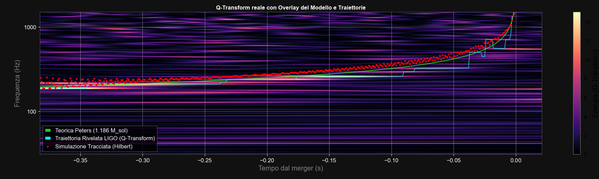

**Figura: Fase 1 (vecchia logica)**: frammento di 2.5PN + fattore `m_chirp_mult` + dead reckoning lineare. I punti tracciati oscillano in modo incostante e la forma della curva non combacia del tutto.

**Fase 2, il 2.5PN reale.** è stato sostituito il frammento con la **formula completa di Damour-Deruelle** (§6.3), tenendo ancora il dead reckoning e un `m_chirp_mult` ridotto a correzione lieve. Effetto a doppia faccia: la **media** del chirp ricalca molto meglio Peters (la curva combacia), ma l'**oscillazione del baricentro peggiora**, addirittura più che in Fase 1. Meglio in media, peggio in stabilità.

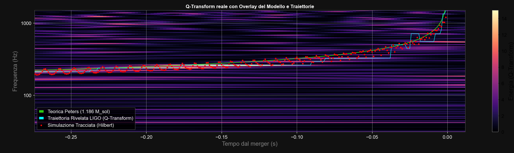

**Figura: Fase 2 (2.5PN reale, correzione lieve)**: 2.5PN reale + dead reckoning + `m_chirp_mult` lieve.

**Il problema del fattore correttivo.** Tre osservazioni, emerse una alla volta, mostravano i limiti di `m_chirp_mult` come rimedio artificiale:

- la sua **amplificazione lineare** (moltiplicare il 2.5PN per uno scalare) poteva traslare il chirp ma non correggerne la *curvatura*: lo scarto dal dato reale era di forma, non di sfasamento, e anche quando *non* spostava la massa chirp attesa (come in Fase 1), ne alterava comunque leggermente la forma della curva;
- in Fase 2, con la formula reale, **alzava la massa chirp apparente**, perché iniettava nell'orbita energia oltre quella fisica e falsava la stima a valle;
- più venivano migliorati gli altri elementi, più il valore ottimale del fattore tendeva a 1.

**Fase 3, la rimozione dei rimedi.** A questo punto ho eliminato i correttivi artificiali, ed è qui che l'eccentricità residua si è ridotta in modo decisivo:

- **rimosso `m_chirp_mult`** (portato a 1): il motore diventa *parameter-free*;
- **rimosso il dead reckoning lineare** nel regime GW, sostituito dal **bypass a posizioni presenti** (§3.2): si elimina l'aberrazione residua che alimentava l'eccentricità;
- **corretto il bug della prima accelerazione**: il primo half-kick del Verlet partiva da un'accelerazione non inizializzata, introducendo un transiente all'avvio di ogni rebuild; la correzione è il *warm-start* delle accelerazioni iniziali (dettaglio in [ARCHITECTURE_DEEP_DIVE.md](ARCHITECTURE_DEEP_DIVE.md));
- **corretta la stima della massa chirp** lato analizzatore (dalla regressione lineare di $\dot{f}$ al fit della legge di potenza $f(\tau)\propto\tau^{-3/8}$, §8.8), eliminando un errore di metodo non fisico.

Il risultato finale, con i punti che aderiscono alla curva, è in §6.6. Resta un limite noto: lo scenario BBH (GW150914) mostra ancora una sovra-dissipazione di fattore $2\text{-}3\times$ rispetto al tempo di coalescenza atteso dalla formula di Peters, segno che la struttura del termine dissipativo all'ordine dominante (termini PN superiori, dipendenze in $r$/$v$) non è sufficiente nel regime a masse elevate. Il confronto dettagliato con la relatività numerica del catalogo SXS è documentato in §6.6.1, ed è il confine dichiarato del progetto: oltre questo limite servirebbe la collaborazione di un esperto di relatività (vedi Roadmap nel README).

### 6.6 Le prove: confronto col dato reale

I numeri non sono asseriti, sono **misurati**. Il riferimento è lo strain pubblico di GW170817 dal Gravitational Wave Open Science Center (rivelatore **H1**, 4096 s campionati a 16 kHz, da [gwosc.org](https://gwosc.org/eventapi/html/GWTC-1-confident/GW170817/v3/)). Lo script di confronto carica lo strain reale, ne estrae la traccia di frequenza del chirp (Q-transform) attorno al merger, vi sovrappone i punti della **simulazione** (frequenza istantanea via Hilbert) e la curva **teorica di Peters**, e calcola l'errore punto per punto.

**Una nota sulla massa chirp del grafico.** GW170817 ha un piccolo redshift ($z \approx 0{,}01$), quindi la massa chirp *osservata nel rivelatore* (detector frame, $\approx 1{,}1975\ M_\odot$) è leggermente più alta di quella *propria della sorgente* (source frame, $\approx 1{,}186\ M_\odot$). I grafici delle prime due fasi (§6.5) usavano il valore source-frame; il risultato finale è confrontato nel detector frame, quello che lo strumento misura davvero.

**Il risultato finale.** Con il modello parameter-free corretto, la massa chirp stimata dalla simulazione cade allo **0,97%** dall'analitica di Peters, e all'**8,45%** rispetto allo strain reale osservato (H1). Quest'ultimo scarto è in massima parte un **limite del modello teorico stesso**, non del simulatore: lo stesso stimatore applicato alla curva teorica pura di Peters rende già un floor dell'**8,23%** rispetto al dato reale. Il motivo è fisico, non strumentale. Peters e il 2.5PN del simulatore (§6.3) si fermano entrambi all'**ordine dominante della reazione di radiazione**, mentre il merger reale contiene contributi di ordine superiore. Tra questi pesano i termini PN successivi (3.5PN *tail*), gli **effetti mareali** delle stelle di neutroni, cruciali negli ultimi cicli di GW170817, e il regime **non perturbativo** a ridosso del contatto, dove l'espansione PN smette di convergere e serve la relatività numerica per ricostruire il segnale. A questo si aggiungono il rumore strumentale negli ultimissimi millisecondi e l'imprecisione dello stimatore vicino al picco, ma sono effetti secondari. Detto in chiaro: il simulatore ha raggiunto il limite di ciò che il modello PN all'ordine dominante può catturare, non il limite del metodo di confronto.

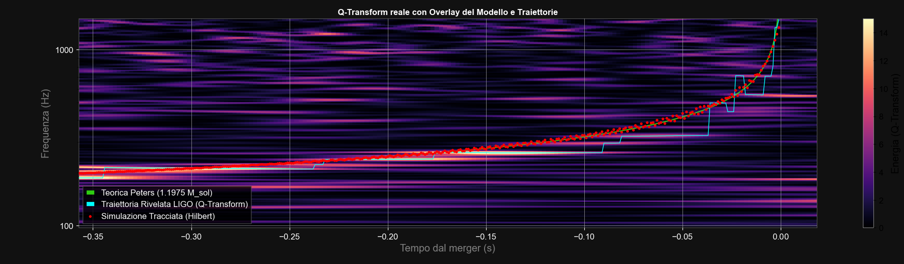

**Figura: Fase 3 (risultato finale)**: il modello finale (parameter-free, fattore correttivo rimosso, bug della prima accelerazione corretto, dead reckoning lineare sostituito dal bypass a posizioni presenti, stima della massa chirp corretta). I punti tracciati aderiscono alla curva di Peters: l'oscillazione, e con essa l'eccentricità residua, è pressoché scomparsa.

Resta onesto dire che anche il **metodo di confronto** ha i suoi limiti (il dato reale negli ultimissimi 50 ms è rumoroso, la finestra robusta è da −1,0 a −0,2 s) e con il senno di poi sarebbe stato ideale usare l'equivalente simulato da supercomputer presente nei database SXS. Ciononostante, per lo scenario BNS, l'aderenza a Peters esclude comunque l'aderenza (non attesa) all'evento reale: il simulatore ha raggiunto il limite di ciò che il modello PN all'ordine dominante può catturare. Per lo scenario BBH il confronto con la relatività numerica SXS è documentato nella sottosezione seguente.

#### 6.6.1 Lo scenario BBH (GW150914): confronto con la relatività numerica SXS

> [!NOTE]
> **Cos'è SXS.** Il progetto *Simulating eXtreme Spacetimes* ([black-holes.org](https://www.black-holes.org/)) è una collaborazione multi-universitaria (Caltech, Cornell, CITA e altri) che produce soluzioni di **relatività numerica** (NR) delle equazioni di Einstein per merger di buchi neri e stelle di neutroni. Il catalogo pubblico ([data.black-holes.org/waveforms/catalog](https://data.black-holes.org/waveforms/catalog.html)) contiene centinaia di simulazioni di riferimento, ciascuna identificata da un codice (`SXS:BBH:NNNN`). La waveform usata qui è **SXS:BBH:0305**, il template NR che meglio riproduce i parametri di GW150914 ($M_{tot} \approx 70{,}85\,M_\odot$ nel detector frame, rapporto di massa $q \approx 0{,}82$).

A differenza di GW170817 (§6.6), dove il confronto era contro lo strain reale del rivelatore H1, qui il benchmark è la **curva di frequenza pulita della relatività numerica**: è il riferimento ideale perché è privo di rumore strumentale e rappresenta la soluzione esatta delle equazioni di Einstein per quella configurazione. La curva teorica di **Peters** ($\mathcal{M} \approx 30{,}62\,M_\odot$, detector frame) funge da secondo riferimento analitico, ma all'ordine dominante: non include i contributi di ordine superiore della post-newtoniana né il regime non perturbativo vicino al merger.

**Il risultato.** La traccia del chirp del simulatore (radar cinematico, $f_{GW} = v_{rel}/(\pi D)$ letta direttamente dalla dinamica orbitale, senza alcuna elaborazione DSP) aderisce alla curva NR con **errore medio dell'1,27%** lungo tutto l'inspiral (da $\tau \approx -1{,}14$ s fino a $\tau \approx -10$ ms), contro un errore medio di Peters vs NR del **7,48%**: il simulatore è quindi *circa sei volte più aderente a NR* di quanto lo sia la formula analitica di Peters all'ordine dominante. La coalescenza simulata avviene in **52,034 s**, contro i $\approx 55$ s attesi sia da Peters sia da NR SXS:BBH:0305 dati i parametri di partenza dello scenario (separazione iniziale $D_0 = 4\,000$ km, frequenza orbitale iniziale $\sim 1{,}93$ Hz corrispondente a una $f_{GW}$ iniziale $\sim 3{,}9$ Hz per il sistema con $M_{tot} = 70{,}85\,M_\odot$ detector-frame). I $\sim 3$ s di anticipo del simulatore rispetto al riferimento sono interamente concentrati negli ultimi cicli, dove i contributi non perturbativi accelerano la coalescenza e dove anche la NR stessa lascia il regime PN puro.

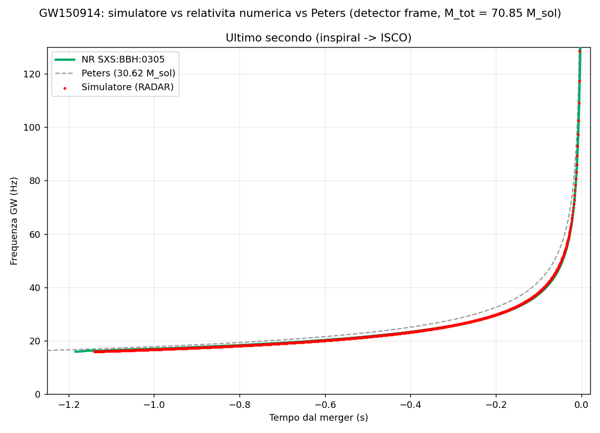

**Figura — vista globale dell'ultimo secondo di inspiral.** I punti rossi del simulatore sono visivamente sovrapposti alla curva verde della NR (SXS:BBH:0305) per quasi tutta la traccia; la curva grigia tratteggiata di Peters è sistematicamente sopra entrambe, perché trascura i contributi di ordine superiore che NR include e il simulatore cattura implicitamente attraverso la combinazione di 2.5PN + Paczyński-Wiita + freno relativistico + bypass causale.

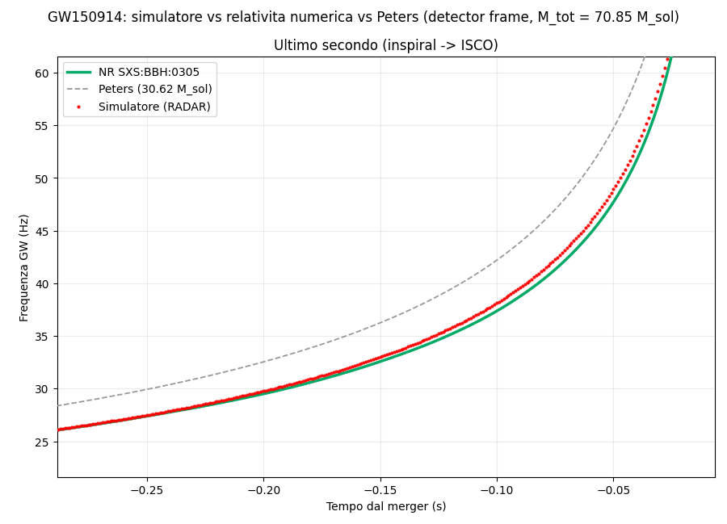

**Figura — zoom sull'ultimo segmento dell'inspiral.** Nel dettaglio si vede il punto di massimo scostamento del simulatore dalla NR: gli ultimi $\sim 10$ ms prima del merger, dove l'errore percentuale del simulatore inizia a salire rapidamente (da $\sim 2{,}5\%$ a oltre $50\%$ nell'ultimo millisecondo). Quella zona è il confine teorico del modello PN: anche la NR stessa è il regime in cui converge solo grazie a tecniche numeriche dedicate (excisione dell'orizzonte, gauge specifico), e nessuna formulazione analitica al leading order è in grado di seguirla. L'esplosione finale dell'errore è quindi il limite *strutturale* del proxy, non un suo difetto di calibrazione.

**Il limite residuo: l'ultimo millisecondo.** L'aderenza del simulatore alla NR è strutturalmente buona ($1{,}27\%$ in media) per tutto l'inspiral, e il modello cattura non solo l'ordine dominante di Peters ma anche, implicitamente, una porzione significativa dei contributi di ordine superiore (termini *tail* a 3.5PN, effetti dell'ISCO di Paczyński-Wiita, accoppiamento causale-cinetico). Resta un confine non valicato negli ultimi $\sim 10$ ms prima del merger, dove la dinamica entra nel regime non perturbativo: qui nessuna combinazione PN classica converge, e per descriverla servono tecniche di relatività numerica vera (excision dell'orizzonte, gauge BSSN o Z4) o modelli surrogati calibrati sulla NR (famiglia EOB/Phenom). È il confine dichiarato del progetto, e il punto in cui servirebbe la collaborazione di un esperto di relatività (vedi Roadmap nel README).

[GIFPLACEHOLDER]
**Showcase: GW170817 / GW150914** *(GIF in arrivo)*: l'inspiral finale delle due stelle di neutroni, il merger con accrescimento e lo spettrogramma risultante catturato dall'analizzatore.

---

## 7. La matematica delle heatmap

Tutte le heatmap calcolano, per ogni pixel, un campo derivato dalle sorgenti. Qui le quattro famiglie.

### 7.1 Potenziale scalare Φ

La somma dei contributi $GM/r$ (causali) di tutti i corpi, con la correzione di Liénard-Wiechert del §5 per le sorgenti rapide. Visualizza il pozzo di potenziale e le sue deformazioni.

  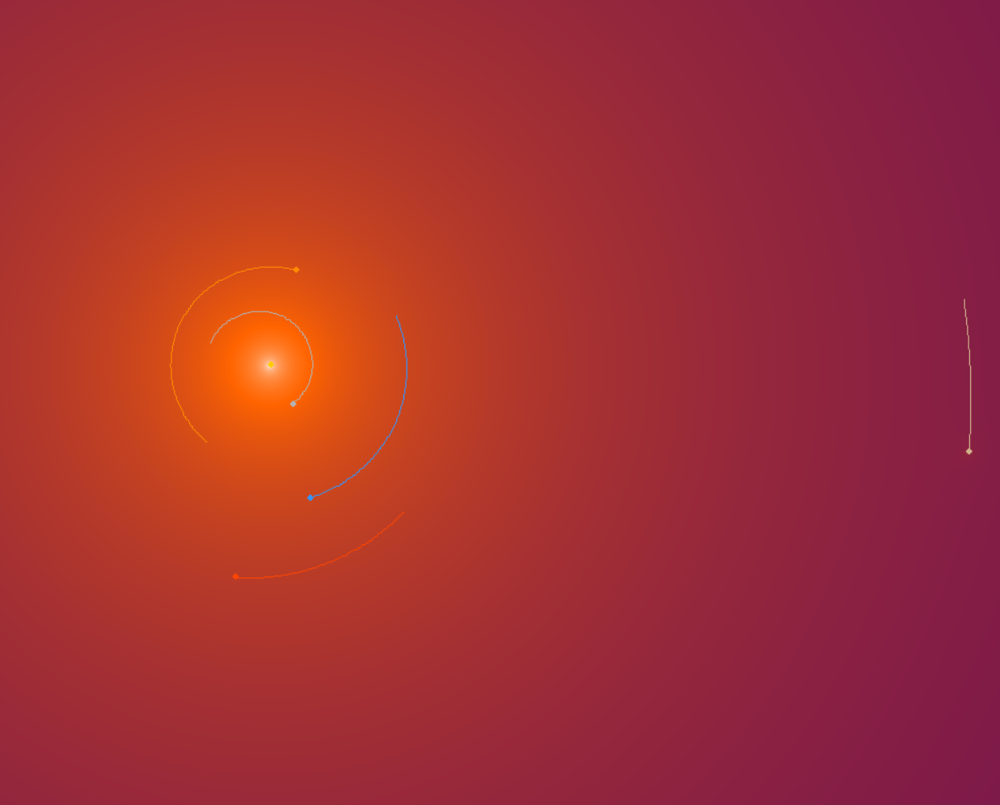

Nella figura si osserva la classica topografia dei primi pianeti del sistema solare in modalità $\Phi$ ("phi mode"). A rendere speciale questa visualizzazione è la sua interazione con l'informazione gravitazionale a velocità finita $c$: in vari scenari o tramite interazioni in-game è possibile visualizzare i fronti d'onda comprimersi o espandersi. Per un'analisi dettagliata di questa distorsione si rimanda al capitolo [§5](#5-il-disco-di-lienard-wiechert--lorentz-al-massimo), dedicato alla deformazione di Liénard-Wiechert e alla contrazione di Lorentz.

### 7.2 Variazione temporale dΦ/dt

La grandezza target è la derivata parziale del potenziale nel tempo. Per una sorgente puntiforme in moto, $\Phi = GM/r$ e, derivando rispetto al tempo (la distanza cambia al rate $\dot{r} = -v_{rad}$, con $v_{rad}$ la componente radiale della velocità):

$$\frac{\partial \Phi}{\partial t} = -\frac{GM}{r^2}\dot{r} = \frac{GM\,v_{rad}}{r^2}$$

Sommata su tutti i corpi e colorata con scala divergente (blu per il lato in avvicinamento, rosso per il lato in allontanamento), la heatmap mette in evidenza *il movimento del campo* attorno a ogni sorgente. La scala di sensibilità di base è tarata sulla massa più grande presente nello scenario (così tutti i corpi appaiono in proporzione, dal Sole al granello), e l'utente può comprimerla o esploderla a piacere via fader.

#### Showcase: dipolo del corpo singolo e spirali della coppia in inspiral

Sono i due pattern visivi che la $d\Phi/dt$ mostra più chiaramente, e affiancarli aiuta a capire perché le "onde" **visibili in $d\Phi/dt$** non sono onde gravitazionali tensoriali vere ([§1.2](#12-la-natura-delle-onde-del-simulatore-livelli-di-astrazione)): qui siamo in un campo scalare propagato causalmente, e per una proiezione tensoriale del quadrupolo (più fedele alla simmetria delle onde reali) c'è invece la heatmap **GW Strain** di [§7.6](#76-deformazione-proiettata-gw-strain-quadrupolare). Anche i nomi *spirali* e *dipolo* non sono termini fisici: sono **analoghi visivi**. *Spirali* descrive ciò che si vede e non un calcolo di quadrupolo; *dipolo* descrive il pattern bi-lobato che la heatmap disegna attorno a un singolo corpo in moto.

| Dipolo del corpo singolo in moto | Spirali della coppia binaria |
|:---:|:---:|
|  |  |
| Il pozzo trasla con la sorgente: il lato in avvicinamento al pixel diventa blu, quello in allontanamento rosso. È il **monopolo che si sposta**, non radiazione. Nell'esempio Giove orbita a velocità stabile (≈ 13 km/s) e il suo dipolo accompagna il moto, ruotando con esso; attorno, in ordine le lune: Amaltea, Io, Europa, Ganimede, Callisto. Ogni corpo mostra un dipolo proporzionato a massa e velocità orbitale. La sensibilità è tarata sulla massa massima dello scenario (il Sole in questo caso), e un selettore (fader) permette all'utente di scalare questo rapporto a piacimento, estendendo e riducendo luminosità ed estensione dei dipoli in modo proporzionato. | Scenario: *Stelle di Neutroni Binarie, Orbita Stabile*, velocità orbitale: 1580 km/s, pan camera $\approx$ 2 AU $\times$ 2 AU, velocità simulazione: 40 s/s. Due stelle di neutroni mediamente massicce (1,5 masse solari) orbitano ad una distanza di sicurezza di 40.000 km (nessun merger imminente), generando il pattern a spirale discusso in modo pienamente emergente, grazie alla causalità. |

> [!NOTE]
> **Una nota sulla causalità del rendering.** Questa heatmap, insieme alla mappa scalare $\Phi$ ([§7.1](#71-potenziale-scalare-φ)), è l'unica del simulatore a essere **interamente causale**: ogni pixel risolve il tempo di volo $r/c$ per ciascuna sorgente e legge il suo stato all'istante di emissione, non quello presente. È proprio questa causalità a far emergere il fenomeno visivamente più complesso dell'intero progetto, le spirali e i fronti d'onda. Il *come* l'intero sistema sia stato reso causale a costo $O(1)$ per lookup, mantenendo 60 fps anche con storiche profonde anni-luce, è frutto della struttura **DOD/JIT** e dell'architettura a **ring buffer LOD a 3 livelli**: la trattazione completa è in [ARCHITECTURE_DEEP_DIVE.md](ARCHITECTURE_DEEP_DIVE.md), in particolare nel **[§2 : Il Ring Buffer e lo storico delle posizioni](ARCHITECTURE_DEEP_DIVE.md#2-il-ring-buffer-e-lo-storico-delle-posizioni)**.

### 7.3 Stress di marea (e una nota sull'Hessiana)

**Cos'è una "marea" in astrofisica.** Questa heatmap, **Tidal Stress** nell'UI (mappa tidale o stress di marea). In astrofisica si chiama **forza di marea** la differenza di gravità sentita da due punti di un corpo esteso vicino a un attrattore. È ciò che alza gli oceani della Terra dal lato rivolto alla Luna, ed è anche ciò che "spaghettifica" un oggetto in caduta verso un buco nero (lo stira nella direzione radiale e lo comprime in quella trasversa). La heatmap quantifica questo effetto misurando, punto per punto, il **massimo sforzo di taglio** del campo gravitazionale.

Le due heatmap basate sulla curvatura del campo (questa e la topologia di Roche) usano l'**Hessiana** del potenziale. Intuitivamente potremmo dire che se il gradiente $\nabla\Phi$ dice *in che direzione e quanto forte* tira la gravità in un punto, l'Hessiana dice *come cambia quel tiro* spostandosi di poco: è la matrice delle derivate seconde

$$H = \begin{pmatrix} \Phi_{xx} & \Phi_{xy} \\ \Phi_{xy} & \Phi_{yy} \end{pmatrix}$$

cioè la **curvatura locale** del campo. I termini diagonali $\Phi_{xx}, \Phi_{yy}$ dicono quanto **rapidamente** cambia il tiro spostandosi lungo $x$ o lungo $y$; l'incrociato $\Phi_{xy}$ quanto le due direzioni sono accoppiate (spostarsi in $y$ modifica anche il tiro in $x$). Da questi stessi tre numeri le tre heatmap basate sulla curvatura estraggono grandezze diverse:

| Mappa | Potenziale usato | Cosa fa dell'Hessiana | Risultato |
|---|---|---|---|
| **Stress di marea** | gravità pura, istantanea (niente rotazione) | differenza dei suoi **autovalori** | mappa continua di *shear/taglio* |
| **Topologia di Roche** ([§7.4](#74-topologia-di-roche-il-segno-del-determinante)) | efficace co-rotante | il **segno del determinante** $D$ (ribaltato dal centrifugo) | **lobi continui** |
| **Lagrange Hunter** ([§7.5](#75-lagrange-hunter-determinante-e-hessiana-inversa)) | efficace co-rotante | la sua **inversa** $H^{-1}\nabla\Phi$ | **5 punti isolati** L1-L5 |

Procediamo per grado di complessità crescente. Cominciamo dalla più semplice, la marea.

Per un singolo corpo l'Hessiana del potenziale $\Phi = -GM/r$ vale:

$$H_{ij} = G m \left(\frac{\delta_{ij}}{r^3} - \frac{3\,x_i x_j}{r^5}\right)$$

dove gli indici $i, j$ scorrono sulle due coordinate del piano ($x$ e $y$), $x_i$ è la $i$-esima componente del vettore che va dal corpo al punto, $r$ è la distanza, e $\delta_{ij}$ è il **delta di Kronecker** (un simbolo che vale 1 se $i = j$, e 0 altrimenti). In chiaro, le tre componenti sono:

$$\Phi_{xx} = Gm\left(\frac{1}{r^3} - \frac{3x^2}{r^5}\right),\qquad \Phi_{yy} = Gm\left(\frac{1}{r^3} - \frac{3y^2}{r^5}\right),\qquad \Phi_{xy} = -\frac{3Gm\,xy}{r^5}$$

Lo stress di marea visualizzato è la **differenza dei due autovalori** dell'Hessiana 2×2:

$$\sigma = \sqrt{(\Phi_{xx} - \Phi_{yy})^2 + 4\Phi_{xy}^2}$$

proporzionale alla parte deviatorica del tensore, e misura il massimo **sforzo di taglio** (shear): quanto un corpo verrebbe stirato in una direzione e compresso in quella ortogonale. Una singola derivata seconda *scalare* (per esempio la radiale $\partial^2\Phi/\partial r^2$) non basterebbe: la marea è **direzionale**, e l'asimmetria tra stiramento e compressione vive nella *differenza* tra gli autovalori, non in un singolo numero. Serve quindi il tensore completo, non una sua componente né la sua traccia.

**Come la heatmap interpreta lo shear.** La $\sigma$ della formula sopra ha unità di $\text{s}^{-2}$. Per leggibilità il kernel la riscala in $\text{m/s}^2$ per km (il *gradiente di accelerazione* per unità di distanza, fisicamente più intuitivo) e ne mostra il **$\log_{10}$**, perché lo shear copre più di **11 ordini di grandezza** dal vuoto profondo dello spazio fino all'orlo di un buco nero. Il colore mappa fasce di intensità calibrate su soglie fisiche reali (limiti di Roche per diversi materiali, fratturazione di croste rocciose o di ghiaccio, spaghettificazione), come riportato dalla legenda integrata nell'UI del simulatore (tasto `M` per aprirla):

| Colore | Range $\log_{10}$ | Fascia fisica | Cosa significa |
|---|:---:|---|---|
| Bianco | $> 1{,}0$ | **Disruption micro-scala** (vicinanza alla singolarità) | Gradiente estremo. Spaghettificazione letale per la biologia umana, cedimento strutturale di scafi rinforzati. Oltre $10^4$, dissociazione molecolare. |
| Rosso | $-6{,}0$ a $1{,}0$ | **Disruption macro-scala** (zona di shear severo) | Stress critico per pianeti nani ad alta densità e asteroidi metallici. I metalli cedono; macrostrutture artificiali di grande taglia collassano sotto il proprio peso. |
| Giallo | $-7{,}5$ a $-6{,}0$ | **Limite di Roche planetario** (pianeti terrestri e roccia) | Supera la resistenza a trazione di roccia e silicati. Corpi terrestri e lune si fratturano, generando sistemi di anelli planetari permanenti. |
| Verde | $-8{,}5$ a $-7{,}5$ | **Zona di frattura crostale** (lune di ghiaccio e tettonica) | Soglia di rottura per croste di ghiaccio (es. Europa) e lune porose. Innesca spaccature tettoniche globali ed espone oceani sotto-superficiali. |
| Ciano | $-10{,}0$ a $-8{,}5$ | **Limite di Roche fragile** (comete e *rubble piles*) | Disruption di materia non legata e comete. In lune solide induce attrito interno estremo e vulcanismo mareale (es. Io). |
| Blu scuro | $< -10{,}0$ | **Equilibrio orbitale** (spazio sicuro / vuoto) | Ambiente spazialmente piatto. La curvatura gravitazionale differenziale è trascurabile, nessun effetto tidale percepibile su macrostrutture o corpi celesti. 

**Showcase: Sistema di Giove (Europa e Io)**

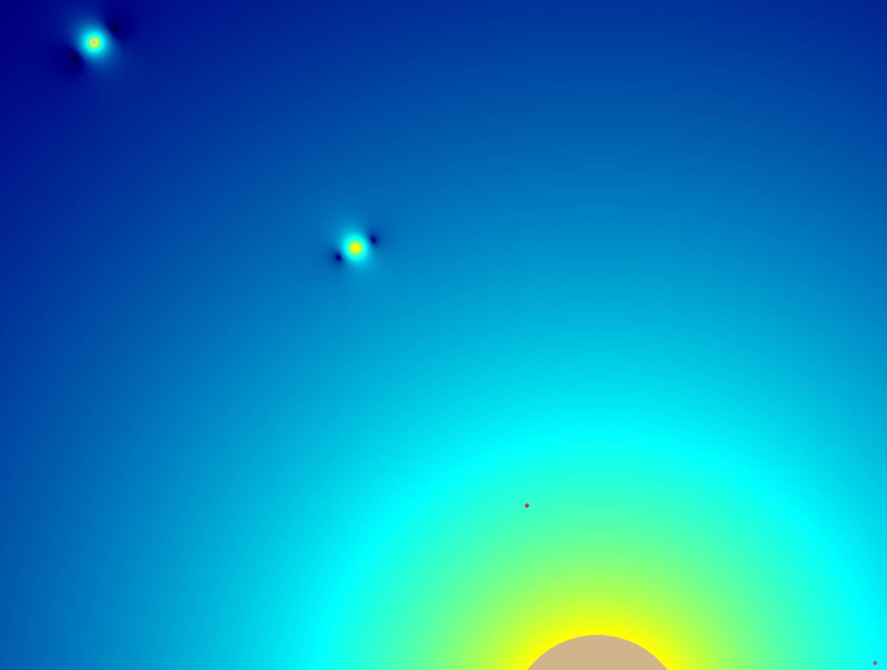

In alto a sinistra la luna gioviana **Europa**, immersa nel blu verso il ciano della mappa tidale di Giove. Al centro **Io**, in pieno ciano: è la stessa marea che spiega perché sia il corpo roccioso con maggior attività vulcanica dell'intero sistema solare. Da notare come la heatmap consideri anche lo stress mareale che ciascuna luna genera a sua volta, e come essa stessa risulti deformata dall'immersione nella marea di Giove.

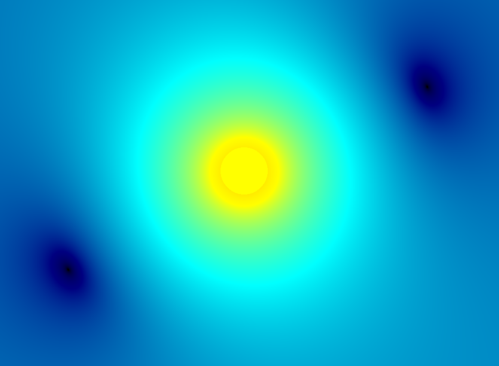

> **NDA.** I due lobi neri trasversali che si vedono attorno a ciascuna luna sono punti in cui lo shear $\sigma$ visualizzato si annulla, ma per un motivo **molto diverso** da quello del blu scuro lontano dai corpi. Nel blu lontano, $\Phi_{xx}, \Phi_{yy}, \Phi_{xy}$ sono tutti piccoli perché il campo è piatto. Nei lobi neri vicini alla luna, al contrario, le singole componenti dell'Hessiana sono **grandi e consistenti**, e si combinano in modo che $\Phi_{xx} = \Phi_{yy}$ e $\Phi_{xy} = 0$: la somma di quadrati $(\Phi_{xx}-\Phi_{yy})^2 + 4\Phi_{xy}^2$ va a zero non per assenza di campo, ma perché gli autovalori dell'Hessiana coincidono. La marea lì è localmente **isotropa**: stira allo stesso modo in tutte le direzioni del piano. Questi due punti nascono dall'interferenza geometrica fra il contributo della luna stessa (radiale, simmetrico) e quello di sfondo di Giove (anisotropo, orientato lungo l'asse luna-Giove); proprio nelle due posizioni trasverse i due tensori si combinano in modo da pareggiare le direzioni principali.
>
> **Una conferma osservata in simulazione.** Variando la distanza luna-Giove, i lobi si spostano in modo prevedibile: quanto più la luna è immersa nel campo del gigante (cioè vicina a Giove), tanto più i lobi si stringono attorno a essa; quanto più si allontana, tanto più i lobi si dilatano. La regolarità della proporzione suggerisce che ci sia una legge di scala precisa dietro, riconducibile alla struttura della differenza fra le componenti dell'Hessiana. La derivazione quantitativa esula dallo scope di questa guida, e la lascio a un'analisi successiva.
>
> Cosa accade nell'equivalente 3D non mi sbilancio: l'ipotesi naturale è che corrisponda a essere *"tagliati" in tutte le direzioni del piano trasverso* invece che lungo un asse preferenziale, e quindi a uno stress isotropo intenso anziché nullo, ma è un punto che meriterebbe la conferma di un esperto.

> [!NOTE] è giusto ricordare che nel simulatore l'utente può confermare quantitativamente ottenere i dati delle heatmap nel pixel nello spazio puntato con un semplice *doppio-click*

### 7.4 Topologia di Roche (il segno del determinante)

#### 7.4.1 Il potenziale efficace nel sistema co-rotante

È il passo successivo alla marea, e introduce un ingrediente nuovo: il **potenziale efficace nel sistema co-rotante**. Per capire perché serve, basta un esperimento mentale. Se ti metti su una giostra che ruota a velocità angolare $\omega$ e ne descrivi la fisica *dall'interno* (cioè nel sistema che ruota con te), avverti due forze: la gravità solita, e una **forza centrifuga** che ti spinge verso l'esterno. Quella forza non esiste in un sistema inerziale, è un effetto del riferimento rotante, ma per chi ci vive dentro è del tutto reale.

Il **potenziale efficace co-rotante** somma esattamente queste due cose: il potenziale gravitazionale dei corpi più il potenziale centrifugo $-\tfrac{1}{2}\omega^2 d^2$ (dove $d$ è la distanza dal baricentro). La velocità angolare $\omega$ del sistema è ricavata cinematicamente dalla **coppia bloccata** (il corpo che l'utente blocca e il suo attrattore dominante), tramite il momento angolare specifico:

$$h = \vec{r}\times\vec{v}_{rel}, \qquad \omega = \frac{h}{r^2}$$

**Momento angolare $h$ e velocità angolare $\omega$: due cose diverse.** Vale la pena fissarle prima di proseguire, perché tutta la lettura della heatmap si appoggia qui.

- $h = r^2\omega$ è il **momento angolare specifico** (intuitivamente: lo *slancio rotatorio* del corpo). In un'orbita non perturbata è una quantità **conservata**: non cambia mai, perielio o afelio, plunge o circolare. È un'**invariante del corpo**.
- $\omega = h/r^2$ è la **velocità angolare istantanea** (quanto in fretta sto girando *adesso*). Per un dato $h$, $\omega$ esplode quando $r$ è piccolo e collassa quando $r$ è grande. È un'**istantanea**.

È letteralmente la **seconda legge di Keplero**: $r^2 \dot\theta = h$ costante, quindi $\dot\theta$ cresce dove $r$ scende. Mercurio al perielio gira veloce, all'afelio rallenta molto, ma il prodotto $r^2\omega$ è sempre lo stesso. La heatmap respira col $\omega$ corrente: nelle orbite eccentriche, la soglia visibile nella heatmap **si sposta in fase con l'eccentricità**. In un'orbita perfettamente circolare, $\omega$ è costante e la soglia è ferma: tutto il moto che vedi nella heatmap *è* la non-circolarità dell'orbita.

Il frame ruota quindi come un *disco rigido* alla $\omega$ istantanea, e questo cattura proprio la dinamica delle orbite chiuse: nel riferimento co-rotante una luna in orbita circolare è  come se fosse ferma, e ciò che si vede sono solo le perturbazioni di tutto il resto.

Su questo potenziale, Roche guarda il **segno del determinante** dell'Hessiana, $D = \Phi_{xx}\Phi_{yy} - \Phi_{xy}^2$ (lo stesso oggetto matematico di §7.3, ma calcolato sul potenziale efficace invece che sulla gravità pura).

Ed è qui che il centrifugo è protagonista. La sola gravità, vicino a un corpo, dà sempre una **forma iperbolica** ($D < 0$, sella locale della superficie potenziale): stira radialmente e comprime trasversalmente. Il termine centrifugo, sommato all'Hessiana, abbassa entrambi gli autovalori; lontano dai corpi, dove la gravità è debole, **domina e ribalta $D$ a positivo**. È esattamente questa transizione di segno a disegnare i lobi.

> **Una precisazione sulla terminologia.** Quando in questa sezione parliamo di *sella* o *cupola* non intendiamo punti critici isolati (con gradiente zero), ma la **forma locale** della superficie potenziale in *ogni pixel* della regione: tutto il rosso ha curvatura **iperbolica** (forma di sella), tutto il blu ha curvatura **ellittica** (forma di cupola). Il gradiente però è non-nullo quasi ovunque, e una particella lasciata ferma in quei pixel **cade o viene scagliata** lungo il gradiente. Solo nei 5 punti di Lagrange si combinano entrambe le proprietà -> gradiente zero **e** forma iperbolica o ellittica; ed è questa caratteristica a farne veri *punti critici* (trattati in §7.5).

#### 7.4.2 Mappatura cromatica (segno e intensità di $D$)

Ogni pixel codifica due informazioni distinte: la **tinta** dà il segno di $D$ (topologia: sella o estremo), la **saturazione lungo la rampa** dà la sua intensità adimensionalizzata. La normalizzazione naturale del frame co-rotante è $\omega^4$ (l'Hessiana ha unità $1/\text{tempo}^2$, quindi $D$ ha unità $1/\text{tempo}^4$, come $\omega^4$): la quantità mappata è dunque $\log_{10}(|D|/\omega^4)$, intervalla tra $[-3, +3]$. Vicino ai punti dolci di $D \approx 0$ si è all'estremo *cremisi/indaco* della rampa; vicino ai corpi, dove i termini $1/r^3$ dell'Hessiana esplodono, si arriva al *giallo neon/ciano* saturo. Le due rampe in dettaglio:

| $D$ | Topologia (forma locale) | Rampa di curvatura ($t = 0 \to 1$) |
|---|---|---|
| $D < 0$ | iperbolica:  sella locale (dominio gravitazionale) | cremisi $\to$ rosso fuoco $\to$ giallo neon |
| $D > 0$ | ellittica: cupola locale (dominio centrifugo) | indaco $\to$ blu elettrico $\to$ ciano |

Una particella co-rotante in zona *rossa* cadrebbe verso l'attrattore; in zona *blu* verrebbe scagliata verso l'esterno. Le sfumature dicono *quanto rapidamente* questo accadrebbe.

**La luminosità è pura forza.** Sopra la tinta, ogni pixel è modulato dal modulo della forza netta $|\nabla\Phi_{\text{eff}}|$ in scala logaritmica. Dove la forza tende a zero il pixel è **nero**: sono i punti di equilibrio e i canali a bassa forza. Nessuna ombreggiatura artificiale e nessuna illuminazione direzionale: ogni livello di luminanza corrisponde a una grandezza fisica reale. Dunque il rilievo plastico che si percepisce a simulazione in corso, l'imbuto attorno a L1 e le cupole attorno a L4/L5 (punti di Lagrange, vedo !NOTE per info qua sotto), emergono spontaneamente dal combinato di colore e luminanza.

**Come è scelta la coppia.** L'utente blocca un solo corpo; l'altro membro è l'attrattore dominante, precalcolato per ogni corpo via **forza di marea $M/r^3$** (la logica della sfera di Hill). È per questo che bloccando Io si ottiene la mappa Io-Giove e non Io-Sole: localmente è Giove a dominare il gradiente.

> [!NOTE]
> **Punti di Lagrange in breve.** Sono i cinque punti del piano dove, nel sistema co-rotante della coppia, una particella di test resterebbe ferma: la gravità dei due corpi e la centrifuga si compensano esattamente. **L1, L2, L3** stanno sull'asse che congiunge i due corpi e sono *selle* (instabili: una piccola perturbazione li allontana). **L4 e L5** giacciono a 60° avanti e dietro il corpo minore, formano triangoli equilateri con i due corpi, e sono dinamicamente stabili grazie alla forza di Coriolis: lì vivono i Trojani di Giove. La loro individuazione numerica e visiva è il compito specifico del **Lagrange Hunter** (§7.5).

#### 7.4.3 Overlay [M]: Orbita circolare ideale

Premendo `M` in modalità Topologia di Roche, sul campo viene sovrapposto un **anello continuo color lavanda** centrato sul baricentro: è il raggio a cui il target orbiterebbe **circolarmente** se chiudesse l'orbita con l'$h$ che possiede in quel momento. La formula è quella standard del problema dei due corpi:

$$D_g = \frac{h^2}{G\,M_{tot}}, \qquad r_g = D_g \cdot \frac{m_{attr}}{M_{tot}}$$

dove $D_g$ è la separazione circolare a quel $h$ e $r_g$ il raggio del target rispetto al baricentro. L'anello è l'analogo concettuale dei marker analitici dei punti di Lagrange nel Lagrange Hunter (§7.5): un riferimento **teorico calcolato** sovrapposto al campo **emergente**, per leggere a colpo d'occhio quanto il sistema è vicino o lontano dall'equilibrio.

**Cosa l'anello dice, e come si comporta nei vari scenari:**

| Configurazione | Lettura |
|---|---|
| Target **sull'** anello | orbita circolare, sistema stabile |
| Target **dentro** l'anello ($r < r_g$) | eccesso di $h$ rispetto al raggio attuale → corpo in direzione del suo perielio, sta uscendo |
| Target **fuori** dall'anello ($r > r_g$) | deficit di $h$ → corpo in direzione del suo afelio o in caduta |
| Anello **dentro** l'attrattore | $h$ troppo piccolo per qualsiasi orbita: **plunge garantito**, visibile prima ancora del lancio |

**Come si comporta in tempo reale.** Siccome $h$ è conservato durante un'orbita non perturbata, l'anello è una **guida fissa**: non respira come la soglia rosso/blu. Lo smuovono solo eventi che cambiano $h$, $M_{tot}$ o la coppia:
- **Radiazione GW fino alla coalescenza (reazione 2.5PN)**: la radiazione gravitazionale irradia $h$ → l'anello **si stringe a spirale** in tempo reale mentre l'orbita decade.
- **Cambio attrattore** (es. Terra sostituita da Giove): $M_{tot}$ esplode → l'anello **collassa** dentro il pianeta, plunge annunciato.
- **Perturbazioni multi-corpo o flyby**: derive lente o salti.

In un'orbita pulita e isolata, invece, l'anello resta immobile mentre la soglia rosso/blu del lobo di Roche respira dentro e fuori di esso: la **divergenza istantanea fra i due** è la misura visiva diretta dell'eccentricità.

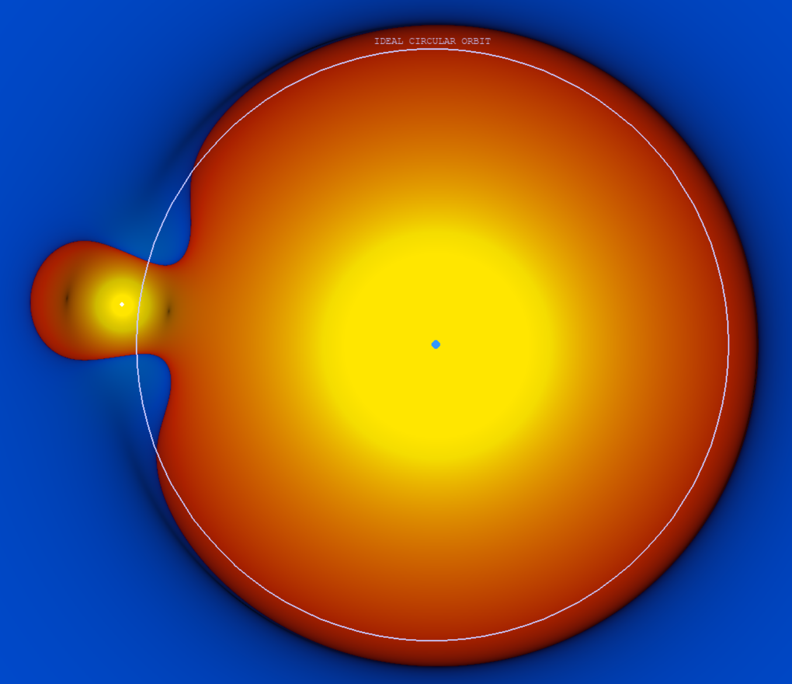

Sistema Luna-Terra: la Luna è al suo afelio a più di 400.000 km dalla Terra, infatti ha superato l'anello dell'orbita circolare ideale. Gli altri dettagli che emergono verranno discussi nel capitolo successivo.

L'animazione mostra un esperimento *what if*: sostituire la Terra con Giove e osservare il comportamento della Luna di conseguenza. Essa, conservando il momento angolare originario (tarato per la Terra), si trova nel peggior scenario possibile: la sua nuova orbita ideale, con quel $h$, risulta essere vicino al centro di Giove. Inoltre si ritrova immersa e sopraffatta quasi subito da un campo tidale estremo che con ogni probabilità la farà a pezzi prima ancora di raggiungere l'atmosfera di Giove, in *plunge* diretto.

#### 7.4.4 Lettura combinata delle tre informazioni

Questa è l'unica heatmap del simulatore che codifica **tre quantità fisiche distinte simultaneamente**, e merita una lettura combinata:
1. **Topologia degli spazi efficaci** *(dal segno di $D$, dato dalla tinta rosso/blu)*. Nel frame corotante alla $\omega$ istantanea della coppia, il segno del determinante Hessiano partiziona lo spazio in due regioni complementari: le zone rosse (iperboliche, $D < 0$), dove il gradiente gravitazionale impone una curvatura differenziale (stiramento lungo una direzione, compressione lungo l'altra), e le zone blu (ellittiche, $D > 0$), dove la forza centrifuga domina uniformemente su entrambi gli assi, spingendo la materia verso l'esterno. Il confine $D = 0$ tra le due regioni traccia dinamicamente i **lobi di Roche**.
In fase ad alta energia centrifuga (es. al perielio di un'orbita eccentrica), il mare blu si espande sommergendo il sistema: la centrifuga vince sulla caduta e il corpo sta accelerando in uscita verso il proprio afelio. In questo oceano, lo spazio efficace del corpo minore sopravvive come una "nocciolina" rossa, una tasca in cui la sua autogravità locale sconfigge la centrifuga circostante. L'errore interpretativo da evitare è confondere spazio topologico e materia: un corpo conserva la propria integrità strutturale solo se la sua estensione fisica è interamente contenuta nella propria tasca rossa. Il linea di massima, all'interno della sacca di autogravità è importante giusto notare come dalla zona gialla in poi l'autogravità si faccia importante e determinante, un qualsiasi oggetto in quell'area con velocità angolari simili avrà il vettore forza (visibile nel simulatore) nella direzione del padrone dello spazio efficace.

#### 7.4.5 Caso di studio: La missione Artemis II

    <video src="https://github.com/user-attachments/assets/b34ef8c8-b535-48ce-9ff8-8cd3820a8612" controls="controls" width="100%"></video>

**Missione Artemis II (NASA, aprile 2026)**: lo scenario impiega i vettori orbitali reali della missione in **fase di crociera translunare**, catturati alle **2026-04-03T12:03:39 UTC** (circa 12 ore dopo il completamento della manovra di *Translunar Injection*). In questo istante la navicella **Orion** viaggia in volo inerziale non alimentato (motori spenti) a 134.376 km dalla Terra (~34% della distanza Terra-Luna) e a 283.833 km dalla Luna, a una velocità di 2,037 km/s rispetto alla Terra. La simulazione ne riproduce la traiettoria balistica passiva fino al *flyby* del 6 aprile. Nella visualizzazione della topologia di Roche (associata al sistema corotante Terra-Luna), si può osservare graficamente la transizione gravitazionale: quando Orion attraversa il lobo di transizione ed entra nello spazio efficace dominato dalla Luna (colorazione giallo/cremisi), il **vettore viola dell'accelerazione netta** devia progressivamente il suo orientamento dal baricentro terrestre a quello lunare.

La simulazione opera in un sistema di riferimento eliocentrico inerziale (non vincolato geocentricamente); di conseguenza, l'intero sistema Terra-Luna e la navicella stessa orbitano solidalmente attorno al Sole a circa 30 km/s. Questo comportamento è monitorabile in tempo reale tramite il **Pannello di Telemetria Orbitale** (HUD), i cui parametri e funzionamento sono discussi in dettaglio nel paragrafo dedicato **[§7.8](#78-il-pannello-di-telemetria-orbitale-hud)**.

Per esplorare l'intero scenario dinamico si invita a utilizzare la simulazione interattiva; il video soprastante illustra i passaggi salienti prima e dopo il *flyby* lunare, rendendo visibili le transizioni dello spazio efficace.

Le condizioni iniziali ($t_0$) per l'intero sistema (Terra, Luna, Orion) sono state estratte in modo programmatico e simultaneo tramite le API **JPL Horizons**. Per garantire un'integrazione rigorosa nel kernel $O(N^2)$, esente da forze fittizie o deriva del centro di massa, i vettori di stato cartesiani sono stati interrogati in un sistema di riferimento **eliocentrico inerziale** (origine al centro del Sole, `@10`), orientati sul piano dell'eclittica e successivamente proiettati sul piano $xy$. Senza alcuna spinta artificiale aggiunta, la traiettoria attraversa la mappa di Roche Terra-Luna, entra nel lobo gravitazionale lunare, e ne sfrutta l'influenza come fionda gravitazionale per il **flyby di *free-return***, il viaggio passivo di ritorno verso la Terra. 

#### 7.4.6 Caso di studio: Mercurio al perielio

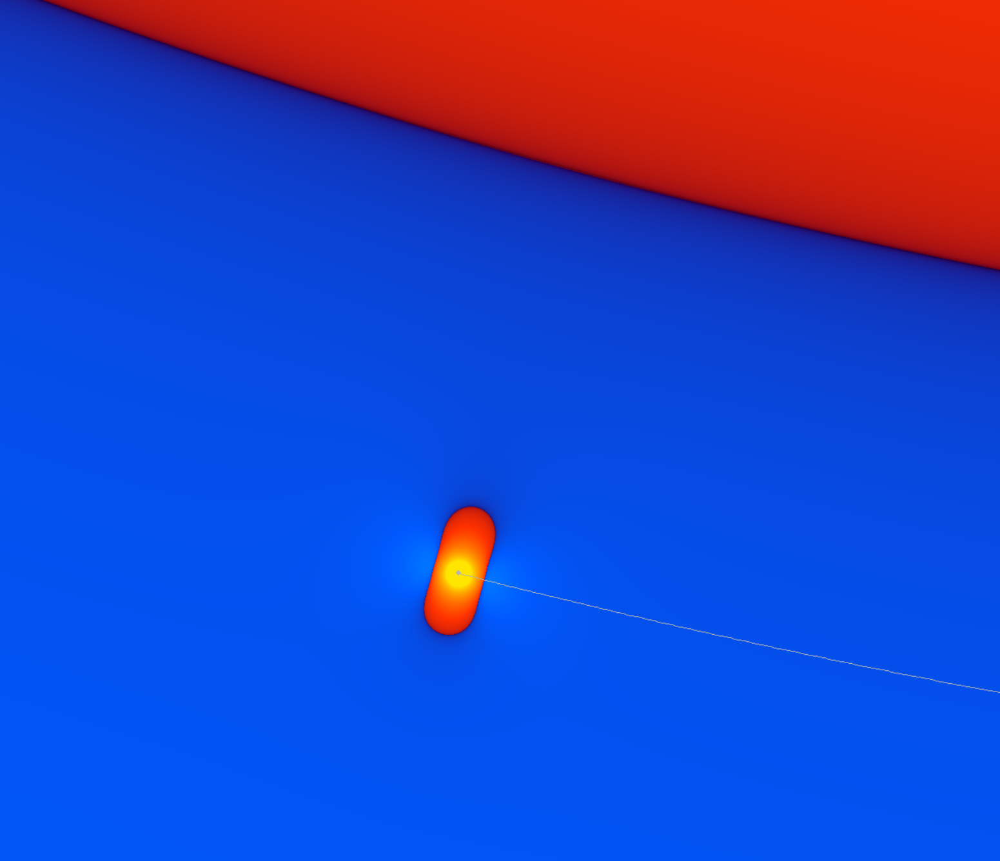

Contesto: Mercurio al suo perielio è a 46.001.200 km dal Sole a velocità relativa di 58,98 km/s, la sua $\omega$ è massima al punto che la sua sacca di autogravità è immersa nella fase centrifuga ($D$ positivo); la forma dell'area di gravità efficace di Mercurio nel sistema corotante sarebbe circolare se non fosse pesantemente compressa dallo stress mareale generato dalla vicinanza con la stella.

2. **Stress mareale e disgregazione** *(dalla saturazione cromatica e dalla deformazione geometrica)*. La mappa rivela le condizioni di rottura secondo due regimi fisicamente distinti:

   * *Regime di plunge (bassa centrifuga, frame dominato dalla gravità):* il campo è dominato dal rosso dell'attrattore principale. La saturazione verso il giallo neon segnala la rapida espansione dei termini $1/r^3$ dell'Hessiana. Un corpo esteso che precipita in questa regione potrebbe subire un forte stress tidale, e a seconda dell'estensione anche frammentarsi, deformato all'interno dello spazio efficace dell'attrattore.
   * *Regime centrifugo (orbite eccentriche, alta $\omega$):* emerge il "mare" blu e lo stress si legge dalla deformazione geometrica della "nocciolina" rossa, la forma che assume l'area di gravità efficace del corpo minore della coppia corotante. Più il campo di marea è intenso, più la "nocciolina" si comprime. Quando la topologia rossa si contrae fino a rientrare entro il raggio fisico solido del corpo, le sue estremità materiali fuoriescono nel dominio blu (o nel rosso dell'attrattore). In quell'istante la forza centrifuga (o la gravità esterna) è sufficiente a strappare massa dalle estremità: si verifica la disgregazione per *Roche Lobe Overflow*. La forma geometrica emergente della nocciolina è dunque l'indicatore diretto della stabilità strutturale. Questo è un fenomeno estremo responsabile della formazione dei dischi di accrescimento dei buchi neri, e il simulatore rende chiaro quando ciò accada o quanto qualitativamente si sia vicini al fenomeno.

3. **Punti di Lagrange L1 e L2** *(dalla luminosità: zeri di forza in zone rosse)*. Nei due lobi rossi vicino ai corpi compaiono **due aree nere**: sono i Lagrange collineari interni, gli unici due punti di equilibrio che emergono come "buchi di luminosità" in questa heatmap. L3, L4, L5 esistono ma stanno sul **confine rosso/blu**, dove tutto il bordo è già a forza bassa, e l'informazione si annega in quel canale. Per individuarli tutti e cinque in modo netto serve il **Lagrange Hunter** (§7.5), che è costruito apposta. Gli stessi L1 e L2 citati potrebbero non apparire se è presente un terzo corpo molto forte altrove ma nell'area di influenza (es. nel sistema Terra-Luna con il Sole attivo i punti L1/L2 non emergono facilmente).

In una sola inquadratura, dunque, è possibile intuire: dove vanno le particelle, dove la marea distrugge, e dove sono gli equilibri ovvi della coppia. È la mappa più densa di informazioni del simulatore.

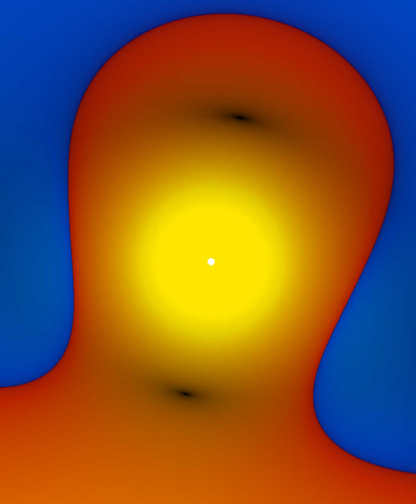

Zoom sul contesto Luna-Terra prima mostrato, focus sull'autogravità della Luna nel sistema corotante: L1 e L2 emergono chiaramente come fosse scure.

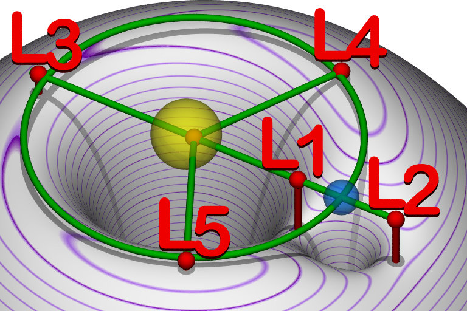

Immagine presa da Wikipedia che mostra in modo chiaro una visione alternativa e 3D dei potenziali efficaci e della distribuzione dei punti di Lagrange, utile anche per il capitolo successivo.

### 7.5 Lagrange Hunter (determinante e Hessiana inversa)

È il passo finale, il più elaborato. Si appoggia esattamente sullo stesso **potenziale efficace co-rotante** $\Phi_{eff}$ introdotto in §7.4 (gravità più centrifugo, con $\omega = h/r^2$ ricavato dalla coppia bloccata). I **punti di Lagrange** sono i cinque punti di equilibrio di quel potenziale, cioè gli **zeri del gradiente** $\nabla\Phi_{eff}$: lì la forza netta sentita da una particella co-rotante è nulla. La stessa heatmap della Topologia di Roche è nata per errore come tentativo fallito di far emergere i punti di Lagrange, mantenuto per la ricchezza di informazioni che inizialmente non avevo considerato di trovare. La soluzione del così rinominato Lagrange Hunter (perché cerca pixel per pixel) usa invece uno **stimatore di distanza di tipo Newton-Raphson**.

Il metodo di Newton-Raphson è la tecnica numerica standard per trovare gli zeri di una funzione: dato un punto, usa la pendenza locale per fare un salto verso lo zero più vicino. Qui la funzione di cui cerco gli zeri è il gradiente $\nabla\Phi_{eff}$, e la "pendenza del gradiente" è proprio l'Hessiana. Vicino a un punto critico il gradiente si linearizza:

$$\nabla\Phi_{eff} \approx H \cdot \delta\vec{r} \;\Longrightarrow\; \delta\vec{r} \approx H^{-1}\,\nabla\Phi_{eff}$$

dove $\delta\vec{r}$ è il passo (vettoriale) verso il punto critico più vicino. La sua lunghezza è la **distanza stimata** dal punto di Lagrange:

$$r_{est} = \left|H^{-1}\,\nabla\Phi_{eff}\right|$$

Per l'Hessiana 2×2 l'inversa è esplicita e dipende dal **determinante** $D = \Phi_{xx}\Phi_{yy} - \Phi_{xy}^2$:

$$H^{-1} = \frac{1}{D}\begin{pmatrix} \Phi_{yy} & -\Phi_{xy} \\ -\Phi_{xy} & \Phi_{xx} \end{pmatrix}$$

Quindi $r_{est}$ contiene un fattore $1/D$ (l'**inverso del determinante**): più ci si avvicina a un punto di Lagrange, più $r_{est} \to 0$ e più il pixel viene illuminato. È un "compasso" che misura quanto si è vicini all'equilibrio.

**La catena di calcolo, pixel per pixel.** Quello che il kernel esegue su ogni pixel della heatmap, in cinque passi:

1. **Gradiente e Hessiana analitici.** Si calcolano in forma chiusa le componenti $\Phi_x, \Phi_y$ del gradiente e $\Phi_{xx}, \Phi_{yy}, \Phi_{xy}$ dell'Hessiana sommando i contributi gravitazionali dei due corpi della coppia (le stesse formule di §7.3, ma valutate nel pixel corrente). A questi si aggiungono i **termini centrifughi**: $-\omega^2\,\vec{d}$ sul gradiente e $-\omega^2$ sulla diagonale dell'Hessiana, con $\omega$ ricavato dalla cinematica istantanea della coppia (§7.4). Niente derivate numeriche: tutto in forma analitica.

2. **Newton-Raphson per la stima della distanza.** Con $D = \Phi_{xx}\Phi_{yy} - \Phi_{xy}^2$ e la formula esplicita di $H^{-1}$ già vista sopra, si calcola componente per componente $\delta\vec{r} = H^{-1}\nabla\Phi_{eff}$, e la sua lunghezza $r_{est} = |\delta\vec{r}|$ è la **distanza stimata dal punto critico più vicino**.

3. **Conversione in distanza schermo.** $r_{est}$ è in chilometri (mondo); per disegnarla serve la distanza in pixel: $d_{px} = r_{est} / s$, con $s$ la scala camera ($\text{km/pixel}$).

4. **Filtro spaziale e gaussiana.** Se $d_{px}$ è sotto una soglia $r_{soglia}$ (calibrata dal **fader di sensibilità**, ~5 px al valore di default), il pixel cade dentro un punto di Lagrange candidato e gli si assegna un'intensità $I = e^{-2\,(d_{px}/r_{soglia})^2}$: è la **gaussiana** che rende visibile il punto come una campana luminosa centrata sul vero zero del gradiente. Fuori dalla soglia il pixel resta nero.

5. **Filtro topologico e colorazione.** Prima di colorare il pixel candidato, due controlli finali:
   - se $D > 0$ **e** traccia $> 0$ (la *traccia* è la somma dei termini diagonali dell'Hessiana, $\text{tr}(H) = \Phi_{xx} + \Phi_{yy}$, ed equivale alla somma dei due autovalori) il pixel è sopra un *minimo* del potenziale efficace (un pozzo gravitazionale di uno dei due corpi): pixel nero, escluso. Senza questo filtro, ogni corpo apparirebbe come un blob blu sovrapposto al proprio pozzo.
   - altrimenti, il segno di $D$ decide il colore: sella ($D < 0$) → **rosso** $(I,\;0.1\,I,\;0.1\,I)$ → L1, L2, L3; estremo stabile ($D > 0$ con traccia $< 0$) → **blu** $(0.1\,I,\;0.4\,I,\;I)$ → L4, L5. L'intensità $I$ della gaussiana modula la brillantezza, così il centro del punto è pieno e i bordi si dissolvono.

In sintesi: la **curvatura locale fa da compasso** (localizza il punto critico tramite Newton-Raphson), la **gaussiana fa da pennello** (lo rende visibile), e i due filtri (spaziale e topologico) tengono fuori il rumore e i falsi positivi sui pozzi dei corpi.

**Perché si leggono bene solo gli intorni degli zeri.** La linearizzazione $\nabla\Phi_{eff} \approx H\,\delta\vec{r}$ vale solo *vicino* a un punto critico; lontano, il modello lineare è sbagliato e $r_{est}$ perde di senso (satura). Per questo la mappa è nitida solo negli intorni dei punti di Lagrange, esattamente come una gaussiana è informativa solo attorno alla sua cresta: fuori, è buio.

**Overlay [M]: marker analitici teorici.** Premendo `M` in modalità Lagrange Hunter, alla heatmap vengono sovrapposti i cinque **punti di Lagrange analitici** della coppia, calcolati in forma chiusa dal problema dei tre corpi circolare ristretto (formule in [§9.4](#94-punti-di-lagrange-analitici-problema-dei-tre-corpi-circolare-ristretto)). Sono **benchmark fissi** che permettono di misurare a colpo d'occhio lo scostamento dei punti reali (illuminati dal Newton-Raphson) dalle posizioni ideali, ed è il dettaglio che rende visibile la *respirazione* dei punti di Lagrange in orbite eccentriche o perturbate. La discussione completa della coesistenza dei due overlay (perché entrambi, e cosa leggere da ciascuno) è in [§9.6](#96-perché-coesistono-loverlay-teorico-e-la-heatmap-dinamica).

| Senza overlay | Con overlay teorico [M] |
|:---:|:---:|
| 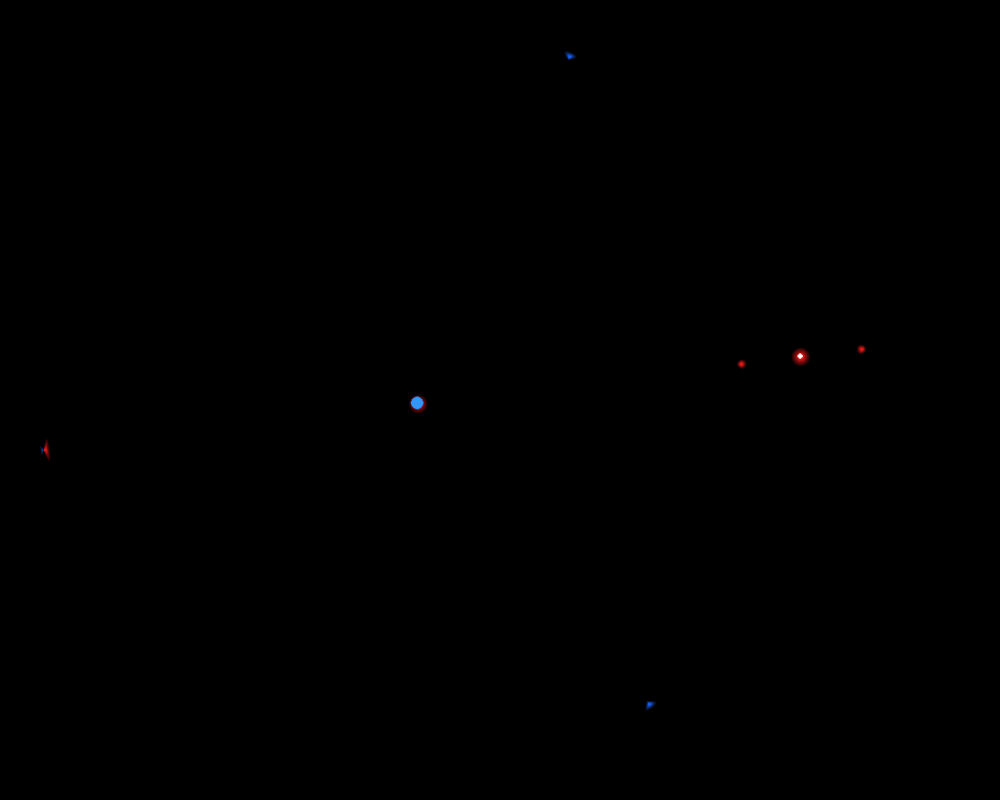 | 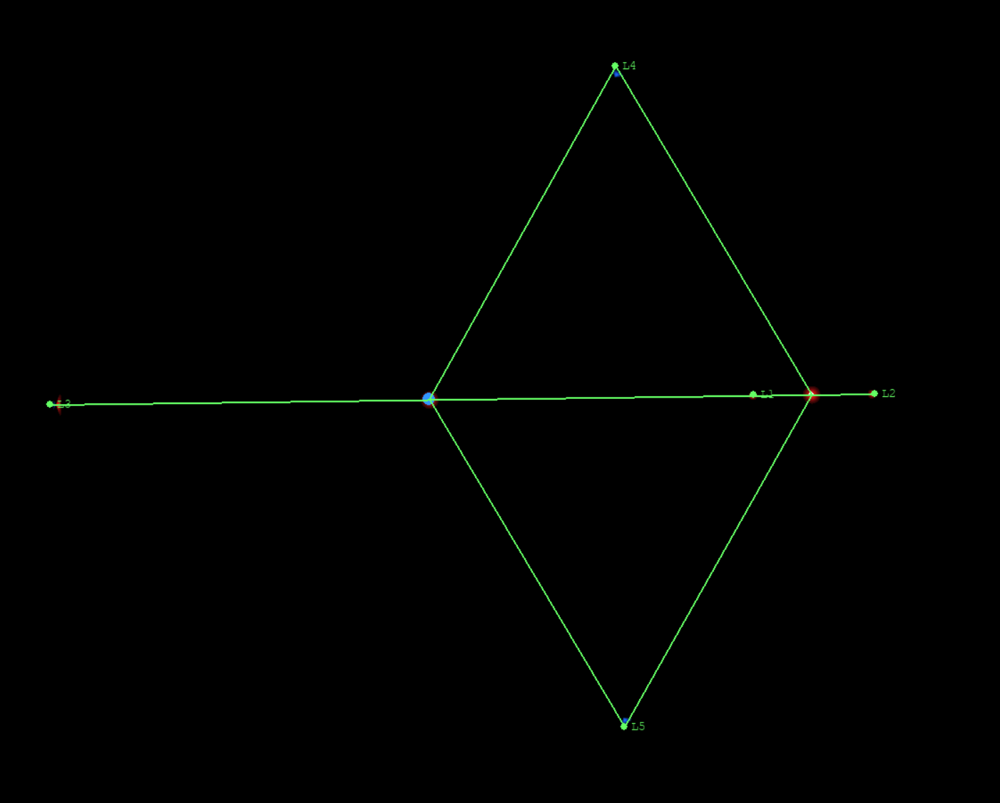 |

*Il Lagrange Hunter che illumina i punti stabili L4/L5 (blu) e instabili L1/L2/L3 (rossi), mostrando come l'overlay teorico guidi alla loro localizzazione rapida.*

### 7.6 Deformazione proiettata (GW Strain Quadrupolare)

Questa heatmap, denominata **GW Strain (Quadrupole)** nell'interfaccia utente, rappresenta la visualizzazione più sofisticata del campo dinamico del simulatore. A differenza delle heatmap potenziali o tidali classiche, essa mappa direttamente lo *strain* gravitazionale causale proiettato, associato all'emissione di onde gravitazionali da parte di sistemi binari compatti.

> [!NOTE]
> **Introduzione teorica allo Strain e al Quadrupolo**
> Se non si ha familiarità con i concetti di deformazione metrica (*strain*) e momento di quadrupolo di massa, si consiglia vivamente di consultare preventivamente le sezioni di approfondimento del capitolo 8, in particolare:
> - **[§8.2](#82-cos%C3%A8-il-momento-di-quadrupolo-di-massa-le-due-facce-del-quadrupolo)** per comprendere la natura fisica del quadrupolo;
> - **[§8.3](#83-la-formula-3d-camuffata-e-la-proiezione-ortogonale-al-piano)** per l'analisi della formula metrica proiettata;
> - **[§8.4](#84-cosa-registra-la-sonda-virtuale-il-proxy-basato-sulle-velocit%C3%A0)** per il funzionamento pratico del proxy cinematico nel motore.

#### 7.6.1 Formulazione matematica e proiezione
La formulazione matematica usata dal motore per calcolare lo strain in ogni pixel condivide la stessa identica logica fisica e le medesime semplificazioni numeriche della sonda virtuale LIGO descritta nel capitolo successivo. 

In particolare, per escludere il forte rumore numerico indotto dalle accelerazioni nel regime discreto (\(dt\)) a ridosso del merger, si adotta una **regolarizzazione cinetica** (spiegata in dettaglio in [§8.5](#85-il-problema-numerico-dellaccelerazione-e-la-regolarizzazione-cinetica)), scartando il termine delle forze a favore del solo proxy basato sulle velocità relative. Questo approccio si basa sull'equivalenza esatta tra i due contributi nel caso limite di orbite circolari (discussa in [§8.3](#83-la-formula-3d-camuffata-e-la-proiezione-ortogonale-al-piano)).

Mentre la sonda virtuale LIGO si limita a registrare lo strain in un unico punto dello schermo ipotizzando una direzione di vista fissa (equivalente a calcolare la sola componente \(h_+\) lungo gli assi cardinali, §8.4), la heatmap deve determinare lo strain in ogni pixel dello schermo. Per farlo, essa calcola la proiezione della velocità del corpo lungo la direzione variabile pixel-sorgente.

Per ciascun pixel di coordinate \((x_{px}, y_{px})\), calcoliamo la distanza lungo l'asse \(x\) e l'asse \(y\) rispetto alla posizione causale ritardata del corpo, \(\vec{r}_{\text{ret}, k} = (x_{\text{ret}, k}, y_{\text{ret}, k})\):
\[d_x = x_{px} - x_{\text{ret}, k}, \qquad d_y = y_{px} - y_{\text{ret}, k}\]

La distanza geometrica effettiva \(r\) (la lunghezza del vettore distanza \(\vec{d}\)) si calcola con il classico teorema di Pitagora:
\[r = \sqrt{d_x^2 + d_y^2}\]

Per conoscere la direzione che unisce il corpo al pixel, definiamo un **versore di direzione** (un vettore di lunghezza pari a 1, indicato solitamente con il simbolo \(\hat{n}\)) dividendo le distanze parziali per la distanza totale \(r\):
\[n_x = \frac{d_x}{r}, \qquad n_y = \frac{d_y}{r}\]

Allo stesso modo, definiamo una direzione trasversale (ortogonale) \(\hat{t} = (t_x, t_y)\) ruotata di 90 gradi:
\[t_x = -n_y, \qquad t_y = n_x\]

Definita la velocità del corpo \(k\) al tempo ritardato sottratta del moto del centro di massa comune (COM\*) della coppia binaria per isolare il solo moto orbitale interno, \(\vec{v}_{\text{rel}} = (v_{\text{rel}, x}, v_{\text{rel}, y})\), le due proiezioni della velocità rispetto alle direzioni del pixel sono espresse in modo algebrico semplice come:
- **Velocità radiale** (proiettata lungo la direzione del pixel): \(v_r = v_{\text{rel}, x} n_x + v_{\text{rel}, y} n_y\)
- **Velocità tangenziale** (proiettata lungo la direzione trasversale): \(v_t = v_{\text{rel}, x} t_x + v_{\text{rel}, y} t_y = -v_{\text{rel}, x} n_y + v_{\text{rel}, y} n_x\)

Lo strain proiettato sul pixel è la differenza quadratica tra queste due componenti di velocità:
\[h_{\text{proj}, k} = v_r^2 - v_t^2\]

Sviluppando algebricamente i quadrati delle due componenti, si ottiene la formula finale implementata nel kernel di rendering:
\[h_{\text{proj}, k} = (v_{\text{rel}, x} n_x + v_{\text{rel}, y} n_y)^2 - (-v_{\text{rel}, x} n_y + v_{\text{rel}, y} n_x)^2 = (v_{\text{rel}, x}^2 - v_{\text{rel}, y}^2)(n_x^2 - n_y^2) + 4\,v_{\text{rel}, x}\,v_{\text{rel}, y}\,n_x\,n_y\]

La grandezza totale visualizzata sullo schermo è la somma dei contributi dei singoli corpi, pesata sulla loro massa e attenuata con la distanza (decadimento geometrico \(1/r\) tipico della radiazione di campo lontano):
\[h_{\text{total}} = \sum_k \frac{M_k \cdot h_{\text{proj}, k}}{r_k}\]

Questa scomposizione geometrica proietta l'esatta simmetria angolare di quadrupolo (\(\ell=2\), con pattern a quattro lobi alternati ciano/rosso) sul pixel osservante, impedendo che la heatmap collassi in un semplice gradiente radiale simile alla mappa potenziale \(\Phi\). In questo modo, l'analizzatore spaziale della heatmap e l'analizzatore puntuale di LIGO (§8) sono resi matematicamente e concettualmente equivalenti.

#### 7.6.2 Causalità e disallineamento dei nodi: la scomparsa dell'asse nodale rigido
Nelle rappresentazioni divulgative o nelle approssimazioni analitiche standard, lo strain viene calcolato valutando il quadrupolo globale del sistema riferito al centro di massa comune, applicando un unico tempo di ritardo \(t_{\text{ret}} = t - R_{\text{COM}}/c\). Il risultato è la familiare immagine delle due spirali nodali perfette (linee nere a valore nullo) che ruotano rigidamente, separate da un asse simmetrico.

**Quello che il simulatore mostra è diverso, ed è frutto del doppio recupero per-corpo descritto in apertura di [§3](#3-aberrazione-causale-dead-reckoning-e-dinamica-relativistica).** Inizialmente il motore era fermo al solo primer recupero (la stima basata sulle posizioni istantanee, prima della seconda lettura nello storico): in quella fase l'asse nodale ruotante si formava nitido, identico alle illustrazioni classiche. Da quando ho implementato il vero recupero causale (la seconda lettura, basata sulla posizione ritardata effettiva), **l'asse nodale è sparito**: la transizione fra le polarità dello strain (positivo/ciano e negativo/rosso) avviene in modo continuo, e ciò che resta è una singola spirale fluida senza più una linea di separazione rigida.

L'interpretazione che mi sento di proporre è semplice: l'asse nodale rigido era un sottoprodotto sistematico dell'approssimazione *single-step*. Una volta che ciascuna sorgente viene letta dal suo proprio istante di emissione, con tempi e versori di proiezione distinti (\(t - r_A/c \neq t - r_B/c\) e \(\hat{n}_A \neq \hat{n}_B\)), gli zeri dei contributi dei singoli corpi non si allineano più lungo curve regolari, e l'asse separatorio si dissolve nelle interferenze locali fra le due sorgenti. Resta in vista, fra le due masse, un caratteristico pattern di interferenza ravvicinato, visivamente una "forma a seme" rossa che pulsa col chirp.

<video src="https://github.com/user-attachments/assets/aee7fd2d-70f0-4d1d-9767-315d6bae5d28" autoplay loop muted playsinline controls width="700"></video>

*Loop di una coalescenza di buchi neri binari renderizzata in modalità GW Strain. La sequenza alterna due punti di vista: una vista ravvicinata sulla regione fra i due corpi, dove si forma e pulsa col chirp la "forma a seme" rossa di interferenza ravvicinata fra i due contributi quadrupolari, e una vista panoramica dezoommata, in cui si vedono le macro-spirali radiative propagarsi verso l'esterno a velocità $c$. Da notare l'assenza dell'asse nodale rigido descritto sopra: la transizione fra polarità ciano e rossa avviene in modo continuo, senza linee dritte di separazione.*

#### 7.6.3 La coalescenza e l'artefatto del quadrupolo nudo
La heatmap GW Strain è un proxy progettato per descrivere una **coppia di corpi** e si basa sul calcolo cinetico relativo al baricentro. Al momento della coalescenza, uno dei due corpi viene assorbito dall'altro. L'universo, tuttavia, non si aggiorna istantaneamente: il corpo morente persiste nello storico finché l'onda causale di "morte" (il tempo di volo che segnala la sua scomparsa) non raggiunge i bordi imposti della simulazione causale. 

Poiché il raggio di questa simulazione è impostato a **3 AU**, il tempo di volo corrispondente è di circa **24 minuti** di tempo simulato (\(3\text{ AU} / c \approx 1500\text{ s}\)). Eseguendo il calcolo a un passo temporale di \(dt = 1\,\mu\text{s}\) (dove la velocità di simulazione reale dell'engine è al massimo di circa \(600\text{ ms}\) simulati al secondo), questo transitorio dura in realtà moltissimo tempo reale di elaborazione (oltre 40 minuti), occupando gran parte della sessione utile di simulazione.

Durante questa lunga finestra transitoria, il sistema di rendering dello strain si **rompe**:
* Perdendo la relazione di baricentro con il compagno assorbito, il motore riscrive anche il passato delle spirali in espansione.
* Questa rottura blocca l'avvitamento e congela l'intero pattern ondulatorio pregresso.

Il risultato è un **artefatto visivo**, che ha però la rara utilità di mostrare a nudo il quadrupolo statico, singolo e non rotante del corpo superstite. Si tratta di una firma geometrica **rara** da osservare in condizioni ordinarie, poiché richiede velocità relative molto elevate (come discusso nel caso studio §7.6.4).

Per mantenere ed osservare la spirale in espansione anche *dopo* la coalescenza, è necessario passare alla heatmap **\(d\Phi/dt\)**. Nonostante l'oscillazione in questo caso sia dipolare e non quadrupolare, la forma delle onde si conserva in modo morfologicamente molto simile. Le onde in \(d\Phi/dt\) reggono l'impatto della coalescenza senza rompersi perché calcolano un campo scalare universale: non dipendono da una coppia selezionata come lo strain, ma si propagano autonomamente nello spazio anche dopo che il sistema si è fuso in un singolo oggetto.

| GW Strain: rottura post-coalescenza | dΦ/dt: conservazione post-coalescenza |
|:---:|:---:|
| 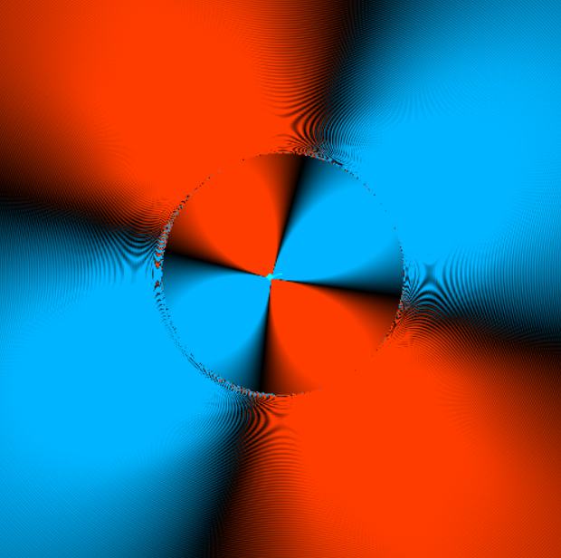 | 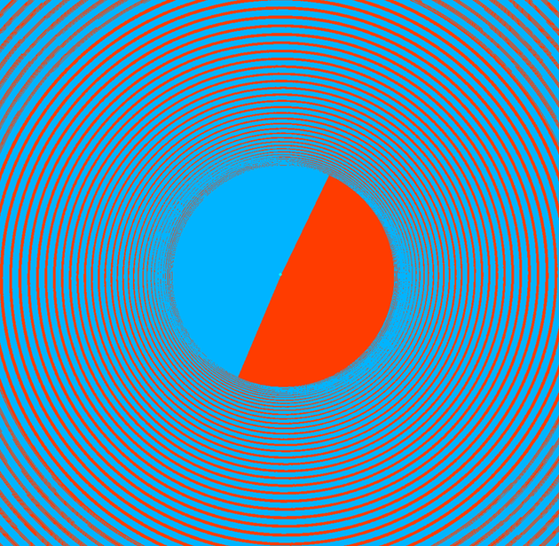 |
| La scomparsa del partner interrompe il calcolo del baricentro, congelando le spirali storiche in una croce rigida e non rotante. | Trattandosi di un campo scalare universale non vincolato alla coppia, le spirali continuano a propagarsi regolarmente all'indietro anche dopo la fusione. |

Da quanto sopra discende anche una conseguenza pratica sulla **visibilità** del pattern. Il proxy è quadratico nella velocità relativa, \(|h_{proj}| \propto |v_{rel}|^2\), e questa proporzionalità coincide qualitativamente con la dipendenza della potenza radiativa GW reale dalle alte potenze di \(v/c\). Significa che la croce diventa percettibile **solo per coppie compatte in orbita stretta** (NS, BH, ultimi cicli di inspiral, dove \(|v_{rel}|\) è una frazione apprezzabile di \(c\)); per i sistemi planetari ordinari, anche con il fader di sensibilità al massimo, l'ampiezza resta sotto il floor del rendering, esattamente come nella realtà fisica le coppie planetarie non sono rilevabili dagli interferometri terrestri.

#### 7.6.4 Caso di studio: Il quadrupolo dinamico nell'EMRI all'afelio
Un comportamento particolarmente affascinante ed emergente si osserva nello scenario **EMRI** (Extreme Mass Ratio Inspiral). Per facilitare la visualizzazione geometrica di questo tipo di orbita fortemente eccentrica, riproponiamo qui in piccolo la sua traiettoria caratteristica (già discussa in precedenza):

Quando l'oggetto compatto leggero percorre la sua orbita fortemente eccentrica attorno al buco nero supermassiccio, la sua velocità lineare varia sensibilmente lungo la traiettoria:
* **Al pericentro (massima velocità):** L'emissione di strain è intensa, e la rapida rotazione genera fronti d'onda d'interferenza complessi.
  
  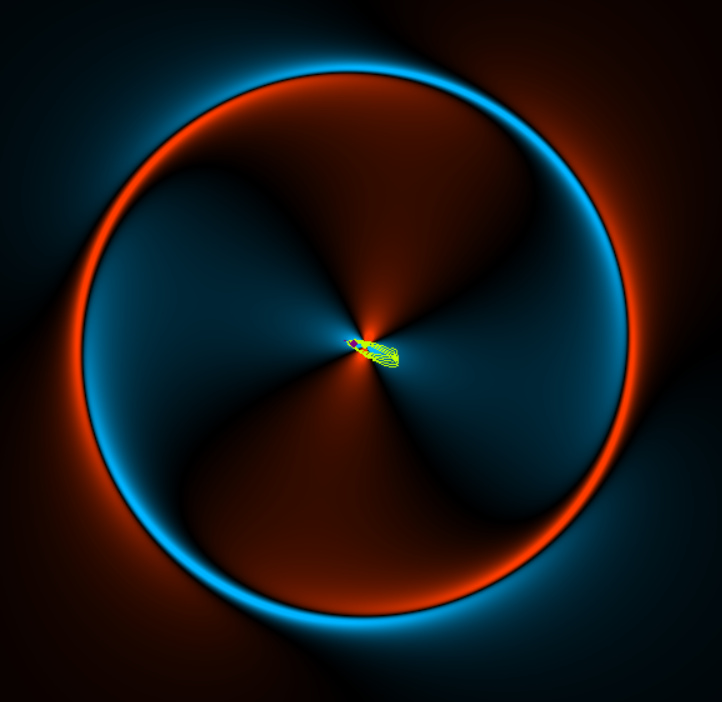
  
  *Emissione di strain al pericentro: la rapida accelerazione rilascia un impulso energetico che si espande simmetricamente nel mezzo, analogo all'onda concentrica prodotta da un sasso lanciato in uno stagno.*
  
* **All'afelio (minima velocità):** La dinamica orbitale rallenta drasticamente. Con la velocità angolare quasi ferma, lo strain si indebolisce ma rivela chiaramente la firma geometrica del **quadrupolo nudo e stazionario** associato al corpo leggero. L'osservatore può vedere questo schema a quattro lobi accendersi e cambiare direzione lentamente nello spazio, riorientando il proprio asse spettrale in tempo reale mentre l'oggetto esegue lentamente la sua svolta apocentrica prima di precipitare nuovamente verso il centro.
  
  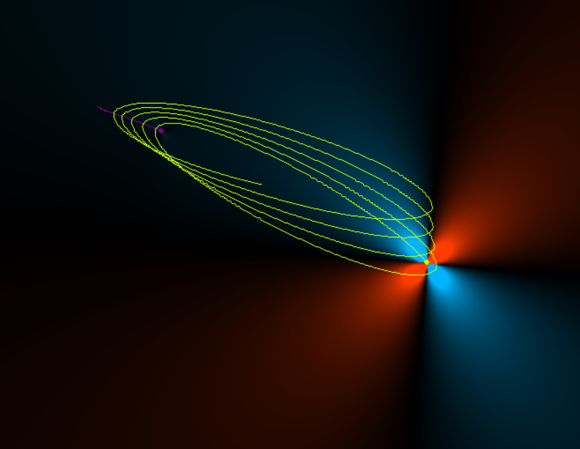
  
  *Il quadrupolo statico nudo all'afelio: una inquadratura molto ravvicinata (zoomata) e con guadagno (gain) aumentato rende visibile la caratteristica croce quadrilobata dello strain (ciano/rosso alternato) del corpo leggero, altrimenti invisibile per via del rallentamento cinetico.*
 
<video src="https://github.com/user-attachments/assets/8d30ed55-33fe-4897-b678-e1e165158f21" autoplay loop muted playsinline controls width="700"></video>

*Ciclo orbitale completo dell'EMRI (afelio -> pericentro -> afelio) renderizzato in modalità GW Strain. Il video mostra chiaramente la transizione dinamica tra l'emissione stazionaria e debole all'apocentro (in cui spicca il quadrupolo nudo del corpo leggero orientato lungo l'asse orbitale) e la violenta scarica ondulatoria concentrica rilasciata durante il passaggio ravvicinato al pericentro, che si propaga nello spazio.*

| Vista macro: Early Inspiral (decine di AU) | Vista macro: Late Inspiral (decine di AU) |
|:---:|:---:|
|   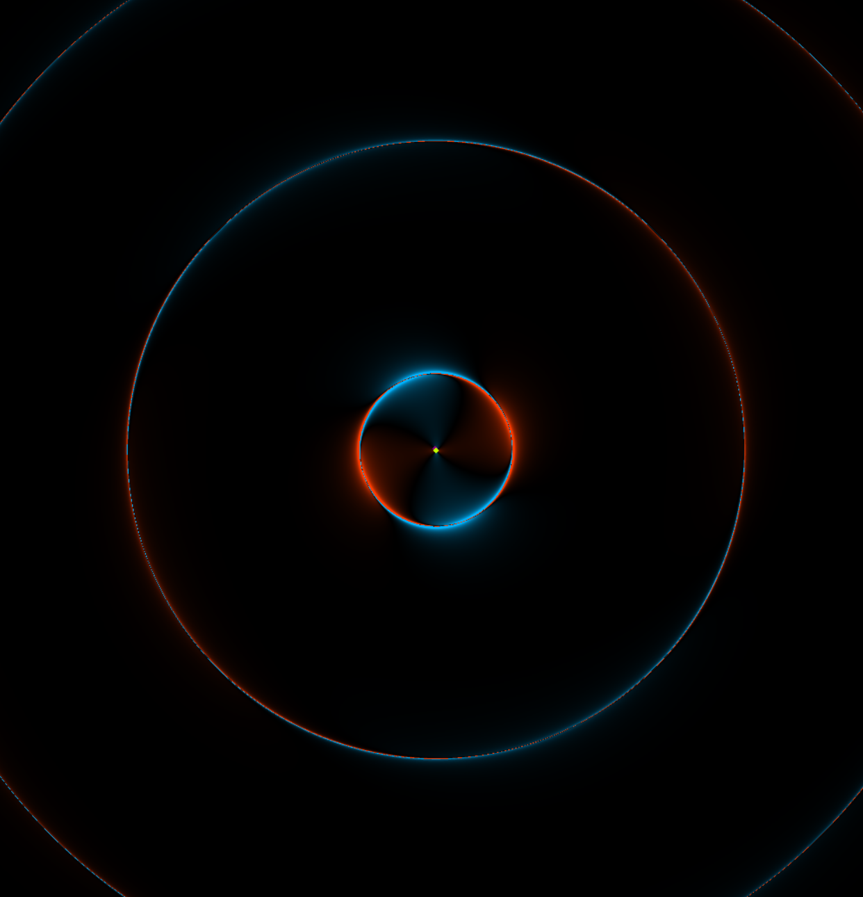 |   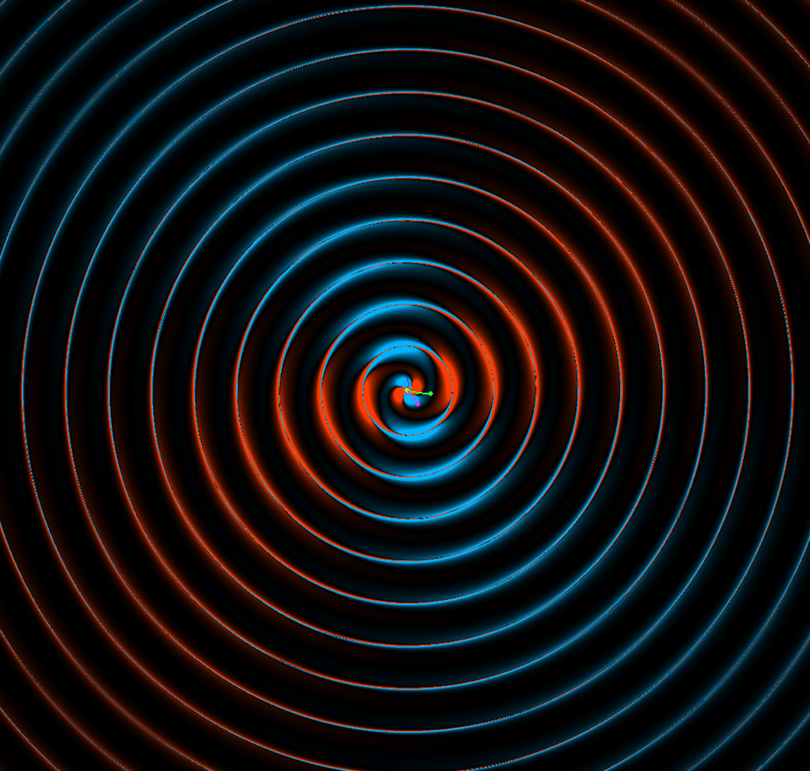 |
| **Il ritmo dei *sassi* sul cono di luce**: Nelle prime fasi dell'inspiral, l'emissione avviene per impulsi discreti. Ad ogni passaggio al pericentro, il corpo scaglia una perturbazione nello spaziotempo, un *sasso* i cui effetti viaggiano sul cono di luce a velocità \(c\) in un guscio isolato. Poiché il periodo orbitale è lungo, i fronti d'onda rimangono separati da ampie regioni di silenzio, propagandosi come anelli concentrici ben spaziati. | **La transizione a spirale continua**: Negli ultimi stadi prima della cattura (regime di chirp), la frequenza orbitale cresce vertiginosamente e l'emissione diventa un flusso continuo. I *sassi* gravitazionali vengono rilasciati senza sosta: i singoli fronti d'onda sferici perdono la propria individualità e si fondono, tessendo una spirale densa che riempie omogeneamente lo spaziotempo circostante. |

### 7.7 Riepilogo: come ogni heatmap converte la fisica in colore

Le sei heatmap del simulatore usano strategie di normalizzazione e mapping cromatico anche molto diverse, calibrate sulla **grandezza fisica** che ciascuna deve rendere visibile. La tabella seguente riassume in modo schematico i conti effettivi che ogni kernel esegue per arrivare al colore del pixel.

| Heatmap | Grandezza misurata | Normalizzazione | Scala | Mapping cromatico | Fader utente |
|---|---|---|---|---|---|
| **Φ** (§7.1) | \(\Phi = \sum_k GM_k/r_k\) (causale) | dinamica per-frame su \(\Phi_{\max}\) (massa più grande / raggio effettivo) | **log₁₀**, intervallo di 6 ordini di grandezza | rampa a 3 stop sequenziali: blu profondo → indaco → arancio → bianco | nessuno |
| **dΦ/dt** (§7.2) | \(\partial\Phi/\partial t = \sum_k GM_k v_{rad,k}/r_k^2\) (causale) | gain calibrato su scala interna, modulato dal fader | \(\tanh(\text{val})\) (compressione asintotica a \(\pm 1\), niente saturazione netta) | divergente: blu/ciano per avvicinamento (\(+\)), rosso per allontanamento (\(-\)) | sì (**GAIN**, \(\pm\), default \(0\) in scala log₁₀) |
| **Tidal Stress** (§7.3) | \(\sigma = \sqrt{(\Phi_{xx}-\Phi_{yy})^2 + 4\Phi_{xy}^2}\) (autovalori discordi) | nessuna (la scala è assoluta in \(\text{s}^{-2} \equiv (\text{m/s}^2)/\text{m}\)) | **log₁₀** + Offset utente | 6 fasce calibrate su soglie fisiche reali (resistenza dei materiali), interpolate linearmente all'interno di ciascuna; legenda apribile con `M` | via astro_settings.ini |
| **Topologia di Roche** (§7.4) | due quantità sovrapposte: segno di \(D = \Phi_{xx}\Phi_{yy} - \Phi_{xy}^2\) + modulo \(\|\nabla\Phi_{\text{eff}}\|\) | \(D\) adimensionalizzato su \(\omega^4\) (scala naturale del frame corotante); forza normalizzata su \(f_{\text{norm}} = \tfrac{27}{4}q(1-q)\omega^2 r\) (scala caratteristica L4/L5) | **log₁₀** clampato \([-3,+3]\) per la tinta; **log₁₀** lineare per la luminosità | tinta dal segno di \(D\): rampa cremisi → giallo neon (\(D<0\)) o indaco → ciano (\(D>0\)); luminosità = forza, nucleo nero nei punti di stallo | sì (**sensibilità** + **contrasto**) |
| **Lagrange Hunter** (§7.5) | \(r_{\text{est}} = \|H^{-1}\nabla\Phi_{\text{eff}}\|\) (stimatore di distanza Newton-Raphson) | conversione \(r_{\text{est}}/\text{scala camera}\) → distanza in pixel | lineare (nessuna log: la stima è già una distanza) | gaussiana \(\exp\!\big(-2(d/r_{\text{soglia}})^2\big)\) centrata sullo zero del gradiente; tinta dal segno di \(D\): rosso (\(D<0\), L1/L2/L3) o blu (\(D>0\), L4/L5) | sì (**sensibilità** → raggio \(r_{\text{soglia}}\) della gaussiana) |
| **GW Strain** (§7.6) | \(h_{\text{total}} = \sum_k \frac{M_k \cdot h_{\text{proj}, k}}{r_k}\) (causale) | gain calibrato internamente, modulato dal fader | \(\text{asinh}(h \cdot \text{sensitivity})\) (compressione a \(\pm 1\)) | divergente: ciano per strain positivo (\(+\)), rosso per strain negativo (\(-\)) | sì (sensibilità via fader Roche) |

> [!TIP]
> **Analogia acustica: Compressione dinamica (\(\text{asinh}\)) vs Hard Clipping (\(\tanh\)).**
> La scelta tra la compressione dello strain via \(\text{asinh}\) e quella del potenziale via \(\tanh\) equivale esattamente alla differenza tra due trattamenti del segnale acustico:
> - La **\(\tanh\)** si comporta come un **hard clipper** (distorsore): mappa i valori in un intervallo rigido tagliando asintoticamente le creste del segnale oltre una soglia bassa. Questo è ideale in \(d\Phi/dt\) per dare contorni netti, definiti e contrastati alle onde di fase, ma appiattisce la dinamica interna saturando rapidamente al massimo di intensità.
> - La **\(\text{asinh}\)** si comporta come un **compressore dinamico da mastering**: attenua logaritmicamente i picchi monumentali nel vicino campo (near-field) impedendo che si brucino in un blocco di colore solido, lasciando al contempo i segnali deboli in periferia (far-field) lineari, leggibili e liberi di sfumare con naturalezza nel nero del vuoto cosmico.

**Pattern comuni**
- **Tre heatmap sono causali a tempo ritardato** (Φ, dΦ/dt e GW Strain): leggono lo stato delle sorgenti dai ring buffer L0/L1/L2 al tempo ritardato $r/c$, e mostrano come l'informazione gravitazionale (rispettivamente: il pozzo monopolare, la sua variazione temporale, la proiezione del quadrupolo) si propaga nello spazio a velocità finita. Le altre tre (Tidal, Roche, Lagrange) sono **istantanee**: usano posizioni e velocità presenti, perché interpretano la geometria locale del campo, non la sua propagazione.
- **Il logaritmo compare ovunque tranne nel Lagrange Hunter**: è imposto dal range fisico in gioco, che attraversa decine di ordini di grandezza in tutte le mappe scalari (potenziale, derivata temporale, stress di marea, curvatura del potenziale efficace).
- **La normalizzazione è quasi sempre "fisica"**, non puramente numerica: si appoggia su $\Phi_{\max}$, $\omega^4$, $f_{\text{norm}}$ o soglie meccaniche reali. L'unica scala assoluta (senza alcuna normalizzazione) è quella della Tidal, perché le sue fasce coincidono con la resistenza dei materiali misurata in laboratorio (silicati, ghiaccio, metalli).

### 7.8 Il Pannello di Telemetria Orbitale (HUD)

Il simulatore non si limita a visualizzare qualitativamente la fisica tramite le heatmap, ma espone in tempo reale l'intero stato cinematico e dinamico di qualunque corpo selezionato. Questa interfaccia informativa è denominata **Pannello di Telemetria Orbitale** (indicato comunemente come *cruscotto di volo* o *HUD*).

#### Attivazione e funzionamento
L'HUD appare nella parte inferiore dello schermo e si attiva:
* Effettuando un **doppio clic** su uno qualsiasi dei corpi presenti nello scenario.
* Premendo il tasto **[TAB]** per scorrere ciclicamente tra tutti i corpi attivi.

Una volta selezionato un corpo (denominato *target*), il motore calcola dinamicamente le sue grandezze fisiche sia in senso assoluto (riferite all'origine inerziale del motore) sia in senso relativo (riferite all'attrattore gravitazionale dominante in quel momento). La determinazione del corpo di riferimento avviene tramite il calcolo locale della forza di marea ($M/r^3$), identificando quale massa eserciti l'influenza gravitazionale prevalente sull'oggetto (la stessa logica utilizzata per definire la sfera di Hill).

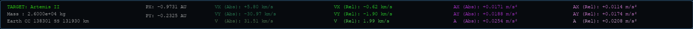

#### Parametri e grandezze visualizzate
Il pannello di telemetria è strutturato in colonne che organizzano i dati fisici calcolati dal risolutore:

1. **Dati Anagrafici e di Riferimento** (Prima colonna):
   * **TARGET**: Nome del corpo selezionato e colore identificativo dello scenario.
   * **Mass**: Massa dell'oggetto in chilogrammi (espressa in notazione scientifica).
   * **Dist**: Identificativo del corpo di riferimento dominante seguito dalla distanza istantanea espressa in formato scalato (chilometri o Unità Astronomiche) ed evidenziata in due modalità: **CC** (*Center-Center* / Centro-Centro, ossia la distanza geometrica tra i baricentri dei due corpi) e **SS** (*Surface-Surface* / Superficie-Superficie, ossia la distanza netta tra le rispettive superfici fisiche o orizzonti degli eventi, al netto dei loro raggi visivi). Viene inoltre indicata la conversione di tale distanza in pixel schermo.

2. **Posizione Assoluta** (Seconda colonna):
   * **PX, PY**: Coordinate cartesiane del target espresse in formato scalato (chilometri o Unità Astronomiche) rispetto all'origine (zero relativo) del sistema di coordinate dello scenario.

3. **Velocità Lineare** (Terza e Quarta colonna):
   * **VX, VY, V (Abs)** (Velocità Assoluta): Vettori e modulo della velocità dell'oggetto riferiti al sistema eliocentrico/inerziale di simulazione. Mostrano la velocità complessiva del corpo all'interno del sistema (es. i ~30 km/s dell'orbita terrestre attorno al Sole).
   * **VX, VY, V (Rel)** (Velocità Relativa): Vettori e modulo della velocità calcolati rispetto all'attrattore principale (ad es. la velocità di allontanamento/avvicinamento di Orion rispetto alla Terra, pari a ~2,04 km/s).

4. **Accelerazione Gravitazionale** (Quinta e Sesta colonna):
   * **AX, AY, A (Abs)** (Accelerazione Assoluta): Vettori e modulo dell'accelerazione totale istantanea subita dal corpo, derivante dalla somma di tutte le attrazioni gravitazionali $O(N^2)$ (incluso l'influsso del Sole).
   * **AX, AY, A (Rel)** (Accelerazione Relativa): Vettori e modulo dell'accelerazione calcolati al netto dell'accelerazione dell'attrattore dominante, evidenziando le forze differenziali e di marea.

---

## 8. L'analizzatore LIGO/Virgo: dal proxy cinematico allo spettro

Questa sezione descrive cosa è LIGO e Virgo e come sono stati concettualmente virtualizzati nella sonda della simulazione. In seguito la pipeline di analisi (`ligo_analyzer.py`), costruita su funzioni standard di `scipy.signal`.

### 8.1 L'analogia con LIGO e Virgo sulla Terra

I rivelatori reali sulla Terra (come LIGO negli Stati Uniti o Virgo in Italia) sono giganteschi interferometri laser a forma di "L" con due bracci perpendicolari lunghi 3 o 4 km. Quando un'onda gravitazionale attraversa il rivelatore, essa comprime lo spazio lungo un braccio e lo stira lungo l'altro.

LIGO e Virgo misurano questa piccolissima variazione relativa della lunghezza dei bracci, chiamata **strain ($h$)**:

$$h = \frac{\Delta L}{L}$$

La **sonda LIGO virtuale** nel simulatore fa l'esatta analogia software di questo processo:
* Viene posizionata in un punto dello schermo (lo spazio 2D).
* Registra a ogni istante temporale un valore di strain $s(t)$ che rappresenta l'intensità locale di questa deformazione (lo stiramento e la compressione dello spazio) causata dal movimento delle masse del sistema binario.

### 8.2 Cos'è il momento di quadrupolo di massa? (Le due facce del quadrupolo)

Per capire cos'è il quadrupolo, è utile guardare le sue due facce: come viene generato dalla sorgente (la fisica) e come deforma lo spazio quando si propaga (la geometria).

**La faccia della Sorgente (Perché le masse devono orbitare):** In elettromagnetismo, la radiazione (le onde luminose) è prodotta principalmente da un dipolo oscillante (una carica positiva e una negativa che si muovono avanti e indietro). In gravità, questo non è possibile: esiste un solo tipo di "carica" (la massa, che è sempre positiva) e il centro di massa di un sistema isolato si deve muovere di moto rettilineo uniforme (conservazione della quantità di moto). Non possiamo far oscillare una "massa negativa" contro una "massa positiva" per generare un dipolo gravitazionale. Per questo motivo, l'emissione gravitazionale più bassa possibile è di quadrupolo, e richiede masse in orbita.

**La faccia dell'Onda (Come si deforma lo spaziotempo):** Dal punto di vista geometrico, si può immaginare il quadrupolo come un dipolo a più dimensioni. Mentre un dipolo oscilla lungo una sola linea (1D), il quadrupolo deforma lo spazio in modo bidimensionale: stira lo spaziotempo lungo una direzione e contemporaneamente lo comprime lungo la direzione perpendicolare, per poi invertire il ciclo. È una deformazione a croce che racchiude la natura tensoriale della gravità in uno spazio 3+1D. Questo è concettualmente lo Spin-2 caratteristico citato nella sezione §1.2.

Il momento di quadrupolo di massa (nella sua forma discreta, $I_{ij} = \sum m_a x_{a,i} x_{a,j}$) misura proprio la distribuzione geometrica della materia. Se il sistema possiede una perfetta simmetria sferica o assiale rispetto all'asse di rotazione (come una stella singola e liscia che ruota su se stessa), il suo momento di quadrupolo resta costante e non c'è radiazione. 
Affinché ci sia emissione, serve una **deviazione dalla simmetria sferica** (un "rigonfiamento" o un sistema multicorpo). Anche un sistema binario composto da due masse gemelle identiche in un'orbita circolare perfetta genera onde: orbitando, la distribuzione della materia si sposta ciclicamente dall'asse X all'asse Y e viceversa. Questa continua ridistribuzione geometrica fa variare $I_{ij}$ nel tempo, increspando lo spaziotempo circostante e propagando l'onda.

### 8.3 La formula 3D "camuffata" e la proiezione ortogonale al piano

Una premessa importante: in Relatività Generale **in 2+1 dimensioni non esistono onde gravitazionali propaganti** (la gravità non ha gradi di libertà locali nel piano), quindi *non esiste una "formula del quadrupolo in 2D"* da applicare. Si tratta di un fatto noto in fisica teorica, enunciato da Steve Carlip come: *"there are no propagating gravitational degrees of freedom"* (non esistono gradi di libertà gravitazionali propaganti) nel suo lavoro [*Lower dimensional gravity*](https://phys.libretexts.org/Bookshelves/Astronomy__Cosmology/Supplemental_Modules_%28Astronomy_and_Cosmology%29/Cosmology/Carlip/Lower_dimensional_gravity).

Quella che viene usata è la **formula del quadrupolo 3D standard di Einstein (1918)**, camuffata in 2D. Questa tecnica nota assume che il sistema orbiti sul piano equatoriale ($z = 0$), il che azzera tutti i termini legati all'altezza ($I_{xz} = I_{yz} = 0$), e ipotizzo una sonda LIGO posta direttamente sull'asse orbitale polare (lungo l'asse $z$, orientamento *perpendicolare al piano* o *assiale*). In questa configurazione geometrica, la formula 3D si proietta esattamente nel nostro piano come:

$$h_+ \propto \ddot{I}_{xx} - \ddot{I}_{yy}$$

con $I_{ij} = \sum_j m_j\, x_i x_j$. Sviluppando analiticamente la derivata seconda temporale tramite la regola del prodotto, otteniamo la formula del quadrupolo reale completa:

$$\ddot{I}_{xx} - \ddot{I}_{yy} = 2\sum_j m_j\Big[\,\underbrace{(v_{x,j}^2 - v_{y,j}^2)}_{\text{parte di velocità}} + \underbrace{(x_j\,a_{x,j} - y_j\,a_{y,j})}_{\text{parte di accelerazione}}\,\Big]$$

La formula reale contiene quindi due contributi fisici: uno legato alle velocità dei corpi e uno legato alle loro accelerazioni.

Nel simulatore, tuttavia, per calcolare lo strain registrato dalla sonda utilizzeremo **esclusivamente la parte legata alle velocità**, escludendo del tutto il contributo delle accelerazioni. Questa scelta consente di ottenere un segnale estremamente pulito e privo di rumore di calcolo: i motivi tecnici dietro l'esclusione delle accelerazioni saranno approfonditi nel **§8.5**. Vale la pena anticipare che questa stessa formula, applicata pixel-per-pixel e proiettata lungo la direzione di osservazione, è il cuore della heatmap **GW Strain** di [§7.6](#76-deformazione-proiettata-gw-strain-quadrupolare): la sonda LIGO ne è la versione *puntuale* (un singolo numero $s(t)$ per il punto in cui è piazzata), la heatmap ne è la versione *spaziale* (proiezione tensoriale del quadrupolo nel piano dell'osservatore).

### 8.4 Cosa registra la sonda virtuale (Il proxy basato sulle velocità)

La sonda virtuale registra a ogni tick, in un singolo numero scalare per il punto in cui è piazzata, un **proxy basato sulle velocità per lo strain** derivato dalla formula del quadrupolo (§8.3); la stessa formula, applicata punto per punto su tutto il piano e proiettata lungo la direzione $\hat n$ pixel-osservatore, genera la heatmap **GW Strain** di [§7.6](#76-deformazione-proiettata-gw-strain-quadrupolare), che è il suo equivalente spaziale a piena risoluzione tensoriale proiettata. Per la sonda, l'espressione vale:

$$s(t) = \sum_j \frac{m_j\,(v_{x,j}^2 - v_{y,j}^2)}{r_j}$$

con le velocità riferite al centro di massa. Il motivo per cui questo proxy cattura la frequenza giusta è sufficiente: per un'orbita circolare $v_x = -v\sin(\omega t)$, $v_y = v\cos(\omega t)$, quindi

$$v_x^2 - v_y^2 = -v^2\cos(2\omega t)$$

oscilla a $2\omega$, cioè **esattamente la frequenza dell'onda gravitazionale** (il doppio di quella orbitale). La sonda inoltre legge sempre il buffer L0 ad alta risoluzione, mai i livelli compressi, per non introdurre aliasing nella forma d'onda.

> [!NOTE]
> **Compromesso geometrico "ludico":** Sebbene la formula di Einstein con proiezione ortogonale ipotizzi un osservatore posto "sopra" il sistema (sull'asse $z$), per ovvie ragioni ludiche e di interazione l'utente posiziona la sonda LIGO direttamente sullo schermo (il piano 2D). Il simulatore unisce queste due cose calcolando il decadimento dell'ampiezza dell'onda ($1/r$) usando la semplice distanza bidimensionale sullo schermo: $r = \sqrt{dx^2 + dy^2}$.

### 8.5 Il problema numerico dell'accelerazione e la regolarizzazione cinetica

Perché il simulatore tiene solo la parte di velocità escludendo quella di accelerazione?
Molto banalmente: **la formula completa numericamente non funziona.**

Sebbene il termine contenente le accelerazioni tracci correttamente la frequenza fisica dell'onda, esso introduce una grave instabilità numerica nello strain proprio vicino al momento della collisione (*merger*). In questo regime di gravità estrema ($r \to 0$), anche utilizzando le accelerazioni reali calcolate direttamente dall'engine fisico (anziché stimate per differenze finite), l'esplosione delle forze gravitazionali divergenti come $1/r^2$ a passi temporali discreti ($dt$) produce inevitabili sbalzi e fluttuazioni ad altissima frequenza nell'accelerazione istantanea. Il risultato è uno strain completo che diverge e oscilla violentemente (come mostrato nei grafici dell'analizzatore), compromettendo la pulizia del segnale.

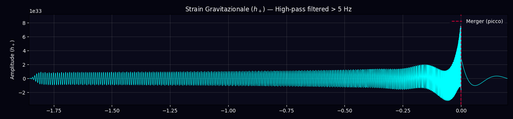

Provando invece a eliminare la derivata delle accelerazioni e mantenendo solo il pezzo di velocità ($v_x^2 - v_y^2$), si ottiene uno strain ideale: liscio, pulito e straordinariamente stabile.

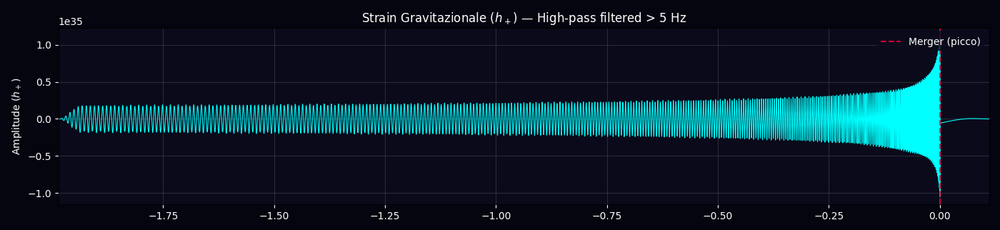

Questa semplificazione è a tutti gli effetti un'**approssimazione pratica**. Dal punto di vista fisico, si basa su un'identità che vale rigorosamente solo per le orbite perfettamente circolari: in quel caso limite, l'accelerazione centripeta punta sempre verso il centro dell'orbita ($a \propto -r$), rendendo il termine di accelerazione e quello di velocità identici in ogni istante:

$$x \cdot a_x - y \cdot a_y = v_x^2 - v_y^2$$

Questo dimezzamento è chiaramente visibile confrontando le due immagini soprastanti: l'oscillazione dello strain "pulito" (proxy di velocità) ha un'ampiezza massima dimezzata rispetto allo strain teorico completo, ma i picchi, i ventri e i passaggi per lo zero avvengono nello stesso identico istante, preservando intatta la coerenza di fase. Inoltre, sul piano computazionale la velocità è molto più stabile: essendo l'accumulo (integrale) delle accelerazioni passo dopo passo, agisce come una sorta di media mobile che "smussa" i dossi e i saltelli numerici derivanti dalla griglia discreta del simulatore.

Naturalmente si tratta di un'approssimazione: per orbite molto eccentriche o sistemi caotici i due termini non sarebbero affatto equivalenti, ma per catturare la modulazione di frequenza tipica dei merger (dove le orbite tendono a circolarizzarsi rapidamente prima dello scontro) si rivela un compromesso ingegneristico efficace e pulito.

> [!NOTE]
> **Limiti del formalismo e nota dell'autore:** Essendo un programmatore e non un astrofisico teorico, il grado di complessità matematica del formalismo del quadrupolo in Relatività Generale va oltre le mie competenze per poter indagare a fondo le cause analitiche di questa discrepanza. Mi limito quindi a documentare e mostrare le mie soluzioni e osservazioni pratiche.

### 8.6 Il troncamento netto dello strain (L'assenza del Ringdown)

Si nota facilmente che nei grafici temporali dello strain simulato (e nei relativi spettrogrammi), il segnale **si interrompe in modo netto e improvviso** al momento della collisione, contrariamente alle forme d'onda reali che mostrano una coda di smorzamento. Questo comportamento è una limitazione fisica intrinseca del nostro modello N-body.

Nelle onde gravitazionali reali emesse da una coalescenza (CBC), il segnale attraversa tre fasi distinte:
1. **Inspiral**: Le due masse spiraleggiano verso l'interno avvicinandosi. Frequenza e ampiezza dell'onda crescono rapidamente (la fase di *chirp*).
2. **Merger**: I due corpi si fondono fisicamente in un unico oggetto finale deformato.
3. **Ringdown**: Il corpo neonato (ad esempio un buco nero perturbato) oscilla nei suoi modi quasi-normali ("vibra"), irradiando la sua asimmetria geometrica sotto forma di onde gravitazionali smorzate esponenzialmente, fino a stabilizzarsi in una configurazione finale sferica o di Kerr (silenzio gravitazionale).

Perché nel simulatore lo strain si interrompe di colpo?
* Il motore computazionale calcola lo strain basandosi sulle posizioni e velocità relative dei corpi, considerandoli come **punti materiali** o sfere rigide.
* Al momento del contatto geometrico (il merger), il sistema binario cessa istantaneamente di esistere: i due corpi vengono fusi dall'algoritmo di collisione in un unico oggetto statico, (nel pratico una delle sorgenti viene rimossa e l'altra aggiornata e riposizionata).
* Non essendoci una simulazione dinamica del campo spaziotemporale (che richiederebbe di risolvere le equazioni di Einstein della Relatività Generale Numerica completa per calcolare le oscillazioni di un orizzonte degli eventi perturbato), l'emissione crolla istantaneamente a zero.
* Di conseguenza lo strain viene **tagliato di netto** (cut-off) al momento del contatto, saltando completamente la fase di **ringdown** che rappresenta una firma post-merger relativistica.

  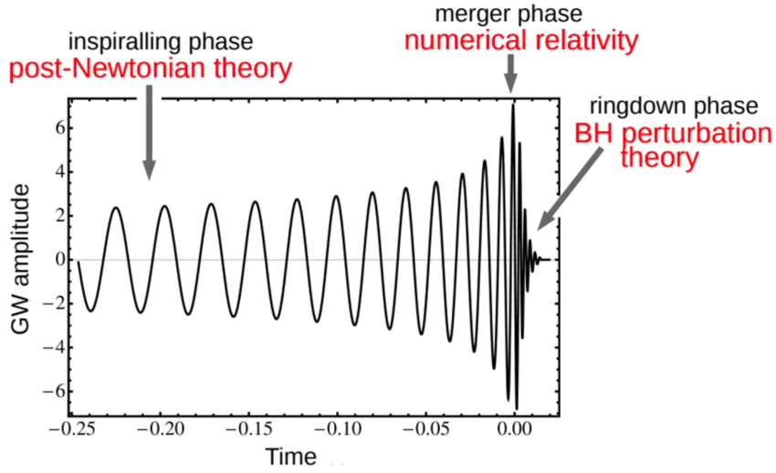

### 8.7 Cos'è uno spettrogramma e come si ottiene

Prima di scendere nei dettagli del codice, capiamo lo strumento visivo principale dell'analizzatore: lo **spettrogramma**.

#### Cos'è e la metafora musicale
Un segnale d'onda registrato nel tempo (lo *strain*) è come una traccia audio: una sequenza di oscillazioni. 
* Se guardiamo solo il grafico nel tempo, vediamo l'onda oscillare, ma è difficile dire quale frequenza precisa ci sia in ogni istante.
* Se facciamo una classica **Trasformata di Fourier** sull'intero segnale, scopriamo *quali* frequenze sono presenti in totale, ma perdiamo ogni informazione sul *quando* (non sappiamo in quale istante sia stata suonata una certa nota).

Lo **spettrogramma** risolve questo problema unendo tempo e frequenza. È l'equivalente di un **pentagramma musicale**:
* L'asse orizzontale ($x$) è il **tempo**.
* L'asse verticale ($y$) è la **frequenza** (l'altezza della nota, da grave ad acuta).
* Il **colore** (la terza dimensione, espressa in decibel dB) indica l'**intensità** o potenza di quella specifica frequenza in quel momento (quanto forte viene suonata la nota).

* **Lo Strain come file WAV**: Lo strain $s(t)$ registrato dalla sonda virtuale non è altro che un segnale audio digitale a canale singolo (monofonico). Proprio come un file audio `.wav` registra la fluttuazione della pressione dell'aria nel tempo ad una certa frequenza di campionamento (ad esempio 44.1 kHz), lo strain registra la fluttuazione metrica dello spaziotempo campionata nel simulatore ad alta frequenza ($1\text{ MHz}$).
* **Lo Spettrogramma come equalizzatore visivo**: Lo spettrogramma fa esattamente quello che fa un analizzatore di spettro in uno studio di registrazione (o il display grafico di un equalizzatore): mostra quali frequenze (alti, medi o bassi) sono presenti nel segnale e a quale volume (dB) in ogni istante.
* **Il Chirp come un Glissando**: Dal punto di vista acustico, la coalescenza gravitazionale è a tutti gli effetti un **glissando** ascendente (simile al fischio di una sirena o a un fischietto che sale rapidamente di tono fino a interrompersi bruscamente al momento del merger).
  > [!NOTE]
  > **Curiosità & Rigore Fisico**: Perché parliamo di "suono" e di "ascoltare" il cosmo? Questa non è solo una metafora divulgativa, ma una precisa analogia fisica e di elaborazione dei segnali. Si veda la sezione di approfondimento a fine capitolo: **Approfondimento: Il "suono" delle onde gravitazionali**.

#### Perché LIGO e la sonda lo usano
I segnali dei merger sono **chirp**: segnali transitori in cui sia l'ampiezza sia la frequenza aumentano rapidamente mentre i due corpi compatti spiraleggiano verso la collisione. 

Nello strain temporale grezzo, questo segnale è spesso completamente sommerso dal rumore (sia dal rumore sismico/termico nei rivelatori terrestri reali, sia dal rumore di griglia discreta nella sonda virtuale). Lo spettrogramma è fondamentale perché consente di **identificare visivamente il segnale in modo qualitativo**: mentre il rumore di fondo si distribuisce disordinatamente su tutta la mappa tempo-frequenza come un disturbo casuale, l'energia coerente del chirp si concentra lungo una traiettoria ben definita. Il segnale emerge così sotto forma di una caratteristica **curva luminosa che sale verso l'alto** (la "firma" o *track* spettrale del merger), rendendolo immediatamente riconoscibile all'occhio umano o ad algoritmi di pattern recognition anche in condizioni di forte rumore.

Ecco un confronto diretto tra il chirp simulato e quello reale:

* **Il chirp simulato (pulito)**: Questa immagine mostra lo spettrogramma dello strain registrato dalla sonda virtuale in uno scenario di binaria di stelle di neutroni (GW170817), focalizzato sugli ultimi **0.5 secondi** prima del merger. Trattandosi di dati di simulazione puri, la traccia spettrale del chirp risulta perfettamente nitida e priva di rumore di fondo.

  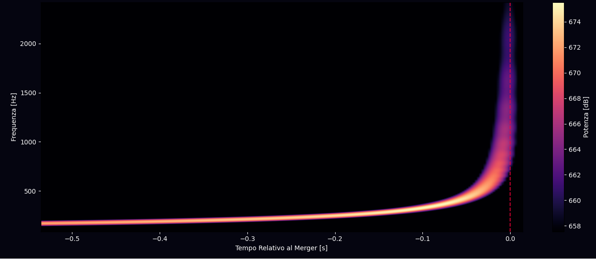

* **Il chirp reale di LIGO Hanford (rumoroso)**: Questa immagine mostra lo spettrogramma reale ottenuto dai dati pubblici del rivelatore LIGO Hanford (H1) per lo stesso evento (GW170817), focalizzato sugli ultimi **1.75 secondi** prima del merger. Qui si nota come il chirp reale (la rampa di frequenza ascendente) sia immerso nel rumore strumentale di fondo, ma rimanga chiaramente identificabile grazie al contrasto visivo dello spettrogramma.

  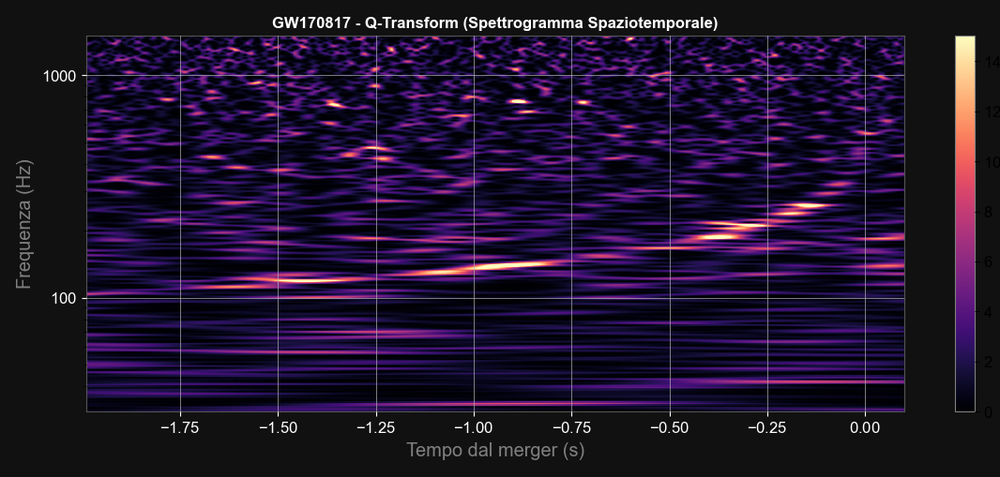

#### Come si ottiene: la STFT (Short-Time Fourier Transform)
Matematicamente, lo spettrogramma si ottiene tramite la **STFT (Trasformata di Fourier a tempo parziale)**. Il processo si articola in tre fasi principali:
1. **Finestratura temporale (Windowing)**: Il segnale completo viene suddiviso in segmenti temporali di breve durata (ad esempio, intervalli di pochi millisecondi), parzialmente sovrapposti tra loro (overlap) per non perdere informazioni ai confini. Ciascun segmento viene moltiplicato per una funzione smussante (come la *finestra di Hann*), che azzera dolcemente il segnale all'inizio e alla fine dell'intervallo, evitando che i tagli netti introducano frequenze spurie inesistenti (fenomeno del *spectral leakage*).
2. **Analisi spettrale locale (FFT)**: Su ciascun segmento finestrato viene applicata la *Fast Fourier Transform* (FFT). Questo algoritmo converte la porzione di segnale dal dominio del tempo a quello della frequenza, calcolando l'ampiezza di ogni singola componente spettrale presente esclusivamente in quella specifica finestra temporale.
3. **Mappatura tempo-frequenza**: Gli spettri calcolati per ogni singolo segmento vengono disposti in colonna, uno dopo l'altro, seguendo l'ordine cronologico. Questa matrice di dati bidimensionale viene poi visualizzata colorando l'intensità di ciascun punto (in decibel), generando la mappa finale dello spettrogramma.

> [!TIP]
> ### Approfondimento: Il "suono" delle onde gravitazionali
> L'idea di "ascoltare" l'Universo tramite le onde gravitazionali non è un'invenzione dei giornalisti, ma ha solide basi fisiche ed elettroacustiche:
> 
> * **Corrispondenza fisica**: Lo strain $h(t)$ misura una fluttuazione metrica dello spaziotempo (una compressione e dilatazione fisica dello spazio), concettualmente del tutto analoga a come un'onda acustica di pressione comprime e dilata l'aria.
> * **Banda di frequenza udibile**: La frequenza delle onde gravitazionali emesse nei merger di sistemi binari compatti (buchi neri stellari o stelle di neutroni) si colloca precisamente nella **banda udibile dall'orecchio umano** (da circa $20\text{ Hz}$ a oltre $1\text{-}2\text{ kHz}$). Ad esempio, la storica prima rivelazione **GW150914** ha spazzato la banda $35\text{-}250\text{ Hz}$ (si veda l'articolo della scoperta: B. P. Abbott et al., LIGO Scientific Collaboration and Virgo Collaboration, [Phys. Rev. Lett. 116, 061102 (2016)](https://journals.aps.org/prl/abstract/10.1103/PhysRevLett.116.061102) / preprint gratuito [arXiv:1602.03837](https://arxiv.org/abs/1602.03837)), mentre il merger di stelle di neutroni **GW170817** è arrivato a circa $2\text{ kHz}$.
> * **Sonificazione diretta**: Poiché il segnale dello strain registrato è una serie temporale ad alta frequenza, inviando la traccia dati opportunamente filtrata e amplificata a un altoparlante (mappando lo strain alla tensione elettrica di pilotaggio), la bobina del diffusore vibra riproducendo fisicamente il suono nel mezzo aereo.
> La sonificazione delle onde gravitazionali è un filone di ricerca attivo a livello internazionale; tra i centri più rilevanti vi è l'[European Gravitational Observatory (EGO)](https://www.ego-gw.it/) a Cascina (Pisa), sede del rivelatore Virgo, attivo nello sviluppo di progetti e installazioni di sonificazione dei dati interferometrici. Per una libreria interattiva di sonificazioni reali, si rimanda al portale [Sounds of Spacetime](https://www.soundsofspacetime.org/). Quando i media titolano *"Ecco il suono di due buchi neri che collidono"*, descrivono dunque una traduzione elettroacustica diretta e fisicamente fondata, non una metafora arbitraria.

---

### 8.8 La pipeline di analisi dell'analizzatore (`ligo_analyzer.py`)

Il segnale grezzo è sporco e va ripulito (è dominato da una lenta deriva di fondo a bassa frequenza). la matematica complessa dietro le tecniche di filtraggio sono è stata delegata ai **filtraggi standard offerti da `scipy.signal`**, nell'ordine suggerito dalla pratica comune. La pipeline lo ripulisce e lo interpreta in passi successivi:

1. **Detrend + finestra di Tukey** (`scipy.signal.windows.tukey`). Si rimuove l'offset medio e si "smussano" i bordi del buffer, per evitare che le discontinuità ai margini creino artefatti spettrali.
2. **Gatekeeper automatico.** Un classificatore decide se il segnale è un chirp coerente (ramo **SPECTRAL**) o un impulso/rumore (ramo **RADIOMETRIC**). In modalità radiometric salta filtraggio e spettrogramma e mostra lo **strain grezzo sull'intero tempo registrato** (asse temporale assoluto, non zoomato sul merger), affiancato dalla curva di **energia irradiata cumulativa**.
3. **Filtro passa-alto Butterworth (5 Hz)** (`scipy.signal.butter` + `sosfiltfilt`, a fase zero). Taglia la deriva di fondo sub-Hz, isolando l'oscillazione orbitale.
4. **Spettrogramma STFT** (Short-Time Fourier Transform; `scipy.signal.spectrogram`, finestra di Hann, sovrapposizione 95%, zero-padding). Produce la mappa tempo-frequenza ad alta risoluzione: è lì che il chirp appare come una curva che sale.
5. **Frequenza istantanea via trasformata di Hilbert** (`scipy.signal.hilbert`). Costruisce il segnale analitico, da cui si estrae la fase e quindi la **frequenza istantanea** $f(t)$, poi lisciata con un filtro di Savitzky-Golay (`scipy.signal.savgol_filter`).
6. **Stima della massa chirp.** Dalla traccia di frequenza si stima $\mathcal{M}$ adattando direttamente la **legge di potenza di Peters** $f(\tau)\propto\tau^{-3/8}$ nella finestra pulita prima del merger (mediana delle stime punto per punto), e non più con una regressione lineare di $\dot{f}$ contro $f$: quest'ultima amplificava la curvatura del chirp in un errore sistematico, mentre il fit della legge di potenza recupera la massa chirp attesa quasi esattamente.

> Questa è la parte in cui mi sono affidato di più a librerie esterne e a consigli (presi prevalentemente da LLM e da materiale online sull'uso *pratico* di scipy): ho sempre avuto chiaro *cosa* cercavo (un chirp pulito e la sua massa chirp), ma la pulizia DSP (Digital Signal Processing) fine è fuori dal mio pieno controllo.

*(Tutte le funzioni citate sono nella documentazione ufficiale di [`scipy.signal`](https://docs.scipy.org/doc/scipy/reference/signal.html) e [`scipy.optimize`](https://docs.scipy.org/doc/scipy/reference/optimize.html).)*

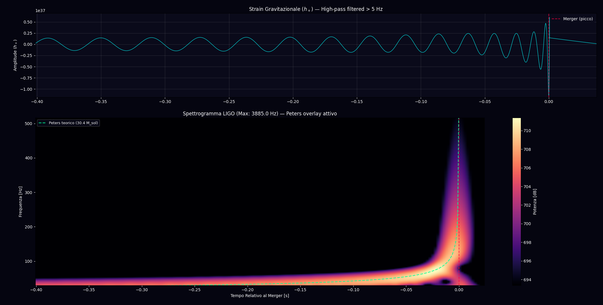

**Showcase — Spettrogramma di GW150914.** STFT (Short-Time Fourier Transform) dello strain del rivelatore con la curva di chirp simulata sovrapposta alla teorica di Peters: la traccia simulata segue il *ridge* spettrale dell'evento reale lungo l'intera salita di frequenza, dai $\sim 30$ Hz iniziali fino al picco di $\sim 250$ Hz al merger.

---

## 9. Inizializzazione degli scenari: calcolo analitico delle orbite

Per garantire che le orbite partano esattamente con la geometria desiderata (circolare, ellittica, parabolica) o nei punti di equilibrio gravitazionale corretti, tutte le condizioni iniziali sono calcolate rigorosamente tramite soluzioni analitiche, implementate direttamente nel modulo `utils/orbital_math.py`.

### 9.1 Velocità orbitale e di fuga nel potenziale di Paczyński-Wiita
Nel potenziale PW (§6.1), le velocità caratteristiche di un corpo di prova a distanza $r$ da una massa sorgente $M$ (con raggio di Schwarzschild $R_s = 2GM/c^2$) differiscono da quelle kepleriane classiche:

* **Velocità circolare relativistica**: Si ricava imponendo l'uguaglianza tra l'accelerazione centripeta $v^2/r$ e la forza gravitazionale per unità di massa del potenziale PW:
  $$\frac{v^2}{r} = \frac{GM}{(r - R_s)^2} \implies v_{circ} = \frac{\sqrt{G M r}}{r - R_s}$$
* **Velocità di fuga**: Si ricava imponendo che l'energia orbitale specifica sia nulla ($E = 0$), ovvero che l'energia cinetica eguagli l'energia potenziale PW:
  $$\frac{1}{2}v_{escape}^2 = \frac{GM}{r - R_s} \implies v_{escape} = \sqrt{\frac{2GM}{r - R_s}}$$

### 9.2 Lancio all'apocentro o al pericentro
Per impostare un'orbita ellittica specifica caratterizzata da un pericentro $r_{peri}$ e un apocentro $r_{apo}$, la velocità iniziale al lancio viene ricavata risolvendo analiticamente il sistema formato dalla **conservazione dell'energia totale** e del **momento angolare** nel potenziale PW:
* **Lancio all'apocentro** (per far "cadere" il corpo fino al pericentro voluto):
  $$v_{apo} = \sqrt{\frac{2 G M (r_{apo} - r_{peri})}{(r_{apo} - R_s)(r_{peri} - R_s) \left[ \left(\frac{r_{apo}}{r_{peri}}\right)^2 - 1 \right]}}$$
* **Lancio al pericentro** (per far salire il corpo fino all'apocentro voluto):
  $$v_{peri} = \sqrt{\frac{2 G M (r_{apo} - r_{peri})}{(r_{apo} - R_s)(r_{peri} - R_s) \left[ 1 - \left(\frac{r_{peri}}{r_{apo}}\right)^2 \right]}}$$

### 9.3 Velocità di lancio per binarie compatte (coppie strette)
Mentre la sezione **9.1** descrive il moto circolare di una **massa di prova trascurabile** attorno a un singolo centro attrattore massivo $M$, questa sezione risolve il **problema a due corpi reali** con masse confrontabili ($m_1 \approx m_2$), come una coppia di buchi neri o stelle di neutroni.

In questo scenario, ciascun corpo risente del potenziale di Paczyński-Wiita generato dall'altro, calcolato a partire dai singoli raggi di Schwarzschild $R_{s1} = 2Gm_1/c^2$ e $R_{s2} = 2Gm_2/c^2$. Inoltre, la formula tiene conto del fattore di softening $S_{soft}$ utilizzato dal kernel fisico per prevenire divergenze numeriche a distanza zero:

* Definito il raggio effettivo ammorbidito $d = \sqrt{r^2 + S_{soft}^2}$ (con $S_{soft}^2 = 100$), la frequenza angolare orbitale $\omega$ del sistema binario è calcolata sommando i contributi dei potenziali individuali:
  $$\omega^2 = \frac{G m_2}{d (d - R_{s2})^2} + \frac{G m_1}{d (d - R_{s1})^2}$$
* La velocità orbitale relativa di lancio è quindi calcolata come $v = r \cdot \omega$.

### 9.4 Punti di Lagrange analitici (Problema dei tre corpi circolare ristretto)
Le posizioni teoriche dei 5 punti di Lagrange per una coppia binaria di masse $m_1$ e $m_2$ ($m_1 > m_2$) sono calcolate tramite espansioni in forma chiusa e coordinate geometriche anziché con una ricerca degli zeri numerica:

* **Punti collineari ($L_1, L_2, L_3$)**: Definiti la distanza tra i corpi $r$, la frazione di massa $\mu = m_2 / (m_1 + m_2)$ e il parametro adimensionale della sfera di Hill $\alpha = (\mu/3)^{1/3}$, le posizioni rispetto al baricentro lungo l'asse del sistema sono:
  * **$L_1$** (punto di sella interno, tra i due corpi): $x_{L1} = x_{2} - r \cdot \alpha (1 - \alpha/3)$
  * **$L_2$** (esterno, oltre la massa minore $m_2$): $x_{L2} = x_{2} + r \cdot \alpha (1 + \alpha/3)$
  * **$L_3$** (opposto, oltre la massa maggiore $m_1$): $x_{L3} = -r (1 + \frac{5}{12}\mu)$
* **Punti triangolari ($L_4, L_5$)**: Sono posizionati esattamente sui vertici dei due triangoli equilateri con base il segmento $m_1 - m_2$ (ovvero a $\pm 60^\circ$ di inclinazione e a distanza $r$ da $m_1$). Il verso di rotazione (se sommare $+60^\circ$ o $-60^\circ$ per definire quale sia $L_4$ o $L_5$) è calcolato dinamicamente tramite il segno del prodotto vettoriale delle velocità relative dei due corpi.

### 9.5 Velocità co-rotante sui punti di Lagrange
Quando un satellite viene generato in un punto di Lagrange (o in un punto corotante qualsiasi), esso deve possedere la velocità di rotazione del sistema di riferimento solidale alla coppia binaria per non essere immediatamente scagliato via. Questa velocità di trascinamento viene calcolata come segue:
1. Si calcola la velocità angolare istantanea del sistema binario:
   $$\omega = \frac{(\vec{r}_{2} - \vec{r}_{1}) \times (\vec{v}_{2} - \vec{v}_{1})}{|\vec{r}_{2} - \vec{r}_{1}|^2}$$
2. Si ricava la velocità corotante sommando alla velocità del baricentro del sistema ($\vec{v}_{bary}$) la velocità angolare applicata al raggio rispetto al baricentro stesso ($\vec{R} = \vec{r}_{spawn} - \vec{r}_{bary}$):
   $$\vec{v}_{corot} = \vec{v}_{bary} + \vec{\omega} \times \vec{R}$$

### 9.6 Perché coesistono l'overlay teorico e la heatmap dinamica?
Nel simulatore, i punti di Lagrange vengono visualizzati su schermo in due modalità sovrapposte: tramite marcatori geometrici precisi (**overlay teorico**, ricavato in §9.4) e tramite una mappa spettrale continua (**heatmap dinamica**, basata sull'inversa dell'Hessiana descritta in **[§7.5](#75-lagrange-hunter-determinante-e-hessiana-inversa)**). Questa coesistenza risponde a importanti esigenze fisiche e di interazione:

1. **Confronto tra modello ideale e fisica reale**: L'overlay teorico assume un'orbita perfettamente circolare e priva di perturbazioni esterne. Nella simulazione reale, le orbite possono essere eccentriche o risentire dell'attrazione di altri pianeti. La heatmap mostra dove si trovano *realmente* i minimi locali e i punti di sella del potenziale efficace istantaneo, mentre l'overlay teorico funge da benchmark ideale fisso per misurare a colpo d'occhio lo scostamento dovuto alle perturbazioni.
2. **Identificazione dei punti**: La heatmap individua i gradienti di forza ma non assegna etichette testuali. L'overlay teorico funge da guida visiva immediata per denominare e localizzare al volo la posizione generica delle singole regioni ($L_1 \dots L_5$).
3. **Limite di visibilità per rapporti di massa estremi**: Quando il rapporto di massa tra i due corpi è dell'ordine di migliaia di volte (es. Sole-Terra, con la Terra circa 330.000 volte più leggera del Sole), i punti **$L_3$, $L_4$ e $L_5$ spariscono quasi completamente dalla heatmap**. L'influenza gravitazionale di $m_2$ a grande distanza è così debole che i pozzi di potenziale di $L_4$/$L_5$ e il punto di sella di $L_3$ presentano gradienti quasi nulli, confondendosi interamente con lo sfondo piatto dell'orbita. Al contrario, $L_1$ e $L_2$ (essendo immersi nella sfera di Hill di $m_2$ e situati nelle sue immediate vicinanze) rimangono ben visibili come picchi locali. In questi casi estremi, l'overlay teorico diventa l'unico marker visivo per individuare al volo $L_3$, $L_4$ e $L_5$ sullo schermo.

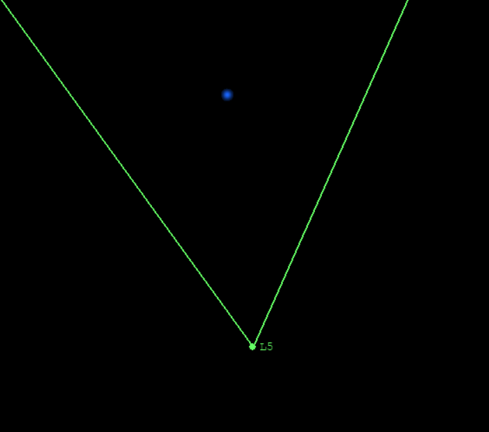

Un chiaro esempio di discrepanza tra il punto di Lagrange teorico e il punto *emerso* dal Lagrange Hunter (in blu, punto L5 Luna-Terra).

> [!NOTE]
> **Stabilità fisica dei punti di Lagrange:**
> * **L1, L2, L3 (Intrinsecamente instabili)**: Sono punti di sella gravitazionali. Un satellite posizionato su di essi si trova in un equilibrio perennemente instabile: qualsiasi perturbazione minima (numerica o gravitazionale) lo farà deviare e allontanare indefinitamente (nella realtà, richiedono accensioni di motori per correzioni orbitali attive).
> * **L4, L5 (Stabili)**: Se il rapporto tra le masse del sistema binario è elevato ($m_1/m_2 > 24.96$), questi punti si comportano come veri e propri pozzi di potenziale. I corpi catturati al loro interno vi orbitano attorno stabilmente a lunghissimo termine senza richiedere alcuna propulsione correttiva.

> [!TIP]
> **La strategia di "boot" ottimale per il lancio:**
> Il simulatore permette di generare satelliti direttamente sulle coordinate dell'**overlay teorico**. Tuttavia, in sistemi reali ed eccentrici, i punti fisici reali (visibili sulla heatmap) oscillano e descrivono delle traiettorie attorno alle posizioni teoriche ideali.
> 
> Per massimizzare la stabilità dell'orbita, il "boot" ottimale consiste nell'**attendere che i punti di Lagrange reali della heatmap intersechino quelli teorici** (un evento che, per via dell'eccentricità orbitale, avviene tipicamente 1 o 2 volte per rivoluzione completa). Il momento di perfetta sovrapposizione tra la fisica emergente e la geometria teorica è l'istante perfetto per lanciare il satellite, poiché minimizza la deriva iniziale e massimizza il tempo di cattura del satellite all'interno del punto di equilibrio.
Un altro modo consiste nell'aspettare, tramite la heatmap della Topologia di Roche, che la rivoluzione intersechi l'orbita ideale circolare disegnata sullo schermo (attivabile premendo 'M').
---

## 10. Fenomeni emergenti

Questi comportamenti **non sono programmati esplicitamente**: emergono dall'interazione delle equazioni precedenti.

- **La "respirazione" dei lobi di Roche.** Se una luna ha orbita eccentrica, la sua distanza dall'attrattore varia lungo l'orbita: il lobo di Roche si **espande all'apogeo e si contrae al perigeo**, pulsando in fase con l'eccentricità. Nasce spontaneamente dal calcolo di $\omega = h/r^2$ istantaneo.

- **L'asimmetria del dipolo Sole-Giove.** Nella heatmap dΦ/dt, Giove produce un dipolo gravitazionale visibile quanto quello del Sole, pur essendo molto più leggero. Il motivo è cinematico: il termine $\partial\Phi/\partial t \propto M\,v_{rad}/r^2$ dipende dalla **velocità** della sorgente nel baricentro, e Giove, più lontano dal centro di massa comune, si muove abbastanza da compensare la massa minore.

- **La biforcazione del raggio nelle collisioni.** Il modello di fusione è puramente cinetico (conservazione della quantità di moto), ma la crescita del raggio del corpo risultante biforca per tipo: **volumetrica** $\big(R \propto (R_1^3 + R_2^3)^{1/3}\big)$ per i corpi solidi, **lineare** $\big(R \propto M\big)$ per i buchi neri (perché $R_s \propto M$). La massa persa come ejecta cresce con la "violenza" dell'impatto, stimata dal rapporto tra energia cinetica relativa ed energia di legame.

- **L'effetto "fionda" negli ammassi caotici.** Negli ammassi densi, il mix tra orizzonti causali finiti e Dead Reckoning genera occasionali **espulsioni pseudo-relativistiche**: un corpo che attraversa una configurazione stretta riceve un calcio anomalo. Va letto come un artefatto qualitativo della dinamica causale discreta, non come fisica rigorosa, ed è connesso all'assenza di disgregazione mareale (i corpi non si frantumano, quindi sopravvivono a incontri che nella realtà li distruggerebbero).

---

*Per le scelte ingegneristiche dietro queste equazioni (buffer LOD, kernel JIT, dispatch, performance) si veda [ARCHITECTURE_DEEP_DIVE.md](ARCHITECTURE_DEEP_DIVE.md). Per l'uso e i controlli, il [README.md](README.md).*
