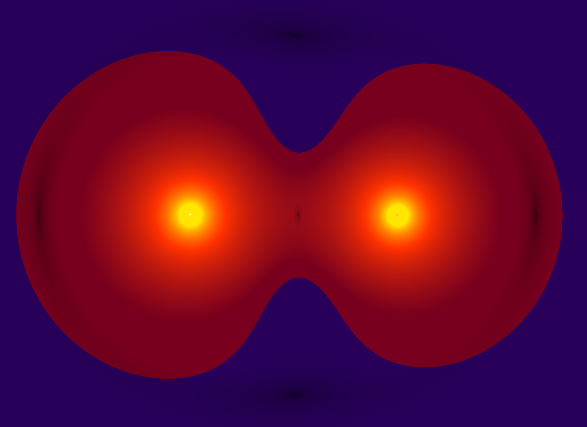
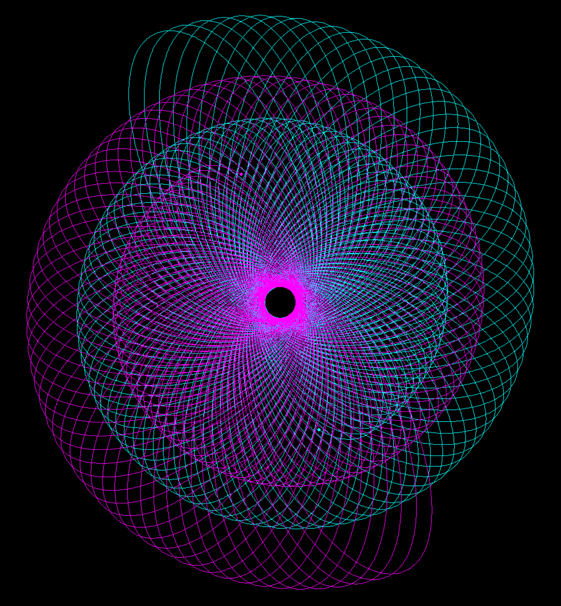
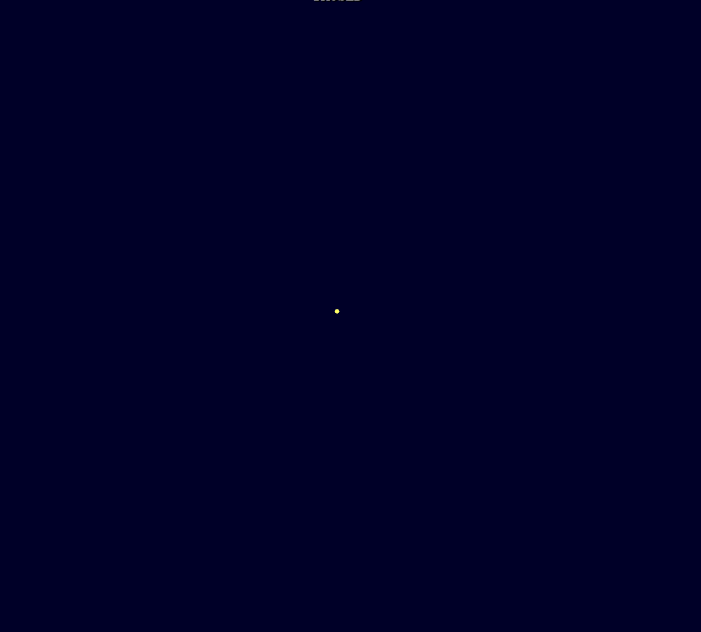
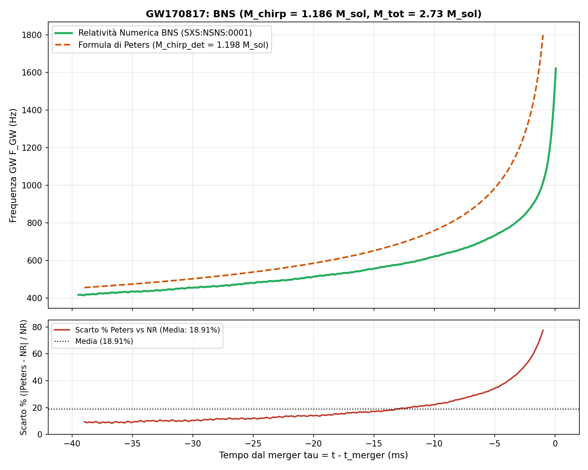

# AstroCausal Engine: sandbox interattivo di gravità causale e meccanica orbitale 2D

**🇮🇹 Italiano** · [🇬🇧 English](README.md)

<sub>Repository canonico: **https://github.com/alessandro-pioli/AstroCausal_Engine** — conviene leggerlo lì, dove formule, riquadri e link interni vengono resi correttamente. Se stai leggendo da un archivio scaricato, alcuni di questi non funzioneranno.</sub>

> Un laboratorio in tempo reale dove la gravità è ricreata come fenomeno genuinamente causale: l'informazione gravitazionale viaggia sempre a velocità finita c. Attorno a questo nucleo si osservano scenari che spaziano dal sistema solare completo al merge di buchi neri fino agli impatti tra galassie nane, con vettori e telemetria, spawner orbitale interattivo per orbite kepleriane e punti di Lagrange, suite completa di heatmap gravitazionali e la manifestazione visiva emergente di onde gravitazionali analoghe.

**Come orientarsi nella documentazione.** Il progetto è raccontato da tre documenti complementari, ciascuno per un lettore diverso:
- **Questo README**: per chi vuole *usare* il simulatore. Installazione, scenari, controlli, modalità di visualizzazione, gestione delle prestazioni.
- **[PHYSICS_AND_SCENARIO_GUIDE.md](PHYSICS_AND_SCENARIO_GUIDE.it.md)**: per chi vuole *capire la fisica*. Tutte le equazioni realmente implementate, la matematica delle heatmap, la validazione contro i dati reali (GWOSC) e la relatività numerica (SXS), con GIF e immagini dei fenomeni.
- **[ARCHITECTURE_DEEP_DIVE.md](ARCHITECTURE_DEEP_DIVE.it.md)**: per chi vuole *capire l'ingegneria*. Le scelte architetturali (DOD, kernel JIT, ring buffer LOD, rendering CPU), i problemi incontrati e le soluzioni che hanno retto.

---

## Anteprima

| Spirali dΦ/dt (binaria NS) | GW Strain al pericentro (EMRI) | Liénard-Wiechert (0,7c → c) (*what if* estremo) |
|:---:|:---:|:---:|
|  |  |  |

| Caos causale: stelle di neutroni attorno a Sag A* (dΦ/dt) | Topologia di Roche (Alpha Centauri AB) | Pattern a conchiglia (BNS doppia eccentricità) |
|:---:|:---:|:---:|
| <video src="https://github.com/user-attachments/assets/03e80460-fa52-413f-8dbc-311698c9bd78" controls="controls" width="100%"></video> |  |  |

**In sintesi:**
- **Gravità causale vera**: le forze viaggiano a velocità finita *c*, non istantanee, tramite buffer storici a più livelli di risoluzione. L'aberrazione che ne deriverebbe è compensata, non subita ([§3 della Guida Fisica](PHYSICS_AND_SCENARIO_GUIDE.it.md#3-aberrazione-causale-dead-reckoning-e-dinamica-relativistica)).
- **Onde gravitazionali analoghe**: i fronti d'onda $d\Phi/dt$ nei merger emergono dalla dinamica causale (analogo scalare 2D, non onde tensoriali reali), e la heatmap **GW Strain** proietta il quadrupolo delle velocità ritardate con la vera simmetria angolare di spin-2.
- **Sonda LIGO + pipeline spettrale**: registra lo strain (la deformazione dello spazio che l'interferometro misura) dei merger e ne stima la massa chirp (la combinazione di masse che governa il segnale), confrontandola con la formula analitica di Peters (l'andamento teorico del chirp di una binaria che irraggia).
- **Real-time su CPU consumer**: kernel Numba JIT (compilati al volo in codice macchina), fino a 600.000 TPS (tick di fisica al secondo) a 60 FPS nei merger compatti.
- **Sandbox interattivo**: spawn di corpi, orbite kepleriane, punti di Lagrange, switch newtoniano/causale al volo.

---

## Indice

1. [Anteprima](#anteprima)
2. [Panoramica](#panoramica)
3. [Fenomeni Emergenti nel Modello](#fenomeni-emergenti-nel-modello)
4. [Scenari Preimpostati](#scenari-preimpostati)
5. [Controlli della Simulazione](#controlli-della-simulazione)
6. [Installazione](#installazione)
7. [Modalità di Visualizzazione del Campo](#modalità-di-visualizzazione-del-campo)
8. [Modello Fisico](#modello-fisico)
9. [Architettura Software](#architettura-software)
10. [Limiti del Modello e Gestione delle Prestazioni](#limiti-del-modello-e-gestione-delle-prestazioni)
11. [Analizzatore LIGO](#analizzatore-ligo)
12. [Sviluppi Futuri e Disclaimer Scientifico](#sviluppi-futuri-e-disclaimer-scientifico)

---

## Panoramica

**AstroCausal Engine** è un simulatore gravitazionale interattivo e un laboratorio di meccanica celeste 2D. Progettato come un "sandbox" astronomico, permette l'esplorazione delle dinamiche orbitali stabili in scala reale (dal Sistema Solare a sistemi di lune e satelliti) e lo studio di fenomeni fisici di frontiera attraverso un modello gravitazionale nativamente **causale**: le forze non agiscono istantaneamente, ma si propagano alla velocità della luce *c* attraverso un sistema di buffer storici circolari ottimizzati.

La scelta architetturale fondamentale del progetto è operare in uno spaziotempo **2+1D** (due dimensioni spaziali più il tempo come asse esplicito) su sfondo euclideo piatto, senza risolvere le equazioni di campo della Relatività Generale. Le leggi restano però quelle della fisica tridimensionale reale ( $1/r^2$ , non l'$1/r$ di una gravità intrinsecamente bidimensionale) e il tempo è assoluto nel senso preciso del tempo coordinato di un **osservatore lontano** dal sistema, la stessa convenzione con cui si cronometrano nella realtà pulsar binarie e onde gravitazionali. Questa semplificazione geometrica consente al motore di girare **in tempo reale su qualsiasi PC consumer** stressando la CPU per calcolare la fisica in virgola mobile a doppia precisione (`float64`) tramite parallelizzazione JIT.

Sul nucleo causale (la gravità newtoniana valutata al tempo ritardato $t - r/c$), al verificarsi di determinate condizioni, il motore innesta la reazione di radiazione reale di ordine 2.5PN (Post-Newtoniano, l'ordine perturbativo a cui compare la perdita di energia per onde gravitazionali) e fa emergere dinamicamente comportamenti qualitativamente coerenti con la relatività reale (aberrazione causale, contrazione del campo simil Liénard-Wiechert per sorgenti prossime a $c$, ossia la stessa deformazione che subisce il campo di una carica elettrica in moto rapido, chirp e onde gravitazionali analoghe misurate da una sonda LIGO virtuale), offrendo un laboratorio didattico per esplorare e confrontare la meccanica classica e la dinamica causale a ritardo finito.

L'equilibrio tra fedeltà fisica e fluidità grafica è in larga parte **nelle mani dell'utente**: il motore propone un bilanciamento ma lascia regolare in tempo reale il passo temporale, la velocità di calcolo e la risoluzione delle heatmap.

### Caratteristiche Principali

- **Sandbox Interattivo & Spawner**: Inserimento dinamico di corpi celesti in tempo reale con impostazione istantanea di orbite kepleriane stabili, traiettorie eccentriche, collisioni (plunge) o posizionamento nei punti di Lagrange L1–L5.
- **Preset di Sistemi Celesti**: Ampio catalogo di scenari pronti all'uso, tra cui il Sistema Solare completo (con 26 lune), il sistema di Giove, la Terra con satelliti in orbita bassa (ISS, Hubble) ed eventi cosmici estremi come buchi neri binari e collisioni galattiche.
- **Heatmap Gravitazionali in Tempo Reale**: Rendering dinamico dei campi fisici sullo sfondo, inclusi il potenziale gravitazionale scalare $\Phi$, le onde scalari $d\Phi/dt$ (onde analoghe), lo stress di marea Hessiano, la topologia dei lobi di Roche nel sistema co-rotante e lo **strain quadrupolare proiettato (GW Strain)** con le spirali radiative causali delle binarie compatte.
- **Flessibilità e Controllo**: Regolazione dinamica del passo temporale ($DT$), moltiplicatori di velocità per i calcoli fisici, switch istantaneo tra gravità newtoniana e causale (tasto C), tracciamento delle orbite e sonda LIGO virtuale per registrare lo strain gravitazionale.
- **Pipeline LIGO Analyzer**: Applicazione indipendente per il post-processing spettrale dei dump delle onde (Tukey windowing, filtri passa-alto, spettrogrammi STFT, trasformata di Hilbert per la frequenza istantanea, regressione e stima automatica della massa chirp).
- **Motore JIT Numba**: Integrazione Velocity Verlet brute-force $O(N^2)$, compilata Just-in-Time e parallelizzata sui core della CPU sopra una soglia di corpi (sotto la quale resta sequenziale per evitare l'overhead dei thread).

---

## Fenomeni Emergenti nel Modello

Questi comportamenti dinamici **non sono programmati esplicitamente**, ma emergono naturalmente dalla dinamica e dal dead reckoning (l'estrapolazione della posizione da posizione e velocità note) dell'interazione gravitazionale causale:

<small>Le thumbnail sono cliccabili e aprono la cartella con tutti i media disponibili. Ogni fenomeno qui elencato è approfondito, equazioni e grafici di validazione inclusi, nella [Guida Fisica e agli Scenari](PHYSICS_AND_SCENARIO_GUIDE.it.md).</small>

| | |
|---|:---:|
| **Propagazione causale visibile a occhio nudo**: Distruggendo o creando istantaneamente un corpo, l'informazione gravitazionale si propaga visivamente alla velocità della luce. I corpi lontani continuano a "sentire" il corpo distrutto finché il fronte di assenza non li raggiunge (e, viceversa, un nuovo corpo rimane invisibile ai corpi distanti fino all'arrivo del fronte causale). | <a href="docs/gif/"></a> |
| **Analogia visiva delle onde gravitazionali**: Nella heatmap dΦ/dt, le binarie compatte in fase di inspiral (l'avvicinamento progressivo a spirale prima del merger) producono fronti d'onda concentrici con frequenza ed ampiezza crescenti, in perfetta analogia visiva con le onde gravitazionali reali emesse dai merger. | <a href="docs/gif/"></a> |
| **Punti di Lagrange L1–L5**: Emergono nel sistema Terra-Luna e sono visualizzabili dinamici nel Lagrange Hunter. | <a href="docs/img/"></a> |
| **Respirazione dei Lobi di Roche**: L'espansione e contrazione periodica del lobo di Roche lunare in fase con la sua eccentricità orbitale (il lobo si espande all'apogeo e si contrae al perigeo). | <a href="docs/img/"></a> |
| **Distorsione di Liénard-Wiechert**: La contrazione geometrica causale delle isolinee del potenziale $\Phi$ trasversalmente alla direzione di moto per sorgenti ad alte velocità. | <a href="docs/gif/"></a> |
| **Chirp Gravitazionale**: Il progressivo aumento in frequenza ed ampiezza dei fronti d'onda del potenziale emessi da binarie compatte in inspiral guidato da dissipazione di quadrupolo. | <a href="docs/img/"></a> |
| **Validazione BNS parameter-free su formula di Peters**: nello scenario GW170817 (binaria di stelle di neutroni), la massa chirp stimata dalla pipeline spettrale della sonda LIGO virtuale cade allo **0,97%** dall'analitica di Peters, in modalità *parameter-free* (solo equazioni da principi primi, nessun coefficiente di taratura). [Dettagli, grafici e limiti in §6.6.1 della Guida Fisica](PHYSICS_AND_SCENARIO_GUIDE.it.md#661-lo-scenario-bns-gw170817-peters-vs-relatività-numerica-sxs). | <a href="docs/img/"></a> |
| **Emergenza dell'ISCO e del plunge**: Nello scenario BBH (binaria di buchi neri, GW150914), la separazione orbitale decade finché le masse non raggiungono la soglia dell'ISCO, l'Innermost Stable Circular Orbit, l'ultima orbita circolare stabile sotto la quale ogni traiettoria precipita (frequenza teorica di 62.06 Hz). A questo punto, il sistema innesca spontaneamente la caduta rapida a spirale (plunge) a una frequenza di 62.40 Hz senza alcuna forzatura nel codice. | <a href="docs/gif/"></a> |
| **Validazione BBH parameter-free su NR SXS**: nello scenario GW150914 (binaria di buchi neri), la traccia del chirp simulato segue la curva di relatività numerica di riferimento (SXS:BBH:0305) con un errore medio dell'**1,27%** lungo tutto l'inspiral, contro il 7,47% della formula analitica di Peters all'ordine dominante ([dettagli e grafici in §6.6.2 della Guida Fisica](PHYSICS_AND_SCENARIO_GUIDE.it.md#662-lo-scenario-bbh-gw150914-confronto-con-la-relatività-numerica-sxs)). | <a href="docs/img/"></a> |
| **Il dipolo del corpo singolo in dΦ/dt**: la derivata temporale del potenziale di un corpo in moto produce da sola un fronte dipolare, blu davanti e rosso dietro, la base su cui si innestano poi le spirali della coppia binaria. | <a href="docs/gif/"></a> |
| **Il passaggio al perielio negli EMRI**: nelle prime fasi dell'inspiral, ogni pericentro rilascia un impulso isolato di strain che si propaga come un guscio concentrico a velocità $c$, separato dal successivo da ampie regioni di silenzio. | <a href="docs/img/"></a> |
| **Precessione apsidale in campo forte**: nelle orbite compatte (es. EMRI) l'orbita precessa a rosetta non per una routine dedicata, ma per la correzione di Paczyński-Wiita al pericentro, rinforzata dal residuo del dead reckoning oltre il 2° ordine. | <a href="docs/gif/"></a> |

---

## Scenari Preimpostati

*Come leggere la tabella*: il **DT** è il passo temporale, cioè quanto tempo simulato avanza a ogni tick (più piccolo = più preciso e più "lento" nel tempo reale). Il **Raggio Causale** ($D_{max}$) è la distanza entro cui le forze viaggiano a velocità finita $c$ interrogando i buffer storici; oltre quel raggio l'interazione torna newtoniana istantanea. Unità: $1\text{ AU}$ (Unità Astronomica) $= 149.597.870,7\text{ km}$, la distanza media Terra-Sole.

> **Nota sui nomi.** L'interfaccia del simulatore è in inglese: la colonna *Scenario* riporta l'etichetta **esattamente come compare nel menu del launcher**, così è immediato ritrovarla. Le descrizioni restano in italiano.

| Scenario | Corpi | DT | Raggio Causale | Descrizione |
|---|:---:|:---:|:---:|---|
| **Complete Solar System** | 36 | 150 s | 64 AU | Sole, 8 pianeti, Plutone e 26 lune principali |
| **Solar System (Light)** | 10 | 512 s | 64 AU | Solo Sole e 9 pianeti, senza lune: DT più alto senza perdere fedeltà kepleriana, orbite esterne osservabili in tempi ragionevoli |
| **Galactic Orbit (Sgr A\*)** | 11 | 512 s | 64 AU | Sistema Solare in orbita a 230 km/s attorno a Sagittarius A\* |
| **Chaotic Cluster** | 100 | 64 s | 64 AU | Stress-test N-body con BH centrale da 1000 M☉ |
| **Earth - Moon - ISS - Hubble** | 4 | 1 s | 1 AU | Regime geocentrico con ISS e Hubble in orbita LEO |
| **Sun - Earth - Moon - Artemis II** | 4 | 0.16 s | 1 AU | Crociera translunare passiva di Orion su vettori reali JPL Horizons, fino al flyby free-return |
| **Complete Jovian System** | 14 | 60 s | 1 AU | Giove e 13 lune (interne, galileiane, irregolari) |
| **Approach to *c* (0.999c)** | 1 | 0.16 s | 320 LY (~20M AU) | Sole a 0.999c: distorsione Liénard-Wiechert (20 GB RAM) |
| **Approach to *c* (0.9c)** | 1 | 1.6 s | 1742 LY (~110M AU) | Versione alleggerita (10 GB RAM) |
| **Approach to *c* (0.7c)** | 1 | 16 s | 8710 LY (~550M AU) | Versione ultra-light (5 GB RAM) |
| **NS Binary: Stable Orbit** | 2 | 1 ms | 640 AU | Due stelle di neutroni ~1.5 M☉ a 40.000 km |
| **NS Binary: Extreme Eccentricity** | 2 | 1 μs | 3 AU | Orbite gemelle altamente eccentriche (apocentro 4000 km, pericentro 200 km) |
| **NS Binary: Pre-Collision** | 2 | 1 μs | 2 AU | Late inspiral, merger in ~59,7 s simulati |
| **GW170817** | 2 | 1 μs | 3 AU | Replica del primo evento multi-messaggero (merger in ~13,9 s simulati) |
| **GW150914** | 2 | 1 μs | 3 AU | Primo evento GW rilevato da LIGO (merger in 52,034 s simulati, inizializzato teoricamente a T-60s) |
| **GW190814** | 2 | 1 μs | 3 AU | Il merger più asimmetrico (q = 0,112): BH da 23 M☉ e oggetto del mass gap da 2,6 M☉ (inizializzato a T-20s via Peters) |
| **Alpha Centauri + Polyphemus** | 9 | 150 s | 32 AU | Sistema triplo reale + sistema fittizio da *Avatar* |
| **Extreme Orbits Laboratory** | 6 | 0.2 s | 2 AU | BH centrale + 5 particelle test (e=0 → iperbolica) |
| **EMRI: Relativistic Plunge** | 2 | 0.05 s | 1200 AU | Extreme Mass Ratio Inspiral: un buco nero leggero spiraleggia in uno molto più massiccio (rapporto 1:100) |
| **Collision between Dwarf Galaxies** | 202 | 150 s | 64 AU | Collisione quasi-frontale di due galassie da 100 stelle |
| **Empty Scenario** | 0 | 1 s | Da astro_settings.ini | Universo vuoto per costruzione libera (impostabile tramite file .ini) |

---

## Controlli della Simulazione

### Navigazione

| Tasto | Azione |
|:---:|---|
| `Mouse trascinamento` | Pan della camera |
| `Rotella mouse` | Zoom in/out |
| `WASD / Frecce direzionali` | Pan della camera (spostamento continuo della visuale) |
| `Doppio click su corpo` | Lock camera sul corpo selezionato |
| `Doppio click su vuoto` | Sonda di campo nel punto del cursore (Φ, dΦ/dt, Tidal) |
| `TAB` | Cicla tra i corpi attivi |

### Simulazione

| Tasto | Azione |
|:---:|---|
| `SPAZIO` | Pausa / Riprendi |
| `1-5` | Moltiplicatore TPS: 1×, 10×, 100×, 1000×, 10000× step fisici per frame, regola velcità di simulazione senza incidere sulla precisione del modello |
| `T` | Dimezza il DT: più preciso, dimezza la velocità di simulazione, più RAM utilizzata|
| `Y` | Raddoppia il DT: meno preciso, raddoppia la velocità di simulazione, meno RAM utilizzata|
| `C` | Switch Newtoniano ↔ Causale (ricostruzione completa) |
| `BACKSPACE` | Chiudi e torna al launcher |

### Visualizzazione

| Tasto | Azione |
|:---:|---|
| `H` | Cicla modalità heatmap: OFF → Φ Scalare [causale] → dΦ/dt [causale] → Tidal Stress [newtoniano] → OFF |
| `L` | Cicla le heatmap di coppia: Lagrange Hunter → Topologia di Roche [newtoniani] → GW Strain [causale] → Φ (richiede corpo con lock e attrattore dominante) |
| `R` | Mostra/nascondi scie orbitali |
| `G` | Cicla risoluzione heatmap: AUTO → 1/1 → 1/2 → 1/4 → ... → AUTO |
| `M` | Toggle legenda (in Tidal) o marcatori Lagrange teorici (in Lagrange Hunter) o orbita ideale circolare (nella Topologia di Roche) |
| `F` | Legenda tasti (overlay) |

### Strumenti

| Tasto | Azione |
|:---:|---|
| `P` | Piazza/rimuovi sonda LIGO nella posizione del cursore |
| `N` | Apri lo Spawner Orbitale nella posizione del cursore |
| `K` | Richiedi la distruzione del corpo con lock (conferma Y/N) |

---

## Installazione

### Requisiti

- **Python** 3.10+
- **Sistema operativo**: Windows 10/11 (consigliato), Linux o macOS
- **RAM**: Minimo 4 GB per scenari standard, 8–20 GB per scenari relativistici ad alta risoluzione (basso DT)

### Dipendenze

```
numpy
pygame-ce
numba
matplotlib
scipy
```

### Setup

```bash
# Clona il repository
git clone https://github.com/alessandro-pioli/AstroCausal_Engine.git
cd AstroCausal_Engine

# Installa le dipendenze
pip install -r requirements.txt

# Avvia il launcher
python launcher.py
```

> **Nota**: Al primo avvio Numba compila i kernel fisici e grafici e li salva in cache su disco (quindi solo la prima volta). La compilazione è rapida, ma può produrre brevi **stutter** la prima volta che si attiva una funzione non ancora compilata durante l'uso (per esempio al primo ciclo tra le heatmap). È normale e sparisce subito dopo.

---

## Modalità di Visualizzazione del Campo

### 1. Potenziale Scalare Φ — `[Causale]` (Tasto H)
Mappa a colori del potenziale gravitazionale, calcolato dalle posizioni storiche (causali) dei corpi. Per un singolo corpo in movimento mostra il **pozzo di potenziale** che lo accompagna; per corpi in rapido moto rettilineo uniforme il denominatore di Liénard-Wiechert deforma e schiaccia le isolinee trasversalmente alla direzione di moto (analogo della distorsione del campo elettrico di una carica in movimento). Il classico "dipolo" rosso-blu non appartiene a questa mappa, ma alla variazione dΦ/dt descritta qui sotto.

### 2. Variazione del Potenziale dΦ/dt — `[Causale]` (Tasto H × 2)
Rappresenta la variazione temporale del potenziale gravitazionale scalare, calcolata dalle posizioni storiche (causali). Per un corpo in movimento sufficientemente distante dagli altri appare il caratteristico **dipolo**: un fronte **blu davanti** (dove il potenziale si approfondisce all'avvicinarsi del corpo) e un fronte **rosso dietro** (dove si rilassa). Nei merger di binarie compatte i fronti diventano concentrici e crescenti in frequenza e ampiezza: l'analogo scalare visivo delle onde gravitazionali.
* **Fader destro (Sensibilità, range `[-4, 2]`):** alza o abbassa l'intensità visiva. Più è alto, più è facile vedere i fronti dei dipoli **fondersi e amalgamarsi** con quelli emessi dai corpi distanti più massicci; più è basso, più si isolano i fronti vicini evitando che lo schermo venga abbagliato.

### 3. Stress di Marea (Tidal Map) — `[Newtoniano]` (Tasto H × 3)
Mappa della **norma deviatorica della matrice Hessiana** del potenziale gravitazionale newtoniano, calcolata dalle posizioni istantanee. Le componenti della Hessiana $\partial^2 \Phi / \partial x_i \partial x_j$ sono calcolate analiticamente per ogni corpo:

$$H_{ij} = G \cdot m \left(\frac{\delta_{ij}}{r^3} - \frac{3 x_i x_j}{r^5}\right)$$

Lo stress visualizzato è la **differenza dei due autovalori dell'Hessiana**, $\sqrt{(\Phi_{xx} - \Phi_{yy})^2 + 4\Phi_{xy}^2}$ (proporzionale alla parte deviatorica del tensore): misura il massimo **sforzo di taglio** (shear), cioè quanto un corpo verrebbe stirato in una direzione e compresso in quella ortogonale. Evidenzia le zone di sollecitazione mareale estrema (ad esempio l'orbita di Io attorno a Giove). La colorazione è su scale fisiche fisse: dal blu (regione sicura) al rosso (disgregazione strutturale) al bianco (vicinanze della singolarità). Il tasto `M` mostra la **legenda** con le soglie, per leggere a colpo d'occhio a quale stress un corpo verrebbe disgregato.

### 4.A. Lagrange Hunter — `[Newtoniano]` (Tasto L con corpo selezionato)
Sistema co-rotante a 2 corpi (corpo selezionato + attrattore dominante) per l'individuazione degli equilibri orbitali. Questa modalità non renderizza una heatmap continua del campo, ma individua ed evidenzia i **punti di Lagrange L1–L5** come punti luminosi discreti su uno sfondo completamente nero. Il kernel calcola il gradiente e l'Hessiana del potenziale e utilizza un **stimatore di distanza basato sul metodo Newton-Raphson in 2D** ($r_{est} = |H^{-1} \nabla \Phi|$) per disegnare "blob" sfumati in corrispondenza degli zeri del gradiente. I punti sono classificati topologicamente tramite la Hessiana: i punti di sella instabili (L1, L2, L3) appaiono come **punti rossi**, mentre i massimi stabili del potenziale co-rotante (L4, L5) come **punti blu**. I minimi locali del potenziale (pozzi gravitazionali al centro dei corpi, con $D > 0$ e $\text{Tr}(H) > 0$) sono esclusi dal filtro sulla traccia della Hessiana, impedendo la comparsa di falsi blob blu sovrapposti ai corpi. Premendo `M` si sovrappongono i marcatori teorici analitici per un confronto immediato con i punti che emergono numericamente dal calcolo.
* **Fader destro (Sensibilità, range `[-8, 8]`, default `0.0`):** Regola la dimensione dei punti di Lagrange visualizzati. Riducendo la sensibilità, i punti si restringono per indicare con precisione la coordinata esatta di equilibrio; aumentandola, i punti si allargano mostrando l'area d'attrazione gravitazionale circostante. Grazie alla calibrazione automatica, il valore di default `0.0` mostra chiaramente i punti per qualsiasi sistema (da Saturno ai buchi neri binari).
* **Nota di utilizzo (Pianeti vs Lune):** Nei sistemi in cui il pianeta è piccolissimo rispetto alla sua stella, i punti L3, L4 e L5 sono molto deboli e tendono a confondersi sfumando lungo l'intera orbita. Nei sistemi in cui il rapporto di massa è più bilanciato (come una grande luna che gira attorno al suo pianeta), tutti i punti emergono invece in modo netto, nitido e ben separati.

### 4.B. Topologia di Roche — `[Newtoniano]` (Tasto L × 2)
Mappa del **potenziale effettivo nel sistema co-rotante** della coppia selezionata (corpo + attrattore dominante). La velocità angolare $\omega$ è ricavata cinematicamente dal momento angolare specifico istantaneo della coppia ($h = \vec{r} \times \vec{v}_{rel}$, $\omega = h / r^2$): il frame ruota come un **disco rigido** (ogni punto co-ruota alla stessa $\omega$, con velocità lineare $v = \omega r$). Il potenziale effettivo somma la gravità N-body completa e il termine centrifugo, al netto del trascinamento in caduta libera dovuto ai corpi terzi.

La mappa codifica **due informazioni indipendenti**, da leggere separatamente:

- **Luminosità = modulo della forza netta** $|\nabla \Phi_{eff}|$, in scala logaritmica. Dove la forza è quasi nulla la mappa è **scura**: sono i **punti di equilibrio** e i canali a bassa forza (i punti di Lagrange, in primis la sella L1 tra i due corpi). Il nero segna quindi *dove una particella co-rotante non sentirebbe forza netta*.
- **Colore = segno del determinante dell'Hessiana** $D = \Phi_{xx}\Phi_{yy} - \Phi_{xy}^2$, cioè la *curvatura* locale del potenziale, **indipendente dalla luminosità**:
 - **Rosso ($D < 0$, sella)**: domina vicino ai corpi. Lì una particella co-rotante **cadrebbe verso l'attrattore**: la gravità prevale e stira il potenziale (allungamento radiale, compressione trasversale).
 - **Blu ($D > 0$, cupola)**: domina lontano dai corpi. Lì la velocità co-rotante $v = \omega r$ supera quella kepleriana $\sqrt{GM/r}$: il centrifugo prevale e una particella co-rotante **verrebbe scagliata verso l'esterno**.

Il **lobo di Roche** non coincide col confine fra rosso e blu (quella è la linea dove cambia segno la curvatura $D$, un luogo geometrico diverso): è l'**equipotenziale di $\Phi_{eff}$ che passa per L1**, e visivamente lo si legge dai **canali scuri** attorno ai corpi. La figura a "otto" a bassa forza che si chiude proprio sulla sella L1 segna il volume massimo che un corpo può occupare prima che la sua materia strabordi (*Roche Lobe Overflow*). Più il rapporto di massa è estremo, più il lobo del secondario si restringe in una "goccia" allungata lungo l'asse di marea.
* **Fader destro (Sensibilità, range `[-8, 8]`):** alza o abbassa la luminosità generale per far emergere i dettagli più deboli o scurire il fondo.
* **Fader sinistro (Contrasto, range `[0, 100]`):** controlla la nitidezza del passaggio di luminosità; alzandolo, i canali scuri attorno a L1 si assottigliano e diventano netti, facilitando l'individuazione del punto di overflow.

### 4.C. GW Strain (Quadrupolo) — `[Causale]` (Tasto L × 3)
La visualizzazione più sofisticata del campo dinamico: mappa lo **strain gravitazionale quadrupolare proiettato** della coppia selezionata. Per ogni pixel, il kernel legge posizione e velocità di ciascun corpo **al tempo ritardato di quel pixel** (doppio ritrovamento causale sui buffer storici), sottrae il moto del centro di massa e proietta la velocità ritardata lungo la direzione pixel-sorgente: la differenza quadratica tra componente radiale e tangenziale riproduce l'esatta simmetria angolare di quadrupolo ($\ell=2$) della radiazione gravitazionale reale, con i caratteristici quattro lobi alternati ciano/rosso e, per le binarie compatte in inspiral, le **macro-spirali radiative** che si propagano verso l'esterno a velocità $c$. È la controparte spaziale della sonda LIGO puntuale (stessa fisica, stessa regolarizzazione cinetica). La matematica completa, gli effetti della causalità per-corpo e gli artefatti post-merger sono documentati nel [§7.6 della Guida Fisica](PHYSICS_AND_SCENARIO_GUIDE.it.md#76-deformazione-proiettata-gw-strain-quadrupolare).
* **Fader destro (Sensibilità):** condiviso con la modalità Roche; scala l'ampiezza visiva dello strain (compressione asinh, che preserva i dettagli deboli in campo lontano senza saturare i picchi vicino alla coppia).

---

## Modello Fisico

Il modello è **2+1D con tempo assoluto**: tutta la dinamica vive nelle due dimensioni del piano (una fetta di universo 3D, con le leggi $1/r^2$ della fisica tridimensionale) mentre un unico orologio universale scandisce il tempo per ogni corpo. È il punto di vista di un **osservatore lontano** dal sistema, senza dilatazione temporale né metrica curva. La relatività entra dal lato delle interazioni, con la causalità a velocità finita $c$ e le correzioni descritte sotto ([inquadramento completo nel §1 della Guida Fisica](PHYSICS_AND_SCENARIO_GUIDE.it.md#1-inquadramento-il-modello-causale-e-lapprossimazione-2d)).

### Equazione fondamentale

L'interazione tra ogni coppia di corpi segue la legge di gravitazione universale di Newton:

```
F = G · M · m / r²
```

con la differenza cruciale che la posizione, la velocità e la massa del corpo sorgente vengono **prelevate dal buffer storico** al tempo ritardato $t_{ret} = t - r/c$, dove $r$ è la distanza e $c$ la velocità della luce.

Per sorgenti in moto relativistico, il potenziale gravitazionale viene corretto inserendo il denominatore classico di **Liénard-Wiechert** $(dist - \vec{v} \cdot \vec{r}/c)$ per descrivere la contrazione di campo, concentrando la forza gravitazionale ortogonalmente alla direzione di moto ([approfondimento in §5 della Guida Fisica](PHYSICS_AND_SCENARIO_GUIDE.it.md#5-deformazione-di-liénard-wiechert)).

---

> [!NOTE]
> ### Come il simulatore evita l'instabilità da aberrazione
> Nella gravità causale discreta, l'aberrazione della forza (dovuta al fatto che la gravità punta verso la posizione ritardata) introduce una coppia fittizia che tende ad allargare rapidamente le orbite celesti. Per mitigare questa instabilità numerica e preservare la stabilità kepleriana a lungo termine, il motore implementa un **Dead Reckoning Ibrido** (la tecnica, presa in prestito dalla navigazione, di stimare dove un corpo *è ora* a partire da dov'era e dalla sua velocità) a livello di kernel JIT:
> 
> 1. **Dead Reckoning Quadratico (Taylor di 2° ordine)**: per orbite stabili e velocità ordinarie, la posizione della sorgente viene estrapolata integrando velocità e accelerazione storica all'istante di emissione:
> $$\vec{x}_{eff} = \vec{x}_{ret} + \vec{v}_{ret} \Delta t_{flight} + \frac{1}{2}\vec{a}_{ret} \Delta t_{flight}^2$$
> 2. **Bypass del Dead Reckoning nel Regime GW**: in regime relativistico estremo (vicino al merger, con velocità **relativa** della coppia superiore al 10% di $c$ e distanza inferiore a $1000 \cdot R_s$; per masse uguali il criterio equivale al 5% di $c$ per singolo corpo, ma resta valido anche per coppie asimmetriche dove il corpo pesante si muove lentamente), il motore disattiva l'estrapolazione lineare e utilizza la **posizione presente esatta** della sorgente sia per la direzione che per la distanza nel calcolo delle forze. Questo elimina all'origine l'accumulo di errore radiale periodico $O((v/c)^2)$ responsabile dell'instabilità orbitale.

---

### Reazione alla radiazione gravitazionale (Termine 2.5PN reale)

Nei merger binari compatti, l'orbita decade a causa dell'emissione di onde gravitazionali. Il motore implementa l'accelerazione dissipativa al primo ordine non conservativo (**reazione alla radiazione di ordine 2.5PN**) secondo la formulazione relativistica reale di **Damour-Deruelle** per l'accelerazione relativa $\vec{a}_{rel}$ (contesto teorico e storia dell'implementazione in [§6.2-6.5 della Guida Fisica](PHYSICS_AND_SCENARIO_GUIDE.it.md#62-cosa-sono-gli-ordini-post-newtoniani-e-il-25pn)):

$$\vec{a}_{rel} = \frac{8}{5}\frac{G^2 M \mu}{c^5 r^3}\Big[\dot{r}\big(18v^2 + \tfrac{2}{3}\tfrac{GM}{r} - 25\dot{r}^2\big)\hat{n} - \big(6v^2 - 2\tfrac{GM}{r} - 15\dot{r}^2\big)\vec{v}\Big]$$

dove $M$ è la massa totale della coppia, $\mu$ è la massa ridotta, $\hat{n}$ è il versore di separazione e $\vec{v}$ è la velocità relativa. Questa accelerazione viene calcolata ed applicata a ciascun corpo in base al suo contributo di massa reciproco ($m_{src}/M$), garantendo la conservazione del momento lineare complessivo. Il calcolo opera in modalità *parameter-free*, delegando l'evoluzione dell'orbita unicamente all'espressione teorica di ordine $2.5\text{PN}$.

### Schema di Integrazione: Velocity Verlet

Per garantire la conservazione dell'energia orbitale e la stabilità a lungo termine dei sistemi gravitazionali complessi, il motore adotta uno schema di integrazione di tipo **Velocity Verlet** (implementato nei kernel Numba JIT in `kernel_single.py`, `kernel_double.py` e `kernel_triple.py`; l'analisi dell'errore di troncamento è in [§4 della Guida Fisica](PHYSICS_AND_SCENARIO_GUIDE.it.md#4-metodi-numerici-velocity-verlet-errore-di-troncamento-e-dt)). Ciascuno step di integrazione fisica segue questa precisa sequenza temporale:

1. **Primo "Half-Kick" delle velocità** (con warm-start delle accelerazioni al tempo $t=0$ precalcolate in fase di rebuild via broadcasting NumPy):
 $$\vec{v}\left(t + \frac{\Delta t}{2}\right) = \vec{v}(t) + \frac{1}{2} \vec{a}(t) \Delta t$$
2. **Aggiornamento delle posizioni ("Drift")**:
 $$\vec{x}(t + \Delta t) = \vec{x}(t) + \vec{v}\left(t + \frac{\Delta t}{2}\right) \Delta t$$
3. **Risoluzione sequenziale delle collisioni**:
 Eventuali contatti fisici o catture all'orizzonte degli eventi modificano istantaneamente posizioni e velocità prima del calcolo delle forze.
4. **Calcolo causale delle forze e accelerazione**:
 Vengono calcolate le accelerazioni $\vec{a}(t + \Delta t)$ valutando le forze gravitazionali causali prodotte da tutti i corpi, interrogando i buffer storici all'istante di emissione ($t_{ret} = t - r/c$).
5. **Correzione relativistica dell'inerzia**:
 Sotto la soglia di $v^2 = 0.5 c^2$ (≈ 0.707 c) l'accelerazione resta invariata. Sopra quella soglia viene riscalata dal fattore di Lorentz inverso, che la sopprime man mano che $v \to c$:
 $$\vec{a}_{eff}(t + \Delta t) = \vec{a}(t + \Delta t) \cdot \sqrt{1 - \frac{v^2}{c^2}}$$
 Oltre la soglia $v^2 = 0.999 c^2$ (circa $0{,}9995 c$) l'accelerazione viene azzerata del tutto: in condizioni ordinarie un corpo non può più essere spinto oltre quel limite.
6. **Secondo "Half-Kick" delle velocità**:
 $$\vec{v}(t + \Delta t) = \vec{v}\left(t + \frac{\Delta t}{2}\right) + \frac{1}{2} \vec{a}_{eff}(t + \Delta t) \Delta t$$

### Il Ruolo Determinante di DT (Passo Temporale)

Il parametro **DT** ($\Delta t$) è la costante fondamentale che governa la discretizzazione temporale del modello. La sua scelta è il fattore più determinante nel bilanciamento tra accuratezza fisica, capacità di campionamento e risorse di sistema, per via di tre dinamiche concorrenti:

#### 1. Precisione dell'Integrazione Numerica
Come passo temporale dell'algoritmo Velocity Verlet, $\Delta t$ definisce l'errore di troncamento locale della traiettoria ($O(\Delta t^4)$ per le posizioni). 
- In sistemi ordinari (es. orbite planetarie stabili), $\Delta t$ può salire fino all'ordine dei minuti (nel Sistema Solare completo si usa 150 s), oltre i quali la fedeltà delle orbite inizia a degradare.
- In sistemi compatti e relativistici (es. inspiral e merger di binarie compatte), le accelerazioni e le velocità dei corpi variano in modo estremo su frazioni di secondo. Per evitare che l'aberrazione causale e le forze dissipative introducano instabilità numeriche (causando l'espulsione o la fusione prematura dei corpi), è matematicamente necessario impostare un $\Delta t$ microscopico, fino a $1\ \mu\text{s}$.

#### 2. Scaling Lineare della Memoria (RAM) e Limite del Raggio Causale
Poiché le forze gravitazionali si propagano alla velocità finita $c$, ogni corpo deve calcolare le interazioni risalendo lungo il proprio cono di luce fino al massimo tempo di volo:
$$t_{flight\_max} = \frac{D_{max}}{c}$$
dove $D_{max}$ è la massima distanza causale operativa impostata per lo scenario. La profondità logica dei ring-buffer di memoria per ciascun corpo deve coprire almeno $t_{flight\_max}$. Il numero di elementi $N_{elements}$ da allocare per ogni buffer di ciascun corpo scala quindi come:
$$N_{elements} = \frac{t_{flight\_max}}{\Delta t} \propto O\left(\frac{1}{\Delta t}\right)$$

Questa relazione mostra come la richiesta di RAM sia inversamente proporzionale a $\Delta t$. Il vincolo è però gestito a monte: ogni preset sceglie il proprio **raggio del cono causale** ($D_{max}$), e il `SimulationManager` lo **legge** dimensionando di conseguenza i buffer per ottimizzare la memoria. Per questo gli scenari predefiniti hanno valori di $D_{max}$ "ideali", scelti caso per caso:
- **Nei Merger Binari (es. GW170817 o GW150914)**: Nonostante un $\Delta t$ microscopico ($1\ \mu\text{s}$), lo scenario occupa poche centinaia di MB di RAM. Questo perché il `SimulationManager` imposta il raggio d'azione causale massimo $D_{max}$ a soli **3 AU** (Unità Astronomiche), una distanza ridotta ma ampiamente sufficiente per descrivere l'intera fase di inspiral finale e coalescenza della coppia.
- **Negli Approcci relativistici a *c* (es. a 0.999c)**: L'elevatissimo consumo di RAM (**~20 GB**) è una scelta di progettazione deliberata. Per tracciare l'effetto cumulativo della propagazione d'onda ed evidenziare nella heatmap ben **320 anni di storia di emissione** del segnale gravitazionale compresso geometricamente dalle deformazioni relativistiche di Liénard-Wiechert, è necessaria una profondità temporale del buffer enorme, che fa impennare l'uso della memoria.

#### 3. Frequenza di Calcolo (TPS)
A parità di prestazioni hardware (TPS - Ticks Per Second), un $\Delta t$ più piccolo rallenta la progressione del tempo reale simulato rispetto al tempo reale di clock dell'utente. Il motore compensa questo effetto moltiplicando i calcoli per frame (tramite il moltiplicatore di velocità in-game `1-5`), ma a costo di un carico di calcolo lineare aggiuntivo sulla CPU.

### Il Ruolo del Raggio di Simulazione (Sim Radius)

Il **Raggio di Simulazione** (o *Sim Radius*) definisce la portata massima dell'interazione causale. Funziona come una sorta di "radar" o orizzonte causale centrato su ciascun corpo celeste:
* **Entro il limite del raggio:** L'attrazione gravitazionale tra due corpi è calcolata a velocità finita $c$ interrogando i buffer storici. La causalità fisica è garantita al 100%.
* **Oltre il limite del raggio:** Per ottimizzare la RAM e prevenire blocchi di memoria, l'interazione viene elaborata istantaneamente secondo la legge newtoniana classica (velocità infinita).

Per una simulazione ideale, il raggio di simulazione deve essere impostato a un valore sufficientemente ampio da permettere a ciascun corpo di raggiungere agevolmente ogni altra coordinata attiva nello scenario. Questo fa sì che gli orizzonti causali si sovrappongano interamente, garantendo una causalità reciproca e coerente in tutta la simulazione.

---


## Architettura Software

```
AstroCausal_Engine/
├── launcher.py              # GUI Tkinter di lancio (preset, DT, risoluzione)
├── main_gui.py              # Loop principale Pygame (eventi, fisica, rendering)
├── ligo_analyzer.py         # Post-processing LIGO (spettrogrammi, massa chirp)
├── astro_settings.ini       # File di configurazione utente (editabile)
├── config.py                # Loader interno delle impostazioni (non modificare)
├── core/
│   ├── data.py              # Stato globale: array NumPy, costanti fisiche
│   ├── engine.py            # Motore fisico (orchestratore dei kernel JIT)
│   ├── bodies.py            # Classe CelestialBody
│   ├── presets.py           # Definizione scenari (Sistema Solare, GW, ecc.)
│   ├── simulation_manager.py # Ricostruzione dinamica (rebuild, alloc, snapshot)
│   ├── space_probe.py       # Controller sonda LIGO
│   ├── global_state.py      # Stato UI/simulazione (pause, view mode, ecc.)
│   ├── event_handler.py     # Dispatcher eventi Pygame
│   └── jit_kernels/         # Kernel Numba JIT
│       ├── kernel_single.py      # Integrazione con buffer singolo (L0)
│       ├── kernel_double.py      # Integrazione con buffer doppio (L0 + L1)
│       ├── kernel_triple.py      # Integrazione con buffer triplo (L0 + L1 + L2)
│       ├── graphics_kernel.py    # Rendering campi (Φ, dΦ, Roche, Tidal)
│       └── kernel_helper_inline.py # Cuore del calcolo: forze causali, dead reckoning, collisioni, sonda LIGO
├── ui/
│   ├── camera.py             # Camera 2D (pan, zoom, lock)
│   ├── gravity_renderer.py   # Renderer heatmap GPU-like su CPU
│   ├── master_renderer.py    # Composizione finale dei layer
│   ├── overlay_renderer.py   # HUD, telemetria, legende
│   ├── input_controller.py   # Mapping input → azioni
│   ├── orbital_spawner.py    # Spawner interattivo con Lagrange
│   ├── hud_components.py     # Fader verticali per sensibilità
│   ├── game_console.py       # Console in-game con log timestampati
│   └── tutorial_popup.py     # Sistema popup tutorial
└── utils/
    ├── loading_splash.py     # Splash screen di caricamento
    ├── formatting.py         # Formattazione unità (km, AU, dt)
    ├── performance_manager.py # Auto-tuner risoluzione heatmap
    ├── event_logger.py       # Tracker impatti e morti
    └── gc_worker.py          # Garbage collector asincrono
```

### Flusso di esecuzione

```
launcher.py  ──(subprocess)──►  main_gui.py
                                    │
                                    ├─ show_splash_and_load()
                                    │   ├─ presets.get_preset()
                                    │   └─ rebuild_simulation()    ← alloca buffer, calcola memoria
                                    │
                                    ├─ Engine(bodies)              ← compila kernel JIT
                                    │
                                    └─ LOOP PRINCIPALE
                                        ├─ EventHandler.handle_events()
                                        ├─ Engine.tick(speed_mult)
                                        │   └─ kernel_single / kernel_double / kernel_triple
                                        └─ MasterRenderer.render_all()
                                            └─ GravityRenderer → graphics_kernel
```

> Per il racconto completo delle scelte ingegneristiche (DOD, dispatch senza branch, GC asincrono, buffer LOD adattivi) vedi il documento [ARCHITECTURE_DEEP_DIVE.md](ARCHITECTURE_DEEP_DIVE.it.md).

## Limiti del Modello e Gestione delle Prestazioni

AstroCausal Engine è uno strumento didattico e di esplorazione numerica. Presenta le seguenti limitazioni fisiche rispetto alla relatività generale formale:

- **Spazio piatto (Euclideo)**: Non c'è curvatura dello spaziotempo (nessuna metrica). Il campo gravitazionale è modellato come un campo di forze scalare/vettoriale classico sovrapposto a uno sfondo euclideo piatto.
- **Approssimazione 2D**: La simulazione avviene su un piano bidimensionale. Questo altera la cinematica radiale 3D reale e il bilancio energetico dei sistemi reali.
- **Onde gravitazionali analoghe (due livelli di astrazione)**: nessuna visualizzazione risolve le equazioni di campo di Einstein. Il primo livello, la heatmap $d\Phi/dt$, mostra la propagazione causale reale di un campo scalare: i fronti a spirale e il chirp sono un analogo visivo e cinematico, senza struttura tensoriale. Il secondo livello, la heatmap **GW Strain**, implementa la classica formula del quadrupolo (approssimazione di campo debole) proiettata pixel per pixel al tempo ritardato: riproduce la reale simmetria angolare di spin-2 con i quattro lobi alternati, eliminando i contributi dipolari spuri. Restano fuori la coppia di polarizzazioni indipendenti $h_+$/$h_\times$ (qui esiste una sola polarizzazione proiettata efficace) e il termine in accelerazione della formula completa, escluso per stabilità numerica ([il quadro completo è nel §7.7 della Guida Fisica](PHYSICS_AND_SCENARIO_GUIDE.it.md#77-la-natura-delle-onde-del-simulatore-livelli-di-astrazione)).
- **Costo computazionale $O(N^2)$**: Il calcolo delle forze è brute-force coppia-coppia. Il costo scala quadraticamente col numero di corpi: raddoppiare $N$ quadruplica i calcoli per tick. Inoltre, l'accuratezza numerica e la stima della massa chirp dipendono dalla scelta del passo temporale $DT$: ridurre il $DT$ (fino al microsecondo per i merger) aumenta la precisione a scapito del consumo di RAM.
- **Carattere simbolico delle collisioni e del merger**: La fisica orbitale dinamica e la dissipazione causale si applicano rigorosamente fino al momento dell'impatto geometrico (per corpi solidi/ordinari) o all'ingresso nella rispettiva ISCO / orizzonte degli eventi (per i buchi neri). Il momento esatto della collisione (merger) e la successiva unione in un unico corpo sono modellati in modo puramente cinetico e simbolico (conservazione della quantità di moto, fusione istantanea delle masse e perdita di massa empirica). Vengono completamente omesse le reali complessità della magnetoidrodinamica relativistica, le emissioni di neutrini, la deformazione strutturale dei corpi e la complessa fase di assestamento (*ringdown*) dello spaziotempo post-merger.
- **Assenza di disgregazione mareale**: i corpi cambiano massa e stato solo per **collisione geometrica**, mai per stress di marea. Una stella che supera abbondantemente il limite di Roche, e che nella realtà verrebbe fatta a pezzi a distanza, qui resta intatta. Questo può produrre occasionali fionde pseudo-relativistiche che fisicamente non avverrebbero, perché il corpo sarebbe già stato distrutto prima. Come mitigazione visiva, la **Tidal Map** (con la sua scala di colori e la legenda) permette di riconoscere a occhio quando un corpo verrebbe disgregato a distanza e quando no.

### Bottleneck Computazionale e Ottimizzazioni Grafiche (CPU Rendering)

Far girare una simulazione fisica interattiva a **60 FPS** (i fotogrammi o *frame* generati per ogni secondo) significa avere a disposizione un budget massimo di **16.6 ms per frame**. In questo intervallo di tempo, la CPU deve eseguire sequenzialmente sia il motore fisico che il rendering delle heatmap del campo gravitazionale sullo sfondo.

Il carico reale è in larga parte **nelle mani dell'utente**. Il motore propone un equilibrio ma lo lascia regolare in tempo reale: si può strozzare deliberatamente o il **lato grafica** (risoluzione alta con molti corpi in scena) o il **lato fisica** (molti corpi a moltiplicatore alto).

I due estremi: con più di una ventina di corpi al moltiplicatore `5` (10000×: il motore punta a 10.000 tick di fisica per ogni fotogramma) è normale scendere sotto i 10 FPS. È una scelta dell'utente, perché serve quando si vuole il massimo avanzamento del tempo simulato (più TPS, a potenziale costo massiccio degli FPS). All'opposto, nei merger compatti a $\Delta t = 1 \mu\text{s}$ servono pochi corpi: lì il motore regge **600.000 TPS e 60 FPS stabili anche con la heatmap dΦ/dt a risoluzione nativa 2K** e i moltiplicatori alti girano senza colli di bottiglia. Diversi preset usano infatti $\Delta t = 1 \mu\text{s}$ con l'evento atteso a 15 secondi simulati o oltre: a 600.000 TPS si scorre la simulazione a circa **0,6 secondi simulati per ogni secondo reale**, abbastanza per raggiungere in fretta l'intorno dell'evento, prima di abbassare il moltiplicatore e rallentare di ordini di grandezza fino a osservare i singoli microsecondi in super slow-motion. L'equilibrio è insomma imboccato dal motore ma resta interattivo: le strategie qui sotto servono a governarlo consapevolmente, non a sopravvivere all'uso quotidiano.

L'analisi asintotica del costo per frame (fisica contro rendering per pixel, con la formula del caso peggiore) è documentata nei [§2.3](ARCHITECTURE_DEEP_DIVE.it.md#23-il-lato-visualizzato-il-graphics-kernel) e [§3](ARCHITECTURE_DEEP_DIVE.it.md#3-il-rendering-delle-heatmap-e-la-gestione-degli-fps) di ARCHITECTURE_DEEP_DIVE.md. Ai fini pratici basta una relazione: i **TPS (Ticks Per Second)**, la velocità effettiva di avanzamento fisico, sono il prodotto dei tick per frame del moltiplicatore (tasti **1-5**: 1, 10, 100, 1000 o 10000) per gli FPS reali. Il motore adotta un target predefinito di **60 FPS** (sbloccabile o modificabile nel file `.ini`): a 60 FPS con moltiplicatore `5` il tetto teorico è di **600.000 TPS** (come nei preset dei merger compatti a 2 corpi). Negli scenari molto affollati (es. scontri galattici con ~200 corpi), il peso della fisica abbassa gli FPS reali, trascinando proporzionalmente verso il basso anche i TPS.

**Esempio concreto (Sistema Solare completo, 36 corpi, sull'hardware di riferimento).** La sola fisica regge un tetto di circa **75.000 TPS**. Poiché il moltiplicatore non chiede TPS ma **tick per fotogramma**, l'effetto è il seguente:
* **Moltiplicatore `5`** (10.000 tick/frame): per restare a 60 FPS servirebbero 600.000 TPS, molto oltre il tetto. Il motore esegue comunque i 10.000 tick richiesti a ogni frame, quindi gli FPS scendono a $75.000 / 10.000 = 7{,}5$ FPS.
* **Moltiplicatore `4`** (1.000 tick/frame): bastano $1.000 \times 60 = 60.000$ TPS per i 60 FPS, sotto il tetto. Lo scenario torna fluido a 60 FPS.

La regola pratica è $\text{FPS} = \min(60,\ \text{tetto TPS} / \text{tick per frame})$: quando uno scenario è popolato basta abbassare il moltiplicatore per riportare gli FPS al massimo, scegliendo di volta in volta quanto tempo simulato sacrificare alla fluidità.

Esiste poi una leva **ortogonale** al moltiplicatore: se serve accelerare il tempo simulato **senza perdere FPS**, basta raddoppiare il DT (tasto `Y`). Ogni tick avanza del doppio del tempo simulato a parità di costo di calcolo, quindi la velocità del tempo raddoppia senza sacrificare un solo fotogramma. Qui il prezzo non sono gli FPS ma la precisione numerica, perciò conviene solo dove il contesto fisico lo consente (orbite stabili, lontane dai regimi relativistici che richiedono un DT microscopico).

Il calcolo delle heatmap pixel per pixel è il carico grafico dominante su CPU. Per contenerlo il motore usa tre leve:

1. **Risoluzione della finestra contenuta (default 1200x800)**: la risoluzione ridotta limita nativamente il numero di pixel da calcolare. L'avvio a schermo intero scala la griglia e richiede risorse CPU notevolmente superiori.
2. **Scalatura dinamica della griglia (Auto-Tuner o tasto G)**: se il framerate scende sotto i 30 FPS, l'Auto-Tuner riduce progressivamente la risoluzione della griglia fino a 1/16 per asse (fino a 256 volte meno pixel da calcolare). La stessa scala si può ciclare manualmente col tasto **G**.
3. **Esclusione delle masse minori**: nella heatmap del potenziale $\Phi$ i corpi di massa trascurabile rispetto al corpo dominante vengono esclusi automaticamente dal rendering (es. le lune minori accanto a un gigante gassoso); soglia e meccanismo sono nel [§2.3 di ARCHITECTURE_DEEP_DIVE.md](ARCHITECTURE_DEEP_DIVE.it.md#23-il-lato-visualizzato-il-graphics-kernel).

**Sommario: come recuperare FPS e accelerare la simulazione**

| Azione | Effetto | Costo |
|---|---|---|
| Abbassare il moltiplicatore di velocità (tasti `1`–`5`) | meno tick di fisica per frame, quindi FPS recuperati (alzarlo verso il `5` *può* farli calare, ma non sempre) | meno tempo simulato per frame |
| Raddoppiare il passo temporale DT (tasto `Y`) | più velocità di tempo simulato **a parità di FPS**, con anche meno RAM | solo la precisione numerica (dove il contesto fisico lo consente) |
| Ridurre la risoluzione della heatmap (tasto `G`, cicla i fattori di scala) | rendering del campo più leggero, FPS recuperati | dettaglio visivo della heatmap |
| Spegnere la heatmap (tasto `H`, cicla le modalità fino a OFF) | azzera il costo grafico: tutto il budget del frame va alla fisica, massimo guadagno di FPS | nessuna heatmap a schermo |

---

### Gestione della Memoria e Struttura dei 3 Buffer

La propagazione causale richiede l'accesso a stati passati arbitrariamente profondi nel tempo. Per evitare l'esplosione della RAM e proteggere la cache della CPU, lo storico è un sistema di ring buffer a **tre livelli gerarchici di risoluzione**: L0 campiona ogni singolo tick per le interazioni ravvicinate, L1 e L2 campionano il passato remoto a risoluzione via via più rada. Non tutti i livelli sono sempre allocati: a ogni avvio il motore sceglie la combinazione (solo L0, L0+L1 o tutti e tre) confrontando l'ingombro stimato con la cache L3 della CPU rilevata sulla macchina, quindi la stessa simulazione può allocare buffer diversi su PC diversi. Se la memoria richiesta eccede quella disponibile, una protezione OOM (Out Of Memory) intercetta l'errore e lo mostra con un dialogo grafico invece di chiudere il programma.

#### I dettagli implementativi (rimando)
La meccanica fine dei buffer è documentata per intero nel **[§2 di ARCHITECTURE_DEEP_DIVE.md](ARCHITECTURE_DEEP_DIVE.it.md#2-il-ring-buffer-e-lo-storico-delle-posizioni)**, dove si trovano: la struttura dati 3D `[corpo, slot, 5 parametri]` con dimensioni a potenza di 2 e indici gestiti via **bitmask AND** (per eliminare il costo della divisione modulo nei loop caldi); gli **stride di campionamento** di L1 (32 tick) e L2 (256 tick) con i criteri di scelta della modalità; l'**allocazione placeholder ultra-ECO** con la protezione OOM; la **interrogazione causale a cascata** L0 → L1 → L2 con l'esempio numerico completo Terra-Sole; il **doppio ritrovamento causale** (due letture in cascata per risolvere l'equazione implicita del tempo di volo); e la ricostruzione delle **accelerazioni storiche per differenze finite** (i buffer non le memorizzano, per risparmiare memoria).

---

## Analizzatore LIGO

L'analizzatore LIGO è una pipeline indipendente accessibile dal launcher, destinata al post-processing spettrale dei dump binari `.npy` generati dalla sonda di simulazione.

### Come si registra un segnale
Durante una simulazione si piazza la sonda con il tasto `P` su un punto dello spazio (idealmente vicino a una binaria in inspiral; il sistema suggerisce quando e dove tramite gli avvisi RADAR). Da quel momento, a ogni tick la sonda accumula in un ring buffer lo strain $(v_x^2 - v_y^2)\cdot m/r$ relativo al centro di massa, leggendo sempre il buffer L0 ad alta risoluzione. Il segnale viene salvato come `.npy` in `ligo_output/` all'uscita dalla simulazione (o quando si cambia DT), pronto per essere caricato nell'analizzatore.

### Pipeline di Analisi

1. **Caricamento**: Lettura del file binario ed estrazione del DT usato per determinare la frequenza di campionamento $f_s$.
2. **Pre-processing**: Detrending (rimozione dell'offset medio). L'algoritmo individua il picco massimo dello strain sui dati grezzi *prima* di applicare la finestra di svasamento (Tukey). In precedenza, eseguendo il finestratura per prima, il taper finale smorzava il picco del merger (che si trova all'estrema destra del file), facendo rilevare erroneamente il picco massimo spostato all'indietro (a sinistra, lungo la rampa di salita) e sfasando tutti i checkpoint di calcolo.
3. **Gatekeeper automatico**: Classificazione del segnale per distinguere segnali impulsivi e rumore trascurabile da effettivi segnali di chirp binario coerente.
 - **SPECTRAL** (chirp coerente rilevato): procede con filtraggio, spettrogramma e stima della massa chirp.
 - **RADIOMETRIC** (impulso/collisione/rumore): salta il filtraggio e lo spettrogramma, mostra direttamente lo strain RAW non filtrato e la mappa di energia irradiata cumulativa.
4. **Filtraggio (solo SPECTRAL)**: Filtro passa-alto Butterworth a 5 Hz per isolare lo strain orbitale dalle fluttuazioni ambientali.
5. **Spettrogramma (solo SPECTRAL)**: Short-Time Fourier Transform (STFT) con finestra di Hann, overlap del 95% e zero-padding spettrale.
6. **Chirp Tracker (Hilbert) (solo SPECTRAL)**: Estrazione della frequenza istantanea $f(t)$ tramite trasformata di Hilbert del segnale analitico, con smoothing di Savitzky-Golay.
7. **Stima massa chirp (solo SPECTRAL)**: Adattamento diretto della legge di potenza di Peters $f(\tau)\propto\tau^{-3/8}$ alla traccia di frequenza ripulita nella finestra precedente al merger (mediana delle stime punto per punto), invertendo poi la formula classica di Peters. Il metodo ha sostituito la precedente regressione lineare di $df/dt$, che amplificava la curvatura del chirp in errore sistematico ([dettagli in §8.8 della Guida Fisica](PHYSICS_AND_SCENARIO_GUIDE.it.md#88-la-pipeline-di-analisi-dellanalizzatore-ligo_analyzerpy)).

### Formula di Peters (Frequenza istantanea)

$$f(\tau) = \frac{1}{\pi} \left(\frac{5}{256}\right)^{3/8} \left(\frac{c^3}{G M_{chirp}}\right)^{5/8} \tau^{-3/8}$$

### Inversione per la stima di $M_{chirp}$

$$M_{chirp} = \frac{c^3}{G} \left[ \frac{5}{96 \pi^{8/3}} \frac{\dot{f}}{f^{11/3}} \right]^{3/5}$$

dove $f$ è la frequenza istantanea rilevata e $\dot{f} = df/dt$ la sua derivata temporale.

---

## Sviluppi Futuri e Disclaimer Scientifico

> [!WARNING]
> ### Disclaimer di Validazione
> L'autore non è né un fisico né un matematico di mestiere. Il motore, l'architettura, le scelte numeriche e il lavoro di validazione sono opera dell'autore. Il simulatore calcola esplicitamente un piccolo insieme di formule standard (gravità a tempo ritardato, Velocity Verlet, Liénard-Wiechert, Paczyński-Wiita, reazione $2.5\text{PN}$ di Damour-Deruelle), tratte da riferimenti standard; non ci sono più coefficienti liberi di taratura e il motore gira **parameter-free**. I modelli linguistici sono stati usati come assistenza alla scrittura della documentazione e per alcuni dettagli implementativi, segnalati nelle rispettive sezioni. La formalizzazione gioverebbe comunque di uno sguardo da professionisti del settore, un aspetto già tracciato nella **Roadmap** qui sotto.

### Roadmap & To-Do List

- [ ] **Offloading Grafico su GPU (GLSL/Shader)**: Attualmente, il calcolo e il rendering delle heatmap (potenziale, onde, stress di marea) sono eseguiti interamente su CPU, limitando la risoluzione visuale in tempo reale. L'obiettivo futuro è delegare l'intero rendering alla GPU tramite shader GLSL in modo asincrono, mantenendo rigorosamente il calcolo fisico e i buffer storici in doppia precisione (`float64`) su CPU per evitare deriva ed errori numerici. Effetto collaterale rilevante: una volta che i kernel di rendering (oggi parallelizzati con `prange` sull'asse `width`, vedi `core/jit_kernels/graphics_kernel.py`) lasciano la CPU, i core liberati restituiscono millisecondi per tick al loop fisico `O(N²)`, aprendo un budget di calcolo oggi inesistente che potrebbe permettere il calcolo dei termini post-newtoniani conservativi (1PN, 2PN).
- [ ] **Generazione dei Kernel via Template (da studiare)**: Valutare un generatore di codice a build-time (es. `jinja2` o `string.Template`) che da un unico kernel astratto produca i file specifici single/double/triple e parallelo/sequenziale, con le costanti dei buffer espanse staticamente. Manterrebbe il loop caldo senza `if` (è il template a incollare il codice giusto per ogni variante, prima della compilazione) eliminando la duplicazione manuale dello scaffolding.
- [ ] **Iniezione Artificiale di Energia Direzionale ("Pilotaggio" dei corpi)**: Valutare l'introduzione di input direzionali per innescare spinta o accelerazione pilotata su un corpo selezionato, permettendo all'utente di deviare attivamente le traiettorie orbitali e studiare le onde emergenti da manovre attive.
- [ ] **Valutazione esperta del potenziale quantitativo del modello**: Cercare il confronto con professionisti del settore per capire se questo motore possa fungere da base quantitativa per qualcosa di più della divulgazione: esperimenti di terzi mirati sulla causalità gravitazionale, nuove famiglie di heatmap, o un eventuale potenziale come base per modelli surrogati. Con la piena consapevolezza che potrebbe non prestarsi a nessuna di queste speculazioni e rimanere, con dignità, nel reame visuale e didattico.
- [ ] **Stabilizzazione del Strain di Quadrupolo Reale**: Risolvere l'instabilità numerica che si genera implementando lo strain basato sulle derivate seconde del momento di quadrupolo di massa ($\ddot{I}$), che attualmente fluttua e diverge vicino al merger rispetto al proxy cinematico basato sulle velocità relative.

---

## Licenza

Questo progetto è distribuito sotto licenza **GNU GPL v3.0**. In sintesi: chiunque può studiare, usare e modificare il codice, ma ogni ridistribuzione, anche modificata, deve restare open source sotto la stessa licenza e riconoscere l'origine. Il testo completo è nel file [LICENSE](LICENSE).

Copyright © 2026 Alessandro Pioli

---

## Autore

Sviluppato da **Alessandro Pioli**. Progetto indipendente di simulazione e visualizzazione di fisica gravitazionale causale emergente.
